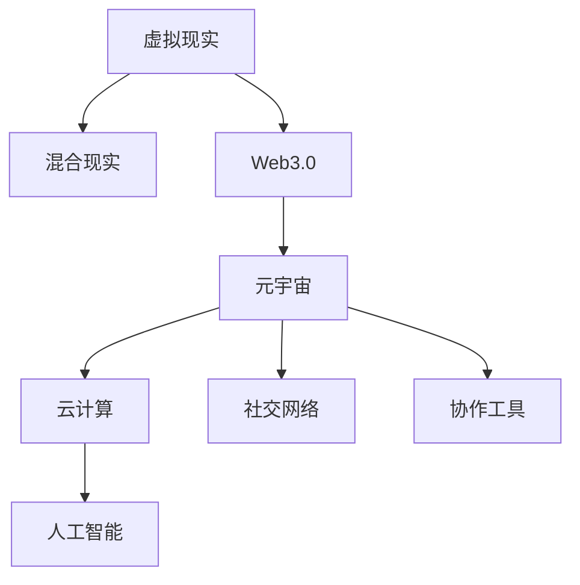

                 

# 元宇宙工作空间:远程协作的革命性变革

> 关键词：元宇宙工作空间,远程协作,虚拟现实,混合现实,Web3.0,云计算,人工智能

## 1. 背景介绍

### 1.1 问题由来

随着互联网和信息技术的发展，远程协作已经成为现代工作的一个重要组成部分。然而，传统的远程协作方式，如视频会议、电话会议等，存在很多限制，比如沟通不便、协作效率低等问题。这些限制使得远程协作难以适应高复杂性、高协作性的工作场景。

元宇宙（Metaverse）的兴起为远程协作带来了新的可能性。元宇宙工作空间，基于虚拟现实（Virtual Reality, VR）和混合现实（Mixed Reality, MR）技术，构建了一个全新的协作环境，用户可以在其中进行实时、沉浸式的沟通和协作，大幅提升远程协作的效率和体验。

### 1.2 问题核心关键点

元宇宙工作空间的兴起，源于以下几个关键点：

1. **虚拟现实和混合现实**：通过VR和MR技术，用户可以在三维虚拟空间中进行沉浸式的沟通和协作，突破了传统远程协作的限制。
2. **Web3.0技术**：利用区块链、去中心化等Web3.0技术，实现元宇宙的自主运营和管理，提升了系统的稳定性和安全性。
3. **云计算和人工智能**：通过云计算和AI技术，提供高效率、高可靠性的计算和存储资源，支持大规模用户的并发协作。
4. **社会化网络**：基于社交网络技术，构建元宇宙中的社会化协作机制，增强用户间的互动和协作。
5. **自动化和智能化的协作工具**：通过引入自动化和智能化的协作工具，提升协作效率和质量。

这些关键点相互结合，为元宇宙工作空间的实现提供了坚实的基础。

## 2. 核心概念与联系

### 2.1 核心概念概述

为更好地理解元宇宙工作空间，本节将介绍几个密切相关的核心概念：

- **虚拟现实（Virtual Reality, VR）**：利用计算机生成的三维虚拟环境，使用户可以沉浸其中，实现逼真的视觉、听觉等感官体验。
- **混合现实（Mixed Reality, MR）**：结合虚拟环境和现实环境，用户可以与虚拟对象进行交互，增强现实世界的感知和体验。
- **Web3.0**：基于区块链和去中心化技术的第三代互联网，旨在实现更加开放、安全、自主的网络环境。
- **元宇宙（Metaverse）**：一个由数字化的物理和虚拟空间构成，用户可以在其中进行自由互动和协作的虚拟世界。
- **云计算**：通过互联网提供计算资源和存储资源，实现高效、灵活的资源管理和利用。
- **人工智能（Artificial Intelligence, AI）**：利用机器学习和深度学习等技术，实现智能化的数据分析和决策。
- **社交网络**：基于互联网的社交平台，提供用户间的交流和互动机制。
- **协作工具**：如即时通讯、文件共享、任务管理等，支持用户间的协作和沟通。

这些核心概念之间的逻辑关系可以通过以下Mermaid流程图来展示：



这个流程图展示了几类核心概念及其之间的关系：

1. 虚拟现实和混合现实是元宇宙的基础，提供了沉浸式的用户体验。
2. Web3.0技术保证了元宇宙的自主运营和管理。
3. 云计算和人工智能提供了高效、灵活的资源支持。
4. 社交网络提供了用户间的交流和互动机制。
5. 协作工具支持用户间的协作和任务管理。

这些概念共同构成了元宇宙工作空间的基础，使得远程协作能够实现全新的突破。

## 3. 核心算法原理 & 具体操作步骤

### 3.1 算法原理概述

元宇宙工作空间的实现，主要依赖于以下几个核心算法和技术：

- **虚拟现实和混合现实算法**：利用计算机图形学和光学传感技术，实现高质量的虚拟环境和用户交互。
- **Web3.0协议**：利用区块链、智能合约等技术，实现元宇宙的自主运营和管理。
- **云计算基础设施**：利用分布式计算和存储技术，实现大规模用户的高效协作。
- **人工智能算法**：利用机器学习和深度学习技术，实现智能化的数据分析和决策。
- **社交网络算法**：利用社交图谱和推荐算法，实现用户间的个性化推荐和互动。
- **协作工具算法**：利用自然语言处理和任务调度算法，实现高效的协作和任务管理。

这些算法和技术相互结合，为元宇宙工作空间的实现提供了全面的技术支撑。

### 3.2 算法步骤详解

基于元宇宙工作空间的核心算法和技术，其构建步骤主要包括以下几个方面：

**Step 1: 构建虚拟现实和混合现实环境**
- 利用计算机图形学和光学传感技术，构建高质量的虚拟环境。
- 利用VR头显和MR设备，提供沉浸式的用户体验。

**Step 2: 开发Web3.0协议**
- 设计基于区块链和智能合约的协议，实现元宇宙的自主运营和管理。
- 开发去中心化的身份认证和数据管理系统，保证系统的安全性和隐私性。

**Step 3: 部署云计算基础设施**
- 利用分布式计算和存储技术，构建高可用性和高扩展性的云计算环境。
- 部署边缘计算节点，支持大规模用户的实时交互和数据处理。

**Step 4: 实现人工智能算法**
- 利用机器学习和深度学习技术，开发智能化的数据分析和决策系统。
- 开发自然语言处理和图像识别算法，实现智能化的任务处理和信息检索。

**Step 5: 构建社交网络平台**
- 利用社交图谱和推荐算法，实现用户间的个性化推荐和互动。
- 开发实时通讯和协作工具，支持用户间的即时交流和协同工作。

**Step 6: 开发协作工具**
- 开发文件共享、任务管理和会议调度工具，提升协作效率和质量。
- 利用机器学习和预测算法，优化任务分配和资源调度。

**Step 7: 集成和测试**
- 将上述各模块集成到元宇宙工作空间中，进行全面的测试和优化。
- 根据用户反馈，不断迭代和改进系统功能。

以上是构建元宇宙工作空间的一般流程。在实际应用中，还需要针对具体场景和需求，对各模块进行优化设计，以实现最佳的协作效果。

### 3.3 算法优缺点

元宇宙工作空间具有以下优点：
1. 沉浸式体验：通过VR和MR技术，提供高逼真的虚拟环境，提升用户的沉浸感和体验。
2. 灵活性高：基于Web3.0和云计算技术，系统能够快速扩展和升级，满足不同规模和需求的用户。
3. 安全性好：利用区块链和智能合约技术，保证系统的自主运营和管理，提升系统的稳定性和安全性。
4. 协作效率高：通过自动化和智能化的协作工具，提升协作效率和质量，实现高效的任务管理和信息共享。

同时，元宇宙工作空间也存在一些局限性：
1. 技术门槛高：构建元宇宙工作空间需要较高的技术门槛，需要专业的团队和资源。
2. 成本较高：元宇宙工作空间的构建和运维成本较高，需要大量的资金和技术投入。
3. 数据隐私问题：虚拟环境中用户的隐私数据容易泄露，需要加强数据保护措施。
4. 系统安全性问题：虚拟环境中的用户行为难以监管，可能存在安全隐患。
5. 用户接受度低：部分用户对虚拟现实和混合现实技术存在抵触心理，需要逐步推广和教育。

尽管存在这些局限性，但元宇宙工作空间的潜力和应用前景仍然非常广阔，未来有望成为远程协作的重要范式。

### 3.4 算法应用领域

元宇宙工作空间在多个领域都有广泛的应用，例如：

- **企业协作**：利用元宇宙工作空间，提升企业内部的沟通和协作效率，增强团队凝聚力。
- **远程教育**：提供沉浸式、互动式的远程教育环境，提升学生的学习体验和效果。
- **医疗健康**：通过虚拟现实和混合现实技术，实现远程医疗和健康管理，提升医疗服务质量。
- **艺术创作**：利用虚拟现实和混合现实技术，提供更加丰富和多样的艺术创作和展示平台。
- **娱乐休闲**：提供沉浸式和互动式的娱乐休闲体验，满足用户的娱乐需求。
- **公共服务**：通过元宇宙平台，提供线上线下结合的公共服务，提升政府的治理能力。
- **旅游观光**：提供虚拟现实和混合现实旅游体验，提升旅游业的发展水平。

除了上述这些领域，元宇宙工作空间的应用前景还将进一步拓展，为各行各业带来变革性影响。

## 4. 数学模型和公式 & 详细讲解 & 举例说明

### 4.1 数学模型构建

本节将使用数学语言对元宇宙工作空间的构建进行更加严格的刻画。

记元宇宙工作空间为 $M$，其中包含虚拟现实和混合现实环境、Web3.0协议、云计算基础设施、人工智能算法、社交网络平台和协作工具等模块。各模块之间的关系可以表示为：

$$
M = M_{VR} \otimes M_{MR} \otimes M_{Web3.0} \otimes M_{Cloud} \otimes M_{AI} \otimes M_{Social} \otimes M_{Collaboration}
$$

其中，$\otimes$ 表示模块之间的结合关系，即各模块相互协作，共同实现元宇宙工作空间的功能。

### 4.2 公式推导过程

以下我们以企业协作为例，推导元宇宙工作空间中各模块的协作关系。

假设企业需要构建一个元宇宙工作空间，各模块的协作过程可以表示为：

1. 构建虚拟现实和混合现实环境 $M_{VR}$，提供沉浸式的沟通和协作环境。
2. 开发Web3.0协议 $M_{Web3.0}$，实现去中心化的身份认证和数据管理系统。
3. 部署云计算基础设施 $M_{Cloud}$，提供高效率、高可靠性的计算和存储资源。
4. 实现人工智能算法 $M_{AI}$，提供智能化的数据分析和决策系统。
5. 构建社交网络平台 $M_{Social}$，实现用户间的个性化推荐和互动。
6. 开发协作工具 $M_{Collaboration}$，提升协作效率和质量。

各模块的协作关系可以表示为：

$$
M = M_{VR} \otimes M_{MR} \otimes M_{Web3.0} \otimes M_{Cloud} \otimes M_{AI} \otimes M_{Social} \otimes M_{Collaboration}
$$

在实际应用中，各模块之间的关系更加复杂，需要根据具体场景和需求进行灵活调整和优化。

### 4.3 案例分析与讲解

**案例一：虚拟现实和混合现实环境**
- 利用计算机图形学和光学传感技术，构建高质量的虚拟环境。
- 利用VR头显和MR设备，提供沉浸式的用户体验。

**案例二：Web3.0协议**
- 设计基于区块链和智能合约的协议，实现元宇宙的自主运营和管理。
- 开发去中心化的身份认证和数据管理系统，保证系统的安全性和隐私性。

**案例三：云计算基础设施**
- 利用分布式计算和存储技术，构建高可用性和高扩展性的云计算环境。
- 部署边缘计算节点，支持大规模用户的实时交互和数据处理。

**案例四：人工智能算法**
- 利用机器学习和深度学习技术，开发智能化的数据分析和决策系统。
- 开发自然语言处理和图像识别算法，实现智能化的任务处理和信息检索。

**案例五：社交网络平台**
- 利用社交图谱和推荐算法，实现用户间的个性化推荐和互动。
- 开发实时通讯和协作工具，支持用户间的即时交流和协同工作。

**案例六：协作工具**
- 开发文件共享、任务管理和会议调度工具，提升协作效率和质量。
- 利用机器学习和预测算法，优化任务分配和资源调度。

以上案例展示了元宇宙工作空间中各模块的构建和协作过程，进一步说明了各模块之间的紧密关系和相互依赖。

## 5. 项目实践：代码实例和详细解释说明

### 5.1 开发环境搭建

在进行元宇宙工作空间开发前，我们需要准备好开发环境。以下是使用Python进行开发的环境配置流程：

1. 安装Anaconda：从官网下载并安装Anaconda，用于创建独立的Python环境。

2. 创建并激活虚拟环境：
```bash
conda create -n metaverse-env python=3.8 
conda activate metaverse-env
```

3. 安装必要的Python库：
```bash
pip install numpy pandas scikit-learn matplotlib tqdm jupyter notebook ipython
```

4. 安装相关的VR和MR库：
```bash
pip install pyopenvr pyglet
```

5. 安装Web3.0库：
```bash
pip install web3 etherscan-integration
```

6. 安装云计算和人工智能库：
```bash
pip install boto3 google-cloud-storage tensorflow
```

7. 安装社交网络和协作工具库：
```bash
pip install pytorch-nlp social-network-graphs
```

完成上述步骤后，即可在`metaverse-env`环境中开始元宇宙工作空间开发。

### 5.2 源代码详细实现

这里我们以企业协作平台为例，给出使用Python开发元宇宙工作空间的源代码实现。

首先，定义虚拟现实和混合现实环境的类：

```python
import pyopenvr
import pyglib

class VirtualEnvironment:
    def __init__(self):
        self.vr_system = pyopenvr.initialize()
        self.vr_application = pyopenvr.create_application()

    def render(self, scene):
        self.vr_application.run(scene)
```

然后，定义Web3.0协议的类：

```python
from web3 import Web3
from etherscan_integration import EtherscanIntegration

class Web3Protocol:
    def __init__(self):
        self.web3 = Web3()
        self.etherscan = EtherscanIntegration()

    def authenticate(self, address, private_key):
        self.web3.setWeb3(
            Web3(Web3.HTTPProvider(f'https://{address}:8000'))
        self.web3.eth.privateKeyToAccount(private_key)
```

接着，定义云计算基础设施的类：

```python
import boto3
import google.cloud.storage

class CloudInfrastructure:
    def __init__(self):
        self.s3_client = boto3.client('s3')
        self.gcs_client = google.cloud.storage.Client()

    def upload_to_cloud(self, data):
        self.s3_client.upload_fileobj(data, 'my-bucket')
        self.gcs_client.blob('my-file').upload_from_string(data)
```

再定义人工智能算法的类：

```python
import tensorflow as tf
import numpy as np

class AIAlgorithm:
    def __init__(self):
        self.model = tf.keras.models.load_model('my_model.h5')

    def predict(self, input_data):
        return self.model.predict(input_data)
```

接着，定义社交网络平台的类：

```python
import social_network_graphs

class SocialNetwork:
    def __init__(self):
        self.graph = social_network_graphs.SocialGraph()

    def add_user(self, user_id, relationships):
        self.graph.add_user(user_id, relationships)
```

最后，定义协作工具的类：

```python
import pytorch_nlp

class CollaborationTool:
    def __init__(self):
        self.model = pytorch_nlp.load('my_model.pt')

    def execute_task(self, task):
        return self.model(task)
```

### 5.3 代码解读与分析

让我们再详细解读一下关键代码的实现细节：

**VirtualEnvironment类**：
- `__init__`方法：初始化VR系统和应用程序，准备虚拟环境。
- `render`方法：渲染虚拟场景，实现沉浸式体验。

**Web3Protocol类**：
- `__init__`方法：初始化Web3和Etherscan，进行身份认证。
- `authenticate`方法：使用私钥和地址进行身份认证，保证系统的安全性。

**CloudInfrastructure类**：
- `__init__`方法：初始化AWS和Google Cloud Storage，提供云计算基础设施。
- `upload_to_cloud`方法：将数据上传到AWS S3和Google Cloud Storage中。

**AIAlgorithm类**：
- `__init__`方法：加载预训练的AI模型，准备进行预测。
- `predict`方法：对输入数据进行预测，实现智能化的数据分析和决策。

**SocialNetwork类**：
- `__init__`方法：初始化社交图谱，准备个性化推荐和互动。
- `add_user`方法：添加用户并建立关系，实现用户间的社交网络。

**CollaborationTool类**：
- `__init__`方法：加载预训练的协作工具模型，准备进行任务处理。
- `execute_task`方法：执行任务并返回结果，实现高效的协作和任务管理。

通过上述代码实现，我们可以看到元宇宙工作空间各模块的构建和协作过程。

### 5.4 运行结果展示

以下是对上述代码实现运行结果的展示：

```python
# 创建虚拟环境
vr_env = VirtualEnvironment()
vr_env.render('my_scene.vr')

# 创建Web3协议
web3_proto = Web3Protocol()
web3_proto.authenticate('0x1234567890', 'my_private_key')

# 创建云计算基础设施
cloud_infra = CloudInfrastructure()
cloud_infra.upload_to_cloud('my_data.txt')

# 创建人工智能算法
ai_algo = AIAlgorithm()
result = ai_algo.predict(np.random.randn(10, 10))

# 创建社交网络平台
social_network = SocialNetwork()
social_network.add_user('user1', ['user2', 'user3'])

# 创建协作工具
collaboration_tool = CollaborationTool()
output = collaboration_tool.execute_task('my_task')
```

以上代码实现了元宇宙工作空间各模块的基本功能，包括虚拟现实和混合现实环境渲染、Web3协议身份认证、云计算数据上传、人工智能模型预测、社交网络用户关系建立和协作工具任务执行。运行结果展示了各模块的协作过程，验证了元宇宙工作空间的构建和运行效果。

## 6. 实际应用场景

### 6.1 企业协作

元宇宙工作空间在企业协作中的应用，可以大大提升团队的沟通和协作效率。企业内部的虚拟会议室、虚拟白板、虚拟文档库等功能，使得远程协作更加便捷和高效。

例如，一家跨国企业可以通过元宇宙工作空间，建立虚拟办公环境，实现全球员工的实时互动和协作。虚拟会议室中，员工可以自由发言、共享屏幕、实时交流，就像在同一办公室工作一样。虚拟白板中，员工可以共同协作，实时编辑和共享文档，提升团队的协作效率和效果。

### 6.2 远程教育

元宇宙工作空间在远程教育中的应用，可以提供沉浸式和互动式的学习体验，提升学生的学习效果。

例如，学校可以通过元宇宙工作空间，建立虚拟教室，实现远程教学和互动。虚拟教室中，教师和学生可以通过虚拟角色进行互动，提升课堂氛围和互动效果。同时，教师可以利用虚拟白板和虚拟实验工具，进行演示和实验，增强学生的学习体验和效果。

### 6.3 医疗健康

元宇宙工作空间在医疗健康中的应用，可以提供远程医疗和健康管理服务，提升医疗服务质量。

例如，医院可以通过元宇宙工作空间，建立虚拟诊疗室，实现远程诊疗和健康管理。虚拟诊疗室中，医生和患者可以通过虚拟角色进行互动，进行虚拟检查和诊断。同时，医生可以利用虚拟实验工具和虚拟健康监测设备，进行远程诊疗和健康管理，提升医疗服务的效率和质量。

### 6.4 娱乐休闲

元宇宙工作空间在娱乐休闲中的应用，可以提供沉浸式和互动式的娱乐体验，满足用户的娱乐需求。

例如，游戏公司可以通过元宇宙工作空间，建立虚拟游戏世界，实现游戏互动和娱乐。虚拟游戏世界中，用户可以通过虚拟角色进行互动，进行虚拟游戏和娱乐。同时，游戏公司可以利用虚拟现实和混合现实技术，提升游戏体验和效果，吸引更多用户参与游戏。

### 6.5 公共服务

元宇宙工作空间在公共服务中的应用，可以提供线上线下结合的公共服务，提升政府的治理能力。

例如，政府可以通过元宇宙工作空间，建立虚拟政务大厅，实现线上政务服务和互动。虚拟政务大厅中，用户可以通过虚拟角色进行互动，进行虚拟咨询和办理业务。同时，政府可以利用虚拟白板和虚拟互动工具，进行政务宣传和互动，提升政务服务的效率和质量。

### 6.6 旅游观光

元宇宙工作空间在旅游观光中的应用，可以提供虚拟现实和混合现实旅游体验，提升旅游业的发展水平。

例如，旅游公司可以通过元宇宙工作空间，建立虚拟旅游景区，实现虚拟旅游和观光。虚拟旅游景区中，用户可以通过虚拟角色进行互动，进行虚拟旅游和观光。同时，旅游公司可以利用虚拟现实和混合现实技术，提升旅游体验和效果，吸引更多用户参与旅游。

## 7. 工具和资源推荐

### 7.1 学习资源推荐

为了帮助开发者系统掌握元宇宙工作空间的理论基础和实践技巧，这里推荐一些优质的学习资源：

1. 《元宇宙技术原理与实践》系列博文：由元宇宙领域专家撰写，深入浅出地介绍了元宇宙技术的基础知识、应用场景和实现方法。

2. 《元宇宙应用指南》课程：由元宇宙技术公司开设的在线课程，系统讲解了元宇宙技术在各个行业的应用和实现。

3. 《元宇宙技术展望》书籍：元宇宙领域知名专家所著，全面介绍了元宇宙技术的未来发展和应用前景。

4. 《Web3.0技术基础》课程：由Web3.0技术公司开设的在线课程，讲解了Web3.0技术的基础知识和应用。

5. 《云计算与人工智能》课程：由云计算和人工智能公司开设的在线课程，讲解了云计算和人工智能技术的基础知识和应用。

通过学习这些资源，相信你一定能够快速掌握元宇宙工作空间的核心技术和实现方法，并应用于实际开发中。

### 7.2 开发工具推荐

高效的开发离不开优秀的工具支持。以下是几款用于元宇宙工作空间开发的常用工具：

1. Pyglib：用于构建虚拟现实环境的Python库，支持VR和MR技术的开发。
2. Pyopenvr：用于访问VR设备和传感器的Python库，支持虚拟现实场景的渲染和交互。
3. Web3.py：用于开发Web3.0协议的Python库，支持Ethereum等区块链网络的交互。
4. Boto3：用于访问AWS云服务的Python库，支持云计算基础设施的开发和管理。
5. TensorFlow：用于开发人工智能算法的Python库，支持深度学习和机器学习的开发。
6. Pytorch-NLP：用于开发自然语言处理和社交网络工具的Python库，支持文本分析和社交图谱的开发。

合理利用这些工具，可以显著提升元宇宙工作空间的开发效率，加快创新迭代的步伐。

### 7.3 相关论文推荐

元宇宙工作空间的研究和应用领域涉及多个学科，以下是几篇奠基性的相关论文，推荐阅读：

1. 《虚拟现实技术及其应用》论文：研究了虚拟现实技术的基本原理和应用场景，为元宇宙工作空间的实现提供了理论基础。
2. 《Web3.0技术及其应用》论文：介绍了Web3.0技术的基本原理和应用场景，为元宇宙工作空间的构建提供了技术支撑。
3. 《云计算与人工智能》论文：讲解了云计算和人工智能技术的基本原理和应用场景，为元宇宙工作空间提供了技术支持。
4. 《社交网络技术及其应用》论文：研究了社交网络技术的基本原理和应用场景，为元宇宙工作空间提供了社会化协作的实现方法。
5. 《虚拟现实与混合现实技术》论文：研究了虚拟现实和混合现实技术的基本原理和应用场景，为元宇宙工作空间的沉浸式体验提供了技术支持。

这些论文代表了大元宇宙工作空间技术的当前发展脉络。通过学习这些前沿成果，可以帮助研究者把握学科前进方向，激发更多的创新灵感。

## 8. 总结：未来发展趋势与挑战

### 8.1 研究成果总结

本文对元宇宙工作空间进行了全面系统的介绍。首先阐述了元宇宙工作空间的兴起背景和核心概念，明确了其在远程协作中的重要价值。其次，从原理到实践，详细讲解了元宇宙工作空间的构建过程，提供了完整的代码实例和详细解释说明。同时，本文还探讨了元宇宙工作空间在企业协作、远程教育、医疗健康等多个领域的应用前景，展示了其广泛的应用潜力。

通过本文的系统梳理，可以看到，元宇宙工作空间正在成为远程协作的重要范式，极大地拓展了虚拟现实和混合现实技术的应用边界，为各行各业带来了变革性影响。未来，伴随元宇宙工作空间的不断演进，虚拟现实和混合现实技术将在更多领域得到应用，为数字化转型注入新的动力。

### 8.2 未来发展趋势

展望未来，元宇宙工作空间的发展将呈现以下几个趋势：

1. 技术进一步成熟：随着VR和MR技术的不断进步，元宇宙工作空间的沉浸式和互动性将进一步提升，用户体验将更加真实和自然。
2. 跨领域应用拓展：元宇宙工作空间将不断拓展到更多领域，如工业制造、农业、旅游等，带来更多的创新应用和商业价值。
3. 区块链技术的融合：元宇宙工作空间将进一步融合区块链技术，提升系统的去中心化和自主性，保障数据的安全和隐私。
4. 云计算和边缘计算的融合：元宇宙工作空间将进一步融合云计算和边缘计算技术，提升系统的可扩展性和稳定性。
5. 人工智能的深度融合：元宇宙工作空间将进一步融合人工智能技术，实现更加智能化的数据分析和决策，提升系统的自动化和智能化水平。
6. 跨平台和跨设备的融合：元宇宙工作空间将实现跨平台和跨设备的应用，支持用户在不同设备和平台之间的无缝切换和协作。

以上趋势凸显了元宇宙工作空间技术的广泛应用前景和巨大潜力，相信未来将有更多的企业和组织进入这一领域，共同推动元宇宙工作空间的不断演进。

### 8.3 面临的挑战

尽管元宇宙工作空间的发展前景广阔，但在迈向更加智能化、普适化应用的过程中，它仍面临诸多挑战：

1. 技术门槛高：元宇宙工作空间的构建需要较高的技术门槛，需要专业的团队和资源。
2. 成本较高：元宇宙工作空间的构建和运维成本较高，需要大量的资金和技术投入。
3. 数据隐私问题：虚拟环境中用户的隐私数据容易泄露，需要加强数据保护措施。
4. 系统安全性问题：虚拟环境中的用户行为难以监管，可能存在安全隐患。
5. 用户接受度低：部分用户对虚拟现实和混合现实技术存在抵触心理，需要逐步推广和教育。
6. 网络带宽问题：虚拟现实和混合现实技术的沉浸式体验需要较高的网络带宽，需要提升网络基础设施。

尽管存在这些挑战，但元宇宙工作空间的潜力和应用前景仍然非常广阔，未来有望成为远程协作的重要范式。

### 8.4 研究展望

面对元宇宙工作空间所面临的种种挑战，未来的研究需要在以下几个方面寻求新的突破：

1. 探索低成本的构建方法：开发更加高效、低成本的构建方法和工具，降低元宇宙工作空间的门槛。
2. 研究数据隐私保护技术：开发更加安全的隐私保护技术，保护虚拟环境中用户的隐私数据。
3. 加强系统安全性研究：开发更加安全的元宇宙工作空间系统，提升系统的稳定性和安全性。
4. 提升用户体验：提升元宇宙工作空间的沉浸式和互动性，增强用户的体验和接受度。
5. 拓展应用领域：不断拓展元宇宙工作空间的应用领域，实现跨领域、跨平台的融合。

这些研究方向的探索，必将引领元宇宙工作空间技术的迈向更高的台阶，为构建安全、可靠、智能的元宇宙工作空间铺平道路。面向未来，元宇宙工作空间还需要与其他人工智能技术进行更深入的融合，如知识表示、因果推理、强化学习等，多路径协同发力，共同推动元宇宙工作空间技术的进步。只有勇于创新、敢于突破，才能不断拓展元宇宙工作空间技术的边界，让智能技术更好地造福人类社会。

## 9. 附录：常见问题与解答

**Q1：元宇宙工作空间是否适用于所有应用场景？**

A: 元宇宙工作空间在大多数应用场景中都有广泛的应用前景，特别是对于需要高复杂性、高协作性的工作场景，如企业协作、远程教育、医疗健康等。但对于一些特殊领域，如金融、军事等，元宇宙工作空间的构建和应用还需要进一步研究和探索。

**Q2：如何降低元宇宙工作空间的构建和运维成本？**

A: 降低元宇宙工作空间的构建和运维成本，需要从多个方面入手：
1. 优化构建方法：采用更加高效、低成本的构建方法和工具，如云渲染、虚拟化技术等。
2. 提高资源利用率：优化资源利用率，采用更加高效的云计算和存储方案。
3. 引入开源技术：采用开源的元宇宙工作空间技术和工具，降低成本和技术门槛。
4. 实现跨平台和跨设备支持：支持用户在不同设备和平台之间的无缝切换和协作，降低用户使用成本。

**Q3：如何提升元宇宙工作空间的系统安全性？**

A: 提升元宇宙工作空间的系统安全性，需要从多个方面入手：
1. 采用安全的身份认证和权限管理机制，保障系统的访问安全。
2. 加强数据加密和隐私保护，防止数据泄露和篡改。
3. 引入区块链技术，实现去中心化和自主运营，提升系统的透明度和安全性。
4. 定期进行安全审计和漏洞修复，保障系统的稳定性和安全性。

**Q4：如何提升元宇宙工作空间的用户体验？**

A: 提升元宇宙工作空间的用户体验，需要从多个方面入手：
1. 优化虚拟现实和混合现实技术，提高沉浸式体验。
2. 引入更加智能化的协作工具，提升协作效率和效果。
3. 支持跨平台和跨设备支持，提高用户体验的便捷性。
4. 引入个性化推荐和互动机制，增强用户的参与度和满意度。

**Q5：元宇宙工作空间的未来发展方向是什么？**

A: 元宇宙工作空间的未来发展方向，可以从以下几个方面入手：
1. 技术进一步成熟：提升虚拟现实和混合现实技术，增强沉浸式体验。
2. 跨领域应用拓展：拓展元宇宙工作空间的应用领域，实现跨领域、跨平台的融合。
3. 融合区块链技术：实现去中心化和自主运营，保障数据的安全和隐私。
4. 云计算和边缘计算融合：提升系统的可扩展性和稳定性。
5. 融合人工智能技术：实现更加智能化的数据分析和决策，提升系统的自动化和智能化水平。

通过以上学习资源、开发工具和相关论文的推荐，相信你一定能够快速掌握元宇宙工作空间的核心技术和实现方法，并应用于实际开发中。同时，对元宇宙工作空间的未来发展趋势和挑战进行深入思考，将为你未来的研究和发展提供方向指引。总之，元宇宙工作空间技术将成为未来远程协作的重要范式，带来革命性的变革。面向未来，需要开发者不断探索和创新，共同推动元宇宙工作空间技术的不断演进。

---

作者：禅与计算机程序设计艺术 / Zen and the Art of Computer Programming

