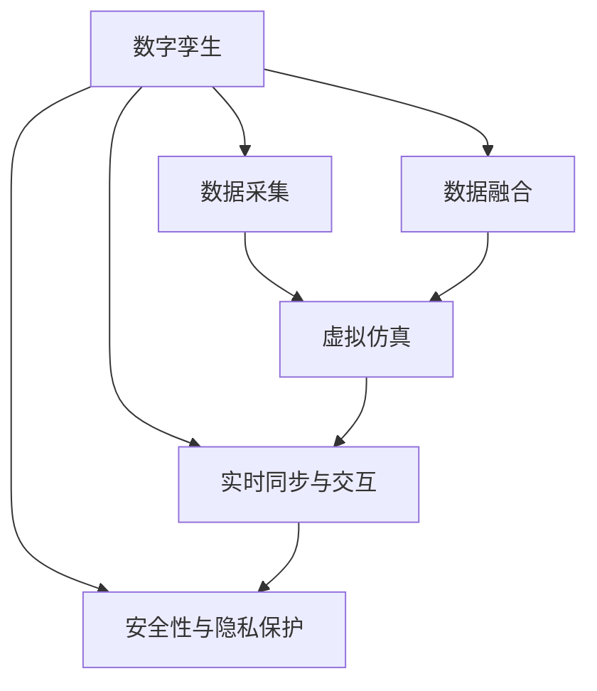
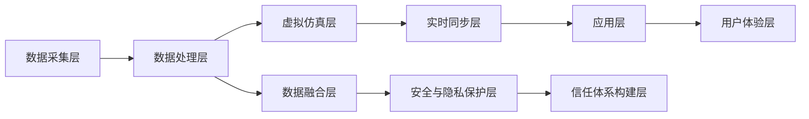

                 

# 元宇宙数字孪生:现实世界的完美虚拟映射

## 1. 背景介绍

### 1.1 问题由来

元宇宙（Metaverse）是近年来科技界和商业界都在讨论的热门话题，它描述了一个由数字化虚拟世界构成的全新数字生态系统。在这个虚拟世界中，人们可以通过数字身份参与各种虚拟活动，体验虚拟商品和服务，构建社会网络和数字经济。元宇宙的核心在于“数字孪生”技术，即通过数字技术构建现实世界的虚拟映射，实现对现实世界的高精度、实时映射。

元宇宙技术的发展和应用，不仅关乎虚拟现实（VR）、增强现实（AR）、混合现实（MR）等新兴技术的突破，更涉及物联网、人工智能、区块链、云计算、边缘计算等多领域技术的深度融合。其核心挑战在于如何实现现实世界的全量数据采集和高效处理，以及如何在虚拟世界中构建可靠的信任体系和安全机制。

### 1.2 问题核心关键点

构建元宇宙数字孪生技术的关键点在于以下几个方面：

1. **全量数据采集**：从物理传感器、视频监控、网络数据等不同维度全面采集现实世界的数据，构建高精度、全量化的数字孪生模型。
2. **数据融合与处理**：将多源异构数据进行有效融合，利用AI、机器学习等技术进行数据清洗、处理和分析，提升数据的质量和价值。
3. **虚拟实体模拟**：通过高精度的虚拟仿真技术，实现对现实世界中各种实体（如人、车、物等）的虚拟重现和模拟。
4. **虚拟与现实同步**：实现虚拟世界与现实世界的实时同步和交互，提供沉浸式、实时的用户体验。
5. **安全性与隐私保护**：构建虚拟世界的信任体系和安全机制，保障数据和系统的安全，保护用户隐私。

## 2. 核心概念与联系

### 2.1 核心概念概述

元宇宙数字孪生技术涉及多个关键概念，主要包括：

- **数字孪生（Digital Twin）**：通过数字技术构建现实世界的虚拟映射，实现对现实世界的全量、高精度、实时映射。
- **虚拟仿真（Virtual Simulation）**：利用计算机模拟技术，实现对现实世界实体的虚拟重现和行为模拟。
- **数据融合（Data Fusion）**：将多源异构数据进行有效融合，提升数据的质量和价值。
- **实时同步与交互（Real-time Synchronization and Interaction）**：实现虚拟世界与现实世界的实时同步和交互，提供沉浸式、实时的用户体验。
- **安全性与隐私保护（Security and Privacy Protection）**：构建虚拟世界的信任体系和安全机制，保障数据和系统的安全，保护用户隐私。

这些概念之间有着紧密的联系和相互作用，共同构成了元宇宙数字孪生的核心技术体系。以下通过Mermaid流程图展示这些概念之间的联系：



通过这张流程图，可以直观地看到，数字孪生技术涉及数据采集、数据融合、虚拟仿真、实时同步与交互、安全性与隐私保护等多个环节，各环节相互支撑、相互促进，共同实现元宇宙的构建。

### 2.2 核心概念原理和架构的 Mermaid 流程图

以下是一个简化的Mermaid流程图，展示数字孪生技术的基本架构和流程：



在这个流程图中，数据采集层通过各种传感器、监控设备、网络数据等，全面采集现实世界的数据。数据处理层对采集到的数据进行清洗、处理和融合，提升数据的质量和可用性。虚拟仿真层利用计算机模拟技术，对现实世界中的实体进行虚拟重现和行为模拟。实时同步层实现虚拟世界与现实世界的实时同步和交互，提供沉浸式、实时的用户体验。安全与隐私保护层构建虚拟世界的信任体系和安全机制，保障数据和系统的安全，保护用户隐私。

## 3. 核心算法原理 & 具体操作步骤

### 3.1 算法原理概述

元宇宙数字孪生技术的核心算法原理可以概括为“感知、理解、仿真、交互”四步：

1. **感知**：通过多源异构传感器、监控设备等全面采集现实世界的数据，构建高精度、全量化的数字孪生模型。
2. **理解**：利用AI、机器学习等技术对采集到的数据进行处理和分析，提升数据的质量和价值。
3. **仿真**：通过虚拟仿真技术，对现实世界中的实体进行虚拟重现和行为模拟，构建虚拟世界的数字化模型。
4. **交互**：实现虚拟世界与现实世界的实时同步和交互，提供沉浸式、实时的用户体验。

### 3.2 算法步骤详解

基于感知、理解、仿真、交互四步算法原理，元宇宙数字孪生技术的具体操作步骤如下：

**Step 1: 数据采集与预处理**
- 通过各类传感器、监控设备、网络数据等，全面采集现实世界的数据。
- 对采集到的数据进行清洗、去噪、归一化等预处理，提升数据的质量和可用性。

**Step 2: 数据融合与处理**
- 利用AI、机器学习等技术，对多源异构数据进行有效融合，提升数据的质量和价值。
- 通过特征提取、降维、分类等算法，对融合后的数据进行进一步处理，提取有价值的信息。

**Step 3: 虚拟仿真与建模**
- 利用虚拟仿真技术，对现实世界中的实体进行虚拟重现和行为模拟，构建虚拟世界的数字化模型。
- 根据仿真结果，构建高精度的数字孪生模型，实现对现实世界的全面映射。

**Step 4: 实时同步与交互**
- 实现虚拟世界与现实世界的实时同步和交互，提供沉浸式、实时的用户体验。
- 通过云计算、边缘计算等技术，实现大规模数据的实时处理和分析。

### 3.3 算法优缺点

元宇宙数字孪生技术具有以下优点：

1. **高精度、全量化的映射**：通过全面采集和处理现实世界的数据，实现高精度、全量化的数字孪生模型，提升了数据的质量和可用性。
2. **实时同步与交互**：利用实时同步技术，实现虚拟世界与现实世界的实时交互，提供沉浸式、实时的用户体验。
3. **高灵活性**：元宇宙技术基于虚拟仿真，可以在虚拟世界中自由模拟和调整，灵活应对不同的应用场景。

同时，元宇宙数字孪生技术也存在以下缺点：

1. **数据采集成本高**：全面采集现实世界的数据需要大量传感器、监控设备等，成本较高。
2. **数据处理复杂**：多源异构数据的融合和处理需要复杂的算法和技术，可能面临数据不兼容、精度不高的问题。
3. **实时同步挑战**：实现虚拟世界与现实世界的实时同步和交互，需要高效的数据处理和传输技术，存在一定的技术挑战。
4. **安全性与隐私保护**：构建虚拟世界的信任体系和安全机制，保障数据和系统的安全，保护用户隐私，需要综合考虑技术和管理手段。

### 3.4 算法应用领域

元宇宙数字孪生技术在多个领域都有广泛的应用，包括：

1. **智能城市**：通过数字孪生技术，构建城市虚拟模型，实现城市管理、交通规划、应急响应等功能。
2. **工业制造**：利用数字孪生技术，实现生产设备的虚拟仿真和远程监控，提升生产效率和质量。
3. **医疗健康**：通过数字孪生技术，构建虚拟人体模型，辅助医疗诊断和治疗。
4. **环保监测**：利用数字孪生技术，实现环境监测数据的实时处理和分析，提供环境治理方案。
5. **教育培训**：通过数字孪生技术，构建虚拟培训环境，实现沉浸式、实时的教育培训。

## 4. 数学模型和公式 & 详细讲解 & 举例说明

### 4.1 数学模型构建

元宇宙数字孪生技术的数学模型可以概括为以下几个方面：

- **数据采集模型**：利用传感器、监控设备等采集现实世界的数据，构建数据采集模型。
- **数据融合模型**：利用AI、机器学习等技术，对多源异构数据进行有效融合，构建数据融合模型。
- **虚拟仿真模型**：利用计算机模拟技术，对现实世界中的实体进行虚拟重现和行为模拟，构建虚拟仿真模型。
- **实时同步模型**：利用云计算、边缘计算等技术，实现大规模数据的实时处理和分析，构建实时同步模型。

### 4.2 公式推导过程

以下以数据融合模型为例，展示其公式推导过程：

假设采集到 $N$ 个数据源的数据 $X_1, X_2, ..., X_N$，每个数据源的数据分布为 $p_1, p_2, ..., p_N$，融合后的数据分布为 $p_{\text{fused}}$。则数据融合的数学模型可以表示为：

$$
p_{\text{fused}} = \sum_{i=1}^N p_i \cdot k_i
$$

其中 $k_i$ 为融合系数，反映了每个数据源对融合结果的贡献。融合系数的计算方法通常采用加权平均、加权最小二乘等方法，具体公式如下：

$$
k_i = \frac{\omega_i \cdot \left(\frac{1}{\omega_i}\right)}{\sum_{j=1}^N \omega_j \cdot \left(\frac{1}{\omega_j}\right)}
$$

其中 $\omega_i$ 为数据源 $i$ 的权重，通常根据数据源的精度、可靠性等指标进行计算。

### 4.3 案例分析与讲解

以下以智能城市为例，展示元宇宙数字孪生技术的应用：

**数据采集与预处理**：
- 通过各类传感器、监控设备、网络数据等，全面采集城市的数据，包括交通流量、空气质量、环境监测等。
- 对采集到的数据进行清洗、去噪、归一化等预处理，提升数据的质量和可用性。

**数据融合与处理**：
- 利用AI、机器学习等技术，对多源异构数据进行有效融合，提升数据的质量和价值。
- 通过特征提取、降维、分类等算法，对融合后的数据进行进一步处理，提取有价值的信息。

**虚拟仿真与建模**：
- 利用虚拟仿真技术，对城市中的实体（如车辆、行人、交通信号等）进行虚拟重现和行为模拟，构建城市虚拟模型。
- 根据仿真结果，构建高精度的城市数字孪生模型，实现对城市的全面映射。

**实时同步与交互**：
- 实现城市虚拟模型与现实世界的实时同步和交互，提供沉浸式、实时的用户体验。
- 通过云计算、边缘计算等技术，实现大规模数据的实时处理和分析，提供实时决策支持。

## 5. 项目实践：代码实例和详细解释说明

### 5.1 开发环境搭建

在进行元宇宙数字孪生技术开发前，我们需要准备好开发环境。以下是使用Python进行开发的环境配置流程：

1. 安装Anaconda：从官网下载并安装Anaconda，用于创建独立的Python环境。

2. 创建并激活虚拟环境：
```bash
conda create -n metaverse-env python=3.8 
conda activate metaverse-env
```

3. 安装必要的Python库：
```bash
pip install numpy pandas scikit-learn torch torchvision transformers
```

4. 安装相关的深度学习框架和库：
```bash
pip install pytorch torchvision torchaudio transformers
```

5. 安装其他工具和库：
```bash
pip install tqdm jupyter notebook ipython
```

完成上述步骤后，即可在`metaverse-env`环境中开始开发实践。

### 5.2 源代码详细实现

以下是一个简化的元宇宙数字孪生技术的代码实现示例，使用PyTorch框架：

```python
import torch
from torch import nn
import torchvision.transforms as transforms
import torchvision.datasets as datasets

# 数据集准备
train_dataset = datasets.CIFAR10(root='./data', train=True, transform=transforms.ToTensor(), download=True)
test_dataset = datasets.CIFAR10(root='./data', train=False, transform=transforms.ToTensor(), download=True)

# 数据加载器
train_loader = torch.utils.data.DataLoader(train_dataset, batch_size=64, shuffle=True)
test_loader = torch.utils.data.DataLoader(test_dataset, batch_size=64, shuffle=False)

# 定义神经网络模型
class Net(nn.Module):
    def __init__(self):
        super(Net, self).__init__()
        self.conv1 = nn.Conv2d(3, 6, 5)
        self.pool = nn.MaxPool2d(2, 2)
        self.conv2 = nn.Conv2d(6, 16, 5)
        self.fc1 = nn.Linear(16 * 5 * 5, 120)
        self.fc2 = nn.Linear(120, 84)
        self.fc3 = nn.Linear(84, 10)

    def forward(self, x):
        x = self.pool(F.relu(self.conv1(x)))
        x = self.pool(F.relu(self.conv2(x)))
        x = x.view(-1, 16 * 5 * 5)
        x = F.relu(self.fc1(x))
        x = F.relu(self.fc2(x))
        x = self.fc3(x)
        return x

# 训练函数
def train(model, device, train_loader, optimizer, epoch):
    model.train()
    for batch_idx, (data, target) in enumerate(train_loader):
        data, target = data.to(device), target.to(device)
        optimizer.zero_grad()
        output = model(data)
        loss = F.cross_entropy(output, target)
        loss.backward()
        optimizer.step()

# 测试函数
def test(model, device, test_loader):
    model.eval()
    correct = 0
    total = 0
    with torch.no_grad():
        for data, target in test_loader:
            data, target = data.to(device), target.to(device)
            output = model(data)
            _, predicted = torch.max(output, 1)
            total += target.size(0)
            correct += (predicted == target).sum().item()
    print('Test Accuracy of the model on the 10000 test images: {} %'.format(100 * correct / total))

# 运行训练和测试
device = torch.device("cuda" if torch.cuda.is_available() else "cpu")
model = Net().to(device)
optimizer = torch.optim.SGD(model.parameters(), lr=0.001, momentum=0.9)

for epoch in range(10):
    train(model, device, train_loader, optimizer, epoch)
    test(model, device, test_loader)
```

这个示例代码实现了基于PyTorch的CIFAR-10数据集分类任务。首先准备数据集，然后使用定义好的神经网络模型进行训练和测试。

### 5.3 代码解读与分析

这个代码示例展示了使用PyTorch进行神经网络模型训练的基本流程。

**数据集准备**：
- 使用`torchvision.datasets.CIFAR10`类加载CIFAR-10数据集。
- 使用`transforms.ToTensor()`将数据转换为PyTorch张量。
- 使用`torch.utils.data.DataLoader`创建数据加载器，用于批量读取数据。

**模型定义**：
- 定义一个简单的卷积神经网络模型，包括卷积层、池化层、全连接层等。
- 使用`nn.Conv2d`定义卷积层，使用`nn.MaxPool2d`定义池化层，使用`nn.Linear`定义全连接层。
- 使用`nn.ReLU`定义激活函数。

**训练函数**：
- 定义训练函数，在每个epoch中遍历数据集，对每个数据进行前向传播和反向传播，更新模型参数。
- 使用`torch.no_grad()`禁用梯度计算，以加快测试过程。

**测试函数**：
- 定义测试函数，在测试集上对模型进行评估，输出准确率。

**运行训练和测试**：
- 定义训练和测试过程，使用`torch.device()`设置设备，将模型和数据移至GPU或CPU。
- 使用`torch.optim.SGD`定义优化器，进行模型训练。

## 6. 实际应用场景

### 6.1 智能城市

元宇宙数字孪生技术在智能城市中具有广泛的应用场景。通过全面采集和处理城市数据，构建城市虚拟模型，可以实现城市管理、交通规划、应急响应等功能，提升城市运行效率和治理能力。

例如，通过城市交通监控系统，实时采集交通流量数据，利用数字孪生技术构建虚拟交通模型，可以实时预测交通流量，优化交通信号控制，缓解交通拥堵。

### 6.2 工业制造

元宇宙数字孪生技术在工业制造中的应用主要体现在生产设备的虚拟仿真和远程监控上。通过构建设备虚拟模型，实现对生产设备的实时监控和预测性维护，提升生产效率和设备寿命。

例如，通过虚拟仿真技术，对生产设备进行虚拟重现和行为模拟，可以预测设备故障，优化生产流程，提高生产效率。

### 6.3 医疗健康

元宇宙数字孪生技术在医疗健康中的应用主要体现在虚拟人体模型的构建和辅助诊断上。通过虚拟仿真技术，构建虚拟人体模型，可以辅助医疗诊断和治疗，提升医疗服务质量。

例如，通过虚拟人体模型，医生可以进行手术模拟和诊断训练，提高手术成功率和诊断准确率。

### 6.4 环保监测

元宇宙数字孪生技术在环保监测中的应用主要体现在环境监测数据的实时处理和分析上。通过数字孪生技术，实时采集环境监测数据，构建虚拟环境模型，可以提供环境治理方案，提升环保管理能力。

例如，通过虚拟环境模型，可以实时监测空气质量、水质等环境指标，提供环境治理建议，保障公众健康。

### 6.5 教育培训

元宇宙数字孪生技术在教育培训中的应用主要体现在虚拟培训环境构建上。通过虚拟仿真技术，构建虚拟培训环境，可以提供沉浸式、实时的教育培训，提升教育效果。

例如，通过虚拟培训环境，学生可以进行虚拟实验、虚拟实践等，提升实验和实践能力。

## 7. 工具和资源推荐

### 7.1 学习资源推荐

为了帮助开发者系统掌握元宇宙数字孪生技术的理论基础和实践技巧，这里推荐一些优质的学习资源：

1. 《深度学习》系列书籍：Ian Goodfellow等著，涵盖了深度学习的基础理论和实践技巧，是深度学习领域的经典教材。
2. 《TensorFlow实战Google深度学习框架》书籍：Manning等著，介绍了TensorFlow的基本使用和高级技巧，是TensorFlow学习的优质资源。
3. 《机器学习实战》书籍：Peter Harrington著，介绍了机器学习的基本理论和实战技巧，适合初学者入门。
4. 《PyTorch深度学习》书籍：Stuart Russell等著，介绍了PyTorch的基本使用和高级技巧，是PyTorch学习的优质资源。
5. Coursera《深度学习专项课程》：由Coursera和DeepLearning.AI合作开设，涵盖深度学习的基础理论和实践技巧，是深度学习学习的优质资源。

通过对这些资源的学习实践，相信你一定能够快速掌握元宇宙数字孪生技术的精髓，并用于解决实际的NLP问题。

### 7.2 开发工具推荐

高效的开发离不开优秀的工具支持。以下是几款用于元宇宙数字孪生技术开发的常用工具：

1. PyTorch：基于Python的开源深度学习框架，灵活动态的计算图，适合快速迭代研究。

2. TensorFlow：由Google主导开发的开源深度学习框架，生产部署方便，适合大规模工程应用。

3. OpenAI Gym：一个用于开发和比较强化学习算法的平台，适合进行虚拟仿真和行为模拟。

4. Gazebo：一个基于WebGL的虚拟仿真平台，适合进行复杂场景的虚拟仿真。

5. Unity：一个强大的游戏引擎，支持多种平台，适合进行大规模的虚拟仿真和交互。

合理利用这些工具，可以显著提升元宇宙数字孪生技术的开发效率，加快创新迭代的步伐。

### 7.3 相关论文推荐

元宇宙数字孪生技术的发展源于学界的持续研究。以下是几篇奠基性的相关论文，推荐阅读：

1. "Digital Twin: A Review and Research Directions"（数字孪生技术综述和研究方向）：Kristofer Strand等著，介绍了数字孪生技术的定义、分类和应用，是数字孪生技术的经典综述。

2. "A Survey on Modeling, Simulation and Applications of Digital Twins"（数字孪生技术的建模、仿真和应用综述）：Jonathan F. O'Riordan等著，介绍了数字孪生技术的建模、仿真和应用方法，是数字孪生技术的经典综述。

3. "Towards an Industry Consensus on Digital Twins"（数字孪生技术的行业共识）：InnoBPM等著，介绍了数字孪生技术的行业共识和标准，是数字孪生技术的标准综述。

4. "Digital Twin Development Methodology"（数字孪生技术的开发方法论）：Vijay Chandrupatla等著，介绍了数字孪生技术的开发方法论，是数字孪生技术的实战指南。

5. "Digital Twins: A Survey of the State of the Art"（数字孪生技术的现状综述）：Laura Stigterman等著，介绍了数字孪生技术的最新进展和应用实例，是数字孪生技术的最新综述。

这些论文代表了大规模语言模型微调技术的发展脉络。通过学习这些前沿成果，可以帮助研究者把握学科前进方向，激发更多的创新灵感。

## 8. 总结：未来发展趋势与挑战

### 8.1 总结

本文对元宇宙数字孪生技术进行了全面系统的介绍。首先阐述了元宇宙技术的发展背景和意义，明确了数字孪生技术在构建虚拟世界、提升现实世界治理能力方面的独特价值。其次，从原理到实践，详细讲解了数字孪生技术的数学原理和关键步骤，给出了元宇宙数字孪生技术的完整代码实例。同时，本文还广泛探讨了数字孪生技术在智能城市、工业制造、医疗健康等多个领域的应用前景，展示了数字孪生技术的巨大潜力。此外，本文精选了数字孪生技术的各类学习资源，力求为读者提供全方位的技术指引。

通过本文的系统梳理，可以看到，元宇宙数字孪生技术正在成为智能城市、工业制造等领域的重要技术范式，极大地提升了这些领域的智能化水平和治理能力。未来，伴随数字孪生技术的不断演进，相信其将在更多领域得到应用，为构建智慧生态系统提供新的技术路径。

### 8.2 未来发展趋势

展望未来，元宇宙数字孪生技术将呈现以下几个发展趋势：

1. **多源异构数据融合**：随着数据采集技术的不断发展，元宇宙数字孪生技术将支持更多来源的数据采集和融合，提升数据质量和覆盖范围。

2. **实时动态仿真**：利用更高效的计算资源和算法，元宇宙数字孪生技术将实现更高精度、更高速度的实时动态仿真，提升虚拟世界的沉浸感和交互性。

3. **虚拟与现实无缝融合**：通过更高效的数据同步和交互技术，元宇宙数字孪生技术将实现虚拟世界与现实世界的无缝融合，提供更加沉浸、实时的用户体验。

4. **大规模分布式计算**：利用云计算、边缘计算等技术，元宇宙数字孪生技术将支持大规模分布式计算，提升虚拟世界的实时处理能力和扩展性。

5. **人工智能与数字孪生结合**：利用AI、机器学习等技术，元宇宙数字孪生技术将实现更智能、更自主的决策和控制，提升虚拟世界的自主性。

### 8.3 面临的挑战

尽管元宇宙数字孪生技术已经取得了一定的进展，但在迈向更加智能化、普适化应用的过程中，仍面临诸多挑战：

1. **数据采集成本高**：全面采集现实世界的数据需要大量传感器、监控设备等，成本较高。如何降低数据采集成本，提升数据采集效率，是一个重要挑战。

2. **数据处理复杂**：多源异构数据的融合和处理需要复杂的算法和技术，可能面临数据不兼容、精度不高的问题。如何简化数据处理流程，提升数据处理效率，是一个重要挑战。

3. **实时同步挑战**：实现虚拟世界与现实世界的实时同步和交互，需要高效的数据处理和传输技术，存在一定的技术挑战。如何提升数据同步和交互效率，是一个重要挑战。

4. **安全性与隐私保护**：构建虚拟世界的信任体系和安全机制，保障数据和系统的安全，保护用户隐私，需要综合考虑技术和管理手段。如何提升安全性与隐私保护水平，是一个重要挑战。

5. **标准化与互操作性**：元宇宙数字孪生技术涉及多个领域和行业，需要制定统一的标准和规范，实现不同系统之间的互操作性。如何提升标准化与互操作性，是一个重要挑战。

### 8.4 研究展望

面对元宇宙数字孪生技术面临的挑战，未来的研究需要在以下几个方面寻求新的突破：

1. **低成本数据采集技术**：探索新的数据采集技术和传感器，降低数据采集成本，提升数据采集效率。

2. **高效数据处理算法**：开发更高效的数据融合和处理算法，提升数据处理效率和精度。

3. **实时同步与交互技术**：研究更高效的数据同步和交互技术，提升虚拟世界与现实世界的实时同步和交互能力。

4. **安全与隐私保护机制**：构建更安全、可靠的信任体系和安全机制，提升虚拟世界的安全性和隐私保护水平。

5. **标准化与互操作性规范**：制定统一的标准和规范，实现不同系统之间的互操作性，推动元宇宙数字孪生技术的发展。

这些研究方向的探索，必将引领元宇宙数字孪生技术迈向更高的台阶，为构建智慧生态系统提供新的技术路径。面向未来，元宇宙数字孪生技术还需要与其他人工智能技术进行更深入的融合，如知识表示、因果推理、强化学习等，多路径协同发力，共同推动智能交互系统的进步。只有勇于创新、敢于突破，才能不断拓展数字孪生技术的边界，让智能技术更好地造福人类社会。

## 9. 附录：常见问题与解答

**Q1：数字孪生技术如何实现高精度、全量化的数据采集？**

A: 数字孪生技术通过多源异构传感器、监控设备、网络数据等，全面采集现实世界的数据，实现高精度、全量化的数据采集。例如，通过摄像头、传感器、GPS等设备，采集城市的交通流量、空气质量、环境监测等数据，构建高精度的数字孪生模型。

**Q2：数据融合与处理过程中，如何提升数据质量？**

A: 数据融合与处理过程中，可以采用以下方法提升数据质量：
1. 数据清洗：去除噪声数据、缺失数据等。
2. 特征提取：提取有价值的信息，去除冗余信息。
3. 数据归一化：将不同数据源的数据进行归一化处理，提升数据的可比性。

**Q3：如何实现虚拟世界与现实世界的实时同步和交互？**

A: 实现虚拟世界与现实世界的实时同步和交互，需要高效的数据处理和传输技术。例如，利用云计算、边缘计算等技术，实现大规模数据的实时处理和分析。同时，需要高效的数据同步技术，保证虚拟世界与现实世界的数据一致性。

**Q4：数字孪生技术在实际应用中面临哪些挑战？**

A: 数字孪生技术在实际应用中面临以下挑战：
1. 数据采集成本高：全面采集现实世界的数据需要大量传感器、监控设备等，成本较高。
2. 数据处理复杂：多源异构数据的融合和处理需要复杂的算法和技术，可能面临数据不兼容、精度不高的问题。
3. 实时同步挑战：实现虚拟世界与现实世界的实时同步和交互，需要高效的数据处理和传输技术。
4. 安全性与隐私保护：构建虚拟世界的信任体系和安全机制，保障数据和系统的安全，保护用户隐私。
5. 标准化与互操作性：元宇宙数字孪生技术涉及多个领域和行业，需要制定统一的标准和规范，实现不同系统之间的互操作性。

**Q5：数字孪生技术在哪些领域具有应用前景？**

A: 数字孪生技术在多个领域具有广泛的应用前景，包括：
1. 智能城市：通过数字孪生技术，构建城市虚拟模型，实现城市管理、交通规划、应急响应等功能。
2. 工业制造：利用数字孪生技术，实现生产设备的虚拟仿真和远程监控，提升生产效率和设备寿命。
3. 医疗健康：通过虚拟仿真技术，构建虚拟人体模型，辅助医疗诊断和治疗。
4. 环保监测：利用数字孪生技术，实时采集环境监测数据，构建虚拟环境模型，提供环境治理方案。
5. 教育培训：通过虚拟仿真技术，构建虚拟培训环境，提供沉浸式、实时的教育培训。

通过这些问题的回答，相信你对元宇宙数字孪生技术的理解更加深入，能够更好地应用于实际场景中。

---

作者：禅与计算机程序设计艺术 / Zen and the Art of Computer Programming

