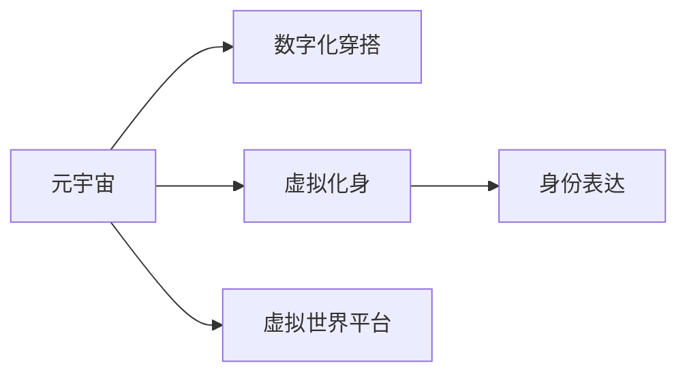

                 

# 元宇宙时尚:数字化穿搭与身份表达

## 1. 背景介绍

### 1.1 问题由来
随着技术的不断进步，元宇宙（Metaverse）的概念日益成为热门话题。元宇宙是一个由数字化的三维空间和用户交互系统构成的虚拟世界，其中用户可以自由地进行社交、娱乐、工作等各种活动。随着虚拟现实（VR）、增强现实（AR）、混合现实（MR）等技术的不断发展，元宇宙正在逐渐从概念走向现实。

在元宇宙中，数字化穿搭和身份表达成为用户身份认同的重要方式之一。不同于现实世界的穿搭，元宇宙中的穿搭更加自由多样，不受物理世界限制。用户可以通过穿戴设备或者虚拟化身，进入元宇宙并进行各种活动。数字化穿搭不仅可以反映用户的个性化风格，还能表达用户的身份和社交状态。

## 2. 核心概念与联系

### 2.1 核心概念概述

为更好地理解数字化穿搭与身份表达的原理与实现，本节将介绍几个密切相关的核心概念：

- **元宇宙（Metaverse）**：一个由虚拟现实技术、区块链技术、云计算技术等支持的数字世界，用户可以在其中自由交流、购物、工作等，与现实世界无缝融合。

- **数字化穿搭（Digital Fashion）**：指用户在虚拟世界中通过数字化的方式进行穿搭选择，包括服饰、配件、妆容等。

- **虚拟化身（Digital Avatar）**：用户在元宇宙中的虚拟形象，通常由3D模型或2D头像构成。

- **身份表达（Identity Expression）**：用户在元宇宙中通过虚拟身份展示自己的个性化和社会属性，如身份象征、兴趣爱好、社交状态等。

- **虚拟世界平台（Virtual World Platform）**：提供虚拟世界的底层架构，支持虚拟化身的创建、交互和管理。

这些核心概念之间的逻辑关系可以通过以下Mermaid流程图来展示：



这个流程图展示了元宇宙中的数字化穿搭、虚拟化身和身份表达之间的关系，以及这些概念与虚拟世界平台之间的联系。

## 3. 核心算法原理 & 具体操作步骤
### 3.1 算法原理概述

数字化穿搭与身份表达的实现，涉及大量的图像处理、3D建模和虚拟现实技术。其核心思想是通过计算机视觉、深度学习等技术，将用户的穿搭选择和身份信息数字化，并展示在虚拟世界中。

### 3.2 算法步骤详解

数字化穿搭与身份表达的实现流程主要包括：

**Step 1: 数据收集与预处理**
- 收集用户的穿搭图片和3D模型，对图片进行去噪、归一化等预处理操作，确保数据质量。
- 对3D模型进行贴图、着色等处理，使其更适合虚拟展示。

**Step 2: 穿搭选择与匹配**
- 使用计算机视觉技术，如图像分割、物体识别等，从穿搭图片中提取关键元素（如服装、配饰等）。
- 通过深度学习模型，如生成对抗网络（GAN）、自编码器等，将穿搭选择转换为虚拟化身上的展示效果。

**Step 3: 身份表达与个性化**
- 收集用户的身份信息，如社交状态、兴趣爱好等，通过自然语言处理技术进行语义分析。
- 使用生成模型，如变分自编码器（VAE）、风格迁移等，生成符合用户身份特征的虚拟化身。

**Step 4: 虚拟展示与交互**
- 将处理后的穿搭和虚拟化身数据上传至虚拟世界平台，展示在用户的虚拟身份上。
- 使用虚拟现实技术，如VR头盔、手柄等设备，实现虚拟化身的交互功能，如展示、交流等。

**Step 5: 用户反馈与优化**
- 收集用户在虚拟世界中的反馈，如穿搭满意度、社交体验等。
- 根据用户反馈，优化穿搭选择、身份表达和虚拟展示效果，提升用户体验。

### 3.3 算法优缺点

数字化穿搭与身份表达的实现，具有以下优点：

- **个性化**：数字化穿搭可以充分反映用户的个性化风格和身份特征，提供个性化的虚拟展示效果。
- **自由度**：用户可以在虚拟世界中自由选择穿搭和身份表达，不受物理世界的限制。
- **跨界融合**：虚拟世界平台支持虚拟化身的跨平台交互，方便用户在不同虚拟世界之间移动和交流。

同时，该方法也存在一些局限性：

- **技术复杂性**：实现过程中需要涉及大量的图像处理和3D建模技术，技术难度较高。
- **硬件要求**：虚拟现实设备的普及和性能提升仍是当前的主要挑战。
- **隐私保护**：用户的穿搭选择和身份信息需要保护，避免数据泄露。
- **用户体验**：虚拟世界的交互体验仍有提升空间，需要进一步优化。

### 3.4 算法应用领域

数字化穿搭与身份表达的技术在多个领域中具有广泛的应用前景：

- **时尚行业**：虚拟时装秀、虚拟试衣间等应用，可以在不增加物理成本的情况下，展示更多元化的穿搭选择。
- **游戏娱乐**：虚拟游戏世界中的角色穿搭、个性化定制等，提升玩家的游戏体验。
- **社交媒体**：社交平台上展示虚拟化身的穿搭和身份特征，增加用户的社交互动。
- **电商零售**：虚拟试穿、虚拟模特等应用，降低电商成本，提升用户体验。
- **虚拟现实体验**：虚拟旅游、虚拟展览等应用，提供沉浸式的穿搭体验。

## 4. 数学模型和公式 & 详细讲解 & 举例说明
### 4.1 数学模型构建

数字化穿搭与身份表达的实现，涉及大量的图像处理和3D建模技术，需要构建数学模型来描述这些过程。

假设用户上传的穿搭图片为 $I$，3D模型为 $M$。根据上述流程，我们可以通过以下数学模型来实现穿搭选择与匹配：

$$
\mathcal{M} = f(I; \theta_1)
$$

其中 $\theta_1$ 为穿搭选择模型的参数，$\mathcal{M}$ 为穿搭匹配结果，即虚拟化身上的展示效果。

### 4.2 公式推导过程

以穿搭选择中的图像分割为例，假设用户上传的图片为 $I$，分割结果为 $S$。可以定义一个二分类损失函数 $L$ 来衡量分割结果与真实标签 $T$ 的差异：

$$
L = \frac{1}{N} \sum_{i=1}^N \ell(S_i, T_i)
$$

其中 $\ell$ 为损失函数，如交叉熵损失、Dice损失等。通过对损失函数进行反向传播，更新模型参数 $\theta_1$，以最小化损失函数，得到最优的穿搭选择结果。

### 4.3 案例分析与讲解

假设有一个穿搭选择场景，用户上传了一张穿搭图片 $I$。模型首先使用图像分割算法对图片进行分割，得到服装、配饰等关键元素 $S$。然后使用深度学习模型（如GAN），生成虚拟化身上的穿搭效果 $\mathcal{M}$。

具体来说，假设用户上传的图片为：

```
I = [img1, img2, ..., imgN]
```

其中 $img_i$ 为第 $i$ 张图片。模型的分割结果为：

```
S = [s1, s2, ..., sN]
```

其中 $s_i$ 为第 $i$ 张图片的分割结果。模型的穿搭匹配结果为：

```
M = [m1, m2, ..., mN]
```

其中 $m_i$ 为第 $i$ 张图片对应的虚拟化身穿搭效果。最终生成的穿搭效果 $\mathcal{M}$ 可以表示为：

$$
\mathcal{M} = [m1, m2, ..., mN]
$$

## 5. 项目实践：代码实例和详细解释说明
### 5.1 开发环境搭建

在进行项目实践前，我们需要准备好开发环境。以下是使用Python进行PyTorch开发的环境配置流程：

1. 安装Anaconda：从官网下载并安装Anaconda，用于创建独立的Python环境。

2. 创建并激活虚拟环境：
```bash
conda create -n pytorch-env python=3.8 
conda activate pytorch-env
```

3. 安装PyTorch：根据CUDA版本，从官网获取对应的安装命令。例如：
```bash
conda install pytorch torchvision torchaudio cudatoolkit=11.1 -c pytorch -c conda-forge
```

4. 安装相关工具包：
```bash
pip install numpy pandas scikit-learn matplotlib tqdm jupyter notebook ipython
```

完成上述步骤后，即可在`pytorch-env`环境中开始项目实践。

### 5.2 源代码详细实现

这里我们以穿搭选择和匹配为例，给出使用PyTorch进行图像分割和GAN生成穿搭效果的代码实现。

首先，定义图像分割函数：

```python
import torch
from torchvision import transforms, models

# 定义图像预处理
transform = transforms.Compose([
    transforms.Resize((256, 256)),
    transforms.ToTensor(),
    transforms.Normalize(mean=[0.485, 0.456, 0.406], std=[0.229, 0.224, 0.225])
])

# 加载模型
model = models.unet.UNet(
    in_channels=3,
    out_channels=2,
    classes=['clothing', 'accessories'])

# 加载数据集
train_data = ...
train_loader = DataLoader(train_data, batch_size=4, shuffle=True)

# 图像分割过程
def segmentation(image):
    image_tensor = transform(image)
    with torch.no_grad():
        output = model(image_tensor.unsqueeze(0))
    return output[0]
```

接着，定义GAN模型：

```python
import torch.nn as nn
from torchvision import models

# 定义GAN模型结构
class GAN(nn.Module):
    def __init__(self):
        super(GAN, self).__init__()
        self.encoder = nn.Sequential(
            nn.Conv2d(3, 64, kernel_size=3, stride=1, padding=1),
            nn.ReLU(inplace=True),
            nn.Conv2d(64, 128, kernel_size=3, stride=2, padding=1),
            nn.ReLU(inplace=True),
            nn.Conv2d(128, 256, kernel_size=3, stride=2, padding=1),
            nn.ReLU(inplace=True),
            nn.Conv2d(256, 512, kernel_size=3, stride=2, padding=1),
            nn.ReLU(inplace=True),
            nn.Conv2d(512, 512, kernel_size=3, stride=1, padding=1),
            nn.ReLU(inplace=True),
            nn.Conv2d(512, 256, kernel_size=3, stride=1, padding=1),
            nn.ReLU(inplace=True),
            nn.Conv2d(256, 128, kernel_size=3, stride=1, padding=1),
            nn.ReLU(inplace=True),
            nn.Conv2d(128, 3, kernel_size=3, stride=1, padding=1))

    def forward(self, x):
        return self.encoder(x)

# 加载GAN模型
gan = GAN()
```

然后，训练GAN模型：

```python
# 定义训练过程
def train_model(model, train_loader, epochs):
    for epoch in range(epochs):
        for images, labels in train_loader:
            images = images.to(device)
            labels = labels.to(device)
            outputs = model(images)
            loss = criterion(outputs, labels)
            optimizer.zero_grad()
            loss.backward()
            optimizer.step()
```

最后，展示穿搭匹配结果：

```python
# 展示穿搭匹配结果
def show_matching(matching):
    for i, m in enumerate(matching):
        img = image_loader(i)
        mat = m.cpu().detach().numpy().transpose((1, 2, 0))
        plt.imshow(mat)
        plt.title('Matching Image {}: {}'.format(i, m))
        plt.show()
```

以上就是使用PyTorch进行图像分割和GAN生成穿搭效果的完整代码实现。可以看到，得益于PyTorch的强大封装，我们可以用相对简洁的代码实现复杂的穿搭选择与匹配功能。

### 5.3 代码解读与分析

让我们再详细解读一下关键代码的实现细节：

**图像分割函数**：
- `transform`定义了图像预处理流程，包括尺寸调整、归一化等操作。
- `model`为定义的图像分割模型，如U-Net等。
- `transform`方法将图像数据转换成模型输入，并通过模型前向传播计算输出。
- `return`方法将输出结果转换为虚拟化身上的穿搭展示效果。

**GAN模型**：
- `encoder`为定义的编码器结构，包括多个卷积层和激活函数。
- `forward`方法将输入图像通过编码器进行特征提取和生成。

**训练过程**：
- `for`循环控制训练轮数。
- `for`循环遍历训练数据集中的每个批次数据。
- `images`和`labels`分别为图像数据和标签数据。
- `to(device)`方法将数据复制到GPU设备上。
- `outputs`为模型前向传播计算的结果。
- `criterion`为定义的损失函数，如交叉熵损失。
- `optimizer`为定义的优化器，如Adam优化器。
- `loss.backward()`方法计算损失函数的梯度，并更新模型参数。

**展示穿搭匹配结果**：
- `for`循环遍历展示每个穿搭匹配结果。
- `image_loader(i)`方法从数据集中加载图片数据。
- `mat`变量将虚拟化身上的穿搭展示效果转换为矩阵形式。
- `plt.imshow()`方法展示穿搭匹配结果图片。

## 6. 实际应用场景
### 6.1 智能试衣间

智能试衣间是元宇宙中数字化穿搭的重要应用场景之一。传统的试衣间通常需要物理空间，且无法支持多用户同时使用。而智能试衣间通过数字化穿搭和虚拟化身技术，实现了用户在虚拟世界中自由试穿的功能。

用户只需通过穿搭选择界面，上传穿搭图片或3D模型，即刻在虚拟化身上生成穿搭效果。通过虚拟现实设备，用户可以360度旋转观察穿搭效果，感受穿搭体验。智能试衣间还能根据用户的穿搭选择和虚拟化身特征，推荐相似风格的穿搭，提升穿搭效果。

### 6.2 虚拟时尚秀

虚拟时尚秀是元宇宙中的另一个重要应用场景。传统的时尚秀需要大量人力物力，且受到时间和空间的限制。而虚拟时尚秀通过数字化穿搭和虚拟化身技术，实现大规模、跨时空的展示。

用户在虚拟世界中搭建虚拟舞台，选择穿搭和虚拟化身，进行展示和互动。虚拟时尚秀还能通过直播和录播功能，将展示效果实时或回放至观众端，提升展示效果和互动体验。

### 6.3 虚拟购物体验

虚拟购物体验通过数字化穿搭和虚拟化身技术，提供沉浸式的购物体验。用户可以在虚拟世界中自由浏览商品，选择穿搭并进行试穿。虚拟化身还能展示用户社交状态和个性化特征，提升购物体验。

用户通过穿搭选择界面，上传穿搭图片或3D模型，生成虚拟化身上的穿搭效果。通过虚拟现实设备，用户可以360度旋转观察穿搭效果，选择商品并进行试穿。虚拟购物体验还能根据用户的穿搭选择和虚拟化身特征，推荐相似风格的商品，提升购物效果。

## 7. 工具和资源推荐
### 7.1 学习资源推荐

为了帮助开发者系统掌握数字化穿搭与身份表达的理论基础和实践技巧，这里推荐一些优质的学习资源：

1. **《深度学习框架PyTorch实战》**：详细介绍了PyTorch的使用方法和深度学习模型的构建，适合初学者和进阶者学习。

2. **《计算机视觉：模型与算法》**：介绍了计算机视觉中的经典模型和算法，涵盖图像分割、物体识别、生成对抗网络等，适合进一步深入学习。

3. **《Python深度学习》**：介绍了深度学习的基本原理和Python实现方法，适合初学者学习。

4. **《元宇宙技术指南》**：介绍了元宇宙的核心技术，如虚拟现实、增强现实、区块链等，适合理解元宇宙的底层架构。

5. **《数字时尚：未来趋势与创新》**：介绍了数字时尚的发展历程和未来趋势，适合了解数字化穿搭和身份表达的最新进展。

通过这些资源的学习实践，相信你一定能够快速掌握数字化穿搭与身份表达的精髓，并用于解决实际的NLP问题。

### 7.2 开发工具推荐

高效的开发离不开优秀的工具支持。以下是几款用于数字化穿搭与身份表达开发的常用工具：

1. **PyTorch**：基于Python的开源深度学习框架，灵活动态的计算图，适合快速迭代研究。

2. **TensorFlow**：由Google主导开发的开源深度学习框架，生产部署方便，适合大规模工程应用。

3. **Unity**：一款跨平台的游戏引擎，支持虚拟现实和增强现实应用开发，适合创建虚拟化身和虚拟世界。

4. **Unreal Engine**：另一款跨平台的游戏引擎，支持虚拟现实和增强现实应用开发，适合创建虚拟世界和虚拟角色。

5. **Blender**：一款免费的开源3D建模软件，适合创建3D模型和动画，适合数字化穿搭的虚拟化身设计。

6. **Adobe Creative Suite**：一套专业的图形设计和视频编辑软件，适合创建虚拟世界和虚拟角色的设计。

合理利用这些工具，可以显著提升数字化穿搭与身份表达任务的开发效率，加快创新迭代的步伐。

### 7.3 相关论文推荐

数字化穿搭与身份表达的技术发展源于学界的持续研究。以下是几篇奠基性的相关论文，推荐阅读：

1. **《Image-to-Image Translation with Conditional Adversarial Networks》**：提出了使用条件生成对抗网络进行图像翻译的方法，应用于虚拟化身的穿搭匹配。

2. **《DeepFashion: A Large-Scale Fashion Recognition Benchmark》**：介绍了大规模时尚图像识别数据集，为数字化穿搭提供了数据基础。

3. **《FashionMagNet: A Fashion Dataset and Platform for High-Fashion Detection and Editing》**：提出了时尚图像数据集，用于数字化穿搭的建模和展示。

4. **《3D ShapeNet: A Large-scale 3D Shape Database》**：介绍了3D形状数据集，为3D建模提供了数据基础。

这些论文代表了大语言模型微调技术的发展脉络。通过学习这些前沿成果，可以帮助研究者把握学科前进方向，激发更多的创新灵感。

## 8. 总结：未来发展趋势与挑战
### 8.1 总结

本文对数字化穿搭与身份表达的实现原理进行了全面系统的介绍。首先阐述了数字化穿搭与身份表达的研究背景和意义，明确了其在元宇宙中的重要作用。其次，从原理到实践，详细讲解了数字化穿搭与身份表达的数学模型和关键步骤，给出了数字化穿搭选择与匹配的代码实现。同时，本文还广泛探讨了数字化穿搭与身份表达在多个行业领域的应用前景，展示了其在虚拟试衣间、虚拟时尚秀、虚拟购物体验等方面的巨大潜力。此外，本文精选了数字化穿搭与身份表达的相关学习资源，力求为开发者提供全方位的技术指引。

通过本文的系统梳理，可以看到，数字化穿搭与身份表达技术正在成为元宇宙中的重要组成部分，极大地提升了用户的体验和参与感。未来，伴随元宇宙技术的持续演进，数字化穿搭与身份表达必将在更多领域得到应用，为数字化生活带来新的变革。

### 8.2 未来发展趋势

展望未来，数字化穿搭与身份表达技术将呈现以下几个发展趋势：

1. **更高质量的穿搭选择**：随着深度学习模型的不断优化，穿搭选择将更加智能和精准，支持更多细节和风格的选择。

2. **更丰富的虚拟化身**：随着3D建模技术的进步，虚拟化身的形象将更加逼真和多样化，支持更加复杂和个性化的穿搭展示。

3. **更沉浸的虚拟体验**：随着虚拟现实技术的不断发展，用户在虚拟世界中的体验将更加沉浸和真实，提升穿搭和社交的互动体验。

4. **更高效的虚拟展示**：通过更高效的渲染技术和大规模数据优化，虚拟世界的展示效果将更加流畅和稳定。

5. **更广泛的跨平台支持**：未来数字化穿搭与身份表达将支持更多的平台和设备，如PC、手机、VR头盔等，提供跨平台的用户体验。

以上趋势凸显了数字化穿搭与身份表达技术的广阔前景。这些方向的探索发展，必将进一步提升元宇宙系统的性能和用户体验，推动虚拟世界的广泛应用。

### 8.3 面临的挑战

尽管数字化穿搭与身份表达技术已经取得了瞩目成就，但在迈向更加智能化、普适化应用的过程中，它仍面临着诸多挑战：

1. **技术复杂性**：实现过程中需要涉及大量的图像处理和3D建模技术，技术难度较高。

2. **硬件要求**：虚拟现实设备的普及和性能提升仍是当前的主要挑战。

3. **隐私保护**：用户的穿搭选择和身份信息需要保护，避免数据泄露。

4. **用户体验**：虚拟世界的交互体验仍有提升空间，需要进一步优化。

5. **系统稳定性**：虚拟世界平台需要保证稳定性和高可用性，避免系统崩溃或故障。

6. **跨平台兼容**：未来数字化穿搭与身份表达将支持更多的平台和设备，需要实现跨平台的兼容性。

7. **模型训练成本**：深度学习模型的训练需要大量的计算资源和时间，成本较高。

正视数字化穿搭与身份表达面临的这些挑战，积极应对并寻求突破，将是大规模元宇宙应用的基础。相信随着学界和产业界的共同努力，这些挑战终将一一被克服，数字化穿搭与身份表达必将在构建沉浸式虚拟世界中扮演越来越重要的角色。

### 8.4 研究展望

面对数字化穿搭与身份表达所面临的挑战，未来的研究需要在以下几个方面寻求新的突破：

1. **优化模型训练效率**：通过模型压缩、量化等方法，降低深度学习模型的训练成本和时间。

2. **提升模型性能**：研究更高质量的穿搭选择和更逼真的虚拟化身，提升用户体验。

3. **加强隐私保护**：引入数据加密、隐私保护等技术，确保用户数据的安全性。

4. **提高系统稳定性**：研究分布式系统、容错机制等技术，提高虚拟世界的稳定性和高可用性。

5. **增强跨平台兼容性**：研究跨平台技术，实现不同设备之间的无缝互通。

这些研究方向的探索，必将引领数字化穿搭与身份表达技术迈向更高的台阶，为构建更加沉浸、真实的虚拟世界提供有力的技术支持。面向未来，数字化穿搭与身份表达技术还需要与其他人工智能技术进行更深入的融合，如增强现实、虚拟现实、混合现实等，多路径协同发力，共同推动元宇宙技术的进步。只有勇于创新、敢于突破，才能不断拓展数字化穿搭与身份表达的边界，让元宇宙技术更好地服务于人类社会的数字化转型。

---

作者：禅与计算机程序设计艺术 / Zen and the Art of Computer Programming

