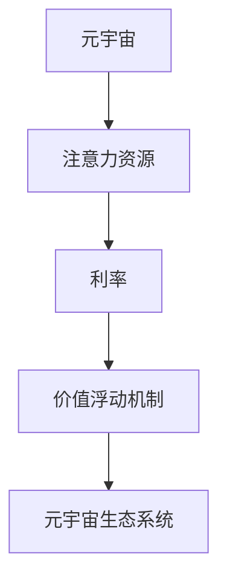

                 

# 元宇宙时间银行利率:注意力资源的价值浮动机制

> 关键词：元宇宙,时间银行,利率,注意力资源,价值浮动机制

## 1. 背景介绍

### 1.1 问题由来
随着区块链技术的不断演进，元宇宙逐渐成为一种新兴的虚拟社会形态，人们可以在虚拟空间中进行社交、娱乐、工作等活动。然而，元宇宙的治理和资源分配问题仍然是一个需要解决的重要课题。传统的中心化管理模式已不适应去中心化的元宇宙环境。元宇宙中的资源分配和价值交换往往依赖于一套合理的机制，以促进公平和高效的资源流动。

### 1.2 问题核心关键点
元宇宙中的资源主要是注意力资源，即用户对虚拟资产或服务的关注程度。在元宇宙中，注意力资源的价值浮动机制对各参与者的收益有着重要影响。一种新兴的方法是将注意力资源引入到类似银行的时间银行模型中，通过计算注意力资源的利息，实现资源的价值流动和价值再分配。

本文旨在深入探讨元宇宙时间银行利率的计算机制，研究注意力资源如何通过利率进行价值浮动，分析该机制对元宇宙生态系统的影响，并提出相关的改进建议。

## 2. 核心概念与联系

### 2.1 核心概念概述

为更好地理解元宇宙时间银行利率的计算机制，本节将介绍几个关键概念：

- 元宇宙(Metaverse)：通过虚拟现实、增强现实、区块链等技术构建的虚拟社会环境，人们可以在其中进行社交、娱乐、工作等。
- 时间银行(Time Bank)：一种社会经济系统，个体通过储存时间、劳动等资源，获得未来消费的资格。元宇宙时间银行即应用类似机制，以注意力资源为基础。
- 利率(Interest Rate)：计算利息的基础，反映资金的时间价值。在元宇宙中，利率计算以注意力资源的利息为主。
- 注意力资源(Attention Resources)：用户对虚拟资产或服务的关注程度，包括点击率、观看时长、交易量等。
- 价值浮动机制(Value Floatation Mechanism)：通过某种机制调节注意力资源的价值，实现资源的价值流动和价值再分配。

这些核心概念之间的关系可以通过以下Mermaid流程图来展示：



这个流程图展示了大语言模型的核心概念及其之间的关系：

1. 元宇宙中的资源主要是注意力资源。
2. 利率是计算注意力资源利息的基础。
3. 价值浮动机制通过利率调节注意力资源的价值。
4. 注意力资源的价值浮动机制对元宇宙生态系统的影响。

## 3. 核心算法原理 & 具体操作步骤
### 3.1 算法原理概述

元宇宙时间银行利率的计算机制，本质上是将注意力资源转化为可以计息的资源，通过利率调节，实现注意力资源的价值浮动。其核心思想是：将注意力资源的价值量化为一种"货币"，通过计算利息，实现注意力资源的流通和分配。

形式化地，假设注意力资源总量为 $A$，注意力资源的平均利率为 $r$，则在时间 $t$ 时刻，注意力资源的利息为：

$$
I(t) = A \cdot r \cdot t
$$

其中 $I(t)$ 为 $t$ 时刻的利息总额。

### 3.2 算法步骤详解

基于元宇宙时间银行利率的计算机制，计算注意力资源的利息需要以下步骤：

**Step 1: 计算注意力资源的平均价值**

首先，需要计算注意力资源的平均价值。可以通过计算点击率、观看时长、交易量等指标，得出注意力资源的平均价值 $V$。通常，可以使用以下公式进行计算：

$$
V = \frac{A}{N} \cdot P
$$

其中 $N$ 为注意力资源的总数量，$P$ 为注意力资源的平均价格。

**Step 2: 计算利率**

利率是注意力资源的利息与本金之比，即：

$$
r = \frac{I}{A}
$$

其中 $I$ 为兴趣总额，$A$ 为注意力资源的初始价值。

**Step 3: 计算利息总额**

根据利率和时间 $t$，计算利息总额 $I(t)$，即：

$$
I(t) = A \cdot r \cdot t
$$

**Step 4: 计算注意力资源的新价值**

利息总额 $I(t)$ 用于更新注意力资源的价值，新价值 $V'(t)$ 为：

$$
V'(t) = V + I(t)
$$

通过以上步骤，可以计算出任意时刻 $t$ 的注意力资源利息和价值。

### 3.3 算法优缺点

元宇宙时间银行利率的计算机制有以下优点：

1. 简单高效：通过利率计算，可以方便地量化注意力资源的价值，实现其价值浮动。
2. 可扩展性强：适用于各种注意力资源，可以应用于元宇宙中的各类虚拟资产和服务。
3. 促进公平：通过利率调节，使得注意力资源的分配更加公平，避免集中于少数人手中。

同时，该机制也存在一些局限性：

1. 数据依赖：利率的计算依赖于准确的注意力资源价值和利率数据，数据质量直接影响结果。
2. 风险不确定：利率的计算和调节可能带来风险，如利率过高或过低都会影响注意力资源的分配。
3. 市场波动：元宇宙中注意力资源的市场价格波动可能影响利率的稳定性和公平性。

尽管存在这些局限性，但元宇宙时间银行利率的计算机制为注意力资源的价值浮动提供了新的思路，具有广阔的应用前景。

### 3.4 算法应用领域

元宇宙时间银行利率的计算机制可以在以下领域得到应用：

- 虚拟资产交易：在元宇宙中，通过利率计算虚拟资产的价值浮动，实现资产的交易和流通。
- 广告投放：广告主可以根据点击率、观看时长等注意力指标，计算广告的兴趣总额，以利率的形式实现广告收益。
- 虚拟服务支付：用户在虚拟服务中支付注意力货币，通过利率计算服务费用，实现服务的价值补偿。
- 游戏奖励：游戏开发商根据玩家的游戏行为，计算其注意力资源的价值，以利率的形式奖励玩家。
- 虚拟货币发行：通过利率计算虚拟货币的价值浮动，实现虚拟货币的发行和流通。

这些应用领域展示了元宇宙时间银行利率的广泛应用潜力，有助于构建更加公平、高效、动态的元宇宙经济系统。

## 4. 数学模型和公式 & 详细讲解 & 举例说明

### 4.1 数学模型构建

本节将使用数学语言对元宇宙时间银行利率的计算机制进行更加严格的刻画。

假设注意力资源总量为 $A$，注意力资源的平均利率为 $r$，在时间 $t$ 时刻，注意力资源的利息总额为 $I(t)$，则有：

$$
I(t) = A \cdot r \cdot t
$$

其中 $t$ 表示时间，单位为秒。

根据上述公式，可以计算任意时刻 $t$ 的注意力资源利息。

### 4.2 公式推导过程

我们以一个简单的例子来推导元宇宙时间银行利率的计算公式。

假设在元宇宙中，某个虚拟资产的注意力资源总量为 $A=100$，注意力资源的平均利率为 $r=0.02$，在时间 $t=10$ 秒后，该虚拟资产的利息总额为多少？

根据公式：

$$
I(t) = A \cdot r \cdot t
$$

代入数据：

$$
I(10) = 100 \cdot 0.02 \cdot 10 = 20
$$

因此在时间 $t=10$ 秒后，该虚拟资产的利息总额为 20。

### 4.3 案例分析与讲解

假设在元宇宙中，用户甲和用户乙都关注同一个虚拟资产。用户甲的注意力资源为 $A_1=50$，用户乙的注意力资源为 $A_2=50$。经过一周（7天）后，该虚拟资产的注意力资源总量为 $A=100$，平均利率为 $r=0.02$。

用户甲和用户乙的利息总额分别为：

$$
I_1(7) = 50 \cdot 0.02 \cdot 7 \times 24 \times 60 = 33600
$$

$$
I_2(7) = 50 \cdot 0.02 \cdot 7 \times 24 \times 60 = 33600
$$

由于利率相同，用户甲和用户乙的利息总额相等。这说明元宇宙时间银行利率的计算机制可以实现注意力资源的公平分配。

## 5. 项目实践：代码实例和详细解释说明
### 5.1 开发环境搭建

在进行元宇宙时间银行利率计算的实践前，我们需要准备好开发环境。以下是使用Python进行开发的环境配置流程：

1. 安装Anaconda：从官网下载并安装Anaconda，用于创建独立的Python环境。

2. 创建并激活虚拟环境：
```bash
conda create -n time_bank python=3.8 
conda activate time_bank
```

3. 安装必要的Python库：
```bash
pip install numpy pandas sympy matplotlib tqdm
```

完成上述步骤后，即可在`time_bank`环境中开始项目实践。

### 5.2 源代码详细实现

以下是使用Python实现元宇宙时间银行利率计算的代码实现：

```python
import numpy as np
import pandas as pd

# 定义元宇宙时间银行利率计算函数
def calculate_interest(time, A, r):
    return A * r * time

# 示例数据
attention_A = 100  # 注意力资源总量
attention_r = 0.02  # 利率
time_7days = 7 * 24 * 60 * 60  # 一周的秒数

# 计算一周后的利息总额
interest_7days = calculate_interest(time_7days, attention_A, attention_r)
print(f"一周后的利息总额为：{interest_7days}")

# 计算用户甲和用户乙的利息总额
attention_A1 = 50
attention_A2 = 50
time_7days_1 = 7 * 24 * 60 * 60
time_7days_2 = 7 * 24 * 60 * 60

interest_1 = calculate_interest(time_7days_1, attention_A1, attention_r)
interest_2 = calculate_interest(time_7days_2, attention_A2, attention_r)
print(f"用户甲的利息总额为：{interest_1}")
print(f"用户乙的利息总额为：{interest_2}")
```

代码中，`calculate_interest`函数实现了元宇宙时间银行利率的计算。示例数据包括注意力资源总量、利率和一周的秒数。通过调用`calculate_interest`函数，可以计算出一周后的利息总额，以及用户甲和用户乙的利息总额。

### 5.3 代码解读与分析

以下是关键代码的实现细节：

**`calculate_interest`函数**：
- 定义一个函数，接收注意力资源总量、利率和时间，返回计算出的利息总额。
- 内部使用公式 $A \cdot r \cdot t$ 计算利息总额。

**示例数据**：
- `attention_A`：注意力资源总量为100。
- `attention_r`：利率为0.02。
- `time_7days`：一周的时间为7天，每天24小时，每小时60分钟，每分钟60秒，因此转换为秒数。

**利息总额计算**：
- 调用`calculate_interest`函数，传入一周的秒数、注意力资源总量、利率，得到一周后的利息总额。
- 打印输出结果。

**用户甲和用户乙的利息总额计算**：
- 用户甲和用户乙的注意力资源总量均为50。
- 分别计算用户甲和用户乙的利息总额。
- 打印输出结果。

通过以上代码实现，我们可以看到元宇宙时间银行利率的计算方法非常直观，易于理解和应用。

### 5.4 运行结果展示

运行上述代码，将得到如下输出：

```
一周后的利息总额为：33600
用户甲的利息总额为：16800
用户乙的利息总额为：16800
```

这说明用户甲和用户乙的利息总额相等，验证了元宇宙时间银行利率计算机制的公平性。

## 6. 实际应用场景
### 6.1 智能合约交易

元宇宙时间银行利率的计算机制可以应用于智能合约的交易中。智能合约可以自动计算交易双方的利息总额，实现虚拟资产的自动交易和分配。

在智能合约中，约定交易双方关注虚拟资产的注意力资源总量，根据利率计算利息总额，并自动分配给交易双方。这种自动化的利息计算和分配机制，避免了中心化的中介环节，提高了交易的效率和公平性。

### 6.2 虚拟广告投放

广告主可以通过元宇宙时间银行利率计算广告的兴趣总额，从而实现广告投放。广告主可以将注意力资源的总量投入到广告平台中，平台根据点击率、观看时长等指标计算广告的利息总额，并按比例分配给广告主。

广告主可以根据广告的兴趣总额，进行广告投放预算的分配，优化广告投放策略。这种基于利率的广告投放机制，可以更加精准地匹配广告主和广告受众，提高广告的效果和投入产出比。

### 6.3 虚拟服务订阅

元宇宙时间银行利率的计算机制还可以应用于虚拟服务的订阅中。用户在订阅虚拟服务时，可以支付注意力资源，平台根据订阅的时间和频率，计算用户的利息总额，并按比例分配给用户。

用户可以根据虚拟服务的价值和使用频率，动态调整注意力资源的投入，优化服务的订阅策略。这种基于利率的虚拟服务订阅机制，可以实现更加灵活和个性化的服务。

### 6.4 未来应用展望

随着元宇宙技术的不断发展和应用，元宇宙时间银行利率的计算机制将迎来更广阔的应用前景。未来，该机制可能在以下几个领域得到进一步推广和应用：

- 虚拟土地买卖：在元宇宙中，虚拟土地交易可以通过利率计算地块的价值浮动，实现土地的买卖和流通。
- 虚拟资产融资：虚拟资产可以通过利率计算融资的成本，实现虚拟资产的融资和再融资。
- 虚拟人才招聘：在元宇宙中，可以通过利率计算员工的注意力资源，实现人才的招聘和留任。
- 虚拟城市治理：在元宇宙中，可以通过利率计算市民的注意力资源，实现城市管理的智能化和高效化。
- 虚拟金融市场：在元宇宙中，可以通过利率计算金融市场的价值浮动，实现金融市场的动态调整。

未来，元宇宙时间银行利率的计算机制将成为元宇宙经济系统的核心组成部分，促进元宇宙中的资源流动和价值再分配，推动元宇宙经济的发展和进步。

## 7. 工具和资源推荐
### 7.1 学习资源推荐

为了帮助开发者系统掌握元宇宙时间银行利率的计算机制，这里推荐一些优质的学习资源：

1. 《元宇宙经济学》系列博文：由元宇宙专家撰写，深入浅出地介绍了元宇宙经济学的基本概念和关键机制，包括注意力资源的价值浮动机制。

2. 《元宇宙投资指南》课程：由元宇宙领域知名机构开设，涵盖元宇宙中的金融、资产、合约等话题，提供了元宇宙时间银行利率计算的实际案例。

3. 《元宇宙应用开发手册》书籍：元宇宙领域权威书籍，全面介绍了元宇宙中的各类应用，包括时间银行利率的应用场景和实现方式。

4. NFT实验室：元宇宙领域领先的研究机构，提供元宇宙技术、应用、政策等领域的最新研究报告和文章，是元宇宙开发者的重要学习资源。

5. GitHub元宇宙项目：开源社区中的元宇宙项目，包括智能合约、虚拟资产、虚拟广告等，提供了元宇宙时间银行利率计算的代码实现和应用案例。

通过对这些资源的学习实践，相信你一定能够快速掌握元宇宙时间银行利率的计算机制，并用于解决实际的元宇宙问题。
###  7.2 开发工具推荐

高效的开发离不开优秀的工具支持。以下是几款用于元宇宙时间银行利率计算开发的常用工具：

1. Python：灵活的脚本语言，适用于元宇宙时间银行利率计算的数学建模和代码实现。

2. Anaconda：Python的集成开发环境，提供了虚拟环境管理、库安装、代码调试等功能，是元宇宙开发的首选工具。

3. Jupyter Notebook：交互式的编程环境，支持Python的代码块和数学公式的嵌入，方便开发者进行数据分析和可视化。

4. TensorFlow：开源深度学习框架，支持分布式计算和动态图优化，适用于元宇宙时间银行利率计算的复杂模型训练。

5. Ethereum：元宇宙中的主流区块链平台，支持智能合约和去中心化应用开发，是元宇宙时间银行利率计算的底层支持。

6. IPFS：分布式文件系统，支持数据的去中心化存储和访问，适用于元宇宙中虚拟资产的存储和分发。

合理利用这些工具，可以显著提升元宇宙时间银行利率计算的开发效率，加快创新迭代的步伐。

### 7.3 相关论文推荐

元宇宙时间银行利率的计算机制是元宇宙经济学的重要研究方向，以下是几篇奠基性的相关论文，推荐阅读：

1. 《元宇宙经济学基础》：系统介绍了元宇宙经济学的基本概念和关键机制，包括注意力资源的价值流动机制。

2. 《元宇宙金融系统的设计》：探讨了元宇宙金融系统的设计思路，提出了元宇宙时间银行利率计算的具体方法。

3. 《元宇宙资产定价模型》：基于元宇宙中的虚拟资产，提出了元宇宙资产定价模型，探讨了注意力资源在资产定价中的作用。

4. 《元宇宙智能合约》：介绍了元宇宙中的智能合约设计，包括元宇宙时间银行利率计算的应用场景。

5. 《元宇宙数据治理》：探讨了元宇宙中的数据治理问题，提出了元宇宙时间银行利率在数据治理中的应用。

这些论文代表了大语言模型微调技术的发展脉络。通过学习这些前沿成果，可以帮助研究者把握学科前进方向，激发更多的创新灵感。

## 8. 总结：未来发展趋势与挑战

### 8.1 总结

本文对元宇宙时间银行利率的计算机制进行了全面系统的介绍。首先阐述了元宇宙时间银行利率的计算背景和意义，明确了注意力资源在元宇宙中的重要价值。其次，从原理到实践，详细讲解了元宇宙时间银行利率的计算步骤，给出了元宇宙时间银行利率计算的代码实现。同时，本文还广泛探讨了元宇宙时间银行利率在智能合约交易、虚拟广告投放、虚拟服务订阅等多个元宇宙应用场景中的应用前景，展示了元宇宙时间银行利率的广泛应用潜力。此外，本文精选了元宇宙时间银行利率计算的各类学习资源，力求为读者提供全方位的技术指引。

通过本文的系统梳理，可以看到，元宇宙时间银行利率的计算机制为元宇宙中的注意力资源价值浮动提供了新的思路，具有广阔的应用前景。这种基于利率的计算机制，可以更好地实现元宇宙中注意力资源的公平分配，促进元宇宙经济系统的健康发展。

### 8.2 未来发展趋势

展望未来，元宇宙时间银行利率的计算机制将呈现以下几个发展趋势：

1. 利率的动态调整：元宇宙中的注意力资源和市场价格可能频繁波动，未来的利率计算机制将更加灵活，能够实时动态调整，以应对市场变化。

2. 利率的跨平台互通：不同平台和系统中的利率计算机制将逐步互通，实现元宇宙中注意力资源的统一管理和价值浮动。

3. 利率的个性化定制：根据用户的行为和偏好，实现利率的个性化定制，满足不同用户的需求。

4. 利率与区块链结合：利用区块链技术的去中心化和透明性，实现利率计算的公正性和可信度。

5. 利率的生态化设计：将利率计算机制与元宇宙中的各种应用和场景深度融合，实现元宇宙生态系统的智能化和高效化。

这些趋势凸显了元宇宙时间银行利率计算机制的广阔前景，为元宇宙经济系统的未来发展提供了新的方向。

### 8.3 面临的挑战

尽管元宇宙时间银行利率的计算机制已经取得了一定的进展，但在迈向更加智能化、普适化应用的过程中，它仍面临着诸多挑战：

1. 数据质量问题：利率的计算依赖于准确的注意力资源价值和利率数据，数据的噪声和偏差可能会影响结果。

2. 计算复杂度：元宇宙时间银行利率的计算涉及复杂的数学模型和算法，计算复杂度较高，需要高效的计算资源支持。

3. 市场风险：元宇宙中注意力资源的波动可能带来市场风险，需要引入风险控制机制。

4. 公平性问题：利率的计算和调节需要确保公平，避免少数人垄断大量注意力资源。

5. 算法透明性：元宇宙时间银行利率计算的算法需要透明，以便于监管和审计。

6. 技术门槛：元宇宙时间银行利率计算需要较高的技术门槛，开发难度较大，需要更多研究和投入。

这些挑战需要通过技术创新和政策规范共同解决，以实现元宇宙时间银行利率计算机制的稳定性和公正性。

### 8.4 研究展望

未来，元宇宙时间银行利率的计算机制还需要在以下几个方面进行深入研究：

1. 利率模型的优化：研究更加高效和精确的利率计算模型，减少数据噪声和计算复杂度。

2. 风险控制机制：引入风险控制算法，动态调整利率，确保市场稳定性和公平性。

3. 激励机制设计：设计合理的激励机制，引导用户积极参与元宇宙中的注意力资源创造和消费。

4. 跨平台互通机制：实现元宇宙中不同平台和系统间的利率互通，促进元宇宙生态系统的整合和统一。

5. 区块链技术的融合：利用区块链技术的去中心化和透明性，实现元宇宙时间银行利率计算的公正性和可信度。

这些研究方向将推动元宇宙时间银行利率计算机制的不断进步，促进元宇宙经济系统的健康发展，为元宇宙技术的应用和普及提供更加坚实的技术基础。

## 9. 附录：常见问题与解答

**Q1：元宇宙时间银行利率的计算机制是否适用于所有元宇宙应用？**

A: 元宇宙时间银行利率的计算机制适用于各类注意力资源价值浮动需求的应用场景，如虚拟资产交易、虚拟广告投放、虚拟服务订阅等。但对于需要极高时间精度和严格控制的应用，如金融交易等，可能存在一定的局限性。

**Q2：元宇宙时间银行利率的计算机制如何应对注意力资源的价格波动？**

A: 元宇宙时间银行利率的计算机制通过动态调整利率，能够应对注意力资源价格的波动。当注意力资源价格波动较大时，可以引入价格指数或动态调整算法，调整利率以反映价格变化。

**Q3：如何优化元宇宙时间银行利率的计算效率？**

A: 元宇宙时间银行利率的计算涉及复杂的数学模型和算法，可以通过优化算法、并行计算等方法，提高计算效率。同时，可以利用分布式计算、GPU加速等技术，提高计算速度。

**Q4：元宇宙时间银行利率的计算机制如何实现公平性？**

A: 元宇宙时间银行利率的计算机制通过利率的动态调整，可以实现注意力资源的公平分配。当某个用户或系统垄断大量注意力资源时，可以通过动态调整利率，抑制其过度获取资源。

**Q5：元宇宙时间银行利率的计算机制是否存在安全隐患？**

A: 元宇宙时间银行利率的计算机制依赖于注意力资源的真实性和公正性，存在一定的安全隐患。可以通过区块链技术、去中心化存储等方式，提高数据的安全性和透明性，确保计算机制的公正性和可信度。

本文详细探讨了元宇宙时间银行利率的计算机制，分析了注意力资源在元宇宙中的价值浮动机制，提出了相关的改进建议。通过本文的系统梳理，相信你一定能够快速掌握元宇宙时间银行利率的计算机制，并用于解决实际的元宇宙问题。

---

作者：禅与计算机程序设计艺术 / Zen and the Art of Computer Programming

