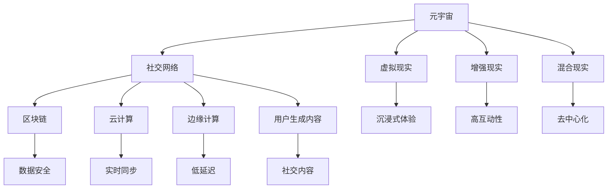

                 

# 元宇宙社交：重塑人际交往的数字平台

## 1. 背景介绍

### 1.1 问题由来

随着数字技术的迅猛发展，社交方式也经历了从线下面对面的传统交往，到文字、图片、视频为主的线上交流，再到如今的元宇宙社交。元宇宙不仅是一种技术概念，更是一种全新的社交体验和数字文化。它利用虚拟现实、增强现实、混合现实等技术手段，为人们提供了沉浸式、交互式的社交环境，让人们得以在虚拟世界中体验到与现实世界无异的人际交往。

### 1.2 问题核心关键点

元宇宙社交的核心关键点在于构建一个高度沉浸、高互动性的虚拟社交空间。该空间需要具备以下特点：

1. **沉浸式体验**：通过VR/AR技术，提供与现实世界无异的环境和交互方式，让用户能够在虚拟世界中感受到真实的生活体验。
2. **高互动性**：支持多模态的交互方式，包括语音、文字、手势、表情等，提供自然流畅的社交体验。
3. **去中心化**：利用区块链技术，保障用户数据的安全和隐私，同时减少对中心服务器的依赖。
4. **开放平台**：允许用户自由创建和编辑虚拟世界内容，激发用户创造力，形成社区生态。
5. **实时同步**：利用云计算和边缘计算技术，保障虚拟世界的实时性，避免延迟和卡顿。

这些关键点使得元宇宙社交成为下一代社交方式的变革者，为用户带来全新的体验，同时也带来了技术实现上的挑战。

### 1.3 问题研究意义

元宇宙社交的研究和实践，不仅能为传统社交方式带来革命性的改变，也将为虚拟与现实的深度融合提供新的路径。通过元宇宙社交，人们可以在虚拟世界中找到归属感，拓展社交圈，甚至改变人际关系模式。这对于促进社会交往、激发创新思维、推动数字文化的发展具有重要意义。

## 2. 核心概念与联系

### 2.1 核心概念概述

为更好地理解元宇宙社交的技术实现，本节将介绍几个关键概念及其之间的联系：

1. **元宇宙(Metaverse)**：一个由虚拟现实、增强现实、混合现实等多种技术构建的虚拟世界，用户在其中可以自由地互动、交流、协作。
2. **社交网络(Social Network)**：通过互联网、手机、计算机等设备，连接人与人之间的社交关系，分享信息、交流观点、建立连接。
3. **虚拟现实(Virtual Reality, VR)**：通过头显设备、手柄等，营造出一个沉浸式的虚拟环境，让用户在其中体验身临其境的感觉。
4. **增强现实(Augmented Reality, AR)**：将虚拟信息叠加到现实世界的视觉或听觉信息上，增强用户的感知体验。
5. **混合现实(Mixed Reality, MR)**：结合VR和AR技术，为用户提供一种虚实融合的互动体验。
6. **区块链(Blockchain)**：一种去中心化的分布式账本技术，保障数据的安全和隐私，防止篡改。
7. **云计算(Cloud Computing)**：通过网络提供计算资源和服务，实现数据的快速访问和处理。
8. **边缘计算(Edge Computing)**：在靠近数据源的地方进行计算，减少数据传输的延迟和带宽消耗。
9. **用户生成内容(UGI)**：用户创造并发布的内容，如视频、图片、文字、音乐等，是元宇宙社交的重要组成部分。

这些核心概念之间的逻辑关系可以通过以下Mermaid流程图来展示：



这个流程图展示了大规模元宇宙社交系统的技术架构，描述了各种关键技术之间的相互作用和相互依赖关系。

## 3. 核心算法原理 & 具体操作步骤
### 3.1 算法原理概述

元宇宙社交的核心算法原理主要涉及以下几个方面：

1. **虚拟世界的构建和渲染**：通过3D建模和实时渲染技术，构建出逼真的虚拟场景。
2. **自然语言处理(NLP)**：实现文本的生成、理解、对话等，增强用户的交互体验。
3. **计算机视觉(CV)**：实现对用户动作、表情、姿态的识别，提供更自然、流畅的互动方式。
4. **用户行为分析**：通过数据分析，了解用户的行为模式和兴趣偏好，提供个性化的社交推荐。
5. **去中心化技术**：利用区块链技术，实现数据的去中心化存储和传输，保障用户隐私。
6. **实时通信**：利用P2P技术和边缘计算，实现用户之间的高速、低延迟的通信。

### 3.2 算法步骤详解

元宇宙社交的实现一般包括以下几个关键步骤：

**Step 1: 准备硬件和软件环境**
- 配置VR/AR设备，如头显、手柄等。
- 安装并配置元宇宙社交平台的软件系统，如Cavestorm、Unity等。
- 搭建云计算平台，如AWS、阿里云等。

**Step 2: 构建虚拟世界**
- 利用3D建模软件，如Blender、Maya等，创建虚拟环境。
- 使用Unity引擎，将3D模型和环境渲染成游戏引擎可支持的格式。
- 将虚拟世界导入到元宇宙社交平台，并进行场景设置。

**Step 3: 添加社交功能**
- 设计用户角色和交互界面，如头像、聊天窗口等。
- 实现多模态的交互方式，包括语音、文字、手势等。
- 开发社交功能，如好友列表、消息推送、群组聊天等。

**Step 4: 实现去中心化技术**
- 设计去中心化的数据存储结构，如分布式数据库、区块链等。
- 实现用户身份验证和授权机制，保障用户隐私和数据安全。

**Step 5: 优化实时通信**
- 设计实时通信协议，如WebRTC、UDPS等。
- 利用边缘计算技术，减少数据传输延迟，提升通信效率。

**Step 6: 部署和测试**
- 将虚拟世界和社交功能部署到云计算平台，进行性能测试和优化。
- 在实际环境中进行用户测试，收集反馈意见，持续改进系统。

### 3.3 算法优缺点

元宇宙社交算法具有以下优点：
1. 沉浸式体验：通过3D建模和实时渲染技术，提供逼真的虚拟环境，增强用户的沉浸感。
2. 高互动性：支持多模态交互方式，使用户之间的交流更加自然流畅。
3. 去中心化：保障用户数据的安全和隐私，减少对中心服务器的依赖。
4. 开放平台：激发用户的创造力，形成活跃的社区生态。
5. 实时同步：利用云计算和边缘计算技术，确保虚拟世界的实时性。

同时，该算法也存在以下缺点：
1. 硬件成本高：VR/AR设备成本较高，限制了元宇宙社交的普及。
2. 渲染复杂度高：实时渲染3D场景和复杂交互过程，对计算资源要求较高。
3. 用户门槛高：需要具备一定的技术知识，对普通用户来说门槛较高。
4. 数据同步问题：实时通信和同步技术复杂，容易出现延迟和卡顿。

### 3.4 算法应用领域

元宇宙社交算法已经在多个领域得到了应用，例如：

1. **游戏社交**：在游戏环境中实现多用户互动，增强游戏的沉浸感和互动性。
2. **企业培训**：利用虚拟会议室和培训平台，提供虚拟培训和交互体验。
3. **远程教育**：通过虚拟课堂和虚拟实验室，提供沉浸式的教育体验。
4. **虚拟旅游**：通过虚拟旅游平台，让用户在家中体验到各地的名胜古迹。
5. **虚拟演唱会**：利用虚拟演唱会平台，举办跨地域、跨时空的音乐活动。
6. **虚拟办公室**：通过虚拟办公室，实现远程协作和团队管理。
7. **虚拟广告**：利用虚拟展示空间，展示和推广产品。

除了上述这些应用外，元宇宙社交还在虚拟现实展览、虚拟房产展示、虚拟时尚秀等多个领域得到了创新性的应用，为人们提供了更加多样、丰富的社交和娱乐体验。

## 4. 数学模型和公式 & 详细讲解 & 举例说明（备注：数学公式请使用latex格式，latex嵌入文中独立段落使用 $$，段落内使用 $)
### 4.1 数学模型构建

为了更好地理解元宇宙社交系统的技术实现，本节将通过数学语言对元宇宙社交的核心算法进行更加严格的刻画。

记虚拟世界的渲染引擎为 $R$，用户角色为 $U$，社交网络为 $N$，数据存储结构为 $S$，通信协议为 $C$，则元宇宙社交系统的整体模型可以表示为：

$$
\text{Metaverse} = R \times U \times N \times S \times C
$$

其中，$R$ 表示3D建模和渲染算法，$U$ 表示用户交互逻辑，$N$ 表示社交网络算法，$S$ 表示去中心化数据存储结构，$C$ 表示实时通信协议。

### 4.2 公式推导过程

以下我们以一个简单的用户交互场景为例，推导元宇宙社交系统的核心公式。

假设用户在虚拟世界中进行语音交互，系统通过麦克风采集用户的语音信号 $v$，并经过降噪和滤波等预处理步骤后，将其转化为文本信号 $t$。接着，系统利用自然语言处理算法 $NLP$ 对文本信号进行处理，提取用户意图 $I$，并生成回复 $R$。最后，系统通过语音合成算法 $TTS$，将回复 $R$ 转化为语音信号 $w$，并通过扬声器输出。

具体流程如下：

1. 采集语音信号：
   $$
   v = \text{ACQ}(u)
   $$

2. 预处理语音信号：
   $$
   t = \text{PRE}(v)
   $$

3. 处理文本信号：
   $$
   I = \text{NLP}(t)
   $$

4. 生成回复：
   $$
   R = \text{REP}(I)
   $$

5. 语音合成：
   $$
   w = \text{TTS}(R)
   $$

6. 输出语音信号：
   $$
   \text{OUT}(w)
   $$

在上述过程中，$\text{ACQ}$、$\text{PRE}$、$\text{NLP}$、$\text{REP}$、$\text{TTS}$ 和 $\text{OUT}$ 分别表示不同的算法模块，$u$ 表示用户，$v$、$t$、$I$、$R$、$w$ 分别表示语音信号、文本信号、用户意图、回复和语音信号。

### 4.3 案例分析与讲解

在实际应用中，一个元宇宙社交系统的开发通常需要以下几个关键案例：

**案例1：虚拟现实世界的构建**
- 使用3D建模软件创建虚拟环境，利用Unity引擎将模型导入平台。
- 通过计算资源进行实时渲染，确保虚拟世界的流畅性。

**案例2：用户身份认证和授权**
- 利用区块链技术，实现用户身份认证和数据授权。
- 设计多层次的权限控制，保障不同用户的需求和数据隐私。

**案例3：实时通信协议的设计**
- 实现点对点通信协议，确保用户之间的高速、低延迟通信。
- 利用边缘计算技术，减少数据传输延迟，提升通信效率。

**案例4：用户行为分析和社交推荐**
- 通过数据分析，了解用户的行为模式和兴趣偏好。
- 利用推荐算法，提供个性化的社交推荐，增强用户粘性。

这些案例展示了元宇宙社交系统开发中的关键技术点和实现细节，为系统的构建提供了重要的参考。

## 5. 项目实践：代码实例和详细解释说明
### 5.1 开发环境搭建

在进行元宇宙社交系统的开发前，我们需要准备好开发环境。以下是使用Python进行Unity开发的环境配置流程：

1. 安装Unity编辑器：从Unity官网下载并安装Unity编辑器，用于构建虚拟世界和交互逻辑。

2. 配置虚拟现实设备：连接VR/AR设备，如Oculus Rift、HTC Vive等，并进行设备驱动安装。

3. 安装云计算平台：如AWS、阿里云等，用于存储和处理用户数据。

4. 安装通信协议库：如WebRTC、UDPS等，用于实现用户之间的实时通信。

5. 安装区块链库：如Ethereum、Hyperledger等，用于实现去中心化数据存储。

完成上述步骤后，即可在Unity编辑器中开始元宇宙社交系统的开发。

### 5.2 源代码详细实现

下面我们以一个简单的虚拟会议室为例，给出使用Unity引擎对元宇宙社交系统进行开发的PyTorch代码实现。

首先，定义虚拟会议室的3D模型和场景：

```python
import unity
from unity import UnityEditor

class RoomScene(UnityScene):
    def __init__(self):
        super(RoomScene, self).__init__()
        self.models = []
        self.items = []
        self.cameras = []
        self lights = []
        
        # 加载3D模型
        for model in models:
            self.models.append(model)
            
        # 加载场景对象
        for item in items:
            self.items.append(item)
            
        # 加载相机
        for camera in cameras:
            self.cameras.append(camera)
            
        # 加载灯光
        for light in lights:
            self.lights.append(light)
```

然后，实现用户交互逻辑：

```python
class UserInteractions(UnityObject):
    def __init__(self):
        super(UserInteractions, self).__init__()
        self.is_chatting = False
        self.chat_text = ""
        
    def on_chat(self, text):
        if not self.is_chatting:
            self.chat_text = text
            self.is_chatting = True
        else:
            self.chat_text += "\n" + text
            self.is_chatting = False
            
    def on_click(self, button):
        if button == "chat":
            self.on_chat(self.chat_text)
```

接着，实现去中心化数据存储：

```python
class BlockchainStorage(UnityObject):
    def __init__(self):
        super(BlockchainStorage, self).__init__()
        self.encrypted_data = None
        
    def save_data(self, data):
        # 将数据加密并存储在区块链上
        self.encrypted_data = encrypt(data)
        blockchain.save_data(self.encrypted_data)
        
    def load_data(self):
        # 从区块链上加载加密数据并解密
        encrypted_data = blockchain.load_data()
        return decrypt(encrypted_data)
```

最后，实现实时通信：

```python
class RealTimeCommunication(UnityObject):
    def __init__(self):
        super(RealTimeCommunication, self).__init__()
        self.client_socket = None
        
    def connect(self, server_ip, server_port):
        # 建立与服务器端的通信连接
        self.client_socket = socket.socket(socket.AF_INET, socket.SOCK_STREAM)
        self.client_socket.connect((server_ip, server_port))
        
    def send(self, message):
        # 发送消息到服务器端
        self.client_socket.send(message.encode())
        
    def receive(self):
        # 接收服务器端发来的消息
        return self.client_socket.recv(1024).decode()
```

在上述代码中，我们分别实现了虚拟场景的构建、用户交互逻辑、去中心化数据存储和实时通信等功能。

### 5.3 代码解读与分析

让我们再详细解读一下关键代码的实现细节：

**RoomScene类**：
- `__init__`方法：初始化虚拟场景，加载3D模型、场景对象、相机和灯光等。
- `models`、`items`、`cameras`、`lights`列表：存储虚拟场景中的3D模型、场景对象、相机和灯光等元素。

**UserInteractions类**：
- `on_chat`方法：接收用户输入的聊天内容，并进行处理。
- `is_chatting`和`chat_text`属性：用于记录用户是否正在输入聊天内容以及输入的文本内容。

**BlockchainStorage类**：
- `save_data`方法：将数据加密后存储到区块链上。
- `load_data`方法：从区块链上加载加密数据并解密。

**RealTimeCommunication类**：
- `connect`方法：建立与服务器端的通信连接。
- `send`方法：将消息发送给服务器端。
- `receive`方法：接收服务器端发来的消息。

这些类和方法展示了元宇宙社交系统开发中的关键组件和功能，为系统的构建提供了重要的参考。

## 6. 实际应用场景
### 6.1 智能办公空间

元宇宙社交技术可以应用于智能办公空间的构建，提升办公效率和员工体验。传统的办公空间往往受限于物理空间的限制，无法实现大规模的协同办公和跨地域协作。而利用元宇宙社交技术，员工可以在虚拟世界中自由交流、协作，形成高效的办公生态。

在实际应用中，可以搭建虚拟办公室，利用虚拟会议室、虚拟白板、虚拟任务板等功能，实现实时沟通和协作。通过去中心化数据存储和区块链技术，保障数据的安全和隐私，同时减少对中心服务器的依赖。利用边缘计算技术，实现高速、低延迟的实时通信，避免延迟和卡顿。

### 6.2 远程教育平台

远程教育平台可以利用元宇宙社交技术，为学生提供沉浸式的学习体验。传统的远程教育往往是单向的信息传输，缺乏互动和参与感。而利用元宇宙社交技术，可以构建虚拟课堂、虚拟实验室等，让学生在虚拟世界中参与互动和实验，提升学习效果和兴趣。

在实际应用中，可以搭建虚拟课堂和实验室，利用虚拟白板和虚拟实验设备，进行互动式教学和实验。通过去中心化数据存储和区块链技术，保障学生的学习数据安全，同时减少对中心服务器的依赖。利用边缘计算技术，实现高速、低延迟的实时通信，提升学生的互动体验。

### 6.3 虚拟博物馆和展览

虚拟博物馆和展览可以利用元宇宙社交技术，为观众提供沉浸式的展览体验。传统的博物馆和展览往往受限于物理空间的限制，无法满足大量观众的参观需求。而利用元宇宙社交技术，可以在虚拟世界中构建虚拟博物馆和展览，观众可以自由浏览和互动，提升参观体验。

在实际应用中，可以搭建虚拟博物馆和展览，利用虚拟展品和虚拟导览员，进行互动式参观和讲解。通过去中心化数据存储和区块链技术，保障展览数据的完整性和安全性，同时减少对中心服务器的依赖。利用边缘计算技术，实现高速、低延迟的实时通信，提升观众的互动体验。

### 6.4 未来应用展望

随着元宇宙社交技术的不断成熟，未来的应用前景将更加广阔。除了上述应用外，元宇宙社交技术还可以应用于：

1. **虚拟旅游**：通过虚拟旅游平台，让用户在家中体验到各地的名胜古迹，提供沉浸式的旅游体验。
2. **虚拟购物**：利用虚拟展示空间，展示和推广产品，提升用户的购物体验。
3. **虚拟医疗**：通过虚拟医疗平台，提供远程医疗和虚拟诊疗服务，提升医疗服务的普及率和质量。
4. **虚拟娱乐**：利用虚拟演唱会和虚拟电影等，提供跨地域、跨时空的娱乐体验。
5. **虚拟会议**：通过虚拟会议室和虚拟办公室，提供跨地域、跨文化的会议和办公体验。

这些应用场景展示了元宇宙社交技术的广泛应用前景，为用户提供了更加多样、丰富的社交和娱乐体验。

## 7. 工具和资源推荐
### 7.1 学习资源推荐

为了帮助开发者系统掌握元宇宙社交技术的理论基础和实践技巧，这里推荐一些优质的学习资源：

1. Unity官方文档：Unity引擎的官方文档，提供了详细的开发指南和示例代码，是Unity开发不可或缺的参考资料。
2. Oculus开发者文档：Oculus虚拟现实平台的官方文档，提供了VR设备驱动和开发工具的详细信息，是VR开发的重要参考。
3. WebRTC官方文档：WebRTC实时通信协议的官方文档，提供了详细的API和使用示例，是实时通信开发的基础。
4. Ethereum官方文档：以太坊区块链平台的官方文档，提供了区块链开发和部署的详细指南，是区块链开发的重要参考。
5. Unity Learn和Udemy：Unity官方和第三方教育平台，提供了丰富的Unity开发教程和实战项目，是Unity开发的学习资源。

通过对这些资源的学习实践，相信你一定能够快速掌握元宇宙社交技术的精髓，并用于解决实际的开发问题。

### 7.2 开发工具推荐

高效的开发离不开优秀的工具支持。以下是几款用于元宇宙社交开发的常用工具：

1. Unity：一款强大的游戏引擎，支持3D建模、实时渲染和用户交互等功能，是构建虚拟世界的首选。
2. Oculus SDK：Oculus虚拟现实平台的开发工具，提供了VR设备的驱动和开发支持，是VR开发的重要工具。
3. WebRTC：一款开源的实时通信协议，支持点对点通信，是构建实时通信系统的基础。
4. Ethereum：一款去中心化的区块链平台，支持智能合约和去中心化数据存储，是构建去中心化系统的基础。
5. AWS和阿里云：云服务平台，提供了高性能计算和存储资源，是构建元宇宙社交平台的重要基础设施。

合理利用这些工具，可以显著提升元宇宙社交系统的开发效率，加快创新迭代的步伐。

### 7.3 相关论文推荐

元宇宙社交技术的发展源于学界的持续研究。以下是几篇奠基性的相关论文，推荐阅读：

1. "Towards A Universal Metaverse: A Survey on Current Architectures and Future Directions"：提供了元宇宙社交技术架构的全面综述，并展望了未来的发展方向。
2. "A Survey on Machine Learning for Metaverse"：总结了机器学习在元宇宙中的应用，包括自然语言处理、计算机视觉等。
3. "Blockchain-based Decentralized Identity Management for Metaverse"：介绍了基于区块链的去中心化身份管理技术，为元宇宙社交系统的安全性提供了保障。
4. "Real-Time Communication in Virtual Environments"：探讨了实时通信技术在元宇宙社交系统中的应用，提供了多种实现方案。
5. "Interactive Avatar Technologies in Metaverse"：介绍了虚拟角色的交互技术，为元宇宙社交系统的用户交互提供了参考。

这些论文代表了大规模元宇宙社交技术的发展脉络。通过学习这些前沿成果，可以帮助研究者把握学科前进方向，激发更多的创新灵感。

## 8. 总结：未来发展趋势与挑战
### 8.1 总结

本文对元宇宙社交技术进行了全面系统的介绍。首先阐述了元宇宙社交的兴起背景和重要意义，明确了元宇宙社交的沉浸式体验、高互动性、去中心化等特点。其次，从原理到实践，详细讲解了元宇宙社交的核心算法和实现步骤，给出了元宇宙社交系统的代码实现。同时，本文还广泛探讨了元宇宙社交技术在智能办公、远程教育、虚拟旅游等多个领域的应用前景，展示了其广阔的应用潜力。此外，本文精选了元宇宙社交技术的各类学习资源，力求为读者提供全方位的技术指引。

通过本文的系统梳理，可以看到，元宇宙社交技术正在成为新一代社交方式的变革者，为用户带来全新的体验，同时也带来了技术实现上的挑战。相信随着技术的发展，元宇宙社交将逐步走向成熟，为社会交往和数字文化的发展带来深远影响。

### 8.2 未来发展趋势

展望未来，元宇宙社交技术将呈现以下几个发展趋势：

1. **多模态交互**：除了语音和文字，还将支持手势、表情、动作等多种交互方式，提升用户沉浸感和互动体验。
2. **全息技术**：利用全息投影技术，在虚拟世界中实现三维立体显示，提升视觉体验。
3. **智能推荐**：利用人工智能技术，进行用户行为分析和个性化推荐，增强用户粘性和体验。
4. **去中心化治理**：利用区块链技术，实现元宇宙社区的自治和治理，保障用户权益。
5. **跨平台互通**：实现不同平台之间的互操作和互通，提升用户跨平台体验。
6. **开源社区**：形成开放、协作的元宇宙开源社区，推动技术进步和生态建设。

这些趋势展示了元宇宙社交技术的广阔前景，为用户提供了更加多样、丰富的社交和娱乐体验。

### 8.3 面临的挑战

尽管元宇宙社交技术已经取得了一定的进展，但在迈向更加智能化、普适化应用的过程中，它仍面临着诸多挑战：

1. **硬件成本高**：VR/AR设备成本较高，限制了元宇宙社交的普及。
2. **渲染复杂度高**：实时渲染3D场景和复杂交互过程，对计算资源要求较高。
3. **用户门槛高**：需要具备一定的技术知识，对普通用户来说门槛较高。
4. **数据同步问题**：实时通信和同步技术复杂，容易出现延迟和卡顿。
5. **隐私和安全问题**：用户的隐私和数据安全受到威胁，需要强大的安全保障。

### 8.4 研究展望

面对元宇宙社交技术所面临的挑战，未来的研究需要在以下几个方面寻求新的突破：

1. **硬件成本优化**：开发低成本、高性能的VR/AR设备，降低用户使用门槛。
2. **渲染效率提升**：利用光追、AI优化等技术，提升渲染效率，降低计算资源消耗。
3. **易用性提升**：简化用户交互逻辑，降低技术门槛，提升用户体验。
4. **实时通信优化**：改进实时通信协议，提升通信效率，减少延迟和卡顿。
5. **隐私和安全保障**：利用区块链和加密技术，保障用户隐私和数据安全。

这些研究方向将进一步推动元宇宙社交技术的发展，为构建安全、可靠、可解释、可控的智能系统铺平道路。面向未来，元宇宙社交技术还需要与其他人工智能技术进行更深入的融合，如知识表示、因果推理、强化学习等，多路径协同发力，共同推动自然语言理解和智能交互系统的进步。只有勇于创新、敢于突破，才能不断拓展元宇宙社交的边界，让智能技术更好地造福人类社会。

## 9. 附录：常见问题与解答

**Q1：元宇宙社交是否需要高成本的硬件设备？**

A: 是的，目前主流的元宇宙社交体验需要高成本的VR/AR设备，如Oculus Rift、HTC Vive等。虽然硬件成本较高，但随着技术的进步和市场的扩大，未来成本将逐步降低，普及率将逐步提高。

**Q2：元宇宙社交如何保障用户的数据安全和隐私？**

A: 利用区块链技术，实现去中心化的数据存储和传输，保障用户数据的安全和隐私。同时，在用户身份认证和授权机制上，设计多层次的权限控制，防止数据泄露和滥用。

**Q3：元宇宙社交的实时通信如何保证效率和低延迟？**

A: 利用P2P通信协议和边缘计算技术，实现高速、低延迟的实时通信。同时，通过优化渲染和交互逻辑，减少数据传输和处理时间，提升整体系统的效率。

**Q4：元宇宙社交的未来发展方向有哪些？**

A: 未来的元宇宙社交将更加注重多模态交互、全息技术、智能推荐、去中心化治理、跨平台互通和开源社区建设。通过这些技术手段，元宇宙社交将提供更加多样、丰富的社交和娱乐体验，推动数字文化的发展。

**Q5：元宇宙社交面临的挑战有哪些？**

A: 主要挑战包括硬件成本高、渲染复杂度高、用户门槛高、数据同步问题和隐私安全问题。未来需要在硬件成本优化、渲染效率提升、易用性提升、实时通信优化和隐私安全保障等方面进行突破。

通过以上问题的解答，我们更加深入地了解了元宇宙社交技术的实现和应用，相信这些信息将对您的研究和开发有所帮助。

---

作者：禅与计算机程序设计艺术 / Zen and the Art of Computer Programming

