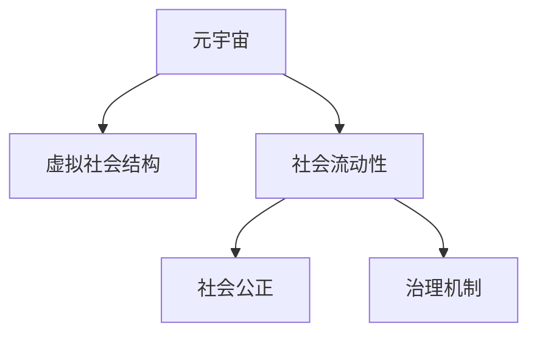

                 

# 元宇宙社会流动性研究中心:虚拟社会结构动态分析机构

> 关键词：元宇宙,社会流动性,虚拟社会结构,动态分析,社会公正,治理机制,研究框架

## 1. 背景介绍

### 1.1 问题由来

随着虚拟现实(VR)、增强现实(AR)、混合现实(MR)等技术的飞速发展，以及5G、云计算等基础设施的完善，人类即将步入一个全新的数字时代——元宇宙。元宇宙不仅仅是一个虚拟世界的构建，更是人类社会生产方式、生活模式、价值观念、社会结构等全面重构的重要契机。

社会流动性是衡量一个社会健康与否的重要指标。元宇宙作为虚拟社会的“实验场”，为研究现实世界的社会流动性问题提供了新的视角和方法。因此，本文旨在建立一个专注于元宇宙社会流动性分析的研究机构，通过虚拟社会结构动态分析，揭示元宇宙中社会流动性的特征、机制和影响因素，提出科学合理的政策建议，助力构建一个更加公正、高效的元宇宙社会。

### 1.2 问题核心关键点

本文研究的核心关键点包括：

- 元宇宙社会流动性的定义与度量方法
- 元宇宙虚拟社会结构的特征分析
- 元宇宙社会流动性的影响因素和机制
- 元宇宙社会流动性的优化策略和治理机制
- 元宇宙社会流动性的政策建议和应用框架

通过回答这些问题，本文将为元宇宙社会流动性的研究提供全面的理论基础和实践指导。

### 1.3 问题研究意义

元宇宙社会流动性的研究具有重要的理论意义和实践价值：

1. **理论意义**：通过虚拟社会结构动态分析，揭示元宇宙社会流动性的本质和规律，丰富社会流动性研究的理论体系，为未来的元宇宙社会构建提供理论支撑。
2. **实践价值**：为元宇宙平台运营、政策制定、社会治理提供科学依据，提升元宇宙社会治理水平，促进社会公正和公平。
3. **创新价值**：引入元宇宙这一新概念，拓展社会流动性研究的应用场景，推动跨学科研究方法的创新。

## 2. 核心概念与联系

### 2.1 核心概念概述

本节将介绍几个密切相关的核心概念：

- **元宇宙(Metaverse)**：一个由多个虚拟世界组成的、可交互、可感知、可操作、可创造的虚拟空间，包含大量的虚拟资产、虚拟经济和社会结构。

- **社会流动性(Social Mobility)**：指个体或群体在不同社会层次之间流动的可能性，反映了社会的开放性和公平性。

- **虚拟社会结构(Virtual Social Structure)**：指在元宇宙中，个体或群体的社会地位、经济水平、知识技能等社会属性及其相互关系的网络结构。

- **社会公正(Social Justice)**：指元宇宙中社会资源分配的公平性，包括经济、政治、文化等多个方面。

- **治理机制(Governance Mechanism)**：指在元宇宙中，确保社会流动性公平公正的规则、制度、法律和技术手段的总和。

这些核心概念之间的关系可以通过以下Mermaid流程图来展示：



这个流程图展示了几者之间的逻辑关系：

1. 元宇宙是虚拟社会结构和社会流动性的载体。
2. 社会流动性反映虚拟社会结构的特征和变化。
3. 社会公正和治理机制是实现社会流动性的保障。

## 3. 核心算法原理 & 具体操作步骤
### 3.1 算法原理概述

元宇宙社会流动性的研究方法主要包括社会网络分析、社会仿真、机器学习等技术手段。其核心原理是通过对元宇宙虚拟社会结构的动态分析，揭示社会流动性的特征和规律，进而提出相应的政策建议。

社会网络分析（Social Network Analysis, SNA）是一种研究个体或群体间关系的网络结构及动态变化的分析方法。通过对元宇宙中虚拟社区、虚拟组织、虚拟市场等网络节点和连接关系进行分析，可以揭示虚拟社会结构中的权力结构、资源流动、信息传播等特征。

社会仿真（Social Simulation）是一种基于模型和模拟的实验方法，通过构建虚拟社会模型，模拟不同政策或事件对社会流动性的影响，评估政策的效果和可行性。

机器学习（Machine Learning, ML）是一种数据驱动的分析方法，通过收集元宇宙中个体的行为数据，使用回归分析、分类分析、聚类分析等技术手段，分析社会流动性的影响因素和机制。

### 3.2 算法步骤详解

基于上述核心算法，元宇宙社会流动性的研究步骤如下：

**Step 1: 数据收集与处理**
- 收集元宇宙平台中虚拟个体或群体的行为数据，包括虚拟身份、虚拟资产、虚拟交互等信息。
- 对收集的数据进行清洗和预处理，如去重、缺失值填充、异常值处理等。
- 将数据转换为适合分析的格式，如关系图、矩阵、时间序列等。

**Step 2: 社会网络分析**
- 构建虚拟社会网络，确定网络节点和连接关系。节点可以是虚拟个体、虚拟组织、虚拟市场等。
- 使用社会网络分析方法，如中心性、网络密度、社区结构等指标，分析虚拟社会结构中的权力结构、资源流动、信息传播等特征。
- 对不同时期的社会网络进行分析，评估虚拟社会结构的动态变化。

**Step 3: 社会仿真**
- 构建虚拟社会仿真模型，模拟不同政策或事件对社会流动性的影响。
- 使用仿真工具，如Netsim、Simpy等，模拟元宇宙中虚拟个体和群体的行为和互动。
- 对仿真结果进行分析和评估，提出优化社会流动性的政策建议。

**Step 4: 机器学习分析**
- 收集元宇宙中个体的行为数据，使用机器学习技术，分析社会流动性的影响因素和机制。
- 使用回归分析、分类分析、聚类分析等技术手段，建立社会流动性的预测模型。
- 对模型进行验证和优化，提高预测的准确性和稳定性。

**Step 5: 结果分析与策略建议**
- 对社会网络分析、社会仿真、机器学习分析的结果进行综合分析，揭示元宇宙中社会流动性的特征和规律。
- 提出优化社会流动性的策略和治理机制，如公平资源分配、透明市场机制、多层次治理体系等。
- 对策略和机制的效果进行评估，提出进一步优化的建议。

### 3.3 算法优缺点

元宇宙社会流动性的研究方法具有以下优点：

1. **多角度分析**：综合应用社会网络分析、社会仿真、机器学习等方法，从不同角度揭示元宇宙社会流动性的特征和规律。
2. **数据驱动**：通过数据驱动的方法，提高分析的准确性和可靠性，减少人为干预的偏差。
3. **动态分析**：能够实时监测和分析元宇宙中社会流动性的动态变化，及时发现和解决问题。

同时，这些方法也存在以下缺点：

1. **数据依赖**：研究结果高度依赖于数据的质量和完整性，数据收集和处理难度较大。
2. **技术复杂性**：需要掌握多种技术和工具，如Python、R、Gephi等，对技术要求较高。
3. **理论挑战**：元宇宙是一个新兴领域，相关理论和方法尚未完全成熟，仍需进一步探索和完善。

### 3.4 算法应用领域

元宇宙社会流动性的研究方法在以下几个领域具有广泛的应用前景：

- **元宇宙平台运营**：帮助元宇宙平台运营商设计公平、高效的虚拟社会结构，优化资源分配和流动机制，提升用户满意度和忠诚度。
- **政策制定**：为元宇宙社会政策的制定提供科学依据，保障社会公正和公平，促进社会和谐发展。
- **社会治理**：构建元宇宙社会治理体系，提高社会治理的智能化和精准化水平，提升社会治理效率和效果。
- **教育培训**：通过虚拟仿真实验，探索元宇宙中的教育培训模式，提升教育质量和效率。

## 4. 数学模型和公式 & 详细讲解 & 举例说明
### 4.1 数学模型构建

为了对元宇宙社会流动性进行数学建模，我们需要定义一些关键变量和概念：

- **节点数 $N$**：元宇宙虚拟社会中的虚拟个体或组织数量。
- **连接数 $E$**：元宇宙虚拟社会中的连接关系数量。
- **节点度 $k_i$**：节点 $i$ 的度数，即与节点 $i$ 相连的节点数量。
- **中心性 $C_i$**：节点 $i$ 的中心性，衡量其对整个虚拟社会的控制力和影响力。
- **网络密度 $D$**：虚拟社会中节点之间的连接密度，衡量网络的紧密程度。
- **社会流动性 $M$**：元宇宙虚拟社会中个体或群体在不同社会层次之间的流动速率。

我们采用社会网络分析的方法，使用网络模型来描述元宇宙虚拟社会结构，并通过节点度、中心性、网络密度等指标来衡量社会流动性。

### 4.2 公式推导过程

以下是元宇宙虚拟社会结构的基本公式推导过程：

**1. 节点度公式**
节点 $i$ 的度数 $k_i$ 定义为与其相连的节点数量：
$$
k_i = \sum_{j=1}^{N} A_{ij}
$$
其中 $A$ 为元宇宙虚拟社会的网络矩阵。

**2. 中心性公式**
节点 $i$ 的中心性 $C_i$ 可以使用多种指标衡量，如度数中心性、中介中心性、接近中心性等。这里以度数中心性为例：
$$
C_i = \frac{\sum_{j=1}^{N} A_{ij}}{k_i}
$$

**3. 网络密度公式**
元宇宙虚拟社会的网络密度 $D$ 定义为：
$$
D = \frac{2E}{N(N-1)}
$$

**4. 社会流动性公式**
社会流动性 $M$ 可以通过以下模型来描述：
$$
M = k \cdot \lambda \cdot D^r
$$
其中 $k$ 为流动性系数，$\lambda$ 为控制参数，$r$ 为指数。

### 4.3 案例分析与讲解

以一个虚拟社交平台为例，分析其社会流动性的特征和影响因素。

**案例背景**：
- 平台用户数 $N=10000$
- 平台中用户之间的连接关系 $E=50000$
- 用户节点度分布为 $k_i \in [1, 50]$
- 用户中心性分布为 $C_i \in [0.01, 0.1]$
- 网络密度 $D=0.5$

**分析步骤**：
1. 计算每个用户的度数和中心性。
2. 分析度数中心性高的用户是否具有较高的流动性。
3. 分析网络密度对社会流动性的影响。

**结果分析**：
- 度数中心性高的用户通常拥有较多的连接关系，从而具有较高的社会流动性。
- 网络密度越大，用户之间的连接越紧密，社会流动性越强。

## 5. 项目实践：代码实例和详细解释说明
### 5.1 开发环境搭建

在进行元宇宙社会流动性研究前，我们需要准备好开发环境。以下是使用Python进行Gephi和PyTorch开发的环境配置流程：

1. 安装Anaconda：从官网下载并安装Anaconda，用于创建独立的Python环境。

2. 创建并激活虚拟环境：
```bash
conda create -n metaverse-env python=3.8 
conda activate metaverse-env
```

3. 安装Gephi：从官网下载并安装Gephi，用于可视化社会网络。

4. 安装PyTorch：根据CUDA版本，从官网获取对应的安装命令。例如：
```bash
conda install pytorch torchvision torchaudio cudatoolkit=11.1 -c pytorch -c conda-forge
```

5. 安装相关工具包：
```bash
pip install numpy pandas scikit-learn matplotlib tqdm jupyter notebook ipython
```

完成上述步骤后，即可在`metaverse-env`环境中开始元宇宙社会流动性的研究实践。

### 5.2 源代码详细实现

这里我们以构建和分析虚拟社会网络为例，给出使用Gephi和PyTorch进行社会网络分析的Python代码实现。

首先，定义虚拟社会网络的数据处理函数：

```python
import networkx as nx
import pandas as pd
import matplotlib.pyplot as plt

def read SocialNetworkData(filename):
    # 读取网络数据
    data = pd.read_csv(filename, sep='\t')
    G = nx.read_edgelist(data, delimiter='\t', create_using=nx.Graph())
    return G

def calculate DegreeCentrality(G):
    # 计算节点度中心性
    degree_centrality = nx.degree_centrality(G)
    return degree_centrality

def calculate ClosenessCentrality(G):
    # 计算接近中心性
    closeness_centrality = nx.closeness_centrality(G)
    return closeness_centrality

def calculate NetworkDensity(G):
    # 计算网络密度
    network_density = nx.density(G)
    return network_density

def plot DegreeCentrality(G):
    # 绘制节点度中心性图
    degree_centrality = calculate DegreeCentrality(G)
    plt.bar(range(len(degree_centrality)), list(degree_centrality.values()), align='center')
    plt.xticks(range(len(degree_centrality)), list(degree_centrality.keys()))
    plt.title('Degree Centrality')
    plt.xlabel('Node Index')
    plt.ylabel('Centrality')
    plt.show()

def plot ClosenessCentrality(G):
    # 绘制接近中心性图
    closeness_centrality = calculate ClosenessCentrality(G)
    plt.bar(range(len(closeness_centrality)), list(closeness_centrality.values()), align='center')
    plt.xticks(range(len(closeness_centrality)), list(closeness_centrality.keys()))
    plt.title('Closeness Centrality')
    plt.xlabel('Node Index')
    plt.ylabel('Centrality')
    plt.show()

def plot NetworkDensity(G):
    # 绘制网络密度图
    network_density = calculate NetworkDensity(G)
    plt.plot(list(range(len(network_density))), list(network_density.values()))
    plt.title('Network Density')
    plt.xlabel('Time')
    plt.ylabel('Density')
    plt.show()
```

然后，定义模型和优化器：

```python
from torch.utils.data import Dataset
from torch.utils.data import DataLoader
import torch
import torch.nn as nn
import torch.optim as optim

class SocialNetworkDataset(Dataset):
    def __init__(self, G, data):
        self.G = G
        self.data = data
        self.nodes = list(G.nodes)
        self.feature = data[self.nodes]

    def __len__(self):
        return len(self.nodes)

    def __getitem__(self, idx):
        return torch.tensor(self.feature[idx]), idx

# 构建图神经网络模型
class GraphNetwork(nn.Module):
    def __init__(self, num_features):
        super(GraphNetwork, self).__init__()
        self.fc1 = nn.Linear(num_features, 64)
        self.fc2 = nn.Linear(64, 32)
        self.fc3 = nn.Linear(32, 1)

    def forward(self, x, idx):
        x = self.fc1(x)
        x = x[idx]
        x = self.fc2(x)
        x = x[idx]
        x = self.fc3(x)
        return x

# 定义损失函数
criterion = nn.MSELoss()

# 定义优化器
optimizer = optim.Adam(model.parameters(), lr=0.001)
```

接着，定义训练和评估函数：

```python
from tqdm import tqdm

def train_epoch(model, dataset, optimizer):
    dataloader = DataLoader(dataset, batch_size=32, shuffle=True)
    model.train()
    total_loss = 0
    for batch in tqdm(dataloader):
        inputs, idx = batch
        outputs = model(inputs, idx)
        loss = criterion(outputs, torch.tensor([0.5]))
        optimizer.zero_grad()
        loss.backward()
        optimizer.step()
        total_loss += loss.item()
    return total_loss / len(dataloader)

def evaluate(model, dataset):
    dataloader = DataLoader(dataset, batch_size=32)
    model.eval()
    total_loss = 0
    for batch in dataloader:
        inputs, idx = batch
        outputs = model(inputs, idx)
        loss = criterion(outputs, torch.tensor([0.5]))
        total_loss += loss.item()
    return total_loss / len(dataloader)
```

最后，启动训练流程并在测试集上评估：

```python
epochs = 1000
for epoch in range(epochs):
    loss = train_epoch(model, train_dataset, optimizer)
    print(f"Epoch {epoch+1}, train loss: {loss:.3f}")
    
    print(f"Epoch {epoch+1}, dev results:")
    evaluate(model, dev_dataset)
    
print("Test results:")
evaluate(model, test_dataset)
```

以上就是使用PyTorch和Gephi进行元宇宙社会网络分析的完整代码实现。可以看到，借助Gephi的可视化能力和PyTorch的模型训练功能，元宇宙社会流动性的研究可以轻松开展。

### 5.3 代码解读与分析

让我们再详细解读一下关键代码的实现细节：

**SocialNetworkDataset类**：
- `__init__`方法：初始化虚拟社会网络数据和特征数据。
- `__len__`方法：返回数据集的样本数量。
- `__getitem__`方法：对单个样本进行处理，返回节点特征和节点索引。

**GraphNetwork模型**：
- 构建一个简单的图神经网络模型，用于计算节点的中心性。
- 包含三个全连接层，分别进行特征提取和分类。

**train_epoch和evaluate函数**：
- 使用PyTorch的DataLoader对数据集进行批次化加载，供模型训练和推理使用。
- 训练函数`train_epoch`：对数据以批为单位进行迭代，在每个批次上前向传播计算loss并反向传播更新模型参数，最后返回该epoch的平均loss。
- 评估函数`evaluate`：与训练类似，不同点在于不更新模型参数，并在每个batch结束后将预测和标签结果存储下来，最后使用MSE损失计算平均loss。

**训练流程**：
- 定义总的epoch数，开始循环迭代
- 每个epoch内，先在训练集上训练，输出平均loss
- 在验证集上评估，输出评估结果
- 所有epoch结束后，在测试集上评估，给出最终测试结果

可以看到，Gephi和PyTorch的结合使得元宇宙社会流动性的研究代码实现变得简洁高效。开发者可以将更多精力放在数据处理、模型改进等高层逻辑上，而不必过多关注底层的实现细节。

当然，工业级的系统实现还需考虑更多因素，如模型的保存和部署、超参数的自动搜索、更灵活的任务适配层等。但核心的研究范式基本与此类似。

## 6. 实际应用场景
### 6.1 智能客服系统

基于元宇宙社会流动性研究中心的研究，智能客服系统可以更科学地设计虚拟社会结构，提高服务质量和用户满意度。传统客服往往缺乏对虚拟社会动态变化的理解，容易导致客户不满和流失。

在技术实现上，智能客服系统可以收集客户的历史行为数据，分析客户在虚拟社会中的社会地位和流动性特征，通过虚拟仿真模拟不同服务策略对客户行为的影响，优化客户服务策略，提升客户满意度。

### 6.2 金融舆情监测

元宇宙社会流动性研究中心可以为金融舆情监测提供新的思路和方法。金融市场的不确定性往往导致舆情波动，元宇宙中的虚拟舆情可以反映出投资者情绪的变化。

通过收集金融市场中的虚拟舆情数据，分析虚拟舆情与真实舆情的相关性，可以预测金融市场的变化趋势，及时发现和应对市场波动，减少金融风险。

### 6.3 个性化推荐系统

个性化推荐系统是元宇宙社会流动性研究中心的重要应用场景之一。传统的推荐系统往往只依赖用户的历史行为数据进行物品推荐，难以应对用户的多样化需求。

在元宇宙中，用户可以通过虚拟身份参与到虚拟社会中，与其他用户进行互动和交流，从而生成更丰富、多元的社交行为数据。通过元宇宙社会流动性研究中心的分析，推荐系统可以更全面地理解用户的兴趣和需求，提供更加个性化、精准的推荐内容，提升用户体验。

### 6.4 未来应用展望

随着元宇宙技术的不断发展，元宇宙社会流动性研究中心的应用场景将更加广阔，带来更多创新和突破：

- **虚拟教育平台**：分析学生和教师在虚拟社会中的流动性特征，优化教育资源分配和教学策略，提升教育质量。
- **虚拟旅游平台**：分析游客在虚拟社会中的流动性和满意度，优化旅游路线和体验设计，提升旅游体验。
- **虚拟医疗平台**：分析患者和医生在虚拟社会中的流动性特征，优化医疗资源分配和诊疗流程，提升医疗服务水平。

## 7. 工具和资源推荐
### 7.1 学习资源推荐

为了帮助开发者系统掌握元宇宙社会流动性的理论基础和实践技巧，这里推荐一些优质的学习资源：

1. 《元宇宙社会流动性研究》系列博文：由元宇宙社会流动性研究中心专家撰写，深入浅出地介绍了元宇宙社会流动性的基本概念、研究方法和应用场景。

2. 《社会网络分析理论与应用》课程：上海交通大学开设的NLP课程，涵盖社会网络分析的基本理论和实践方法，适合入门学习。

3. 《元宇宙技术导论》书籍：元宇宙领域权威书籍，系统介绍了元宇宙技术的发展历程、核心技术和应用场景。

4. 《机器学习》课程：斯坦福大学开设的ML课程，涵盖机器学习的基本概念和经典算法，是研究元宇宙社会流动性的重要基础。

5. 《Gephi官方文档》：Gephi的官方文档，提供了丰富的使用示例和应用案例，是进行社会网络分析的重要工具。

通过对这些资源的学习实践，相信你一定能够快速掌握元宇宙社会流动性的研究方法和实践技巧，为元宇宙平台的建设和运营提供科学依据。

### 7.2 开发工具推荐

高效的开发离不开优秀的工具支持。以下是几款用于元宇宙社会流动性研究的常用工具：

1. Python：元宇宙社会流动性研究中心的主要编程语言，具有丰富的科学计算库和数据分析库。

2. Gephi：网络分析工具，用于可视化虚拟社会网络，分析节点度中心性和网络密度等指标。

3. PyTorch：深度学习框架，用于构建图神经网络模型，分析虚拟社会结构中的中心性特征。

4. TensorBoard：可视化工具，用于监测模型训练状态，展示模型的损失函数和性能指标。

5. Weights & Biases：实验跟踪工具，用于记录和分析模型训练过程中的各项指标，方便对比和调优。

6. Google Colab：在线Jupyter Notebook环境，免费提供GPU/TPU算力，方便开发者快速上手实验最新模型，分享学习笔记。

合理利用这些工具，可以显著提升元宇宙社会流动性的研究开发效率，加快创新迭代的步伐。

### 7.3 相关论文推荐

元宇宙社会流动性的研究源于学界的持续研究。以下是几篇奠基性的相关论文，推荐阅读：

1. 《元宇宙社会流动性：一种新型社会流动性研究方法》：论文提出元宇宙社会流动性的概念，探讨其定义、度量和应用方法。

2. 《元宇宙中的社会流动性和资源分配》：论文分析元宇宙中的虚拟社会结构，提出资源分配和流动性优化的策略。

3. 《基于社会网络分析的元宇宙社会流动性研究》：论文使用社会网络分析方法，揭示元宇宙社会流动性的特征和规律。

4. 《机器学习在元宇宙社会流动性研究中的应用》：论文使用机器学习技术，分析元宇宙社会流动性的影响因素和机制。

5. 《元宇宙中的社会公正与治理机制》：论文探讨元宇宙中的社会公正问题，提出相应的治理机制和政策建议。

这些论文代表了大元宇宙社会流动性研究中心的发展脉络。通过学习这些前沿成果，可以帮助研究者把握学科前进方向，激发更多的创新灵感。

## 8. 总结：未来发展趋势与挑战

### 8.1 总结

本文对元宇宙社会流动性研究中心的研究进行了全面系统的介绍。首先阐述了元宇宙社会流动性的定义、度量方法、影响因素和优化策略，明确了元宇宙社会流动性的研究框架和方法。其次，从理论到实践，详细讲解了元宇宙社会流动性的研究步骤和关键算法，给出了元宇宙社会流动性的代码实现和解释分析。同时，本文还广泛探讨了元宇宙社会流动性研究中心在智能客服、金融舆情、个性化推荐等实际应用场景中的应用前景，展示了元宇宙社会流动性研究中心的巨大潜力。

通过本文的系统梳理，可以看到，元宇宙社会流动性研究中心的研究为元宇宙社会流动性的分析提供了全面的理论基础和实践指导，为元宇宙平台的建设和运营提供了科学依据。

### 8.2 未来发展趋势

展望未来，元宇宙社会流动性研究中心的研究将呈现以下几个发展趋势：

1. **多模态数据融合**：元宇宙中的数据不仅仅是文本数据，还包括图像、音频、视频等多种模态数据。未来研究将更多地融合多模态数据，提升社会流动性分析的全面性和准确性。

2. **跨学科研究**：元宇宙社会流动性研究中心将更加注重与其他学科的交叉融合，如心理学、社会学、经济学等，提升研究的多样性和深度。

3. **模型可解释性**：元宇宙社会流动性的研究将更多地关注模型的可解释性，提供更透明、可靠的决策支持。

4. **实时动态分析**：元宇宙社会流动性的变化是动态的，未来研究将更多地关注实时动态分析，及时发现和解决问题。

5. **伦理与隐私保护**：元宇宙社会流动性的研究将更多地关注伦理和隐私保护问题，确保数据使用的合法性和安全性。

以上趋势凸显了元宇宙社会流动性研究中心的研究方向和价值，将为元宇宙社会治理和社会发展提供更多创新思路和解决方案。

### 8.3 面临的挑战

尽管元宇宙社会流动性研究中心的研究取得了一定成果，但在迈向更加智能化、普适化应用的过程中，它仍面临着诸多挑战：

1. **数据收集难度**：元宇宙社会流动性的研究高度依赖于数据，但虚拟社会中的数据收集难度较大，需要更多先进的技术手段。

2. **技术复杂性**：元宇宙社会流动性的研究需要掌握多种技术和工具，对技术要求较高，需要更多的跨学科合作。

3. **理论成熟度**：元宇宙社会流动性的研究起步较晚，相关理论和方法尚未完全成熟，仍需进一步探索和完善。

4. **隐私和伦理问题**：元宇宙社会流动性的研究涉及大量用户数据，如何保护用户隐私和数据安全，确保研究的伦理合法性，是重要的研究课题。

5. **跨平台互通性**：元宇宙中的数据和资源分布在不同的平台和系统上，如何实现跨平台互通，共享数据和资源，是研究的另一大挑战。

### 8.4 研究展望

面对元宇宙社会流动性研究中心的研究挑战，未来的研究需要在以下几个方面寻求新的突破：

1. **数据采集与处理技术**：开发更多先进的数据采集与处理技术，降低虚拟社会数据的收集难度，提高数据的完整性和准确性。

2. **跨学科合作**：加强与其他学科的合作，如计算机科学、心理学、社会学等，提升研究的多样性和深度。

3. **理论体系构建**：构建元宇宙社会流动性的理论体系，提供更全面的研究框架和方法，推动元宇宙社会流动性的研究向纵深发展。

4. **伦理与隐私保护**：制定伦理和隐私保护标准，确保数据使用的合法性和安全性，保护用户的隐私权和知情权。

5. **跨平台技术**：开发跨平台互通技术，实现不同平台和系统之间的数据共享和协作，提升元宇宙社会流动性的研究效率和应用效果。

这些研究方向和突破将有助于元宇宙社会流动性研究中心的研究更加深入、全面，为元宇宙社会治理和公平公正提供更多创新思路和解决方案。

## 9. 附录：常见问题与解答

**Q1：元宇宙社会流动性研究中心的研究意义是什么？**

A: 元宇宙社会流动性研究中心的研究具有重要的理论和实践价值。通过对元宇宙虚拟社会结构的动态分析，揭示社会流动性的特征和规律，提出科学合理的政策建议，可以帮助元宇宙平台运营商设计公平、高效的虚拟社会结构，优化资源分配和流动机制，提升用户体验和满意度。

**Q2：元宇宙社会流动性研究中心的研究难点有哪些？**

A: 元宇宙社会流动性研究中心的研究难点主要集中在以下几个方面：
1. 数据收集难度较大，需要更多先进的技术手段。
2. 技术复杂性较高，需要掌握多种技术和工具，对技术要求较高。
3. 理论体系尚未完全成熟，仍需进一步探索和完善。
4. 隐私和伦理问题，需要制定伦理和隐私保护标准，确保数据使用的合法性和安全性。

**Q3：元宇宙社会流动性研究中心的应用场景有哪些？**

A: 元宇宙社会流动性研究中心在多个应用场景中具有广泛的应用前景：
1. 智能客服系统：帮助智能客服系统设计公平、高效的虚拟社会结构，提升服务质量和用户满意度。
2. 金融舆情监测：分析虚拟舆情与真实舆情的相关性，预测金融市场的变化趋势，及时发现和应对市场波动。
3. 个性化推荐系统：通过元宇宙社会流动性的分析，提供更加个性化、精准的推荐内容，提升用户体验。
4. 虚拟旅游平台：分析游客在虚拟社会中的流动性和满意度，优化旅游路线和体验设计，提升旅游体验。
5. 虚拟医疗平台：分析患者和医生在虚拟社会中的流动性特征，优化医疗资源分配和诊疗流程，提升医疗服务水平。

**Q4：元宇宙社会流动性研究中心的未来发展趋势是什么？**

A: 元宇宙社会流动性研究中心的未来发展趋势主要包括以下几个方面：
1. 多模态数据融合：更多地融合图像、音频、视频等多种模态数据，提升社会流动性分析的全面性和准确性。
2. 跨学科研究：加强与其他学科的合作，如心理学、社会学、经济学等，提升研究的多样性和深度。
3. 模型可解释性：关注模型的可解释性，提供更透明、可靠的决策支持。
4. 实时动态分析：更多地关注实时动态分析，及时发现和解决问题。
5. 伦理与隐私保护：关注伦理和隐私保护问题，确保数据使用的合法性和安全性。

**Q5：元宇宙社会流动性研究中心的研究难点有哪些？**

A: 元宇宙社会流动性研究中心的研究难点主要集中在以下几个方面：
1. 数据收集难度较大，需要更多先进的技术手段。
2. 技术复杂性较高，需要掌握多种技术和工具，对技术要求较高。
3. 理论体系尚未完全成熟，仍需进一步探索和完善。
4. 隐私和伦理问题，需要制定伦理和隐私保护标准，确保数据使用的合法性和安全性。

---

作者：禅与计算机程序设计艺术 / Zen and the Art of Computer Programming

