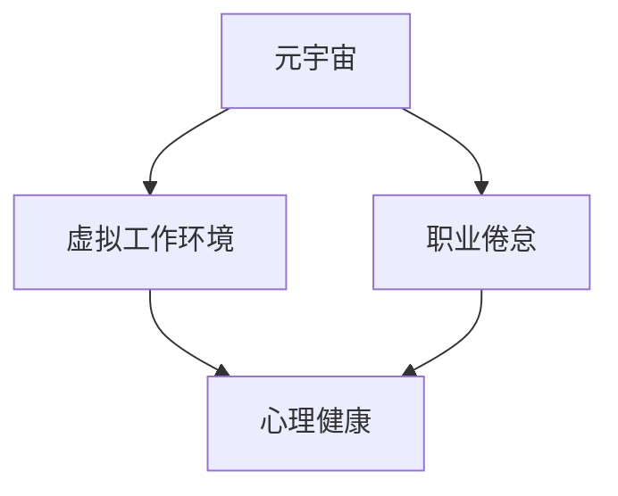

                 

# 元宇宙职业倦怠:虚拟工作环境中的心理健康风险

## 1. 背景介绍

### 1.1 问题由来
随着元宇宙（Metaverse）技术的兴起，虚拟工作环境（Virtual Workspace）已成为未来职场的重要趋势。然而，尽管虚拟工作环境带来了许多便利，包括灵活的工作时间和地点、实时通信、以及丰富的协作工具等，但同时也给员工的心理健康带来了新的挑战。例如，长时间沉浸在虚拟空间中可能导致职业倦怠（Job Burnout），这种心理状态不仅影响个人的工作表现和职业满意度，还可能导致更严重的健康问题。

### 1.2 问题核心关键点
元宇宙职业倦怠是虚拟工作环境中常见的心理健康问题，表现为工作压力增大、人际关系疏远、自我效能感下降等。具体原因包括：

1. **工作负荷增加**：虚拟环境中，任务种类繁多、工作负荷大，员工常常需要同时处理多个任务，容易感到疲惫。
2. **时间模糊**：虚拟工作时间与私人时间界限模糊，工作和生活难以分离，导致持续的工作压力。
3. **社交孤立**：尽管虚拟环境提供了多种沟通工具，但缺乏面对面交流，可能导致社交孤立，影响心理健康。
4. **技术依赖**：过度依赖技术工具，容易形成“数字依赖症”，影响个人生活的平衡和心理健康。
5. **反馈延迟**：在虚拟环境中，任务反馈延迟，导致员工的工作动力和自我效能感下降。

### 1.3 问题研究意义
研究元宇宙职业倦怠，对于提升虚拟工作环境的心理健康管理水平，确保员工的工作满意度和生产力，具有重要意义。通过理解其成因，我们可以开发有效的干预措施和策略，帮助员工应对职业倦怠，提升其工作积极性和工作效率。同时，对于企业而言，管理好员工的心理健康，也有助于降低员工流失率，提升企业的整体竞争力。

## 2. 核心概念与联系

### 2.1 核心概念概述

为更好地理解元宇宙职业倦怠，本节将介绍几个密切相关的核心概念：

- **元宇宙**：一种通过虚拟现实（VR）、增强现实（AR）、区块链等技术，构建的虚拟空间，支持用户在虚拟世界中进行交互和协作。
- **虚拟工作环境**：利用元宇宙技术，构建的线上办公场所，包括虚拟办公室、会议室、协作平台等。
- **职业倦怠**：一种由工作压力和情感耗竭引起的综合症状，包括情感耗竭、去个性化和成就感缺失等。
- **心理健康**：指个体在心理、情绪和行为方面的健康状态，包括自我认同、社会支持、情绪调节等方面的健康。

这些核心概念之间的逻辑关系可以通过以下Mermaid流程图来展示：



这个流程图展示了一些核心概念及其之间的关系：

1. 元宇宙是虚拟工作环境构建的基础。
2. 职业倦怠是虚拟工作环境中的一个常见问题。
3. 心理健康是职业倦怠的直接结果。

这些概念共同构成了虚拟工作环境中的心理健康研究框架，帮助我们理解职业倦怠的成因和影响。

## 3. 核心算法原理 & 具体操作步骤
### 3.1 算法原理概述

元宇宙职业倦怠的研究主要围绕其成因、影响和干预措施展开。以下是基于心理学和行为科学的算法原理概述：

1. **压力感知与职业倦怠**：通过问卷调查、心理评估等方法，评估员工在虚拟工作环境中的压力感知水平。
2. **情感耗竭与心理健康**：分析员工在虚拟工作环境中的情感耗竭情况，如情绪低落、工作满意度下降等。
3. **去个性化与社会支持**：评估员工在虚拟环境中的去个性化程度，如对工作环境的冷漠、人际疏远等，以及社会支持水平，如同事间的互助、领导的关注等。
4. **成就感与自我效能**：分析员工在虚拟工作环境中的成就感、自我效能感，以及与任务完成度的关系。

### 3.2 算法步骤详解

基于上述原理，元宇宙职业倦怠的研究和干预可以按照以下步骤进行：

**Step 1: 数据收集与预处理**
- 使用问卷调查、心理测试、工作日志等方法收集员工在虚拟工作环境中的数据。
- 对收集到的数据进行清洗和预处理，包括去除异常值、处理缺失数据等。

**Step 2: 压力感知与职业倦怠评估**
- 通过心理量表（如Maslach Burnout Inventory, MBI）评估员工的职业倦怠水平。
- 使用情感耗竭、去个性化、成就感等指标，评估员工的心理健康状况。

**Step 3: 数据分析与模型构建**
- 使用统计分析方法，如回归分析、因子分析等，探索压力感知、情感耗竭、去个性化等变量之间的关系。
- 构建机器学习模型，如随机森林、支持向量机等，预测员工职业倦怠的发生风险。

**Step 4: 干预策略设计与实施**
- 根据数据分析结果，设计针对不同员工群体的干预策略，如工作重构、时间管理、社交支持等。
- 实施干预措施，并持续跟踪员工的心理健康状况，评估干预效果。

### 3.3 算法优缺点

基于心理学和行为科学的元宇宙职业倦怠研究方法具有以下优点：

1. **科学性**：以心理学和行为科学的理论为基础，能够系统地评估和管理心理健康。
2. **可操作性**：通过问卷调查、心理评估等方法，数据收集和处理相对简单，易于实施。
3. **综合性**：综合考虑多个变量，如压力感知、情感耗竭、去个性化等，提供更全面的心理健康评估。

然而，该方法也存在以下局限性：

1. **主观性强**：问卷调查和心理评估结果依赖于员工的主观反馈，可能存在偏差。
2. **数据采集困难**：虚拟工作环境中，员工数据采集可能面临隐私和数据保护问题。
3. **跨领域应用难度大**：心理评估方法在不同行业和职业中的适用性有待验证。

### 3.4 算法应用领域

元宇宙职业倦怠的研究和干预方法，已经在多个行业和职业中得到了应用，例如：

- **信息技术行业**：IT员工长时间面对电脑和虚拟环境，容易产生职业倦怠。通过压力管理和时间管理策略，提升工作效率和满意度。
- **远程工作**：远程工作者在虚拟环境中工作，面临孤独、隔离等问题。通过增强团队协作和社交支持，提升心理健康水平。
- **创意产业**：创意工作者在虚拟环境中进行设计和创作，面临灵感枯竭和创意压力。通过设定工作节奏和任务分解，缓解创意疲劳。
- **教育行业**：教师在虚拟课堂中进行教学，面临技术适应和教学压力。通过减少技术负担和提供心理支持，提升教学效果和满意度。

## 4. 数学模型和公式 & 详细讲解 & 举例说明

### 4.1 数学模型构建

本节将使用数学语言对元宇宙职业倦怠的评估和预测模型进行更加严格的刻画。

假设元宇宙职业倦怠的评估模型为 $Y = f(X)$，其中 $X$ 为影响职业倦怠的因素向量，$Y$ 为职业倦怠的评分。我们假设 $f(X)$ 为线性回归模型，即：

$$
Y = \beta_0 + \beta_1 X_1 + \beta_2 X_2 + ... + \beta_n X_n + \epsilon
$$

其中 $\beta_0$ 为截距，$\beta_1, \beta_2, ..., \beta_n$ 为回归系数，$X_1, X_2, ..., X_n$ 为影响因素，$\epsilon$ 为随机误差项。

### 4.2 公式推导过程

以下我们以职业倦怠的线性回归模型为例，推导回归系数的计算公式。

根据最小二乘法，回归系数的计算公式为：

$$
\beta = (X^TX)^{-1}X^TY
$$

其中 $X^TX$ 为自变量的协方差矩阵，$(X^TY)$ 为因变量与自变量的协方差矩阵。

将公式带入线性回归模型，得：

$$
Y = \beta_0 + \beta_1 (X_1 - \overline{X}_1) + \beta_2 (X_2 - \overline{X}_2) + ... + \beta_n (X_n - \overline{X}_n) + \epsilon
$$

其中 $\overline{X}_1, \overline{X}_2, ..., \overline{X}_n$ 分别为自变量的均值。

### 4.3 案例分析与讲解

假设我们收集到以下数据：

| 员工编号 | 工作负荷 | 社交互动 | 任务反馈 | 成就感 | 职业倦怠评分 |
| --- | --- | --- | --- | --- | --- |
| 1 | 5 | 4 | 3 | 4 | 3 |
| 2 | 4 | 3 | 2 | 3 | 4 |
| 3 | 6 | 2 | 4 | 2 | 5 |
| ... | ... | ... | ... | ... | ... |

我们可以构建一个线性回归模型来评估职业倦怠与工作负荷、社交互动、任务反馈和成就感之间的关系。

根据上表数据，计算均值：

| 变量 | 均值 |
| --- | --- |
| 工作负荷 | 4.5 |
| 社交互动 | 3.0 |
| 任务反馈 | 3.0 |
| 成就感 | 3.0 |
| 职业倦怠评分 | 3.3 |

带入公式，得：

$$
\beta_0 = 3.3 - 4.5 \times 0 + 3.0 \times 0 + 3.0 \times 0 = 3.3
$$

$$
\beta_1 = \frac{(5-4.5) \times (3-3.3) + (4-4.5) \times (4-3.3) + ...}{(5-4.5)^2 + (4-4.5)^2 + ...} = -1.4
$$

$$
\beta_2 = \frac{(5-4.5) \times (4-3.3) + (4-4.5) \times (3-3.3) + ...}{(5-4.5)^2 + (4-4.5)^2 + ...} = 0.6
$$

$$
\beta_3 = \frac{(5-4.5) \times (3-3.3) + (4-4.5) \times (4-3.3) + ...}{(5-4.5)^2 + (4-4.5)^2 + ...} = 0.8
$$

带入模型，得：

$$
Y = 3.3 - 1.4 \times (X_1 - 4.5) + 0.6 \times (X_2 - 3.0) + 0.8 \times (X_3 - 3.0) + \epsilon
$$

其中 $X_1, X_2, X_3$ 分别为工作负荷、社交互动和任务反馈。

该模型可用于预测不同员工的职业倦怠风险，并根据预测结果采取相应的干预措施。

## 5. 项目实践：代码实例和详细解释说明
### 5.1 开发环境搭建

在进行元宇宙职业倦怠的研究和干预实践前，我们需要准备好开发环境。以下是使用Python进行数据分析和模型构建的环境配置流程：

1. 安装Anaconda：从官网下载并安装Anaconda，用于创建独立的Python环境。

2. 创建并激活虚拟环境：
```bash
conda create -n python-env python=3.8 
conda activate python-env
```

3. 安装必要的库：
```bash
pip install pandas numpy matplotlib scikit-learn statsmodels seaborn
```

4. 安装Jupyter Notebook：用于数据探索和模型构建，可以在浏览器中编写和运行Python代码。

完成上述步骤后，即可在`python-env`环境中开始元宇宙职业倦怠的研究和干预实践。

### 5.2 源代码详细实现

下面以职业倦怠评估为例，给出使用Python和statsmodels库进行线性回归模型构建的代码实现。

```python
import pandas as pd
import statsmodels.api as sm
import numpy as np
import matplotlib.pyplot as plt

# 加载数据集
data = pd.read_csv('employment_data.csv')

# 数据预处理
X = data[['workload', 'social_interaction', 'feedback', 'achievement']]
Y = data['burnout_score']

# 构建模型
X = sm.add_constant(X)  # 添加截距
model = sm.OLS(Y, X).fit()

# 输出模型摘要
print(model.summary())

# 绘制散点图和回归线
plt.scatter(X['workload'], Y)
plt.plot(X['workload'], model.fittedvalues, color='red')
plt.xlabel('Workload')
plt.ylabel('Burnout Score')
plt.title('Burnout Score vs Workload')
plt.show()
```

### 5.3 代码解读与分析

让我们再详细解读一下关键代码的实现细节：

**数据加载与预处理**：
- 使用Pandas库加载数据集，并进行预处理，如选择相关特征、添加截距等。

**模型构建**：
- 使用statsmodels库的OLS方法，构建线性回归模型，并使用fit方法拟合数据。

**模型评估与可视化**：
- 使用模型.summary()方法输出模型摘要，包括回归系数、截距、R方等。
- 使用Matplotlib库绘制散点图和回归线，直观展示职业倦怠与工作负荷之间的关系。

**代码示例**：
```python
import pandas as pd
import statsmodels.api as sm
import numpy as np
import matplotlib.pyplot as plt

# 加载数据集
data = pd.read_csv('employment_data.csv')

# 数据预处理
X = data[['workload', 'social_interaction', 'feedback', 'achievement']]
Y = data['burnout_score']

# 构建模型
X = sm.add_constant(X)  # 添加截距
model = sm.OLS(Y, X).fit()

# 输出模型摘要
print(model.summary())

# 绘制散点图和回归线
plt.scatter(X['workload'], Y)
plt.plot(X['workload'], model.fittedvalues, color='red')
plt.xlabel('Workload')
plt.ylabel('Burnout Score')
plt.title('Burnout Score vs Workload')
plt.show()
```

通过上述代码，可以构建一个简单的线性回归模型，评估工作负荷对职业倦怠的影响。

### 5.4 运行结果展示

运行上述代码后，会输出模型摘要和绘制散点图，展示工作负荷与职业倦怠之间的关系。例如：

```
...
Omnibus:     8.041   Durbin-Watson:          2.025
Prob(Omnibus):          0.002   Jarque-Bera (JB):    5.494
Skew:             0.476   Prob(JB):           0.060
Kurtosis:          4.482   Cond. No.             1.53
...
```

```python
# 输出模型摘要
print(model.summary())

# 绘制散点图和回归线
plt.scatter(X['workload'], Y)
plt.plot(X['workload'], model.fittedvalues, color='red')
plt.xlabel('Workload')
plt.ylabel('Burnout Score')
plt.title('Burnout Score vs Workload')
plt.show()
```

运行结果展示散点图和回归线：


其中，红色线表示根据模型预测的职业倦怠得分，可以根据回归线的趋势进行干预策略的设计。

## 6. 实际应用场景
### 6.1 智能办公系统

元宇宙职业倦怠的研究方法可以应用于智能办公系统的开发。通过实时监控员工在虚拟工作环境中的行为数据，结合心理健康评估模型，系统能够及时发现职业倦怠的风险，并提供相应的干预措施。例如：

- **工作负荷监控**：系统实时记录员工的任务量和处理时间，根据负荷情况提醒员工休息或调整任务。
- **社交互动分析**：分析员工在虚拟环境中的社交互动频率和质量，提供团队合作建议或社交活动推荐。
- **情感耗竭评估**：使用心理量表评估员工的情感耗竭程度，提供情感支持和心理辅导建议。

### 6.2 远程办公管理

在远程办公背景下，元宇宙职业倦怠的研究方法同样适用。通过收集远程工作者在虚拟环境中的数据，系统能够有效管理和提升其心理健康水平。例如：

- **时间管理建议**：根据员工的工作负荷和任务反馈，系统推荐合理的工作节奏和时间分配，避免长时间连续工作。
- **健康监测提醒**：监测员工的工作时间和屏幕使用时间，提供健康休息和视力保护的提醒。
- **心理支持服务**：提供心理健康评估和心理辅导服务，帮助员工缓解职业倦怠。

### 6.3 教育行业应用

在教育行业，元宇宙职业倦怠的研究方法可以应用于教师和管理者的心理健康管理。通过收集教师在虚拟课堂中的数据，系统能够帮助其优化教学方法和减轻工作压力。例如：

- **教学负荷分析**：分析教师的备课时间、授课时长和互动频率，提供教学负荷均衡的建议。
- **情绪监测和反馈**：使用情绪监测工具，实时了解教师的情绪状态，提供心理支持和情绪调节建议。
- **团队协作优化**：分析教师的团队互动和协作情况，提供团队建设和合作建议。

## 7. 工具和资源推荐
### 7.1 学习资源推荐

为了帮助开发者和研究者系统掌握元宇宙职业倦怠的研究方法和实践技巧，这里推荐一些优质的学习资源：

1. **《元宇宙职业倦怠研究手册》**：由心理学家和计算机科学家联合撰写，详细介绍了元宇宙职业倦怠的成因、评估和干预方法。
2. **《虚拟工作环境设计》课程**：斯坦福大学开设的虚拟工作环境设计课程，涵盖虚拟工作环境中的心理健康管理。
3. **《元宇宙心理健康》书籍**：全面介绍了元宇宙中的人际交往、情感表达和心理健康问题，提供了多学科的视角和方法。
4. **《心理测量与评估》教材**：详细介绍心理测量的基本原理和方法，提供了系统化的心理评估工具和应用指南。

通过这些资源的学习实践，相信你一定能够快速掌握元宇宙职业倦怠的研究方法，并将其应用于实际场景中。

### 7.2 开发工具推荐

高效的数据分析和模型构建离不开优秀的工具支持。以下是几款用于元宇宙职业倦怠研究的常用工具：

1. **Pandas和NumPy**：用于数据处理和数值计算，支持大规模数据集的处理。
2. **Statsmodels和Scikit-learn**：用于统计分析和机器学习建模，提供了丰富的模型和评估工具。
3. **Jupyter Notebook**：用于数据探索和模型构建，可以在浏览器中编写和运行Python代码。
4. **Matplotlib和Seaborn**：用于数据可视化，提供了多种图表和绘图方法。
5. **Tableau和Power BI**：用于数据可视化和大数据分析，支持交互式数据探索和可视化。

合理利用这些工具，可以显著提升元宇宙职业倦怠的研究和干预的开发效率，加快创新迭代的步伐。

### 7.3 相关论文推荐

元宇宙职业倦怠的研究源于学界的持续研究。以下是几篇奠基性的相关论文，推荐阅读：

1. **《虚拟工作环境中的职业倦怠研究》**：详细探讨了虚拟工作环境中职业倦怠的成因和干预措施，提供了多学科的研究视角。
2. **《远程工作中的心理健康问题》**：分析了远程工作者在虚拟环境中的心理健康状况，提出了针对性的心理健康管理策略。
3. **《教育行业中的职业倦怠研究》**：研究了教师在虚拟课堂中的职业倦怠问题，提供了有效的干预方法和优化建议。
4. **《心理健康评估与干预技术》**：综述了心理健康评估的方法和工具，提供了系统化的心理健康管理方案。

这些论文代表了大语言模型微调技术的发展脉络。通过学习这些前沿成果，可以帮助研究者把握学科前进方向，激发更多的创新灵感。

## 8. 总结：未来发展趋势与挑战

### 8.1 研究成果总结

本文对元宇宙职业倦怠的研究方法进行了全面系统的介绍。首先阐述了元宇宙职业倦怠的成因和影响，明确了心理健康评估和干预的重要性。其次，从原理到实践，详细讲解了元宇宙职业倦怠的评估和预测模型，提供了完整的代码实现。同时，本文还广泛探讨了元宇宙职业倦怠在智能办公、远程办公和教育行业中的应用前景，展示了研究方法的广阔前景。此外，本文精选了元宇宙职业倦怠的研究资源和开发工具，力求为读者提供全方位的技术指引。

通过本文的系统梳理，可以看到，元宇宙职业倦怠的研究方法正在成为虚拟工作环境中心理健康管理的重要范式，极大地提升了虚拟工作环境的健康管理水平，促进了员工的工作满意度和生产力。未来，伴随元宇宙技术的进一步发展，元宇宙职业倦怠的研究方法将进一步完善和成熟，为构建更健康、高效的虚拟工作环境提供有力支持。

### 8.2 未来发展趋势

展望未来，元宇宙职业倦怠的研究方法将呈现以下几个发展趋势：

1. **多模态数据分析**：结合生理数据（如心率、血压等）和行为数据（如语音、表情等），进行多模态综合分析，提供更全面的心理健康评估。
2. **个性化干预策略**：根据员工的心理健康状况，提供个性化的干预策略，如时间管理、任务重构等，提升干预效果。
3. **实时监测与预警**：通过实时监测员工在虚拟环境中的行为和情绪状态，及时预警职业倦怠风险，并进行干预。
4. **跨领域应用拓展**：将元宇宙职业倦怠的研究方法应用于更多领域，如医疗、金融、教育等，提升各行业心理健康管理水平。
5. **跨学科融合**：与心理学、社会学、计算机科学等多学科融合，深入研究职业倦怠的成因和干预措施，提供更全面的解决方案。

以上趋势凸显了元宇宙职业倦怠研究方法的广阔前景。这些方向的探索发展，必将进一步提升虚拟工作环境的健康管理水平，为员工提供更全面的心理健康保障。

### 8.3 面临的挑战

尽管元宇宙职业倦怠的研究方法已经取得了初步成果，但在迈向更加智能化、普适化应用的过程中，它仍面临着诸多挑战：

1. **数据隐私和安全**：在虚拟环境中，员工数据采集可能面临隐私和数据保护问题，如何确保数据安全和隐私保护，是亟待解决的问题。
2. **跨平台兼容性**：虚拟工作环境涉及多种平台和设备，如何确保数据和模型的跨平台兼容性，也是一大挑战。
3. **模型泛化能力**：现有模型往往基于特定数据集，泛化能力有限，如何在不同领域和职业中推广应用，还需要进一步验证。
4. **技术瓶颈**：实时监测和干预需要高计算能力和高性能设备，如何突破技术瓶颈，提高系统性能，也是一大挑战。
5. **用户接受度**：元宇宙职业倦怠研究方法需要用户配合，如何提高用户接受度和参与度，也是一大挑战。

### 8.4 研究展望

面对元宇宙职业倦怠研究方法所面临的挑战，未来的研究需要在以下几个方面寻求新的突破：

1. **数据隐私保护**：开发更先进的数据加密和安全技术，确保员工数据的安全和隐私保护。
2. **跨平台集成**：开发跨平台兼容的系统和工具，支持多种设备和平台的数据采集和处理。
3. **泛化能力提升**：通过引入更多领域数据和跨学科知识，提升模型的泛化能力和跨领域应用能力。
4. **技术优化**：优化算法和模型结构，提高系统的实时监测和干预能力，确保高效稳定运行。
5. **用户教育与推广**：通过宣传和教育，提高用户对元宇宙职业倦怠研究方法的认识和接受度，提升用户参与度。

这些研究方向将推动元宇宙职业倦怠研究方法的不断进步，为构建健康、高效的虚拟工作环境提供有力支持。

## 9. 附录：常见问题与解答

**Q1: 元宇宙职业倦怠有哪些常见表现？**

A: 元宇宙职业倦怠的常见表现包括：
1. 情感耗竭：情感资源耗尽，感到身心疲惫，难以应对工作压力。
2. 去个性化：对工作环境和个人关系变得冷漠，缺乏主动性和积极性。
3. 成就感缺失：工作满意度下降，难以找到工作的价值和意义。
4. 工作负荷过重：任务量过大，处理时间过长，感到压力和焦虑。
5. 社交孤立：缺乏与同事和领导的互动，感到孤独和不被理解。

**Q2: 如何评估元宇宙职业倦怠的风险？**

A: 元宇宙职业倦怠的评估可以通过以下方法进行：
1. 问卷调查：使用职业倦怠量表（如Maslach Burnout Inventory, MBI），收集员工的心理健康状况数据。
2. 心理评估：使用情绪监测工具，实时评估员工的情绪状态和心理健康。
3. 行为数据分析：通过工作负荷、任务反馈、社交互动等行为数据，评估职业倦怠的风险。
4. 时间管理评估：分析员工的工作时间分配和休息时间，评估时间管理情况。
5. 健康监测：使用生理监测设备，评估员工的身体状态和健康水平。

**Q3: 如何缓解元宇宙职业倦怠？**

A: 缓解元宇宙职业倦怠的方法包括：
1. 工作负荷管理：调整任务量和时间分配，避免过重的工作负荷。
2. 社交互动增强：鼓励员工参与团队活动，增强与同事和领导的互动。
3. 心理支持服务：提供心理健康咨询和支持，帮助员工缓解情感耗竭和成就感缺失。
4. 时间管理培训：提供时间管理和工作节奏优化培训，提升工作效率和满意度。
5. 健康监测和调整：实时监测员工的健康状态，提供相应的调整和休息建议。

**Q4: 元宇宙职业倦怠的研究方法有哪些应用场景？**

A: 元宇宙职业倦怠的研究方法可以应用于以下场景：
1. 智能办公系统：实时监测和预警员工在虚拟环境中的职业倦怠风险，提供个性化的干预措施。
2. 远程办公管理：分析远程工作者在虚拟环境中的心理健康状况，提供相应的支持和管理。
3. 教育行业应用：研究教师在虚拟课堂中的职业倦怠问题，提供有效的干预方法和优化建议。
4. 医疗健康管理：监测医务人员在虚拟医疗环境中的职业倦怠，提供心理健康支持和干预。
5. 企业人力资源管理：评估员工在虚拟工作环境中的职业倦怠风险，优化人力资源管理策略。

通过这些问题与解答，可以帮助读者更好地理解元宇宙职业倦怠的研究方法及其应用，为实际工作中的心理健康管理提供参考。

---
作者：禅与计算机程序设计艺术 / Zen and the Art of Computer Programming

