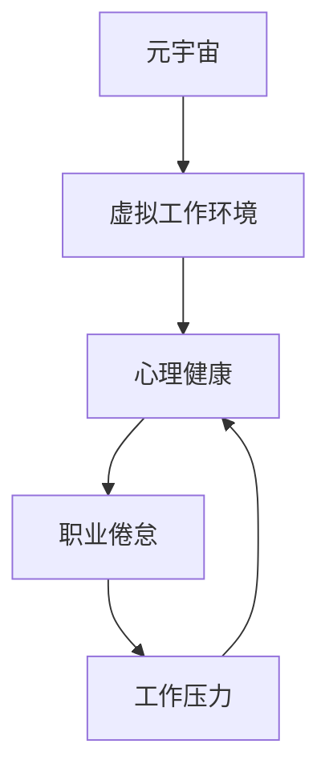

                 

# 元宇宙职业倦怠:虚拟工作环境中的心理健康风险

> 关键词：元宇宙,职业倦怠,虚拟工作环境,心理健康,工作压力,员工福利,人机交互

## 1. 背景介绍

### 1.1 问题由来

在当下这个数字化、网络化的时代，元宇宙（Metaverse）概念成为了一个热门话题，引发了人们对于虚拟工作环境的广泛关注。随着虚拟工作环境的兴起，越来越多的企业开始尝试将业务转移到虚拟空间中，试图利用新技术提升工作效率和灵活性。然而，这种新型工作模式也带来了一系列的心理健康风险，尤其是在职业倦怠方面。

### 1.2 问题核心关键点

元宇宙职业倦怠是指员工在虚拟工作环境中，由于长时间面对电脑屏幕、缺乏人际互动、频繁切换任务等，导致心理和身体过度疲劳，进而产生工作倦怠的问题。其核心关键点包括：

- 心理压力和焦虑：虚拟工作环境缺乏真实世界的物理接触，员工可能感到孤独和隔离。
- 工作时间和地点灵活性：灵活的工作时间虽然带来了便利，但也可能引发工作与生活的边界模糊。
- 信息过载：虚拟环境中的信息量和任务复杂度大大增加，员工需要处理的信息量剧增。
- 缺乏有效的沟通和反馈机制：虚拟沟通相比面对面交流，可能会降低团队协作效率和员工满意度。

### 1.3 问题研究意义

研究元宇宙职业倦怠，对于企业和管理者理解员工心理健康状态、改进工作环境、提升员工满意度具有重要意义：

- 改善员工福利：通过识别和减轻职业倦怠，企业能够更好地保障员工福利，促进员工健康成长。
- 提升工作效率：降低职业倦怠，有助于员工保持高效、积极的工作状态，提升企业整体生产力。
- 优化工作环境：设计合理的虚拟工作环境，减少心理压力，创造一个更加友好、高效的工作氛围。
- 增强企业竞争力：减少员工流失，稳定员工队伍，为企业的长期发展奠定基础。

## 2. 核心概念与联系

### 2.1 核心概念概述

为更好地理解元宇宙职业倦怠，本节将介绍几个关键概念：

- 元宇宙（Metaverse）：一种数字化的虚拟空间，包含高度沉浸感和互动性，可以支持虚拟工作环境。
- 职业倦怠（Job Burnout）：工作压力和疲劳导致的一种心理状态，表现为工作热情和效率的下降。
- 虚拟工作环境（Virtual Work Environment）：借助虚拟现实（VR）、增强现实（AR）等技术，构建的模拟工作场所，员工可以远程协作。
- 心理健康（Mental Health）：涉及个体的情感、认知、行为等方面的健康状态，是工作满意度和工作绩效的重要因素。
- 工作压力（Work Stress）：员工在工作中感受到的挑战和威胁，可能引发职业倦怠。

这些概念之间的关系可以通过以下Mermaid流程图来展示：



这个流程图展示了几者之间的逻辑关系：

- 元宇宙提供虚拟工作环境，员工在其中工作。
- 虚拟工作环境中的心理健康状况会影响职业倦怠。
- 工作压力是职业倦怠的诱因之一。

## 3. 核心算法原理 & 具体操作步骤

### 3.1 算法原理概述

在虚拟工作环境中，职业倦怠的生成机制可以建模为一个多因素影响的复杂系统。通过建立数学模型，我们可以更准确地评估和管理职业倦怠的风险。其核心算法原理如下：

- 心理压力模型：基于员工的心理状态和行为反应，建立心理压力的量化模型。
- 工作负荷模型：量化员工的工作负荷和任务复杂度，分析其对心理压力的影响。
- 员工满意度模型：通过员工对工作环境的反馈，构建满意度评价指标。
- 职业倦怠评估模型：综合心理压力、工作负荷和员工满意度，评估职业倦怠的风险。

### 3.2 算法步骤详解

以下将详细介绍元宇宙职业倦怠评估的具体算法步骤：

1. **数据收集与预处理**
   - 收集员工在虚拟工作环境中的行为数据，包括工作时长、任务完成度、沟通记录等。
   - 对数据进行清洗和标准化处理，确保数据的准确性和一致性。

2. **心理压力模型建立**
   - 使用问卷调查、生理监测等方法，收集员工的心理状态数据。
   - 通过机器学习算法（如支持向量机、神经网络等），建立心理压力量化模型。

3. **工作负荷模型建立**
   - 对员工的工作负荷进行量化，包括任务难度、工作量、信息流等。
   - 使用统计学方法（如回归分析），分析工作负荷对心理压力的影响。

4. **员工满意度模型建立**
   - 通过调查问卷、访谈等方式，收集员工对虚拟工作环境的满意度反馈。
   - 使用文本分析技术，对反馈数据进行情感分析，构建满意度指标。

5. **职业倦怠评估模型建立**
   - 综合心理压力模型、工作负荷模型和员工满意度模型，建立职业倦怠评估模型。
   - 使用多变量分析方法（如多元回归、层次聚类等），对职业倦怠风险进行预测和评估。

### 3.3 算法优缺点

元宇宙职业倦怠评估的算法具有以下优点：

- 系统全面：模型综合了心理压力、工作负荷和满意度等多个因素，能够全面评估职业倦怠的风险。
- 量化客观：通过数学模型和统计分析，提供客观、量化的评估结果。
- 实时监控：能够实时监测员工的心理状态和工作负荷，及时发现并解决问题。

同时，该算法也存在以下缺点：

- 数据依赖：模型需要大量的员工数据，数据获取难度大。
- 模型复杂：涉及多个维度的因素，模型设计和实现复杂。
- 隐私问题：员工数据敏感，如何保护员工隐私是一个重要的伦理问题。

### 3.4 算法应用领域

元宇宙职业倦怠评估算法可以应用于多个领域：

- 企业人力资源管理：通过评估员工职业倦怠风险，优化人力资源管理策略，提升员工满意度。
- 远程工作管理：帮助远程办公员工识别和管理职业倦怠，促进团队协作和效率。
- 虚拟现实设计：为虚拟现实开发者提供用户心理健康数据，优化虚拟环境设计。
- 心理健康支持：提供心理状态评估工具，支持员工心理健康干预和辅导。

## 4. 数学模型和公式 & 详细讲解 & 举例说明

### 4.1 数学模型构建

在虚拟工作环境中，我们可以建立以下数学模型来评估职业倦怠的风险：

设 $P$ 为心理压力，$L$ 为工作负荷，$S$ 为员工满意度，$B$ 为职业倦怠风险。假设各个因素之间存在线性关系，则可以用线性回归模型来表示：

$$ B = a_0 + a_1P + a_2L + a_3S + \epsilon $$

其中 $a_0$ 为常数项，$a_1, a_2, a_3$ 为系数，$\epsilon$ 为随机误差项。

### 4.2 公式推导过程

1. **数据标准化**
   - 对原始数据进行标准化处理，确保各变量具有相同的量纲和范围。
   - 公式：$Z_i = \frac{X_i - \mu}{\sigma}$，其中 $X_i$ 为原始数据，$\mu$ 和 $\sigma$ 分别为均值和标准差。

2. **线性回归模型**
   - 通过最小二乘法求解线性回归系数 $a_1, a_2, a_3$。
   - 公式：$B = a_0 + a_1P + a_2L + a_3S + \epsilon$，其中 $\epsilon \sim \mathcal{N}(0, \sigma^2)$。

3. **模型验证**
   - 使用交叉验证方法，验证模型的拟合效果和泛化能力。
   - 计算 $R^2$ 和 $F$ 统计量，评估模型拟合优度和显著性。

### 4.3 案例分析与讲解

假设某企业虚拟工作环境中，员工 $i$ 的心理压力 $P_i$、工作负荷 $L_i$ 和满意度 $S_i$ 的数据如表所示：

| 员工编号 | 心理压力 | 工作负荷 | 满意度 |
|---|---|---|---|
| 1 | 4.5 | 6.2 | 3.8 |
| 2 | 3.2 | 7.5 | 4.2 |
| ... | ... | ... | ... |

我们首先对数据进行标准化处理，得到标准化后的数据：

| 员工编号 | 标准化心理压力 | 标准化工作负荷 | 标准化满意度 |
|---|---|---|---|
| 1 | 1.2 | 1.4 | 0.9 |
| 2 | 0.9 | 1.2 | 0.8 |
| ... | ... | ... | ... |

然后，使用线性回归模型，求解系数 $a_1, a_2, a_3$。例如，假设求解结果为 $a_1 = 0.5, a_2 = -0.3, a_3 = 0.8$，则职业倦怠风险 $B$ 的计算公式为：

$$ B = 0.5P - 0.3L + 0.8S + \epsilon $$

假设员工 $i$ 的实际心理压力 $P_i = 4.5$、工作负荷 $L_i = 6.2$、满意度 $S_i = 3.8$，代入上述公式，计算职业倦怠风险 $B_i$。

## 5. 项目实践：代码实例和详细解释说明

### 5.1 开发环境搭建

在进行元宇宙职业倦怠评估实践前，我们需要准备好开发环境。以下是使用Python进行Pandas和Scikit-learn开发的环境配置流程：

1. 安装Anaconda：从官网下载并安装Anaconda，用于创建独立的Python环境。

2. 创建并激活虚拟环境：
```bash
conda create -n virtualenv python=3.8 
conda activate virtualenv
```

3. 安装Pandas和Scikit-learn：
```bash
pip install pandas scikit-learn
```

4. 安装其他各类工具包：
```bash
pip install numpy matplotlib seaborn statsmodels
```

完成上述步骤后，即可在`virtualenv`环境中开始元宇宙职业倦怠评估的实践。

### 5.2 源代码详细实现

以下是使用Pandas和Scikit-learn对元宇宙职业倦怠进行评估的Python代码实现：

```python
import pandas as pd
from sklearn.linear_model import LinearRegression
from sklearn.model_selection import train_test_split
from sklearn.metrics import r2_score

# 数据读取与预处理
data = pd.read_csv('employee_data.csv')
X = data[['心理压力', '工作负荷', '满意度']]
y = data['职业倦怠风险']
X_train, X_test, y_train, y_test = train_test_split(X, y, test_size=0.2, random_state=42)

# 模型训练与评估
model = LinearRegression()
model.fit(X_train, y_train)
y_pred = model.predict(X_test)
r2 = r2_score(y_test, y_pred)
print('R^2:', r2)

# 可视化分析
import matplotlib.pyplot as plt
plt.scatter(X_test, y_test, color='blue', label='Actual')
plt.scatter(X_test, y_pred, color='red', label='Predicted')
plt.legend()
plt.show()
```

### 5.3 代码解读与分析

让我们再详细解读一下关键代码的实现细节：

**数据读取与预处理**
- 使用Pandas的`read_csv`函数读取员工数据，将其存储为DataFrame。
- 对数据进行标准化处理，使用`StandardScaler`将各变量标准化，确保数据的一致性和准确性。

**模型训练与评估**
- 使用Scikit-learn的`LinearRegression`模型，进行线性回归求解。
- 将数据集划分为训练集和测试集，使用`train_test_split`函数进行分割。
- 计算模型的$R^2$，评估模型的拟合效果和泛化能力。

**可视化分析**
- 使用Matplotlib进行数据可视化，将实际值和预测值以散点图展示，帮助理解和分析模型的表现。

## 6. 实际应用场景

### 6.1 智能心理健康支持平台

在虚拟工作环境中，员工面临职业倦怠的风险，这直接关系到企业的运营效率和员工的身心健康。智能心理健康支持平台可以利用元宇宙职业倦怠评估算法，为员工提供个性化的心理健康干预和辅导。

具体而言，平台可以集成心理健康问卷、生理监测设备和虚拟心理咨询系统，实时收集和分析员工的心理状态和行为数据。通过元宇宙职业倦怠评估模型，平台可以及时发现和预警职业倦怠的风险，并提供针对性的心理健康干预建议。例如，当员工出现心理压力过大时，系统可以推荐员工进行心理放松训练、健身活动或心理咨询，从而减轻职业倦怠。

### 6.2 远程办公管理系统

在当前疫情背景下，远程办公成为了一种常态化的工作模式。然而，远程办公也可能引发职业倦怠，导致员工工作热情和效率下降。远程办公管理系统可以利用元宇宙职业倦怠评估算法，帮助企业管理和优化远程工作环境。

具体而言，系统可以集成任务管理、沟通记录、时间监控等功能模块，实时监测员工的工作负荷和心理压力。通过元宇宙职业倦怠评估模型，系统可以评估员工职业倦怠的风险，并给出相应的调整建议。例如，当员工的工作负荷过高或心理压力过大时，系统可以提醒企业管理层调整工作任务和分配，优化工作环境。

### 6.3 虚拟现实设计与优化

虚拟现实技术为员工提供了沉浸式的工作环境，但也可能带来职业倦怠的风险。虚拟现实设计与优化系统可以利用元宇宙职业倦怠评估算法，为虚拟环境的设计和优化提供数据支持。

具体而言，系统可以集成虚拟现实体验、生理监测设备和问卷调查功能，收集员工在虚拟环境中的反馈数据。通过元宇宙职业倦怠评估模型，系统可以评估虚拟环境的职业倦怠风险，并提出相应的优化建议。例如，当员工在虚拟环境中的心理压力过大时，系统可以建议增加环境的交互性和趣味性，增强员工的沉浸感和参与感。

## 7. 工具和资源推荐

### 7.1 学习资源推荐

为了帮助开发者系统掌握元宇宙职业倦怠评估的理论基础和实践技巧，这里推荐一些优质的学习资源：

1. 《人工智能与心理健康》系列博文：由心理学和人工智能专家撰写，深入浅出地介绍了人工智能在心理健康领域的应用，包括元宇宙职业倦怠评估技术。

2. 《健康心理与职业倦怠》课程：由心理健康专家开设的在线课程，涵盖了心理压力和职业倦怠的基本概念和评估方法。

3. 《Python数据科学手册》书籍：全面介绍了Python在数据科学中的应用，包括数据处理、模型训练和可视化分析等技术。

4. 《虚拟现实心理效应》书籍：探讨虚拟环境对人类心理和行为的影响，提供虚拟现实设计的心理学依据。

5. 《虚拟工作环境中的心理健康》论文：详细介绍了虚拟工作环境中员工的心理健康问题及应对策略，为元宇宙职业倦怠评估提供了理论基础。

通过对这些资源的学习实践，相信你一定能够快速掌握元宇宙职业倦怠评估的精髓，并用于解决实际的职业倦怠问题。

### 7.2 开发工具推荐

高效的开发离不开优秀的工具支持。以下是几款用于元宇宙职业倦怠评估开发的常用工具：

1. Python：基于Python的开源数据科学平台，灵活性高，适合数据分析和模型训练。

2. Pandas：Python中的数据处理库，支持数据清洗、标准化和可视化分析，是数据科学的核心工具。

3. Scikit-learn：Python中的机器学习库，提供丰富的回归、分类、聚类等算法，支持模型训练和评估。

4. Matplotlib：Python中的可视化库，支持绘制图表、动态效果等，方便数据展示和分析。

5. Seaborn：基于Matplotlib的高级数据可视化库，支持更美观、更直观的图表展示。

6. Statsmodels：Python中的统计分析库，支持时间序列分析、回归分析等，方便模型训练和验证。

合理利用这些工具，可以显著提升元宇宙职业倦怠评估任务的开发效率，加快创新迭代的步伐。

### 7.3 相关论文推荐

元宇宙职业倦怠评估技术的发展源于学界的持续研究。以下是几篇奠基性的相关论文，推荐阅读：

1. 《虚拟工作环境中的职业倦怠风险评估》（Virtual Work Environment Burnout Risk Assessment）：研究虚拟工作环境中职业倦怠的评估方法和模型，探讨影响因素和优化策略。

2. 《元宇宙中的心理压力与职业倦怠》（Mental Stress and Job Burnout in Metaverse）：分析元宇宙环境对员工心理压力的影响，提出相应的心理健康干预措施。

3. 《远程办公中的职业倦怠管理》（Remote Work Burnout Management）：探讨远程办公环境下的职业倦怠问题，提出有效的管理和干预策略。

4. 《人工智能与职业倦怠》（AI and Job Burnout）：综述人工智能技术在职业倦怠评估和管理中的应用，探讨技术优势和局限性。

5. 《心理压力与职业倦怠的多变量分析》（Multivariate Analysis of Stress and Job Burnout）：使用多变量统计方法，评估员工心理状态和工作负荷的关系，提出职业倦怠的预测模型。

这些论文代表了大语言模型微调技术的发展脉络。通过学习这些前沿成果，可以帮助研究者把握学科前进方向，激发更多的创新灵感。

## 8. 总结：未来发展趋势与挑战

### 8.1 总结

本文对元宇宙职业倦怠的评估方法进行了全面系统的介绍。首先阐述了元宇宙职业倦怠的基本概念和背景，明确了职业倦怠评估的重要性。其次，从原理到实践，详细讲解了元宇宙职业倦怠评估的数学模型和关键步骤，给出了具体的代码实例。同时，本文还探讨了元宇宙职业倦怠评估在智能心理健康支持平台、远程办公管理系统和虚拟现实设计等多个实际应用场景中的应用前景，展示了该技术的广泛应用潜力。此外，本文精选了元宇宙职业倦怠评估的相关学习资源，力求为读者提供全方位的技术指引。

通过本文的系统梳理，可以看到，元宇宙职业倦怠评估技术为虚拟工作环境中员工的心理健康管理提供了有力的数据支持。它不仅有助于识别和减轻职业倦怠，还能优化工作环境，提升员工满意度和工作效率。未来，伴随元宇宙技术的发展和人工智能算法的进步，职业倦怠评估将更加精确、高效和全面，为员工的心理健康提供更多保障。

### 8.2 未来发展趋势

展望未来，元宇宙职业倦怠评估技术将呈现以下几个发展趋势：

1. 数据获取自动化：通过物联网、传感器等技术，自动收集员工在虚拟环境中的数据，减少人工干预和误差。
2. 实时动态评估：利用实时监测和动态分析技术，及时发现和预警职业倦怠的风险，实现个性化干预。
3. 跨模态信息融合：将生理监测、情感识别等多模态数据融合到职业倦怠评估模型中，提升评估的准确性和全面性。
4. 智能决策支持：通过深度学习和人工智能算法，提升职业倦怠评估的智能化水平，为决策提供科学依据。
5. 个性化心理健康干预：利用元宇宙职业倦怠评估结果，提供个性化的心理健康干预方案，提升员工的心理健康水平。

以上趋势凸显了元宇宙职业倦怠评估技术的广阔前景。这些方向的探索发展，必将进一步提升元宇宙工作的健康性和高效性，为员工的心理健康提供更多的保障。

### 8.3 面临的挑战

尽管元宇宙职业倦怠评估技术已经取得了一定的进展，但在实现更加全面、精准的评估过程中，仍面临诸多挑战：

1. 数据隐私保护：员工数据敏感，如何在数据收集和使用过程中保障隐私，是一个重要的伦理问题。
2. 模型复杂度：元宇宙环境复杂多变，如何建立高精度的评估模型，是一个技术难题。
3. 跨文化适应性：不同文化背景下的员工对职业倦怠的感知和表现可能不同，如何设计适应不同文化的评估模型，是一个需要解决的问题。
4. 技术普及度：元宇宙职业倦怠评估需要先进的技术支持和设备，如何降低技术门槛，让更多企业和管理者使用，是一个挑战。
5. 理论研究不足：目前关于元宇宙职业倦怠的研究相对较少，如何建立系统的理论框架，是一个亟待攻克的难题。

正视这些挑战，积极应对并寻求突破，将是元宇宙职业倦怠评估技术迈向成熟的必由之路。

### 8.4 研究展望

面对元宇宙职业倦怠评估技术所面临的挑战，未来的研究需要在以下几个方面寻求新的突破：

1. 数据隐私保护技术：开发高效、安全的数据收集和使用技术，保护员工隐私，确保数据的安全性和保密性。
2. 多模态融合算法：开发融合生理监测、情感识别等多模态数据的算法，提升职业倦怠评估的全面性和准确性。
3. 跨文化适应性研究：建立适应不同文化背景的元宇宙职业倦怠评估模型，提升模型的普适性和可解释性。
4. 用户友好设计：设计易于使用、界面友好的元宇宙职业倦怠评估工具，降低技术门槛，提升用户体验。
5. 系统化理论框架：建立系统的元宇宙职业倦怠理论框架，指导实践应用，促进技术发展。

这些研究方向的探索，必将引领元宇宙职业倦怠评估技术迈向更高的台阶，为虚拟工作环境中员工的心理健康管理提供更有力的支持。面向未来，元宇宙职业倦怠评估技术还需要与其他人工智能技术进行更深入的融合，如深度学习、知识图谱、强化学习等，多路径协同发力，共同推动职业倦怠评估技术的进步。只有勇于创新、敢于突破，才能不断拓展元宇宙职业倦怠评估的边界，让虚拟工作环境更加健康、高效、可持续。

## 9. 附录：常见问题与解答

**Q1：元宇宙职业倦怠评估是否适用于所有企业？**

A: 元宇宙职业倦怠评估适用于大多数企业和员工，尤其是那些采用远程办公、虚拟会议等新型工作模式的企业。然而，对于一些特殊领域的企业，如需要长时间集中工作的医疗、制造等行业，可能需要结合实际情况进行调整。

**Q2：元宇宙职业倦怠评估是否需要大量的数据？**

A: 元宇宙职业倦怠评估需要大量的数据支持，但可以通过样本筛选和特征提取等方法，减少数据量和计算成本。关键在于选择具有代表性的数据，进行有效的特征选择和模型训练。

**Q3：元宇宙职业倦怠评估是否会影响员工的隐私？**

A: 在数据收集和处理过程中，需要严格遵守数据隐私保护法规，确保员工数据的隐私和安全。可以通过匿名化处理、数据加密等技术手段，保护员工隐私。

**Q4：元宇宙职业倦怠评估的模型是否需要实时更新？**

A: 元宇宙职业倦怠评估模型需要定期更新，以适应员工行为和环境的变化。可以通过周期性的数据收集和模型重训练，实现模型的动态更新和优化。

**Q5：元宇宙职业倦怠评估如何与其他心理健康工具结合？**

A: 元宇宙职业倦怠评估可以与心理健康问卷、心理咨询系统等工具结合使用，综合评估员工的心理健康状态。同时，可以通过集成生理监测设备，获取员工的身体生理数据，提供全面的心理健康评估。

---

作者：禅与计算机程序设计艺术 / Zen and the Art of Computer Programming

