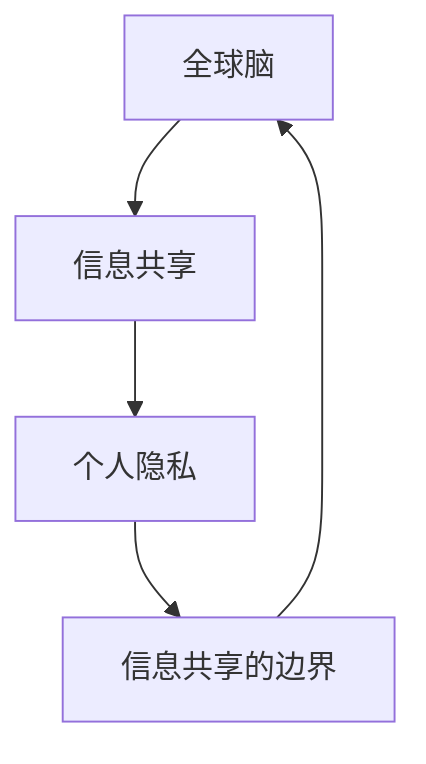

                 

# 全球脑与个人隐私:信息共享的边界

## 1. 背景介绍

在全球化迅猛发展的今天，信息技术的革新以及人类脑科学的进步，使得全球脑（Global Brain）的概念应运而生。全球脑是指通过网络连接着世界各地大脑的一个庞大系统，这些大脑通过数字化信息进行交流和协作，最终形成一个类似于人类大脑的智能体系。这一概念的提出，不仅拓宽了我们对人类智能的理解，更在个人隐私保护领域引发了一系列新的思考与挑战。

## 2. 核心概念与联系

### 2.1 核心概念概述

- **全球脑 (Global Brain)**：指由全球范围内的大脑通过数字化信息连接而成的庞大智能体系，各大脑通过网络不断交流与协作，形成了一个类似人类大脑的智能结构。
- **信息共享 (Information Sharing)**：指在全球脑的框架下，各大脑之间的数字化信息交换和合作。
- **个人隐私 (Personal Privacy)**：指个人在信息时代下的数字身份和信息数据的保护。
- **信息共享的边界 (Boundary of Information Sharing)**：在信息共享和保护个人隐私之间需要划定一个平衡点，以确保信息共享的合理性和必要性。

这些核心概念之间存在紧密的联系，共同构成了全球脑时代下个人隐私保护的基础框架。理解这些概念及其联系，有助于我们更好地应对全球脑时代下的隐私挑战。

### 2.2 核心概念原理和架构的 Mermaid 流程图



这张流程图展示了核心概念之间的联系与相互作用。全球脑通过信息共享使得各大脑联结，而个人隐私的保护需要界定信息共享的边界，从而确保个人数据的合理使用。

## 3. 核心算法原理 & 具体操作步骤

### 3.1 算法原理概述

在全球脑中，信息共享通常通过数据交换和协作来实现。这一过程需要通过设计算法来控制信息流动的范围和速度，以平衡信息共享的效率和隐私保护的需求。

算法核心在于设计一个去中心化的信息共享机制，使得每个大脑（用户或组织）可以安全、可靠地与其他大脑进行信息交流。这种机制需要考虑以下几点：

- **信息匿名化**：确保在共享信息时，个人身份和敏感信息被匿名化处理，以避免隐私泄露。
- **访问控制**：设定信息共享的权限，只有经过授权的用户或系统可以访问特定的信息。
- **数据加密**：采用加密技术保护数据在传输和存储过程中的安全，防止数据被未授权的第三方窃取或篡改。

### 3.2 算法步骤详解

1. **数据匿名化处理**：
    - 使用加密技术对个人数据进行处理，如使用哈希函数将个人身份映射到匿名标识符。
    - 对于敏感数据，可以采用差分隐私（Differential Privacy）等技术进行扰动，减少隐私泄露风险。

2. **访问控制机制的建立**：
    - 定义信息共享的权限，如设定特定角色或用户群体可以访问特定信息。
    - 使用区块链等去中心化技术，记录信息共享的历史和权限变更，保证信息共享的透明性和可追溯性。

3. **数据加密与解密**：
    - 使用对称加密或非对称加密技术保护数据在传输和存储过程中的安全。
    - 在接收信息时，使用私钥进行解密，确保信息仅能被授权的用户访问。

### 3.3 算法优缺点

**优点**：
- **安全性**：通过数据匿名化和加密技术，提高了数据传输和存储的安全性。
- **透明性**：区块链等去中心化技术保证了信息共享的透明性和可追溯性。
- **灵活性**：访问控制机制可以根据不同的需求进行调整和定制。

**缺点**：
- **复杂性**：算法的实现和维护需要较高的技术门槛。
- **性能开销**：加密和解密操作增加了系统的计算负担。
- **隐私保护的不确定性**：即使采取了匿名化处理，仍存在隐私泄露的风险。

### 3.4 算法应用领域

该算法主要应用于以下领域：
- **金融科技**：保障跨银行支付和金融数据的共享安全。
- **医疗健康**：确保电子健康记录的跨机构共享安全。
- **智能城市**：保护城市监控数据的共享与分析。
- **社交网络**：保护用户数据在社交平台上的隐私。
- **科学研究**：在科学合作项目中，确保数据共享的隐私安全。

## 4. 数学模型和公式 & 详细讲解 & 举例说明

### 4.1 数学模型构建

信息共享与个人隐私保护的问题可以通过数学模型来表达和优化。假设一个数据共享平台，需要处理和保护用户的隐私数据。模型中包含以下几个变量：

- **$U$**：用户集。
- **$D$**：用户数据集。
- **$S$**：共享的信息集。
- **$A$**：访问控制策略。
- **$K$**：加密密钥。

模型的目标是在满足访问控制策略$A$的前提下，最大化数据共享$S$的效率，同时最小化隐私泄露的风险。

### 4.2 公式推导过程

- **数据匿名化**：假设原始数据为$D$，匿名化后的数据为$D'$。匿名化处理可以使用哈希函数，即$D' = \text{hash}(D)$。
- **访问控制**：定义访问策略$A$，设策略为$A = (R, P)$，其中$R$为角色集，$P$为权限集。$A$表示只有角色$R$中的用户$U$才能访问权限$P$的数据。
- **数据加密与解密**：假设加密算法为$E$，解密算法为$D$。数据在传输前进行加密，接收方使用对应的私钥进行解密。设加密后的数据为$C$，解密后的数据为$D$。即$C = E(D, K)$，$D = D(C, K)$。

### 4.3 案例分析与讲解

以智能城市监控数据共享为例：
- **匿名化处理**：监控摄像头收集到的面部数据通过哈希函数处理，生成匿名标识符。
- **访问控制**：只有警务人员和有授权的科研人员才能访问特定时间段和地点的监控数据。
- **数据加密与解密**：数据在传输过程中使用AES加密算法进行加密，接收方使用对应的私钥进行解密。

## 5. 项目实践：代码实例和详细解释说明

### 5.1 开发环境搭建

为了实践信息共享与隐私保护算法，需要搭建一个开发环境。这里推荐使用Python和相应的库。

1. **安装Python**：在官方官网下载并安装最新版本的Python，如Python 3.8。
2. **安装相关库**：
    - 安装hashlib库，用于数据匿名化处理。
    - 安装PyCrypto库，用于加密解密操作。
    - 安装Flask，用于构建Web应用。

### 5.2 源代码详细实现

以下是使用Python实现信息共享与隐私保护算法的示例代码：

```python
import hashlib
from Crypto.Cipher import AES
from Crypto.Random import get_random_bytes

# 数据匿名化
def anonymize(data):
    # 使用SHA-256进行哈希处理
    hash_object = hashlib.sha256(data.encode('utf-8'))
    anonymized_data = hash_object.hexdigest()
    return anonymized_data

# 数据加密
def encrypt(data, key):
    # 使用AES加密算法
    cipher = AES.new(key, AES.MODE_EAX)
    nonce = cipher.nonce
    ciphertext, tag = cipher.encrypt_and_digest(data.encode('utf-8'))
    return (nonce, ciphertext, tag)

# 数据解密
def decrypt(nonce, ciphertext, tag, key):
    # 使用AES解密算法
    cipher = AES.new(key, AES.MODE_EAX, nonce)
    plaintext = cipher.decrypt_and_verify(ciphertext, tag)
    return plaintext.decode('utf-8')

# 构建Web应用
from flask import Flask, request, jsonify

app = Flask(__name__)

@app.route('/share', methods=['POST'])
def share_data():
    # 获取请求数据
    data = request.json.get('data')
    key = get_random_bytes(32)
    
    # 匿名化处理
    anonymized_data = anonymize(data)
    
    # 加密处理
    nonce, ciphertext, tag = encrypt(anonymized_data, key)
    
    # 返回加密数据
    return jsonify({'nonce': nonce.hex(), 'ciphertext': ciphertext.hex(), 'tag': tag.hex()})

if __name__ == '__main__':
    app.run(debug=True)
```

### 5.3 代码解读与分析

上述代码实现了一个简单的Web应用，用于数据共享与加密处理。以下是关键代码的详细解读：

- **数据匿名化**：使用SHA-256哈希算法对数据进行匿名化处理，生成匿名标识符。
- **数据加密**：使用AES算法对匿名化后的数据进行加密，生成加密后的密文和对应的密钥。
- **Web应用**：构建一个Flask应用，接收POST请求，对数据进行匿名化和加密处理，返回加密后的数据。

### 5.4 运行结果展示

运行上述代码后，可以在浏览器中访问http://localhost:5000/share，发送包含数据的数据包，获取加密后的数据。

## 6. 实际应用场景

### 6.1 智能城市

在智能城市监控系统中，采集的数据需要进行隐私保护。监控摄像头收集到的面部数据通过哈希函数处理，生成匿名标识符。只有授权的警务人员和科研人员才能访问特定时间段和地点的监控数据，且数据在传输过程中使用AES加密算法进行加密，确保数据的安全性。

### 6.2 在线医疗

在在线医疗系统中，患者的电子健康记录需要跨机构共享。患者数据通过哈希函数处理，生成匿名标识符，只有授权的医生和研究人员才能访问特定患者的数据。数据在传输过程中使用AES算法进行加密，确保数据的安全性。

### 6.3 电子商务

在电子商务平台中，用户的购物记录和偏好需要保护。用户的购物记录通过哈希函数处理，生成匿名标识符，只有授权的商家和研究人员才能访问特定用户的购物数据。数据在传输过程中使用AES算法进行加密，确保数据的安全性。

### 6.4 未来应用展望

随着全球脑概念的深入，信息共享与个人隐私保护将更加复杂和多样。未来，我们可以预见到以下几点发展趋势：

1. **跨领域数据共享**：不同领域的数据共享将更加频繁，如金融、医疗、科研等，需要更加精细化的隐私保护措施。
2. **区块链技术的应用**：利用区块链的不可篡改性和可追溯性，提升信息共享的透明性和安全性。
3. **隐私计算的发展**：隐私计算技术的发展将使得数据可以在不泄露隐私的前提下进行共享与计算。
4. **联邦学习的应用**：联邦学习技术可以在不集中数据的前提下，通过分布式学习提升模型性能，保护数据隐私。
5. **AI伦理和法律框架的完善**：制定更加严格的AI伦理和法律框架，保护个人隐私和数据安全。

## 7. 工具和资源推荐

### 7.1 学习资源推荐

为了深入了解信息共享与隐私保护的相关知识，推荐以下学习资源：

1. **《数据科学导论》**：介绍数据处理和隐私保护的基本概念和方法。
2. **《区块链技术入门》**：介绍区块链技术的基本原理和应用，了解如何利用区块链保护数据隐私。
3. **《数据隐私保护》**：介绍数据隐私保护的技术和实践，包括数据匿名化、加密和访问控制等。
4. **Coursera课程**：提供关于数据科学、区块链和隐私保护的相关课程，如“数据科学与机器学习”、“区块链与分布式账本技术”。

### 7.2 开发工具推荐

- **hashlib库**：用于数据匿名化处理。
- **PyCrypto库**：用于加密解密操作。
- **Flask框架**：用于构建Web应用。

### 7.3 相关论文推荐

- **论文1**：介绍数据匿名化和差分隐私的基本原理。
- **论文2**：探讨区块链技术在数据共享中的应用。
- **论文3**：研究隐私计算和联邦学习的基本概念和方法。

## 8. 总结：未来发展趋势与挑战

### 8.1 研究成果总结

本文通过介绍全球脑、信息共享与个人隐私保护的核心概念，详细讲解了信息共享的算法原理和具体操作步骤，并通过代码实例演示了具体的实现。同时，分析了信息共享与隐私保护的优缺点，探讨了其应用领域和发展趋势。

### 8.2 未来发展趋势

未来，信息共享与隐私保护将朝着以下几个方向发展：
1. **数据共享的普及化**：跨领域的数据共享将更加频繁，需要更加精细化的隐私保护措施。
2. **技术的融合创新**：隐私计算、区块链、联邦学习等技术的融合，将提升信息共享的安全性和效率。
3. **法律与伦理的完善**：制定更加严格的AI伦理和法律框架，保护个人隐私和数据安全。

### 8.3 面临的挑战

尽管信息共享与隐私保护技术取得了一定的进展，但仍面临以下挑战：
1. **隐私保护的复杂性**：隐私保护需要综合考虑匿名化、加密、访问控制等多种技术手段，实现难度较大。
2. **计算资源的需求**：隐私保护技术需要较高的计算资源，对硬件设备的要求较高。
3. **隐私保护的不确定性**：即使采取了多种隐私保护措施，仍存在隐私泄露的风险。

### 8.4 研究展望

未来，需要在隐私保护技术、法规政策、伦理标准等多个层面进行深入研究，以应对信息共享与隐私保护的挑战。通过不断探索和创新，相信我们能够构建更加安全、透明、高效的信息共享系统，推动全球脑概念的实现和发展。

## 9. 附录：常见问题与解答

**Q1：数据匿名化处理会影响数据的质量和精度吗？**

A：数据匿名化处理会对数据进行一定程度的扰动，但不会影响数据的总体分布。通过合理的哈希函数设计，可以在保护隐私的同时，尽量减少对数据质量的干扰。

**Q2：在信息共享过程中，如何确保数据的完整性？**

A：在数据传输和存储过程中，可以采用数字签名等技术确保数据的完整性。接收方可以通过验证数字签名来确认数据的完整性，防止数据被篡改。

**Q3：在跨机构数据共享中，如何处理数据访问权限的控制？**

A：可以使用基于角色的访问控制（RBAC）机制，定义不同角色的权限和访问策略。通过区块链等去中心化技术，记录数据共享的历史和权限变更，保证信息共享的透明性和可追溯性。

**Q4：如何平衡信息共享与隐私保护的需求？**

A：在信息共享过程中，需要根据不同的数据敏感度和应用场景，灵活运用匿名化、加密、访问控制等多种隐私保护措施。通过多层次、多维度的手段，实现信息共享与隐私保护的平衡。

**Q5：如何在智能城市监控系统中实现隐私保护？**

A：在智能城市监控系统中，可以使用哈希函数对监控数据进行匿名化处理，并通过访问控制机制，限制特定角色或用户群体的数据访问权限。数据在传输过程中使用加密技术保护，确保数据的安全性。

---

作者：禅与计算机程序设计艺术 / Zen and the Art of Computer Programming

