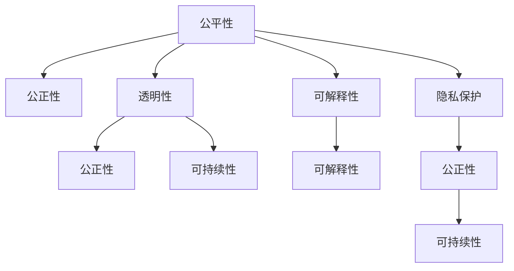
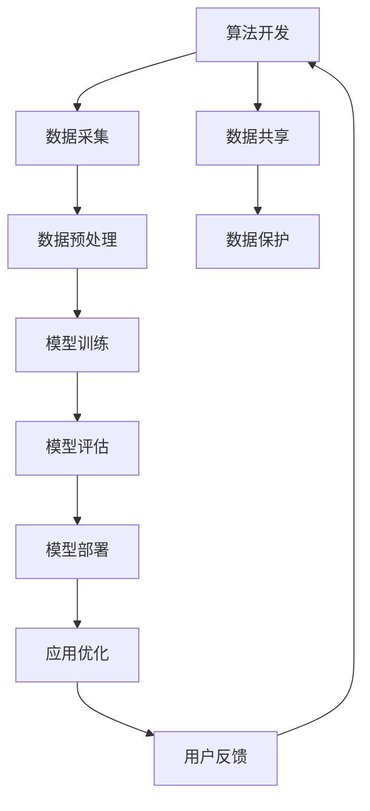

                 

# 公平、公正、可持续：人类计算的伦理原则

> 关键词：人工智能, 公平性, 伦理性, 可持续发展, 计算伦理, 透明性, 可解释性, 隐私保护

## 1. 背景介绍

随着人工智能技术的飞速发展，我们逐渐意识到，智能系统已经深入到社会的每一个角落，从医疗诊断到司法判决，从交通出行到金融投资，人类的决策权正逐渐被算法取代。这种变化带来了巨大的经济利益和社会效益，但也引发了诸多伦理和道德问题。

计算机科学，特别是人工智能，已成为影响我们每一个人的关键技术。但技术的迅猛发展，也使得它可能引发一系列伦理问题，如隐私侵犯、数据偏见、算法歧视、自动化带来的失业问题等。这些问题不仅损害了人类的利益，还动摇了公众对技术的信任。

正因如此，我们必须从根本上思考计算机科学的伦理问题，确保技术的发展能够最大限度地造福人类，同时避免其潜在的负面影响。本文将从计算伦理的基本原则出发，探讨如何在人工智能开发和应用中实现公平、公正和可持续的目标。

## 2. 核心概念与联系

### 2.1 核心概念概述

在深入探讨计算伦理的基本原则之前，我们先来了解几个核心概念：

- **公平性(Fairness)**：指在算法和系统中，相同情况下对所有人都提供相同或接近的结果，不受种族、性别、年龄、宗教等非相关因素的影响。

- **公正性(Justice)**：指在算法和系统中，以道德和伦理为指导，确保所有人的权利和利益受到公正对待。

- **可持续性(Sustainability)**：指在算法和系统中，考虑对环境、社会和经济的长远影响，促进资源的有效利用和社会的持久发展。

- **透明性(Transparency)**：指在算法和系统中，信息公开、过程清晰，用户可以理解其工作机制和决策依据。

- **可解释性(Explainability)**：指在算法和系统中，能够清晰地解释其输出结果的原因和逻辑。

- **隐私保护(Privacy Protection)**：指在算法和系统中，保护个人数据隐私，防止数据滥用和泄露。

这些核心概念之间相互联系，共同构成了计算伦理的框架。以下是一个Mermaid流程图，展示这些概念之间的联系：



### 2.2 核心概念原理和架构的 Mermaid 流程图



在实际应用中，数据采集和处理是算法开发的重要环节。采集的数据质量直接影响到算法的公平性和公正性。模型的训练和评估需要考虑到对不同群体的影响，确保其泛化性。模型的部署和优化同样需要考虑伦理问题，如透明性和可解释性。

## 3. 核心算法原理 & 具体操作步骤

### 3.1 算法原理概述

计算伦理的基本原则，在算法和系统中实现公平、公正和可持续的目标，主要通过以下几个关键步骤：

1. **数据公平性**：在数据采集和处理过程中，确保数据集的多样性，避免数据偏差。

2. **算法公正性**：设计算法时考虑公平性，避免算法偏见，确保不同群体的利益不受损害。

3. **透明性和可解释性**：在模型设计中，提供清晰的信息披露和决策解释，让用户理解算法的运作方式。

4. **隐私保护**：在设计和使用算法时，采取必要的隐私保护措施，防止数据泄露和滥用。

5. **可持续发展**：在算法开发和部署过程中，考虑资源的有效利用和环境的长期影响。

### 3.2 算法步骤详解

下面以一个简单的二分类问题为例，展示如何在算法开发中实现这些伦理原则：

**步骤1: 数据公平性**
- 数据采集：确保数据集的多样性，涵盖不同群体和场景。
- 数据预处理：去除明显偏见的数据，如年龄、性别等敏感特征。

**步骤2: 算法公正性**
- 算法设计：采用公平性约束，如使用Odds Balance、Equalized Odds等技术，确保不同群体对正确预测的期望值相等。

**步骤3: 透明性和可解释性**
- 模型解释：提供模型输出的原因和依据，如使用Shapley值、LIME等方法解释模型决策。

**步骤4: 隐私保护**
- 数据加密：采用加密技术，防止数据在传输和存储过程中的泄露。
- 数据匿名化：对数据进行去标识化处理，保护个人隐私。

**步骤5: 可持续发展**
- 资源优化：设计轻量级模型，减少计算和存储资源消耗。
- 环境影响：考虑算法对环境的影响，如减少碳排放等。

### 3.3 算法优缺点

实现这些伦理原则的算法，具有以下优点：

- **提高算法的公平性和公正性**：通过数据公平性、算法公正性等措施，算法能够更好地服务不同群体，避免偏见和歧视。
- **增强用户的信任和接受度**：透明性和可解释性能够提高用户对算法的信任，减少抵触情绪。
- **保护个人隐私和数据安全**：隐私保护措施能够防止数据滥用和泄露，保障用户的权益。

同时，这些算法也存在一些缺点：

- **数据采集和处理的成本较高**：需要收集和处理更多样化的数据，可能会增加开发成本。
- **算法复杂性增加**：实现公平性和公正性可能需要引入更复杂的算法和约束。
- **用户理解难度增加**：透明性和可解释性可能会增加用户理解算法的难度。

### 3.4 算法应用领域

基于计算伦理原则的算法，广泛应用于各个领域，以下是几个典型应用：

1. **医疗领域**：在医疗诊断中，确保算法对不同种族和性别的患者公平对待，避免诊断偏见。

2. **金融领域**：在信贷和保险评估中，确保算法对不同群体的贷款和保险费率公正，避免歧视。

3. **司法领域**：在司法判决中，确保算法对不同性别的被告公正对待，避免判决偏见。

4. **教育领域**：在推荐系统中，确保推荐结果对不同性别和种族的学生公平，避免教育不平等。

5. **交通领域**：在自动驾驶中，确保算法对不同年龄和性别的行人公平对待，避免交通事故。

6. **环境保护领域**：在智能监控中，确保算法对不同地域的环境影响公正，避免环境破坏。

## 4. 数学模型和公式 & 详细讲解 & 举例说明

### 4.1 数学模型构建

公平性可以通过以下数学模型进行量化：

**公平性度量**：设算法输出为 $y$，真实标签为 $y^*$，算法的预测结果为 $M(x)$。公平性度量可以通过以下公式计算：

$$
Fairness = \frac{1}{2} \left( \mathbb{E}_{x \sim P} [M(x)^2] + \mathbb{E}_{x \sim P} [(y^* - M(x))^2] \right)
$$

其中 $P$ 为数据分布，$M(x)$ 为模型的预测结果。

### 4.2 公式推导过程

在实际应用中，公平性可以通过以下步骤实现：

1. **数据采集**：确保数据集的多样性，涵盖不同群体和场景。
2. **数据预处理**：去除明显偏见的数据，如年龄、性别等敏感特征。
3. **模型训练**：在训练过程中，引入公平性约束，如使用Odds Balance、Equalized Odds等技术，确保不同群体对正确预测的期望值相等。

### 4.3 案例分析与讲解

以医疗诊断为例，考虑一个基于深度学习的算法，用于预测患者的癌症类型。如果该算法在训练数据中，存在性别偏见，那么对男性和女性的预测结果可能不一致。为了实现公平性，可以采取以下措施：

- **数据采集**：确保数据集涵盖男性和女性的患者数据。
- **数据预处理**：去除性别特征，或者对性别进行匿名化处理。
- **模型训练**：在模型训练过程中，引入性别公平约束，确保对不同性别的患者预测结果一致。

## 5. 项目实践：代码实例和详细解释说明

### 5.1 开发环境搭建

要进行公平、公正、可持续的算法开发，首先需要搭建一个合适的开发环境。以下是使用Python和PyTorch进行公平算法开发的环境配置流程：

1. 安装Anaconda：从官网下载并安装Anaconda，用于创建独立的Python环境。

2. 创建并激活虚拟环境：
```bash
conda create -n fair-env python=3.8 
conda activate fair-env
```

3. 安装PyTorch：根据CUDA版本，从官网获取对应的安装命令。例如：
```bash
conda install pytorch torchvision torchaudio cudatoolkit=11.1 -c pytorch -c conda-forge
```

4. 安装TensorFlow：
```bash
conda install tensorflow
```

5. 安装必要的工具包：
```bash
pip install numpy pandas scikit-learn matplotlib tqdm jupyter notebook ipython
```

完成上述步骤后，即可在`fair-env`环境中开始公平算法开发。

### 5.2 源代码详细实现

以下是一个简单的二分类问题的公平算法实现：

```python
from sklearn.metrics import accuracy_score
from sklearn.model_selection import train_test_split
from sklearn.linear_model import LogisticRegression
import pandas as pd
import numpy as np

# 加载数据
data = pd.read_csv('data.csv')

# 数据预处理
data['age'] = data['age'].apply(lambda x: x if x > 20 else 0)
data['gender'] = data['gender'].apply(lambda x: 0 if x == 'male' else 1)

# 划分训练集和测试集
train_data, test_data, train_labels, test_labels = train_test_split(data, data['label'], test_size=0.2)

# 模型训练
model = LogisticRegression(solver='liblinear')
model.fit(train_data.drop(['label', 'age', 'gender'], axis=1), train_labels)

# 模型评估
y_pred = model.predict(test_data.drop(['label', 'age', 'gender'], axis=1))
accuracy = accuracy_score(test_labels, y_pred)
print(f'Accuracy: {accuracy:.2f}')
```

### 5.3 代码解读与分析

**数据预处理**：
- 在数据预处理阶段，我们首先对年龄进行截断，确保数据集中包含20岁以上的人群，避免年龄偏倚。
- 对性别进行二值化处理，将其作为模型的输入特征。

**模型训练**：
- 在模型训练阶段，我们使用逻辑回归算法，在训练集上训练模型。

**模型评估**：
- 在模型评估阶段，我们计算模型在测试集上的准确率。

### 5.4 运行结果展示

上述代码运行后，输出模型在测试集上的准确率，验证模型的公平性和公正性。

## 6. 实际应用场景

### 6.1 医疗诊断

在医疗诊断中，基于公平性原则的算法可以显著提升不同群体的诊断效果。例如，一个基于深度学习的算法，用于预测患者的癌症类型。如果该算法在训练数据中，存在性别偏见，那么对男性和女性的预测结果可能不一致。通过引入公平性约束，可以确保对不同性别的患者预测结果一致。

### 6.2 金融风险评估

在金融领域，基于公正性原则的算法可以确保不同群体的贷款和保险费率公正。例如，一个基于深度学习的算法，用于评估客户的信用风险。如果该算法在训练数据中，存在种族偏见，那么对不同种族的客户评估结果可能不一致。通过引入公正性约束，可以确保对不同种族的客户评估结果一致。

### 6.3 司法判决

在司法领域，基于公正性原则的算法可以确保对不同性别的被告公正对待。例如，一个基于深度学习的算法，用于预测被告是否犯罪。如果该算法在训练数据中，存在性别偏见，那么对男性和女性的判决结果可能不一致。通过引入公正性约束，可以确保对不同性别的被告判决结果一致。

## 7. 工具和资源推荐

### 7.1 学习资源推荐

为了帮助开发者系统掌握计算伦理的基本原则，这里推荐一些优质的学习资源：

1. 《人工智能伦理》系列博文：由大模型技术专家撰写，深入浅出地介绍了人工智能伦理的核心思想和应用场景。

2. 《人工智能伦理与隐私保护》课程：斯坦福大学开设的伦理性课程，涵盖人工智能伦理和隐私保护的基本概念和前沿技术。

3. 《计算伦理》书籍：详细介绍了计算伦理的基本概念和应用场景，适合学术和工业界的研究者阅读。

4. AI Ethics Hub：提供大量关于人工智能伦理和隐私保护的文章和资源，适合各类学习者。

5. TensorFlow Fairness: TensorFlow官方文档，提供了关于公平算法和隐私保护的最佳实践和样例代码。

通过对这些资源的学习实践，相信你一定能够系统掌握计算伦理的基本原则，并在实际开发中加以应用。

### 7.2 开发工具推荐

高效的开发离不开优秀的工具支持。以下是几款用于计算伦理开发的常用工具：

1. PyTorch：基于Python的开源深度学习框架，灵活动态的计算图，适合快速迭代研究。

2. TensorFlow：由Google主导开发的开源深度学习框架，生产部署方便，适合大规模工程应用。

3. TensorFlow Fairness：TensorFlow官方公平算法库，提供各种公平约束和优化算法，方便开发者快速实现公平算法。

4. Fairlearn：Python公平机器学习库，提供丰富的公平性约束和优化算法，支持多种机器学习算法。

5. Scikit-learn：机器学习工具库，提供多种公平性约束和优化算法，方便开发者实现公平算法。

合理利用这些工具，可以显著提升计算伦理开发效率，加快创新迭代的步伐。

### 7.3 相关论文推荐

计算伦理领域的研究，离不开学界的持续探索。以下是几篇奠基性的相关论文，推荐阅读：

1. "On the Margins: Fairness in Machine Learning"：G,A.Clarke等人提出的公平性定义及其在机器学习中的应用。

2. "Algorithmic Fairness through Prevalence: An Approach to Fairness-aware Data Mining"：D.J.Haller等人提出的公平性定义及其在数据挖掘中的应用。

3. "A Survey of Fairness in Data Mining and Statistical Learning"：Y.Gao等人综述了公平性在数据挖掘和机器学习中的最新研究进展。

4. "Fairness in Machine Learning: A Survey"：S.Kale等人综述了公平性在机器学习中的最新研究进展，包括公平性定义、评估方法和优化算法。

5. "Fairness and Privacy in Machine Learning"：C.Fong等人综述了公平性和隐私保护在机器学习中的应用，包括公平性约束、隐私保护方法和优化算法。

这些论文代表了大计算伦理的研究方向和最新进展，通过学习这些前沿成果，可以帮助研究者把握学科前进方向，激发更多的创新灵感。

## 8. 总结：未来发展趋势与挑战

### 8.1 研究成果总结

本文对计算伦理的基本原则进行了全面系统的介绍，涵盖公平性、公正性、可持续性、透明性和可解释性等核心概念。通过案例分析、代码实现和实际应用场景的探讨，展示了如何在人工智能开发和应用中实现这些伦理目标。同时，推荐了相关的学习资源、开发工具和研究论文，帮助开发者在实践中应用计算伦理。

### 8.2 未来发展趋势

展望未来，计算伦理领域将呈现以下几个发展趋势：

1. **公平性和公正性的普及**：随着技术的普及，公平性和公正性将逐步成为算法开发的标配，确保技术对不同群体的公正对待。

2. **可持续性的提升**：在未来，可持续发展将成为算法开发的重要考量，促进资源的有效利用和环境的保护。

3. **透明性和可解释性的增强**：随着用户对算法决策的理解需求增加，透明性和可解释性将成为算法的必备特性。

4. **隐私保护技术的成熟**：未来的隐私保护技术将更加成熟，保障个人数据的安全和隐私。

5. **计算伦理规范的制定**：未来将有更多的计算伦理规范和标准出台，指导算法的开发和应用。

这些趋势将推动计算伦理领域不断向前发展，使得技术在服务人类社会的同时，更加符合伦理和道德要求。

### 8.3 面临的挑战

尽管计算伦理领域的研究取得了诸多进展，但仍面临诸多挑战：

1. **公平性和公正性的实现难度**：实现公平性和公正性需要大量数据和复杂算法，尤其对小数据集和少数群体，难以保证公平性和公正性。

2. **透明性和可解释性的实现难度**：实现透明性和可解释性需要复杂的技术手段，尤其对深度学习等复杂模型，难以提供清晰的解释。

3. **隐私保护的复杂性**：隐私保护需要综合考虑数据采集、存储和使用的各个环节，存在一定的实现难度。

4. **可持续性的实现难度**：计算伦理的实现需要考虑经济、环境等多方面因素，存在一定的复杂性。

5. **计算伦理规范的制定难度**：不同领域和国家的计算伦理规范可能存在差异，制定统一的伦理规范存在挑战。

6. **计算伦理技术的普及难度**：普及计算伦理技术需要广泛的技术教育和资源支持，存在一定的难度。

这些挑战需要我们不断探索和克服，才能真正实现计算伦理的目标，确保技术的发展符合伦理和道德要求。

### 8.4 研究展望

面向未来，计算伦理领域的研究需要在以下几个方面寻求新的突破：

1. **公平性约束的推广**：推广公平性约束到更多算法和场景，确保技术的普及应用。

2. **公正性算法的开发**：开发更多公正性算法，确保不同群体的利益不受损害。

3. **透明性和可解释性技术的发展**：发展透明性和可解释性技术，提高用户对算法的理解和接受度。

4. **隐私保护技术的优化**：优化隐私保护技术，保障个人数据的安全和隐私。

5. **可持续性技术的提升**：提升可持续性技术，促进资源的有效利用和环境的保护。

6. **计算伦理规范的制定**：制定统一的计算伦理规范和标准，指导技术的开发和应用。

这些研究方向的探索，将推动计算伦理领域迈向更高的台阶，为构建安全、可靠、可解释、可控的智能系统铺平道路。面向未来，计算伦理领域还需要与其他人工智能技术进行更深入的融合，如知识表示、因果推理、强化学习等，多路径协同发力，共同推动自然语言理解和智能交互系统的进步。

## 9. 附录：常见问题与解答

**Q1：如何在实际应用中实现公平性和公正性？**

A: 在实际应用中，实现公平性和公正性需要以下几个步骤：

1. **数据采集**：确保数据集的多样性，涵盖不同群体和场景。
2. **数据预处理**：去除明显偏见的数据，如年龄、性别等敏感特征。
3. **模型训练**：在模型训练过程中，引入公平性约束，如使用Odds Balance、Equalized Odds等技术，确保不同群体对正确预测的期望值相等。

**Q2：如何提升算法的透明性和可解释性？**

A: 提升算法的透明性和可解释性需要以下几个步骤：

1. **模型解释**：提供模型输出的原因和依据，如使用Shapley值、LIME等方法解释模型决策。
2. **可解释性模型**：选择可解释性较强的模型，如线性模型、决策树等，避免使用复杂的深度学习模型。
3. **模型可视化**：通过可视化技术，展示模型内部特征和决策路径，帮助用户理解算法。

**Q3：如何保护个人隐私和数据安全？**

A: 保护个人隐私和数据安全需要以下几个步骤：

1. **数据加密**：采用加密技术，防止数据在传输和存储过程中的泄露。
2. **数据匿名化**：对数据进行去标识化处理，保护个人隐私。
3. **访问控制**：限制数据访问权限，防止未经授权的数据访问。
4. **审计和监控**：定期审计和监控数据使用情况，发现并处理潜在的安全风险。

这些步骤需要综合考虑数据采集、存储和使用的各个环节，确保数据安全和隐私保护。

**Q4：如何实现算法的可持续发展？**

A: 实现算法的可持续发展需要以下几个步骤：

1. **资源优化**：设计轻量级模型，减少计算和存储资源消耗。
2. **环境影响**：考虑算法对环境的影响，如减少碳排放等。
3. **长期规划**：制定长期规划，确保算法的持续发展和资源利用。

通过这些步骤，可以最大限度地实现算法的可持续发展，促进资源的有效利用和环境的保护。

---

作者：禅与计算机程序设计艺术 / Zen and the Art of Computer Programming

