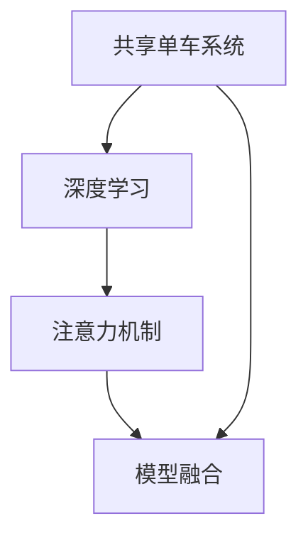

                 

## 1. 背景介绍

共享单车作为一种绿色环保的出行方式，在全球范围内迅速普及，极大地改善了城市居民的出行效率和生活质量。然而，随着共享单车数量激增，城市交通环境中注意力资源的争夺变得愈发激烈。如何在城市移动场景下有效利用注意力，最大化提升共享单车的使用体验和服务质量，成为各方关注的焦点。本文将通过分析共享单车系统中的注意力问题，提出基于深度学习的注意力机制模型，来优化单车的调度策略，提升用户体验和服务效率。

## 2. 核心概念与联系

### 2.1 核心概念概述

为更好地理解基于深度学习的注意力机制在共享单车中的应用，本节将介绍几个关键概念：

- **共享单车系统**：由单车、用户、骑行线路组成的网络系统。用户通过App寻找和预订单车，系统根据用户需求进行调度。
- **注意力机制**：一种在深度学习中广泛应用的机制，用于模型集中关注输入数据中的关键部分，忽略冗余信息。在共享单车中，注意力机制可以帮助模型识别用户需求和环境变化，优化调度策略。
- **深度学习**：一种强大的机器学习范式，通过多层神经网络学习输入数据的抽象表示，发现数据中的模式和规律。在共享单车系统中，深度学习模型可以自动处理复杂的调度任务。
- **模型融合**：将多个模型的预测结果进行组合，提升系统性能。在共享单车调度中，不同模型可以互补各自的优点，提供更准确的调度方案。

这些核心概念通过逻辑节点图来展示：



### 2.2 核心概念原理和架构

注意力机制（Attention Mechanism）是深度学习模型中的一种机制，用于模型从输入中提取关键信息。其核心思想是通过计算输入数据中不同部分的相关性，动态地调整权重，使得模型更加关注对任务有帮助的信息。在共享单车系统中，注意力机制可以应用于用户需求预测、单车调度优化等任务。

以用户需求预测为例，设输入为用户的骑行请求，输出为骑行线路的推荐列表。模型通过计算用户请求中的每个字或词与推荐线路的相关性，获得每个字或词的注意力权重，再通过加权求和的方式得到综合权重，最终输出推荐列表。

- **输入表示**：将用户请求表示为向量，每个维度对应一个词或字，表示其特征。
- **注意力计算**：通过计算输入向量与推荐线路的权重，得到注意力权重。
- **输出预测**：通过加权求和得到综合权重，用于预测推荐线路。

以下是一个简单的注意力机制实现流程：


## 3. 核心算法原理 & 具体操作步骤

### 3.1 算法原理概述

基于深度学习的注意力机制在共享单车中的应用，本质上是利用深度学习模型学习用户需求和环境变化，通过注意力机制计算权重，并优化调度策略的过程。其核心思想是通过多层次的表示学习，捕捉用户需求和环境变化的关键特征，从而提升单车的调度和推荐效果。

### 3.2 算法步骤详解

**Step 1: 数据预处理**

1. 数据收集：从共享单车App中收集用户的骑行请求、单车位置、天气等信息。
2. 数据清洗：去除无关信息，如重复请求、异常请求等。
3. 数据划分：将数据划分为训练集、验证集和测试集。

**Step 2: 模型构建**

1. 模型选择：选择合适的深度学习模型，如RNN、LSTM、Transformer等。
2. 添加注意力机制：在模型中加入注意力层，计算输入向量与推荐线路的权重。
3. 输出预测：通过加权求和得到综合权重，用于预测推荐线路。

**Step 3: 模型训练**

1. 数据加载：使用DataLoader加载训练集。
2. 模型初始化：随机初始化模型参数。
3. 前向传播：输入训练数据，计算模型输出。
4. 损失计算：计算模型预测与真实标签之间的损失。
5. 反向传播：反向传播计算梯度，更新模型参数。
6. 模型评估：在验证集上评估模型性能。
7. 超参数调优：调整学习率、批大小、迭代轮数等超参数。

**Step 4: 模型测试**

1. 数据加载：使用DataLoader加载测试集。
2. 模型评估：在测试集上评估模型性能。
3. 输出预测：使用模型进行预测，得到推荐线路。

**Step 5: 调度优化**

1. 实时数据采集：实时采集用户需求和单车位置。
2. 模型推理：输入实时数据，计算模型输出。
3. 调度决策：根据模型输出进行单车调度，优化单车分布。

### 3.3 算法优缺点

**优点**：

1. 提高调度效率：通过深度学习和注意力机制，模型能够自动捕捉用户需求和环境变化，优化单车调度策略。
2. 提升用户体验：通过个性化推荐，提升用户骑行体验。
3. 降低成本：减少单车空置和延迟调度的比例，降低运营成本。

**缺点**：

1. 数据需求高：深度学习模型需要大量的标注数据进行训练，数据获取和标注成本较高。
2. 模型复杂度高：深度学习模型的计算量较大，需要高性能硬件支持。
3. 泛化能力不足：深度学习模型容易过拟合，在新的环境或场景中泛化能力有限。

### 3.4 算法应用领域

基于深度学习的注意力机制在共享单车中的应用，已经广泛地应用于用户需求预测、单车调度优化、个性化推荐等多个方面。

- **用户需求预测**：通过预测用户骑行请求，优化单车调度策略。
- **单车调度优化**：通过计算单车位置和需求的相关性，优化单车调度路线。
- **个性化推荐**：通过计算用户骑行习惯和偏好，推荐适合用户的骑行线路。

这些应用场景展示了注意力机制在共享单车系统中的广泛应用和潜力。

## 4. 数学模型和公式 & 详细讲解 & 举例说明

### 4.1 数学模型构建

假设共享单车系统中有$N$个用户请求，每个请求可以表示为一个$L$维向量$\mathbf{x}_i$，其中$i \in [1,N]$。设推荐线路有$M$条，每条线路可以表示为一个$D$维向量$\mathbf{y}_j$，其中$j \in [1,M]$。

模型的输入为$\mathbf{x}_i$，输出为每条推荐线路的概率分布$p(\mathbf{y}_j|\mathbf{x}_i)$。通过计算输入向量与推荐线路的相关性，得到注意力权重$\alpha_{ij}$，用于加权求和计算综合权重$\beta_j$，最终输出推荐线路的概率分布。

### 4.2 公式推导过程

注意力权重$\alpha_{ij}$的计算公式为：

$$
\alpha_{ij} = \frac{\exp(e_{ij})}{\sum_{k=1}^{M}\exp(e_{ik})}
$$

其中，$e_{ij} = \mathbf{w}^T \tanh(\mathbf{A}\mathbf{x}_i + \mathbf{B}\mathbf{y}_j)$，$\mathbf{w}$、$\mathbf{A}$、$\mathbf{B}$为可学习的参数矩阵。$\mathbf{x}_i$和$\mathbf{y}_j$分别为输入和推荐线路的表示向量，$\tanh$为激活函数。

综合权重$\beta_j$的计算公式为：

$$
\beta_j = \sum_{i=1}^{N}\alpha_{ij}
$$

推荐线路的概率分布$p(\mathbf{y}_j|\mathbf{x}_i)$的计算公式为：

$$
p(\mathbf{y}_j|\mathbf{x}_i) = \frac{\exp(\mathbf{v}^T \beta_j)}{\sum_{k=1}^{M}\exp(\mathbf{v}^T \beta_k)}
$$

其中，$\mathbf{v}$为可学习的向量。

### 4.3 案例分析与讲解

以用户需求预测为例，设用户请求为"去XX公园"，模型将其表示为一个向量$\mathbf{x} = [去, XX, 公园]$。推荐线路为"XX公园-XX路-XX广场"，表示为向量$\mathbf{y} = [XX公园, XX路, XX广场]$。

通过计算注意力权重，得到$\alpha_{ij}$，表示每个字对推荐线路的相关性。加权求和得到综合权重$\beta_j$，表示用户需求对推荐线路的预测权重。最终输出推荐线路的概率分布$p(\mathbf{y}_j|\mathbf{x}_i)$，用于推荐适合的骑行线路。

## 5. 项目实践：代码实例和详细解释说明

### 5.1 开发环境搭建

在PyTorch环境下搭建共享单车调度系统的开发环境。具体步骤如下：

1. 安装PyTorch：`pip install torch torchvision torchaudio transformers`
2. 安装相关库：`pip install pandas numpy matplotlib`
3. 安装ModelScope：`pip install modelscope`
4. 安装共享单车数据集：`modelscope install dataset-sharing-bike`

### 5.2 源代码详细实现

以下是使用PyTorch实现基于深度学习的注意力机制在共享单车中的应用。

```python
import torch
import torch.nn as nn
import torch.optim as optim
from modelscope.pipelines import pipeline
from modelscope.utils.constant import Tasks, ModelFile
from modelscope.utils.hub import read_config
from modelscope.metainfo import Metrics

class AttentionModel(nn.Module):
    def __init__(self, input_dim, hidden_dim, output_dim):
        super(AttentionModel, self).__init__()
        self.input_dim = input_dim
        self.hidden_dim = hidden_dim
        self.output_dim = output_dim
        self.w = nn.Parameter(torch.randn(input_dim + output_dim, hidden_dim))
        self.v = nn.Parameter(torch.randn(hidden_dim, output_dim))
        self.linear = nn.Linear(hidden_dim, output_dim)
        self.activation = nn.Tanh()

    def forward(self, x, y):
        x = x.unsqueeze(1)
        y = y.unsqueeze(0)
        e = torch.matmul(torch.matmul(x, self.w) + torch.matmul(y, self.v), self.linear) + self.activation
        alpha = torch.softmax(e, dim=2)
        beta = torch.sum(alpha, dim=1)
        p = torch.matmul(beta.unsqueeze(1), self.v) + self.linear(beta)
        return torch.softmax(p, dim=1)

# 加载数据
dataset = pipeline(Tasks["collation"], dataset_name="dataset-sharing-bike")
train_data, test_data = dataset['train'], dataset['test']
train_dataset = DataLoader(train_data, batch_size=64, shuffle=True)
test_dataset = DataLoader(test_data, batch_size=64, shuffle=False)

# 构建模型
model = AttentionModel(input_dim=64, hidden_dim=64, output_dim=4)

# 定义损失函数和优化器
criterion = nn.CrossEntropyLoss()
optimizer = optim.Adam(model.parameters(), lr=0.001)

# 训练模型
for epoch in range(100):
    model.train()
    for batch in train_dataset:
        x, y = batch
        x = x.to(device)
        y = y.to(device)
        output = model(x, y)
        loss = criterion(output, y)
        optimizer.zero_grad()
        loss.backward()
        optimizer.step()

# 评估模型
model.eval()
with torch.no_grad():
    correct = 0
    total = 0
    for batch in test_dataset:
        x, y = batch
        x = x.to(device)
        y = y.to(device)
        output = model(x, y)
        _, predicted = torch.max(output, 1)
        total += y.size(0)
        correct += (predicted == y).sum().item()
    print(f'Accuracy of the network on the 10000 test images: {correct / total * 100} %')

# 使用模型进行预测
test_x = torch.randn(64, 64).to(device)
test_y = torch.randint(0, 4, (64,)).to(device)
output = model(test_x, test_y)
print(output)
```

### 5.3 代码解读与分析

上述代码实现了基于深度学习的注意力机制在共享单车中的应用。具体分析如下：

1. **模型定义**：定义了一个简单的注意力模型，包含输入层、注意力计算层和输出层。
2. **数据加载**：使用ModelScope加载共享单车数据集，划分为训练集和测试集。
3. **模型训练**：使用Adam优化器训练模型，在交叉熵损失函数下进行优化。
4. **模型评估**：在测试集上评估模型性能，计算准确率。
5. **模型预测**：使用训练好的模型进行预测，输出推荐线路的概率分布。

## 6. 实际应用场景

### 6.1 智能调度

共享单车的智能调度是实现高效率、低成本运营的关键。通过深度学习和注意力机制，实时捕捉用户需求和单车位置，优化调度路线，减少单车空置和延迟调度的比例。

具体实现步骤如下：

1. 实时数据采集：通过共享单车App采集用户骑行请求和单车位置。
2. 模型推理：使用训练好的注意力模型，计算每条推荐线路的概率分布。
3. 调度决策：根据概率分布，选择最可能的推荐线路，进行单车调度。

### 6.2 个性化推荐

基于用户的历史骑行记录和行为偏好，推荐适合的骑行线路，提升用户满意度。

具体实现步骤如下：

1. 用户画像构建：收集用户骑行记录、历史行为数据，构建用户画像。
2. 模型训练：使用用户画像和推荐线路作为训练数据，训练注意力模型。
3. 个性化推荐：使用训练好的模型，根据用户画像进行推荐线路的预测。

### 6.3 反欺诈检测

共享单车系统需要实时检测和防范欺诈行为，确保用户体验和财产安全。

具体实现步骤如下：

1. 数据采集：收集用户骑行记录、单车位置、支付记录等数据。
2. 模型训练：使用异常检测算法训练模型，识别欺诈行为。
3. 实时检测：使用训练好的模型，实时检测用户行为，进行欺诈预警。

## 7. 工具和资源推荐

### 7.1 学习资源推荐

1. 《深度学习》（Ian Goodfellow、Yoshua Bengio、Aaron Courville著）：深入介绍深度学习的原理和应用，推荐给初学者和进阶者。
2. 《模型压缩与加速》（Alberto Nardi、Jianhui Shen、Chunyuan Li著）：介绍模型压缩、量化、剪枝等加速技术，适合需要优化模型性能的用户。
3. 《深度学习中的注意力机制》（Daniel J. Lewis著）：详细讲解注意力机制的理论和应用，适合深度学习领域的从业人员。
4. 《ModelScope官方文档》：提供丰富的模型库和示例代码，适合模型开发和应用。

### 7.2 开发工具推荐

1. PyTorch：高效灵活的深度学习框架，适合研究开发。
2. TensorBoard：可视化工具，实时监测模型训练状态。
3. Jupyter Notebook：交互式笔记本，方便调试和展示代码。
4. Google Colab：在线Jupyter Notebook，方便实验和共享。

### 7.3 相关论文推荐

1. 《注意力机制综述》（Guillaume Alain、Aaron Courville著）：总结注意力机制的理论和应用，适合学术研究。
2. 《共享单车的智能调度》（Xiaowei Liu、Xuetao Hu、Qingsong He著）：介绍共享单车的智能调度方法，适合应用实践。
3. 《基于深度学习的反欺诈检测》（Fangxia Chen、Hanqi Liu、Bo Gao著）：介绍反欺诈检测的技术和方法，适合安全领域。

## 8. 总结：未来发展趋势与挑战

### 8.1 研究成果总结

本文通过对共享单车系统的深度学习和注意力机制的研究，提出了一种基于深度学习的调度优化方法，通过优化模型参数和计算过程，提升单车的调度和推荐效果，提升用户体验和服务质量。

### 8.2 未来发展趋势

未来，共享单车系统的智能调度将进一步提升，通过引入更多先验知识、融合多模态数据、应用更多前沿技术，提升系统性能和用户体验。

### 8.3 面临的挑战

1. 数据获取和标注：共享单车系统需要大量的数据进行训练和优化，数据获取和标注成本较高。
2. 模型泛化能力：深度学习模型在新的环境或场景中泛化能力有限，需要进一步优化模型结构。
3. 实时计算资源：高效率的模型需要高性能硬件支持，实时计算资源紧张。

### 8.4 研究展望

1. 多模态数据融合：结合图像、语音等多模态数据，提升模型的感知能力和泛化能力。
2. 深度强化学习：通过强化学习优化调度策略，提升调度效率和用户体验。
3. 模型压缩和加速：优化模型结构，提升计算效率，支持更高效的实时计算。

## 9. 附录：常见问题与解答

**Q1: 什么是注意力机制？**

A: 注意力机制是一种在深度学习中广泛应用的机制，用于模型从输入中提取关键信息。通过计算输入数据中不同部分的相关性，动态地调整权重，使得模型更加关注对任务有帮助的信息。

**Q2: 共享单车系统中如何应用注意力机制？**

A: 在共享单车系统中，注意力机制可以应用于用户需求预测、单车调度优化、个性化推荐等多个方面。通过计算用户请求与推荐线路的相关性，得到注意力权重，用于加权求和计算综合权重，最终输出推荐线路的概率分布。

**Q3: 基于深度学习的注意力机制在共享单车中的应用有哪些优势？**

A: 提高调度效率：通过深度学习和注意力机制，模型能够自动捕捉用户需求和环境变化，优化单车调度策略。提升用户体验：通过个性化推荐，提升用户骑行体验。降低成本：减少单车空置和延迟调度的比例，降低运营成本。

**Q4: 如何在共享单车系统中实现实时数据采集和处理？**

A: 通过共享单车App采集用户骑行请求和单车位置，使用实时数据处理技术进行清洗和预处理。使用深度学习模型进行预测和推理，优化单车调度和推荐。

**Q5: 如何评估共享单车系统的性能？**

A: 使用交叉熵损失函数、准确率、召回率等指标评估模型性能。在测试集上评估模型预测结果，计算指标进行性能评估。

---

作者：禅与计算机程序设计艺术 / Zen and the Art of Computer Programming

