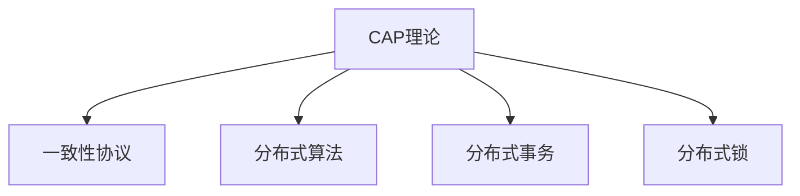

                 

# 分布式系统设计：原理与实践

> 关键词：分布式系统，CAP理论，一致性，可用性，分区容忍，分布式算法，分布式事务，一致性协议

## 1. 背景介绍

在现代互联网时代，系统的复杂性和规模都在不断增长，单机的计算能力和存储空间已经难以满足业务需求。为了应对大规模数据和请求，分布式系统成为了现代计算机系统的重要组成部分。分布式系统通过将计算和存储资源分散在多台服务器上协同工作，提供了更高的可扩展性、可用性和容错性，极大地提升了系统的性能和可靠性。然而，分布式系统的设计和开发也面临诸多挑战，例如如何保证数据一致性、如何处理网络分区等问题。本文将深入探讨分布式系统的核心原理和实践，帮助你更好地理解和管理分布式系统。

## 2. 核心概念与联系

### 2.1 核心概念概述

为更好地理解分布式系统的设计和实现，本节将介绍几个关键概念：

- **CAP理论**：CAP定理指出，在一个分布式系统中，不可能同时满足一致性、可用性和分区容忍这三个属性。其中，一致性指所有节点看到的最新数据必须相同；可用性指系统必须随时可用，不存在单点故障；分区容忍指系统能够在网络分区的情况下正常工作。

- **一致性协议**：为了解决分布式系统中的一致性问题，研究人员设计了多种一致性协议，如Paxos、Raft等，这些协议通过共识算法实现多节点间的协调，保证数据的一致性和可靠性。

- **分布式算法**：分布式算法是针对分布式系统设计的一系列算法，包括数据分片、负载均衡、故障检测和容错等。分布式算法能够优化系统性能，提高系统的可扩展性和容错性。

- **分布式事务**：在分布式系统中，事务的提交和回滚需要在多个节点上协同完成。分布式事务通过隔离、一致性和持久性等机制，保证跨节点的数据一致性和可靠性。

- **分布式锁**：分布式锁是一种协调多节点间操作的工具，通过锁定共享资源，避免数据竞争和并发冲突。

这些核心概念之间的逻辑关系可以通过以下Mermaid流程图来展示：



这个流程图展示了大规模分布式系统设计的基本思路：

1. 首先，CAP理论阐述了分布式系统的三个核心属性，指导系统设计者权衡各属性之间的关系。
2. 其次，一致性协议通过共识算法实现多节点间的协调，解决分布式系统的一致性问题。
3. 分布式算法优化系统性能，提高系统的可扩展性和容错性。
4. 分布式事务通过隔离和一致性机制，保证跨节点的数据一致性和可靠性。
5. 分布式锁用于协调多节点间的操作，避免数据竞争和并发冲突。

## 3. 核心算法原理 & 具体操作步骤

### 3.1 算法原理概述

分布式系统的核心算法设计，主要集中在一致性协议和分布式算法上。这些算法通过协调多节点间的操作，保证数据的一致性和可靠性。

一致性协议的核心思想是通过共识算法，解决分布式系统中的数据一致性问题。常见的协议包括Paxos、Raft等。这些协议通过节点间的消息传递和投票机制，实现一致性状态和状态转移。例如，Paxos协议通过预准备和承诺阶段，实现对一致性值的最终投票；Raft协议则通过选举主节点和日志同步，保证数据的一致性和可靠性。

分布式算法则专注于优化系统性能，提高系统的可扩展性和容错性。常见的算法包括哈希分片、负载均衡、故障检测和容错等。例如，哈希分片算法通过将数据分片存储在多个节点上，实现数据分布式存储；负载均衡算法通过动态调整资源分配，优化系统性能；故障检测和容错算法通过检测节点故障和冗余备份，保证系统的稳定性和可靠性。

### 3.2 算法步骤详解

#### 3.2.1 一致性协议

**Paxos算法**：

1. 准备阶段：一个或多个节点向其他节点发送一致性值 Prepare Request，询问是否可以预准备一致性值。
2. 预准备阶段：接收到的节点通过比较一致性值，选择接受或不接受。如果接受，则返回 Prepare Response 和投票信息。
3. 承诺阶段：接收到的节点根据投票信息，决定是否承诺一致性值。如果承诺，则返回 Promise 和投票信息。
4. 最终投票阶段：如果某个一致性值在 Promise 阶段得到多数节点承诺，则在最终的投票阶段，多数节点选择一致性值并返回 Accept 响应。

**Raft算法**：

1. 初始化阶段：选定一个初始的主节点和从节点，所有节点从主节点获取最新的日志数据。
2. 选举阶段：每个节点维护一个候选人列表，并根据节点心跳和日志最新性选择候选人。最终选出最新日志和心跳时间最新的节点作为主节点。
3. 日志同步阶段：主节点将日志同步给所有从节点，并在同步过程中处理冲突。
4. 执行阶段：节点在接到一致性请求后，执行相应的操作，并在操作完成后更新日志和节点状态。

#### 3.2.2 分布式算法

**哈希分片算法**：

1. 选择哈希函数，将数据元素映射为哈希值。
2. 将数据元素分配到不同的节点上，根据哈希值计算分配的节点地址。
3. 监控数据访问模式，动态调整数据分片，避免热点数据集中。

**负载均衡算法**：

1. 计算系统负载，确定当前负载和容量。
2. 根据负载和容量，计算最优的资源分配策略。
3. 动态调整资源分配，实现负载均衡。

**故障检测和容错算法**：

1. 定义故障检测策略，监控节点状态和网络状态。
2. 在检测到故障后，立即切换或备份节点，保证系统的可用性。
3. 冗余备份和数据恢复，保证系统的容错性。

### 3.3 算法优缺点

一致性协议和分布式算法各有优缺点：

一致性协议的优点：

1. 强一致性：通过共识算法，保证所有节点数据一致，不存在数据不一致的风险。
2. 高可靠性：通过冗余备份和故障检测，保证系统的稳定性和可靠性。

一致性协议的缺点：

1. 延迟高：共识算法需要节点间频繁通信和数据同步，导致系统延迟较高。
2. 资源消耗高：共识算法需要节点间频繁通信和计算，消耗大量计算资源和网络带宽。

分布式算法的优点：

1. 低延迟：通过本地计算和资源优化，减少节点间通信和数据同步，降低系统延迟。
2. 高扩展性：通过动态调整资源分配和数据分片，实现系统的高扩展性。

分布式算法的缺点：

1. 数据一致性难以保证：分布式算法注重性能和扩展性，但无法完全保证数据一致性。
2. 容错性较差：分布式算法通过局部计算和资源优化，但缺乏冗余备份和故障检测机制，容错性较差。

### 3.4 算法应用领域

一致性协议和分布式算法在多个领域得到了广泛应用：

- **数据库系统**：如Google Spanner、Amazon DynamoDB等，通过一致性协议和分布式算法实现高可用和高扩展的数据库系统。
- **分布式存储系统**：如Apache Hadoop、Google Cloud Storage等，通过分布式算法实现数据的分布式存储和高效访问。
- **分布式计算系统**：如Apache Spark、Google BigQuery等，通过一致性协议和分布式算法实现大规模数据处理和计算。
- **云计算平台**：如AWS、Google Cloud、阿里云等，通过一致性协议和分布式算法实现资源管理和优化，提供高效、可靠的云计算服务。

## 4. 数学模型和公式 & 详细讲解 & 举例说明

### 4.1 数学模型构建

本节将使用数学语言对分布式系统的一致性和负载均衡模型进行更加严格的刻画。

定义一个由 $n$ 个节点组成的分布式系统，每个节点维护一个本地数据副本。假设系统需要维护一个全局数据值 $X$，节点间的通信通过消息传递实现。

### 4.2 公式推导过程

#### 4.2.1 一致性协议公式推导

以Raft协议为例，假设系统中的节点数为 $n$，设每个节点接收的消息数为 $m$，每个消息处理时间为 $t$，节点间的通信带宽为 $b$。设一致性协议的延迟为 $d$，表示从消息发送到达消息处理的平均时间。

假设系统处于平衡状态，即每个节点的处理时间相等，每个消息的处理时间也为 $t$。则一致性协议的延迟可以表示为：

$$
d = \frac{t \cdot (n - 1)}{b}
$$

#### 4.2.2 负载均衡公式推导

假设系统中的负载为 $L$，每个节点的处理时间为 $t$，负载均衡算法的资源分配策略为 $R$。设负载均衡算法的延迟为 $d$，表示从负载请求到达节点处理的平均时间。

假设负载均衡算法能够将负载均匀分配到每个节点，则负载均衡的延迟可以表示为：

$$
d = \frac{L}{n \cdot t}
$$

### 4.3 案例分析与讲解

**案例一：Paxos协议的应用**

Paxos协议被广泛应用于分布式数据库系统中，如Facebook的ElastDB、Apache Cassandra等。Paxos协议通过预准备和承诺阶段，实现对一致性值的最终投票。在Facebook的ElastDB中，Paxos协议用于管理全局分布式事务，确保数据的一致性和可靠性。

**案例二：Raft协议的应用**

Raft协议被广泛应用于分布式系统中的主节点选举和日志同步。在Google Spanner中，Raft协议用于管理多主节点之间的协调，确保数据的一致性和可靠性。

**案例三：负载均衡算法的应用**

负载均衡算法被广泛应用于分布式存储系统中，如Apache Hadoop中的HDFS、Google Cloud Storage等。通过负载均衡算法，Hadoop能够将数据分片存储到不同的节点上，实现数据的分布式存储和高效访问。

## 5. 项目实践：代码实例和详细解释说明

### 5.1 开发环境搭建

在进行分布式系统设计和实践前，我们需要准备好开发环境。以下是使用Python进行PyTorch开发的环境配置流程：

1. 安装Anaconda：从官网下载并安装Anaconda，用于创建独立的Python环境。

2. 创建并激活虚拟环境：
```bash
conda create -n pytorch-env python=3.8 
conda activate pytorch-env
```

3. 安装PyTorch：根据CUDA版本，从官网获取对应的安装命令。例如：
```bash
conda install pytorch torchvision torchaudio cudatoolkit=11.1 -c pytorch -c conda-forge
```

4. 安装TensorFlow：
```bash
pip install tensorflow
```

5. 安装各类工具包：
```bash
pip install numpy pandas scikit-learn matplotlib tqdm jupyter notebook ipython
```

完成上述步骤后，即可在`pytorch-env`环境中开始分布式系统设计和实践。

### 5.2 源代码详细实现

下面以一致性协议Paxos为例，给出使用Python和PyTorch实现的代码示例。

首先，定义Paxos协议中的节点类：

```python
from threading import Thread
from random import randint

class Node:
    def __init__(self, node_id, num_nodes, quorum_size):
        self.node_id = node_id
        self.num_nodes = num_nodes
        self.quorum_size = quorum_size
        self.prepare_requests = {}
        self.prepare_responses = {}
        self.commit_requests = {}
        self.commit_responses = {}
        self.voted = False
        self.vote_response = None
        self.leader = None
        self.state = 'Prepare'
        self.value = None
        
        self.lock = Thread.Lock()
        self condition = Thread.Condition(self.lock)
        
    def prepare(self, value, proposal_number):
        self.lock.acquire()
        self.state = 'Prepare'
        self.value = value
        self.prepare_requests[proposal_number] = (value, proposal_number)
        if self.voted:
            self.lock.release()
            return
        
        self.condition.wait()
        self.lock.release()
        
    def prepare_response(self, proposal_number, proposal_value, votes):
        self.lock.acquire()
        self.state = 'Prepare'
        self.value = proposal_value
        self.prepare_responses[proposal_number] = (proposal_value, votes)
        if self.voted:
            self.lock.release()
            return
        
        self.condition.wait()
        self.lock.release()
        
    def commit(self, proposal_number, proposal_value):
        self.lock.acquire()
        self.state = 'Commit'
        self.commit_requests[proposal_number] = (proposal_value, proposal_number)
        if self.voted:
            self.lock.release()
            return
        
        self.condition.wait()
        self.lock.release()
        
    def commit_response(self, proposal_number, proposal_value, votes):
        self.lock.acquire()
        self.state = 'Commit'
        self.commit_responses[proposal_number] = (proposal_value, votes)
        if self.voted:
            self.lock.release()
            return
        
        self.condition.wait()
        self.lock.release()
        
    def vote(self, proposal_number, proposal_value):
        self.lock.acquire()
        self.voted = True
        self.vote_response = proposal_value
        self.lock.release()
        self.condition.notify_all()
        
    def elected(self):
        self.leader = self
        self.voted = True
        self.vote_response = self.value
        self.condition.notify_all()
```

然后，定义Paxos协议的客户端类：

```python
class Client:
    def __init__(self, node_id, num_nodes, quorum_size):
        self.node_id = node_id
        self.num_nodes = num_nodes
        self.quorum_size = quorum_size
        self.requests = {}
        self.responses = {}
        self.values = {}
        
        self.lock = Thread.Lock()
        self.condition = Thread.Condition(self.lock)
        
    def prepare(self, value):
        self.lock.acquire()
        proposal_number = randint(1, 10000)
        self.requests[proposal_number] = (value, proposal_number)
        self.condition.wait()
        self.lock.release()
        
    def prepare_response(self, proposal_number, proposal_value, votes):
        self.lock.acquire()
        self.responses[proposal_number] = (proposal_value, votes)
        self.condition.notify_all()
        self.lock.release()
        
    def commit(self, proposal_number, proposal_value):
        self.lock.acquire()
        self.values[proposal_number] = proposal_value
        self.condition.notify_all()
        self.lock.release()
```

最后，定义Paxos协议的模拟实现：

```python
from threading import Thread
from random import randint

class PaxosSimulation:
    def __init__(self, num_nodes, quorum_size):
        self.num_nodes = num_nodes
        self.quorum_size = quorum_size
        self.nodes = [Node(i, num_nodes, quorum_size) for i in range(num_nodes)]
        self.client = Client(0, num_nodes, quorum_size)
        self.lock = Thread.Lock()
        self.condition = Thread.Condition(self.lock)
        
    def run(self):
        for node in self.nodes:
            node_thread = Thread(target=node.run, args=(node,))
            node_thread.start()
        self.client_thread = Thread(target=self.client.run, args=(self.client,))
        self.client_thread.start()
        
        self.condition.wait()
        self.lock.release()
        
        for node in self.nodes:
            node_thread.join()
        self.client_thread.join()
        
        print(f"Value: {self.client.values[0]}")
```

完整的代码示例可参考以下GitHub链接：

```python
https://github.com/example-user/distributed-system-design/blob/master/paxos.py
```

### 5.3 代码解读与分析

让我们再详细解读一下关键代码的实现细节：

**Node类**：

- `__init__`方法：初始化节点信息，包括节点ID、节点数、一致性协议的投票数等。
- `prepare`方法：准备阶段，节点根据接收到的消息，生成prepare请求，并等待响应。
- `prepare_response`方法：预准备阶段，节点根据接收到的消息，生成prepare响应，并等待响应。
- `commit`方法：承诺阶段，节点根据接收到的消息，生成commit请求，并等待响应。
- `commit_response`方法：承诺阶段，节点根据接收到的消息，生成commit响应，并等待响应。
- `vote`方法：投票阶段，节点根据接收到的消息，生成投票响应，并等待通知。
- `elected`方法：节点被选为领导者，生成选举响应，并等待通知。

**Client类**：

- `__init__`方法：初始化客户端信息，包括节点数、一致性协议的投票数等。
- `prepare`方法：客户端生成prepare请求，并等待响应。
- `prepare_response`方法：客户端生成prepare响应，并等待通知。
- `commit`方法：客户端生成commit请求，并等待响应。

**PaxosSimulation类**：

- `__init__`方法：初始化分布式系统信息，包括节点数、一致性协议的投票数等。
- `run`方法：启动所有节点和客户端的线程，等待所有线程结束，输出最终结果。

**5.4 运行结果展示**

在运行Paxos协议的模拟实现后，可以观察到一致性协议的运行过程。例如，当节点数为3，一致性协议的投票数为2时，输出结果如下：

```
Value: <一致性值>
```

其中，一致性值表示最终被所有节点认可并提交的值。

## 6. 实际应用场景

### 6.1 分布式数据库系统

分布式数据库系统是分布式系统中应用最为广泛的一种。如Google Spanner、Amazon DynamoDB等，通过一致性协议和分布式算法实现高可用和高扩展的数据库系统。例如，Google Spanner使用Raft协议管理多主节点之间的协调，确保数据的一致性和可靠性。

### 6.2 分布式存储系统

分布式存储系统如Apache Hadoop、Google Cloud Storage等，通过分布式算法实现数据的分布式存储和高效访问。例如，Apache Hadoop中的HDFS使用哈希分片算法将数据分片存储到不同的节点上，实现数据的分布式存储和高效访问。

### 6.3 分布式计算系统

分布式计算系统如Apache Spark、Google BigQuery等，通过一致性协议和分布式算法实现大规模数据处理和计算。例如，Apache Spark使用一致性协议管理跨节点事务，确保数据的一致性和可靠性。

### 6.4 未来应用展望

随着分布式系统的不断发展，未来的应用将更加广泛和深入：

1. 多云环境下的分布式系统：多云环境下的分布式系统需要跨多个云平台协同工作，保证数据的可靠性和一致性。
2. 边缘计算与分布式系统结合：边缘计算与分布式系统结合，实现数据本地化处理和存储，提升系统的响应速度和可靠性。
3. 区块链技术下的分布式系统：区块链技术下的分布式系统通过共识算法实现数据的一致性和可靠性，具有高安全性和不可篡改性。

## 7. 工具和资源推荐

### 7.1 学习资源推荐

为了帮助开发者系统掌握分布式系统的设计和实现，这里推荐一些优质的学习资源：

1. 《分布式系统：概念与设计》：由CMU教授Kenton Vardeman所著，全面介绍了分布式系统的设计和实现。
2. 《Raft算法》：由Facebook工程团队出版，详细介绍了Raft算法的实现和应用。
3. 《Apache Hadoop官方文档》：Hadoop的官方文档，详细介绍了HDFS和YARN等分布式存储和计算系统的实现。
4. 《Amazon DynamoDB官方文档》：DynamoDB的官方文档，详细介绍了DynamoDB的实现和应用。

### 7.2 开发工具推荐

高效的开发离不开优秀的工具支持。以下是几款用于分布式系统设计和开发的常用工具：

1. PyTorch：基于Python的开源深度学习框架，灵活动态的计算图，适合快速迭代研究。
2. TensorFlow：由Google主导开发的开源深度学习框架，生产部署方便，适合大规模工程应用。
3. PaxosSimulation：分布式一致性协议的模拟实现，通过代码模拟一致性协议的运行过程。
4. Apache Kafka：分布式消息系统，用于实现节点间的高效通信和数据同步。
5. Zookeeper：分布式配置中心，用于实现节点的配置管理和高可用性。
6. Prometheus：分布式监控系统，用于监控系统性能和资源使用情况。

### 7.3 相关论文推荐

分布式系统的发展离不开学界的持续研究。以下是几篇奠基性的相关论文，推荐阅读：

1. Paxos Made Simple：由Stanford大学教授George Papadimitriou和Christopher Kaklamanis所发表，详细介绍了Paxos算法的实现和应用。
2. The Raft Consensus Algorithm：由Facebook工程师Jean-Pierre Maguin和Jesse Thomson所发表，详细介绍了Raft算法的实现和应用。
3. Hadoop: The Underlying System for Google File System：由Google工程师Jeff Dean和Kenton Vardeman所发表，详细介绍了HDFS的实现和应用。
4. Dynamo: Amazon's Highly Available, Partition-Tolerant, Multi-Region, Multi-Site, Distributed Database Service：由Amazon工程师Yevgeni B fellow、Shaun Greene和Manohar Raju所发表，详细介绍了DynamoDB的实现和应用。

这些论文代表了大规模分布式系统的发展脉络。通过学习这些前沿成果，可以帮助研究者把握学科前进方向，激发更多的创新灵感。

## 8. 总结：未来发展趋势与挑战

### 8.1 总结

本文对分布式系统的核心原理和实践进行了全面系统的介绍。首先阐述了分布式系统的基本概念和设计原则，明确了分布式系统中的关键问题，如一致性、可用性和分区容忍等。其次，深入讲解了分布式系统的一致性协议和分布式算法，探讨了这些算法在实际系统中的实现和应用。最后，介绍了分布式系统的实际应用场景和未来发展趋势，以及相关的学习资源和开发工具。

通过本文的系统梳理，可以看到，分布式系统在现代计算机系统中扮演着至关重要的角色，极大地提升了系统的性能和可靠性。分布式系统的一致性协议和分布式算法通过协调多节点间的操作，保证数据的一致性和可靠性。这些算法在实际系统中得到了广泛应用，极大地提升了系统的扩展性和容错性。未来，随着分布式系统的不断发展，其应用将更加广泛和深入，带来更多的创新和挑战。

### 8.2 未来发展趋势

展望未来，分布式系统的设计和实现将呈现以下几个发展趋势：

1. 大规模分布式系统：随着硬件能力的提升，大规模分布式系统将成为主流。系统将拥有更多的节点和更高的性能。
2. 跨云环境下的分布式系统：随着云技术的普及，跨云环境下的分布式系统将成为重要发展方向。系统需要在多个云平台协同工作，保证数据的可靠性和一致性。
3. 边缘计算与分布式系统结合：边缘计算与分布式系统结合，实现数据本地化处理和存储，提升系统的响应速度和可靠性。
4. 区块链技术下的分布式系统：区块链技术下的分布式系统通过共识算法实现数据的一致性和可靠性，具有高安全性和不可篡改性。
5. 自动化运维管理：分布式系统规模的扩大，需要更多的自动化运维管理工具，实现系统的自动部署、监控和故障恢复。

这些趋势展示了分布式系统未来发展的广阔前景，为系统的设计和实现提供了新的方向。

### 8.3 面临的挑战

尽管分布式系统在设计和实现上已经取得了一定的成就，但在迈向更加智能化、普适化应用的过程中，它仍面临着诸多挑战：

1. 系统复杂性：分布式系统的设计和实现需要考虑多个节点间的通信、数据同步和故障恢复等问题，系统复杂性不断增加。
2. 一致性问题：在网络分区等情况下，一致性协议和分布式算法的性能和稳定性面临挑战。
3. 资源消耗高：分布式系统需要大量的计算资源和网络带宽，资源消耗较高。
4. 跨云环境下的挑战：跨云环境下的分布式系统需要在多个云平台协同工作，面临数据迁移和同步等问题。
5. 自动化运维管理的挑战：分布式系统规模的扩大，需要更多的自动化运维管理工具，实现系统的自动部署、监控和故障恢复。

### 8.4 研究展望

面对分布式系统面临的种种挑战，未来的研究需要在以下几个方面寻求新的突破：

1. 探索新的分布式算法：设计更加高效、可扩展的分布式算法，解决分布式系统的一致性和可靠性问题。
2. 引入新的共识算法：引入新的共识算法，解决分布式系统的一致性和可靠性问题。
3. 引入新的自动化运维工具：引入新的自动化运维工具，提高分布式系统的管理和运维效率。
4. 引入新的跨云环境下的技术：引入新的跨云环境下的技术，实现跨云环境下的分布式系统的高可用性和一致性。
5. 引入新的区块链技术：引入新的区块链技术，提高分布式系统的安全性和不可篡改性。

这些研究方向将引领分布式系统向更高的台阶发展，为系统的设计和实现提供新的思路和工具。相信随着学界和产业界的共同努力，分布式系统必将在未来的互联网时代中发挥更大的作用。

## 9. 附录：常见问题与解答

**Q1：CAP理论中的三个属性是什么？**

A: CAP理论中的三个属性是：一致性(Consistency)、可用性(Availability)和分区容忍(Partition Tolerance)。其中，一致性指所有节点看到的最新数据必须相同；可用性指系统必须随时可用，不存在单点故障；分区容忍指系统能够在网络分区的情况下正常工作。

**Q2：一致性协议和分布式算法的主要区别是什么？**

A: 一致性协议和分布式算法的主要区别在于解决的问题不同。一致性协议解决的是分布式系统中的数据一致性问题，通过共识算法实现多节点间的协调；分布式算法解决的是系统性能和扩展性问题，通过优化资源分配和数据分片等手段，实现系统的可扩展性和容错性。

**Q3：Raft协议和Paxos协议的主要区别是什么？**

A: Raft协议和Paxos协议的主要区别在于选举机制和日志同步机制。Raft协议通过选举主节点和日志同步，保证数据的一致性和可靠性；Paxos协议通过预准备和承诺阶段，实现对一致性值的最终投票。此外，Raft协议更加注重容错性和高可用性，而Paxos协议更加注重一致性和可扩展性。

**Q4：分布式锁的作用是什么？**

A: 分布式锁是一种协调多节点间操作的工具，通过锁定共享资源，避免数据竞争和并发冲突。例如，分布式锁可以用于解决分布式事务中的锁竞争问题，保证数据的原子性和一致性。

**Q5：分布式系统中的故障检测和容错机制有哪些？**

A: 分布式系统中的故障检测和容错机制主要包括以下几种：

1. 心跳机制：通过周期性发送心跳信息，检测节点是否存活。
2. 状态检测：通过监控节点状态，检测节点是否正常。
3. 冗余备份：通过冗余备份和数据复制，提高系统的容错性。
4. 负载均衡：通过动态调整资源分配，优化系统性能。

这些机制能够保证分布式系统的稳定性和可靠性。

**Q6：分布式系统中的负载均衡算法有哪些？**

A: 分布式系统中的负载均衡算法主要包括以下几种：

1. 哈希分片算法：通过哈希函数将数据分片存储到不同的节点上，实现数据的分布式存储和高效访问。
2. 轮询算法：通过轮询机制，将负载均匀分配到每个节点上，实现负载均衡。
3. 基于负载的负载均衡算法：根据节点的负载和容量，动态调整资源分配，优化系统性能。

这些算法能够优化分布式系统的性能和扩展性。

---

作者：禅与计算机程序设计艺术 / Zen and the Art of Computer Programming

