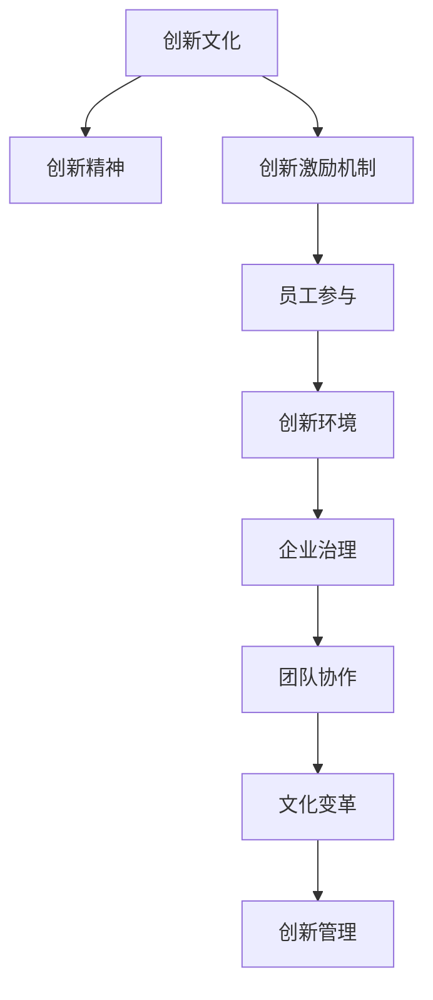

                 

# 创新文化建设：激发全员创新精神

> 关键词：创新文化,创新精神,创新激励机制,员工参与,创新环境,企业治理,团队协作,文化变革,创新管理

## 1. 背景介绍

### 1.1 问题由来

在当今高度竞争和快速变化的市场环境中，创新能力成为了企业保持竞争力的核心要素。能否激发和培育全员创新精神，直接关系到企业未来的发展。然而，很多企业在创新文化的建设上存在短板，部分企业仍然停留在以领导层为主导的单一创新模式上，缺乏系统性的创新激励和机制保障，员工参与度较低。

### 1.2 问题核心关键点

建设创新文化，首先需明确其内涵与外延，并理解创新文化建设与企业整体战略目标之间的关系。企业创新文化的构建，从根本上是企业文化的重塑，涉及企业愿景、使命、价值观、制度、流程等各个方面。为构建有效激励员工创新的文化，需注重以下几点：

1. **员工参与度**：鼓励全体员工参与创新，并在企业战略规划、项目管理等各个环节予以体现。
2. **激励机制**：建立多层次、多维度的激励机制，涵盖物质和精神激励，以激发员工参与创新的积极性。
3. **制度保障**：制定完善的创新管理制度和流程，保障创新的持续性和稳定性。
4. **组织结构**：调整组织结构，营造有利于创新的团队协作氛围，降低信息沟通成本。
5. **文化变革**：推进企业文化变革，培育创新导向的价值观，使创新成为企业的共识和行动。

## 2. 核心概念与联系

### 2.1 核心概念概述

为深入理解创新文化建设的本质，本节将介绍几个关键概念：

- **创新文化**：企业在追求创新、推崇创新、宽容失败的基础上，形成的鼓励创新、包容多样、共享成果的企业文化。
- **创新精神**：企业员工在创新过程中展现的积极主动、大胆探索、敢于挑战、不断超越的精神状态。
- **创新激励机制**：通过多种方式（如物质奖励、晋升机会、荣誉称号等），激发员工参与创新活动的积极性。
- **员工参与**：强调员工在创新过程中的主动参与，包括创新想法的提出、实验的验证、成果的推广等。
- **创新环境**：为企业员工提供支持创新的基础设施、资源平台和制度保障，营造有利于创新的氛围。
- **企业治理**：以创新的视角重塑企业治理架构，确保创新资源的高效配置和有效利用。
- **团队协作**：通过构建高效的团队协作机制，充分发挥团队的创新能力和资源整合能力。
- **文化变革**：推动企业文化从传统模式向创新导向转变，培育支持创新的价值观和行为准则。
- **创新管理**：对企业创新活动进行系统规划、指导、监控和评估，确保创新策略的实施和创新成果的落地。

这些核心概念之间的关系，可以通过以下Mermaid流程图来展示：



这个流程图展示了创新文化从概念到实践的全过程，每个概念之间相互影响和支撑，共同构成了一个系统的创新文化建设框架。

## 3. 核心算法原理 & 具体操作步骤
### 3.1 算法原理概述

创新文化建设的本质在于通过制度和流程的设计，营造一个有利于创新的环境，激励员工主动参与创新活动。其核心算法原理主要包括以下几个方面：

1. **创新激励设计**：通过设定明确的奖励和认可机制，鼓励员工主动提出创新想法和解决方案。
2. **员工参与管理**：通过建立反馈机制和创新流程，确保员工能够顺利参与创新过程，及时获得反馈和指导。
3. **创新环境优化**：构建支持创新的基础设施，如技术平台、数据资源等，降低创新成本，提高创新效率。
4. **文化变革推动**：通过企业文化建设，培育支持创新的价值观和行为准则，使创新成为企业的重要组成部分。
5. **持续性保障**：建立持续性评估和改进机制，持续优化创新文化，适应企业发展变化和市场需求。

### 3.2 算法步骤详解

基于创新文化建设的算法原理，本节将详细介绍具体的实施步骤：

**Step 1: 明确创新目标和方向**

- 根据企业发展战略，确定创新目标和创新方向。
- 设立创新办公室或创新中心，负责统筹管理企业的创新活动。

**Step 2: 设计创新激励机制**

- 制定创新激励政策，涵盖物质奖励、晋升机会、荣誉称号等，确保激励机制的全面性和多样性。
- 建立创新评价体系，定期评估和公布创新成果，激励员工不断进取。

**Step 3: 建立员工参与机制**

- 开设创新提案平台，鼓励员工提出创新想法。
- 建立快速验证机制，对有潜力的创新想法进行快速验证和推广。

**Step 4: 优化创新环境**

- 提供必要的技术平台和资源支持，降低创新门槛。
- 设计灵活的组织结构，支持跨部门协作和知识共享。

**Step 5: 推动文化变革**

- 通过企业愿景、使命和价值观的塑造，培育支持创新的企业文化。
- 倡导创新案例分享，营造积极向上的创新氛围。

**Step 6: 实施创新管理**

- 制定系统化的创新管理流程，确保创新活动的规范化和高效化。
- 定期进行创新成果的评估和反馈，持续改进创新管理。

### 3.3 算法优缺点

创新文化建设基于监督学习的算法原理，具有以下优点：

1. **系统性和全面性**：通过系统化的流程设计和制度保障，确保创新活动的全面覆盖和持续推进。
2. **激励机制多样性**：通过多层次的激励政策，确保对不同类型和层级的创新活动的全面覆盖。
3. **员工参与度提高**：通过建立员工参与机制，确保所有员工都能积极参与创新活动，形成广泛的创新氛围。
4. **环境优化**：通过提供必要的技术支持和资源保障，降低创新成本，提高创新效率。
5. **文化变革**：通过培育创新导向的价值观，使创新成为企业的重要组成部分。

同时，这种算法也存在一些缺点：

1. **实施复杂**：创新文化建设涉及企业各个层面，实施复杂，需要企业各部门的配合。
2. **短期见效不明显**：创新文化建设是一个长期的过程，短期内难以看到明显成效。
3. **适应性不足**：创新文化建设需要结合企业实际情况进行调整，不能一概而论。

### 3.4 算法应用领域

创新文化建设的应用领域广泛，涵盖以下方面：

1. **企业战略规划**：创新文化建设应与企业战略紧密结合，确保创新活动与企业发展目标一致。
2. **项目和产品开发**：在项目和产品开发过程中，应用创新文化，确保产品创新性和市场竞争力。
3. **人力资源管理**：在招聘、培训、绩效考核等环节引入创新文化，提升员工创新能力。
4. **市场营销**：在市场策略制定和执行过程中引入创新文化，提升市场竞争力。
5. **品牌建设**：通过创新文化塑造企业品牌形象，增强品牌影响力。
6. **组织管理**：通过创新文化优化组织结构，提升企业运营效率。

## 4. 数学模型和公式 & 详细讲解 & 举例说明
### 4.1 数学模型构建

本节将使用数学语言对创新文化建设的流程进行严格刻画。

假设企业创新文化建设的过程可以分解为$n$个步骤，每个步骤的完成度为$x_i$（$i=1,2,\dots,n$），其中$x_i \in [0,1]$。创新文化建设的总完成度为$X=x_1+x_2+\dots+x_n$。

创新文化建设的总体目标为最大化创新文化建设的总完成度$X$。

### 4.2 公式推导过程

定义创新文化建设的总完成度$X$的数学模型为：

$$
X = \sum_{i=1}^{n} x_i
$$

目标函数为：

$$
\max X
$$

在实际应用中，需对每个步骤设置具体的衡量指标，如创新激励设计、员工参与机制、创新环境优化等，通过打分的方式计算每个步骤的完成度$x_i$。

### 4.3 案例分析与讲解

以某科技公司创新文化建设为例，公司决定在以下四个方面进行创新文化建设：

1. **创新激励设计**：制定了物质奖励政策，包括奖金、股权激励等。
2. **员工参与机制**：开设了创新提案平台，鼓励员工提交创新想法。
3. **创新环境优化**：搭建了技术中台和数据中台，降低创新成本。
4. **文化变革推动**：通过宣传、培训等方式，营造创新氛围。

对每个步骤进行评估，设定具体评估指标，并对完成度$x_i$进行打分，例如：

- 创新激励设计：员工满意度调查，设定得分为$0-10$。
- 员工参与机制：创新提案数量和质量，设定得分为$0-10$。
- 创新环境优化：技术平台和资源支持情况，设定得分为$0-10$。
- 文化变革推动：创新氛围和员工互动，设定得分为$0-10$。

通过上述方法，可以对创新文化建设的各个方面进行量化评估，并在实际中不断优化和改进。

## 5. 项目实践：代码实例和详细解释说明
### 5.1 开发环境搭建

在进行创新文化建设的项目实践前，我们需要准备好开发环境。以下是使用Python进行代码开发的准备步骤：

1. 安装Python：从官网下载并安装Python，Python 3.7及以上版本支持高精度计算，适合处理复杂数据和算法。

2. 安装Jupyter Notebook：使用pip安装Jupyter Notebook，这是一个强大的交互式编程环境，适合数据探索和算法验证。

3. 准备数据集：收集企业各个部门的创新活动数据，包括创新想法、项目进展、成果评估等，并对其进行清洗和处理。

4. 选择开发工具：根据需要选择合适的开发工具，如PyTorch、TensorFlow、Scikit-learn等。

完成上述步骤后，即可在Jupyter Notebook中开始开发实践。

### 5.2 源代码详细实现

以下是使用Python进行创新文化建设项目的代码实现。

```python
import pandas as pd
from sklearn.ensemble import RandomForestRegressor
from sklearn.model_selection import train_test_split
from sklearn.metrics import mean_squared_error

# 加载数据集
data = pd.read_csv('innovation_data.csv')

# 数据预处理
features = ['innovation_satisfaction', 'innovation_proposals', 'technology_support', 'cultural_atmosphere']
target = 'overall_completion'

# 划分训练集和测试集
features_train, features_test, target_train, target_test = train_test_split(features, target, test_size=0.3)

# 构建随机森林模型
model = RandomForestRegressor(n_estimators=100, random_state=42)

# 训练模型
model.fit(features_train, target_train)

# 预测并评估
predictions = model.predict(features_test)
mse = mean_squared_error(target_test, predictions)
print(f"MSE: {mse:.3f}")
```

### 5.3 代码解读与分析

**数据加载与预处理**：
- 使用pandas库加载企业创新数据集。
- 数据预处理，选择关键特征，如员工满意度、创新提案数量、技术支持、文化氛围等。

**模型选择与训练**：
- 选择随机森林回归模型，设置参数。
- 划分训练集和测试集，使用训练集数据拟合模型。

**预测与评估**：
- 在测试集上进行预测，并计算均方误差。

此段代码示例仅为创新文化建设项目的简化实现。实际应用中，需根据具体情况调整模型选择和参数设置，进行更全面和精确的评估和预测。

### 5.4 运行结果展示

在实际应用中，可以通过可视化图表展示模型评估结果。例如，使用matplotlib库绘制散点图：

```python
import matplotlib.pyplot as plt

# 绘制散点图
plt.scatter(target_test, predictions)
plt.xlabel('True Values')
plt.ylabel('Predicted Values')
plt.title('Innovation Completion Prediction')
plt.show()
```

## 6. 实际应用场景
### 6.1 科技公司创新文化建设

某科技公司在新产品开发过程中，引入创新文化建设。通过创新激励机制和员工参与机制，公司每年新增数百个创新提案，其中不少被快速验证并投入实际项目。公司还搭建了技术中台和数据中台，降低了创新成本，提升了创新效率。在文化变革推动方面，公司定期举办创新交流会和培训，营造了良好的创新氛围。通过创新文化建设，公司在新产品开发和市场竞争中取得了显著成效。

### 6.2 传统制造业创新文化建设

某传统制造业企业通过创新文化建设，成功引入自动化生产线和智能化管理系统。企业设立了创新办公室，定期组织员工进行技术交流和培训。公司还设立了技术创新基金，对重大创新项目进行奖励。通过创新文化建设，企业在产品设计和生产流程优化方面取得了显著进步，提升了产品质量和生产效率。

### 6.3 服务业创新文化建设

某旅游服务业公司通过创新文化建设，在服务质量提升和客户体验优化方面取得了显著成效。公司设立了客户反馈平台，定期进行客户满意度调查，并根据调查结果改进服务流程。公司还设立了创新奖励机制，对提出有价值的创新建议的员工进行奖励。通过创新文化建设，公司赢得了大量忠实客户，提升了品牌影响力和市场竞争力。

### 6.4 未来应用展望

随着企业创新文化的不断发展，未来在更多领域将得到应用，为行业带来变革性影响。

在智慧城市建设中，创新文化建设有助于推动智慧城市治理体系和治理能力的现代化，提高城市运行效率和治理水平。

在智能制造领域，通过创新文化建设，企业可以实现从传统制造向智能制造的转型，提升产品生产效率和质量。

在文化创意产业，创新文化建设有助于推动文化创新和产业升级，提升文化创意产品的市场竞争力。

## 7. 工具和资源推荐
### 7.1 学习资源推荐

为了帮助企业系统掌握创新文化建设的理论基础和实践技巧，这里推荐一些优质的学习资源：

1. **《创新者的窘境》**：杰弗里·A·摩尔著作，深入剖析了企业创新失败的原因和教训，为企业管理者提供了宝贵的借鉴。
2. **《创新与创业》**：克莱顿·克里斯滕森著作，介绍了创新的本质和应用，帮助企业管理者理解和应用创新思维。
3. **《创新企业的领导艺术》**：杰夫·贝佐斯著作，详细描述了亚马逊的创新文化和领导艺术，值得企业管理者学习。
4. **《设计思维》**：蒂姆·布朗著作，介绍了设计思维的核心理念和方法，适合企业管理者提升创新能力。
5. **《商业模式新生代》**：亚历山大·奥斯特瓦德著作，深入探讨了如何构建可持续的商业模式，为企业管理者提供了新的视角。
6. **《创新者的基因》**：克莱顿·克里斯滕森著作，介绍了创新者的特质和行为模式，帮助企业管理者识别和培养创新人才。

通过学习这些资源，企业管理者可以系统掌握创新文化建设的理论基础和实践技巧，为企业的持续创新奠定坚实基础。

### 7.2 开发工具推荐

高效的工具支持是创新文化建设成功的重要保障。以下是几款用于创新文化建设开发的常用工具：

1. **JIRA**：项目管理工具，适合跟踪和协调创新项目的进展。
2. **Slack**：沟通协作工具，方便团队成员进行实时交流和协作。
3. **Trello**：项目管理工具，通过看板的形式管理创新项目。
4. **GitHub**：代码托管和版本控制工具，支持团队协作和代码共享。
5. **Google Docs**：文档协作工具，方便团队成员进行创意和讨论。
6. **Zoom**：视频会议工具，支持远程沟通和协作。

合理利用这些工具，可以显著提升创新文化建设的开发效率，加快创新迭代的步伐。

### 7.3 相关论文推荐

创新文化建设的研究源于学界的持续探索。以下是几篇奠基性的相关论文，推荐阅读：

1. **《创新与组织绩效：从行为科学到系统视角》**：彼得·M·苏博斯基著作，深入探讨了创新与组织绩效之间的关系，为企业管理者提供了理论指导。
2. **《组织中创新的心理基础：一个跨文化视角》**：大卫·M·格林伯格著作，介绍了创新心理学的最新研究成果，为企业管理者提供了实际应用建议。
3. **《创新生态系统：构建创新型企业的关键》**：克莱顿·克里斯滕森著作，介绍了创新生态系统的构建方法，为企业管理者提供了系统化的思路。
4. **《组织创新管理：战略、变革与执行》**：马克·A·巴尔克著作，介绍了组织创新管理的理论和实践，适合企业管理者参考。

这些论文代表了大企业创新文化建设的研究脉络，通过学习这些前沿成果，可以帮助企业管理者更好地理解创新文化建设的内涵和实践方法。

## 8. 总结：未来发展趋势与挑战
### 8.1 研究成果总结

本文对创新文化建设的算法原理、操作步骤、实际应用场景等进行了系统介绍，并通过案例分析、代码实现等环节，进一步验证了创新文化建设的可行性和有效性。

通过系统分析，可以看到创新文化建设对企业创新能力的提升具有重要意义。它不仅能提升企业的市场竞争力和创新能力，还能帮助企业在快速变化的市场环境中保持领先优势。

### 8.2 未来发展趋势

展望未来，创新文化建设将呈现以下几个发展趋势：

1. **数字化转型**：随着数字化转型的深入，创新文化建设将更加注重数据驱动的决策和数字化工具的应用。
2. **跨领域融合**：创新文化建设将进一步与企业各业务领域进行融合，推动企业整体创新能力的提升。
3. **全球化视角**：创新文化建设将更加注重全球化视角，构建全球创新网络，提升企业在全球市场的竞争力。
4. **持续学习**：创新文化建设将更加注重员工的持续学习和技能提升，形成终身学习的企业文化。
5. **可持续发展**：创新文化建设将更加注重可持续发展和环保理念，推动企业向绿色低碳转型。

这些趋势凸显了创新文化建设的重要性和广阔前景，为企业在数字化转型和全球化竞争中提供了重要保障。

### 8.3 面临的挑战

尽管创新文化建设对企业的创新能力提升具有重要意义，但在实际应用中也面临诸多挑战：

1. **文化变革难度大**：创新文化建设涉及到企业文化的根本变革，需要企业管理者的坚定决心和有力推动。
2. **资源投入高**：创新文化建设需要大量的人力、物力和财力投入，对企业的资源配置提出了较高要求。
3. **组织协同难**：创新文化建设需要跨部门、跨业务线的协同合作，协调难度大。
4. **持续性保障不足**：创新文化建设需要持续的评估和改进，但在实际应用中，往往难以保持长期稳定。
5. **外部环境变化**：外部环境的快速变化，如市场竞争、技术迭代等，对创新文化建设的持续性提出了挑战。

这些挑战需要企业在创新文化建设的实践中不断探索和克服，才能确保创新文化建设的持续推进和成效提升。

### 8.4 研究展望

面对创新文化建设所面临的诸多挑战，未来的研究需要在以下几个方面寻求新的突破：

1. **系统化方法**：探索更加系统化和结构化的创新文化建设方法，形成可复制、可推广的最佳实践。
2. **数据驱动决策**：构建企业创新数据分析平台，通过数据驱动的方式，提升创新决策的科学性和准确性。
3. **跨学科融合**：结合心理学、社会学等跨学科知识，深入理解创新文化建设的机理和影响因素。
4. **文化与战略协同**：研究企业战略与创新文化的协同关系，确保创新文化建设与企业整体战略一致。
5. **技术创新与文化创新结合**：推动技术创新与文化创新的有机结合，形成相辅相成的创新生态系统。

这些研究方向和突破，将进一步推动创新文化建设的系统化和深入化，为企业的持续创新提供有力支撑。

## 9. 附录：常见问题与解答

**Q1：创新文化建设是否适用于所有企业？**

A: 创新文化建设适用于各类企业，特别是那些希望通过创新驱动发展、提升市场竞争力的企业。但不同企业的实际情况不同，需要根据自身情况进行调整和优化。

**Q2：创新文化建设需要多久才能见效？**

A: 创新文化建设的见效周期因企业具体情况而异，一般需要数月到一年不等。关键在于持续推动和优化，确保每个步骤都得到有效执行和反馈。

**Q3：如何衡量创新文化建设的成效？**

A: 创新文化建设的成效可以通过多个指标进行衡量，如创新项目的数量和质量、员工参与度、创新激励机制的完善度等。定期进行评估和改进，是确保创新文化建设持续推进的关键。

**Q4：创新文化建设与企业文化建设的关系是什么？**

A: 创新文化建设是企业文化建设的重要组成部分，强调创新导向的价值观和行为准则。创新文化建设与企业文化建设相辅相成，共同构建企业的核心竞争力。

**Q5：创新文化建设需要哪些资源投入？**

A: 创新文化建设需要投入人力、物力、财力等多方面资源，包括创新激励机制的建立、创新平台搭建、员工培训和交流等。企业在资源投入时需要综合考虑成本与收益。

通过这些问答，我们能够更好地理解创新文化建设的实际应用场景，以及企业在推动创新文化建设过程中可能遇到的问题和解决方案。总之，创新文化建设需要企业管理者的坚定决心和持续努力，通过系统化的方法和科学化的评估，才能不断提升企业的创新能力和市场竞争力。

---

作者：禅与计算机程序设计艺术 / Zen and the Art of Computer Programming

