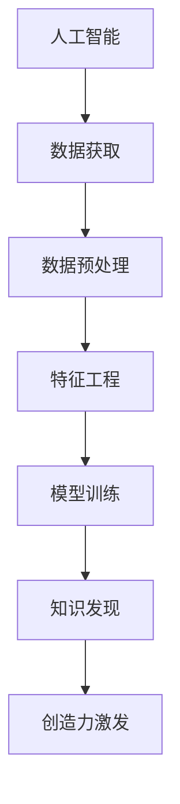
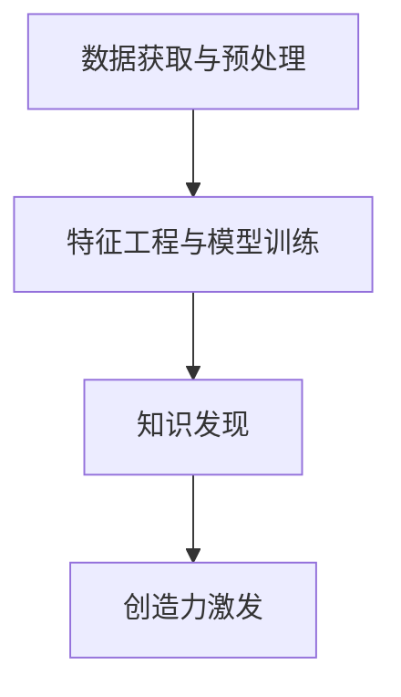

                 

# 创造力与知识发现的关系

## 1. 背景介绍

在人工智能快速发展的今天，创造力与知识发现之间的联系越来越紧密。人工智能通过大量的数据和复杂的算法，揭示出人类长期以来难以觉察的规律和模式，并从中获得新的洞见和创新。本文将深入探讨创造力与知识发现的相互作用，以及如何利用人工智能技术进一步推动这一领域的发展。

## 2. 核心概念与联系

### 2.1 核心概念概述

- **创造力**：指的是个体在特定领域内产生新颖、有价值、具有一定影响力的想法、方案或产品。
- **知识发现**：指通过数据挖掘、统计分析、机器学习等技术，从大量数据中提取和总结知识，以揭示潜在的规律和模式。
- **人工智能**：利用算法和模型，模拟人类的学习、推理、决策等智能过程，处理和分析大量数据。

这三个概念之间的联系主要体现在人工智能在知识发现中扮演着越来越重要的角色，而知识发现又是创造力产生的重要基础。通过人工智能，我们可以更高效地获取和处理海量数据，从中发现规律，进而推动新创意和新产品的产生。

### 2.2 核心概念原理和架构的 Mermaid 流程图



- A. 人工智能：利用算法和模型，处理和分析大量数据。
- B. 数据获取：从各种来源收集所需数据。
- C. 数据预处理：清洗、整理、筛选数据，确保数据质量。
- D. 特征工程：提取和构建有意义的特征，以供模型学习。
- E. 模型训练：使用机器学习算法对数据进行训练，获得模型。
- F. 知识发现：利用模型从数据中提取有用的知识。
- G. 创造力激发：基于知识发现的结果，激发新的创意和方案。

### 2.3 核心概念的联系

人工智能技术在知识发现和创造力激发中起到了至关重要的作用。具体而言：

1. **数据获取**：人工智能可以高效地从海量数据中自动筛选出有价值的信息，极大地减少了人工工作量。
2. **数据预处理**：人工智能可以自动处理数据中的缺失值、异常值，进行归一化、标准化等操作。
3. **特征工程**：人工智能通过深度学习等算法，自动发现数据中的关键特征，提高模型训练效果。
4. **模型训练**：人工智能可以高效地训练各种模型，如神经网络、支持向量机、随机森林等，从中提取规律和模式。
5. **知识发现**：人工智能可以识别出数据中的关联关系、趋势、模式等，形成知识图谱、文本摘要、推荐系统等。
6. **创造力激发**：人工智能在知识发现的基础上，能够通过推理、联想、模拟等过程，激发新的创意和解决方案。

## 3. 核心算法原理 & 具体操作步骤

### 3.1 算法原理概述

创造力与知识发现之间的关系主要通过以下过程实现：

1. **数据获取与预处理**：收集和整理相关数据，保证数据的质量和完整性。
2. **特征工程与模型训练**：利用特征工程提取关键特征，并使用机器学习算法训练模型，发现数据中的知识。
3. **知识发现与创造力激发**：通过分析模型输出的知识，激发新的创意和方案。

这个过程可以用流程图进一步表示：



### 3.2 算法步骤详解

1. **数据获取与预处理**：
    - 从各种来源收集所需数据，包括文本、图像、视频等。
    - 对数据进行清洗、去重、缺失值处理等预处理操作。
    - 使用自然语言处理（NLP）、图像处理等技术，将原始数据转换为结构化数据。

2. **特征工程与模型训练**：
    - 利用特征选择、降维等技术，提取有意义的特征。
    - 选择合适的机器学习算法，如深度学习、随机森林、支持向量机等，训练模型。
    - 对模型进行调参和优化，以获得最佳的性能。

3. **知识发现与创造力激发**：
    - 通过分析模型输出的知识图谱、文本摘要等，揭示数据中的规律和模式。
    - 利用知识发现的结果，激发新的创意和方案。
    - 结合领域专家的经验，进行创造性思维，提出新的产品或解决方案。

### 3.3 算法优缺点

**优点**：

1. **高效性**：人工智能可以处理大规模数据，发现复杂模式，极大地提高了效率。
2. **客观性**：人工智能基于数据和算法，避免了人为偏见，结果更具有客观性和可靠性。
3. **创造力激发**：人工智能可以识别出新的关联关系和趋势，激发新的创意和方案。

**缺点**：

1. **数据依赖**：人工智能的效果高度依赖于数据质量，数据不全、有偏见或噪声都会影响结果。
2. **模型复杂性**：复杂的模型需要大量计算资源和时间，训练和调参过程复杂。
3. **可解释性不足**：许多人工智能算法是“黑箱”模型，难以解释其内部工作机制和决策逻辑。
4. **伦理问题**：人工智能可能学习到有害信息，或产生歧视性、偏见性结果。

### 3.4 算法应用领域

1. **医疗领域**：
    - 利用医疗数据发现新的疾病关联，推动新药研发和治疗方法的创新。
    - 通过数据分析，提高医疗诊断的准确性和效率。

2. **金融领域**：
    - 利用金融数据发现市场趋势，预测股票价格，优化投资组合。
    - 利用客户行为数据，推荐个性化的金融产品和服务。

3. **教育领域**：
    - 利用学习数据发现学生的学习模式，制定个性化的学习计划。
    - 分析教学数据，优化教学内容和方式，提高教学效果。

4. **交通领域**：
    - 利用交通数据发现出行规律，优化交通管理和规划。
    - 分析事故数据，提高交通安全性和减少事故率。

## 4. 数学模型和公式 & 详细讲解 & 举例说明

### 4.1 数学模型构建

在知识发现中，常用的数学模型包括：

1. **回归模型**：用于预测连续值，如线性回归、多项式回归等。
2. **分类模型**：用于预测离散值，如逻辑回归、决策树、随机森林等。
3. **聚类模型**：用于发现数据中的相似群组，如K-means、层次聚类等。
4. **关联规则模型**：用于发现数据中的关联关系，如Apriori算法等。
5. **图模型**：用于表示数据中的复杂关系，如知识图谱、社交网络等。

### 4.2 公式推导过程

以**线性回归模型**为例，其数学公式为：

$$ y = \theta_0 + \theta_1 x_1 + \theta_2 x_2 + \ldots + \theta_n x_n $$

其中，$y$ 为预测值，$\theta_0, \theta_1, \ldots, \theta_n$ 为模型参数，$x_1, x_2, \ldots, x_n$ 为输入特征。

推导过程如下：

1. **目标函数**：定义误差函数，如均方误差，用于衡量模型预测值与真实值之间的差异。
2. **梯度下降**：通过梯度下降算法，最小化误差函数，更新模型参数。
3. **正则化**：添加L2正则项，防止过拟合。
4. **训练与测试**：将数据分为训练集和测试集，用训练集训练模型，用测试集评估模型性能。

### 4.3 案例分析与讲解

**案例**：电商推荐系统

1. **数据获取与预处理**：
    - 从电商平台收集用户浏览、点击、购买等数据。
    - 对数据进行清洗、去重、缺失值处理等操作。
    - 使用NLP技术，将商品描述转换为结构化特征。

2. **特征工程与模型训练**：
    - 提取用户行为特征，如浏览时间、点击次数、购买历史等。
    - 选择随机森林算法，训练推荐模型。
    - 对模型进行调参和优化，以获得最佳的性能。

3. **知识发现与创造力激发**：
    - 通过分析模型输出的用户行为特征，发现用户的兴趣和需求。
    - 利用知识发现的结果，激发新的推荐方案。
    - 结合领域专家的经验，提出个性化的推荐策略，提升用户满意度。

## 5. 项目实践：代码实例和详细解释说明

### 5.1 开发环境搭建

为了进行项目实践，需要搭建Python开发环境，安装必要的库和工具。以下是具体步骤：

1. 安装Python：从官网下载并安装Python，建议使用Anaconda或Miniconda，方便管理环境。
2. 安装依赖库：使用pip或conda安装必要的库，如Numpy、Pandas、Scikit-learn、Matplotlib等。
3. 设置虚拟环境：创建虚拟环境，隔离开发项目，避免依赖冲突。
4. 配置开发环境：配置开发环境，如编辑器的自动补全、高亮显示等。

### 5.2 源代码详细实现

以下是一个简单的线性回归模型代码实现：

```python
import numpy as np
from sklearn.linear_model import LinearRegression
from sklearn.metrics import mean_squared_error

# 生成模拟数据
X = np.random.rand(100, 2)
y = np.dot(X, np.array([1.5, 2])) + np.random.normal(0, 0.5, 100)

# 训练模型
model = LinearRegression()
model.fit(X, y)

# 预测与评估
y_pred = model.predict(X)
mse = mean_squared_error(y, y_pred)

print("MSE: ", mse)
```

### 5.3 代码解读与分析

- **数据生成**：使用numpy生成随机数据。
- **模型训练**：使用scikit-learn的LinearRegression模型进行训练。
- **预测与评估**：使用均方误差（MSE）评估模型性能。

## 6. 实际应用场景

### 6.4 未来应用展望

1. **医疗诊断**：利用人工智能技术，发现新的疾病关联，提供个性化的治疗方案。
2. **金融预测**：通过深度学习等算法，预测市场趋势，优化投资策略。
3. **教育个性化**：利用学习数据，发现学生的学习模式，制定个性化的学习计划。
4. **智能交通**：通过数据分析，优化交通管理和规划，提高交通安全性和减少事故率。

## 7. 工具和资源推荐

### 7.1 学习资源推荐

1. **《深度学习》书籍**：Ian Goodfellow等著，深入介绍深度学习的基础知识和算法。
2. **《机器学习实战》书籍**：Peter Harrington著，通过实例讲解机器学习算法和应用。
3. **Coursera深度学习课程**：Andrew Ng等人讲授，涵盖深度学习的基础和应用。
4. **Kaggle数据集与竞赛**：提供大量公开数据集和竞赛，实践机器学习算法。
5. **GitHub开源项目**：优秀的开源项目，包括TensorFlow、PyTorch等。

### 7.2 开发工具推荐

1. **Jupyter Notebook**：交互式编程环境，方便编写和运行代码。
2. **Python IDE**：如PyCharm、VS Code等，支持代码高亮、自动补全等功能。
3. **数据可视化工具**：如Matplotlib、Seaborn等，方便数据可视化。
4. **机器学习框架**：如TensorFlow、PyTorch等，提供高效的机器学习算法和工具。
5. **数据管理工具**：如Pandas、Dask等，方便数据处理和分析。

### 7.3 相关论文推荐

1. **《Deep Learning》书籍**：Ian Goodfellow等著，深入介绍深度学习的基础知识和算法。
2. **《Pattern Recognition and Machine Learning》书籍**：Christopher Bishop著，涵盖机器学习的基础和高级方法。
3. **《Reinforcement Learning: An Introduction》书籍**：Richard S. Sutton和Andrew G. Barto著，介绍强化学习的基础知识和方法。
4. **《Knowledge Discovery in Databases》书籍**：Lutz Kübler和Erich Müller著，介绍知识发现的基础和高级方法。
5. **《Hands-On Machine Learning with Scikit-Learn, Keras, and TensorFlow》书籍**：Aurélien Géron著，介绍机器学习的基础和应用。

## 8. 总结：未来发展趋势与挑战

### 8.1 研究成果总结

人工智能在知识发现和创造力激发中的作用越来越重要。通过数据挖掘和机器学习算法，可以发现复杂模式和规律，为创造性思维提供新的洞见和灵感。未来，人工智能将在更多领域发挥重要作用，推动科技进步和社会发展。

### 8.2 未来发展趋势

1. **自动化与智能化**：人工智能将更加自动化，通过自监督学习、主动学习等方法，自动识别特征和模式。
2. **跨领域融合**：人工智能将与更多领域结合，如生物、物理、社会等，形成跨学科的创新。
3. **边缘计算**：人工智能将应用于边缘计算，提高数据处理效率，减少延迟。
4. **智能决策**：人工智能将应用于智能决策，提高决策的准确性和效率。
5. **伦理与安全**：人工智能将更加注重伦理和安全问题，确保其应用的社会效益和道德标准。

### 8.3 面临的挑战

1. **数据隐私**：如何保护用户数据隐私，防止数据泄露和滥用。
2. **模型解释**：如何提高模型的可解释性，确保其决策过程透明和可理解。
3. **伦理与安全**：如何避免算法偏见和歧视，确保其应用的社会效益和道德标准。
4. **计算资源**：如何降低计算成本，提高模型训练和推理的效率。
5. **知识整合**：如何整合多模态数据，形成全面、准确的信息整合能力。

### 8.4 研究展望

未来，人工智能将在更多领域发挥重要作用，推动科技进步和社会发展。以下是我们对未来研究的展望：

1. **自动化与智能化**：通过自监督学习、主动学习等方法，自动识别特征和模式，提高人工智能的自动化水平。
2. **跨领域融合**：将人工智能与更多领域结合，形成跨学科的创新，推动科学技术进步。
3. **边缘计算**：将人工智能应用于边缘计算，提高数据处理效率，减少延迟，满足实时性需求。
4. **智能决策**：将人工智能应用于智能决策，提高决策的准确性和效率，优化决策过程。
5. **伦理与安全**：注重算法伦理和安全性问题，确保其应用的社会效益和道德标准，避免潜在风险。

## 9. 附录：常见问题与解答

**Q1: 如何理解创造力与知识发现之间的关系？**

A: 创造力是利用知识发现的结果，通过推理、联想、模拟等过程，提出新的想法和解决方案。知识发现则是通过数据挖掘、统计分析等方法，揭示数据中的规律和模式，为创造性思维提供新的洞见和灵感。

**Q2: 人工智能在知识发现中的作用是什么？**

A: 人工智能在知识发现中扮演着重要角色，通过数据挖掘和机器学习算法，可以发现复杂模式和规律，为创造性思维提供新的洞见和灵感。

**Q3: 如何提高人工智能模型的可解释性？**

A: 提高模型的可解释性，需要更多的研究和实践。可以通过可视化、符号化解释等方法，帮助理解模型的决策过程和内部工作机制。

**Q4: 人工智能在跨领域融合中面临哪些挑战？**

A: 人工智能在跨领域融合中面临数据隐私、伦理与安全、计算资源等挑战。需要多方合作，共同制定规范和标准，确保其应用的社会效益和道德标准。

**Q5: 人工智能的未来发展趋势是什么？**

A: 未来，人工智能将在更多领域发挥重要作用，推动科技进步和社会发展。未来研究的重点在于自动化与智能化、跨领域融合、边缘计算、智能决策、伦理与安全等方面。

---

作者：禅与计算机程序设计艺术 / Zen and the Art of Computer Programming

