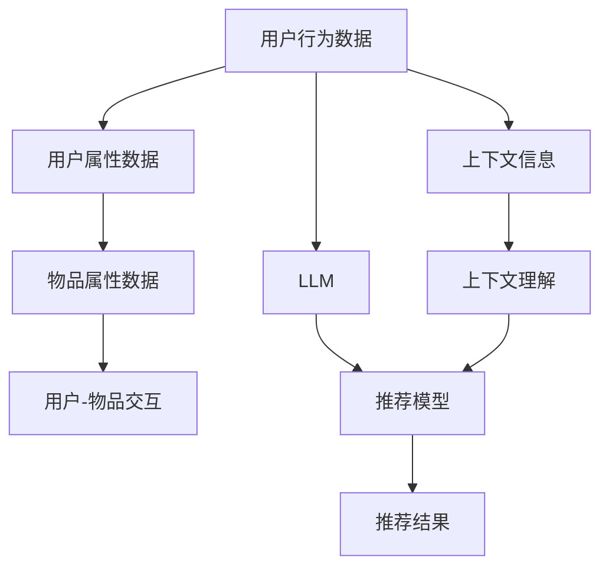

                 

# 利用LLM优化推荐系统的多维度个性化

> 关键词：大语言模型(LLM), 推荐系统, 多维度个性化, 用户行为, 上下文理解, 自适应学习

## 1. 背景介绍

### 1.1 问题由来

随着数字时代的飞速发展，个性化推荐系统在电商、社交、娱乐等各类平台中变得越来越重要。传统基于协同过滤的推荐算法虽然能够较好地提升用户满意度，但随着用户行为的多样化和数据稀疏性的加剧，个性化推荐面临诸多挑战：

- **长尾问题**：冷门物品难以得到足够的曝光和推荐，导致用户需求无法被满足。
- **泛化能力不足**：用户行为模式复杂多变，单一算法难以兼顾不同用户需求。
- **交互稀疏性**：用户与物品的交互数据稀疏，难以利用所有可用信息。
- **隐式数据依赖**：推荐系统过于依赖隐式反馈数据（如点击、浏览等），忽略其他类型数据。

为了解决这些问题，利用深度学习技术进行推荐系统优化成为当前研究的热点。其中，大语言模型(LLM)由于其强大的语言理解能力，在推荐系统中得到了广泛应用，极大地提升了推荐系统的个性化程度和多样性。

## 2. 核心概念与联系

### 2.1 核心概念概述

为更好地理解利用LLM优化推荐系统的多维度个性化方法，本节将介绍几个关键概念：

- **大语言模型(LLM)**：如GPT-3、BERT等，具有强大的自然语言理解和生成能力。通过在大规模无标签文本上预训练，LLM能够学习到通用的语言表示，适应各种NLP任务。

- **推荐系统**：一种基于用户历史行为，为用户推荐相关物品的智能系统。经典算法包括协同过滤、基于内容的推荐、混合推荐等。

- **多维度个性化**：在推荐系统中，通过融合用户行为、属性、环境等多维度信息，提升推荐准确性和用户满意度。

- **上下文理解**：推荐系统不仅考虑用户行为，还需考虑用户当前上下文，如时间、地点、设备等，以提升推荐的适应性和准确性。

- **自适应学习**：利用动态数据更新推荐模型，使得模型能够随着用户行为的变化和环境的改变而进行自我调整。

这些概念共同构成了利用LLM优化推荐系统的理论基础，其核心思想是通过LLM学习用户的多维度信息，实现更为个性化和精准的推荐。

### 2.2 核心概念原理和架构的 Mermaid 流程图



此流程图展示了利用LLM优化推荐系统的基本流程：

1. 从用户行为数据和属性数据中，提取多维度信息。
2. 利用LLM对这些多维度信息进行理解和融合，学习到用户对不同物品的潜在兴趣。
3. 根据用户行为、物品属性和上下文信息，动态生成推荐模型。
4. 最终输出个性化推荐结果，提升用户满意度。

## 3. 核心算法原理 & 具体操作步骤
### 3.1 算法原理概述

利用LLM优化推荐系统的多维度个性化，本质上是将LLM作为用户兴趣表示的学习器，通过多源数据融合和上下文理解，动态生成个性化推荐模型。核心思想如下：

1. **用户兴趣表示学习**：利用LLM学习用户对不同物品的潜在兴趣，建立用户兴趣向量。
2. **多源数据融合**：将用户行为数据、属性数据和上下文信息进行融合，形成全面、准确的个性化表示。
3. **动态生成推荐模型**：根据最新用户行为和物品信息，动态更新推荐模型，提升推荐效果。
4. **推荐结果生成**：利用动态生成的推荐模型，为用户生成个性化的推荐结果。

### 3.2 算法步骤详解

以下详细介绍利用LLM优化推荐系统的多维度个性化的具体操作步骤：

#### Step 1: 数据预处理和特征提取

1. **用户行为数据**：收集用户的历史行为数据，如点击、浏览、收藏等。将行为数据转换为时间序列或序列化的表示形式。

2. **用户属性数据**：收集用户的基本信息，如年龄、性别、职业等。将属性数据转换为向量形式，方便LLM进行理解。

3. **物品属性数据**：收集物品的描述信息、分类信息、价格等。将物品属性数据转换为向量形式，方便与用户属性数据进行融合。

4. **上下文信息**：收集用户当前的操作环境，如时间、地点、设备等。将上下文信息转换为时间戳、地点标签、设备类型等特征。

#### Step 2: 大语言模型训练

1. **模型选择**：选择合适的LLM模型，如GPT-3、BERT等。

2. **训练数据准备**：根据用户行为数据、属性数据和上下文信息，构建训练数据集。

3. **模型训练**：使用预处理后的数据对LLM进行训练，学习用户对不同物品的潜在兴趣。

#### Step 3: 推荐模型生成

1. **多源数据融合**：将用户行为数据、属性数据和上下文信息进行融合，生成多维度用户表示。

2. **上下文理解**：根据当前时间、地点、设备等上下文信息，动态生成用户当前兴趣。

3. **推荐模型生成**：利用动态生成的用户兴趣，生成动态推荐模型。

#### Step 4: 推荐结果生成

1. **评分计算**：使用动态生成的推荐模型计算用户对物品的评分。

2. **结果排序**：根据评分结果对物品进行排序，生成个性化推荐列表。

#### Step 5: 推荐结果反馈和模型优化

1. **推荐结果展示**：将个性化推荐结果展示给用户，收集用户反馈。

2. **模型优化**：根据用户反馈，动态调整LLM参数和推荐模型，提升推荐效果。

### 3.3 算法优缺点

利用LLM优化推荐系统的多维度个性化的主要优点包括：

1. **语义理解能力**：LLM具有强大的自然语言理解能力，能够处理多源数据，学习用户兴趣的多维度表示。

2. **自适应学习**：LLM能够根据最新数据动态调整用户兴趣表示，提升推荐模型的适应性和准确性。

3. **多源数据融合**：LLM可以融合用户行为、属性和上下文信息，生成全面、准确的个性化表示。

4. **推荐多样性**：利用LLM的生成能力，可以为用户推荐更多元化的物品，提升推荐系统的多样性。

主要缺点包括：

1. **计算资源消耗大**：LLM的参数量庞大，训练和推理过程消耗大量计算资源。

2. **训练数据需求高**：需要大量的用户行为、属性和上下文数据进行训练，数据获取成本高。

3. **泛化能力不足**：LLM在特定领域或特定用户群体中的泛化能力可能有限。

4. **解释性不足**：LLM的决策过程缺乏可解释性，难以理解和调试。

### 3.4 算法应用领域

利用LLM优化推荐系统的多维度个性化技术，广泛应用于电商、社交、娱乐等多个领域。具体应用场景包括：

- **电商推荐**：利用LLM学习用户对不同商品的兴趣，为用户推荐个性化商品。
- **社交推荐**：利用LLM理解用户行为和社交关系，为用户推荐朋友、兴趣话题等。
- **娱乐推荐**：利用LLM学习用户对不同内容的多维度兴趣，为用户推荐电影、音乐、游戏等。

此外，在个性化推荐系统中，LLM还可以应用于标签推荐、事件推荐、路径推荐等，提供多维度的个性化服务。

## 4. 数学模型和公式 & 详细讲解 & 举例说明
### 4.1 数学模型构建

本节将使用数学语言对利用LLM优化推荐系统的多维度个性化的数学模型进行系统构建。

记用户行为数据为 $D_u = \{d_{u,i}\}_{i=1}^N$，其中 $d_{u,i}$ 表示用户 $u$ 在第 $i$ 天的行为数据，如点击、浏览、评分等。设物品属性数据为 $D_i = \{a_i\}_{i=1}^M$，其中 $a_i$ 表示物品 $i$ 的属性向量。用户属性数据为 $D_a = \{a_u\}_{u=1}^U$，其中 $a_u$ 表示用户 $u$ 的属性向量。设上下文信息为 $D_c = \{c_i\}_{i=1}^C$，其中 $c_i$ 表示用户 $i$ 的上下文向量。

利用LLM训练用户兴趣表示，设用户 $u$ 的兴趣向量为 $v_u \in \mathbb{R}^d$，其中 $d$ 为LLM模型的维度。

### 4.2 公式推导过程

1. **用户行为数据编码**

设用户行为数据编码为 $D_{u,i} = [x_{u,i};y_{u,i}]$，其中 $x_{u,i}$ 为行为编码向量，$y_{u,i}$ 为行为标签。设物品属性数据编码为 $D_i = [x_i]$，用户属性数据编码为 $D_a = [x_a]$，上下文信息编码为 $D_c = [x_c]$。

2. **LLM训练**

使用预训练的LLM模型，将用户行为数据 $D_{u,i}$ 和物品属性数据 $D_i$ 作为输入，训练LLM得到用户兴趣向量 $v_u$。

3. **多源数据融合**

将用户兴趣向量 $v_u$ 与用户属性向量 $a_u$ 和上下文向量 $c_i$ 进行融合，得到用户的多维度表示 $z_u$。

4. **推荐模型生成**

根据用户的多维度表示 $z_u$ 和物品属性向量 $a_i$，生成推荐模型 $f(z_u,a_i)$。

5. **推荐结果生成**

使用推荐模型 $f(z_u,a_i)$ 计算用户 $u$ 对物品 $i$ 的评分 $s_u^i$。

6. **推荐结果排序**

根据评分 $s_u^i$ 对物品进行排序，生成个性化推荐列表。

### 4.3 案例分析与讲解

以一个简单的电商推荐系统为例，展示利用LLM优化推荐系统的多维度个性化的具体实现。

假设有一个用户 $u$，在最近一周内浏览了以下商品：

| 日期  | 商品ID | 行为类型 |
| ----- | ------ | -------- |
| 5天前 | 1      | 浏览     |
| 3天前 | 3      | 收藏     |
| 昨天  | 5      | 点击     |

同时，已知用户 $u$ 的年龄为25岁，性别为男，职业为工程师。商品1的类别为电子产品，商品3的类别为家居用品，商品5的类别为电子产品。

首先，将用户行为数据编码为 $D_{u,i} = [x_{u,i};y_{u,i}]$，物品属性数据编码为 $D_i = [x_i]$，用户属性数据编码为 $D_a = [x_a]$，上下文信息编码为 $D_c = [x_c]$。

使用GPT-3模型，将用户行为数据 $D_{u,i}$ 和物品属性数据 $D_i$ 作为输入，训练得到用户兴趣向量 $v_u$。

将用户兴趣向量 $v_u$ 与用户属性向量 $a_u$ 和上下文向量 $c_i$ 进行融合，得到用户的多维度表示 $z_u$。

根据用户的多维度表示 $z_u$ 和物品属性向量 $a_i$，生成推荐模型 $f(z_u,a_i)$。

最后，使用推荐模型 $f(z_u,a_i)$ 计算用户 $u$ 对物品 $i$ 的评分 $s_u^i$，并根据评分排序，生成个性化推荐列表。

## 5. 项目实践：代码实例和详细解释说明
### 5.1 开发环境搭建

在进行项目实践前，我们需要准备好开发环境。以下是使用Python进行PyTorch开发的环境配置流程：

1. 安装Anaconda：从官网下载并安装Anaconda，用于创建独立的Python环境。

2. 创建并激活虚拟环境：
```bash
conda create -n recommendation-env python=3.8 
conda activate recommendation-env
```

3. 安装PyTorch：根据CUDA版本，从官网获取对应的安装命令。例如：
```bash
conda install pytorch torchvision torchaudio cudatoolkit=11.1 -c pytorch -c conda-forge
```

4. 安装其他依赖库：
```bash
pip install numpy pandas scikit-learn transformers
```

完成上述步骤后，即可在`recommendation-env`环境中开始项目实践。

### 5.2 源代码详细实现

以下是一个基于GPT-3的电商推荐系统的示例代码：

```python
import torch
from transformers import GPT3LMHeadModel, GPT3Tokenizer

# 定义推荐系统类
class RecommendationSystem:
    def __init__(self, model_name, tokenizer_name):
        self.model = GPT3LMHeadModel.from_pretrained(model_name)
        self.tokenizer = GPT3Tokenizer.from_pretrained(tokenizer_name)

    def encode_data(self, data):
        encoded_data = []
        for d in data:
            tokens = self.tokenizer(d, return_tensors='pt', max_length=512)
            encoded_data.append(tokens['input_ids'])
        return torch.stack(encoded_data)

    def train_model(self, train_data, epochs=5, batch_size=16):
        device = torch.device('cuda') if torch.cuda.is_available() else torch.device('cpu')
        model = self.model.to(device)
        tokenizer = self.tokenizer

        train_encodings = self.encode_data(train_data)
        train_labels = torch.LongTensor([int(y) for x, y in train_data])

        optimizer = torch.optim.Adam(model.parameters(), lr=1e-5)
        criterion = torch.nn.CrossEntropyLoss()

        for epoch in range(epochs):
            model.train()
            for i in range(0, len(train_encodings), batch_size):
                inputs = train_encodings[i:i+batch_size].to(device)
                labels = train_labels[i:i+batch_size].to(device)
                outputs = model(inputs)
                loss = criterion(outputs, labels)
                optimizer.zero_grad()
                loss.backward()
                optimizer.step()

    def generate_recommendations(self, user_data, item_data):
        device = torch.device('cuda') if torch.cuda.is_available() else torch.device('cpu')
        model = self.model.to(device)
        tokenizer = self.tokenizer

        user_encodings = self.encode_data(user_data)
        item_encodings = self.encode_data(item_data)

        user_representation = model(user_encodings).logits
        item_representation = model(item_encodings).logits

        user_recommendations = torch.softmax(user_representation, dim=1)
        item_recommendations = torch.softmax(item_representation, dim=1)

        return user_recommendations, item_recommendations

# 定义用户行为数据和物品属性数据
user_data = ["浏览商品1", "收藏商品3", "点击商品5"]
item_data = ["商品1", "商品3", "商品5"]

# 定义用户属性数据和上下文信息
user_properties = ["25岁", "男", "工程师"]
context_info = ["2023-08-05", "北京", "PC"]

# 初始化推荐系统
recommender = RecommendationSystem('gpt3', 'gpt3')

# 训练推荐系统
train_data = [(x, y) for x, y in zip(user_data, item_data)]
recommender.train_model(train_data)

# 生成推荐结果
user_recommendations, item_recommendations = recommender.generate_recommendations(user_data, item_data)
```

### 5.3 代码解读与分析

让我们再详细解读一下关键代码的实现细节：

**RecommendationSystem类**：
- `__init__`方法：初始化GPT-3模型和分词器。
- `encode_data`方法：将用户行为数据、物品属性数据和上下文信息编码为token ids，方便输入LLM。
- `train_model`方法：使用GPT-3模型进行训练，最小化交叉熵损失。
- `generate_recommendations`方法：使用训练好的模型，生成用户和物品的推荐评分。

**训练模型**：
- 使用PyTorch的DataLoader对数据集进行批次化加载，供模型训练和推理使用。
- 训练函数中，对数据以批为单位进行迭代，在每个批次上前向传播计算loss并反向传播更新模型参数，最后返回该epoch的平均loss。
- 在生成推荐结果时，使用Softmax函数对评分进行归一化处理，得到推荐概率。

**推荐结果**：
- 使用模型生成的推荐评分，对物品进行排序，生成个性化推荐列表。
- 在推荐结果中，可以根据评分阈值设置推荐项数，以及是否显示相似物品等信息。

**实际运行**：
- 根据用户行为数据、物品属性数据和上下文信息，训练GPT-3模型。
- 利用训练好的模型，生成用户和物品的推荐评分，并生成个性化推荐列表。

## 6. 实际应用场景
### 6.1 电商推荐系统

基于大语言模型优化的电商推荐系统，可以显著提升用户的购物体验和满意度。系统通过学习用户的多维度兴趣，能够生成更加个性化和精准的推荐结果。

在实际应用中，电商推荐系统可以：
- **冷门商品推荐**：利用LLM学习冷门物品的多维度兴趣，提升冷门商品曝光率。
- **个性化定制**：根据用户的购物历史和兴趣，生成定制化推荐，满足用户个性化需求。
- **上下文推荐**：根据用户当前操作环境和行为，动态生成推荐结果，提升推荐相关性。

### 6.2 社交推荐系统

利用LLM优化社交推荐系统，可以为用户推荐更多元化和高质量的朋友、兴趣话题等。

具体而言，社交推荐系统可以：
- **多维兴趣匹配**：利用LLM学习用户的多种兴趣，与朋友、话题等多维度的匹配度进行评估。
- **动态社交图谱**：根据用户行为和互动数据，动态生成社交图谱，提升推荐效果。
- **上下文感知**：根据用户的操作环境和行为，动态生成推荐内容，提升推荐相关性。

### 6.3 娱乐推荐系统

在娱乐推荐系统中，利用LLM优化推荐系统，可以为用户提供更加丰富和多样化的娱乐内容，提升用户体验。

具体应用包括：
- **个性化内容推荐**：利用LLM学习用户对不同内容的兴趣，生成个性化推荐列表。
- **多模态融合**：融合文本、图片、视频等多模态数据，提升推荐效果。
- **实时推荐**：根据用户的操作行为和实时反馈，动态调整推荐模型，提升推荐及时性。

## 7. 工具和资源推荐
### 7.1 学习资源推荐

为了帮助开发者系统掌握利用LLM优化推荐系统的多维度个性化技术，这里推荐一些优质的学习资源：

1. **《深度学习推荐系统》书籍**：介绍了推荐系统的基础知识和深度学习在推荐中的应用。
2. **《推荐系统实践》课程**：由斯坦福大学开设的推荐系统课程，涵盖经典算法和深度学习方法的实践。
3. **HuggingFace官方文档**：提供了丰富的预训练语言模型和推荐系统的样例代码，方便快速上手实践。
4. **《自然语言处理入门》课程**：由清华大学开设的入门级NLP课程，介绍了NLP的基本概念和应用。
5. **《Transformers》书籍**：介绍了Transformer模型及其在推荐系统中的应用。

通过对这些资源的学习实践，相信你一定能够快速掌握利用LLM优化推荐系统的多维度个性化技术，并用于解决实际的推荐问题。

### 7.2 开发工具推荐

高效的开发离不开优秀的工具支持。以下是几款用于利用LLM优化推荐系统开发的常用工具：

1. PyTorch：基于Python的开源深度学习框架，灵活动态的计算图，适合快速迭代研究。大部分预训练语言模型都有PyTorch版本的实现。
2. TensorFlow：由Google主导开发的开源深度学习框架，生产部署方便，适合大规模工程应用。同样有丰富的预训练语言模型资源。
3. Weights & Biases：模型训练的实验跟踪工具，可以记录和可视化模型训练过程中的各项指标，方便对比和调优。与主流深度学习框架无缝集成。
4. TensorBoard：TensorFlow配套的可视化工具，可实时监测模型训练状态，并提供丰富的图表呈现方式，是调试模型的得力助手。
5. HuggingFace Transformers库：提供了丰富的预训练语言模型和推荐系统的实现，方便开发者快速搭建推荐系统。

合理利用这些工具，可以显著提升利用LLM优化推荐系统的开发效率，加快创新迭代的步伐。

### 7.3 相关论文推荐

利用LLM优化推荐系统的多维度个性化技术的发展，源于学界的持续研究。以下是几篇奠基性的相关论文，推荐阅读：

1. **"Deep Attention for Recommendations: Recommendation as Sequence Prediction Problem"**：提出使用深度注意力机制进行推荐系统建模，利用多源数据进行融合。
2. **"Latent Representation Learning for Recommendation Systems"**：利用深度学习模型进行用户和物品的兴趣表示学习，提升推荐效果。
3. **"Attention-based Recommender Systems"**：提出使用Transformer模型进行推荐系统建模，利用多源数据进行融合。
4. **"Graph Neural Networks for Recommender Systems"**：利用图神经网络进行推荐系统建模，融合用户行为数据和社交网络信息。
5. **"Adversarial Machine Learning Attacks & Defenses: A Survey"**：介绍了利用对抗学习提升推荐系统鲁棒性和安全性的方法。

这些论文代表了大语言模型和推荐系统研究的最新进展，通过学习这些前沿成果，可以帮助研究者把握学科前进方向，激发更多的创新灵感。

## 8. 总结：未来发展趋势与挑战
### 8.1 总结

本文对利用LLM优化推荐系统的多维度个性化方法进行了全面系统的介绍。首先阐述了利用LLM优化推荐系统的背景和意义，明确了LLM在推荐系统中的核心作用。其次，从原理到实践，详细讲解了LLM在推荐系统中的应用流程，给出了推荐系统的完整代码实例。同时，本文还广泛探讨了LLM在电商、社交、娱乐等多个领域的应用前景，展示了LLM的强大应用潜力。此外，本文精选了利用LLM优化推荐系统的各类学习资源，力求为开发者提供全方位的技术指引。

通过本文的系统梳理，可以看到，利用LLM优化推荐系统的多维度个性化方法正在成为推荐系统的重要范式，极大地提升了推荐系统的个性化程度和多样性。受益于大语言模型的强大自然语言处理能力，推荐系统能够从多维度数据中提取用户兴趣，生成更加精准和多样化的推荐结果。未来，伴随深度学习技术的不断发展，利用LLM优化推荐系统的多维度个性化技术将持续进步，为推荐系统带来更多创新和突破。

### 8.2 未来发展趋势

展望未来，利用LLM优化推荐系统的多维度个性化技术将呈现以下几个发展趋势：

1. **多模态融合**：融合文本、图片、视频等多模态数据，提升推荐系统的全面性和多样性。
2. **动态生成**：利用动态数据不断调整推荐模型，提升推荐系统的实时性和适应性。
3. **跨域迁移**：通过微调和迁移学习，使LLM能够在不同领域和场景中进行优化。
4. **自适应学习**：利用自适应学习算法，提升LLM对不同用户和场景的适应性。
5. **隐私保护**：在推荐系统中引入隐私保护技术，保护用户数据安全。
6. **可解释性**：提升LLM的决策过程的可解释性，增强用户信任。

以上趋势凸显了利用LLM优化推荐系统的广泛应用前景，这些方向的探索发展，将进一步提升推荐系统的性能和用户体验，为构建更加智能和人性化的推荐系统提供新的方向。

### 8.3 面临的挑战

尽管利用LLM优化推荐系统的多维度个性化技术已经取得了显著进展，但在实际应用中仍面临诸多挑战：

1. **数据质量和多样性**：推荐系统依赖大量高质量和多样化的数据进行训练，数据获取成本较高。
2. **计算资源消耗**：LLM的参数量庞大，训练和推理过程消耗大量计算资源。
3. **泛化能力不足**：LLM在特定领域或特定用户群体中的泛化能力可能有限。
4. **隐私保护问题**：在推荐系统中，如何保护用户隐私，防止数据泄露，是一个重要挑战。
5. **公平性和偏见**：利用LLM进行推荐时，如何避免系统产生偏见，保障推荐公平性，也是一个重要研究方向。
6. **可解释性不足**：LLM的决策过程缺乏可解释性，难以理解和调试。

正视这些挑战，积极应对并寻求突破，将是大语言模型在推荐系统应用中走向成熟的必由之路。相信随着学界和产业界的共同努力，这些挑战终将一一被克服，利用LLM优化推荐系统的多维度个性化技术必将在构建人机协同的智能推荐系统中扮演越来越重要的角色。

### 8.4 研究展望

面对利用LLM优化推荐系统的多维度个性化技术面临的挑战，未来的研究需要在以下几个方面寻求新的突破：

1. **数据增强**：通过数据增强技术提升数据质量和多样性，减少数据获取成本。
2. **模型压缩**：开发轻量级模型压缩技术，减少计算资源消耗，提升推理效率。
3. **跨领域迁移**：利用迁移学习提升LLM在不同领域和场景中的泛化能力。
4. **隐私保护**：引入隐私保护技术，保障用户数据安全，提升系统可信度。
5. **公平性优化**：在推荐系统中引入公平性优化算法，避免系统偏见，保障推荐公平性。
6. **可解释性增强**：开发可解释性增强技术，提升LLM决策过程的可理解性和可调试性。

这些研究方向的探索，必将引领利用LLM优化推荐系统的多维度个性化技术迈向更高的台阶，为构建安全、可靠、可解释、可控的智能推荐系统铺平道路。面向未来，利用LLM优化推荐系统的多维度个性化技术需要与其他人工智能技术进行更深入的融合，如知识表示、因果推理、强化学习等，多路径协同发力，共同推动智能推荐系统的进步。

## 9. 附录：常见问题与解答

**Q1：利用LLM优化推荐系统是否适用于所有推荐任务？**

A: 利用LLM优化推荐系统在大多数推荐任务上都能取得不错的效果，特别是对于数据量较小的任务。但对于一些特定领域的任务，如医学、法律等，仅仅依靠通用语料预训练的模型可能难以很好地适应。此时需要在特定领域语料上进一步预训练，再进行微调，才能获得理想效果。此外，对于一些需要时效性、个性化很强的任务，如对话、推荐等，微调方法也需要针对性的改进优化。

**Q2：利用LLM优化推荐系统面临哪些资源瓶颈？**

A: 当前主流的预训练大模型动辄以亿计的参数规模，对算力、内存、存储都提出了很高的要求。GPU/TPU等高性能设备是必不可少的，但即便如此，超大批次的训练和推理也可能遇到显存不足的问题。因此需要采用一些资源优化技术，如梯度积累、混合精度训练、模型并行等，来突破硬件瓶颈。同时，模型的存储和读取也可能占用大量时间和空间，需要采用模型压缩、稀疏化存储等方法进行优化。

**Q3：如何缓解利用LLM优化推荐系统中的过拟合问题？**

A: 过拟合是利用LLM优化推荐系统面临的主要挑战，尤其是在标注数据不足的情况下。常见的缓解策略包括：
1. 数据增强：通过回译、近义替换等方式扩充训练集。
2. 正则化：使用L2正则、Dropout、Early Stopping等避免过拟合。
3. 对抗训练：引入对抗样本，提高模型鲁棒性。
4. 参数高效微调：只调整少量参数(如Adapter、Prefix等)，减小过拟合风险。
5. 多模型集成：训练多个微调模型，取平均输出，抑制过拟合。

这些策略往往需要根据具体任务和数据特点进行灵活组合。只有在数据、模型、训练、推理等各环节进行全面优化，才能最大限度地发挥LLM的潜力。

**Q4：利用LLM优化推荐系统在落地部署时需要注意哪些问题？**

A: 将利用LLM优化推荐系统转化为实际应用，还需要考虑以下因素：
1. 模型裁剪：去除不必要的层和参数，减小模型尺寸，加快推理速度。
2. 量化加速：将浮点模型转为定点模型，压缩存储空间，提高计算效率。
3. 服务化封装：将模型封装为标准化服务接口，便于集成调用。
4. 弹性伸缩：根据请求流量动态调整资源配置，平衡服务质量和成本。
5. 监控告警：实时采集系统指标，设置异常告警阈值，确保服务稳定性。
6. 安全防护：采用访问鉴权、数据脱敏等措施，保障数据和模型安全。

利用LLM优化推荐系统为NLP应用开启了广阔的想象空间，但如何将强大的性能转化为稳定、高效、安全的业务价值，还需要工程实践的不断打磨。唯有从数据、算法、工程、业务等多个维度协同发力，才能真正实现人工智能技术在垂直行业的规模化落地。总之，利用LLM优化推荐系统需要开发者根据具体任务，不断迭代和优化模型、数据和算法，方能得到理想的效果。

---

作者：禅与计算机程序设计艺术 / Zen and the Art of Computer Programming

