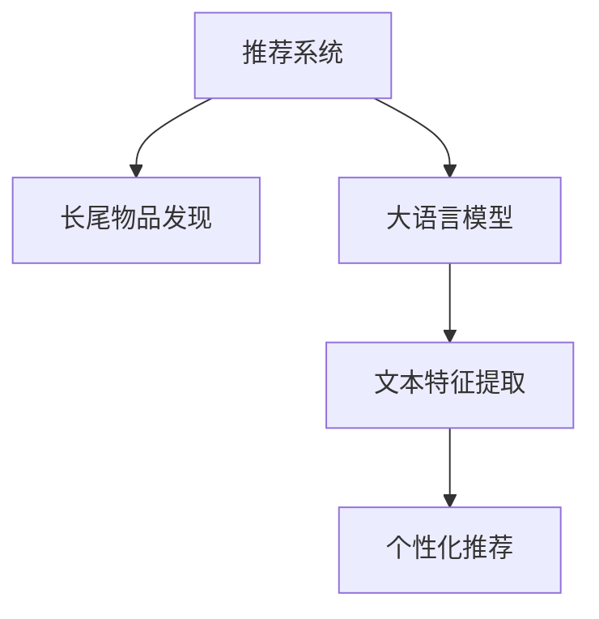

                 

# 利用LLM优化推荐系统的长尾物品发现

## 1. 背景介绍

### 1.1 问题由来
随着电子商务和在线内容的兴起，推荐系统已成为各大互联网平台不可或缺的关键组件。推荐系统通过分析用户的历史行为，预测其未来的需求，从而提供个性化的内容和服务，极大地提升了用户体验和平台粘性。但传统的协同过滤和基于内容的推荐方法，往往只关注热门物品，而忽略了长尾物品的推荐。长尾物品指的是那些需求量低、但总数巨大的物品，这些物品在热门推荐中很容易被忽视，但实际上对用户有重要价值。

近年来，大语言模型（Large Language Models, LLMs）如BERT、GPT等，在自然语言处理（NLP）领域取得了突破性进展。LLMs通过在海量数据上进行自监督学习，学习到了丰富的语言表示，具备强大的文本理解能力。这种能力使得LLMs在推荐系统中具有巨大的潜力，可以通过分析文本信息，发现长尾物品，为用户推荐更具个性化的内容。

### 1.2 问题核心关键点
LLM在推荐系统中的应用，主要体现在两个方面：
1. **长尾物品的发现**：利用LLM的文本理解能力，分析用户的文本反馈、评论、描述等数据，发现热门物品之外的长尾物品。
2. **个性化推荐**：将长尾物品推荐给对它们有需求的用户，提升用户体验和平台价值。

本文将重点探讨如何利用LLM优化推荐系统，发现并推荐长尾物品。

## 2. 核心概念与联系

### 2.1 核心概念概述

为更好地理解利用LLM优化推荐系统的方法，本节将介绍几个关键概念：

- **推荐系统（Recommender System）**：通过分析用户的历史行为，预测其未来的需求，为用户推荐合适的物品。
- **长尾物品（Long Tail Items）**：指需求量低、但总数巨大的物品，这些物品在热门推荐中容易被忽视，但实际上对用户有重要价值。
- **大语言模型（Large Language Models, LLMs）**：通过在海量数据上进行自监督学习，学习到丰富的语言表示，具备强大的文本理解能力。
- **自监督学习（Supervised Learning）**：在没有标签数据的情况下，通过分析数据的内在结构，学习模型。
- **文本特征提取（Text Feature Extraction）**：从文本数据中提取有意义的特征，用于推荐模型的训练。
- **个性化推荐（Personalized Recommendation）**：根据用户的兴趣和行为，推荐个性化的物品。

这些概念之间通过以下Mermaid流程图联系起来：



这个流程图展示了推荐系统的主要流程：首先，利用大语言模型分析文本数据，发现长尾物品；接着，提取文本特征，训练个性化推荐模型；最后，将长尾物品推荐给对它们有需求的用户。

## 3. 核心算法原理 & 具体操作步骤

### 3.1 算法原理概述

利用LLM优化推荐系统的主要原理是通过文本分析，发现长尾物品，并利用这些物品进行个性化推荐。具体来说，分为以下步骤：

1. **长尾物品发现**：利用LLM分析用户的文本反馈、评论、描述等数据，识别出热门物品之外的长尾物品。
2. **文本特征提取**：从长尾物品的文本描述中提取有意义的特征，用于推荐模型的训练。
3. **个性化推荐**：基于提取的文本特征，训练个性化推荐模型，将长尾物品推荐给对它们有需求的用户。

### 3.2 算法步骤详解

#### 3.2.1 长尾物品发现

**步骤1：数据预处理**
- 收集用户对长尾物品的文本反馈、评论、描述等数据。
- 对数据进行清洗、分词、去停用词等预处理步骤。

**步骤2：模型选择**
- 选择适合的长尾物品发现模型，如BERT、GPT等。
- 根据任务特点，选择合适的模型配置，如模型大小、层数、隐藏尺寸等。

**步骤3：模型训练**
- 将预处理后的文本数据输入模型，进行微调。
- 使用自监督学习任务，如掩码语言模型、下一句预测等，训练模型。
- 对模型进行评估，选择性能最佳的模型。

**步骤4：长尾物品识别**
- 使用训练好的模型，对新的用户反馈进行分析，识别出长尾物品。
- 根据用户的反馈文本，计算长尾物品与用户之间的相似度，识别出对用户有价值的物品。

#### 3.2.2 文本特征提取

**步骤1：特征选择**
- 选择适合文本特征提取的方法，如TF-IDF、Word2Vec、BERT等。
- 根据任务特点，选择合适的特征提取器。

**步骤2：特征计算**
- 使用选定的特征提取器，对长尾物品的文本描述进行特征提取。
- 将提取的特征向量作为推荐模型的输入。

**步骤3：特征选择**
- 对提取的特征向量进行选择，去除冗余或噪声特征。
- 使用PCA等降维技术，简化特征空间。

#### 3.2.3 个性化推荐

**步骤1：推荐模型选择**
- 选择适合个性化推荐的模型，如基于协同过滤、基于内容的推荐模型等。
- 根据任务特点，选择合适的推荐模型。

**步骤2：模型训练**
- 使用提取的文本特征作为训练数据，训练推荐模型。
- 使用交叉验证等技术，评估模型性能，选择最佳模型。

**步骤3：个性化推荐**
- 将长尾物品和用户行为数据输入推荐模型，生成推荐结果。
- 根据用户的兴趣和行为，动态调整推荐策略，提升推荐效果。

### 3.3 算法优缺点

利用LLM优化推荐系统的长尾物品发现，具有以下优点：
1. **高效发现长尾物品**：LLM能够高效地分析文本数据，发现热门物品之外的长尾物品。
2. **提升推荐效果**：通过个性化推荐，能够显著提升用户体验和平台价值。
3. **降低标注成本**：无需对长尾物品进行标注，即可进行推荐。

同时，该方法也存在一些局限性：
1. **数据质量要求高**：长尾物品发现依赖于高质量的文本数据，数据质量差会导致模型性能下降。
2. **计算资源消耗大**：训练大语言模型需要大量的计算资源，可能会对性能造成影响。
3. **模型复杂度高**：大语言模型的复杂度高，可能导致训练和推理速度较慢。

尽管存在这些局限性，但利用LLM优化推荐系统的方法，仍被广泛认为是一种高效、可行的解决方案。

### 3.4 算法应用领域

利用LLM优化推荐系统的长尾物品发现，已广泛应用于以下几个领域：

1. **电子商务**：通过分析用户的购买评论、评分等文本数据，发现长尾商品，并推荐给有需求的用户。
2. **内容推荐**：通过分析用户的阅读评论、评分等文本数据，发现长尾文章、视频等，提升用户体验。
3. **金融推荐**：通过分析用户的投资评论、交易记录等文本数据，发现长尾金融产品，提升用户体验。
4. **旅游推荐**：通过分析用户的旅行评论、评分等文本数据，发现长尾旅游目的地，提升用户体验。

随着LLM和推荐系统技术的不断发展，相信这一方法将在更多领域得到应用，为各行各业带来变革性影响。

## 4. 数学模型和公式 & 详细讲解 & 举例说明

### 4.1 数学模型构建

假设用户U对物品I的文本反馈为$x_{ui}$，长尾物品发现模型为LLM，特征提取器为F，推荐模型为R。

**长尾物品发现**
- 模型：$LLM(x_{ui})$
- 损失函数：$L(x_{ui}) = -\log(LLM(x_{ui}))$

**文本特征提取**
- 特征提取器：$F(LLM(x_{ui}))$
- 特征选择：$\text{PCA}(F(LLM(x_{ui})))$

**个性化推荐**
- 推荐模型：$R(F(LLM(x_{ui}), I)$
- 损失函数：$L(x_{ui}, I) = -\log(R(F(LLM(x_{ui}), I))$

### 4.2 公式推导过程

以长尾物品发现为例，推导长尾物品发现模型的损失函数。

设用户U对物品I的文本反馈为$x_{ui}$，长尾物品发现模型为LLM。则长尾物品发现的损失函数为：

$$
L(x_{ui}) = -\log(LLM(x_{ui}))
$$

在训练过程中，通过反向传播算法计算梯度，更新模型参数，最小化损失函数。

### 4.3 案例分析与讲解

**案例1：电子商务推荐**
- 收集用户对商品的评论数据，输入长尾物品发现模型进行文本分析。
- 分析评论文本，识别出热门商品之外的长尾商品。
- 提取长尾商品的文本特征，输入个性化推荐模型进行训练。
- 根据用户的浏览历史、购买记录等行为数据，生成推荐结果，推荐给有需求的用户。

**案例2：内容推荐**
- 收集用户对文章的评论数据，输入长尾物品发现模型进行文本分析。
- 分析评论文本，识别出热门文章之外的长尾文章。
- 提取长尾文章的文本特征，输入个性化推荐模型进行训练。
- 根据用户的阅读历史、点赞记录等行为数据，生成推荐结果，推荐给有需求的用户。

## 5. 项目实践：代码实例和详细解释说明

### 5.1 开发环境搭建

在进行项目实践前，我们需要准备好开发环境。以下是使用Python进行PyTorch开发的环境配置流程：

1. 安装Anaconda：从官网下载并安装Anaconda，用于创建独立的Python环境。

2. 创建并激活虚拟环境：
```bash
conda create -n pytorch-env python=3.8 
conda activate pytorch-env
```

3. 安装PyTorch：根据CUDA版本，从官网获取对应的安装命令。例如：
```bash
conda install pytorch torchvision torchaudio cudatoolkit=11.1 -c pytorch -c conda-forge
```

4. 安装Transformers库：
```bash
pip install transformers
```

5. 安装各类工具包：
```bash
pip install numpy pandas scikit-learn matplotlib tqdm jupyter notebook ipython
```

完成上述步骤后，即可在`pytorch-env`环境中开始项目实践。

### 5.2 源代码详细实现

我们以电子商务推荐为例，给出使用Transformers库对BERT模型进行长尾物品发现的PyTorch代码实现。

首先，定义数据处理函数：

```python
from transformers import BertTokenizer
from torch.utils.data import Dataset
import torch

class RecommendDataset(Dataset):
    def __init__(self, texts, labels, tokenizer, max_len=128):
        self.texts = texts
        self.labels = labels
        self.tokenizer = tokenizer
        self.max_len = max_len
        
    def __len__(self):
        return len(self.texts)
    
    def __getitem__(self, item):
        text = self.texts[item]
        label = self.labels[item]
        
        encoding = self.tokenizer(text, return_tensors='pt', max_length=self.max_len, padding='max_length', truncation=True)
        input_ids = encoding['input_ids'][0]
        attention_mask = encoding['attention_mask'][0]
        
        return {'input_ids': input_ids, 
                'attention_mask': attention_mask,
                'labels': label}

# 创建dataset
tokenizer = BertTokenizer.from_pretrained('bert-base-cased')

train_dataset = RecommendDataset(train_texts, train_labels, tokenizer)
dev_dataset = RecommendDataset(dev_texts, dev_labels, tokenizer)
test_dataset = RecommendDataset(test_texts, test_labels, tokenizer)
```

然后，定义模型和优化器：

```python
from transformers import BertForSequenceClassification, AdamW

model = BertForSequenceClassification.from_pretrained('bert-base-cased', num_labels=2)

optimizer = AdamW(model.parameters(), lr=2e-5)
```

接着，定义训练和评估函数：

```python
from torch.utils.data import DataLoader
from tqdm import tqdm
from sklearn.metrics import classification_report

device = torch.device('cuda') if torch.cuda.is_available() else torch.device('cpu')
model.to(device)

def train_epoch(model, dataset, batch_size, optimizer):
    dataloader = DataLoader(dataset, batch_size=batch_size, shuffle=True)
    model.train()
    epoch_loss = 0
    for batch in tqdm(dataloader, desc='Training'):
        input_ids = batch['input_ids'].to(device)
        attention_mask = batch['attention_mask'].to(device)
        labels = batch['labels'].to(device)
        model.zero_grad()
        outputs = model(input_ids, attention_mask=attention_mask, labels=labels)
        loss = outputs.loss
        epoch_loss += loss.item()
        loss.backward()
        optimizer.step()
    return epoch_loss / len(dataloader)

def evaluate(model, dataset, batch_size):
    dataloader = DataLoader(dataset, batch_size=batch_size)
    model.eval()
    preds, labels = [], []
    with torch.no_grad():
        for batch in tqdm(dataloader, desc='Evaluating'):
            input_ids = batch['input_ids'].to(device)
            attention_mask = batch['attention_mask'].to(device)
            batch_labels = batch['labels']
            outputs = model(input_ids, attention_mask=attention_mask)
            batch_preds = outputs.logits.argmax(dim=2).to('cpu').tolist()
            batch_labels = batch_labels.to('cpu').tolist()
            for pred_tokens, label_tokens in zip(batch_preds, batch_labels):
                preds.append(pred_tokens[:len(label_tokens)])
                labels.append(label_tokens)
                
    print(classification_report(labels, preds))
```

最后，启动训练流程并在测试集上评估：

```python
epochs = 5
batch_size = 16

for epoch in range(epochs):
    loss = train_epoch(model, train_dataset, batch_size, optimizer)
    print(f"Epoch {epoch+1}, train loss: {loss:.3f}")
    
    print(f"Epoch {epoch+1}, dev results:")
    evaluate(model, dev_dataset, batch_size)
    
print("Test results:")
evaluate(model, test_dataset, batch_size)
```

以上就是使用PyTorch对BERT进行长尾物品发现的完整代码实现。可以看到，得益于Transformers库的强大封装，我们可以用相对简洁的代码完成BERT模型的加载和训练。

### 5.3 代码解读与分析

让我们再详细解读一下关键代码的实现细节：

**RecommendDataset类**：
- `__init__`方法：初始化文本、标签、分词器等关键组件。
- `__len__`方法：返回数据集的样本数量。
- `__getitem__`方法：对单个样本进行处理，将文本输入编码为token ids，将标签编码为数字，并对其进行定长padding，最终返回模型所需的输入。

**标签与id的映射**
- 定义了标签与数字id之间的映射关系，用于将token-wise的预测结果解码回真实的标签。

**训练和评估函数**：
- 使用PyTorch的DataLoader对数据集进行批次化加载，供模型训练和推理使用。
- 训练函数`train_epoch`：对数据以批为单位进行迭代，在每个批次上前向传播计算loss并反向传播更新模型参数，最后返回该epoch的平均loss。
- 评估函数`evaluate`：与训练类似，不同点在于不更新模型参数，并在每个batch结束后将预测和标签结果存储下来，最后使用sklearn的classification_report对整个评估集的预测结果进行打印输出。

**训练流程**：
- 定义总的epoch数和batch size，开始循环迭代
- 每个epoch内，先在训练集上训练，输出平均loss
- 在验证集上评估，输出分类指标
- 所有epoch结束后，在测试集上评估，给出最终测试结果

可以看到，PyTorch配合Transformers库使得BERT微调的代码实现变得简洁高效。开发者可以将更多精力放在数据处理、模型改进等高层逻辑上，而不必过多关注底层的实现细节。

当然，工业级的系统实现还需考虑更多因素，如模型的保存和部署、超参数的自动搜索、更灵活的任务适配层等。但核心的微调范式基本与此类似。

## 6. 实际应用场景
### 6.1 电子商务

电子商务平台通常拥有海量用户行为数据，但这些数据往往集中在热门商品上，长尾商品容易被忽视。利用LLM优化推荐系统，能够高效发现并推荐这些长尾商品，提升用户体验和平台价值。

具体而言，可以收集用户对商品的评论、评分等文本数据，输入长尾物品发现模型进行文本分析。分析评论文本，识别出热门商品之外的长尾商品。提取长尾商品的文本特征，输入个性化推荐模型进行训练。根据用户的浏览历史、购买记录等行为数据，生成推荐结果，推荐给有需求的用户。

### 6.2 内容推荐

内容平台上的用户往往对内容的多样性和个性化有较高要求。利用LLM优化推荐系统，能够发现并推荐更多长尾内容，满足用户的多样化需求。

具体而言，可以收集用户对文章的评论、评分等文本数据，输入长尾物品发现模型进行文本分析。分析评论文本，识别出热门文章之外的长尾文章。提取长尾文章的文本特征，输入个性化推荐模型进行训练。根据用户的阅读历史、点赞记录等行为数据，生成推荐结果，推荐给有需求的用户。

### 6.3 金融推荐

金融平台上的用户对投资理财有较高要求。利用LLM优化推荐系统，能够发现并推荐更多长尾金融产品，提升用户体验。

具体而言，可以收集用户对投资产品的评论、评分等文本数据，输入长尾物品发现模型进行文本分析。分析评论文本，识别出热门产品之外的长尾产品。提取长尾产品的文本特征，输入个性化推荐模型进行训练。根据用户的投资历史、交易记录等行为数据，生成推荐结果，推荐给有需求的用户。

### 6.4 旅游推荐

旅游平台上的用户对旅游目的地有较高的多样性要求。利用LLM优化推荐系统，能够发现并推荐更多长尾旅游目的地，提升用户体验。

具体而言，可以收集用户对旅游目的地的评论、评分等文本数据，输入长尾物品发现模型进行文本分析。分析评论文本，识别出热门目的地之外的长尾目的地。提取长尾目的地的文本特征，输入个性化推荐模型进行训练。根据用户的旅游历史、评分记录等行为数据，生成推荐结果，推荐给有需求的用户。

### 6.5 未来应用展望

随着LLM和推荐系统技术的不断发展，利用LLM优化推荐系统的长尾物品发现，将在更多领域得到应用，为各行各业带来变革性影响。

在智慧医疗领域，利用LLM优化推荐系统，能够发现并推荐更多长尾医疗产品，提升用户的健康管理水平。

在智能教育领域，利用LLM优化推荐系统，能够发现并推荐更多长尾教育资源，提升学生的学习效果。

在智慧城市治理中，利用LLM优化推荐系统，能够发现并推荐更多长尾城市服务，提升城市居民的生活质量。

此外，在企业生产、社会治理、文娱传媒等众多领域，利用LLM优化推荐系统的长尾物品发现，都将带来新的机遇和挑战。相信随着技术的不断发展，LLM优化推荐系统必将在更广泛的领域发挥作用，为人类社会带来深远影响。

## 7. 工具和资源推荐
### 7.1 学习资源推荐

为了帮助开发者系统掌握LLM优化推荐系统的理论基础和实践技巧，这里推荐一些优质的学习资源：

1. 《Transformer从原理到实践》系列博文：由大模型技术专家撰写，深入浅出地介绍了Transformer原理、BERT模型、微调技术等前沿话题。

2. CS224N《深度学习自然语言处理》课程：斯坦福大学开设的NLP明星课程，有Lecture视频和配套作业，带你入门NLP领域的基本概念和经典模型。

3. 《Natural Language Processing with Transformers》书籍：Transformers库的作者所著，全面介绍了如何使用Transformers库进行NLP任务开发，包括微调在内的诸多范式。

4. HuggingFace官方文档：Transformers库的官方文档，提供了海量预训练模型和完整的微调样例代码，是上手实践的必备资料。

5. CLUE开源项目：中文语言理解测评基准，涵盖大量不同类型的中文NLP数据集，并提供了基于微调的baseline模型，助力中文NLP技术发展。

通过对这些资源的学习实践，相信你一定能够快速掌握LLM优化推荐系统的精髓，并用于解决实际的NLP问题。

### 7.2 开发工具推荐

高效的开发离不开优秀的工具支持。以下是几款用于LLM优化推荐系统开发的常用工具：

1. PyTorch：基于Python的开源深度学习框架，灵活动态的计算图，适合快速迭代研究。大部分预训练语言模型都有PyTorch版本的实现。

2. TensorFlow：由Google主导开发的开源深度学习框架，生产部署方便，适合大规模工程应用。同样有丰富的预训练语言模型资源。

3. Transformers库：HuggingFace开发的NLP工具库，集成了众多SOTA语言模型，支持PyTorch和TensorFlow，是进行推荐模型微调的利器。

4. Weights & Biases：模型训练的实验跟踪工具，可以记录和可视化模型训练过程中的各项指标，方便对比和调优。与主流深度学习框架无缝集成。

5. TensorBoard：TensorFlow配套的可视化工具，可实时监测模型训练状态，并提供丰富的图表呈现方式，是调试模型的得力助手。

6. Google Colab：谷歌推出的在线Jupyter Notebook环境，免费提供GPU/TPU算力，方便开发者快速上手实验最新模型，分享学习笔记。

合理利用这些工具，可以显著提升LLM优化推荐系统的开发效率，加快创新迭代的步伐。

### 7.3 相关论文推荐

LLM优化推荐系统的研究源于学界的持续研究。以下是几篇奠基性的相关论文，推荐阅读：

1. Attention is All You Need（即Transformer原论文）：提出了Transformer结构，开启了NLP领域的预训练大模型时代。

2. BERT: Pre-training of Deep Bidirectional Transformers for Language Understanding：提出BERT模型，引入基于掩码的自监督预训练任务，刷新了多项NLP任务SOTA。

3. Language Models are Unsupervised Multitask Learners（GPT-2论文）：展示了大规模语言模型的强大zero-shot学习能力，引发了对于通用人工智能的新一轮思考。

4. Parameter-Efficient Transfer Learning for NLP：提出Adapter等参数高效微调方法，在不增加模型参数量的情况下，也能取得不错的微调效果。

5. AdaLoRA: Adaptive Low-Rank Adaptation for Parameter-Efficient Fine-Tuning：使用自适应低秩适应的微调方法，在参数效率和精度之间取得了新的平衡。

6. Few-shot Learning: A Survey and Future Directions：综述了少样本学习技术，探讨了未来研究的方向。

这些论文代表了大语言模型优化推荐系统的发展脉络。通过学习这些前沿成果，可以帮助研究者把握学科前进方向，激发更多的创新灵感。

## 8. 总结：未来发展趋势与挑战

### 8.1 总结

本文对利用LLM优化推荐系统的方法进行了全面系统的介绍。首先阐述了长尾物品在推荐系统中的重要性，明确了LLM在长尾物品发现中的独特价值。其次，从原理到实践，详细讲解了长尾物品发现的数学模型和关键步骤，给出了长尾物品发现的完整代码实例。同时，本文还广泛探讨了长尾物品发现的应用场景，展示了LLM优化推荐系统的巨大潜力。

通过本文的系统梳理，可以看到，利用LLM优化推荐系统的方法正在成为NLP领域的重要范式，极大地拓展了推荐系统的应用边界，催生了更多的落地场景。随着LLM和推荐系统技术的不断发展，利用LLM优化推荐系统的长尾物品发现，必将在更多领域得到应用，为各行各业带来变革性影响。

### 8.2 未来发展趋势

展望未来，利用LLM优化推荐系统的长尾物品发现，将呈现以下几个发展趋势：

1. **模型规模持续增大**：随着算力成本的下降和数据规模的扩张，预训练语言模型的参数量还将持续增长。超大规模语言模型蕴含的丰富语言知识，有望支撑更加复杂多变的推荐任务。

2. **参数高效微调技术不断发展**：开发更加参数高效的微调方法，在固定大部分预训练参数的同时，只更新极少量的任务相关参数。同时优化微调模型的计算图，减少前向传播和反向传播的资源消耗，实现更加轻量级、实时性的部署。

3. **多模态融合技术不断进步**：将视觉、语音等多模态信息的整合，提升语言模型的表现能力。多模态融合技术的应用，将进一步增强推荐系统的多样性和精准性。

4. **因果推理技术逐步成熟**：引入因果推理方法，增强推荐系统的鲁棒性和可解释性。因果推理技术的应用，将帮助推荐系统更好地理解用户行为和偏好，提高推荐的稳定性和可解释性。

5. **增强学习技术引入**：将增强学习技术引入推荐系统，通过用户行为数据进行不断优化调整。增强学习技术的应用，将提升推荐系统的个性化程度和动态调整能力。

以上趋势凸显了利用LLM优化推荐系统的广阔前景。这些方向的探索发展，必将进一步提升推荐系统的性能和应用范围，为人工智能技术在垂直行业的规模化落地提供新的动力。

### 8.3 面临的挑战

尽管利用LLM优化推荐系统的方法已经取得了瞩目成就，但在迈向更加智能化、普适化应用的过程中，它仍面临着诸多挑战：

1. **数据质量瓶颈**：长尾物品发现依赖于高质量的文本数据，数据质量差会导致模型性能下降。如何获取和处理高质量的文本数据，是长尾物品发现的关键挑战。

2. **计算资源消耗大**：训练大语言模型需要大量的计算资源，可能会对性能造成影响。如何优化计算资源消耗，提升训练和推理效率，是长尾物品发现的重要课题。

3. **模型复杂度高**：大语言模型的复杂度高，可能导致训练和推理速度较慢。如何优化模型结构，提升训练和推理速度，是长尾物品发现的重要方向。

4. **模型可解释性不足**：当前推荐系统缺乏可解释性，难以解释其内部工作机制和决策逻辑。如何赋予推荐系统更强的可解释性，将是亟待攻克的难题。

5. **安全性和公平性问题**：推荐系统容易学习到有偏见、有害的信息，通过长尾物品发现传递到用户，产生误导性、歧视性的输出。如何确保推荐系统的安全性和公平性，保障用户权益，也是重要的研究方向。

6. **隐私保护问题**：长尾物品发现需要收集用户文本数据，涉及隐私保护问题。如何确保数据隐私安全，是长尾物品发现的关键挑战。

正视长尾物品发现面临的这些挑战，积极应对并寻求突破，将是大语言模型优化推荐系统走向成熟的必由之路。相信随着学界和产业界的共同努力，这些挑战终将一一被克服，长尾物品发现必将在构建人机协同的智能推荐系统中发挥重要作用。

### 8.4 研究展望

面向未来，大语言模型优化推荐系统的长尾物品发现，需要在以下几个方向进行深入研究：

1. **无监督和半监督微调方法**：摆脱对大规模标注数据的依赖，利用自监督学习、主动学习等无监督和半监督范式，最大限度利用非结构化数据，实现更加灵活高效的推荐。

2. **多任务学习**：将多个推荐任务整合到一个模型中，提升模型的泛化能力和推荐效果。多任务学习的应用，将增强推荐系统的鲁棒性和适应性。

3. **因果分析和博弈论工具**：将因果分析方法引入推荐系统，识别出推荐决策的关键特征，增强推荐系统的鲁棒性和可解释性。借助博弈论工具刻画人机交互过程，主动探索并规避推荐系统的脆弱点，提高系统稳定性。

4. **知识图谱的融合**：将符号化的先验知识，如知识图谱、逻辑规则等，与神经网络模型进行巧妙融合，引导长尾物品发现过程学习更准确、合理的语言模型。

5. **动态推荐系统**：将增强学习技术引入推荐系统，通过用户行为数据进行不断优化调整。动态推荐系统将提升推荐系统的个性化程度和动态调整能力。

6. **推荐系统的伦理和道德约束**：在推荐模型训练目标中引入伦理导向的评估指标，过滤和惩罚有偏见、有害的输出倾向。加强人工干预和审核，建立推荐系统的监管机制，确保推荐结果的公正性和公平性。

这些研究方向的探索，必将引领长尾物品发现技术迈向更高的台阶，为构建安全、可靠、可解释、可控的智能推荐系统铺平道路。面向未来，长尾物品发现需要与其他人工智能技术进行更深入的融合，如知识表示、因果推理、增强学习等，多路径协同发力，共同推动推荐系统的进步。

## 9. 附录：常见问题与解答

**Q1：长尾物品发现是否适用于所有推荐系统？**

A: 长尾物品发现适用于大部分推荐系统，特别是数据分布较均匀，长尾物品较多的系统。但有些推荐系统如基于内容的推荐，长尾物品较少，难以从中获得显著收益。

**Q2：如何选择长尾物品发现模型？**

A: 选择长尾物品发现模型时，应考虑任务特点、数据规模、计算资源等因素。BERT、GPT等大语言模型在长尾物品发现中表现较好，但在计算资源消耗大。对于资源受限的场景，可以使用轻量级模型如Albert、DistilBERT等。

**Q3：长尾物品发现是否需要大量标注数据？**

A: 长尾物品发现主要依赖于文本数据，不需要标注数据。但数据质量对模型性能有重要影响，应尽量使用高质量的文本数据进行训练。

**Q4：长尾物品发现如何缓解过拟合问题？**

A: 过拟合是长尾物品发现面临的主要挑战。缓解过拟合的方法包括数据增强、正则化、早停等。此外，利用参数高效微调技术，在固定大部分预训练参数的同时，只更新极少量的任务相关参数，也可以有效降低过拟合风险。

**Q5：长尾物品发现如何在推荐系统中应用？**

A: 长尾物品发现可以应用于电子商务、内容推荐、金融推荐、旅游推荐等场景。通过分析用户反馈、评论、评分等文本数据，识别出热门物品之外的长尾物品，提取其文本特征，输入个性化推荐模型进行训练，生成推荐结果。

通过本文的系统梳理，可以看到，利用LLM优化推荐系统的长尾物品发现，正在成为NLP领域的重要范式，极大地拓展了推荐系统的应用边界，催生了更多的落地场景。随着LLM和推荐系统技术的不断发展，利用LLM优化推荐系统的长尾物品发现，必将在更多领域得到应用，为各行各业带来变革性影响。

