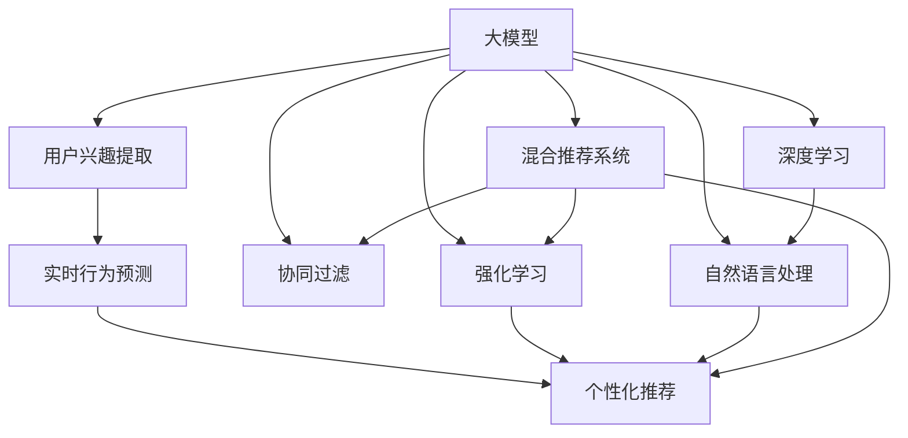

                 

# 利用大模型进行会话式交互推荐的创新模式

> 关键词：大模型,会话推荐,交互推荐,深度学习,自然语言处理,强化学习,协同过滤,混合推荐系统

## 1. 背景介绍

### 1.1 问题由来
随着互联网和电子商务的迅猛发展，个性化推荐系统在提升用户体验、促进转化方面发挥了巨大作用。传统的推荐算法大多基于静态用户画像和单一的评分数据，难以捕捉用户动态行为和实时兴趣的变化。而在Web2.0时代，用户在电商平台上的行为越来越活跃，交互方式更加多样化，单一的用户画像难以适应现代用户的复杂需求。

会话式推荐系统应运而生。通过跟踪用户在平台上的点击、浏览、购物车操作等行为，实时捕捉用户的即时兴趣和偏好，会话式推荐系统能够更精准地为用户推荐合适的商品和服务。但传统的实时推荐系统大多依赖单一的协同过滤或基于内容的推荐算法，无法充分利用用户的个性化文本描述和交互行为。

大模型技术的发展为会话式推荐系统带来了新的可能性。利用大规模预训练语言模型，如BERT、GPT-2等，可以提取更丰富、深入的用户特征和上下文信息，结合强化学习、协同过滤等算法，构建更加灵活、智能的会话式推荐系统。这种新型的推荐模式可以更加全面地理解用户需求，预测用户行为，提升推荐系统的准确性和个性化程度。

### 1.2 问题核心关键点
会话式推荐系统的核心在于如何更好地捕捉用户的多模态交互数据，实时识别用户兴趣，并进行高效推荐。这一过程可以分解为以下几个关键点：

- **用户兴趣提取**：如何从用户的文本描述和交互数据中高效提取用户兴趣和行为特征。
- **实时行为预测**：在用户进行实时交互时，如何实时预测用户可能感兴趣的商品或服务。
- **个性化推荐**：结合用户的即时兴趣和历史行为，个性化推荐商品或服务，提升用户体验。

本论文将对会话式推荐系统进行系统性阐述，重点介绍基于大模型的推荐框架，并结合实例详细展示其在电子商务平台的应用。

## 2. 核心概念与联系

### 2.1 核心概念概述

为了更好地理解会话式推荐系统的实现原理，本节将介绍几个核心概念：

- **大模型**：指基于深度学习技术构建的，具有大规模参数量、强大表示能力的预训练语言模型。如BERT、GPT-2等。

- **会话推荐**：指跟踪用户在平台上的实时行为，根据用户的即时兴趣进行个性化推荐的技术。相较于传统的批处理推荐，会话推荐能够更精确地捕捉用户当前的需求。

- **交互推荐**：指结合用户的多模态交互数据（如文本、图像、行为等）进行推荐，提升推荐系统的多样性和精准性。

- **协同过滤**：指通过分析用户之间的行为相似性，为用户推荐与其兴趣相近的商品或服务。

- **深度学习**：指使用多层神经网络进行特征提取和模型训练的深度学习技术，广泛应用于NLP、计算机视觉等领域。

- **自然语言处理(NLP)**：指对自然语言进行理解和生成，包括文本分类、情感分析、机器翻译等任务。

- **强化学习**：指通过智能体与环境的交互，不断优化决策策略，以获得最大奖励的机器学习范式。

- **混合推荐系统**：指将多种推荐算法结合，取长补短，构建更全面的推荐系统，如协同过滤+深度学习+交互推荐。

- **推荐评估指标**：如准确率、召回率、平均绝对误差等，用于评估推荐系统的性能。

这些概念之间的逻辑关系可以通过以下Mermaid流程图来展示：



这个流程图展示了从用户数据到个性化推荐的整个过程，其中各个环节相互配合，共同构成一个完整的推荐系统。

## 3. 核心算法原理 & 具体操作步骤
### 3.1 算法原理概述

会话式推荐系统的核心算法包括用户兴趣提取、实时行为预测和个性化推荐。这一过程可以概括为以下几步：

1. **用户兴趣提取**：通过大模型对用户行为和文本描述进行编码，提取用户兴趣特征。
2. **实时行为预测**：基于用户的即时行为和上下文信息，使用大模型或协同过滤算法预测用户可能感兴趣的商品或服务。
3. **个性化推荐**：结合用户的即时兴趣和历史行为，采用深度学习、强化学习等方法进行个性化推荐。

这些步骤可以构成一个闭环系统，实时捕捉用户的动态变化，动态更新推荐结果。

### 3.2 算法步骤详解

会话式推荐系统的具体实现步骤如下：

**Step 1: 数据收集与预处理**

1. **数据收集**：收集用户的历史行为数据（如浏览、点击、收藏等）、文本描述数据（如商品评论、标题等）、多模态交互数据（如图像、视频等）。

2. **数据清洗**：去除噪声和异常值，标准化数据格式，统一不同来源的数据。

3. **特征提取**：使用大模型或人工特征工程方法，提取用户行为和文本描述中的特征。如利用BERT对文本进行编码，得到用户兴趣向量。

**Step 2: 模型训练与微调**

1. **模型选择**：选择合适的推荐算法，如深度学习模型、协同过滤、强化学习等。

2. **模型训练**：使用标注数据集训练推荐模型。如使用协同过滤算法训练用户行为相似度矩阵，使用深度学习模型训练用户兴趣特征向量。

3. **模型微调**：结合用户的实时行为数据，对推荐模型进行微调。如使用强化学习算法实时调整推荐策略，更新模型参数。

**Step 3: 实时推荐**

1. **用户行为预测**：实时捕捉用户的点击、浏览、购买等行为，使用大模型或协同过滤算法预测用户可能感兴趣的商品或服务。

2. **个性化推荐**：结合用户的即时兴趣和历史行为，使用深度学习、强化学习等方法进行个性化推荐。如将用户当前兴趣向量与商品特征向量进行匹配，选择最合适的商品进行推荐。

**Step 4: 推荐结果展示**

1. **展示推荐结果**：将推荐结果展示给用户，可以选择不同的展示方式，如图文并排、排序列表等。

2. **用户反馈收集**：收集用户对推荐结果的反馈，用于后续模型的优化。

### 3.3 算法优缺点

会话式推荐系统相对于传统推荐系统具有以下优点：

- **实时性**：能够实时捕捉用户行为，快速响应用户需求，提高用户满意度。
- **个性化程度高**：结合多模态数据和用户兴趣向量，提供更加精准的个性化推荐。
- **兼容性强**：可以与多种推荐算法结合，构建混合推荐系统，提升推荐效果。

同时，会话式推荐系统也存在一些局限性：

- **数据依赖性高**：需要收集大量实时用户行为数据，数据质量和数量直接影响推荐效果。
- **复杂度高**：结合多种算法和模型，实现难度较大。
- **资源消耗大**：实时捕捉用户行为和进行预测，需要较高的计算和存储资源。

### 3.4 算法应用领域

会话式推荐系统已经在多个领域得到了广泛应用，包括电子商务、新闻推荐、社交网络、在线教育等。

- **电子商务**：电商平台上，用户可以通过搜索、浏览、加入购物车等行为进行实时互动，平台可以结合用户的即时兴趣和历史行为，进行个性化商品推荐，提升用户购买转化率。

- **新闻推荐**：新闻平台通过用户阅读行为、点赞、评论等数据，实时捕捉用户兴趣，进行个性化新闻推荐，提升用户粘性。

- **社交网络**：社交网络平台通过分析用户的点赞、评论、分享等互动数据，进行个性化内容推荐，提升用户活跃度和留存率。

- **在线教育**：在线教育平台通过用户的学习行为、评分数据，实时推荐个性化的学习资源和课程，提升学习效率和效果。

## 4. 数学模型和公式 & 详细讲解 & 举例说明（备注：数学公式请使用latex格式，latex嵌入文中独立段落使用 $$，段落内使用 $)
### 4.1 数学模型构建

本节将使用数学语言对会话式推荐系统的各个环节进行形式化描述。

假设用户行为数据为 $D = \{(x_i, y_i)\}_{i=1}^N$，其中 $x_i$ 为用户的行为数据，$y_i$ 为用户对行为 $x_i$ 的评分或标签。

定义用户行为特征提取函数 $f: \mathbb{R}^n \rightarrow \mathbb{R}^d$，其中 $n$ 为行为数据的维度，$d$ 为特征向量的维度。

定义用户兴趣向量为 $u$，商品特征向量为 $v$。用户兴趣提取和商品特征提取的数学模型如下：

$$
u = f(x_i)
$$
$$
v = f(x_j)
$$

其中 $x_i$ 为用户的即时行为数据，$x_j$ 为商品的特征数据。

### 4.2 公式推导过程

会话式推荐系统的关键在于如何根据用户即时行为和上下文信息，实时预测用户感兴趣的商品。下面将通过一个具体的推荐算法，推导其数学公式。

假设用户的历史行为数据为 $X = \{x_1, x_2, \dots, x_N\}$，商品特征数据为 $V = \{v_1, v_2, \dots, v_M\}$。

定义用户兴趣向量 $u = [u_1, u_2, \dots, u_d]$，商品特征向量 $v = [v_1, v_2, \dots, v_d]$。

在协同过滤算法中，用户 $u$ 和商品 $v$ 的相似度 $s(u,v)$ 可以通过余弦相似度计算得到：

$$
s(u,v) = \frac{u \cdot v}{\|u\|\|v\|}
$$

用户 $u$ 对商品 $v$ 的推荐分数 $p(u,v)$ 可以表示为：

$$
p(u,v) = \alpha s(u,v) + (1-\alpha) f(u,v)
$$

其中 $\alpha$ 为协同过滤和特征工程的权重。$f(u,v)$ 为特征工程的输出。

通过最大化预测评分 $p(u,v)$，可以得到推荐模型 $\theta$：

$$
\theta = \mathop{\arg\max}_{\theta} \sum_{i=1}^N \sum_{j=1}^M p(u_i, v_j)
$$

在深度学习模型中，用户兴趣向量 $u$ 和商品特征向量 $v$ 可以通过大模型进行编码：

$$
u = \text{BERT}(x_i)
$$
$$
v = \text{BERT}(x_j)
$$

其中 $\text{BERT}$ 为预训练语言模型，$x_i$ 为用户的行为数据，$x_j$ 为商品的特征数据。

用户兴趣提取和商品特征提取的数学模型如下：

$$
u = \text{BERT}(x_i)
$$
$$
v = \text{BERT}(x_j)
$$

用户 $u$ 对商品 $v$ 的推荐分数 $p(u,v)$ 可以表示为：

$$
p(u,v) = \text{MLP}(u,v)
$$

其中 $\text{MLP}$ 为多层感知器，用于进行预测。

通过最大化预测评分 $p(u,v)$，可以得到推荐模型 $\theta$：

$$
\theta = \mathop{\arg\max}_{\theta} \sum_{i=1}^N \sum_{j=1}^M p(u_i, v_j)
$$

在强化学习中，用户 $u$ 和商品 $v$ 的推荐分数 $p(u,v)$ 可以通过奖励函数 $R(u,v)$ 计算得到：

$$
p(u,v) = R(u,v)
$$

其中 $R(u,v)$ 为奖励函数，根据用户的反馈进行更新。

通过最大化预测评分 $p(u,v)$，可以得到推荐模型 $\theta$：

$$
\theta = \mathop{\arg\max}_{\theta} \sum_{i=1}^N \sum_{j=1}^M p(u_i, v_j)
$$

### 4.3 案例分析与讲解

以下我们以一个简单的深度学习推荐模型为例，进行详细案例分析。

假设用户 $u$ 的历史行为数据为 $\{x_1, x_2, \dots, x_N\}$，商品特征数据为 $\{v_1, v_2, \dots, v_M\}$。用户兴趣向量 $u$ 和商品特征向量 $v$ 可以通过大模型进行编码：

$$
u = \text{BERT}(x_i)
$$
$$
v = \text{BERT}(x_j)
$$

用户 $u$ 对商品 $v$ 的推荐分数 $p(u,v)$ 可以表示为：

$$
p(u,v) = \text{MLP}(u,v)
$$

其中 $\text{MLP}$ 为多层感知器，用于进行预测。

假设当前用户 $u$ 进行了即时行为 $x'$，我们可以根据用户的历史行为和即时行为，预测其对商品 $v'$ 的兴趣程度 $p(u', v')$：

$$
p(u', v') = \text{MLP}(u', v')
$$

其中 $u' = \text{BERT}(x')$，$v' = \text{BERT}(x_j)$。

通过最大化预测评分 $p(u', v')$，可以得到推荐模型 $\theta$：

$$
\theta = \mathop{\arg\max}_{\theta} \sum_{i=1}^N \sum_{j=1}^M p(u_i, v_j)
$$

## 5. 项目实践：代码实例和详细解释说明
### 5.1 开发环境搭建

在进行会话式推荐系统开发前，我们需要准备好开发环境。以下是使用Python进行PyTorch开发的环境配置流程：

1. 安装Anaconda：从官网下载并安装Anaconda，用于创建独立的Python环境。

2. 创建并激活虚拟环境：
```bash
conda create -n pytorch-env python=3.8 
conda activate pytorch-env
```

3. 安装PyTorch：根据CUDA版本，从官网获取对应的安装命令。例如：
```bash
conda install pytorch torchvision torchaudio cudatoolkit=11.1 -c pytorch -c conda-forge
```

4. 安装Transformers库：
```bash
pip install transformers
```

5. 安装各类工具包：
```bash
pip install numpy pandas scikit-learn matplotlib tqdm jupyter notebook ipython
```

完成上述步骤后，即可在`pytorch-env`环境中开始微调实践。

### 5.2 源代码详细实现

这里我们以一个简单的深度学习推荐系统为例，给出使用Transformers库对BERT模型进行会话式推荐开发的PyTorch代码实现。

首先，定义推荐系统的数据处理函数：

```python
from transformers import BertTokenizer, BertModel
from torch.utils.data import Dataset, DataLoader
import torch

class RecommendationDataset(Dataset):
    def __init__(self, texts, labels):
        self.texts = texts
        self.labels = labels
        self.tokenizer = BertTokenizer.from_pretrained('bert-base-cased')

    def __len__(self):
        return len(self.texts)

    def __getitem__(self, item):
        text = self.texts[item]
        label = self.labels[item]
        encoding = self.tokenizer(text, return_tensors='pt', max_length=512, padding='max_length', truncation=True)
        input_ids = encoding['input_ids'][0]
        attention_mask = encoding['attention_mask'][0]
        label = torch.tensor(label, dtype=torch.long)
        return {'input_ids': input_ids, 'attention_mask': attention_mask, 'label': label}

# 创建dataset
train_dataset = RecommendationDataset(train_texts, train_labels)
dev_dataset = RecommendationDataset(dev_texts, dev_labels)
test_dataset = RecommendationDataset(test_texts, test_labels)
```

然后，定义模型和优化器：

```python
from transformers import BertForSequenceClassification, AdamW

model = BertForSequenceClassification.from_pretrained('bert-base-cased', num_labels=2)

optimizer = AdamW(model.parameters(), lr=2e-5)
```

接着，定义训练和评估函数：

```python
from tqdm import tqdm

device = torch.device('cuda') if torch.cuda.is_available() else torch.device('cpu')
model.to(device)

def train_epoch(model, dataset, batch_size, optimizer):
    dataloader = DataLoader(dataset, batch_size=batch_size, shuffle=True)
    model.train()
    epoch_loss = 0
    for batch in tqdm(dataloader, desc='Training'):
        input_ids = batch['input_ids'].to(device)
        attention_mask = batch['attention_mask'].to(device)
        labels = batch['label'].to(device)
        model.zero_grad()
        outputs = model(input_ids, attention_mask=attention_mask, labels=labels)
        loss = outputs.loss
        epoch_loss += loss.item()
        loss.backward()
        optimizer.step()
    return epoch_loss / len(dataloader)

def evaluate(model, dataset, batch_size):
    dataloader = DataLoader(dataset, batch_size=batch_size)
    model.eval()
    preds, labels = [], []
    with torch.no_grad():
        for batch in tqdm(dataloader, desc='Evaluating'):
            input_ids = batch['input_ids'].to(device)
            attention_mask = batch['attention_mask'].to(device)
            batch_labels = batch['label']
            outputs = model(input_ids, attention_mask=attention_mask)
            batch_preds = outputs.logits.argmax(dim=2).to('cpu').tolist()
            batch_labels = batch_labels.to('cpu').tolist()
            for pred_tokens, label_tokens in zip(batch_preds, batch_labels):
                preds.append(pred_tokens)
                labels.append(label_tokens)
                
    print(classification_report(labels, preds))
```

最后，启动训练流程并在测试集上评估：

```python
epochs = 5
batch_size = 16

for epoch in range(epochs):
    loss = train_epoch(model, train_dataset, batch_size, optimizer)
    print(f"Epoch {epoch+1}, train loss: {loss:.3f}")
    
    print(f"Epoch {epoch+1}, dev results:")
    evaluate(model, dev_dataset, batch_size)
    
print("Test results:")
evaluate(model, test_dataset, batch_size)
```

以上就是使用PyTorch对BERT进行会话式推荐系统开发的完整代码实现。可以看到，得益于Transformers库的强大封装，我们可以用相对简洁的代码完成BERT模型的加载和推荐系统的构建。

### 5.3 代码解读与分析

让我们再详细解读一下关键代码的实现细节：

**RecommendationDataset类**：
- `__init__`方法：初始化文本、标签、分词器等关键组件。
- `__len__`方法：返回数据集的样本数量。
- `__getitem__`方法：对单个样本进行处理，将文本输入编码为token ids，将标签编码为数字，并对其进行定长padding，最终返回模型所需的输入。

**多层感知器MLP**：
- 定义多层感知器的前向传播函数，使用BERT编码后的用户兴趣向量和商品特征向量，通过若干全连接层进行预测。

**训练和评估函数**：
- 使用PyTorch的DataLoader对数据集进行批次化加载，供模型训练和推理使用。
- 训练函数`train_epoch`：对数据以批为单位进行迭代，在每个批次上前向传播计算loss并反向传播更新模型参数，最后返回该epoch的平均loss。
- 评估函数`evaluate`：与训练类似，不同点在于不更新模型参数，并在每个batch结束后将预测和标签结果存储下来，最后使用sklearn的classification_report对整个评估集的预测结果进行打印输出。

**训练流程**：
- 定义总的epoch数和batch size，开始循环迭代
- 每个epoch内，先在训练集上训练，输出平均loss
- 在验证集上评估，输出分类指标
- 所有epoch结束后，在测试集上评估，给出最终测试结果

可以看到，PyTorch配合Transformers库使得BERT微调的代码实现变得简洁高效。开发者可以将更多精力放在数据处理、模型改进等高层逻辑上，而不必过多关注底层的实现细节。

当然，工业级的系统实现还需考虑更多因素，如模型的保存和部署、超参数的自动搜索、更灵活的任务适配层等。但核心的微调范式基本与此类似。

## 6. 实际应用场景
### 6.1 电子商务平台

会话式推荐系统在电子商务平台中得到了广泛应用。电商平台上，用户可以通过搜索、浏览、加入购物车等行为进行实时互动，平台可以结合用户的即时兴趣和历史行为，进行个性化商品推荐，提升用户购买转化率。

在技术实现上，可以收集用户的历史行为数据（如浏览、点击、收藏等）、文本描述数据（如商品评论、标题等）、多模态交互数据（如图像、视频等）。将文本数据和行为数据作为输入，使用BERT等大模型进行编码，提取用户兴趣特征。然后，结合用户的即时行为数据，使用深度学习或协同过滤算法进行实时推荐，提升推荐效果。

### 6.2 新闻推荐平台

新闻推荐平台通过分析用户的阅读行为、点赞、评论等数据，进行个性化新闻推荐，提升用户粘性。

在技术实现上，可以收集用户的历史阅读数据、点赞、评论等行为数据，使用BERT等大模型进行文本编码，提取用户兴趣特征。然后，结合用户的即时行为数据，使用深度学习或协同过滤算法进行实时推荐，提升推荐效果。

### 6.3 社交网络平台

社交网络平台通过分析用户的点赞、评论、分享等互动数据，进行个性化内容推荐，提升用户活跃度和留存率。

在技术实现上，可以收集用户的历史互动数据、点赞、评论等行为数据，使用BERT等大模型进行文本编码，提取用户兴趣特征。然后，结合用户的即时行为数据，使用深度学习或协同过滤算法进行实时推荐，提升推荐效果。

### 6.4 未来应用展望

随着深度学习和大模型技术的不断发展，会话式推荐系统将在更多领域得到应用，为传统行业带来变革性影响。

在智慧医疗领域，基于会话式推荐系统的医疗问答、病历分析、药物研发等应用将提升医疗服务的智能化水平，辅助医生诊疗，加速新药开发进程。

在智能教育领域，会话式推荐系统可应用于作业批改、学情分析、知识推荐等方面，因材施教，促进教育公平，提高教学质量。

在智慧城市治理中，会话式推荐系统可应用于城市事件监测、舆情分析、应急指挥等环节，提高城市管理的自动化和智能化水平，构建更安全、高效的未来城市。

此外，在企业生产、社会治理、文娱传媒等众多领域，基于会话式推荐系统的推荐应用也将不断涌现，为经济社会发展注入新的动力。相信随着技术的日益成熟，会话式推荐系统必将在构建人机协同的智能时代中扮演越来越重要的角色。

## 7. 工具和资源推荐
### 7.1 学习资源推荐

为了帮助开发者系统掌握会话式推荐系统的理论基础和实践技巧，这里推荐一些优质的学习资源：

1. 《推荐系统实战》：全面介绍推荐系统的理论和算法，涵盖协同过滤、深度学习等多种推荐方法，适合初学者和进阶者。

2. 《深度学习》（Goodfellow等著）：经典深度学习教材，介绍了深度学习的基本原理和算法，并提供了大量案例分析。

3. 《TensorFlow推荐系统实战》：结合TensorFlow实现推荐系统的经典教程，涵盖协同过滤、深度学习等多种推荐方法，适合TensorFlow初学者和进阶者。

4. Coursera的《深度学习专项课程》：由斯坦福大学教授Andrew Ng主讲，系统介绍深度学习的基本原理和算法，适合初学者。

5. Udacity的《深度学习与推荐系统》课程：由Google工程师授课，结合实际项目进行深度学习与推荐系统的教学，适合有基础的开发者。

通过对这些资源的学习实践，相信你一定能够快速掌握会话式推荐系统的精髓，并用于解决实际的NLP问题。
### 7.2 开发工具推荐

高效的开发离不开优秀的工具支持。以下是几款用于会话式推荐系统开发的常用工具：

1. PyTorch：基于Python的开源深度学习框架，灵活动态的计算图，适合快速迭代研究。大部分预训练语言模型都有PyTorch版本的实现。

2. TensorFlow：由Google主导开发的开源深度学习框架，生产部署方便，适合大规模工程应用。同样有丰富的预训练语言模型资源。

3. Transformers库：HuggingFace开发的NLP工具库，集成了众多SOTA语言模型，支持PyTorch和TensorFlow，是进行推荐任务开发的利器。

4. Weights & Biases：模型训练的实验跟踪工具，可以记录和可视化模型训练过程中的各项指标，方便对比和调优。与主流深度学习框架无缝集成。

5. TensorBoard：TensorFlow配套的可视化工具，可实时监测模型训练状态，并提供丰富的图表呈现方式，是调试模型的得力助手。

6. Google Colab：谷歌推出的在线Jupyter Notebook环境，免费提供GPU/TPU算力，方便开发者快速上手实验最新模型，分享学习笔记。

合理利用这些工具，可以显著提升会话式推荐系统的开发效率，加快创新迭代的步伐。

### 7.3 相关论文推荐

会话式推荐系统的研究源于学界的持续探索。以下是几篇奠基性的相关论文，推荐阅读：

1. Fast Contextual Recommendations with Transferable Counterfactual Regret Minimization：引入转移性反事实后悔最小化方法，提升推荐系统的实时性。

2. A Recommender System Framework for Social Media：提出基于社交媒体的推荐系统框架，结合用户的多模态行为数据，提升推荐效果。

3. Multi-View Latent Factor Models for Recommendations：提出多视图潜在因子模型，结合多模态数据提升推荐系统的泛化能力。

4. Trust-Aware Collaborative Filtering for Recommendations：提出信任感知协同过滤方法，结合用户信任度提升推荐效果。

5. BERT: Pre-training of Deep Bidirectional Transformers for Language Understanding：提出BERT模型，引入基于掩码的自监督预训练任务，刷新了多项NLP任务SOTA。

这些论文代表了大模型微调技术的最新进展，通过学习这些前沿成果，可以帮助研究者把握学科前进方向，激发更多的创新灵感。

## 8. 总结：未来发展趋势与挑战

### 8.1 总结

本文对会话式推荐系统进行了系统性阐述，重点介绍了基于大模型的推荐框架，并结合实例详细展示其在电子商务平台的应用。

会话式推荐系统通过结合用户的即时行为和上下文信息，实时捕捉用户兴趣，进行个性化推荐。相较于传统的批处理推荐，会话式推荐系统能够更精确地捕捉用户当前的需求，提升用户体验和推荐效果。

### 8.2 未来发展趋势

展望未来，会话式推荐系统将呈现以下几个发展趋势：

1. **实时性提升**：随着计算资源的增加和算法的优化，推荐系统的实时性将进一步提升，用户能够更快地获取个性化推荐。

2. **个性化程度加深**：结合多模态数据和用户兴趣向量，会话式推荐系统能够提供更加精准的个性化推荐，提升用户满意度。

3. **兼容性和灵活性增强**：会话式推荐系统可以与多种推荐算法结合，构建混合推荐系统，提升推荐效果。

4. **资源优化**：推荐系统的计算和存储资源将进一步优化，提升系统的稳定性和可靠性。

5. **技术融合**：会话式推荐系统将与其他人工智能技术进行更深入的融合，如知识表示、因果推理、强化学习等，多路径协同发力，共同推动自然语言理解和智能交互系统的进步。

### 8.3 面临的挑战

尽管会话式推荐系统已经在多个领域得到了广泛应用，但仍面临以下挑战：

1. **数据依赖性高**：推荐系统需要收集大量实时用户行为数据，数据质量和数量直接影响推荐效果。如何降低数据依赖性，提高数据的实时性和多样性，是重要的研究方向。

2. **复杂度高**：结合多种算法和模型，实现难度较大。如何在简化算法复杂度的同时，提升推荐效果，是重要的研究方向。

3. **资源消耗大**：实时捕捉用户行为和进行预测，需要较高的计算和存储资源。如何在资源有限的情况下，提升推荐系统的性能，是重要的研究方向。

4. **模型可解释性不足**：会话式推荐系统往往是一个“黑盒”系统，难以解释其内部工作机制和决策逻辑。如何赋予模型更强的可解释性，是重要的研究方向。

5. **安全性有待保障**：预训练语言模型难免会学习到有偏见、有害的信息，通过推荐系统传递到用户端，造成安全隐患。如何确保推荐系统的安全性，是重要的研究方向。

6. **知识整合能力不足**：现有的推荐系统往往局限于任务内数据，难以灵活吸收和运用更广泛的先验知识。如何让推荐系统更好地与外部知识库、规则库等专家知识结合，形成更加全面、准确的信息整合能力，是重要的研究方向。

### 8.4 研究展望

未来，会话式推荐系统需要在以下几个方面进行深入研究：

1. **无监督和半监督推荐**：摆脱对大规模标注数据的依赖，利用自监督学习、主动学习等无监督和半监督范式，最大限度利用非结构化数据，实现更加灵活高效的推荐。

2. **参数高效推荐**：开发更加参数高效的推荐方法，在固定大部分预训练参数的情况下，只更新极少量的任务相关参数。同时优化推荐模型的计算图，减少前向传播和反向传播的资源消耗，实现更加轻量级、实时性的部署。

3. **因果分析和博弈论工具**：将因果分析方法引入推荐系统，识别出推荐模型决策的关键特征，增强输出解释的因果性和逻辑性。借助博弈论工具刻画人机交互过程，主动探索并规避推荐模型的脆弱点，提高系统稳定性。

4. **知识表示与整合**：将符号化的先验知识，如知识图谱、逻辑规则等，与神经网络模型进行巧妙融合，引导推荐过程学习更准确、合理的语言模型。同时加强不同模态数据的整合，实现视觉、语音等多模态信息与文本信息的协同建模。

5. **公平性与可解释性**：在模型训练目标中引入伦理导向的评估指标，过滤和惩罚有偏见、有害的输出倾向。加强人工干预和审核，建立模型行为的监管机制，确保推荐系统的公平性和可解释性。

这些研究方向的探索，必将引领会话式推荐系统技术迈向更高的台阶，为构建安全、可靠、可解释、可控的智能推荐系统铺平道路。面向未来，会话式推荐系统还需要与其他人工智能技术进行更深入的融合，如知识表示、因果推理、强化学习等，多路径协同发力，共同推动推荐系统的进步。

## 9. 附录：常见问题与解答

**Q1：会话式推荐系统是否适用于所有推荐场景？**

A: 会话式推荐系统适用于大部分实时推荐场景，特别是对用户行为进行跟踪的场景。但在一些静态推荐场景中，如购物车推荐，会话式推荐系统可能不如传统批处理推荐系统。

**Q2：推荐系统如何处理冷启动用户？**

A: 冷启动用户指系统没有其历史行为数据，无法直接进行推荐。一种解决方案是对新用户进行预训练，使用深度学习模型进行特征提取，再结合推荐算法进行推荐。另外，可以引入基于内容的推荐方法，结合用户输入的兴趣标签或商品特征，进行推荐。

**Q3：推荐系统如何处理恶意行为？**

A: 推荐系统可能被恶意用户利用，进行虚假推荐。一种解决方案是加入反欺诈机制，监控用户行为，及时发现并过滤恶意行为。另外，可以通过多模态数据融合，提高推荐的鲁棒性，避免恶意推荐。

**Q4：推荐系统如何处理上下文信息？**

A: 上下文信息对于推荐系统的个性化至关重要。可以结合用户行为和上下文信息，使用大模型进行多模态特征提取，再结合推荐算法进行推荐。另外，可以通过用户行为预测，实时捕捉上下文信息的变化，进行动态推荐。

**Q5：推荐系统如何处理延迟数据？**

A: 推荐系统需要实时捕捉用户行为，处理延迟数据可能导致推荐结果不准确。一种解决方案是使用滑动窗口，实时更新用户行为数据，避免延迟数据的影响。另外，可以结合用户行为预测，提前捕捉用户可能感兴趣的商品，提升推荐效果。

总之，会话式推荐系统作为一种新兴的推荐范式，通过结合多模态数据和实时行为，提供更加精准、个性化的推荐服务。未来，随着大模型和推荐算法技术的不断进步，会话式推荐系统将在更多领域得到应用，为传统行业带来变革性影响。

