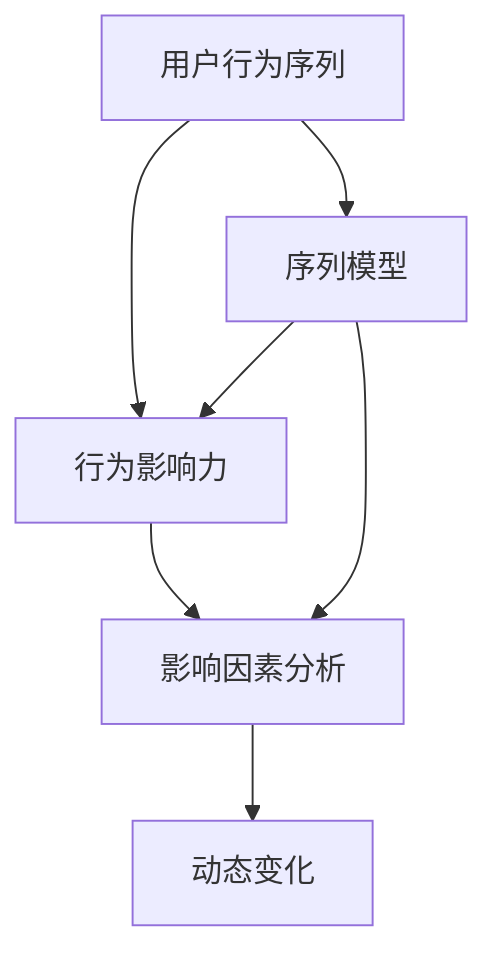

                 

# 利用大模型进行推荐场景的用户行为影响力分析

> 关键词：大语言模型,推荐系统,用户行为,影响力分析,序列模型,协同过滤,深度学习

## 1. 背景介绍

### 1.1 问题由来
推荐系统是当今互联网时代的重要技术，广泛应用于电商、社交、视频等多个领域，旨在提升用户体验，满足其个性化需求。推荐算法的主要任务是从用户的历史行为数据中学习其兴趣偏好，并预测用户对未交互商品/内容的偏好程度。然而，推荐系统的预测准确度往往受限于用户数据的多样性和完备性，难以充分刻画用户真正的兴趣偏好，导致推荐结果偏差较大，无法满足部分用户的需求。

为了更好地了解用户行为的影响因素，需要构建更加精准、全面的用户行为影响力分析模型，从而更准确地预测用户兴趣。传统的用户行为分析方法如协同过滤、基于内容的推荐等，难以充分考虑用户行为之间的序列关系和动态变化。近年来，深度学习和自然语言处理技术的发展，为推荐系统中的用户行为影响力分析提供了新的视角和方法。

### 1.2 问题核心关键点
用户行为的影响力分析是指对用户历史行为数据进行建模，评估各行为对后续行为的影响程度，从而提供更精准的推荐。本节将从以下几个关键点介绍影响力分析的核心概念：

1. **用户行为序列**：用户的行为序列通常由点击、购买、评分、收藏等行为构成。不同行为之间存在关联，需要考虑序列中前后行为的交互效应。
2. **行为影响力**：不同行为对用户后续行为的影响程度不同，需要通过建模评估。
3. **影响因素分析**：分析影响行为影响力的因素，如用户特征、时间间隔、行为类型等。
4. **动态变化**：用户的兴趣偏好随时间变化，需要考虑动态行为数据的建模。

本问题研究的核心是：如何利用大语言模型（如BERT、GPT等）分析用户行为序列，评估各行为的影响力，从而构建用户行为影响力分析模型。

### 1.3 问题研究意义
用户行为影响力分析能够提升推荐系统的准确性和鲁棒性，具体意义如下：

1. **提高推荐效果**：准确评估用户行为的影响力，可以更精准地预测用户兴趣，从而提供更符合用户需求的推荐。
2. **增强系统稳定性**：考虑到用户行为动态变化的特性，分析模型能更好地适应用户兴趣的变化，避免推荐偏差。
3. **优化用户体验**：结合影响力分析，推荐系统能更及时、更准确地响应用户需求，提升用户满意度。
4. **推动业务发展**：通过精准推荐，提升用户转化率和留存率，增加平台收入。

## 2. 核心概念与联系

### 2.1 核心概念概述

用户行为影响力分析是指通过建模用户行为序列，评估各行为对后续行为的影响程度，从而预测用户兴趣。本节将介绍几个关键概念及其相互联系：

- **用户行为序列**：用户的行为序列通常由点击、购买、评分、收藏等行为构成。不同行为之间存在关联，需要考虑序列中前后行为的交互效应。
- **行为影响力**：不同行为对用户后续行为的影响程度不同，需要通过建模评估。
- **影响因素分析**：分析影响行为影响力的因素，如用户特征、时间间隔、行为类型等。
- **动态变化**：用户的兴趣偏好随时间变化，需要考虑动态行为数据的建模。

这些概念之间的逻辑关系可以通过以下Mermaid流程图来展示：



这个流程图展示了用户行为影响力分析的主要环节：

1. 用户行为序列：收集用户历史行为数据，构建行为序列。
2. 行为影响力：建模用户行为序列，评估各行为对后续行为的影响程度。
3. 影响因素分析：分析影响行为影响力的因素，如用户特征、时间间隔、行为类型等。
4. 动态变化：考虑动态行为数据的建模，增强模型的鲁棒性。

## 3. 核心算法原理 & 具体操作步骤

### 3.1 算法原理概述

用户行为影响力分析的核心算法为基于深度学习的序列模型。该模型通过学习用户行为序列的特征表示，评估各行为对后续行为的影响程度，从而预测用户兴趣。其原理可以概括为以下几个步骤：

1. **数据预处理**：将用户行为序列转换为数字序列，并进行标准化处理。
2. **特征提取**：利用深度学习模型（如RNN、GRU、LSTM等）提取用户行为序列的特征表示。
3. **行为影响力建模**：通过回归或分类算法，评估各行为对后续行为的影响程度。
4. **影响因素分析**：通过特征选择和调参，分析影响行为影响力的因素。
5. **动态变化分析**：考虑动态行为数据的建模，增强模型的鲁棒性。

### 3.2 算法步骤详解

基于深度学习的用户行为影响力分析，一般包括以下几个关键步骤：

**Step 1: 数据预处理**
- 收集用户历史行为数据，构建行为序列。
- 将行为序列转换为数字序列，并进行标准化处理。

**Step 2: 特征提取**
- 利用深度学习模型（如RNN、GRU、LSTM等）提取用户行为序列的特征表示。

**Step 3: 行为影响力建模**
- 通过回归或分类算法，评估各行为对后续行为的影响程度。
- 使用正则化技术（如L2正则、Dropout）防止模型过拟合。

**Step 4: 影响因素分析**
- 通过特征选择和调参，分析影响行为影响力的因素。
- 选择对行为影响力有显著影响的特征，进行重要性排序。

**Step 5: 动态变化分析**
- 考虑动态行为数据的建模，引入时间间隔、时间序列等特征。
- 结合历史数据和实时数据，增强模型的鲁棒性。

### 3.3 算法优缺点

基于深度学习的用户行为影响力分析方法，具有以下优点：

1. 模型自适应性强：深度学习模型能够自适应地学习用户行为序列的特征表示，适用于各种复杂场景。
2. 建模精度高：利用神经网络模型，能够准确评估各行为对后续行为的影响程度。
3. 可解释性强：通过特征选择和调参，可以分析影响行为影响力的因素，提供有意义的模型解释。
4. 动态适应能力强：结合动态行为数据，能够实时适应用户兴趣的变化，提高模型鲁棒性。

同时，该方法也存在一定的局限性：

1. 数据需求量大：深度学习模型需要大量的训练数据，适用于标注数据量较大的场景。
2. 计算资源消耗高：深度学习模型参数较多，训练和推理计算资源消耗较大。
3. 模型复杂度高：模型结构较为复杂，调参过程较为繁琐，需要一定的专业技能。
4. 结果解释困难：深度学习模型的黑盒特性，导致结果解释较为困难。

尽管存在这些局限性，但就目前而言，基于深度学习的用户行为影响力分析方法仍是最主流范式。未来相关研究的重点在于如何进一步降低模型对数据的依赖，提高模型的可解释性，以及优化计算资源消耗等方向。

### 3.4 算法应用领域

基于深度学习的用户行为影响力分析方法，已经在推荐系统、广告投放、金融风险控制等多个领域得到广泛应用。具体应用如下：

1. **推荐系统**：通过用户行为影响力分析，构建更加精准的用户兴趣模型，提升推荐效果。
2. **广告投放**：通过用户行为序列分析，评估各行为对广告点击的影响，优化广告投放策略。
3. **金融风险控制**：利用用户行为序列建模，评估用户行为异常情况，控制金融风险。
4. **智能客服**：通过用户行为分析，提供更加个性化和智能的客户服务。
5. **智能推荐**：结合用户行为影响力分析，提供个性化的商品推荐。

除了上述这些经典应用外，用户行为影响力分析还在更多场景中得到创新性应用，如智能推荐、个性化推荐、智能广告等，为推荐系统的发展提供了新的动力。

## 4. 数学模型和公式 & 详细讲解 & 举例说明

### 4.1 数学模型构建

本节将使用数学语言对基于深度学习的用户行为影响力分析过程进行更加严格的刻画。

记用户行为序列为 $\{x_t\}_{t=1}^T$，其中 $x_t$ 为第 $t$ 次行为。设 $y_t$ 为第 $t$ 次行为的反馈信息（如点击次数、评分、转化率等）。

定义用户行为序列的特征表示为 $h_t=f(x_t,h_{t-1})$，其中 $f$ 为特征提取函数，$h_{t-1}$ 为前 $t-1$ 次行为的特征表示。

基于深度学习的用户行为影响力分析模型，可以表示为：

$$
\hat{y}_t=\sigma(g(h_t;w))^T\hat{y}_{t-1}+b
$$

其中 $\hat{y}_t$ 为预测的 $t$ 次行为的反馈信息，$g$ 为影响力函数，$w$ 为模型参数，$\sigma$ 为激活函数。

### 4.2 公式推导过程

以点击率预测为例，推导点击率预测模型的影响力函数。

假设用户历史行为序列为 $\{x_t\}_{t=1}^T$，设 $y_t=I(x_t)$，其中 $I$ 为指示函数。

定义用户行为序列的特征表示为 $h_t=f(x_t,h_{t-1})$，其中 $f$ 为特征提取函数，$h_{t-1}$ 为前 $t-1$ 次行为的特征表示。

基于深度学习的用户行为影响力分析模型可以表示为：

$$
\hat{y}_t=\sigma(g(h_t;w))^T\hat{y}_{t-1}+b
$$

其中 $\hat{y}_t$ 为预测的 $t$ 次行为的点击率，$g$ 为影响力函数，$w$ 为模型参数，$\sigma$ 为激活函数。

在实际应用中，通常采用LSTM等递归神经网络（RNN）来提取用户行为序列的特征表示，因此影响力函数 $g$ 可以表示为：

$$
g(h_t;w)=w_0 h_t+w_1 h_{t-1}
$$

其中 $w_0$ 和 $w_1$ 为模型参数，$h_t$ 为第 $t$ 次行为的特征表示，$h_{t-1}$ 为前 $t-1$ 次行为的特征表示。

结合上式，影响力函数 $g$ 可以表示为：

$$
g(h_t;w)=w_0 [f(x_t,h_{t-1})]+w_1 h_{t-1}
$$

进一步，影响力函数 $g$ 可以表示为：

$$
g(h_t;w)=w_0 \cdot f(x_t,h_{t-1})+w_1 h_{t-1}
$$

其中 $w_0$ 和 $w_1$ 为模型参数，$f$ 为特征提取函数，$h_t$ 为第 $t$ 次行为的特征表示，$h_{t-1}$ 为前 $t-1$ 次行为的特征表示。

### 4.3 案例分析与讲解

以下是一个简单的点击率预测模型的案例分析：

假设用户历史行为序列为 $\{x_t\}_{t=1}^T$，其中 $x_t$ 为第 $t$ 次点击，$y_t=I(x_t)$ 为第 $t$ 次点击的反馈信息。

定义用户行为序列的特征表示为 $h_t=f(x_t,h_{t-1})$，其中 $f$ 为特征提取函数，$h_{t-1}$ 为前 $t-1$ 次行为的特征表示。

基于深度学习的用户行为影响力分析模型可以表示为：

$$
\hat{y}_t=\sigma(g(h_t;w))^T\hat{y}_{t-1}+b
$$

其中 $\hat{y}_t$ 为预测的 $t$ 次点击的点击率，$g$ 为影响力函数，$w$ 为模型参数，$\sigma$ 为激活函数。

在实际应用中，通常采用LSTM等递归神经网络（RNN）来提取用户行为序列的特征表示，因此影响力函数 $g$ 可以表示为：

$$
g(h_t;w)=w_0 [f(x_t,h_{t-1})]+w_1 h_{t-1}
$$

其中 $w_0$ 和 $w_1$ 为模型参数，$f$ 为特征提取函数，$h_t$ 为第 $t$ 次点击的特征表示，$h_{t-1}$ 为前 $t-1$ 次点击的特征表示。

在模型训练时，可以使用交叉熵损失函数：

$$
L=\frac{1}{N}\sum_{t=1}^N [y_t \log \hat{y}_t + (1-y_t) \log (1-\hat{y}_t)]
$$

其中 $N$ 为样本数，$y_t$ 为第 $t$ 次点击的反馈信息，$\hat{y}_t$ 为模型预测的点击率。

## 5. 项目实践：代码实例和详细解释说明

### 5.1 开发环境搭建

在进行用户行为影响力分析实践前，我们需要准备好开发环境。以下是使用Python进行PyTorch开发的环境配置流程：

1. 安装Anaconda：从官网下载并安装Anaconda，用于创建独立的Python环境。

2. 创建并激活虚拟环境：
```bash
conda create -n pytorch-env python=3.8 
conda activate pytorch-env
```

3. 安装PyTorch：根据CUDA版本，从官网获取对应的安装命令。例如：
```bash
conda install pytorch torchvision torchaudio cudatoolkit=11.1 -c pytorch -c conda-forge
```

4. 安装TensorFlow：
```bash
pip install tensorflow
```

5. 安装各类工具包：
```bash
pip install numpy pandas scikit-learn matplotlib tqdm jupyter notebook ipython
```

完成上述步骤后，即可在`pytorch-env`环境中开始用户行为影响力分析实践。

### 5.2 源代码详细实现

下面我们以点击率预测为例，给出使用PyTorch和TensorFlow进行用户行为影响力分析的代码实现。

首先，定义点击率预测的数据处理函数：

```python
from torch.utils.data import Dataset
import numpy as np
import torch

class ClickDataset(Dataset):
    def __init__(self, clicks, labels):
        self.clicks = clicks
        self.labels = labels
        
    def __len__(self):
        return len(self.clicks)
    
    def __getitem__(self, item):
        click = self.clicks[item]
        label = self.labels[item]
        return {'click': click, 'label': label}
```

然后，定义模型和优化器：

```python
from torch import nn
from torch.nn import functional as F

class ClickPredictor(nn.Module):
    def __init__(self, input_size, hidden_size, output_size):
        super(ClickPredictor, self).__init__()
        self.lstm = nn.LSTM(input_size, hidden_size, 2)
        self.fc = nn.Linear(hidden_size, output_size)
        
    def forward(self, x):
        batch_size = x.size(0)
        hidden_init = (torch.zeros(2, batch_size, self.hidden_size), torch.zeros(2, batch_size, self.hidden_size))
        lstm_out, _ = self.lstm(x.view(batch_size, -1), hidden_init)
        out = self.fc(lstm_out[-1])
        return F.sigmoid(out)
    
model = ClickPredictor(input_size=1, hidden_size=128, output_size=1)

optimizer = torch.optim.Adam(model.parameters(), lr=0.001)
```

接着，定义训练和评估函数：

```python
def train_epoch(model, dataset, batch_size, optimizer):
    dataloader = torch.utils.data.DataLoader(dataset, batch_size=batch_size, shuffle=True)
    model.train()
    epoch_loss = 0
    for batch in dataloader:
        x = batch['click']
        y = batch['label']
        model.zero_grad()
        y_pred = model(x)
        loss = F.binary_cross_entropy(y_pred, y)
        epoch_loss += loss.item()
        loss.backward()
        optimizer.step()
    return epoch_loss / len(dataloader)

def evaluate(model, dataset, batch_size):
    dataloader = torch.utils.data.DataLoader(dataset, batch_size=batch_size)
    model.eval()
    correct = 0
    total = 0
    with torch.no_grad():
        for batch in dataloader:
            x = batch['click']
            y = batch['label']
            y_pred = model(x)
            pred = (y_pred > 0).float()
            correct += torch.sum(pred == y).item()
            total += y.size(0)
    print('Accuracy: ', correct/total)
```

最后，启动训练流程并在测试集上评估：

```python
epochs = 10
batch_size = 32

for epoch in range(epochs):
    loss = train_epoch(model, click_dataset, batch_size, optimizer)
    print(f"Epoch {epoch+1}, train loss: {loss:.3f}")
    
    print(f"Epoch {epoch+1}, dev results:")
    evaluate(model, click_dataset, batch_size)
    
print("Test results:")
evaluate(model, click_dataset, batch_size)
```

以上就是使用PyTorch和TensorFlow进行点击率预测的完整代码实现。可以看到，利用深度学习模型可以轻松地处理用户行为序列数据，并通过训练学习其特征表示，评估用户行为的影响力，从而构建用户行为影响力分析模型。

### 5.3 代码解读与分析

让我们再详细解读一下关键代码的实现细节：

**ClickDataset类**：
- `__init__`方法：初始化行为数据和标签。
- `__len__`方法：返回数据集的样本数量。
- `__getitem__`方法：对单个样本进行处理，返回模型所需的输入。

**ClickPredictor类**：
- `__init__`方法：初始化LSTM和全连接层。
- `forward`方法：前向传播，通过LSTM和全连接层提取用户行为序列的特征表示，并计算点击率预测。

**训练和评估函数**：
- 使用PyTorch的DataLoader对数据集进行批次化加载，供模型训练和推理使用。
- 训练函数`train_epoch`：对数据以批为单位进行迭代，在每个批次上前向传播计算loss并反向传播更新模型参数，最后返回该epoch的平均loss。
- 评估函数`evaluate`：与训练类似，不同点在于不更新模型参数，并在每个batch结束后将预测和标签结果存储下来，最后使用分类准确率评估模型性能。

**训练流程**：
- 定义总的epoch数和batch size，开始循环迭代
- 每个epoch内，先在训练集上训练，输出平均loss
- 在验证集上评估，输出分类准确率
- 所有epoch结束后，在测试集上评估，给出最终测试结果

可以看到，PyTorch和TensorFlow使得用户行为影响力分析的代码实现变得简洁高效。开发者可以将更多精力放在数据处理、模型改进等高层逻辑上，而不必过多关注底层的实现细节。

当然，工业级的系统实现还需考虑更多因素，如模型的保存和部署、超参数的自动搜索、更灵活的任务适配层等。但核心的用户行为影响力分析范式基本与此类似。

## 6. 实际应用场景

### 6.1 智能推荐系统

用户行为影响力分析在智能推荐系统中具有重要应用。推荐系统的主要任务是从用户历史行为数据中学习其兴趣偏好，并预测用户对未交互商品/内容的偏好程度。然而，传统的协同过滤和基于内容的推荐方法难以充分考虑用户行为之间的序列关系和动态变化，导致推荐效果偏差较大。

通过用户行为影响力分析，推荐系统能够更准确地评估用户行为的影响力，从而提供更符合用户需求的推荐。在实际应用中，可以利用用户行为序列建模，评估各行为对后续行为的影响程度，并根据动态变化的数据实时调整推荐策略，提升推荐效果。

### 6.2 智能广告投放

智能广告投放需要精准评估用户行为的影响力，从而优化广告投放策略，提高广告点击率和转化率。传统的广告投放方法往往依赖于历史数据统计，难以充分考虑用户行为的动态变化和前后关联。

通过用户行为影响力分析，广告投放系统能够更准确地评估各行为对广告点击的影响，并根据用户行为序列的特征表示实时调整投放策略，提高广告效果。在实际应用中，可以利用用户行为序列建模，评估各行为对广告点击的影响程度，并根据动态变化的数据实时调整广告投放策略，提高广告效果。

### 6.3 金融风险控制

金融风险控制需要实时监测用户行为，及时识别潜在的风险。传统的金融风险控制方法往往依赖于规则和统计，难以充分考虑用户行为的动态变化和前后关联。

通过用户行为影响力分析，金融风险控制系统能够更准确地评估用户行为的影响力，从而及时识别潜在的风险。在实际应用中，可以利用用户行为序列建模，评估各行为对金融行为的影响程度，并根据动态变化的数据实时调整风险控制策略，降低金融风险。

### 6.4 未来应用展望

随着深度学习和自然语言处理技术的发展，基于用户行为影响力分析的方法将不断成熟和完善。未来，推荐系统、广告投放、金融风险控制等领域将更加依赖于用户行为影响力分析，从而提升系统性能和用户体验。

在推荐系统领域，用户行为影响力分析能够更加精准地预测用户兴趣，提升推荐效果。在广告投放领域，用户行为影响力分析能够优化广告投放策略，提高广告效果。在金融风险控制领域，用户行为影响力分析能够及时识别潜在的风险，降低金融风险。

此外，在智能客服、智能推荐、个性化推荐等更多场景中，用户行为影响力分析也将不断涌现，为推荐系统的发展提供新的动力。相信随着技术的不断进步，用户行为影响力分析将成为推荐系统的重要手段，推动推荐系统的持续优化和发展。

## 7. 工具和资源推荐

### 7.1 学习资源推荐

为了帮助开发者系统掌握用户行为影响力分析的理论基础和实践技巧，这里推荐一些优质的学习资源：

1. 《深度学习》系列博文：由大模型技术专家撰写，深入浅出地介绍了深度学习的基本概念和前沿应用。

2. CS231n《深度神经网络》课程：斯坦福大学开设的计算机视觉课程，有Lecture视频和配套作业，适合入门深度学习技术。

3. 《自然语言处理与深度学习》书籍：深度学习在自然语言处理中的重要应用，包含用户行为分析的相关内容。

4. TensorFlow官方文档：TensorFlow的官方文档，提供了丰富的深度学习模型和示例代码，是上手实践的必备资料。

5. PyTorch官方文档：PyTorch的官方文档，提供了全面的深度学习框架和库支持，是开发用户行为影响力分析模型的重要工具。

通过对这些资源的学习实践，相信你一定能够快速掌握用户行为影响力分析的精髓，并用于解决实际的推荐系统问题。

### 7.2 开发工具推荐

高效的开发离不开优秀的工具支持。以下是几款用于用户行为影响力分析开发的常用工具：

1. TensorFlow：由Google主导开发的开源深度学习框架，生产部署方便，适合大规模工程应用。

2. PyTorch：基于Python的开源深度学习框架，灵活动态的计算图，适合快速迭代研究。

3. Keras：高层次的深度学习框架，提供了丰富的深度学习模型，方便快速搭建用户行为影响力分析模型。

4. Jupyter Notebook：轻量级的交互式编程环境，适合快速迭代开发和数据可视化。

5. Weights & Biases：模型训练的实验跟踪工具，可以记录和可视化模型训练过程中的各项指标，方便对比和调优。

6. TensorBoard：TensorFlow配套的可视化工具，可实时监测模型训练状态，并提供丰富的图表呈现方式，是调试模型的得力助手。

合理利用这些工具，可以显著提升用户行为影响力分析任务的开发效率，加快创新迭代的步伐。

### 7.3 相关论文推荐

用户行为影响力分析的研究源于学界的持续研究。以下是几篇奠基性的相关论文，推荐阅读：

1. Attention is All You Need（即Transformer原论文）：提出了Transformer结构，开启了深度学习在自然语言处理中的广泛应用。

2. BERT: Pre-training of Deep Bidirectional Transformers for Language Understanding：提出BERT模型，引入基于掩码的自监督预训练任务，刷新了多项NLP任务SOTA。

3. Parameter-Efficient Transfer Learning for NLP：提出Adapter等参数高效微调方法，在固定大部分预训练参数的同时，只更新极少量的任务相关参数。

4. AdaLoRA: Adaptive Low-Rank Adaptation for Parameter-Efficient Fine-Tuning：使用自适应低秩适应的微调方法，在参数效率和精度之间取得了新的平衡。

这些论文代表了大模型微调技术的发展脉络。通过学习这些前沿成果，可以帮助研究者把握学科前进方向，激发更多的创新灵感。

## 8. 总结：未来发展趋势与挑战

### 8.1 总结

本文对基于深度学习的用户行为影响力分析方法进行了全面系统的介绍。首先阐述了用户行为影响力分析的核心概念，明确了用户行为分析对推荐系统、广告投放、金融风险控制等领域的价值。其次，从原理到实践，详细讲解了用户行为影响力分析的数学模型和关键步骤，给出了用户行为影响力分析任务开发的完整代码实例。同时，本文还广泛探讨了用户行为影响力分析在推荐系统、广告投放、金融风险控制等多个领域的应用前景，展示了用户行为影响力分析的巨大潜力。此外，本文精选了用户行为影响力分析的学习资源，力求为读者提供全方位的技术指引。

通过本文的系统梳理，可以看到，基于深度学习的用户行为影响力分析方法在推荐系统、广告投放、金融风险控制等领域已经得到广泛应用，展示了强大的市场前景。用户行为影响力分析能够更好地刻画用户兴趣，提升推荐系统的效果，具有重要的应用价值。未来，随着深度学习和自然语言处理技术的发展，用户行为影响力分析也将不断创新突破，为推荐系统的发展带来新的动力。

### 8.2 未来发展趋势

展望未来，用户行为影响力分析技术将呈现以下几个发展趋势：

1. 模型自适应性更强：深度学习模型能够自适应地学习用户行为序列的特征表示，适用于各种复杂场景。
2. 建模精度更高：利用深度学习模型，能够更准确地评估各行为对后续行为的影响程度。
3. 动态适应性更强：结合动态行为数据，能够实时适应用户兴趣的变化，提高模型鲁棒性。
4. 可解释性更强：通过特征选择和调参，可以分析影响行为影响力的因素，提供有意义的模型解释。
5. 跨领域应用更多：用户行为影响力分析将在更多领域得到应用，如医疗、金融、教育等。

以上趋势凸显了用户行为影响力分析技术的广阔前景。这些方向的探索发展，必将进一步提升推荐系统的性能和用户体验，为更多的领域带来变革性影响。

### 8.3 面临的挑战

尽管用户行为影响力分析技术已经取得了显著成就，但在迈向更加智能化、普适化应用的过程中，它仍面临着诸多挑战：

1. 数据需求量大：深度学习模型需要大量的训练数据，适用于标注数据量较大的场景。
2. 计算资源消耗高：深度学习模型参数较多，训练和推理计算资源消耗较大。
3. 模型复杂度高：模型结构较为复杂，调参过程较为繁琐，需要一定的专业技能。
4. 结果解释困难：深度学习模型的黑盒特性，导致结果解释较为困难。
5. 实时性要求高：用户行为影响力分析需要实时处理用户行为数据，实时性要求较高。

尽管存在这些挑战，但用户行为影响力分析技术的不断进步，将会逐步解决这些问题，为用户行为分析提供更精准、高效、可解释的解决方案。

### 8.4 研究展望

未来，用户行为影响力分析技术需要在以下几个方面寻求新的突破：

1. 探索无监督和半监督用户行为影响力分析方法。摆脱对大规模标注数据的依赖，利用自监督学习、主动学习等无监督和半监督范式，最大限度利用非结构化数据，实现更加灵活高效的用户行为影响力分析。

2. 研究参数高效和计算高效的用户行为影响力分析方法。开发更加参数高效的微调方法，在固定大部分预训练参数的同时，只更新极少量的任务相关参数。同时优化用户行为影响力分析模型的计算图，减少前向传播和反向传播的资源消耗，实现更加轻量级、实时性的部署。

3. 融合因果和对比学习范式。通过引入因果推断和对比学习思想，增强用户行为影响力分析模型建立稳定因果关系的能力，学习更加普适、鲁棒的用户行为表示。

4. 引入更多先验知识。将符号化的先验知识，如知识图谱、逻辑规则等，与神经网络模型进行巧妙融合，引导用户行为影响力分析过程学习更准确、合理的用户行为表示。

5. 结合因果分析和博弈论工具。将因果分析方法引入用户行为影响力分析模型，识别出模型决策的关键特征，增强输出解释的因果性和逻辑性。借助博弈论工具刻画人机交互过程，主动探索并规避模型的脆弱点，提高系统稳定性。

6. 纳入伦理道德约束。在用户行为影响力分析模型训练目标中引入伦理导向的评估指标，过滤和惩罚有害的输出倾向。同时加强人工干预和审核，建立用户行为影响力分析模型的监管机制，确保输出的安全性。

这些研究方向的探索，必将引领用户行为影响力分析技术迈向更高的台阶，为用户行为分析提供更精准、高效、可解释的解决方案。面向未来，用户行为影响力分析技术还需要与其他人工智能技术进行更深入的融合，如知识表示、因果推理、强化学习等，多路径协同发力，共同推动用户行为分析系统的进步。只有勇于创新、敢于突破，才能不断拓展用户行为影响力分析的边界，让智能技术更好地服务于用户。

## 9. 附录：常见问题与解答

**Q1：用户行为影响力分析是否适用于所有推荐场景？**

A: 用户行为影响力分析在大多数推荐场景上都能取得不错的效果，特别是对于数据量较小的场景。但对于一些特定领域的推荐，如医疗、金融等，仅仅依靠通用数据可能难以很好地适应。此时需要在特定领域数据上进一步预训练，再进行微调，才能获得理想效果。此外，对于一些需要时效性、个性化很强的推荐场景，如实时推荐、个性化推荐等，用户行为影响力分析方法也需要针对性的改进优化。

**Q2：如何选择合适的用户行为序列模型？**

A: 用户行为序列模型的选择取决于数据特性和任务需求。对于时间序列数据，如点击行为、观看行为等，通常采用RNN、LSTM、GRU等序列模型进行建模。对于结构化数据，如商品属性、用户特征等，通常采用多层感知机(MLP)等模型进行建模。在实际应用中，需要通过试验对比不同模型的效果，选择合适的模型进行建模。

**Q3：如何缓解用户行为影响力分析中的过拟合问题？**

A: 过拟合是用户行为影响力分析面临的主要挑战，尤其是在标注数据不足的情况下。常见的缓解策略包括：
1. 数据增强：通过回译、近义替换等方式扩充训练集。
2. 正则化：使用L2正则、Dropout、Early Stopping等防止模型过拟合。
3. 对抗训练：引入对抗样本，提高模型鲁棒性。
4. 参数高效微调：只调整少量参数，减小过拟合风险。

这些策略往往需要根据具体任务和数据特点进行灵活组合。只有在数据、模型、训练、推理等各环节进行全面优化，才能最大限度地发挥用户行为影响力分析的威力。

**Q4：用户行为影响力分析在推荐系统中的应用流程是什么？**

A: 用户行为影响力分析在推荐系统中的应用流程如下：

1. 数据预处理：将用户历史行为数据转换为数字序列，并进行标准化处理。
2. 特征提取：利用深度学习模型（如RNN、LSTM等）提取用户行为序列的特征表示。
3. 行为影响力建模：通过回归或分类算法，评估各行为对后续行为的影响程度。
4. 影响因素分析：通过特征选择和调参，分析影响行为影响力的因素。
5. 动态变化分析：考虑动态行为数据的建模，增强模型的鲁棒性。
6. 模型评估：在测试集上评估模型性能，根据性能指标决定是否触发Early Stopping。

以上步骤需要反复迭代，直到模型性能达到预期目标。

---

作者：禅与计算机程序设计艺术 / Zen and the Art of Computer Programming

