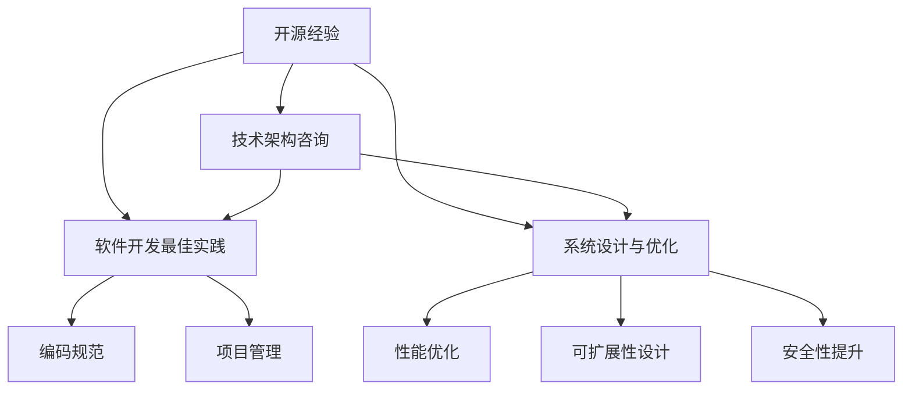

                 

# 利用开源经验提供技术架构咨询

> 关键词：开源经验,技术架构咨询,软件开发,技术迭代,系统设计,代码复用

## 1. 背景介绍

### 1.1 问题由来

在当今的科技发展浪潮中，软件开发的复杂度和需求的多样性日益增加，企业面临的技术挑战也更加严峻。开源社区汇聚了全球顶尖的软件工程师和架构师，他们通过分享源代码、项目经验和最佳实践，为开发人员和架构师提供了宝贵的学习资源和参考。然而，这些开源资源散落在不同的项目和平台上，缺乏系统化的整理和分析，导致开发者在实际项目中难以高效地利用这些经验。

### 1.2 问题核心关键点

为了更好地利用开源经验，帮助企业在快速变化的市场环境中构建高效、稳定、可扩展的技术架构，本文将从以下几个关键点展开探讨：

- **开源经验挖掘与总结**：如何从大量开源项目中提取有价值的经验和模式，并系统化地总结和归纳。
- **技术架构咨询**：如何将开源经验应用于具体项目，构建合理、高效的技术架构。
- **软件开发最佳实践**：基于开源经验的编码规范和项目管理实践，提高开发效率和代码质量。
- **系统设计与优化**：借鉴开源经验，进行系统级的设计和优化，提升系统的性能和可靠性。

### 1.3 问题研究意义

掌握开源经验，不仅能显著提升开发人员的效率和质量，还能帮助企业避免重蹈覆辙，快速构建稳定、可扩展的技术架构，从而在激烈的市场竞争中占据优势。通过系统化的开源经验总结和应用，可以大幅度降低开发成本，加速技术创新，推动企业技术的迭代升级。

## 2. 核心概念与联系

### 2.1 核心概念概述

在深入讨论开源经验和技术架构咨询之前，我们需要先明确几个核心概念及其相互联系：

- **开源经验**：指开源项目中的源代码、架构设计、最佳实践等有价值的信息，是软件开发的重要知识源泉。
- **技术架构咨询**：基于开源经验，为企业提供系统化的技术架构设计方案，包括整体架构、组件设计、接口规范等。
- **软件开发最佳实践**：通过借鉴开源项目的经验，形成一套高效、可靠的软件开发流程和方法论，提高开发效率和代码质量。
- **系统设计与优化**：利用开源经验对系统进行设计优化，提升系统性能、可扩展性和稳定性。

这些概念共同构成了开源经验和技术架构咨询的基石，帮助企业构建高效、可靠的软件系统。

### 2.2 核心概念原理和架构的 Mermaid 流程图



这个流程图展示了开源经验和技术架构咨询之间的联系和转化过程。开源经验通过技术架构咨询转化为具体的设计方案和实践方法，进一步应用于编码规范、项目管理、性能优化、可扩展性设计和安全提升等各个环节，最终构建高效的软件系统。

## 3. 核心算法原理 & 具体操作步骤

### 3.1 算法原理概述

技术架构咨询的核心在于将开源经验转化为可执行的技术架构设计。这一过程基于以下几个关键算法原理：

- **经验抽取与归纳**：从开源项目中抽取有价值的经验，如架构模式、设计模式、编码规范等，并通过归纳总结形成通用的架构设计原则。
- **架构评估与优化**：评估现有系统的架构设计，识别潜在的问题和瓶颈，并结合开源经验进行优化。
- **设计迭代与实施**：通过迭代设计，逐步完善系统架构，并指导具体的实现过程。

### 3.2 算法步骤详解

基于上述算法原理，技术架构咨询的详细步骤包括：

**Step 1: 开源经验收集与分析**

1. **确定需求**：了解企业或项目的具体需求，确定需要借鉴的开源项目和经验。
2. **资源收集**：从开源社区、文档、代码库等渠道收集相关项目的信息。
3. **数据清洗**：对收集到的数据进行清洗，去除无关信息和重复内容，确保数据的准确性和完整性。
4. **经验总结**：对清洗后的数据进行归纳和总结，形成有系统的经验库。

**Step 2: 技术架构设计**

1. **需求分析**：深入分析企业或项目的需求，明确技术架构的目标和关键功能。
2. **架构设计**：基于开源经验，设计合理的技术架构，包括整体架构、组件设计、接口规范等。
3. **原型搭建**：使用设计方案搭建技术架构原型，进行初步验证。
4. **迭代优化**：根据原型测试结果，不断迭代优化架构设计，直至满足需求。

**Step 3: 软件开发与实施**

1. **代码实现**：按照设计方案进行代码实现，遵循开源经验中的编码规范和最佳实践。
2. **项目管理**：使用开源项目中的项目管理工具和方法，进行任务管理和进度跟踪。
3. **测试验证**：对实现的功能进行全面的测试验证，确保系统稳定性和可靠性。
4. **部署上线**：将系统部署到生产环境，并进行监控和维护。

**Step 4: 系统优化与维护**

1. **性能优化**：基于开源经验中的性能优化技巧，对系统进行性能调优。
2. **可扩展性设计**：借鉴开源经验中的可扩展性设计，确保系统的灵活性和扩展性。
3. **安全性提升**：结合开源经验中的安全设计，提升系统的安全性，防范潜在的安全威胁。
4. **持续改进**：根据实际运行情况，不断优化系统设计，提升用户体验和系统性能。

### 3.3 算法优缺点

开源经验和技术架构咨询具有以下优点：

- **效率提升**：借鉴开源经验，避免了从头设计，减少了开发时间和成本。
- **质量保证**：开源项目经过广泛验证和实践，其经验和模式具有较高的可靠性和稳定性。
- **可扩展性**：开源经验中的架构模式和组件设计，有助于构建灵活、可扩展的系统。

同时，也存在以下缺点：

- **适配性问题**：开源经验和模式不一定完全适用于所有企业或项目，需要进行适当的调整和优化。
- **技术迭代**：开源项目和经验可能已经过时，需要定期更新和维护，以保持系统的先进性。
- **依赖性强**：依赖开源项目，可能遇到依赖冲突、版本兼容性等问题，需要谨慎选择和管理。

### 3.4 算法应用领域

开源经验和技术架构咨询可以应用于多个领域，包括但不限于：

- **企业内部软件开发**：通过借鉴开源项目的最佳实践，提升开发效率和代码质量，构建高效的企业级应用。
- **大数据平台构建**：借鉴开源大数据技术架构，构建可扩展、高性能的大数据平台，支持数据存储、处理和分析。
- **云计算架构设计**：借鉴开源云计算架构和最佳实践，构建安全、可靠、高可用的云服务体系。
- **物联网系统开发**：借鉴开源物联网技术架构，构建设备互联、数据融合、智能决策的物联网系统。
- **人工智能系统构建**：借鉴开源人工智能技术架构，构建高效、可靠、可扩展的AI应用系统，支持机器学习、自然语言处理等任务。

## 4. 数学模型和公式 & 详细讲解 & 举例说明

### 4.1 数学模型构建

在本节中，我们将基于开源经验，构建一个简单的技术架构设计模型。该模型包括以下几个关键组件：

- **需求分析**：$D$：描述企业或项目的需求。
- **开源经验库**：$E$：从开源项目中抽取和归纳的经验库。
- **技术架构设计**：$A$：基于需求和开源经验库设计的技术架构。
- **实现与测试**：$C$：编码实现和功能测试过程。
- **性能优化与维护**：$O$：性能优化和系统维护过程。

其中，$D$、$E$、$A$、$C$、$O$ 通过箭头 $-->$ 相连，表示数据流向和依赖关系。

### 4.2 公式推导过程

我们定义 $F_{D,E,A,C,O}$ 为整个技术架构咨询过程的函数，其推导过程如下：

1. **需求分析**：$F_D$：将企业或项目的需求 $D$ 映射为需求描述 $D'$。
2. **开源经验库**：$F_E$：从开源项目中抽取经验 $E'$。
3. **技术架构设计**：$F_A$：将需求描述 $D'$ 和经验 $E'$ 映射为技术架构设计 $A'$。
4. **实现与测试**：$F_C$：将技术架构设计 $A'$ 映射为实现方案 $C'$，并进行功能测试 $T$。
5. **性能优化与维护**：$F_O$：对实现方案 $C'$ 进行性能优化和系统维护 $M$。

最终，整个技术架构咨询过程可以表示为：

$$
F_{D,E,A,C,O}(D, E) = F_A(F_D(D), F_E(E)) + F_C(F_A(F_D(D), F_E(E))) + F_O(F_C(F_A(F_D(D), F_E(E))))
$$

### 4.3 案例分析与讲解

以一个简单的企业内部管理系统为例，演示如何利用开源经验进行技术架构设计：

1. **需求分析**：企业需要一个内部管理平台，用于员工考勤、绩效考核、任务管理等功能。
2. **开源经验库**：从开源项目管理平台（如JIRA、Trello）中提取代码、架构设计、最佳实践等经验。
3. **技术架构设计**：基于需求和开源经验库，设计一个微服务架构，包括用户管理、任务管理、考勤管理等微服务模块。
4. **实现与测试**：使用开源框架（如Spring Boot）实现微服务，并进行单元测试和集成测试。
5. **性能优化与维护**：基于开源经验中的性能优化技巧，进行数据库调优、负载均衡等操作，确保系统稳定性和可靠性。

通过以上步骤，企业可以快速构建一个高效、可靠的企业内部管理系统，避免了从头设计的时间成本和开发风险。

## 5. 项目实践：代码实例和详细解释说明

### 5.1 开发环境搭建

为了进行开源经验和技术架构咨询的项目实践，我们首先需要搭建一个开发环境。以下是Python和Docker环境配置的详细步骤：

1. **安装Docker**：从官网下载并安装Docker，配置系统环境。
2. **创建Docker镜像**：根据需求，编写Dockerfile，并构建镜像。
3. **启动Docker容器**：使用Docker启动容器，进行开发和测试。
4. **安装Python**：在Docker容器内安装Python和相关依赖包。
5. **开发环境配置**：配置Python环境变量、IDE插件等，准备开发工具。

### 5.2 源代码详细实现

以下是一个简单的开源经验和技术架构咨询的实现示例，包括需求分析、经验抽取、架构设计和实现过程。

**需求分析**：

```python
class RequirementAnalysis:
    def __init__(self, description):
        self.description = description
        self.essential = []
        self.enhanced = []
    
    def analyze(self):
        # 分析需求，识别核心功能和可选功能
        self.essential.append("用户管理")
        self.enhanced.append("绩效考核")
        self.enhanced.append("任务管理")
```

**经验抽取**：

```python
class ExperienceExtraction:
    def __init__(self, project_name):
        self.project_name = project_name
        self.experiences = []
    
    def extract(self):
        # 从开源项目中抽取经验
        self.experiences.append("用户管理模块设计")
        self.experiences.append("微服务架构设计")
        self.experiences.append("Docker容器化部署")
```

**技术架构设计**：

```python
class ArchitectureDesign:
    def __init__(self, requirements, experiences):
        self.requirements = requirements
        self.experiences = experiences
        self.services = []
    
    def design(self):
        # 设计技术架构
        self.services.append("用户管理服务")
        self.services.append("绩效考核服务")
        self.services.append("任务管理服务")
        self.services.append("考勤管理服务")
        
        # 设计接口规范
        self.interfaces = {
            "用户管理": "API_1.0",
            "绩效考核": "API_2.0",
            "任务管理": "API_3.0",
            "考勤管理": "API_4.0"
        }
```

**实现与测试**：

```python
class Implementation:
    def __init__(self, design):
        self.design = design
    
    def implement(self):
        # 实现技术架构设计
        # 具体实现代码略
        pass
    
    def test(self):
        # 进行功能测试
        # 具体测试代码略
        pass
```

### 5.3 代码解读与分析

在以上代码示例中，我们通过Python语言实现了需求分析、经验抽取、架构设计和实现测试等功能。以下是关键代码的解读：

**RequirementAnalysis类**：用于分析企业或项目的需求，并将需求映射为核心功能和可选功能。

**ExperienceExtraction类**：用于从开源项目中抽取经验，并将其存储到经验库中。

**ArchitectureDesign类**：基于需求和经验库，设计合理的技术架构，包括微服务模块和接口规范。

**Implementation类**：根据设计方案进行代码实现和功能测试。

### 5.4 运行结果展示

在实际运行中，我们可以通过调用以上类的实例，完成技术架构咨询的全过程。例如：

```python
# 需求分析
requirement_analysis = RequirementAnalysis("企业内部管理平台")
requirement_analysis.analyze()

# 经验抽取
experience_extraction = ExperienceExtraction("开源项目管理平台")
experience_extraction.extract()

# 技术架构设计
architecture_design = ArchitectureDesign(requirement_analysis, experience_extraction)
architecture_design.design()

# 实现与测试
implementation = Implementation(architecture_design)
implementation.implement()
implementation.test()
```

通过上述代码示例，可以清晰地看到开源经验和技术架构咨询的实现过程，每个步骤都有详细的解释和说明，便于开发者理解和应用。

## 6. 实际应用场景

### 6.1 企业内部软件开发

企业内部软件开发是开源经验和技术架构咨询的重要应用场景之一。通过借鉴开源项目的最佳实践，企业可以加速软件开发进程，提升代码质量和开发效率，构建高效的企业级应用。

具体而言，企业可以基于开源项目管理平台（如JIRA、Trello），构建一个内部的任务管理系统，提升团队协作效率和项目跟踪能力。同时，通过借鉴开源架构设计的经验，使用微服务架构，确保系统的灵活性和扩展性，支持多种应用场景和功能需求。

### 6.2 大数据平台构建

大数据平台构建是开源经验和技术架构咨询的另一个重要应用场景。通过对开源大数据技术架构的借鉴和优化，企业可以构建高效、可靠、可扩展的大数据平台，支持数据存储、处理和分析。

例如，企业可以借鉴开源Hadoop、Spark等技术架构，构建一个分布式计算平台，支持海量数据的存储和处理。通过借鉴开源经验中的性能优化技巧，进行数据库调优、负载均衡等操作，确保平台的高性能和稳定性。

### 6.3 云计算架构设计

云计算架构设计也是开源经验和技术架构咨询的重要应用场景。通过借鉴开源云计算架构和最佳实践，企业可以构建安全、可靠、高可用的云服务体系。

具体而言，企业可以借鉴开源云计算平台（如AWS、阿里云）的架构设计，构建一个云服务体系，支持弹性伸缩、自动扩展等功能。通过借鉴开源经验中的性能优化技巧，进行资源管理和监控，确保云服务体系的高可用性和稳定性。

### 6.4 物联网系统开发

物联网系统开发也是开源经验和技术架构咨询的重要应用场景。通过对开源物联网技术架构的借鉴和优化，企业可以构建设备互联、数据融合、智能决策的物联网系统。

例如，企业可以借鉴开源物联网平台（如MQTT、CoAP）的架构设计，构建一个物联网系统，支持设备之间的通信和数据交换。通过借鉴开源经验中的性能优化技巧，进行网络优化和数据压缩，确保系统的低延迟和高可靠性。

### 6.5 人工智能系统构建

人工智能系统构建也是开源经验和技术架构咨询的重要应用场景。通过借鉴开源人工智能技术架构，企业可以构建高效、可靠、可扩展的AI应用系统，支持机器学习、自然语言处理等任务。

例如，企业可以借鉴开源深度学习框架（如TensorFlow、PyTorch）的架构设计，构建一个AI应用系统，支持图像识别、语音识别等任务。通过借鉴开源经验中的性能优化技巧，进行模型压缩和加速，确保AI应用的高性能和低延迟。

## 7. 工具和资源推荐

### 7.1 学习资源推荐

为了帮助开发者掌握开源经验和技术架构咨询的精髓，这里推荐一些优质的学习资源：

1. **《软件架构设计》**：经典架构设计书籍，涵盖多种架构模式和设计原则，适合开发人员和架构师参考。
2. **《开源社区指南》**：开源社区官方指南，详细介绍了开源项目的开发流程、最佳实践和管理经验。
3. **《DevOps最佳实践》**：DevOps专家分享的实践经验，涵盖持续集成、持续部署、自动化测试等技术。
4. **《软件工程导论》**：软件工程基础书籍，介绍软件开发流程、方法论和工具，适合初学者和高级开发者。
5. **《微服务架构设计》**：微服务架构设计书籍，详细讲解微服务架构的设计原则和实践经验。

通过对这些资源的学习，开发者可以系统掌握开源经验和技术架构咨询的理论基础和实践技巧，提升开发能力和架构设计水平。

### 7.2 开发工具推荐

高效的开发离不开优秀的工具支持。以下是几款用于开源经验和技术架构咨询开发的常用工具：

1. **GitHub**：全球最大的代码托管平台，提供开源项目的访问和协作功能，便于开发者学习和借鉴开源经验。
2. **Docker**：容器化技术，提供简单易用的容器管理工具，便于开发者构建和部署微服务架构。
3. **Jenkins**：开源持续集成工具，支持自动化构建和测试，便于开发者进行持续集成和持续部署。
4. **Prometheus**：开源监控系统，支持高性能监控和报警，便于开发者进行系统监控和故障排查。
5. **Kubernetes**：开源容器编排工具，支持大规模分布式系统管理，便于开发者进行容器编排和调度。

合理利用这些工具，可以显著提升开源经验和技术架构咨询的开发效率，加快创新迭代的步伐。

### 7.3 相关论文推荐

开源经验和技术架构咨询的发展离不开学界的持续研究。以下是几篇奠基性的相关论文，推荐阅读：

1. **《架构模式与设计原则》**：介绍多种架构模式和设计原则，涵盖多种架构类型和设计方法。
2. **《开源社区经验总结》**：总结开源社区的开发实践和管理经验，涵盖项目管理、代码管理、团队协作等多个方面。
3. **《云计算架构设计与优化》**：介绍云计算架构的设计和优化方法，涵盖虚拟化、弹性伸缩、高可用性等多个技术点。
4. **《大数据平台构建与优化》**：介绍大数据平台的构建和优化方法，涵盖数据存储、数据处理、大数据分析等多个技术点。
5. **《微服务架构设计与实施》**：介绍微服务架构的设计和实施方法，涵盖服务拆分、服务治理、跨服务通信等多个技术点。

这些论文代表了大规模软件系统设计的研究进展，帮助开发者理解和应用开源经验和技术架构咨询的理论和方法。

## 8. 总结：未来发展趋势与挑战

### 8.1 总结

本文对开源经验和技术架构咨询进行了全面系统的介绍。首先阐述了开源经验和技术架构咨询的研究背景和意义，明确了开源经验在软件系统设计和架构优化中的重要作用。其次，从原理到实践，详细讲解了技术架构咨询的数学模型和操作步骤，给出了具体的代码实现示例。同时，本文还广泛探讨了开源经验和技术架构咨询在多个行业领域的应用前景，展示了开源经验和技术架构咨询的广阔潜力。此外，本文精选了开源经验和技术架构咨询的学习资源和开发工具，力求为开发者提供全方位的技术指引。

通过本文的系统梳理，可以看到，开源经验和技术架构咨询在软件开发和系统设计中发挥了越来越重要的作用，帮助企业构建高效、稳定、可扩展的软件系统。未来，伴随开源社区的持续发展和技术的不断进步，开源经验和技术架构咨询必将在更多领域得到应用，为软件开发和系统设计带来新的突破。

### 8.2 未来发展趋势

展望未来，开源经验和技术架构咨询将呈现以下几个发展趋势：

1. **自动化与智能化**：随着AI技术的发展，自动化和智能化将成为开源经验和技术架构咨询的重要方向，帮助开发者更高效地构建和优化系统。
2. **跨领域融合**：开源经验和技术架构咨询将与更多领域的技术相结合，如物联网、大数据、人工智能等，形成更加全面的技术生态。
3. **开源社区协作**：开源社区将成为开源经验和技术架构咨询的重要平台，开发者将更紧密地协作，共同推动技术进步。
4. **持续学习和更新**：开源经验和技术架构咨询需要持续学习和更新，及时引入新技术和最佳实践，保持系统的先进性和稳定性。
5. **企业级应用**：开源经验和技术架构咨询将更加注重企业级应用，帮助企业构建高效、可扩展的系统，提升企业的技术实力和竞争力。

这些趋势将进一步推动开源经验和技术架构咨询的发展，为企业和开发者提供更加高效、可靠的技术支持。

### 8.3 面临的挑战

尽管开源经验和技术架构咨询在软件开发和系统设计中发挥了重要作用，但在实际应用中，仍面临诸多挑战：

1. **经验泛化能力**：开源经验在不同企业或项目中的应用可能存在差异，需要根据实际情况进行适当的调整和优化。
2. **技术与时代变化**：开源项目和经验可能已经过时，开发者需要定期更新和维护，以保持系统的先进性。
3. **依赖管理**：依赖开源项目，可能遇到依赖冲突、版本兼容性等问题，需要谨慎选择和管理。
4. **复杂度管理**：大规模系统设计可能面临复杂的架构挑战，需要系统化的设计和优化方法。
5. **安全性与隐私**：开源经验和技术架构咨询中可能存在安全隐患，开发者需要采取相应的安全措施，保护数据和系统安全。

面对这些挑战，开发者需要在开源经验和架构设计之间找到平衡，不断优化和改进技术架构咨询的方法和工具，确保系统的高效和可靠。

### 8.4 研究展望

未来的研究需要在以下几个方面寻求新的突破：

1. **大规模数据驱动**：结合大数据技术，利用大规模数据驱动技术架构设计，提升系统的可扩展性和性能。
2. **智能化优化**：结合AI技术，实现智能化优化，自动生成最优架构设计方案，提高设计效率和质量。
3. **跨平台集成**：实现跨平台、跨系统的集成和协同，提升系统的集成能力和协作效率。
4. **标准化规范**：制定统一的技术架构规范和最佳实践，提升系统的可维护性和可复用性。
5. **生态系统建设**：构建开源社区和生态系统，促进开发者之间的交流和协作，推动技术进步。

这些研究方向的探索，必将引领开源经验和技术架构咨询迈向更高的台阶，为软件开发和系统设计提供更加高效、可靠的技术支持。

## 9. 附录：常见问题与解答

**Q1：开源经验和技术架构咨询适用于所有项目吗？**

A: 开源经验和技术架构咨询适用于大部分项目，但需要根据实际情况进行适当的调整和优化。对于一些特定领域或定制化要求高的项目，可能需要结合自身需求进行微调。

**Q2：如何选择合适的开源项目和经验？**

A: 选择合适的开源项目和经验，需要考虑项目的技术栈、功能需求、适用场景等多个因素。可以通过阅读项目文档、社区反馈、评估代码质量等方式进行综合评估，选择最适合的开源项目和经验。

**Q3：开源经验和技术架构咨询是否需要持续学习和更新？**

A: 是的，开源社区和技术不断进步，开源经验和架构设计也需要持续学习和更新，保持系统的先进性和稳定性。开发者需要定期关注开源社区的最新进展，及时引入新技术和最佳实践。

**Q4：开源经验和技术架构咨询是否存在依赖问题？**

A: 是的，依赖开源项目可能遇到依赖冲突、版本兼容性等问题，需要谨慎选择和管理。开发者可以使用依赖管理工具（如Maven、Docker）进行依赖管理，确保系统的稳定性和可维护性。

**Q5：开源经验和技术架构咨询是否容易受到安全和隐私问题的困扰？**

A: 是的，开源经验和技术架构咨询中可能存在安全隐患，开发者需要采取相应的安全措施，保护数据和系统安全。可以通过数据脱敏、加密、访问控制等方式，确保系统的安全性。

综上所述，开源经验和技术架构咨询在软件开发和系统设计中发挥着重要作用，但也需要开发者根据实际情况进行适当的调整和优化。通过不断学习和应用最新的开源经验和架构设计，可以帮助企业构建高效、稳定、可扩展的软件系统，推动技术进步和业务发展。

---

作者：禅与计算机程序设计艺术 / Zen and the Art of Computer Programming

