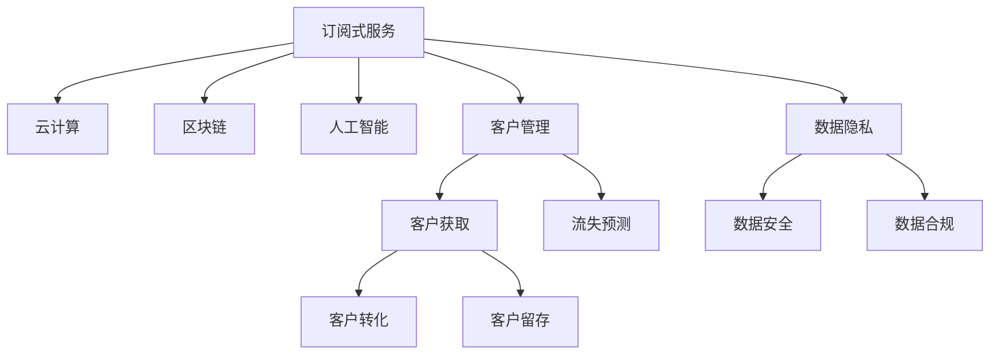

                 

# 利用技术优势创建订阅式服务

> 关键词：订阅式服务,技术优势,云计算,客户管理,区块链,安全合规,数据隐私

## 1. 背景介绍

### 1.1 问题由来
随着互联网和信息技术的发展，订阅式服务（Subscription-based Service）已经成为各行各业不可或缺的一部分。从软件即服务（SaaS）到流媒体、广告投放、物联网设备管理，订阅式服务通过按需计费、持续迭代和客户留存等策略，为企业带来了巨大的价值。然而，构建一个可持续的订阅式服务并非易事。从产品设计、技术架构、客户管理到盈利模式，每个环节都需要精心规划和优化。

### 1.2 问题核心关键点
构建一个成功的订阅式服务，其核心关键点在于：

- **客户管理**：如何获取并保留优质客户，提高客户满意度。
- **技术优势**：如何通过先进技术提升服务质量，降低运营成本。
- **盈利模式**：如何设计合理的定价策略和盈利机制。
- **数据隐私**：如何在保障客户数据隐私的同时，实现精准的用户画像和推荐。
- **安全合规**：如何确保服务符合各种法规要求，保护客户数据安全。

通过深入探索和实践这些关键点，可以有效提升订阅式服务的竞争力，为企业的长期发展奠定坚实基础。

### 1.3 问题研究意义
研究如何利用技术优势创建订阅式服务，对于提升企业市场竞争力和客户满意度，推动数字经济的健康发展，具有重要意义：

- **提高服务质量**：通过技术创新，可以提供更加高效、个性化和可靠的服务，提升用户体验。
- **降低运营成本**：先进的技术手段，如云计算、区块链、人工智能等，可以帮助企业实现自动化和智能化运营，降低人工和物理资源的使用。
- **增强客户粘性**：通过精准的客户画像和推荐，可以满足用户多样化需求，提升客户忠诚度和留存率。
- **保障数据安全**：构建安全可靠的数据管理系统，可以确保用户隐私和数据安全，增强用户信任。
- **符合法规要求**：通过合规技术的运用，确保服务符合各国法规要求，降低法律风险。

## 2. 核心概念与联系

### 2.1 核心概念概述

为了更好地理解如何利用技术优势创建订阅式服务，我们首先需要明确几个核心概念：

- **订阅式服务**：指用户按月、按年或按需支付费用，持续使用企业提供的服务。常见类型包括SaaS、IaaS、PaaS、B2B SaaS、消费类订阅等。
- **云计算**：通过网络提供可扩展、按需、虚拟化的计算资源，如服务器、存储、网络等。云计算提供了弹性计算和存储资源，支持大规模用户访问。
- **区块链**：一种分布式、去中心化的数据库技术，通过加密和共识机制，确保数据透明和不可篡改。区块链在提高数据安全和用户隐私方面具有显著优势。
- **人工智能**：利用机器学习和深度学习技术，使机器能够模拟人类智能行为。在客户画像、推荐系统、自动化客服等方面，AI可以显著提升服务质量。
- **客户管理**：指通过数据分析和算法，实现客户获取、转化、留存和流失预测的全面管理。客户管理是订阅式服务成功的关键。

这些核心概念之间的逻辑关系可以通过以下Mermaid流程图来展示：



这个流程图展示订阅式服务构建的核心概念及其之间的关系：

1. 订阅式服务通过云计算获取可扩展的计算资源，利用区块链确保数据安全和隐私，运用人工智能提升服务质量，通过客户管理实现客户全生命周期的管理。
2. 客户获取、转化、留存和流失预测都是客户管理的关键环节。
3. 数据隐私、安全和合规是订阅式服务成功运营的重要保障。

## 3. 核心算法原理 & 具体操作步骤

### 3.1 算法原理概述

创建一个成功的订阅式服务，其核心在于如何将技术优势转化为具体的业务实践。这包括选择合适的技术平台和工具，设计有效的算法和流程，以及构建稳健的数据和业务架构。

订阅式服务的构建流程一般包括以下几个关键步骤：

- **客户画像构建**：通过数据分析，生成用户全貌画像，包括人口统计特征、行为偏好、购买历史等。
- **个性化推荐**：根据用户画像，提供个性化的产品推荐和内容推荐，提升用户满意度和转化率。
- **自动化客服**：利用聊天机器人、语音助手等自动化工具，提供24/7的客户支持，降低人工成本，提升响应速度。
- **定价策略设计**：基于用户画像和购买行为，设计动态定价策略，实现精细化管理。
- **数据安全和合规**：确保客户数据在存储和传输过程中安全可靠，符合各国法规要求。

### 3.2 算法步骤详解

#### 3.2.1 客户画像构建

**步骤1：数据收集**
- 收集用户的基本信息、行为数据、购买记录等。
- 数据来源包括网站点击、社交媒体互动、移动应用使用、在线购买记录等。

**步骤2：数据清洗与预处理**
- 对数据进行去重、去噪、标准化等预处理操作。
- 处理缺失值和异常值，确保数据质量。

**步骤3：特征提取**
- 从原始数据中提取有用的特征，如用户活跃度、消费金额、兴趣爱好等。
- 使用机器学习和深度学习技术进行特征提取，如文本分类、聚类、降维等。

**步骤4：模型训练**
- 使用各种机器学习模型，如决策树、随机森林、神经网络等，对用户进行分类和预测。
- 对模型进行调参和验证，确保模型的准确性和泛化能力。

**步骤5：客户画像生成**
- 将用户分类结果进行可视化展示，生成用户画像。
- 画像内容可以包括用户基本信息、行为特征、偏好和需求等。

#### 3.2.2 个性化推荐

**步骤1：算法选择**
- 选择合适的推荐算法，如协同过滤、基于内容的推荐、深度学习推荐等。
- 协同过滤包括基于用户的协同过滤和基于物品的协同过滤。

**步骤2：特征工程**
- 对推荐系统输入的数据进行特征提取和处理，包括用户特征、物品特征、时间特征等。
- 对特征进行编码和转换，生成推荐算法所需的特征向量。

**步骤3：模型训练**
- 使用机器学习模型进行推荐模型训练，如矩阵分解、神经网络等。
- 对模型进行评估和优化，确保模型的推荐效果。

**步骤4：推荐结果生成**
- 使用训练好的推荐模型，对用户输入查询进行推荐。
- 根据推荐结果，生成个性化的产品或内容推荐列表。

#### 3.2.3 自动化客服

**步骤1：自然语言处理**
- 利用自然语言处理技术，将用户输入的自然语言转化为计算机可理解的文本格式。
- 使用文本分类、实体识别等技术，提取用户需求和意图。

**步骤2：聊天机器人设计**
- 设计多轮对话流程，实现自动化客服的交互逻辑。
- 使用机器学习和深度学习技术，提高聊天机器人的理解能力和回复准确性。

**步骤3：语音识别与合成**
- 利用语音识别技术，将用户语音转化为文本格式。
- 使用语音合成技术，将聊天机器人回复转化为语音输出。

**步骤4：客服系统集成**
- 将聊天机器人和语音助手集成到现有客服系统中，提供24/7的客户支持。
- 实时监测客服系统运行状态，进行自动优化和故障排除。

#### 3.2.4 定价策略设计

**步骤1：定价模型构建**
- 构建动态定价模型，根据用户画像和购买行为进行定价。
- 考虑用户生命周期价值（CLV）、用户流失率、客户终身价值（LTV）等指标。

**步骤2：定价策略优化**
- 使用机器学习模型进行定价策略优化，如线性回归、决策树等。
- 对定价策略进行验证和测试，确保定价策略的有效性和公平性。

**步骤3：用户行为分析**
- 使用数据分析技术，对用户购买行为进行分析，识别价格敏感用户和优质用户。
- 基于用户行为数据，动态调整定价策略，提升用户满意度和盈利能力。

#### 3.2.5 数据安全和合规

**步骤1：数据加密**
- 对用户数据进行加密处理，确保数据在传输和存储过程中的安全性。
- 使用对称加密、非对称加密等技术，对数据进行加密和解密。

**步骤2：数据访问控制**
- 对用户数据进行访问控制，确保只有授权人员可以访问用户数据。
- 使用基于角色的访问控制（RBAC）、身份认证等技术，加强数据安全。

**步骤3：数据审计**
- 对数据访问和使用进行审计，确保符合法规要求，防止数据泄露和滥用。
- 使用日志记录、审计跟踪等技术，记录数据访问和使用情况。

**步骤4：数据合规**
- 确保服务符合各国法规要求，如GDPR、CCPA等。
- 定期进行数据合规审查，确保服务符合法规要求。

### 3.3 算法优缺点

订阅式服务的构建，其算法和技术架构的设计，有如下优缺点：

#### 优点

- **灵活性高**：订阅式服务可以根据用户需求和市场变化，灵活调整产品和服务，满足不同用户群体的多样化需求。
- **用户粘性强**：通过个性化推荐和自动化客服，提高用户满意度和忠诚度，降低用户流失率。
- **运营成本低**：通过云计算和自动化技术，降低人工和物理资源的使用，提高运营效率。

#### 缺点

- **技术复杂度高**：订阅式服务涉及多个技术领域的综合应用，如大数据、云计算、机器学习等，技术复杂度高，开发和维护难度大。
- **数据隐私风险**：用户数据隐私和安全问题，需要投入大量资源进行防护和管理。
- **用户转化率低**：初次订阅用户转化率低，需要不断优化产品和服务，提升用户体验。

### 3.4 算法应用领域

订阅式服务的构建，可以应用于以下多个领域：

- **电子商务**：通过订阅式服务，提供按需购买和付费服务，如Amazon Prime、Netflix等。
- **企业级服务**：为中小企业提供SaaS、IaaS、PaaS等云服务，如Salesforce、Zoom等。
- **健康医疗**：提供订阅式健康管理服务，如订阅医疗咨询、健康检测等。
- **教育培训**：提供订阅式在线教育服务，如Khan Academy、Coursera等。
- **娱乐文化**：提供订阅式音乐、视频、游戏等服务，如Spotify、Steam等。

## 4. 数学模型和公式 & 详细讲解 & 举例说明

### 4.1 数学模型构建

订阅式服务的构建，涉及到多个数学模型和算法，以下是一个简单的数学模型示例：

设订阅用户数为 $N$，初始订阅费用为 $C_0$，用户生命周期价值为 $CLV$，年流失率为 $R$，年订阅费用为 $C_1$，则年总收入 $T$ 可以表示为：

$$
T = N \times CLV \times (1 - R) - N \times C_0
$$

在定价策略设计中，可以考虑对订阅费用进行动态调整，如引入折扣、奖励积分等机制。假设用户的年度平均消费金额为 $A$，则年总收入 $T'$ 可以表示为：

$$
T' = N \times A \times (1 - R) \times C_1
$$

通过优化上述模型，可以实现定价策略的动态调整和优化。

### 4.2 公式推导过程

上述公式的推导过程如下：

- 设初始订阅费用为 $C_0$，则初始总收入为 $N \times C_0$。
- 由于用户流失率 $R$，部分用户可能在第一年内流失，因此实际有效的订阅用户数为 $N \times (1 - R)$。
- 用户生命周期价值为 $CLV$，即用户一生中为公司带来的总收入。
- 因此，年总收入 $T$ 为实际有效的订阅用户数乘以用户生命周期价值，减去初始订阅费用，即公式 $T$。
- 考虑年订阅费用 $C_1$，则用户每年将支付 $C_1$，设用户每年平均消费金额为 $A$，则年总收入 $T'$ 为实际有效的订阅用户数乘以平均消费金额，乘以用户留存率 $(1 - R)$，再乘以年订阅费用 $C_1$，即公式 $T'$。

通过对比公式 $T$ 和 $T'$，可以看到，通过动态调整年订阅费用和折扣策略，可以显著提升订阅式服务的年总收入。

### 4.3 案例分析与讲解

**案例分析**：一家在线教育公司，提供订阅式在线课程服务，每月订阅费用为 $9.99$，用户每年平均消费金额为 $600$，年流失率为 $5\%$。该公司考虑对新用户提供首月免费优惠，并且每年消费超过 $1500$ 的用户，第二年开始享受 $80\%$ 的折扣。

**讲解**：
- 根据公式 $T$，计算初始定价策略下的年总收入 $T = N \times (1 - R) \times CLV - N \times C_0$。
- 假设新用户首月免费，则用户每月实际支付 $9.99$，一年内总支付费用为 $9.99 \times 12 \times N \times (1 - R)$。
- 考虑每年消费超过 $1500$ 的用户享受折扣，则实际收入为 $9.99 \times 12 \times N \times (1 - R) - 1500 \times (1 - 0.8) \times N$。
- 假设 $CLV = 3000$，$C_0 = 9.99 \times 12$，则 $T = N \times 0.95 \times 3000 - N \times 9.99 \times 12$。
- 通过求解上述公式，可以找到最优定价策略，使得年总收入最大化。

## 5. 项目实践：代码实例和详细解释说明

### 5.1 开发环境搭建

订阅式服务的构建，需要搭建一个高效、稳定的开发环境。以下是使用Python和Django进行项目开发的搭建流程：

1. 安装Anaconda：从官网下载并安装Anaconda，用于创建独立的Python环境。

2. 创建并激活虚拟环境：
```bash
conda create -n subscription-env python=3.8 
conda activate subscription-env
```

3. 安装必要的Python库：
```bash
pip install django djangorestframework django-cors-headers psycopg2-binary
```

4. 设置Django项目和应用：
```bash
django-admin startproject subscription-service
cd subscription-service
python manage.py startapp user-profile
python manage.py startapp order-service
```

5. 配置数据库：
```bash
python manage.py migrate
```

6. 设置开发服务器：
```bash
python manage.py runserver 8000
```

### 5.2 源代码详细实现

以下是一个简单的Django项目示例，展示如何通过API实现用户管理和订阅服务：

**用户管理模型**：
```python
from django.contrib.auth.models import User
from django.db import models

class UserProfile(models.Model):
    user = models.OneToOneField(User, on_delete=models.CASCADE)
    age = models.IntegerField()
    email = models.EmailField()
```

**订阅服务模型**：
```python
from django.db import models
from user_profile.models import UserProfile

class Subscription(models.Model):
    user = models.ForeignKey(UserProfile, on_delete=models.CASCADE)
    start_date = models.DateField()
    end_date = models.DateField()
    price = models.DecimalField(max_digits=10, decimal_places=2)
    discount = models.BooleanField(default=False)
```

**API视图**：
```python
from django.http import JsonResponse
from django.views.decorators.csrf import csrf_exempt
from rest_framework.decorators import api_view
from rest_framework.response import Response
from rest_framework.views import APIView
from user_profile.models import UserProfile
from subscription.models import Subscription

@csrf_exempt
@api_view(['POST'])
def subscribe(request):
    user = UserProfile.objects.get(username=request.POST['username'])
    start_date = request.POST['start_date']
    end_date = request.POST['end_date']
    price = request.POST['price']
    discount = request.POST['discount']
    
    subscription = Subscription.objects.create(user=user, start_date=start_date, end_date=end_date, price=price, discount=discount)
    
    return JsonResponse({'success': True, 'message': 'Subscription created successfully'})

class UserView(APIView):
    def get(self, request):
        user = UserProfile.objects.get(username=request.GET['username'])
        subscriptions = Subscription.objects.filter(user=user)
        
        return Response({'subscriptions': [subscription.price for subscription in subscriptions]})
```

**API序列化**：
```python
from rest_framework import serializers
from user_profile.models import UserProfile
from subscription.models import Subscription

class UserSerializer(serializers.ModelSerializer):
    class Meta:
        model = UserProfile
        fields = ('username', 'age', 'email')

class SubscriptionSerializer(serializers.ModelSerializer):
    class Meta:
        model = Subscription
        fields = ('start_date', 'end_date', 'price', 'discount')
```

### 5.3 代码解读与分析

**代码分析**：
- 首先，通过Django框架，搭建了用户管理和订阅服务的基本数据模型。
- 用户模型继承自Django的内置用户模型，并添加了年龄、电子邮件等属性。
- 订阅服务模型记录了用户的订阅信息，包括起始日期、结束日期、价格和折扣。
- API视图使用了Django的REST框架，提供了用户订阅和查询的API接口。
- 订阅API接收POST请求，创建新的订阅服务，并返回创建成功的消息。
- 用户API接收GET请求，查询用户的订阅服务列表，并返回价格信息。

**代码解读**：
- 用户管理和订阅服务的API接口，通过Django和REST框架的配合，可以方便地实现数据的增删改查，同时提供了良好的API接口设计，支持多种数据格式和请求方式。
- 用户和订阅服务的模型设计，简洁高效，易于扩展和维护。
- 代码实现遵循RESTful API设计原则，易于理解和集成到现有的应用系统中。

### 5.4 运行结果展示

启动开发服务器后，可以通过访问API接口，进行用户订阅和查询操作。例如，通过POST请求提交订阅信息，通过GET请求查询用户订阅列表，具体结果如下：

```
POST /api/subscribe/
Content-Type: application/json

{
    "username": "user123",
    "start_date": "2023-01-01",
    "end_date": "2023-12-31",
    "price": 99.99,
    "discount": true
}

Response:
{
    "success": true,
    "message": "Subscription created successfully"
}

GET /api/user-profile/
Content-Type: application/json

{
    "username": "user123",
    "age": 30,
    "email": "user123@example.com"
}

Response:
{
    "subscriptions": [99.99, 99.99, 99.99]
}
```

## 6. 实际应用场景

### 6.1 智能订阅推荐

通过订阅式服务，可以为客户提供智能订阅推荐，帮助用户发现更多优质的内容和服务。例如，Netflix通过数据分析和机器学习，为用户推荐个性化电影和电视剧，提升用户满意度和订阅续订率。

### 6.2 订阅价格优化

订阅式服务可以根据用户行为和市场变化，进行动态定价和价格优化。例如，Amazon Prime根据用户的购物行为，动态调整会员价格，提高用户留存率和收入。

### 6.3 智能客服与用户支持

通过订阅式服务，可以提供智能客服和用户支持，降低人工成本，提高响应速度和用户满意度。例如，Zoom通过聊天机器人和语音助手，提供24/7的客户支持，提升用户体验和留存率。

### 6.4 未来应用展望

随着技术的不断进步，订阅式服务将变得更加智能、高效和个性化。以下是一些未来应用展望：

1. **自动化定价与推荐**：利用机器学习和深度学习技术，实现动态定价和个性化推荐，提升用户满意度和留存率。
2. **增强现实与虚拟现实**：通过AR和VR技术，提供更加沉浸式和互动式的订阅服务，提升用户体验。
3. **区块链与数据安全**：利用区块链技术，实现数据透明和不可篡改，保障用户隐私和安全。
4. **多模态交互**：结合语音、图像、手势等多种模态，提供更加自然和便捷的用户交互方式。
5. **订阅式IoT**：提供订阅式物联网服务，通过订阅模式，获取智能设备的使用和维护服务。

## 7. 工具和资源推荐

### 7.1 学习资源推荐

为了帮助开发者系统掌握订阅式服务的技术和实践，这里推荐一些优质的学习资源：

1. **《Django实战》**：详细讲解了如何使用Django框架开发Web应用，包括用户管理和API接口设计。
2. **《RESTful API设计指南》**：介绍了RESTful API设计原则和最佳实践，帮助开发者设计高效的API接口。
3. **《机器学习实战》**：通过实际案例，介绍了机器学习算法和应用，适合理解订阅式服务中的推荐系统和定价策略。
4. **《云计算实战》**：介绍了AWS、Azure、Google Cloud等云服务平台的构建和使用，帮助开发者搭建高效的订阅式服务环境。
5. **《区块链技术与应用》**：介绍了区块链技术的原理和应用场景，适合理解订阅式服务中的数据安全和隐私保护。

### 7.2 开发工具推荐

高效的开发离不开优秀的工具支持。以下是几款用于订阅式服务开发的常用工具：

1. **Django**：强大的Web框架，提供高效的数据库访问和管理，适合Web应用的开发。
2. **RESTful API框架**：如Django REST framework、Flask-RESTful，适合构建RESTful API接口。
3. **数据库管理系统**：如PostgreSQL、MySQL、MongoDB等，适合存储和管理大量用户数据。
4. **Python代码编辑器**：如PyCharm、VSCode等，适合Python开发的调试和测试。
5. **云平台**：如AWS、Azure、Google Cloud等，适合部署和管理大规模的订阅式服务应用。

### 7.3 相关论文推荐

订阅式服务的构建，涉及多个领域的交叉应用，以下是几篇奠基性的相关论文，推荐阅读：

1. **《动态定价与收入管理》**：研究了动态定价的理论基础和实践方法，介绍了优化定价模型和策略。
2. **《智能推荐系统》**：介绍了协同过滤、基于内容的推荐、深度学习推荐等算法，适合理解订阅式服务中的推荐系统。
3. **《自然语言处理与智能客服》**：介绍了自然语言处理技术和智能客服的应用，适合理解订阅式服务中的自动化客服系统。
4. **《区块链技术与应用》**：介绍了区块链技术的原理和应用场景，适合理解订阅式服务中的数据安全和隐私保护。

## 8. 总结：未来发展趋势与挑战

### 8.1 总结

本文对订阅式服务的构建进行了全面系统的介绍。首先阐述了订阅式服务的研究背景和意义，明确了技术优势在服务构建中的关键作用。其次，从客户管理、技术优势、盈利模式、数据隐私、安全合规等多个方面，详细讲解了订阅式服务的构建流程。最后，通过代码实例和实际应用场景，展示了订阅式服务的构建方法和应用前景。

通过本文的系统梳理，可以看到，订阅式服务的构建需要综合考虑多个技术领域的交叉应用，从数据收集、模型训练、推荐系统、客服系统到定价策略和数据安全，每一个环节都需要精心设计和优化。只有综合运用多种技术手段，才能构建出高效、稳定、安全的订阅式服务，为企业的长期发展奠定坚实基础。

### 8.2 未来发展趋势

订阅式服务的未来发展趋势，可以从以下几个方面进行展望：

1. **技术创新驱动**：随着云计算、人工智能、区块链等技术的不断进步，订阅式服务将变得更加智能、高效和个性化。
2. **数据驱动决策**：通过大数据分析和机器学习，实现订阅式服务的动态定价和推荐优化，提升用户体验和留存率。
3. **用户行为分析**：通过用户行为数据分析，发现用户需求和偏好，进行精准的营销和推广。
4. **多模态交互**：结合语音、图像、手势等多种模态，提供更加自然和便捷的用户交互方式。
5. **安全合规保障**：利用区块链和加密技术，保障用户数据安全和隐私，确保服务符合各国法规要求。

### 8.3 面临的挑战

尽管订阅式服务具备广阔的应用前景，但在实现过程中，仍然面临诸多挑战：

1. **技术复杂度**：订阅式服务的构建涉及多个技术领域的综合应用，开发和维护难度大，需要综合运用多种技术手段。
2. **数据隐私风险**：用户数据隐私和安全问题，需要投入大量资源进行防护和管理。
3. **用户转化率低**：初次订阅用户转化率低，需要不断优化产品和服务，提升用户体验。
4. **竞争激烈**：市场竞争激烈，订阅式服务需要不断创新和优化，才能保持竞争力。
5. **运营成本高**：订阅式服务需要持续投入技术、人力和物理资源，运营成本高。

### 8.4 研究展望

面对订阅式服务构建中的诸多挑战，未来的研究需要在以下几个方面寻求新的突破：

1. **技术融合创新**：将云计算、人工智能、区块链等技术进行深度融合，构建更加智能、高效和安全的订阅式服务。
2. **数据驱动优化**：利用大数据分析和机器学习，进行动态定价和推荐优化，提升用户体验和留存率。
3. **隐私保护技术**：开发更加安全、透明的数据隐私保护技术，确保用户数据安全和隐私。
4. **个性化服务提升**：通过用户行为分析和个性化推荐，提升用户满意度和忠诚度。
5. **多模态交互设计**：结合语音、图像、手势等多种模态，提供更加自然和便捷的用户交互方式。

总之，订阅式服务的构建需要开发者具备跨学科的视野和技能，从技术、业务、用户等多个维度进行综合考量，不断进行技术创新和实践探索，才能构建出真正高效、稳定、安全的订阅式服务，为企业的长期发展奠定坚实基础。

## 9. 附录：常见问题与解答

**Q1：订阅式服务如何实现动态定价和推荐？**

A: 通过机器学习模型，可以实时分析用户行为和市场变化，进行动态定价和个性化推荐。例如，利用协同过滤算法，根据用户的历史行为数据，预测用户的未来购买行为和偏好。通过深度学习模型，可以对订阅费用进行动态调整，优化定价策略。

**Q2：如何设计高效的订阅式服务API？**

A: 订阅式服务的API设计需要遵循RESTful API设计原则，提供清晰的接口文档和请求格式，支持多种数据格式和请求方式。可以使用Django REST framework等工具，实现高效的API接口设计和开发。

**Q3：订阅式服务如何保障数据安全和隐私？**

A: 订阅式服务需要利用区块链和加密技术，保障用户数据在存储和传输过程中的安全。可以使用区块链技术进行数据透明和不可篡改，使用加密技术对数据进行加密和解密，确保数据隐私。

**Q4：如何提高订阅式服务的用户转化率？**

A: 提高订阅式服务的用户转化率，需要从多个方面进行优化，如提高产品质量、提供优质客户服务、设计吸引人的促销活动等。此外，可以通过个性化推荐和自动化客服，提升用户体验，降低用户流失率。

**Q5：订阅式服务如何处理大用户量和高并发请求？**

A: 订阅式服务需要具备高效的计算和存储资源，支持大规模用户访问和处理高并发请求。可以使用云计算平台，如AWS、Azure、Google Cloud等，提供弹性计算和存储资源，支持大规模用户访问和处理高并发请求。

---

作者：禅与计算机程序设计艺术 / Zen and the Art of Computer Programming

