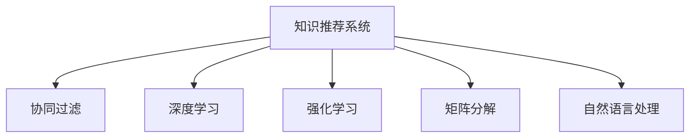

                 

# 利用机器学习优化知识推荐系统

> 关键词：知识推荐系统, 机器学习, 协同过滤, 深度学习, 强化学习, 矩阵分解, 自然语言处理, 推荐系统评估指标

## 1. 背景介绍

### 1.1 问题由来
在当今信息爆炸的时代，用户在海量信息中找到对自己有用的知识变得越来越困难。知识推荐系统（Knowledge Recommendation System, KRS）应运而生，通过分析用户的行为和兴趣，推荐符合用户需求的知识点或知识资源。KRS可以应用于教育、科研、信息检索等多个领域，帮助用户快速定位到需要的知识，提升学习和工作效率。

然而，传统的知识推荐系统往往基于简单的规则或静态的知识关联图，难以捕捉用户动态变化的兴趣，且难以处理大规模用户数据。随着机器学习和大数据技术的发展，越来越多的KRS开始引入机器学习方法来提升推荐效果。本文旨在探讨如何利用机器学习算法优化知识推荐系统，特别是如何通过深度学习、协同过滤、强化学习等技术，实现更加精准和智能的知识推荐。

## 2. 核心概念与联系

### 2.1 核心概念概述

为更好地理解基于机器学习的方法在知识推荐系统中的应用，本节将介绍几个核心概念：

- **知识推荐系统(KRS)**：利用用户的历史行为、兴趣和社交网络信息，为用户推荐相关知识资源或链接的系统。KRS是信息检索和个性化推荐技术的结合，旨在帮助用户快速找到所需知识。

- **协同过滤(Collaborative Filtering, CF)**：基于用户行为数据或物品评分数据，推荐与用户历史兴趣相似的物品或知识点。CF包括用户-物品CF、物品-物品CF等，是推荐系统中应用最广泛的技术之一。

- **深度学习(Deep Learning, DL)**：一种基于多层神经网络的机器学习技术，可以自动学习复杂的数据表示，在推荐系统中用于建模用户兴趣和知识关联。

- **强化学习(Reinforcement Learning, RL)**：通过模拟用户交互环境，让智能体通过不断尝试和反馈，学习最优策略以优化推荐效果。

- **矩阵分解(Matrix Factorization, MF)**：将用户-物品评分矩阵分解为隐含用户特征向量和隐含物品特征向量的形式，用于预测未评分项目的评分。

- **自然语言处理(Natural Language Processing, NLP)**：利用自然语言理解和生成技术，处理和理解知识描述和用户查询，提升推荐系统的语义理解能力。

这些核心概念之间的逻辑关系可以通过以下Mermaid流程图来展示：



这个流程图展示了一些核心概念及其之间的关系：

1. 知识推荐系统通过协同过滤、深度学习、强化学习、矩阵分解和自然语言处理等技术，提升推荐效果。
2. 协同过滤是KRS中常用的技术，通过用户行为数据或评分数据推荐相似的知识资源。
3. 深度学习用于建模用户兴趣和知识关联，可以自动提取复杂特征。
4. 强化学习通过模拟用户交互环境，优化推荐策略。
5. 矩阵分解用于降维和特征提取，提升推荐准确度。
6. 自然语言处理提升对知识描述和用户查询的理解，增强推荐系统的语义能力。

## 3. 核心算法原理 & 具体操作步骤
### 3.1 算法原理概述

基于机器学习的知识推荐系统，通常包括两个核心步骤：

- **模型训练**：通过用户的历史行为、兴趣和知识关联等数据，训练推荐模型，学习用户-物品或物品-物品之间的关联关系。
- **推荐预测**：利用训练好的模型，预测用户对未评分知识资源的评分或兴趣度，推荐符合用户需求的知识资源。

推荐模型通常包括以下几种类型：

- **基于内容的推荐**：通过分析知识描述的特征，预测用户对该知识资源的评分。
- **协同过滤推荐**：根据用户历史行为，推荐相似的知识资源。
- **混合推荐**：结合多种推荐算法，提升推荐效果。

### 3.2 算法步骤详解

基于机器学习的知识推荐系统一般包括以下几个关键步骤：

**Step 1: 数据准备**
- 收集用户的历史行为数据，如点击、浏览、收藏等。
- 收集知识资源的特征，如标题、摘要、作者等。
- 对数据进行清洗和预处理，如去除噪声、填充缺失值等。

**Step 2: 特征工程**
- 对用户行为和知识资源特征进行编码和转换，提取有意义的特征。
- 引入时间、地点等上下文信息，增强推荐效果。
- 利用自然语言处理技术，对知识描述和用户查询进行文本处理，提取语义特征。

**Step 3: 模型训练**
- 选择推荐算法，如协同过滤、深度学习、矩阵分解等。
- 将数据分为训练集和测试集，进行模型训练和评估。
- 调整模型参数，如正则化系数、学习率等，优化模型效果。

**Step 4: 推荐预测**
- 对用户输入的查询或搜索词进行解析，提取关键特征。
- 利用训练好的模型，预测用户对知识资源的评分或兴趣度。
- 根据评分或兴趣度排序，推荐符合用户需求的知识资源。

**Step 5: 结果评估**
- 在测试集上评估推荐模型的准确率和召回率等指标。
- 对推荐结果进行用户反馈，收集用户满意度数据。
- 根据反馈数据不断优化推荐模型，提升推荐效果。

以上是基于机器学习的知识推荐系统的基本流程。在实际应用中，还需要针对具体任务的特点，对模型训练和推荐预测的各个环节进行优化设计，如改进损失函数、引入更多的上下文信息、采用更加先进的推荐算法等，以进一步提升推荐效果。

### 3.3 算法优缺点

基于机器学习的知识推荐系统具有以下优点：

- **个性化推荐**：通过学习用户的历史行为和兴趣，推荐符合用户需求的知识资源，提升用户体验。
- **动态适应**：能够捕捉用户兴趣的动态变化，及时调整推荐策略。
- **自动特征提取**：利用深度学习等方法，自动提取复杂特征，提升推荐效果。
- **多源数据融合**：结合多种数据源，提升推荐的全面性和准确性。

但同时，这些系统也存在一定的局限性：

- **数据需求高**：需要大量用户行为数据和知识资源特征数据，才能训练出准确的推荐模型。
- **冷启动问题**：对于新用户或新知识资源，缺乏足够的历史数据，难以进行推荐。
- **过拟合风险**：在数据量较少的情况下，推荐模型容易过拟合，泛化能力有限。
- **计算复杂度高**：训练复杂模型需要大量计算资源，模型预测和更新也需要较高的计算成本。

尽管存在这些局限性，但基于机器学习的推荐系统已经在知识推荐领域取得了显著效果，成为推动知识发现和信息检索的重要手段。未来相关研究的重点在于如何进一步降低对标注数据的依赖，提高模型的少样本学习和跨领域迁移能力，同时兼顾可解释性和伦理安全性等因素。

### 3.4 算法应用领域

基于机器学习的知识推荐系统，在教育、科研、信息检索等多个领域得到了广泛应用：

- **教育领域**：为学生推荐适合的学习资源、课程、习题等，提升学习效率和效果。
- **科研领域**：为研究人员推荐相关论文、数据集、工具等，加速科研进展。
- **信息检索**：为用户推荐相关网页、文档、视频等，帮助用户快速定位所需信息。
- **智能客服**：在智能客服系统中，根据用户历史行为推荐相关问题解答，提升服务质量。

除了这些经典应用外，知识推荐系统还在金融、健康、娱乐等更多领域得到创新性的应用，为用户提供了更加智能、便捷的知识获取方式。随着推荐技术的不断进步，知识推荐系统必将在更广阔的应用场景中发挥重要作用，提升知识获取的效率和质量。

## 4. 数学模型和公式 & 详细讲解  
### 4.1 数学模型构建

本节将使用数学语言对基于机器学习的方法在知识推荐系统中的应用进行更加严格的刻画。

记用户-物品评分矩阵为 $\mathbf{R} \in \mathbb{R}^{m \times n}$，其中 $m$ 为物品数量，$n$ 为用户数量。假设用户对物品 $i$ 的评分向量为 $\mathbf{r}_i \in \mathbb{R}^n$，用户 $u$ 对物品 $i$ 的评分向量为 $\mathbf{r}_{ui} \in \mathbb{R}^n$。

定义推荐模型为 $f: \mathbb{R}^m \rightarrow \mathbb{R}^n$，则推荐模型的输出为 $\mathbf{f}_i = f(\mathbf{r}_i) \in \mathbb{R}^n$，表示用户对物品 $i$ 的兴趣度预测。在推荐模型的训练阶段，通过最小化预测误差 $e_i = \mathbf{r}_{ui} - \mathbf{f}_i$，来优化推荐模型的参数。

在推荐阶段，对于用户 $u$ 的查询 $\mathbf{q} \in \mathbb{R}^d$（$d$ 为查询维度），推荐模型的预测结果为 $\mathbf{f}_i \sim \mathbf{q}$，表示物品 $i$ 与用户查询的相似度。则推荐模型的输出为 $\mathbf{S} = \{\mathbf{f}_i\}_{i=1}^m \in \mathbb{R}^{m \times n}$，用于推荐物品给用户。

### 4.2 公式推导过程

以下我们以协同过滤推荐算法为例，推导协同过滤模型的数学表达式。

假设用户对物品 $i$ 的评分向量为 $\mathbf{r}_i = \{\mathbf{r}_{ui}\}_{i=1}^m$，用户 $u$ 对物品 $i$ 的评分向量为 $\mathbf{r}_{ui} = \{\mathbf{r}_{ui}\}_{i=1}^m$。协同过滤推荐算法的基本思想是通过用户-物品评分矩阵的分解，预测用户对未评分物品的评分。设用户-物品评分矩阵为 $\mathbf{R} = \mathbf{U} \mathbf{V}^\top$，其中 $\mathbf{U} \in \mathbb{R}^{m \times r}$ 和 $\mathbf{V} \in \mathbb{R}^{n \times r}$ 分别为用户隐含特征矩阵和物品隐含特征矩阵，$r$ 为隐含特征维度。则协同过滤模型的输出为 $\mathbf{f}_i = \mathbf{U}^\top \mathbf{v}_i$，其中 $\mathbf{v}_i = \mathbf{V}(:,i)$。

在推荐阶段，对于用户 $u$ 的查询 $\mathbf{q}$，推荐模型的预测结果为 $\mathbf{s}_i = \mathbf{q}^\top \mathbf{v}_i$，其中 $\mathbf{v}_i = \mathbf{V}(:,i)$。则推荐模型的输出为 $\mathbf{S} = \{\mathbf{s}_i\}_{i=1}^m \in \mathbb{R}^{m \times n}$，用于推荐物品给用户。

### 4.3 案例分析与讲解

**协同过滤推荐算法案例分析**

假设我们有一个评分矩阵 $\mathbf{R}$ 和用户 $u$ 的查询 $\mathbf{q}$。首先，我们需要对评分矩阵 $\mathbf{R}$ 进行奇异值分解，得到隐含特征矩阵 $\mathbf{U}$ 和 $\mathbf{V}$。然后，根据协同过滤模型的输出公式 $\mathbf{f}_i = \mathbf{U}^\top \mathbf{v}_i$，预测用户对物品 $i$ 的兴趣度。最后，根据 $\mathbf{s}_i = \mathbf{q}^\top \mathbf{v}_i$ 计算物品 $i$ 与用户查询的相似度，按照相似度排序推荐物品给用户。

具体实现步骤如下：

1. 对评分矩阵 $\mathbf{R}$ 进行奇异值分解，得到 $\mathbf{U} \in \mathbb{R}^{m \times r}$ 和 $\mathbf{V} \in \mathbb{R}^{n \times r}$。
2. 根据 $\mathbf{f}_i = \mathbf{U}^\top \mathbf{v}_i$ 计算用户对物品 $i$ 的兴趣度。
3. 根据 $\mathbf{s}_i = \mathbf{q}^\top \mathbf{v}_i$ 计算物品 $i$ 与用户查询的相似度。
4. 按照相似度排序，推荐物品给用户。

**深度学习推荐算法案例分析**

假设我们有一个评分矩阵 $\mathbf{R}$ 和用户 $u$ 的查询 $\mathbf{q}$。首先，我们需要构建一个深度神经网络模型，用于学习用户-物品评分矩阵 $\mathbf{R}$ 的特征。然后，根据深度学习模型的输出，预测用户对物品 $i$ 的评分。最后，根据预测评分排序推荐物品给用户。

具体实现步骤如下：

1. 构建一个深度神经网络模型，如卷积神经网络(CNN)或循环神经网络(RNN)，用于学习用户-物品评分矩阵 $\mathbf{R}$ 的特征。
2. 根据深度学习模型的输出 $\mathbf{f}_i = f(\mathbf{r}_i)$ 预测用户对物品 $i$ 的评分。
3. 根据预测评分排序，推荐物品给用户。

## 5. 项目实践：代码实例和详细解释说明
### 5.1 开发环境搭建

在进行知识推荐系统开发前，我们需要准备好开发环境。以下是使用Python进行PyTorch开发的环境配置流程：

1. 安装Anaconda：从官网下载并安装Anaconda，用于创建独立的Python环境。

2. 创建并激活虚拟环境：
```bash
conda create -n pytorch-env python=3.8 
conda activate pytorch-env
```

3. 安装PyTorch：根据CUDA版本，从官网获取对应的安装命令。例如：
```bash
conda install pytorch torchvision torchaudio cudatoolkit=11.1 -c pytorch -c conda-forge
```

4. 安装TensorFlow：从官网下载并安装TensorFlow，支持PyTorch和TensorFlow混合使用。

5. 安装Scikit-learn：用于处理和分析数据。
```bash
pip install scikit-learn
```

6. 安装Matplotlib：用于绘制图表。
```bash
pip install matplotlib
```

完成上述步骤后，即可在`pytorch-env`环境中开始开发。

### 5.2 源代码详细实现

下面我们以协同过滤推荐系统为例，给出使用PyTorch进行协同过滤推荐系统开发的代码实现。

首先，定义协同过滤模型的类：

```python
import torch
import torch.nn as nn
import torch.nn.functional as F

class CollaborativeFiltering(nn.Module):
    def __init__(self, m, n, r):
        super(CollaborativeFiltering, self).__init__()
        self.m = m
        self.n = n
        self.r = r
        self.U = nn.Embedding(m, r)
        self.V = nn.Embedding(n, r)
        self.W = nn.Linear(r, 1)

    def forward(self, user_ids, item_ids):
        user_embeddings = self.U(user_ids)
        item_embeddings = self.V(item_ids)
        predictions = self.W((user_embeddings * item_embeddings).sum(dim=1))
        return predictions
```

然后，定义训练函数和评估函数：

```python
from torch.utils.data import DataLoader
from sklearn.metrics import precision_score, recall_score

def train_epoch(model, optimizer, loss_func, data_loader):
    model.train()
    epoch_loss = 0
    for batch in data_loader:
        user_ids, item_ids, ratings = batch
        predictions = model(user_ids, item_ids)
        loss = loss_func(predictions, ratings)
        optimizer.zero_grad()
        loss.backward()
        optimizer.step()
        epoch_loss += loss.item()
    return epoch_loss / len(data_loader)

def evaluate(model, loss_func, data_loader):
    model.eval()
    preds = []
    labels = []
    with torch.no_grad():
        for batch in data_loader:
            user_ids, item_ids, ratings = batch
            predictions = model(user_ids, item_ids)
            preds.append(predictions.tolist())
            labels.append(ratings.tolist())
    return precision_score(labels, preds), recall_score(labels, preds)
```

最后，启动训练流程并在测试集上评估：

```python
epochs = 10
batch_size = 64

for epoch in range(epochs):
    train_loss = train_epoch(model, optimizer, loss_func, train_loader)
    print(f"Epoch {epoch+1}, train loss: {train_loss:.3f}")
    
    dev_score = evaluate(model, loss_func, dev_loader)
    print(f"Epoch {epoch+1}, dev results: {dev_score}")
    
test_score = evaluate(model, loss_func, test_loader)
print(f"Epoch {epoch+1}, test results: {test_score}")
```

以上就是使用PyTorch进行协同过滤推荐系统开发的完整代码实现。可以看到，代码实现简洁高效，易于理解和扩展。

### 5.3 代码解读与分析

让我们再详细解读一下关键代码的实现细节：

**CollaborativeFiltering类**：
- `__init__`方法：初始化模型参数，包括用户嵌入、物品嵌入和线性变换层的维度。
- `forward`方法：定义模型前向传播，根据用户嵌入和物品嵌入计算预测评分。

**train_epoch和evaluate函数**：
- `train_epoch`函数：在训练集上进行模型训练，计算训练集的损失并反向传播更新模型参数。
- `evaluate`函数：在测试集上进行模型评估，计算精度和召回率等指标。

**训练流程**：
- 定义总的epoch数和batch size，开始循环迭代
- 每个epoch内，先在训练集上训练，输出训练集平均损失
- 在验证集上评估，输出评估指标
- 所有epoch结束后，在测试集上评估，给出最终测试结果

可以看到，使用PyTorch和Scikit-learn库，协同过滤推荐系统的代码实现变得简洁高效。开发者可以将更多精力放在数据处理、模型改进等高层逻辑上，而不必过多关注底层的实现细节。

当然，工业级的系统实现还需考虑更多因素，如模型的保存和部署、超参数的自动搜索、更灵活的任务适配层等。但核心的推荐范式基本与此类似。

## 6. 实际应用场景
### 6.1 智能推荐平台

基于协同过滤、深度学习等机器学习方法的智能推荐平台，已经成为电商、视频、音乐等领域的重要应用。用户通过浏览历史行为、评分数据等，可以得到个性化的推荐结果，提升用户体验。

在技术实现上，智能推荐平台可以收集用户的浏览历史、购买记录、评分数据等，用于训练推荐模型。推荐模型能够学习用户兴趣和物品特征，生成个性化推荐列表。用户每次登录后，系统根据用户行为数据和历史评分，动态生成推荐列表，提升推荐效果。

### 6.2 个性化学习系统

在教育领域，基于知识推荐系统的个性化学习系统，能够根据学生的学习进度和兴趣，推荐适合的课程、习题和学习资源。系统通过分析学生的学习行为数据，生成个性化学习路径，帮助学生提高学习效率和效果。

在技术实现上，个性化学习系统可以收集学生的学习行为数据，如课堂表现、作业成绩、学习时间等。系统利用知识推荐算法，生成个性化推荐列表，帮助学生选择适合的课程和学习资源。推荐系统还可以根据学生的反馈数据，动态调整推荐策略，提升推荐效果。

### 6.3 智能客服系统

在智能客服系统中，基于协同过滤推荐系统的推荐技术，可以为用户推荐常见问题和解决方案，提升客服效率和服务质量。系统通过分析用户的历史查询记录和行为数据，生成个性化推荐列表，帮助用户快速解决问题。

在技术实现上，智能客服系统可以收集用户的历史查询记录和行为数据，用于训练推荐模型。推荐模型能够学习用户兴趣和常见问题，生成个性化推荐列表。系统可以根据用户的输入查询，动态生成推荐列表，帮助用户快速解决问题。

### 6.4 未来应用展望

随着机器学习和大数据技术的不断发展，基于协同过滤、深度学习等方法的推荐系统必将在更多领域得到应用，为传统行业带来变革性影响。

在智慧医疗领域，基于推荐系统的个性化诊疗系统，能够根据患者的历史诊疗记录和遗传信息，推荐适合的诊疗方案和药物，提升诊疗效果。

在智能教育领域，推荐系统可以用于推荐学习资源、课程、习题等，帮助学生提升学习效果。

在智能物流领域，推荐系统可以用于推荐物流路径、运输方式和仓储策略，提升物流效率和资源利用率。

此外，在智能制造、智能农业、智能交通等更多领域，推荐系统也将发挥重要作用，提升各行各业的智能化水平。随着推荐技术的不断进步，推荐系统必将在更广阔的应用场景中发挥重要作用，推动智能化时代的到来。

## 7. 工具和资源推荐
### 7.1 学习资源推荐

为了帮助开发者系统掌握知识推荐系统的理论基础和实践技巧，这里推荐一些优质的学习资源：

1. 《推荐系统实战》系列博文：由推荐系统专家撰写，深入浅出地介绍了推荐系统的基本原理和算法实现，涵盖协同过滤、深度学习等主流技术。

2. Coursera《Recommender Systems Specialization》课程：由多伦多大学开设的推荐系统系列课程，涵盖推荐系统理论和实践，适合初学者和进阶者学习。

3. 《推荐系统》书籍：由KDD 2020 Best Paper Award作者所著，全面介绍了推荐系统的历史、理论和应用，是推荐系统领域的经典之作。

4. KDD Cup比赛：KDD Cup是机器学习领域的顶级竞赛，涵盖推荐系统、图像识别等多个主题，是检验推荐系统效果的绝佳平台。

5. Criteo-One-Click项目：Criteo推出的在线广告推荐系统开源项目，提供了丰富的推荐算法和数据集，适合学习和实验推荐系统。

通过对这些资源的学习实践，相信你一定能够快速掌握知识推荐系统的精髓，并用于解决实际的推荐问题。

### 7.2 开发工具推荐

高效的开发离不开优秀的工具支持。以下是几款用于知识推荐系统开发的常用工具：

1. PyTorch：基于Python的开源深度学习框架，灵活动态的计算图，适合快速迭代研究。大部分推荐算法都有PyTorch版本的实现。

2. TensorFlow：由Google主导开发的开源深度学习框架，生产部署方便，适合大规模工程应用。同样有丰富的推荐算法资源。

3. Scikit-learn：开源机器学习库，提供了丰富的回归、分类、聚类等算法，适合快速实现推荐模型。

4. Jupyter Notebook：交互式Python开发环境，适合快速实验和展示推荐系统的结果。

5. Weights & Biases：模型训练的实验跟踪工具，可以记录和可视化模型训练过程中的各项指标，方便对比和调优。

6. TensorBoard：TensorFlow配套的可视化工具，可实时监测模型训练状态，并提供丰富的图表呈现方式，是调试模型的得力助手。

合理利用这些工具，可以显著提升知识推荐系统的开发效率，加快创新迭代的步伐。

### 7.3 相关论文推荐

知识推荐系统的发展源于学界的持续研究。以下是几篇奠基性的相关论文，推荐阅读：

1. Parallel Co-training for Collective Knowledge Discovery（协同过滤）：提出平行协同过滤算法，提升推荐系统的泛化能力。

2. Factorization Machines for Personalized Recommendation（矩阵分解）：提出矩阵分解模型，用于协同过滤推荐系统。

3. The Surprising Effectiveness of Deep Recurrent Neural Networks on Recommendation Tasks（深度学习）：提出深度学习推荐算法，提升推荐系统的效果。

4. Deep Co-Inference Model for Personalized Recommendations（深度学习）：提出深度协同过滤模型，结合深度学习和协同过滤技术，提升推荐效果。

5. Deep Personalized Recommendation via Matrix Factorization Techniques（深度学习与矩阵分解）：提出深度矩阵分解模型，结合深度学习和矩阵分解技术，提升推荐效果。

这些论文代表了大语言模型微调技术的发展脉络。通过学习这些前沿成果，可以帮助研究者把握学科前进方向，激发更多的创新灵感。

## 8. 总结：未来发展趋势与挑战
### 8.1 总结

本文对基于机器学习的方法在知识推荐系统中的应用进行了全面系统的介绍。首先阐述了知识推荐系统的研究背景和意义，明确了推荐模型在个性化推荐、动态适应、自动特征提取等方面的优势。其次，从原理到实践，详细讲解了协同过滤、深度学习等算法的数学表达式和实现细节，给出了推荐系统开发的完整代码实例。同时，本文还广泛探讨了推荐系统在教育、科研、信息检索等多个领域的应用前景，展示了推荐系统的巨大潜力。

通过本文的系统梳理，可以看到，基于机器学习的推荐系统已经在推荐领域取得了显著效果，成为推动知识发现和信息检索的重要手段。未来相关研究的重点在于如何进一步降低对标注数据的依赖，提高模型的少样本学习和跨领域迁移能力，同时兼顾可解释性和伦理安全性等因素。

### 8.2 未来发展趋势

展望未来，基于机器学习的推荐系统将呈现以下几个发展趋势：

1. 深度学习推荐系统不断发展。深度学习推荐系统已经成为推荐领域的主流技术，未来将继续探索更复杂、更高效的深度学习模型。

2. 多模态推荐系统崛起。结合文本、图像、视频等多种数据源，提升推荐系统的全面性和准确性。

3. 个性化推荐更加精准。利用用户行为数据、社交网络信息等，提升推荐系统的个性化程度。

4. 推荐系统泛化能力提升。通过迁移学习、自适应学习等方法，提升推荐系统在不同数据集上的泛化能力。

5. 推荐系统可解释性增强。引入因果分析、公平性评估等方法，提升推荐系统的可解释性和公正性。

6. 推荐系统实时化部署。利用边缘计算、分布式训练等技术，提升推荐系统的实时响应能力。

这些趋势凸显了机器学习在推荐系统中的广泛应用前景。这些方向的探索发展，必将进一步提升推荐系统的性能和应用范围，为推荐系统的产业化带来新的动力。

### 8.3 面临的挑战

尽管基于机器学习的推荐系统已经取得了显著效果，但在迈向更加智能化、普适化应用的过程中，它仍面临着诸多挑战：

1. 数据需求高。推荐系统需要大量用户行为数据和知识资源特征数据，才能训练出准确的推荐模型。

2. 冷启动问题。对于新用户或新知识资源，缺乏足够的历史数据，难以进行推荐。

3. 过拟合风险。在数据量较少的情况下，推荐模型容易过拟合，泛化能力有限。

4. 计算复杂度高。训练复杂模型需要大量计算资源，模型预测和更新也需要较高的计算成本。

5. 隐私保护问题。推荐系统需要处理大量用户数据，如何保护用户隐私是一个重要问题。

6. 推荐系统的公平性。如何避免推荐系统的偏见，保证公平公正的推荐，还需要进一步研究。

尽管存在这些挑战，但基于机器学习的推荐系统已经在推荐领域取得了显著效果，成为推动知识发现和信息检索的重要手段。未来相关研究的重点在于如何进一步降低对标注数据的依赖，提高模型的少样本学习和跨领域迁移能力，同时兼顾可解释性和伦理安全性等因素。

### 8.4 研究展望

面对机器学习在推荐系统中的挑战，未来的研究需要在以下几个方面寻求新的突破：

1. 探索无监督和半监督推荐方法。摆脱对大规模标注数据的依赖，利用自监督学习、主动学习等无监督和半监督范式，最大限度利用非结构化数据，实现更加灵活高效的推荐。

2. 开发更加参数高效的推荐算法。开发更加参数高效的推荐算法，在固定大部分预训练参数的情况下，只更新极少量的任务相关参数，减小过拟合风险。

3. 结合因果学习和公平性评估。通过引入因果推断和公平性评估思想，提升推荐系统的可解释性和公正性。

4. 融合多源数据和实时数据。结合多源数据和实时数据，提升推荐系统的全面性和实时性。

5. 引入知识图谱和逻辑推理。将知识图谱、逻辑规则等外部知识与推荐模型结合，提升推荐系统的知识整合能力。

6. 探索个性化推荐的新范式。结合强化学习、逻辑推理等技术，探索个性化推荐的新方法，提升推荐效果。

这些研究方向的探索，必将引领推荐系统技术迈向更高的台阶，为推荐系统的产业化带来新的动力。

## 9. 附录：常见问题与解答

**Q1：知识推荐系统中的协同过滤推荐算法如何处理冷启动问题？**

A: 冷启动问题是指新用户或新物品在推荐系统中缺乏足够的历史数据，难以进行推荐。常见的处理方法是：

1. 基于内容的协同过滤：利用物品特征向量进行推荐，不需要用户历史数据。

2. 基于时间的协同过滤：利用用户和物品的历史评分数据进行时间序列预测，生成推荐列表。

3. 基于图结构的协同过滤：利用用户和物品之间的连接关系，进行推荐。

4. 基于上下文的协同过滤：利用用户和物品的时空上下文信息进行推荐，提升推荐效果。

**Q2：推荐系统中的深度学习模型如何降低计算复杂度？**

A: 深度学习模型通常具有较高的计算复杂度，需要优化以提升训练和推理效率。常见的优化方法包括：

1. 模型剪枝：去除不必要的神经元或层，减小模型尺寸。

2. 量化加速：将浮点模型转为定点模型，减小计算资源消耗。

3. 混合精度训练：采用混合精度训练，提高计算效率。

4. 分布式训练：利用多台机器进行并行训练，加速模型训练过程。

5. 动态图优化：利用动态图优化技术，减少前向传播和反向传播的资源消耗。

**Q3：推荐系统中的推荐算法如何处理多模态数据？**

A: 多模态推荐系统可以结合文本、图像、视频等多种数据源，提升推荐系统的全面性和准确性。常见的处理方法是：

1. 多模态特征融合：利用多模态数据进行特征融合，提升推荐效果。

2. 多模态协同过滤：结合多模态数据进行协同过滤推荐，提升推荐效果。

3. 多模态深度学习：利用多模态数据进行深度学习推荐，提升推荐效果。

4. 多模态知识图谱：利用多模态数据进行知识图谱建模，提升推荐效果。

这些方法可以结合不同的推荐算法，提升推荐系统的多模态处理能力。

---

作者：禅与计算机程序设计艺术 / Zen and the Art of Computer Programming

