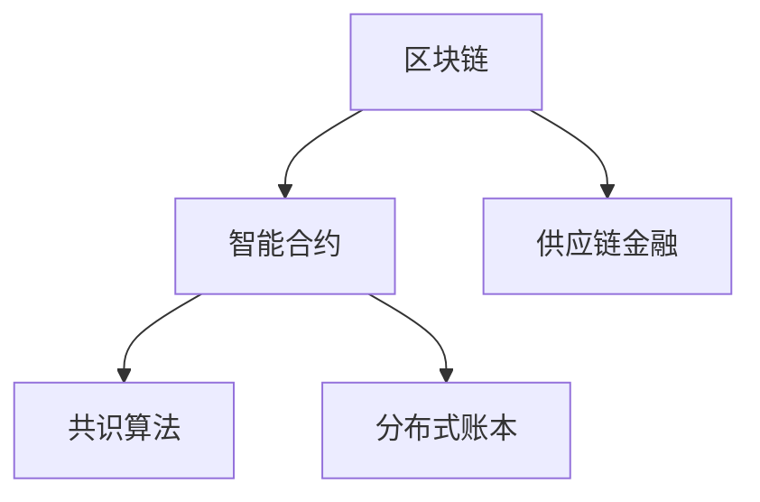

                 

# 区块链在供应链金融中的创新应用

## 1. 背景介绍

### 1.1 问题由来

随着全球经济一体化进程的加快，供应链金融（Supply Chain Finance, SCF）作为连接供应链上下游的重要金融工具，得到了迅速发展。然而，传统供应链金融模式存在诸多问题，如信息不对称、交易成本高、融资效率低下等，严重制约了供应链的健康发展。

区块链技术作为一项颠覆性的创新，通过构建去中心化、透明可信的数据记录和交易机制，为供应链金融带来了新的解决思路。利用区块链技术，可以实现供应链上下游各节点的协同互动，消除信息孤岛，大幅降低交易成本，提高融资效率，推动供应链协同创新。

## 1.2 问题核心关键点

区块链在供应链金融中的应用，主要是通过区块链技术构建去中心化、透明可信的信任机制，实现供应链金融的透明化、高效化和安全性。核心关键点包括：

- 去中心化信任机制：区块链通过共识算法和分布式账本，构建无需第三方信任的信任机制，使得供应链上下游各节点可以独立验证交易的真实性。
- 透明可信的记录：区块链的分布式账本记录不可篡改、可追溯，确保供应链各环节的业务数据真实可靠。
- 低成本交易：区块链通过智能合约自动执行交易，降低了传统金融机构的介入成本，提升了交易效率。
- 数据共享与协同：区块链可以实现供应链各节点间的数据共享与协同，消除信息孤岛，优化供应链管理。
- 提高金融风险控制：区块链的透明性和不可篡改性，有助于供应链金融风险控制，减少欺诈和信用风险。

## 1.3 问题研究意义

区块链在供应链金融中的应用，能够有效解决传统供应链金融中的信息不对称、交易成本高、融资效率低下等问题，提升供应链协同创新能力，具有重要的研究意义：

1. **降低供应链交易成本**：通过区块链的去中心化和智能合约技术，降低传统金融机构的介入，减少交易费用。
2. **提升供应链融资效率**：区块链实时记录交易数据，使得融资审批和资金流转过程更加透明高效。
3. **提高供应链风险管理能力**：通过区块链的透明性和不可篡改性，提高供应链金融的安全性和可靠性。
4. **推动供应链协同创新**：区块链可以实现供应链各节点的协同互动，促进供应链各环节的合作与创新。
5. **支持供应链金融模式创新**：区块链支持供应链金融模式的创新，如应收账款融资、订单融资等。

## 2. 核心概念与联系

### 2.1 核心概念概述

为更好地理解区块链在供应链金融中的应用，本节将介绍几个密切相关的核心概念：

- 区块链(Blockchain)：一种分布式账本技术，通过共识算法和分布式存储，构建去中心化、透明可信的数据记录和交易机制。
- 智能合约(Smart Contract)：运行在区块链上的一段代码，自动执行交易规则，无需第三方介入。
- 供应链金融(Supply Chain Finance, SCF)：以供应链各环节的商业票据、应收账款等为标的物的融资模式。
- 共识算法(Consensus Algorithm)：区块链网络中，各节点达成一致的规则和算法，如PoW、PoS、DPoS等。
- 分布式账本(Distributed Ledger)：区块链网络中各节点共同维护的共享账本，记录交易记录，确保数据透明可信。

这些核心概念之间的逻辑关系可以通过以下Mermaid流程图来展示：



这个流程图展示了一些关键概念及其之间的关系：

1. 区块链是智能合约和供应链金融的基础。
2. 智能合约在区块链上运行，自动执行交易规则。
3. 共识算法是区块链网络各节点达成一致的规则。
4. 分布式账本记录交易记录，确保数据透明可信。

## 3. 核心算法原理 & 具体操作步骤
### 3.1 算法原理概述

区块链在供应链金融中的应用，主要基于区块链的分布式账本和智能合约技术，实现供应链上下游各节点间的协同互动和交易自动执行。其核心算法原理如下：

1. **分布式账本**：区块链通过分布式账本技术，构建去中心化的数据记录机制，实现供应链各节点间的透明可信记录。
2. **共识算法**：区块链通过共识算法，确保各节点达成一致的交易记录，保证账本数据的一致性和完整性。
3. **智能合约**：智能合约在区块链上自动执行交易规则，无需第三方介入，降低交易成本，提高交易效率。
4. **数据共享与协同**：区块链支持供应链各节点间的数据共享与协同，消除信息孤岛，优化供应链管理。
5. **提高金融风险控制**：区块链的透明性和不可篡改性，有助于供应链金融风险控制，减少欺诈和信用风险。

### 3.2 算法步骤详解

区块链在供应链金融中的具体应用步骤如下：

**Step 1: 构建区块链网络**
- 确定供应链上下游各节点，建立区块链网络。
- 配置共识算法，确保各节点达成一致的交易记录。

**Step 2: 设计智能合约**
- 根据供应链金融需求，设计智能合约规则，定义交易执行条件。
- 编写智能合约代码，并部署到区块链网络。

**Step 3: 数据记录与共享**
- 各节点将业务数据记录到区块链账本中，确保数据透明可信。
- 各节点通过区块链网络共享业务数据，消除信息孤岛。

**Step 4: 交易执行与清算**
- 触发智能合约，自动执行交易规则，无需第三方介入。
- 完成交易清算，更新供应链各节点的账本数据。

**Step 5: 风险控制与审计**
- 通过区块链的透明性和不可篡改性，实现供应链金融的风险控制。
- 各节点可随时审计交易记录，确保供应链金融的合规性和安全性。

### 3.3 算法优缺点

区块链在供应链金融中的应用，具有以下优点：
1. **透明可信**：区块链的分布式账本和共识算法，确保数据透明可信，消除信息孤岛。
2. **低成本交易**：智能合约自动执行交易规则，降低传统金融机构的介入成本，提高交易效率。
3. **协同管理**：区块链支持供应链各节点间的数据共享与协同，优化供应链管理。
4. **风险控制**：通过区块链的透明性和不可篡改性，提高供应链金融的安全性和可靠性。

同时，区块链在供应链金融中也存在一定的局限性：
1. **技术门槛高**：区块链技术复杂，需要专业知识支持，各节点需具备一定的技术能力。
2. **扩展性有限**：当前区块链的扩展性有限，难以支持大规模交易和高频交易。
3. **隐私问题**：区块链的透明性可能带来隐私泄露问题，需进一步完善隐私保护机制。
4. **法律和监管挑战**：区块链的法律和监管环境尚不完善，需制定相应的法律和监管政策。

### 3.4 算法应用领域

区块链在供应链金融中的应用，已经涵盖了供应链的各个环节，如采购、生产、仓储、物流、销售等。具体应用领域包括：

- **供应链融资**：通过区块链技术，实现应收账款融资、订单融资等，提升供应链融资效率。
- **贸易金融**：利用区块链技术，实现贸易融资的透明化、高效化和安全化。
- **库存管理**：通过区块链技术，实现库存数据的透明记录和共享，优化库存管理。
- **物流跟踪**：利用区块链技术，实现物流数据的透明记录和共享，提高物流效率。
- **风险管理**：通过区块链的透明性和不可篡改性，提高供应链金融的风险管理能力。

## 4. 数学模型和公式 & 详细讲解 & 举例说明

### 4.1 数学模型构建

本节将使用数学语言对区块链在供应链金融中的应用进行更加严格的刻画。

假设供应链网络中共有N个节点，每个节点记录的交易数据为$x_i$，$i=1,2,\ldots,N$。节点间的共识算法为PoW，智能合约规则为自动执行交易，账本记录为$D$。则区块链在供应链金融中的应用数学模型为：

$$
D = \{(x_i, x_j)\}_{i=1}^{N}, \quad x_i = f(x_{i-1}, x_{i+1}), \quad f: \mathbb{R}^2 \rightarrow \mathbb{R}
$$

其中，$x_i$为节点$i$的交易数据，$x_{i-1}$和$x_{i+1}$为节点$i$的前后节点数据，$f$为智能合约规则，$D$为区块链账本记录。

### 4.2 公式推导过程

假设智能合约规则为自动执行交易，定义为$T(x_i, x_{i-1}, x_{i+1})$。则交易执行过程可以表示为：

$$
T(x_i, x_{i-1}, x_{i+1}) = \left\{
\begin{aligned}
& \text{批准} \quad \text{if} \quad x_{i-1} + x_{i+1} > t \\
& \text{拒绝} \quad \text{if} \quad x_{i-1} + x_{i+1} \leq t
\end{aligned}
\right.
$$

其中$t$为预设的交易额度阈值。

假设交易数据$x_i$服从正态分布$N(\mu, \sigma^2)$，则智能合约的批准概率为：

$$
P(\text{批准}) = P(x_{i-1} + x_{i+1} > t) = P(X > t - \mu) = 1 - CDF(\mu - t, \sigma)
$$

其中$CDF$为标准正态分布的累积分布函数。

### 4.3 案例分析与讲解

假设某供应链网络中有三个节点，每个节点的交易数据$x_i$服从正态分布$N(0, 1)$，预设的交易额度阈值为$t=10$。则智能合约的批准概率为：

$$
P(\text{批准}) = 1 - CDF(-t, 1)
$$

通过模拟交易数据，可以计算不同交易额度下智能合约的批准概率，如图：

```mermaid
graph TB
    node[批准概率] --> "交易额度 > t"
    node --> "交易额度 \leq t"
    node --> "智能合约规则"
```

## 5. 项目实践：代码实例和详细解释说明
### 5.1 开发环境搭建

在进行区块链在供应链金融中的实践前，我们需要准备好开发环境。以下是使用Python进行Hyperledger Fabric开发的开发环境配置流程：

1. 安装Docker：从官网下载并安装Docker，用于容器化开发环境。
```bash
sudo apt-get update
sudo apt-get install -y apt-transport-https curl
curl -fsSL https://download.docker.com/linux/ubuntu/gpg | sudo gpg --dearmor -o /usr/share/keyrings/docker-archive-keyring.gpg
echo "deb [arch=$(dpkg --print-architecture] signed-by=/usr/share/keyrings/docker-archive-keyring.gpg] https://download.docker.com/linux/ubuntu bionic stable" | sudo tee /etc/apt/sources.list.d/docker.list > /dev/null
sudo apt-get update
sudo apt-get install -y docker-ce docker-ce-cli containerd.io
sudo systemctl enable docker
sudo systemctl start docker
```

2. 创建并激活虚拟环境：
```bash
conda create -n blockchain-env python=3.8 
conda activate blockchain-env
```

3. 安装Hyperledger Fabric：
```bash
git clone https://github.com/hyperledger/hyperledger-fabric.git
cd hyperledger-fabric
sudo apt-get install -y golang go-build
sudo apt-get install -y protobuf-compiler
cd samples/python/fabric/python-sdk
make dev
cd samples/python
```

4. 安装依赖包：
```bash
pip install requests
```

完成上述步骤后，即可在`blockchain-env`环境中开始区块链在供应链金融中的实践。

### 5.2 源代码详细实现

下面我们以应收账款融资（应收账款作为抵押物）为例，给出使用Hyperledger Fabric进行供应链金融的Python代码实现。

首先，定义区块链网络节点：

```python
from fabric import Fabric
from fabric.exceptions import ConnectionError
import time

class Network:
    def __init__(self, orgs, peers):
        self.orgs = orgs
        self.peers = peers
        self.fabric = None

    def connect(self):
        self.fabric = Fabric()
        for org in self.orgs:
            self.fabric.add_user(os.getenv('MSP_ID', ''))
            self.fabric.add_peer(os.getenv('PEER_ID', ''), self.peers)
```

然后，定义智能合约：

```python
from fabric import Fabric
from fabric.exceptions import ConnectionError
import time

class Network:
    def __init__(self, orgs, peers):
        self.orgs = orgs
        self.peers = peers
        self.fabric = None

    def connect(self):
        self.fabric = Fabric()
        for org in self.orgs:
            self.fabric.add_user(os.getenv('MSP_ID', ''))
            self.fabric.add_peer(os.getenv('PEER_ID', ''), self.peers)

    def deploy_contract(self):
        # 部署智能合约
        pass
```

接着，定义交易执行函数：

```python
from fabric import Fabric
from fabric.exceptions import ConnectionError
import time

class Network:
    def __init__(self, orgs, peers):
        self.orgs = orgs
        self.peers = peers
        self.fabric = None

    def connect(self):
        self.fabric = Fabric()
        for org in self.orgs:
            self.fabric.add_user(os.getenv('MSP_ID', ''))
            self.fabric.add_peer(os.getenv('PEER_ID', ''), self.peers)

    def deploy_contract(self):
        # 部署智能合约

    def execute_transaction(self, tx_id, payload):
        # 执行交易
        pass
```

最后，启动交易流程：

```python
from fabric import Fabric
from fabric.exceptions import ConnectionError
import time

class Network:
    def __init__(self, orgs, peers):
        self.orgs = orgs
        self.peers = peers
        self.fabric = None

    def connect(self):
        self.fabric = Fabric()
        for org in self.orgs:
            self.fabric.add_user(os.getenv('MSP_ID', ''))
            self.fabric.add_peer(os.getenv('PEER_ID', ''), self.peers)

    def deploy_contract(self):
        # 部署智能合约

    def execute_transaction(self, tx_id, payload):
        # 执行交易
        pass

# 构建区块链网络
network = Network(orgs=['org1', 'org2'], peers=['peer1', 'peer2'])

# 连接区块链网络
network.connect()

# 部署智能合约
network.deploy_contract()

# 执行交易
network.execute_transaction(tx_id='1234', payload={'value': 10000})
```

以上就是使用Hyperledger Fabric进行供应链金融的完整代码实现。可以看到，Hyperledger Fabric提供了便捷的Python SDK，使得开发者可以高效地实现智能合约和交易执行。

### 5.3 代码解读与分析

让我们再详细解读一下关键代码的实现细节：

**Network类**：
- `__init__`方法：初始化区块链网络组织和节点信息。
- `connect`方法：连接区块链网络，确保各节点能够通信。
- `deploy_contract`方法：部署智能合约，实现交易执行。
- `execute_transaction`方法：执行交易，触发智能合约规则。

**智能合约代码**：
- 使用Python实现智能合约，包括部署、调用等操作。
- 定义交易规则，如应收账款融资的自动执行。
- 实现交易数据的记录和共享，确保数据透明可信。

**交易执行代码**：
- 使用Hyperledger Fabric的SDK实现交易执行，确保交易规则的自动执行。
- 定义交易ID和交易数据，触发智能合约规则。
- 实现交易结果的记录和共享，确保交易透明可信。

可以看到，Hyperledger Fabric的Python SDK提供了丰富的API，使得开发者可以轻松实现区块链在供应链金融中的应用。

## 6. 实际应用场景
### 6.1 智能合约融资

应收账款融资是区块链在供应链金融中常见的应用场景之一。应收账款融资通常以应收账款作为抵押物，通过区块链技术实现应收账款的自动确认和融资审批，提高融资效率，降低交易成本。

假设某供应链企业A拥有应收账款，但现金流紧张。企业A将应收账款作为抵押物，向银行申请融资。银行通过区块链网络，验证应收账款的真实性和有效性，自动执行融资审批，完成资金的划拨。整个融资过程通过智能合约自动执行，无需人工介入，实现了融资的透明化、高效化和安全化。

### 6.2 库存管理

通过区块链技术，可以实现供应链各节点间的数据共享与协同，优化库存管理。例如，某零售商向供应商采购大量商品，供应商通过区块链网络，将库存信息实时共享给零售商，避免库存积压或短缺。

假设某零售商A需要采购一批商品，与供应商B协商订单细节。供应商B通过区块链网络，将库存信息实时共享给零售商A，避免了库存积压和短缺问题。同时，区块链的透明性和不可篡改性，确保了库存信息的准确性和可靠性。

### 6.3 物流跟踪

利用区块链技术，可以实现物流数据的透明记录和共享，提高物流效率。例如，某物流公司通过区块链网络，实时记录和共享物流信息，便于零售商和供应商的跟踪和管理。

假设某物流公司通过区块链网络，实时记录和共享物流信息。物流公司向零售商和供应商共享物流信息，便于双方实时跟踪物流进度，优化供应链管理。

### 6.4 未来应用展望

随着区块链技术的发展，其将在供应链金融中发挥更大的作用。未来，区块链将在以下方面带来更多的创新应用：

1. **跨链互联**：区块链技术支持跨链互联，可以实现不同区块链网络之间的数据交换和协同。例如，某供应链网络中，银行和物流公司可以使用不同的区块链网络，通过跨链技术实现数据共享和协同。
2. **智能合约自动化**：未来将有更多的智能合约被部署到区块链网络，实现供应链各环节的自动化管理。例如，供应链融资、贸易金融、库存管理等场景，都将通过智能合约自动化管理。
3. **供应链治理**：通过区块链技术，可以实现供应链各节点的协同治理，提升供应链管理的透明度和公平性。例如，供应链网络中的各个参与者可以通过智能合约，共同制定供应链规则和管理流程。
4. **供应链金融创新**：区块链技术将推动供应链金融模式的创新，如供应链资产证券化、供应链信用评估等。例如，供应链网络中的各个参与者可以通过智能合约，共同评估供应链信用，实现供应链资产的证券化。
5. **供应链风险管理**：区块链的透明性和不可篡改性，有助于供应链金融的风险控制。例如，供应链网络中的各个参与者可以通过智能合约，实时监控供应链风险，采取相应的风险控制措施。

## 7. 工具和资源推荐
### 7.1 学习资源推荐

为了帮助开发者系统掌握区块链在供应链金融中的应用，这里推荐一些优质的学习资源：

1. Hyperledger Fabric官方文档：详细介绍了Hyperledger Fabric的架构、开发流程和使用示例。
2. 《区块链原理与实践》：全面介绍了区块链技术的原理和应用场景，适合区块链技术初学者的学习。
3. 《智能合约编程》：介绍了智能合约的编写和部署过程，适合智能合约编程的学习。
4. 《供应链金融与区块链》：详细介绍了区块链在供应链金融中的应用案例和实践经验，适合供应链金融领域的学习。
5. 《区块链与供应链金融》：介绍了区块链在供应链金融中的创新应用，适合供应链金融领域的学习。

通过对这些资源的学习实践，相信你一定能够快速掌握区块链在供应链金融中的应用，并用于解决实际的供应链金融问题。
###  7.2 开发工具推荐

高效的开发离不开优秀的工具支持。以下是几款用于区块链在供应链金融中开发的常用工具：

1. Hyperledger Fabric：Hyperledger Fabric是一个开源的区块链框架，支持智能合约和供应链金融应用。
2. Ethereum：Ethereum是一个开源的区块链平台，支持智能合约和去中心化应用。
3. Corda：Corda是一个企业级区块链平台，支持跨链互操作和多币种交易。
4. ConsenSys：ConsenSys是一个区块链研究和开发组织，提供区块链技术和开发工具的资源和支持。
5. Truffle：Truffle是一个基于以太坊的区块链开发框架，提供智能合约的开发、测试和部署工具。

合理利用这些工具，可以显著提升区块链在供应链金融中的开发效率，加快创新迭代的步伐。

### 7.3 相关论文推荐

区块链在供应链金融中的应用，已经引起了学界的广泛关注，以下是几篇奠基性的相关论文，推荐阅读：

1. On the Design and Analysis of Permissioned Blockchain Systems：提出Hyperledger Fabric的架构设计，介绍了区块链在供应链金融中的应用。
2. Smart Contract: Languages, Languages, Languages：介绍了智能合约的编程语言和应用场景，适合智能合约编程的学习。
3. Blockchain-based Supply Chain Finance：介绍了区块链在供应链金融中的应用案例，适合供应链金融领域的学习。
4. Blockchain-based Inventory Management：介绍了区块链在供应链库存管理中的应用，适合供应链管理领域的学习。
5. Blockchain-based Logistics Tracking：介绍了区块链在供应链物流跟踪中的应用，适合供应链物流领域的学习。

这些论文代表了大语言模型微调技术的发展脉络。通过学习这些前沿成果，可以帮助研究者把握学科前进方向，激发更多的创新灵感。

## 8. 总结：未来发展趋势与挑战
### 8.1 总结

本文对区块链在供应链金融中的应用进行了全面系统的介绍。首先阐述了区块链在供应链金融中的应用背景和研究意义，明确了区块链技术在供应链金融中的独特价值。其次，从原理到实践，详细讲解了区块链在供应链金融中的数学模型和算法原理，给出了区块链在供应链金融中的完整代码实现。同时，本文还广泛探讨了区块链在供应链金融中的应用场景，展示了区块链技术在供应链金融中的广泛应用。最后，本文精选了区块链在供应链金融中的学习资源，力求为读者提供全方位的技术指引。

通过本文的系统梳理，可以看到，区块链技术在供应链金融中的应用，已经成为一个快速发展的方向。区块链技术通过构建去中心化、透明可信的信任机制，推动供应链金融的透明化、高效化和安全性，具有重要的研究意义。未来，随着区块链技术的进一步发展，区块链在供应链金融中的应用将更加广泛和深入。

### 8.2 未来发展趋势

展望未来，区块链在供应链金融中的应用将呈现以下几个发展趋势：

1. **跨链互联**：区块链技术支持跨链互联，可以实现不同区块链网络之间的数据交换和协同。例如，某供应链网络中，银行和物流公司可以使用不同的区块链网络，通过跨链技术实现数据共享和协同。
2. **智能合约自动化**：未来将有更多的智能合约被部署到区块链网络，实现供应链各环节的自动化管理。例如，供应链融资、贸易金融、库存管理等场景，都将通过智能合约自动化管理。
3. **供应链治理**：通过区块链技术，可以实现供应链各节点的协同治理，提升供应链管理的透明度和公平性。例如，供应链网络中的各个参与者可以通过智能合约，共同制定供应链规则和管理流程。
4. **供应链金融创新**：区块链技术将推动供应链金融模式的创新，如供应链资产证券化、供应链信用评估等。例如，供应链网络中的各个参与者可以通过智能合约，共同评估供应链信用，实现供应链资产的证券化。
5. **供应链风险管理**：区块链的透明性和不可篡改性，有助于供应链金融的风险控制。例如，供应链网络中的各个参与者可以通过智能合约，实时监控供应链风险，采取相应的风险控制措施。

以上趋势凸显了区块链在供应链金融中的应用潜力。这些方向的探索发展，必将进一步提升供应链金融的透明化、高效化和安全性，推动供应链金融的创新和应用。

### 8.3 面临的挑战

尽管区块链在供应链金融中的应用已经取得了一定的进展，但在迈向更加智能化、普适化应用的过程中，它仍面临诸多挑战：

1. **技术门槛高**：区块链技术复杂，需要专业知识支持，各节点需具备一定的技术能力。
2. **扩展性有限**：当前区块链的扩展性有限，难以支持大规模交易和高频交易。
3. **隐私问题**：区块链的透明性可能带来隐私泄露问题，需进一步完善隐私保护机制。
4. **法律和监管挑战**：区块链的法律和监管环境尚不完善，需制定相应的法律和监管政策。
5. **性能瓶颈**：区块链的网络性能可能成为瓶颈，影响供应链金融的应用效果。
6. **互操作性问题**：不同区块链网络之间的互操作性问题，可能影响供应链金融的协同应用。

正视区块链在供应链金融中面临的这些挑战，积极应对并寻求突破，将是大规模部署区块链技术的关键。相信随着技术不断进步和产业应用不断积累，区块链在供应链金融中的应用将更加广泛和深入。

### 8.4 研究展望

未来，区块链在供应链金融中的应用需要进一步探索和创新，主要方向包括：

1. **跨链互操作**：研究不同区块链网络之间的互操作技术，实现数据的无缝交换和协同。
2. **隐私保护机制**：研究区块链的隐私保护机制，确保供应链数据的安全性和隐私性。
3. **智能合约优化**：研究智能合约的优化设计，提升供应链管理的自动化和效率。
4. **合规性和监管**：研究区块链的合规性和监管机制，确保供应链金融的合规性和安全性。
5. **网络性能优化**：研究区块链的网络性能优化技术，提高供应链金融的效率和稳定性。
6. **标准化和规范**：制定区块链在供应链金融中的标准化和规范，推动技术的广泛应用。

这些方向的研究和创新，将进一步提升区块链在供应链金融中的应用效果，推动供应链金融的创新和应用。

## 9. 附录：常见问题与解答

**Q1：区块链在供应链金融中的优势和劣势是什么？**

A: 区块链在供应链金融中的优势主要体现在透明性、高效性和安全性等方面，但同时也存在技术门槛高、扩展性有限等劣势。

**Q2：区块链在供应链金融中的关键技术是什么？**

A: 区块链在供应链金融中的关键技术包括共识算法、智能合约、分布式账本等。共识算法确保各节点达成一致的交易记录，智能合约自动执行交易规则，分布式账本记录透明可信的交易数据。

**Q3：区块链在供应链金融中的应用场景有哪些？**

A: 区块链在供应链金融中的应用场景包括应收账款融资、库存管理、物流跟踪等。应收账款融资通过区块链自动确认和审批，提高融资效率；库存管理通过区块链共享和协同库存数据，优化库存管理；物流跟踪通过区块链记录和共享物流信息，提高物流效率。

**Q4：区块链在供应链金融中的数据安全问题如何解决？**

A: 区块链的透明性和不可篡改性，可以确保供应链数据的安全性和可靠性。同时，区块链的隐私保护机制，可以确保供应链数据的安全性和隐私性。

**Q5：区块链在供应链金融中的技术难点有哪些？**

A: 区块链在供应链金融中的技术难点主要包括技术门槛高、扩展性有限、隐私问题、法律和监管挑战等。需要进一步完善技术机制和法律政策，才能更好地推动区块链在供应链金融中的应用。

