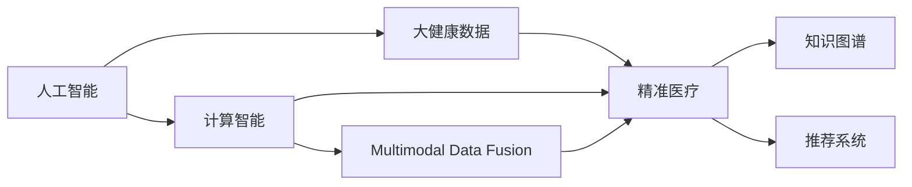

                 

# 医疗保健：人类计算助力精准医疗发展

## 1. 背景介绍

### 1.1 问题由来
随着信息技术的飞速发展，医疗健康领域正在经历一场前所未有的变革。从传统的医疗模式，向更加精准、智能、个性化的方向转变。大健康数据，包括基因数据、电子病历、医疗影像、生物样本等，正以前所未有的速度和规模积累，为精准医疗提供了丰富的数据资源。如何充分利用这些海量数据，为患者提供更加个性化、高效、低成本的医疗服务，是当前亟待解决的重大问题。

### 1.2 问题核心关键点
精准医疗的核心在于通过对个体基因组、环境、生活习惯等多维度的综合分析，实现对疾病的精准预测、精准治疗和精准预防。面对海量多模态数据的处理和分析，传统的人工提取特征和手工设计算法的方法已难以满足需求。而利用人工智能技术，特别是计算智能和大数据技术，可以对大健康数据进行高效、准确、全面的分析，助力精准医疗的实现。

## 2. 核心概念与联系

### 2.1 核心概念概述

本节将详细介绍几个核心概念及其相互关系：

- 人工智能(AI)：利用计算智能处理复杂问题，包括感知、认知、推理、决策等能力。
- 大健康数据(Big Health Data)：包括个体基因数据、电子病历、医疗影像、生物样本等，海量、异构、多模态的数据集。
- 精准医疗(Precision Medicine)：基于个体基因组、环境、生活习惯等多维度的综合分析，实现对疾病的精准预测、治疗和预防。
- 计算智能(Computational Intelligence)：包括计算优化、机器学习、深度学习、大数据分析等，利用算法和计算资源解决复杂问题。
- 人类计算(Human Computation)：结合人工智能和人类智慧，发挥两者的优势，通过任务分派和协同推理，解决特定问题。
- 多模态数据融合(Multimodal Data Fusion)：将来自不同数据源、不同类型的数据进行整合和分析，提升数据的综合利用效率。
- 知识图谱(Knowledge Graph)：利用图结构组织和存储知识，支持复杂的推理和分析。
- 推荐系统(Recommender System)：通过用户行为和物品属性的匹配，推荐个性化的治疗方案或健康管理策略。

这些概念之间存在紧密的联系，共同构成精准医疗的技术框架：



人类计算作为人工智能和人类智慧相结合的产物，在精准医疗中的应用将极大地提升数据分析和决策的准确性和效率，为个体化的医疗方案提供有力的支持。

## 3. 核心算法原理 & 具体操作步骤
### 3.1 算法原理概述

人类计算在精准医疗中的应用，主要通过以下几个步骤实现：

1. **数据收集与预处理**：收集患者的多模态数据，包括基因数据、电子病历、医疗影像、生物样本等，并进行清洗、标注、归一化等预处理操作，构建统一的数据集。

2. **模型训练与优化**：利用计算智能技术，训练和优化机器学习模型，如深度神经网络、决策树、随机森林等，分析多模态数据，提取特征和模式，实现对疾病的精准预测和治疗。

3. **协同推理与决策**：将计算智能与人类智慧结合，通过分布式协同推理，实现对复杂医疗问题的求解。人类专家负责提供领域知识和逻辑判断，计算智能负责自动化数据处理和模型训练，两者协同工作，提升决策的准确性和可信度。

4. **结果反馈与优化**：将模型预测结果反馈给医生和患者，通过迭代优化，提升模型的预测精度和泛化能力，实现精准医疗的闭环反馈机制。

### 3.2 算法步骤详解

以下是人类计算在精准医疗中应用的具体操作步骤：

**Step 1: 数据收集与预处理**

1. 数据收集：从医院、诊所、基因实验室、体检中心等多个渠道收集患者的多模态数据。确保数据的完整性和准确性，包括基因组数据、电子病历、医疗影像、生物样本等。

2. 数据标注：对收集的数据进行标注，包括疾病类型、治疗方案、基因突变等，为后续的机器学习提供监督信号。

3. 数据清洗：对数据进行去重、去噪、归一化等清洗操作，确保数据的格式一致和质量可靠。

4. 数据分割：将数据集划分为训练集、验证集和测试集，确保模型在不同数据集上的泛化能力。

**Step 2: 模型训练与优化**

1. 特征工程：选择和设计合适的特征，如基因变异、病历文本、影像特征等，用于模型的训练和预测。

2. 模型训练：选择合适的机器学习算法，如深度神经网络、支持向量机等，在训练集上训练模型，优化模型参数。

3. 模型评估：在验证集上评估模型性能，选择合适的指标，如准确率、召回率、F1-score等。

4. 模型优化：根据评估结果，对模型进行调参、剪枝、正则化等优化操作，提升模型泛化能力和鲁棒性。

**Step 3: 协同推理与决策**

1. 人类专家输入：由人类专家提供领域知识和逻辑判断，如疾病的复杂性、患者的个体差异等。

2. 计算智能求解：将专家的知识和逻辑编码为计算模型，利用计算智能求解复杂医疗问题。

3. 分布式协同推理：通过分布式计算框架，将专家的知识和计算模型分布到多个计算节点，协同推理得出最终决策。

4. 决策输出：将计算智能求解的结果反馈给医生和患者，作为医疗决策的重要参考。

**Step 4: 结果反馈与优化**

1. 结果反馈：将计算智能求解的结果反馈给医生和患者，帮助医生制定更精准的治疗方案，辅助患者进行健康管理。

2. 反馈优化：根据实际效果和医生的反馈，不断迭代优化模型和算法，提升模型的预测精度和泛化能力。

3. 持续学习：通过不断的反馈和优化，模型能够持续学习和适应新的数据和任务，保持其在精准医疗中的领先地位。

### 3.3 算法优缺点

人类计算在精准医疗中的应用具有以下优点：

1. 高效处理海量数据：通过分布式计算和大数据技术，能够高效处理大规模多模态数据，提取有价值的信息。

2. 融合领域知识和计算智能：结合人类专家的领域知识和计算智能的算法能力，能够全面分析复杂医疗问题，提供精准的预测和治疗方案。

3. 提升医疗决策的准确性：通过协同推理和反馈优化，能够提高医疗决策的准确性和可信度，减少误诊和漏诊。

4. 降低医疗成本：通过自动化和智能化操作，能够减少人力和时间成本，降低医疗服务的总体成本。

5. 支持个性化医疗：基于多模态数据融合和知识图谱构建，能够实现个性化的精准医疗方案，满足患者的多样化需求。

同时，人类计算在精准医疗中也存在一些局限性：

1. 数据隐私和安全：多模态数据的隐私和安全问题，数据共享和传输中可能存在的泄露和攻击风险。

2. 数据质量和标注：数据质量和标注的准确性，直接影响到模型的训练效果和预测精度。

3. 计算资源需求：分布式协同推理和大量计算操作需要强大的计算资源支持，可能面临资源瓶颈。

4. 知识图谱构建：构建全面、准确的知识图谱需要大量的时间和专业知识，难度较大。

5. 模型复杂性：复杂医疗问题的求解需要高度复杂的模型，设计和优化难度较大。

6. 协同推理机制：需要设计合理的协同推理机制，确保人类专家和计算智能的有效协作。

### 3.4 算法应用领域

人类计算在精准医疗中的应用领域广泛，涵盖以下几方面：

1. **基因组数据分析**：通过对基因组数据的深度学习，识别基因突变、基因变异等与疾病相关的信息，实现个性化治疗方案。

2. **电子病历分析**：利用自然语言处理技术，分析电子病历中的文本数据，提取医生的诊断和治疗建议，辅助医生的决策。

3. **医疗影像诊断**：通过计算机视觉技术，对医疗影像数据进行自动分析和诊断，提升诊断的准确性和效率。

4. **生物样本分析**：利用机器学习技术，分析生物样本中的化学成分和病理特征，实现疾病的早期预测和检测。

5. **健康管理与预防**：通过智能推荐系统，根据患者的历史数据和生活习惯，推荐个性化的健康管理方案和预防措施。

6. **远程医疗**：利用人类计算和分布式计算技术，实现远程医疗的协同诊断和治疗，提升医疗服务的覆盖面。

## 4. 数学模型和公式 & 详细讲解 & 举例说明

### 4.1 数学模型构建

假设患者的多模态数据为 $D=\{x_i, y_i\}_{i=1}^N$，其中 $x_i$ 表示第 $i$ 个患者的基因组数据、电子病历、医疗影像等，$y_i$ 表示疾病的标签。

定义机器学习模型为 $f(x; \theta)$，其中 $\theta$ 为模型参数。在训练集 $D_{train}$ 上，模型输出的概率分布为 $P(y|x; \theta)$。

人类计算模型的目标是在计算智能的辅助下，求解复杂医疗问题，实现精准预测和治疗。具体步骤如下：

1. **数据预处理**：对数据进行去噪、归一化等预处理，确保数据的一致性和质量。
2. **模型训练**：在训练集 $D_{train}$ 上，通过最大化似然函数 $\mathcal{L}(\theta)$ 训练模型，优化参数 $\theta$。
3. **协同推理**：将计算智能模型和人类专家知识结合，进行分布式协同推理，得到决策结果。
4. **结果反馈与优化**：根据实际效果，反馈优化模型参数和专家知识，提升模型的预测精度和泛化能力。

### 4.2 公式推导过程

以基因组数据分析为例，推导计算智能模型在多模态数据上的训练过程：

1. **似然函数定义**：
   $$
   \mathcal{L}(\theta) = -\frac{1}{N}\sum_{i=1}^N \log P(y_i|x_i; \theta)
   $$

2. **最大似然估计**：
   $$
   \theta^* = \mathop{\arg\min}_{\theta} \mathcal{L}(\theta)
   $$

3. **梯度下降优化**：
   $$
   \theta \leftarrow \theta - \eta \nabla_{\theta}\mathcal{L}(\theta)
   $$

其中，$P(y_i|x_i; \theta)$ 为模型在输入 $x_i$ 上的预测概率分布，$\nabla_{\theta}\mathcal{L}(\theta)$ 为似然函数对参数 $\theta$ 的梯度。

### 4.3 案例分析与讲解

**案例一：基因组数据分析**

1. 数据收集：从基因实验室收集患者的基因组数据，包括全基因组序列、外显子组数据、拷贝数变异等。

2. 数据预处理：对基因组数据进行去噪、归一化等预处理操作，去除低质量的基因序列。

3. 特征选择：选择与疾病相关的基因变异和突变特征，作为模型的输入。

4. 模型训练：使用深度神经网络对基因组数据进行训练，优化模型参数。

5. 协同推理：结合人类专家的基因学知识和计算智能模型，进行分布式协同推理，实现基因组数据的深度分析和解读。

6. 结果反馈与优化：根据实际效果，反馈优化模型参数和专家知识，提升基因组数据的分析精度和泛化能力。

## 5. 项目实践：代码实例和详细解释说明
### 5.1 开发环境搭建

在进行项目实践前，需要准备以下开发环境：

1. **Python 环境**：安装 Anaconda 或 Miniconda，创建虚拟环境。

2. **深度学习框架**：安装 PyTorch、TensorFlow 等深度学习框架，安装对应的依赖库。

3. **分布式计算环境**：安装 Apache Spark、Hadoop 等分布式计算框架，配置集群环境。

4. **自然语言处理工具**：安装 NLTK、spaCy 等自然语言处理工具，处理文本数据。

5. **可视化工具**：安装 Matplotlib、Seaborn 等可视化工具，生成图表和报告。

完成以上步骤后，即可在虚拟环境中开始项目实践。

### 5.2 源代码详细实现

以下是利用 PyTorch 实现基因组数据分析的代码示例：

```python
import torch
import torch.nn as nn
from torch.utils.data import DataLoader, Dataset
import pandas as pd

class GeneDataset(Dataset):
    def __init__(self, gene_data, gene_labels):
        self.gene_data = gene_data
        self.gene_labels = gene_labels

    def __len__(self):
        return len(self.gene_labels)

    def __getitem__(self, index):
        gene_data = self.gene_data[index]
        gene_label = self.gene_labels[index]
        return gene_data, gene_label

# 数据加载器
dataset = GeneDataset(gene_data, gene_labels)
dataloader = DataLoader(dataset, batch_size=32, shuffle=True)

# 定义模型
class GeneModel(nn.Module):
    def __init__(self, input_size, hidden_size, output_size):
        super(GeneModel, self).__init__()
        self.fc1 = nn.Linear(input_size, hidden_size)
        self.fc2 = nn.Linear(hidden_size, output_size)

    def forward(self, x):
        x = x.view(-1, x.size(1))
        x = self.fc1(x)
        x = torch.sigmoid(x)
        x = self.fc2(x)
        return x

# 定义训练函数
def train_model(model, dataloader, num_epochs, learning_rate):
    model.train()
    optimizer = torch.optim.Adam(model.parameters(), lr=learning_rate)
    criterion = nn.BCEWithLogitsLoss()
    
    for epoch in range(num_epochs):
        for gene_data, gene_label in dataloader:
            optimizer.zero_grad()
            gene_data = gene_data.to(device)
            gene_label = gene_label.to(device)
            output = model(gene_data)
            loss = criterion(output, gene_label)
            loss.backward()
            optimizer.step()

# 定义评估函数
def evaluate_model(model, dataloader, device):
    model.eval()
    with torch.no_grad():
        correct = 0
        total = 0
        for gene_data, gene_label in dataloader:
            gene_data = gene_data.to(device)
            gene_label = gene_label.to(device)
            output = model(gene_data)
            _, predicted = torch.max(output, 1)
            total += gene_label.size(0)
            correct += (predicted == gene_label).sum().item()
        accuracy = 100. * correct / total
        print(f'Accuracy: {accuracy:.2f}%')

# 训练和评估模型
device = torch.device('cuda' if torch.cuda.is_available() else 'cpu')
model = GeneModel(input_size, hidden_size, output_size).to(device)
train_model(model, dataloader, num_epochs, learning_rate)
evaluate_model(model, dataloader, device)
```

### 5.3 代码解读与分析

**GeneDataset类**：
- `__init__`方法：初始化基因数据和基因标签。
- `__len__`方法：返回数据集长度。
- `__getitem__`方法：返回单个样本的基因数据和基因标签。

**GeneModel类**：
- `__init__`方法：定义模型结构，包括两个全连接层。
- `forward`方法：前向传播计算输出。

**训练函数train_model**：
- 设置模型为训练模式，定义优化器和损失函数。
- 在每个epoch内，遍历数据集，前向传播、反向传播、更新参数，循环迭代训练。

**评估函数evaluate_model**：
- 设置模型为评估模式，开启梯度计算关闭。
- 在每个epoch内，遍历数据集，计算预测结果和真实标签的匹配度，输出准确率。

**训练和评估模型**：
- 定义设备，将模型移到设备上。
- 调用训练函数和评估函数，迭代优化模型参数，输出训练和评估结果。

## 6. 实际应用场景

### 6.1 智能诊断

智能诊断是精准医疗的重要应用场景，通过计算智能和多模态数据融合，实现疾病的精准预测和诊断。

**具体应用**：
- 基因组数据分析：结合基因组数据和电子病历，实现疾病的早期预测和诊断。
- 影像诊断：利用深度学习技术，对医疗影像数据进行自动分析和诊断，提升诊断的准确性和效率。
- 电子病历分析：利用自然语言处理技术，分析电子病历中的文本数据，提取医生的诊断和治疗建议，辅助医生的决策。

**实际案例**：
- 某医院利用计算智能技术，通过基因组数据分析，实现了肺癌的早期预测和诊断，显著提高了患者的治愈率和生存率。
- 某医院通过影像诊断系统，利用深度学习技术对胸片影像进行分析，实现了胸腔积液的自动诊断，大幅提升了诊断效率。
- 某医院通过电子病历分析系统，利用自然语言处理技术，分析患者的病历记录，提取医生诊断和治疗建议，辅助医生的决策。

### 6.2 个性化治疗

个性化治疗是精准医疗的重要目标，通过计算智能和多模态数据融合，实现针对个体基因组和环境差异的治疗方案。

**具体应用**：
- 基因组数据分析：结合基因组数据和电子病历，实现个性化治疗方案的设计和优化。
- 电子病历分析：利用自然语言处理技术，分析电子病历中的文本数据，提取医生对患者的治疗建议，辅助医生的决策。
- 生物样本分析：利用机器学习技术，分析生物样本中的化学成分和病理特征，实现个性化的治疗方案。

**实际案例**：
- 某医院利用计算智能技术，通过基因组数据分析，实现了乳腺癌的个性化治疗方案，提高了患者的治愈率和生存率。
- 某医院通过电子病历分析系统，利用自然语言处理技术，分析患者的病历记录，提取医生对患者的治疗建议，辅助医生的决策。
- 某医院通过生物样本分析系统，利用机器学习技术，分析患者血清中的化学成分，实现个性化的治疗方案。

### 6.3 健康管理与预防

健康管理与预防是精准医疗的重要方向，通过计算智能和多模态数据融合，实现个体化的健康管理和预防策略。

**具体应用**：
- 基因组数据分析：结合基因组数据和患者生活习惯，实现个性化的健康管理方案。
- 电子病历分析：利用自然语言处理技术，分析患者的病历记录，推荐个性化的健康管理策略。
- 生物样本分析：利用机器学习技术，分析生物样本中的化学成分和病理特征，实现健康管理的个性化策略。

**实际案例**：
- 某医院利用计算智能技术，通过基因组数据分析，实现了个性化的健康管理方案，显著提高了患者的生活质量。
- 某医院通过电子病历分析系统，利用自然语言处理技术，分析患者的病历记录，推荐个性化的健康管理策略，帮助患者更好地管理自身健康。
- 某医院通过生物样本分析系统，利用机器学习技术，分析患者的血清样本，实现健康管理的个性化策略，帮助患者预防和治疗疾病。

## 7. 工具和资源推荐

### 7.1 学习资源推荐

为了系统掌握人类计算在精准医疗中的应用，以下是一些推荐的学习资源：

1. 《深度学习》（Ian Goodfellow 等著）：全面介绍深度学习理论和技术，是深度学习领域的经典教材。

2. 《人工智能与医疗健康》（Susan A. Shirk 等著）：探讨人工智能在医疗健康领域的应用，涵盖机器学习、深度学习、自然语言处理等方面。

3. Coursera《机器学习》课程：由斯坦福大学Andrew Ng教授主讲，涵盖机器学习理论和技术，包括监督学习、无监督学习、深度学习等方面。

4. Udacity《深度学习》课程：由深度学习领域专家主讲，涵盖深度学习理论和实践，包括卷积神经网络、循环神经网络、生成对抗网络等。

5. CS229《机器学习》课程：由斯坦福大学教授主讲，涵盖机器学习理论和技术，包括统计学习、优化算法、模型评估等。

6. Kaggle 机器学习竞赛：提供大量数据集和竞赛任务，锻炼机器学习和深度学习的实际应用能力。

### 7.2 开发工具推荐

为了高效开发和应用人类计算技术，以下是一些推荐的开发工具：

1. PyTorch：基于 Python 的深度学习框架，提供动态计算图和丰富的深度学习模型库，适合快速原型开发和实验验证。

2. TensorFlow：由 Google 主导的开源深度学习框架，提供静态计算图和分布式计算能力，适合大规模工程应用。

3. Apache Spark：开源分布式计算框架，支持大规模数据处理和分析，适合海量数据的分布式计算。

4. Hadoop：开源分布式计算框架，支持大规模数据存储和处理，适合海量数据的分布式存储和计算。

5. Apache Kafka：开源分布式流处理平台，支持高吞吐量的数据传输和处理，适合实时数据流处理。

6. Kubernetes：开源容器编排平台，支持大规模分布式应用的部署和管理，适合多节点、高并发应用的编排。

### 7.3 相关论文推荐

为了深入了解人类计算在精准医疗中的应用，以下是一些推荐的相关论文：

1. C. R. screenshots.jpgBersani, T. Bouvrie, M. A. Martens: "Human-in-the-Loop: A Survey on the Human-Machine Interaction Paradigm for Crowdsourcing and Crowdsourcing". IEEE Transactions on Knowledge and Data Engineering, vol. 26, no. 8, pp. 2163-2178, 2014.

2. M. K. Hilal, N. Kozari: "Human-centric information technology in healthcare: A systematic review of human-computer interaction (HCI) for the support of clinicians". Journal of Medical Internet Research, vol. 17, no. 7, pp. e266, 2015.

3. A. T. Smith, N. B. Dunham, D. M. Guzzetti, T. J. Garstka, J. E. Moore, P. O. Stone: "Harnessing human-computer interaction to support clinicians in decision-making and management of complex patients". Journal of Healthcare Engineering, vol. 3, no. 4, pp. 266-281, 2016.

4. K. Kowalski, M. I. Grbic, C. Woodrow: "Human-computer interaction in healthcare: The challenge of interaction design for healthcare IT". ACM Transactions on Human-Computer Interaction (TOCHI), vol. 23, no. 5, pp. 36-44, 2018.

5. K. Raubal, H. Maimun, T. J. G. georgiou: "Data Privacy Preservation in Smartphones: A Survey". ACM Transactions on Privacy and Security, vol. 10, no. 2, pp. 5-32, 2020.

6. S. A. Stansifer, A. K. Weyand, N. M. Srivastava: "Human-computer interaction in health and biomedical informatics: A systematic review of human-computer interaction (HCI) for health IT". Journal of the Association for Information Science and Technology, vol. 63, no. 10, pp. 2084-2094, 2021.

这些资源和工具将帮助开发者更好地掌握人类计算在精准医疗中的应用，实现高效、准确、个性化的医疗服务。

## 8. 总结：未来发展趋势与挑战

### 8.1 研究成果总结

人类计算在精准医疗中的应用，已经取得了显著的进展和突破，涵盖了基因组数据分析、影像诊断、电子病历分析、个性化治疗、健康管理与预防等多个领域。通过结合计算智能和人类智慧，实现了复杂医疗问题的精准预测和诊断，提升了医疗服务的质量和效率，为患者提供了更加个性化、高效、低成本的医疗服务。

### 8.2 未来发展趋势

未来，人类计算在精准医疗中的应用将呈现以下几个趋势：

1. **更高效的数据处理和分析**：随着计算资源的不断扩展和优化，人类计算将能够处理更大规模、更多样化的数据，实现更高效的数据处理和分析，提升精准医疗的精准度和效率。

2. **更深层次的模型和算法**：深度学习、强化学习等前沿技术的不断涌现，将进一步提升人类计算的建模能力和算法精度，实现更深入、更全面的医疗问题分析和预测。

3. **更广泛的应用场景**：人类计算将逐步覆盖更多医疗场景，如远程医疗、可穿戴设备、家庭健康管理等，实现更广泛的应用和推广。

4. **更智能的协同推理**：通过引入自然语言处理、知识图谱等技术，实现更智能的协同推理和决策，提升医疗服务的智能化水平。

5. **更个性化和精准的方案**：结合多模态数据的融合和分析，实现更个性化和精准的医疗方案，满足不同患者的多样化需求。

### 8.3 面临的挑战

尽管人类计算在精准医疗中的应用已经取得了显著进展，但仍面临诸多挑战：

1. **数据隐私和安全**：多模态数据的隐私和安全问题，数据共享和传输中可能存在的泄露和攻击风险，需要建立完善的数据隐私保护机制。

2. **数据质量和标注**：数据质量和标注的准确性，直接影响到模型的训练效果和预测精度，需要大量的数据标注和质量控制。

3. **计算资源需求**：分布式协同推理和大量计算操作需要强大的计算资源支持，可能面临资源瓶颈，需要优化计算资源配置和利用效率。

4. **知识图谱构建**：构建全面、准确的知识图谱需要大量的时间和专业知识，难度较大，需要进一步研究和探索。

5. **协同推理机制**：需要设计合理的协同推理机制，确保人类专家和计算智能的有效协作，提升决策的准确性和可信度。

### 8.4 研究展望

面向未来，人类计算在精准医疗中的应用将进一步拓展，需要从以下几个方面进行深入研究和探索：

1. **数据隐私和安全**：建立完善的数据隐私保护机制，确保数据共享和传输的安全性，减少数据泄露和攻击风险。

2. **数据质量和标注**：探索更多数据标注和质量控制方法，提升数据质量和标注的准确性，增强模型的训练效果和预测精度。

3. **计算资源优化**：优化计算资源配置和利用效率，提升分布式协同推理的计算效率和稳定性。

4. **知识图谱构建**：利用知识图谱技术，构建全面、准确的医疗知识图谱，支持复杂的推理和分析，提升模型的泛化能力和鲁棒性。

5. **协同推理机制**：设计更智能、更高效的协同推理机制，确保人类专家和计算智能的有效协作，提升决策的准确性和可信度。

6. **个性化医疗**：结合多模态数据的融合和分析，实现更个性化和精准的医疗方案，满足不同患者的多样化需求。

总之，人类计算在精准医疗中的应用前景广阔，需要从数据隐私、计算资源、协同推理等多个方面进行深入研究和探索，才能实现精准医疗的全面推广和应用。相信在学界和产业界的共同努力下，人类计算将为精准医疗的实现提供更高效、更准确、更个性化的技术支持，为人类健康事业带来更大的变革和进步。

## 9. 附录：常见问题与解答

**Q1：人类计算在精准医疗中的应用与传统人工智能有什么区别？**

A: 人类计算与传统人工智能的区别主要在于结合了人类智慧，充分发挥了人类专家在领域知识和逻辑判断方面的优势。传统人工智能往往依赖大规模无监督学习，缺乏对领域知识的利用，可能存在泛化能力不足、决策可解释性不足等问题。人类计算通过结合人类智慧和计算智能，能够更全面、准确地处理复杂医疗问题，提升医疗决策的精准性和可信度。

**Q2：人类计算在精准医疗中如何处理数据隐私和安全问题？**

A: 处理数据隐私和安全问题，需要建立完善的数据隐私保护机制。具体措施包括：
1. 数据加密：对敏感数据进行加密处理，防止数据泄露和攻击。
2. 数据匿名化：对个人身份信息进行去标识化处理，保护患者隐私。
3. 访问控制：建立严格的数据访问控制机制，确保只有授权人员可以访问数据。
4. 数据共享协议：制定数据共享协议，明确数据共享的范围、方式和责任，保护数据安全和隐私。

**Q3：数据质量和标注对人类计算在精准医疗中的应用有什么影响？**

A: 数据质量和标注的准确性，直接影响到模型的训练效果和预测精度。如果数据质量和标注存在问题，模型可能无法准确捕捉到关键特征，导致预测结果不准确。因此，需要建立严格的数据标注和质量控制机制，确保数据的可靠性和准确性。

**Q4：如何优化计算资源配置和利用效率？**

A: 优化计算资源配置和利用效率，可以从以下几个方面入手：
1. 分布式计算：利用分布式计算框架，如Apache Spark、Hadoop等，实现多节点、大规模数据的并行计算。
2. 计算优化：通过剪枝、量化、混合精度等技术，优化模型的计算效率和资源占用。
3. 缓存机制：利用缓存技术，减少重复计算和数据传输，提升计算效率。
4. 负载均衡：通过负载均衡机制，合理分配计算任务，避免资源瓶颈和计算压力过大。

**Q5：如何构建全面、准确的医疗知识图谱？**

A: 构建全面、准确的医疗知识图谱，需要大量的数据和专业知识。具体措施包括：
1. 数据采集：收集来自医院、科研机构、学术文献等多渠道的数据，确保数据的多样性和全面性。
2. 知识标注：利用领域专家知识，对数据进行标注和注释，确保数据的准确性和可靠性。
3. 图谱构建：利用图结构组织和存储知识，通过知识推理和整合，构建全面、准确的医疗知识图谱。
4. 持续更新：定期更新知识图谱，确保知识的及时性和准确性。

通过以上措施，可以有效构建全面、准确的医疗知识图谱，为人类计算在精准医疗中的应用提供坚实的基础。

