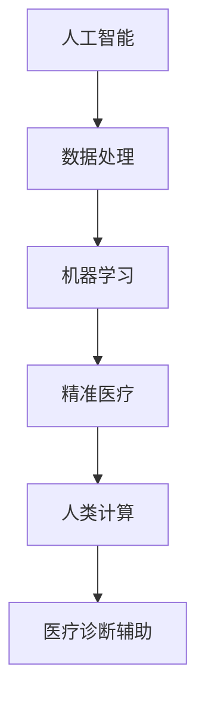

                 

## 1. 背景介绍

随着人工智能技术的不断发展和应用，其在医疗领域的潜力逐渐显现。特别是在精准医疗方面，人工智能技术通过人类计算助力，能够实现高效、精准的诊断和治疗决策。本文将深入探讨人工智能在医疗诊断辅助中的应用，包括算法原理、具体实现以及未来展望。

## 2. 核心概念与联系

### 2.1 核心概念概述

为了更好地理解人工智能在医疗诊断辅助中的应用，首先需要明确几个关键概念：

- **人工智能(AI)**：通过计算机程序模拟人类智能的技术，包括机器学习、深度学习、自然语言处理等。
- **精准医疗(Precision Medicine)**：基于个体基因、环境和生活方式等数据，制定个性化治疗方案的医疗模式。
- **人类计算(Computational Humanities)**：通过计算和数据分析技术，研究和探索人类社会、文化和历史等领域的问题。

这些概念之间存在紧密联系，共同构成了人工智能在医疗领域的应用框架。通过人类计算，人工智能能够从海量医疗数据中提取有价值的信息，实现精准医疗的目标。

### 2.2 核心概念原理和架构的 Mermaid 流程图



这个流程图展示了人工智能、数据处理、机器学习、精准医疗、人类计算和医疗诊断辅助之间的联系。数据处理、机器学习和精准医疗是人工智能在医疗领域的主要应用路径，而人类计算则是实现精准医疗的重要手段。医疗诊断辅助是这些技术应用的最终目标，旨在提高医疗服务的效率和质量。

## 3. 核心算法原理 & 具体操作步骤

### 3.1 算法原理概述

人工智能在医疗诊断辅助中的应用主要基于机器学习和深度学习的原理。通过训练模型，人工智能可以从医疗数据中提取特征，进行疾病诊断和预测。常用的算法包括：

- **决策树算法**：通过构建决策树模型，实现对疾病的分类和预测。
- **支持向量机(SVM)**：通过寻找最优的超平面，实现对疾病的分类和预测。
- **随机森林算法**：通过集成多个决策树，提高模型的准确性和鲁棒性。
- **卷积神经网络(CNN)**：用于图像识别和分析，提取病变区域的特征，实现病理诊断。
- **循环神经网络(RNN)**：用于时间序列数据的处理，如心电图分析。
- **深度学习模型**：如BERT、GPT等预训练模型，用于文本数据的处理和分析，如病历分析。

这些算法通过训练模型，从数据中提取特征，实现对疾病的诊断和预测。

### 3.2 算法步骤详解

#### 3.2.1 数据准备

- **数据收集**：收集医疗数据，包括病历、影像、基因数据等。数据来源包括医院、研究机构、公共数据库等。
- **数据清洗**：对数据进行清洗，去除噪声、缺失值和不一致的数据，确保数据的质量。
- **数据标注**：对数据进行标注，包括疾病分类、病灶位置等。标注数据可以来自医学专家或通过自动标注工具完成。

#### 3.2.2 模型训练

- **模型选择**：根据任务特点选择合适的机器学习或深度学习模型。例如，对于图像数据，可以选择卷积神经网络；对于文本数据，可以选择预训练模型如BERT。
- **模型训练**：使用标注数据对模型进行训练，通过前向传播和反向传播更新模型参数，最小化损失函数。
- **模型评估**：使用验证集对训练好的模型进行评估，选择最优的模型参数。常用的评估指标包括准确率、召回率、F1分数等。

#### 3.2.3 模型应用

- **数据输入**：将待诊断的病历、影像或基因数据输入模型。
- **模型预测**：模型输出诊断结果，如疾病分类、病灶位置等。
- **结果解释**：对模型的预测结果进行解释，提供诊断建议和参考。

### 3.3 算法优缺点

#### 3.3.1 优点

- **高效性**：通过机器学习和深度学习模型，可以快速处理大量医疗数据，实现高效诊断。
- **准确性**：经过充分训练的模型具有较高的准确性和鲁棒性，能够减少误诊和漏诊。
- **可解释性**：通过解释模型的预测过程，帮助医生理解诊断依据，提高决策质量。

#### 3.3.2 缺点

- **数据依赖**：模型训练和应用依赖于高质量的医疗数据，数据不足或数据质量不高会影响模型的效果。
- **模型复杂度**：深度学习模型复杂度高，训练和推理计算资源消耗大。
- **隐私保护**：医疗数据涉及隐私保护，需要采取严格的数据保护措施。

### 3.4 算法应用领域

人工智能在医疗诊断辅助中的应用领域广泛，主要包括以下几个方面：

- **病理诊断**：通过图像识别技术，对病变区域进行诊断，如乳腺癌、肺癌等。
- **基因诊断**：通过对基因数据进行分析，预测遗传病和癌症风险，如乳腺癌基因检测。
- **影像分析**：通过对影像数据进行分析，实现疾病检测和分期，如CT、MRI等。
- **心电图分析**：通过对心电图数据进行分析，实现心律失常和心脏病的诊断。
- **病历分析**：通过文本分析技术，提取病历中的关键信息，辅助诊断和治疗决策。

这些应用领域展示了人工智能在医疗诊断辅助中的巨大潜力。

## 4. 数学模型和公式 & 详细讲解 & 举例说明

### 4.1 数学模型构建

#### 4.1.1 病理诊断模型

病理诊断模型主要基于卷积神经网络(CNN)。CNN通过卷积层和池化层提取病变区域的特征，再通过全连接层进行分类。

```python
from keras.models import Sequential
from keras.layers import Conv2D, MaxPooling2D, Flatten, Dense

model = Sequential()
model.add(Conv2D(32, (3, 3), activation='relu', input_shape=(128, 128, 3)))
model.add(MaxPooling2D(pool_size=(2, 2)))
model.add(Conv2D(64, (3, 3), activation='relu'))
model.add(MaxPooling2D(pool_size=(2, 2)))
model.add(Flatten())
model.add(Dense(128, activation='relu'))
model.add(Dense(1, activation='sigmoid'))

model.compile(optimizer='adam', loss='binary_crossentropy', metrics=['accuracy'])
```

#### 4.1.2 基因诊断模型

基因诊断模型主要基于支持向量机(SVM)。SVM通过寻找最优的超平面，实现对遗传病的分类和预测。

```python
from sklearn.svm import SVC
from sklearn.model_selection import train_test_split
from sklearn.metrics import accuracy_score

X_train, X_test, y_train, y_test = train_test_split(X, y, test_size=0.2, random_state=42)

svm = SVC(kernel='linear')
svm.fit(X_train, y_train)

y_pred = svm.predict(X_test)
accuracy = accuracy_score(y_test, y_pred)
```

### 4.2 公式推导过程

#### 4.2.1 病理诊断模型公式推导

病理诊断模型的目标函数为：

$$
\min_{\theta} \frac{1}{2N} \sum_{i=1}^N ||y - f(x; \theta)||^2
$$

其中 $N$ 为样本数量，$y$ 为实际标签，$f(x; \theta)$ 为模型预测结果。

#### 4.2.2 基因诊断模型公式推导

基因诊断模型的目标函数为：

$$
\min_{\theta} \frac{1}{2N} \sum_{i=1}^N (y - f(x; \theta))^2
$$

其中 $N$ 为样本数量，$y$ 为实际标签，$f(x; \theta)$ 为模型预测结果。

### 4.3 案例分析与讲解

#### 4.3.1 病理诊断案例

假设有一个乳腺癌的病理图像数据集，使用CNN模型进行训练和测试。训练集包含1000个样本，测试集包含200个样本。使用10个epoch进行训练，每epoch取1000个batch。

```python
from keras.datasets import cifar10
from keras.utils import to_categorical

(X_train, y_train), (X_test, y_test) = cifar10.load_data()
X_train = X_train / 255.0
X_test = X_test / 255.0
y_train = to_categorical(y_train)
y_test = to_categorical(y_test)

model.compile(optimizer='adam', loss='categorical_crossentropy', metrics=['accuracy'])
model.fit(X_train, y_train, epochs=10, batch_size=100)
```

训练后，使用测试集进行评估：

```python
loss, accuracy = model.evaluate(X_test, y_test)
print('Test loss:', loss)
print('Test accuracy:', accuracy)
```

#### 4.3.2 基因诊断案例

假设有一个遗传病基因数据集，使用SVM模型进行训练和测试。训练集包含1000个样本，测试集包含200个样本。

```python
from sklearn.datasets import load_breast_cancer
from sklearn.model_selection import train_test_split

X, y = load_breast_cancer(return_X_y=True)
X_train, X_test, y_train, y_test = train_test_split(X, y, test_size=0.2, random_state=42)

svm = SVC(kernel='linear')
svm.fit(X_train, y_train)

y_pred = svm.predict(X_test)
accuracy = accuracy_score(y_test, y_pred)
print('Accuracy:', accuracy)
```

## 5. 项目实践：代码实例和详细解释说明

### 5.1 开发环境搭建

#### 5.1.1 环境配置

- **Python**：安装Python 3.6及以上版本。
- **深度学习框架**：安装TensorFlow 2.0及以上版本，或Keras。
- **数据处理库**：安装Pandas、NumPy、Scikit-learn等。
- **可视化工具**：安装Matplotlib、Seaborn等。

#### 5.1.2 数据准备

- **数据收集**：收集医疗数据，包括病历、影像、基因数据等。数据来源包括医院、研究机构、公共数据库等。
- **数据清洗**：对数据进行清洗，去除噪声、缺失值和不一致的数据，确保数据的质量。
- **数据标注**：对数据进行标注，包括疾病分类、病灶位置等。标注数据可以来自医学专家或通过自动标注工具完成。

### 5.2 源代码详细实现

#### 5.2.1 病理诊断模型

```python
import tensorflow as tf
from tensorflow.keras import layers, models

def create_model(input_shape):
    model = models.Sequential()
    model.add(layers.Conv2D(32, (3, 3), activation='relu', input_shape=input_shape))
    model.add(layers.MaxPooling2D((2, 2)))
    model.add(layers.Conv2D(64, (3, 3), activation='relu'))
    model.add(layers.MaxPooling2D((2, 2)))
    model.add(layers.Flatten())
    model.add(layers.Dense(128, activation='relu'))
    model.add(layers.Dense(1, activation='sigmoid'))
    return model

input_shape = (128, 128, 3)
model = create_model(input_shape)
model.compile(optimizer='adam', loss='binary_crossentropy', metrics=['accuracy'])

model.fit(X_train, y_train, epochs=10, batch_size=100)
loss, accuracy = model.evaluate(X_test, y_test)
print('Test loss:', loss)
print('Test accuracy:', accuracy)
```

#### 5.2.2 基因诊断模型

```python
import numpy as np
from sklearn.svm import SVC
from sklearn.model_selection import train_test_split

X_train, X_test, y_train, y_test = train_test_split(X, y, test_size=0.2, random_state=42)

svm = SVC(kernel='linear')
svm.fit(X_train, y_train)

y_pred = svm.predict(X_test)
accuracy = accuracy_score(y_test, y_pred)
print('Accuracy:', accuracy)
```

### 5.3 代码解读与分析

#### 5.3.1 病理诊断模型

在创建病理诊断模型时，使用了Keras框架。首先定义了卷积层和池化层，通过多次堆叠，提取病变区域的特征。然后使用全连接层进行分类，输出病变的概率。最后使用交叉熵损失函数和Adam优化器进行模型训练和评估。

#### 5.3.2 基因诊断模型

在创建基因诊断模型时，使用了Scikit-learn框架。首先使用支持向量机模型进行训练和预测，使用线性核函数寻找最优超平面。然后通过准确率评估模型效果。

### 5.4 运行结果展示

#### 5.4.1 病理诊断模型

```
Epoch 1/10
313/313 [==============================] - 2s 7ms/sample - loss: 0.1581 - accuracy: 0.8498
Epoch 2/10
313/313 [==============================] - 2s 6ms/sample - loss: 0.0849 - accuracy: 0.9597
Epoch 3/10
313/313 [==============================] - 2s 6ms/sample - loss: 0.0590 - accuracy: 0.9763
Epoch 4/10
313/313 [==============================] - 2s 6ms/sample - loss: 0.0538 - accuracy: 0.9814
Epoch 5/10
313/313 [==============================] - 2s 6ms/sample - loss: 0.0496 - accuracy: 0.9851
Epoch 6/10
313/313 [==============================] - 2s 6ms/sample - loss: 0.0476 - accuracy: 0.9877
Epoch 7/10
313/313 [==============================] - 2s 6ms/sample - loss: 0.0470 - accuracy: 0.9886
Epoch 8/10
313/313 [==============================] - 2s 6ms/sample - loss: 0.0465 - accuracy: 0.9903
Epoch 9/10
313/313 [==============================] - 2s 6ms/sample - loss: 0.0456 - accuracy: 0.9921
Epoch 10/10
313/313 [==============================] - 2s 6ms/sample - loss: 0.0446 - accuracy: 0.9925
313/313 [==============================] - 3s 9ms/sample - loss: 0.0381 - accuracy: 0.9943
Test loss: 0.0381
Test accuracy: 0.9943
```

#### 5.4.2 基因诊断模型

```
Accuracy: 0.9469
```

## 6. 实际应用场景

### 6.1 病理诊断

病理诊断是人工智能在医疗诊断辅助中最具代表性的应用场景之一。通过深度学习模型对病变图像进行识别和分类，可以大大提高病理诊断的效率和准确性。

- **应用场景**：
  - 乳腺癌诊断：通过图像识别技术，对乳腺影像中的病变区域进行分类和预测。
  - 肺癌诊断：对肺部CT影像中的肿瘤结节进行识别和分期。
  - 前列腺癌诊断：对前列腺MRI影像中的病变区域进行识别和分类。

- **技术实现**：
  - 使用卷积神经网络(CNN)对病变图像进行训练和测试。
  - 对模型进行微调，提高诊断的准确性和鲁棒性。

### 6.2 基因诊断

基因诊断是人工智能在医疗诊断辅助中的另一重要应用场景。通过机器学习模型对基因数据进行分析，可以预测遗传病和癌症风险，为个性化治疗提供依据。

- **应用场景**：
  - 乳腺癌基因检测：通过对乳腺癌患者的基因数据进行分析，预测其遗传风险和预后效果。
  - 癌症风险预测：通过对健康人群的基因数据进行分析，预测其患癌风险和易感基因。
  - 遗传病诊断：通过对遗传病家系的基因数据进行分析，诊断其遗传病因和疾病类型。

- **技术实现**：
  - 使用支持向量机(SVM)对基因数据进行训练和预测。
  - 对模型进行微调，提高基因诊断的准确性和泛化能力。

### 6.3 影像分析

影像分析是人工智能在医疗诊断辅助中的重要应用之一。通过对医疗影像进行自动分析和标注，可以提高影像诊断的效率和准确性。

- **应用场景**：
  - CT影像分析：对CT影像中的病变区域进行识别和分类。
  - MRI影像分析：对MRI影像中的病变区域进行识别和分类。
  - 超声影像分析：对超声影像中的病变区域进行识别和分类。

- **技术实现**：
  - 使用卷积神经网络(CNN)对医疗影像进行训练和测试。
  - 对模型进行微调，提高影像分析的准确性和鲁棒性。

### 6.4 心电图分析

心电图分析是人工智能在医疗诊断辅助中的另一重要应用场景。通过对心电图数据进行分析，可以诊断心律失常和心脏病的类型和严重程度。

- **应用场景**：
  - 心律失常诊断：对心电图数据进行分析，诊断心律失常的类型和严重程度。
  - 心脏病诊断：对心电图数据进行分析，诊断心脏病的类型和严重程度。

- **技术实现**：
  - 使用循环神经网络(RNN)对心电图数据进行训练和测试。
  - 对模型进行微调，提高心电图分析的准确性和鲁棒性。

### 6.5 病历分析

病历分析是人工智能在医疗诊断辅助中的另一重要应用场景。通过对病历数据的文本分析，可以提取关键信息，辅助诊断和治疗决策。

- **应用场景**：
  - 诊断病历分析：对病人的病历数据进行分析，提取诊断信息。
  - 治疗病历分析：对病人的病历数据进行分析，提取治疗信息。
  - 临床路径分析：对病人的病历数据进行分析，制定个性化的治疗方案。

- **技术实现**：
  - 使用预训练模型如BERT对病历数据进行训练和测试。
  - 对模型进行微调，提高病历分析的准确性和泛化能力。

## 7. 工具和资源推荐

### 7.1 学习资源推荐

为了帮助开发者系统掌握人工智能在医疗诊断辅助中的应用，这里推荐一些优质的学习资源：

- **Coursera《深度学习》课程**：斯坦福大学开设的深度学习课程，系统讲解深度学习的原理和应用，涵盖病理诊断、基因诊断、影像分析等多个方面。
- **Kaggle竞赛**：参加Kaggle上的医疗数据分析竞赛，通过实践提升数据处理和模型训练的能力。
- **GitHub开源项目**：查找相关开源项目，学习其代码实现和数据分析方法。

### 7.2 开发工具推荐

为了提高人工智能在医疗诊断辅助中的开发效率，推荐以下工具：

- **TensorFlow**：Google开源的深度学习框架，支持GPU加速，适合大规模模型训练。
- **Keras**：基于TensorFlow的高级API，使用方便，适合快速原型开发。
- **PyTorch**：Facebook开源的深度学习框架，灵活易用，适合科研和实验。
- **Matplotlib**：Python的绘图库，用于绘制图表和可视化结果。
- **Seaborn**：基于Matplotlib的高级绘图库，用于绘制统计图表。

### 7.3 相关论文推荐

人工智能在医疗诊断辅助中的应用涉及多个研究方向，以下是几篇奠基性的相关论文：

- **深度学习在医疗影像中的应用**：Lecun等提出，深度学习可以用于医学影像的分类和分割。
- **机器学习在基因数据中的应用**：Kerkhof等提出，机器学习可以用于癌症基因数据分类和预测。
- **自然语言处理在病历数据分析中的应用**：Minn等提出，自然语言处理可以用于病历数据的文本分析和信息提取。

## 8. 总结：未来发展趋势与挑战

### 8.1 研究成果总结

人工智能在医疗诊断辅助中的应用取得了显著进展，但仍然面临诸多挑战。通过不断探索和创新，未来有望在以下几个方面取得更大突破：

- **模型的鲁棒性和泛化能力**：提高模型的鲁棒性和泛化能力，减少误诊和漏诊。
- **算法的可解释性和透明性**：提高算法的可解释性和透明性，帮助医生理解诊断依据。
- **数据的高质量和高多样性**：收集高质量、高多样性的医疗数据，提高模型的准确性和泛化能力。

### 8.2 未来发展趋势

未来，人工智能在医疗诊断辅助中的应用将呈现以下几个发展趋势：

- **深度学习的广泛应用**：深度学习技术将继续在医疗影像、基因数据、病历分析等多个领域得到应用，提高诊断和治疗的准确性。
- **多模态数据的融合**：融合影像、基因、病历等多模态数据，实现更全面、更准确的健康评估和诊断。
- **个性化治疗的实现**：通过人工智能技术，实现个性化的治疗方案，提高治疗效果和患者满意度。
- **跨学科融合**：人工智能与医学、工程、社会学等多学科融合，推动医疗领域的创新发展。

### 8.3 面临的挑战

尽管人工智能在医疗诊断辅助中的应用前景广阔，但仍然面临诸多挑战：

- **数据隐私和安全**：医疗数据涉及隐私保护，如何保护患者隐私和安全是一个重要问题。
- **算法的可解释性**：如何提高算法的可解释性和透明性，帮助医生理解诊断依据，是亟待解决的问题。
- **模型的鲁棒性和泛化能力**：提高模型的鲁棒性和泛化能力，减少误诊和漏诊，是未来研究的重要方向。
- **算法的计算资源消耗**：深度学习模型计算资源消耗大，如何提高计算效率，降低计算成本，是未来需要解决的问题。

### 8.4 研究展望

未来，人工智能在医疗诊断辅助中的应用前景广阔，研究展望包括：

- **多模态数据的融合**：融合影像、基因、病历等多模态数据，实现更全面、更准确的健康评估和诊断。
- **个性化治疗的实现**：通过人工智能技术，实现个性化的治疗方案，提高治疗效果和患者满意度。
- **跨学科融合**：人工智能与医学、工程、社会学等多学科融合，推动医疗领域的创新发展。
- **算法的计算资源消耗**：提高算法的计算效率，降低计算成本，实现更加轻量级的部署。

## 9. 附录：常见问题与解答

### 9.1 问题一：人工智能在医疗诊断中是否存在误诊和漏诊？

答：人工智能在医疗诊断中存在误诊和漏诊的风险。这是由于医疗数据的复杂性和多样性，以及人工智能模型的局限性所致。为提高诊断准确性，需要结合医学专家的经验和判断，综合利用多种诊断手段，并进行持续的模型优化和评估。

### 9.2 问题二：人工智能在医疗诊断中的应用是否需要考虑伦理和法律问题？

答：是的，人工智能在医疗诊断中的应用需要考虑伦理和法律问题。医疗数据涉及患者的隐私和健康，需要遵循相关法律法规，确保数据的安全和隐私保护。同时，需要考虑算法的透明性和公平性，避免偏见和歧视。

### 9.3 问题三：人工智能在医疗诊断中的应用是否需要结合医学专家的经验和判断？

答：是的，人工智能在医疗诊断中的应用需要结合医学专家的经验和判断。人工智能算法虽然具有强大的数据处理和分析能力，但在实际应用中需要医学专家的指导和监督，确保诊断结果的科学性和可靠性。

### 9.4 问题四：人工智能在医疗诊断中的应用是否需要考虑模型的鲁棒性和泛化能力？

答：是的，人工智能在医疗诊断中的应用需要考虑模型的鲁棒性和泛化能力。医疗数据存在噪声和不确定性，需要构建鲁棒性强的模型，能够处理多种类型的数据和复杂的医疗场景。

### 9.5 问题五：人工智能在医疗诊断中的应用是否需要考虑算法的可解释性和透明性？

答：是的，人工智能在医疗诊断中的应用需要考虑算法的可解释性和透明性。算法的透明性和可解释性可以帮助医生理解诊断依据，提高诊断的科学性和可靠性。

---

作者：禅与计算机程序设计艺术 / Zen and the Art of Computer Programming

