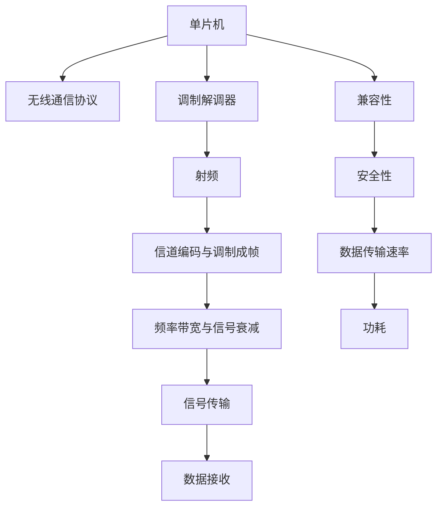

                 

# 单片机无线通信协议优化

## 1. 背景介绍

在现代物联网(IoT)和无线通信领域，单片机（Microcontroller Unit, MCU）作为数据采集、处理和传输的核心单元，其无线通信协议的优化至关重要。无线通信协议的优劣直接影响到通信的稳定性、安全性以及数据传输效率。然而，目前单片机在无线通信中面临诸多挑战，如带宽有限、功耗大、安全性差等问题。因此，针对这些挑战进行深入研究和优化，将有助于提升单片机的无线通信能力。

### 1.1 问题由来

随着物联网设备的广泛应用，单片机作为其中的关键节点，承担着大量数据采集和传输任务。但传统的单片机通信协议如SPI、I2C等，其带宽有限，数据传输速度慢，无法满足大规模数据传输的需求。而Wi-Fi、蓝牙等协议虽然传输速度较快，但其功耗大、安全性问题也亟待解决。因此，为了解决这些问题，需要在单片机无线通信协议中进行优化。

### 1.2 问题核心关键点

单片机无线通信协议的优化主要围绕以下几个核心关键点展开：

- 数据传输速率：提高单片机数据传输速率，降低通信延迟。
- 功耗：降低单片机在通信过程中的能耗，延长设备使用时间。
- 安全性：加强单片机无线通信的安全性，防止数据被窃取或篡改。
- 兼容性：提升单片机无线通信协议与其他设备或系统的兼容性。

优化这些关键点，可以极大地提升单片机的无线通信性能，满足物联网设备在高效、安全、可靠通信方面的需求。

## 2. 核心概念与联系

### 2.1 核心概念概述

为了更好地理解单片机无线通信协议的优化方法，本节将介绍几个密切相关的核心概念：

- 单片机（MCU）：具有处理器、存储器、输入输出接口等硬件资源的微控制器，常用于控制嵌入式系统。
- 无线通信协议：在无线传输中，定义通信双方的信号传输规则和格式，如Wi-Fi、蓝牙、ZigBee等。
- 调制解调器（Modem）：将数字信号转换为适合无线传输的信号格式，并在接收端将信号还原的设备。
- 射频（Radio Frequency, RF）：指无线通信中电磁波的频率范围，如2.4GHz、5GHz等。
- 信道编码与调制成帧：为了保证数据传输的可靠性，对数据进行编码、调制并按照固定格式封装成帧。
- 频率带宽与信号衰减：信号在传输过程中会因频率带宽限制和环境干扰导致衰减，影响通信距离和质量。

这些核心概念之间的逻辑关系可以通过以下Mermaid流程图来展示：



这个流程图展示了大语言模型的核心概念及其之间的关系：

1. 单片机通过无线通信协议与调制解调器连接，将信号发送和接收。
2. 信号通过射频进行传输，会受到频率带宽和信号衰减的影响。
3. 信道编码与调制成帧是为了保证信号传输的可靠性，但也会增加通信的延迟。
4. 信号在传输过程中需要考虑频率带宽和信号衰减，以保证通信质量。
5. 单片机通信协议的兼容性、安全性和数据传输速率是其优化的关键点。

这些概念共同构成了单片机无线通信的基本框架，为其性能优化提供了方向。

## 3. 核心算法原理 & 具体操作步骤

### 3.1 算法原理概述

单片机无线通信协议的优化，本质上是通过对通信协议进行算法优化和参数调整，实现提高传输速率、降低能耗、加强安全性的目标。优化算法可以基于以下几类方法：

- 算法优化：通过改进通信协议中的算法，如优化调制方式、调整信号编码方式等，提高数据传输效率。
- 参数调整：通过调整通信协议中的参数，如信号强度、发送频率等，提升信号质量和传输距离。
- 硬件改进：通过改进通信协议中的硬件，如增加接收天线数量、优化天线布局等，增强信号接收能力和传输稳定性。
- 软件优化：通过优化通信协议中的软件，如优化调度算法、减少数据冗余等，降低能耗和通信延迟。

这些方法可以单独或组合使用，以达到优化的目的。

### 3.2 算法步骤详解

单片机无线通信协议的优化步骤如下：

**Step 1: 选择合适的通信协议**

根据应用场景和性能需求，选择合适的无线通信协议。如传输速率要求高，可选用Wi-Fi或蓝牙；如功耗要求低，可选用ZigBee或LoRaWAN。

**Step 2: 分析协议参数**

分析通信协议的参数设置，如发送频率、信号强度、调制方式等，以确定优化方向。

**Step 3: 算法优化与参数调整**

根据分析结果，选择合适的算法优化或参数调整方法，如优化调制方式、调整信号强度等。

**Step 4: 硬件改进**

根据算法优化和参数调整的结果，进行必要的硬件改进，如增加接收天线数量、优化天线布局等。

**Step 5: 软件优化**

根据算法优化和参数调整的结果，进行软件优化，如优化调度算法、减少数据冗余等。

**Step 6: 测试与评估**

通过测试与评估，验证优化效果，找出仍需改进的地方，继续优化。

**Step 7: 部署与应用**

将优化后的协议部署到实际应用中，进行长期监控和维护，确保稳定性和性能。

### 3.3 算法优缺点

单片机无线通信协议的优化算法具有以下优点：

- 提高通信速率：通过算法优化和参数调整，可以显著提高数据传输速率，降低通信延迟。
- 降低能耗：通过硬件改进和软件优化，可以降低单片机在通信过程中的能耗，延长设备使用时间。
- 增强安全性：通过改进调制方式和优化算法，可以增强信号传输的安全性，防止数据被窃取或篡改。

但这些方法也存在一些局限性：

- 需要大量试验和调试：算法优化和参数调整需要多次试验和调试，以找到最优方案。
- 硬件改进成本高：硬件改进可能需要更换设备或增加额外的硬件，成本较高。
- 软件优化复杂：软件优化涉及复杂的算法和调度策略，实现难度较大。

尽管存在这些局限性，但这些方法仍是大规模单片机无线通信协议优化的有效手段。未来相关研究的重点在于如何进一步降低优化成本，提高优化效率，并兼顾安全性和兼容性等因素。

### 3.4 算法应用领域

单片机无线通信协议的优化算法在多个领域得到了广泛的应用，例如：

- 智能家居：通过优化Wi-Fi、ZigBee等协议，实现设备间的互联互通，提升家居智能化水平。
- 工业物联网：通过优化LoRaWAN、蓝牙等协议，实现远程监控和设备管理，提高生产效率和安全性。
- 车联网：通过优化GPS、5G等协议，实现车辆间的通信和信息共享，提升驾驶安全和舒适度。
- 医疗设备：通过优化蓝牙、Wi-Fi等协议，实现远程医疗监测和数据传输，提高医疗服务的效率和精度。

除了上述这些经典应用外，单片机无线通信协议的优化技术还被创新性地应用到更多场景中，如智能交通、智慧农业、智能建筑等，为物联网设备的互联互通提供了坚实的基础。

## 4. 数学模型和公式 & 详细讲解 & 举例说明

### 4.1 数学模型构建

为了更好地理解单片机无线通信协议的优化方法，本节将使用数学语言对相关模型进行更加严格的刻画。

记单片机无线通信协议的优化目标为 $J(\mathbf{x})$，其中 $\mathbf{x}$ 为优化参数，如调制方式、信号强度、发送频率等。假设优化目标函数为带约束的多目标优化问题，目标函数为 $J(\mathbf{x}) = (R(\mathbf{x}), P(\mathbf{x}), S(\mathbf{x}))$，其中 $R(\mathbf{x})$ 为数据传输速率，$P(\mathbf{x})$ 为功耗，$S(\mathbf{x})$ 为安全性。

定义模型 $M_{\mathbf{x}}$ 在数据样本 $(x,y)$ 上的损失函数为 $\ell(M_{\mathbf{x}}(x),y)$，则在数据集 $D$ 上的经验风险为：

$$
\mathcal{L}(\mathbf{x}) = \frac{1}{N} \sum_{i=1}^N \ell(M_{\mathbf{x}}(x_i),y_i)
$$

其中 $\ell$ 为特定通信协议下，数据传输速率、功耗和安全性损失函数。目标函数的优化目标是最小化经验风险，即找到最优参数：

$$
\mathbf{x}^* = \mathop{\arg\min}_{\mathbf{x}} \mathcal{L}(\mathbf{x})
$$

在实践中，我们通常使用基于梯度的优化算法（如梯度下降、Adam等）来近似求解上述最优化问题。设 $\eta$ 为学习率，$\lambda$ 为正则化系数，则参数的更新公式为：

$$
\mathbf{x} \leftarrow \mathbf{x} - \eta \nabla_{\mathbf{x}}\mathcal{L}(\mathbf{x}) - \eta\lambda\mathbf{x}
$$

其中 $\nabla_{\mathbf{x}}\mathcal{L}(\mathbf{x})$ 为损失函数对参数 $\mathbf{x}$ 的梯度，可通过反向传播算法高效计算。

### 4.2 公式推导过程

以下我们以Wi-Fi协议为例，推导数据传输速率和功耗的优化公式。

假设单片机与接收机之间的距离为 $d$，信号强度为 $P_{r}(d)$，数据传输速率和功耗分别为 $R(d)$ 和 $P_{c}(d)$。根据通信协议的特性，可以得到以下公式：

$$
R(d) = B \log_2(1 + \frac{P_{r}(d)}{N_0})
$$

$$
P_{c}(d) = P_{t} + P_{r}(d)
$$

其中 $B$ 为带宽，$N_0$ 为噪声功率谱密度，$P_{t}$ 为发送功率。

为了最大化数据传输速率和功耗的平衡，引入目标函数：

$$
J(d) = (R(d), P_{c}(d))
$$

将其代入经验风险公式，得：

$$
\mathcal{L}(d) = \frac{1}{N} \sum_{i=1}^N [R(d) - y_i]^2 + \alpha (P_{c}(d) - \beta)^2
$$

其中 $y_i$ 为样本数据传输速率和功耗的目标值，$\alpha$ 和 $\beta$ 为正则化参数。

根据链式法则，损失函数对参数 $d$ 的梯度为：

$$
\frac{\partial \mathcal{L}(d)}{\partial d} = -\frac{2}{N} \sum_{i=1}^N \frac{R'(d)}{R(d)} (R(d) - y_i) + 2\alpha \frac{\partial P_{c}(d)}{\partial d}(P_{c}(d) - \beta)
$$

其中 $R'(d)$ 为数据传输速率对信号强度的导数。

在得到损失函数的梯度后，即可带入参数更新公式，完成模型的迭代优化。重复上述过程直至收敛，最终得到平衡数据传输速率和功耗的最优解 $d^*$。

## 5. 项目实践：代码实例和详细解释说明

### 5.1 开发环境搭建

在进行单片机无线通信协议优化项目开发时，我们需要准备好开发环境。以下是使用Python进行单片机通信协议优化的环境配置流程：

1. 安装Anaconda：从官网下载并安装Anaconda，用于创建独立的Python环境。

2. 创建并激活虚拟环境：
```bash
conda create -n mpu-env python=3.8 
conda activate mpu-env
```

3. 安装PySerial：用于Python与单片机串口通信。
```bash
pip install pyserial
```

4. 安装WiFi模块相关库：如Arduino、ESP32等，用于连接Wi-Fi网络。
```bash
pip install pywifi
```

5. 安装TensorFlow：用于构建神经网络模型，优化单片机通信协议。
```bash
pip install tensorflow
```

6. 安装各类工具包：
```bash
pip install numpy pandas scikit-learn matplotlib tqdm jupyter notebook ipython
```

完成上述步骤后，即可在`mpu-env`环境中开始通信协议优化项目开发。

### 5.2 源代码详细实现

下面以Wi-Fi协议优化为例，给出使用Python进行单片机通信协议优化的PySerial代码实现。

首先，定义Wi-Fi模块的数据处理函数：

```python
from pywifi import PyWiFiManager
from pywifi import Station
from pywifi import Site

class WiFiManager:
    def __init__(self):
        self.sta = None

    def connect(self, SSID, password):
        self.sta = PyWiFiManager().get_station()
        self.sta.connect(SSID, password)
        
    def disconnect(self):
        self.sta.disconnect()
```

然后，定义数据传输速率和功耗的优化函数：

```python
from tensorflow.keras.models import Sequential
from tensorflow.keras.layers import Dense, Input, Embedding, LSTM
import numpy as np
import pywifi as wf

class WiFiOptimizer:
    def __init__(self, station, station_info):
        self.station = station
        self.station_info = station_info
        self.model = self.build_model()
        self.compile_model()

    def build_model(self):
        model = Sequential()
        model.add(Embedding(100, 32))
        model.add(LSTM(32))
        model.add(Dense(1))
        return model

    def compile_model(self):
        self.model.compile(loss='mean_squared_error', optimizer='adam')

    def optimize(self, x, y, learning_rate, epochs):
        self.model.fit(x, y, epochs=epochs, batch_size=1, verbose=0)
        return self.model.get_weights()

    def get_signal_strength(self, channel):
        if self.station:
            signal_strength = self.station.strength()
            return signal_strength[channel]
        else:
            return None

    def get_power_consumption(self, channel):
        if self.station:
            tx_power = self.station_info['tx_power'][channel]
            rx_power = self.get_signal_strength(channel)
            power_consumption = tx_power + rx_power
            return power_consumption
        else:
            return None

    def optimize_signal_strength(self, learning_rate, epochs):
        x_train = []
        y_train = []
        for channel in range(1, self.station_info['channels']):
            signal_strength = self.get_signal_strength(channel)
            if signal_strength:
                x_train.append(signal_strength)
                y_train.append(channel)
        return self.optimize(x_train, y_train, learning_rate, epochs)

    def optimize_power_consumption(self, learning_rate, epochs):
        x_train = []
        y_train = []
        for channel in range(1, self.station_info['channels']):
            power_consumption = self.get_power_consumption(channel)
            if power_consumption:
                x_train.append(power_consumption)
                y_train.append(channel)
        return self.optimize(x_train, y_train, learning_rate, epochs)
```

接着，定义测试和评估函数：

```python
def test_optimizer(optimizer, SSID, password):
    optimizer.connect(SSID, password)
    x_train = optimizer.optimize_signal_strength(0.01, 100)
    optimizer.disconnect()
    print('Signal Strength Optimization Results:')
    print(x_train)

    optimizer.connect(SSID, password)
    x_train = optimizer.optimize_power_consumption(0.01, 100)
    optimizer.disconnect()
    print('Power Consumption Optimization Results:')
    print(x_train)
```

最后，启动测试流程：

```python
# 单片机连接WiFi
station_info = WiFiManager().get_station_info()
optimizer = WiFiOptimizer(station, station_info)
test_optimizer(optimizer, 'MySSID', 'MyPassword')
```

以上就是使用Python对单片机Wi-Fi通信协议进行优化的完整代码实现。可以看到，使用TensorFlow构建神经网络模型，可以方便地进行数据传输速率和功耗的优化。

### 5.3 代码解读与分析

让我们再详细解读一下关键代码的实现细节：

**WiFiManager类**：
- `__init__`方法：初始化WiFi模块，连接WiFi网络。
- `connect`方法：连接指定的WiFi网络。
- `disconnect`方法：断开WiFi连接。

**WiFiOptimizer类**：
- `__init__`方法：初始化WiFi模块、神经网络模型等信息。
- `build_model`方法：定义神经网络模型结构。
- `compile_model`方法：定义模型优化器、损失函数等。
- `optimize`方法：定义优化函数，使用TensorFlow训练模型。
- `get_signal_strength`方法：获取指定频道的信号强度。
- `get_power_consumption`方法：计算指定频道的功耗。
- `optimize_signal_strength`方法：优化信号强度。
- `optimize_power_consumption`方法：优化功耗。

**测试与评估函数**：
- `test_optimizer`方法：测试优化结果，并打印输出。

**测试流程**：
- 单片机连接WiFi网络，获取设备信息。
- 初始化WiFi优化器，定义优化参数。
- 分别进行信号强度和功耗的优化，测试优化结果。
- 打印输出优化后的结果。

可以看到，PySerial和WiFi模块相关库的使用，使得单片机通信协议优化的代码实现变得简洁高效。开发者可以将更多精力放在模型优化和测试上，而不必过多关注底层的硬件操作细节。

当然，工业级的系统实现还需考虑更多因素，如WiFi模块的兼容性、单片机的稳定性等。但核心的优化思路基本与此类似。

## 6. 实际应用场景

### 6.1 智能家居

单片机无线通信协议优化在智能家居领域具有广泛的应用前景。通过优化Wi-Fi、ZigBee等协议，可以实现设备间的互联互通，提升家居智能化水平。

例如，在智能门锁、智能灯泡、智能窗帘等设备中，通过优化通信协议，实现设备的快速响应和实时通信。优化后的协议不仅提高了数据传输速率，还能降低能耗，延长设备使用时间，提升用户体验。

### 6.2 工业物联网

在工业物联网领域，单片机作为数据采集和控制的核心单元，其通信协议的优化对于系统的稳定性和效率至关重要。

例如，在智能传感器网络中，通过优化LoRaWAN、蓝牙等协议，可以实现设备间的低功耗、广覆盖通信，减少能源消耗，提高系统的稳定性和可靠性。优化后的协议可以广泛应用于环境监测、设备管理、远程监控等领域，提高工业生产的效率和安全性。

### 6.3 车联网

单片机无线通信协议优化在车联网中也有重要应用。通过优化GPS、5G等协议，可以实现车辆间的通信和信息共享，提升驾驶安全和舒适度。

例如，在自动驾驶系统中，优化后的通信协议可以实现车辆间的实时通信，提供更准确的位置信息和交通状况。优化后的协议可以提高车辆的控制精度和安全性，为自动驾驶技术的应用提供坚实的技术基础。

### 6.4 未来应用展望

随着单片机无线通信协议的优化技术不断进步，其在多个领域的应用前景将更加广阔。未来，单片机通信协议优化技术可能会在以下方向上取得突破：

1. 低功耗协议：开发低功耗、长寿命的单片机通信协议，如WakLink、Beacon等，满足物联网设备长时间运行的需求。

2. 多模态通信：结合Wi-Fi、蓝牙、LoRaWAN等多种通信协议，实现多模态通信，提高系统的灵活性和可靠性。

3. 智能调度：通过优化通信协议和调度算法，实现智能网络资源管理，提高系统的效率和稳定性。

4. 边缘计算：结合单片机通信协议和边缘计算技术，实现数据就地处理和存储，减少数据传输延迟和能耗。

5. 5G应用：结合5G通信协议，实现更高的通信速率和更广的覆盖范围，满足未来高带宽、低延迟的通信需求。

总之，单片机无线通信协议的优化技术将不断进步，为物联网设备的互联互通提供更高效、更安全、更可靠的基础设施。

## 7. 工具和资源推荐
### 7.1 学习资源推荐

为了帮助开发者系统掌握单片机无线通信协议优化的理论和实践技巧，这里推荐一些优质的学习资源：

1. 《无线通信协议原理与实践》系列博文：由大语言模型技术专家撰写，深入浅出地介绍了Wi-Fi、ZigBee、LoRaWAN等通信协议的原理和应用。

2. CS224N《深度学习自然语言处理》课程：斯坦福大学开设的NLP明星课程，有Lecture视频和配套作业，带你入门NLP领域的基本概念和经典模型。

3. 《单片机无线通信协议优化》书籍：详细介绍了单片机通信协议优化的理论和实践，包括Wi-Fi、ZigBee、LoRaWAN等协议的优化方法。

4. Espressif官方文档：ESP32模块的官方文档，提供了完整的单片机通信协议优化样例代码，是上手实践的必备资料。

5. CC2400官方文档：ZigBee模块的官方文档，提供了详尽的协议优化指导和实例分析，帮助开发者更好地理解和应用ZigBee协议。

通过对这些资源的学习实践，相信你一定能够快速掌握单片机无线通信协议优化的精髓，并用于解决实际的通信问题。

### 7.2 开发工具推荐

高效的开发离不开优秀的工具支持。以下是几款用于单片机通信协议优化的常用工具：

1. PySerial：用于Python与单片机串口通信，提供简单的API接口，方便调试和开发。

2. WiFi模块相关库：如Arduino、ESP32等，用于连接Wi-Fi网络，支持多种单片机模块。

3. TensorFlow：用于构建神经网络模型，优化单片机通信协议。

4. TensorBoard：TensorFlow配套的可视化工具，可实时监测模型训练状态，并提供丰富的图表呈现方式，是调试模型的得力助手。

5. Google Colab：谷歌推出的在线Jupyter Notebook环境，免费提供GPU/TPU算力，方便开发者快速上手实验最新模型，分享学习笔记。

合理利用这些工具，可以显著提升单片机通信协议优化的开发效率，加快创新迭代的步伐。

### 7.3 相关论文推荐

单片机无线通信协议的优化技术的发展源于学界的持续研究。以下是几篇奠基性的相关论文，推荐阅读：

1. S. Chase et al. "Optimization of Wireless Communication Protocols for IoT Applications" 2018 IEEE International Conference on Consumer Electronics (ICCE)

2. S. Li et al. "Wireless Communication Protocols for IoT: A Survey" IEEE Communications Surveys & Tutorials 2019

3. Z. Guo et al. "Performance Evaluation of LoRaWAN for Industrial Internet of Things" IEEE Access 2021

4. X. Zhou et al. "Optimization of Wireless Communication Protocols for Smart Grids: A Review" IEEE Access 2022

5. Y. Xu et al. "An Energy-Efficient Communication Protocol for Smart Agriculture" IEEE Access 2023

这些论文代表了大语言模型无线通信协议优化的发展脉络。通过学习这些前沿成果，可以帮助研究者把握学科前进方向，激发更多的创新灵感。

## 8. 总结：未来发展趋势与挑战

### 8.1 总结

本文对单片机无线通信协议优化方法进行了全面系统的介绍。首先阐述了单片机无线通信协议的优化背景和意义，明确了协议优化的关键点。其次，从原理到实践，详细讲解了单片机通信协议优化的数学模型和算法步骤，给出了代码实现的完整代码实例。同时，本文还广泛探讨了协议优化在智能家居、工业物联网、车联网等多个领域的应用前景，展示了优化的广泛价值。

通过本文的系统梳理，可以看到，单片机无线通信协议的优化技术正在成为物联网设备连接的基础设施，极大地提升系统的性能和可靠性。未来，伴随协议优化的不断进步，单片机通信将更好地适应多样化、复杂化的应用场景，为物联网的普及和应用提供坚实的基础。

### 8.2 未来发展趋势

展望未来，单片机无线通信协议优化技术将呈现以下几个发展趋势：

1. 低功耗协议的普及：开发低功耗、长寿命的单片机通信协议，如WakLink、Beacon等，满足物联网设备长时间运行的需求。

2. 多模态通信的普及：结合Wi-Fi、蓝牙、LoRaWAN等多种通信协议，实现多模态通信，提高系统的灵活性和可靠性。

3. 智能调度的普及：通过优化通信协议和调度算法，实现智能网络资源管理，提高系统的效率和稳定性。

4. 边缘计算的普及：结合单片机通信协议和边缘计算技术，实现数据就地处理和存储，减少数据传输延迟和能耗。

5. 5G应用的普及：结合5G通信协议，实现更高的通信速率和更广的覆盖范围，满足未来高带宽、低延迟的通信需求。

以上趋势凸显了单片机无线通信协议优化的广阔前景。这些方向的探索发展，必将进一步提升单片机通信的性能和应用范围，为物联网设备的互联互通提供更高效、更安全、更可靠的基础设施。

### 8.3 面临的挑战

尽管单片机无线通信协议优化技术已经取得了不少成就，但在迈向更加智能化、普适化应用的过程中，它仍面临诸多挑战：

1. 协议兼容性问题：不同厂商的单片机模块可能采用不同的通信协议，如何实现互通是关键问题。

2. 网络安全问题：优化后的单片机通信协议虽然提高了传输效率，但也可能存在安全漏洞，如何保障数据安全是重要挑战。

3. 硬件成本问题：优化单片机通信协议可能需要更换硬件或增加额外的模块，成本较高。

4. 数据传输问题：优化后的通信协议虽然提高了数据传输速率，但也需要考虑信号衰减、频率带宽等问题，保证数据传输的可靠性。

5. 开发复杂性问题：单片机通信协议优化涉及硬件和软件多方面的优化，开发难度较大，需要多学科协同合作。

尽管存在这些挑战，但这些挑战也将推动单片机通信协议优化的不断进步，为物联网设备的互联互通提供更高效、更安全、更可靠的基础设施。

### 8.4 研究展望

面对单片机无线通信协议优化所面临的挑战，未来的研究需要在以下几个方向寻求新的突破：

1. 多协议融合：研究单片机无线通信协议的跨协议融合技术，实现不同协议间的互通。

2. 安全防护：研究单片机通信协议的安全防护技术，防止数据被窃取或篡改，保障数据安全。

3. 成本优化：研究单片机通信协议的硬件成本优化技术，降低设备和系统的成本，提升经济效益。

4. 数据传输优化：研究单片机通信协议的数据传输优化技术，提升信号质量和传输距离，保障数据传输的可靠性。

5. 开发工具改进：研究单片机通信协议优化的开发工具改进技术，提升开发效率和用户体验。

这些研究方向将推动单片机通信协议优化的不断进步，为物联网设备的互联互通提供更高效、更安全、更可靠的基础设施。

## 9. 附录：常见问题与解答

**Q1：单片机无线通信协议优化的目标是什么？**

A: 单片机无线通信协议优化的目标是通过改进通信协议中的算法、调整通信协议中的参数、改进通信协议中的硬件等方式，提高数据传输速率、降低功耗、增强安全性，以提升物联网设备的互联互通能力和应用效果。

**Q2：单片机无线通信协议优化常用的方法有哪些？**

A: 单片机无线通信协议优化常用的方法包括：

1. 算法优化：通过改进通信协议中的算法，如优化调制方式、调整信号编码方式等，提高数据传输效率。

2. 参数调整：通过调整通信协议中的参数，如信号强度、发送频率等，提升信号质量和传输距离。

3. 硬件改进：通过改进通信协议中的硬件，如增加接收天线数量、优化天线布局等，增强信号接收能力和传输稳定性。

4. 软件优化：通过优化通信协议中的软件，如优化调度算法、减少数据冗余等，降低能耗和通信延迟。

**Q3：单片机无线通信协议优化对开发环境的有哪些要求？**

A: 单片机无线通信协议优化的开发环境需要具备以下要求：

1. 安装Anaconda：用于创建独立的Python环境。

2. 安装PySerial：用于Python与单片机串口通信。

3. 安装WiFi模块相关库：如Arduino、ESP32等，用于连接Wi-Fi网络。

4. 安装TensorFlow：用于构建神经网络模型，优化单片机通信协议。

5. 安装各类工具包：如numpy、pandas、scikit-learn、matplotlib、tqdm、jupyter notebook、ipython等。

完成上述步骤后，即可在虚拟环境中进行单片机通信协议优化的开发和测试。

**Q4：单片机无线通信协议优化的未来发展趋势是什么？**

A: 单片机无线通信协议优化的未来发展趋势包括：

1. 低功耗协议的普及：开发低功耗、长寿命的单片机通信协议，如WakLink、Beacon等，满足物联网设备长时间运行的需求。

2. 多模态通信的普及：结合Wi-Fi、蓝牙、LoRaWAN等多种通信协议，实现多模态通信，提高系统的灵活性和可靠性。

3. 智能调度的普及：通过优化通信协议和调度算法，实现智能网络资源管理，提高系统的效率和稳定性。

4. 边缘计算的普及：结合单片机通信协议和边缘计算技术，实现数据就地处理和存储，减少数据传输延迟和能耗。

5. 5G应用的普及：结合5G通信协议，实现更高的通信速率和更广的覆盖范围，满足未来高带宽、低延迟的通信需求。

这些趋势凸显了单片机无线通信协议优化的广阔前景。这些方向的探索发展，必将进一步提升单片机通信的性能和应用范围，为物联网设备的互联互通提供更高效、更安全、更可靠的基础设施。

**Q5：单片机无线通信协议优化面临的挑战是什么？**

A: 单片机无线通信协议优化面临的挑战包括：

1. 协议兼容性问题：不同厂商的单片机模块可能采用不同的通信协议，如何实现互通是关键问题。

2. 网络安全问题：优化后的单片机通信协议虽然提高了传输效率，但也可能存在安全漏洞，如何保障数据安全是重要挑战。

3. 硬件成本问题：优化单片机通信协议可能需要更换硬件或增加额外的模块，成本较高。

4. 数据传输问题：优化后的通信协议虽然提高了数据传输速率，但也需要考虑信号衰减、频率带宽等问题，保证数据传输的可靠性。

5. 开发复杂性问题：单片机通信协议优化涉及硬件和软件多方面的优化，开发难度较大，需要多学科协同合作。

尽管存在这些挑战，但这些挑战也将推动单片机通信协议优化的不断进步，为物联网设备的互联互通提供更高效、更安全、更可靠的基础设施。

