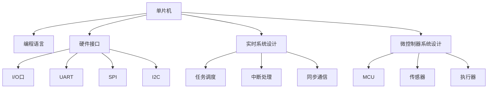

                 

# 单片机编程：嵌入式系统的核心技术

> 关键词：单片机,嵌入式系统,编程技术,硬件接口,实时系统,微控制器,系统设计

## 1. 背景介绍

### 1.1 问题由来
随着物联网、智能家居、汽车电子、工业控制等领域的快速发展，嵌入式系统的重要性日益凸显。嵌入式系统通常由一个或多个微控制器(Microcontroller Unit, MCU)、各种传感器、执行器等组成，能够在特定的物理环境条件下，进行实时数据处理和控制操作。单片机作为嵌入式系统的核心组成部分，承担了计算、存储、控制等多种功能，其编程技术是嵌入式系统设计中的关键环节。

然而，单片机编程往往被认为是一门相对较为复杂的技术，需要掌握底层硬件知识、编程语言和算法实现等多方面的技能。因此，许多初学者在面对单片机编程时，常常感到无从下手，难以构建起完整的知识体系。本文将系统梳理单片机编程的核心技术，涵盖底层硬件接口、编程语言、实时系统设计等多个方面，为读者提供全面的技术指引。

### 1.2 问题核心关键点
单片机编程的核心关键点包括：

1. **底层硬件接口**：理解单片机与外设接口(如I/O口、UART、SPI、I2C等)的原理和使用方法，是进行单片机编程的基础。

2. **编程语言选择**：C语言是最常用的单片机编程语言之一，但其并不是唯一选择。了解其他编程语言的特性和适用场景，可以更好地进行单片机开发。

3. **实时系统设计**：单片机系统往往需要处理实时任务，因此必须掌握任务调度、中断处理、同步通信等实时系统设计的基本原理和技术。

4. **微控制器系统设计**：单片机作为微控制器(MCU)的一部分，需要与其他组件协同工作。因此，了解MCU与其他组件的接口、交互方式等，是设计复杂嵌入式系统的关键。

5. **系统调试与优化**：单片机编程中，系统调试和性能优化同样重要。掌握常见的调试工具和技术，能够快速定位和修复问题，提高开发效率。

6. **应用场景拓展**：了解单片机在不同应用场景下的特点和优势，能够更好地进行系统设计，实现高性能、低功耗的嵌入式解决方案。

### 1.3 问题研究意义
掌握单片机编程技术，对于构建高性能、低成本的嵌入式系统具有重要意义：

1. **提高系统开发效率**：通过掌握单片机编程技术，能够快速实现硬件和软件的协同设计，缩短产品开发周期。

2. **降低开发成本**：单片机编程技术不仅涵盖了硬件接口，还包括了软件算法实现。掌握这些技能，可以在硬件和软件两个方面进行优化，降低开发成本。

3. **提升系统性能**：单片机编程涉及实时系统设计、任务调度等高级概念，通过系统设计，可以实现高效、可靠的系统性能。

4. **拓展应用场景**：单片机编程技术覆盖了从低功耗传感器到高性能实时控制系统的广泛应用场景，掌握这些技术，可以灵活应对各种需求。

5. **推动产业升级**：随着物联网、智能制造等行业的兴起，嵌入式系统的需求日益增长。掌握单片机编程技术，能够为这些新兴产业的发展提供有力支持。

## 2. 核心概念与联系

### 2.1 核心概念概述

为更好地理解单片机编程的核心技术，本节将介绍几个密切相关的核心概念：

- **单片机**：指集成在一块芯片上的中央处理器(CPU)、存储器、输入/输出接口等功能模块。单片机常用于控制、监测等对实时性要求较高的应用场景。

- **嵌入式系统**：指将计算机硬件与软件相结合，嵌入到目标设备中的系统。单片机作为嵌入式系统的重要组成部分，能够实现数据处理、控制等功能。

- **编程语言**：指用于描述计算机指令的程序语言。C语言是单片机编程的主流语言之一，但Python、汇编语言等其他语言也有应用。

- **硬件接口**：指单片机与外部设备之间的连接方式和协议。常见的接口包括I/O口、UART、SPI、I2C等。

- **实时系统设计**：指在满足系统实时性要求的前提下，实现高效的资源利用和任务调度。

- **微控制器**：指将CPU、存储器、输入/输出接口等功能模块集成在一块芯片上的控制器。微控制器系统设计涵盖了单片机与其他组件的协同工作。

这些核心概念之间的逻辑关系可以通过以下Mermaid流程图来展示：



这个流程图展示了这个系列核心概念之间的联系：

1. 单片机通过编程语言和硬件接口，实现对外部设备的操作。
2. 实时系统设计保证了系统的及时响应。
3. 微控制器系统设计涵盖了单片机与其他组件的协同工作。
4. 这些核心概念共同构成了单片机编程的知识体系，帮助开发者构建高性能、可靠、稳定的嵌入式系统。

## 3. 核心算法原理 & 具体操作步骤
### 3.1 算法原理概述

单片机编程的核心算法原理主要涉及以下几个方面：

1. **底层硬件接口**：理解单片机与外部设备之间的连接方式和协议，是编程的基础。
2. **编程语言选择**：掌握C语言的基本语法和特性，能够进行数据处理和程序控制。
3. **实时系统设计**：了解任务调度和中断处理等实时系统设计的基本原理。
4. **微控制器系统设计**：掌握MCU与其他组件的接口和交互方式。
5. **系统调试与优化**：掌握调试工具和技术，进行系统性能优化。
6. **应用场景拓展**：了解单片机在不同应用场景下的特点和优势。

### 3.2 算法步骤详解

单片机编程的详细步骤包括：

1. **硬件设计**：选择合适的微控制器，设计电路板，确保单片机与其他组件之间的正确连接。
2. **软件开发环境搭建**：选择合适的开发工具和IDE，搭建开发环境。
3. **程序编写与调试**：使用C语言编写程序，使用调试工具进行代码调试和系统测试。
4. **系统优化**：对系统进行性能优化，提升系统的响应速度和资源利用率。
5. **系统部署与维护**：将系统部署到目标设备中，进行系统维护和更新。

### 3.3 算法优缺点

单片机编程的优势在于：

- **集成度高**：单片机将CPU、存储器、输入/输出接口等功能集成在一块芯片上，体积小、功耗低。
- **实时响应快**：单片机系统设计通常采用实时操作系统(RTOS)，可以实现快速的任务响应。
- **开发成本低**：单片机编程涉及硬件和软件两方面的开发，开发成本相对较低。

单片机编程的缺点在于：

- **编程难度高**：单片机编程涉及底层硬件接口和实时系统设计，编程难度较高。
- **性能瓶颈**：单片机往往内存和处理能力有限，处理复杂任务时需要额外优化。
- **系统复杂度高**：单片机系统设计涉及多个组件的协同工作，系统复杂度较高。

### 3.4 算法应用领域

单片机编程技术广泛应用于各个领域，包括但不限于：

1. **工业控制**：在自动化生产线、工厂管理系统等应用中，单片机负责数据采集、控制等功能。
2. **消费电子**：如智能家居、可穿戴设备、智能玩具等，单片机实现传感器监测、数据处理、人机交互等功能。
3. **汽车电子**：如车联网、车辆控制、导航系统等，单片机负责车辆监控、数据传输等功能。
4. **医疗设备**：如心率监测器、血糖仪、电子健康记录系统等，单片机负责数据采集、处理和分析。
5. **物联网**：如智慧城市、智能农业、智能交通等，单片机负责数据采集、控制和通信。

## 4. 数学模型和公式 & 详细讲解  
### 4.1 数学模型构建

单片机编程涉及的数学模型主要包括：

- **数字逻辑电路**：单片机内部的数字逻辑电路，用于实现各种逻辑功能。
- **微控制器系统设计**：系统设计中的数学模型，包括任务调度和同步通信等。
- **信号处理**：单片机与传感器、执行器之间的信号处理。

### 4.2 公式推导过程

以下是数字逻辑电路的基本公式推导过程：

1. **门电路**：
   - 与门：$Y=A \cdot B$
   - 或门：$Y=A \vee B$
   - 非门：$Y=\bar{A}$
   - 异或门：$Y=A \oplus B$

2. **组合逻辑电路**：
   - 两个输入的加法器：$S=A \oplus B$, $C=A \cdot B$
   - 逻辑函数表达式：$Y=A_1 \cdot B_1+A_2 \cdot B_2 \cdot \bar{A_1}$

3. **时序逻辑电路**：
   - 触发器：$Q=D \cdot \bar{Q}$, $D=C \cdot J \vee \bar{Q} \cdot K$
   - 时序逻辑表达式：$Q_{n+1}=A \cdot \bar{Q}+B \cdot Q \cdot \bar{A}$

### 4.3 案例分析与讲解

以简单的4位二进制加法器为例，进行数学模型的应用分析：

1. **加法器设计**：
   - 输入：$A, B$
   - 输出：$S, C$
   - 电路结构：

   

   - 逻辑表达式：
     - 半加器：$S_i=A_i \cdot B_i$, $C_i=A_i \oplus B_i$
     - 全加器：$S=A \oplus B \oplus C_1$, $C=S_1 \cdot A+C_1 \cdot B$

2. **编程实现**：
   - 使用C语言编写程序：
     ```c
     void add(int a, int b) {
         int sum = a ^ b;
         int carry = (a & b) << 1;
         while (carry != 0) {
             a = sum;
             b = carry;
             sum = a ^ b;
             carry = (a & b) << 1;
         }
         printf("Sum: %d, Carry: %d\n", sum, carry);
     }
     ```

## 5. 项目实践：代码实例和详细解释说明
### 5.1 开发环境搭建

在进行单片机编程实践前，我们需要准备好开发环境。以下是使用Keil μVision IDE 进行开发的环境配置流程：

1. 安装Keil μVision IDE：从官网下载并安装Keil μVision IDE，配置编译器为Keil μVision Compiler。
2. 安装ST-LINK/V2 USB调试器：从官网下载并安装ST-LINK/V2 USB调试器驱动，进行设备识别。
3. 编写并编译程序：在Keil μVision IDE中打开项目，编写程序并编译。
4. 连接目标板：使用ST-LINK/V2 USB调试器将编译好的程序烧录到目标单片机中。
5. 调试程序：使用Keil μVision IDE进行程序调试和系统测试。

完成上述步骤后，即可在Keil μVision IDE中进行单片机编程的实践。

### 5.2 源代码详细实现

下面我们以简单的I/O口控制为例，给出使用Keil μVision IDE进行单片机编程的代码实现。

首先，定义I/O口控制函数：

```c
void initGPIO(void) {
    // 初始化GPIO端口
    // 设置GPIO口的输出模式为开漏输出
    GPIO_InitTypeDef GPIO_InitStructure;
    GPIO_InitStructure.GPIO_Mode = GPIO_Mode_Out_PP;
    GPIO_InitStructure.GPIO_Pin = GPIO_Pin_0;
    GPIO_InitStructure.GPIO_Speed = GPIO_Speed_50MHz;
    GPIO_InitStructure.GPIO_OType = GPIO_OType_Out_PP;
    GPIO_InitStructure.GPIO_PuPd = GPIO_PuPd_NOPullUp;
    GPIO_Init(GPIOA, &GPIO_InitStructure);
    // 使能GPIOA时钟
    RCC_APB2PeriphClockCmd(RCC_APB2Periph_GPIOA, ENABLE);
}

void setGPIO(void) {
    // 设置GPIO口的电平
    GPIO_WriteBit(GPIOA, GPIO_Pin_0, Bit_SET);
}
```

然后，定义中断服务函数：

```c
void SPI1_IRQHandler(void) {
    // 处理SPI中断
    // 这里可以添加具体的中断处理逻辑
}
```

接着，定义主函数：

```c
int main(void) {
    // 初始化GPIO端口
    initGPIO();
    // 设置GPIO口的电平
    setGPIO();
    // 主循环
    while (1) {
        // 添加主循环逻辑
    }
    return 0;
}
```

最后，启动程序并调试：

```c
int main(void) {
    // 初始化GPIO端口
    initGPIO();
    // 设置GPIO口的电平
    setGPIO();
    // 主循环
    while (1) {
        // 添加主循环逻辑
    }
    return 0;
}
```

以上就是使用Keil μVision IDE进行单片机编程的完整代码实现。可以看到，Keil μVision IDE提供了强大的开发工具和调试功能，使得单片机编程变得更加便捷高效。

### 5.3 代码解读与分析

让我们再详细解读一下关键代码的实现细节：

**initGPIO函数**：
- 初始化GPIO端口，设置GPIO口的输出模式为开漏输出。
- 使用GPIO_InitTypeDef结构体，定义GPIO口的初始化参数，包括模式、引脚、时钟频率等。
- 使用GPIO_Init函数进行GPIO口的初始化。
- 使用RCC_APB2PeriphClockCmd函数使能GPIOA时钟。

**setGPIO函数**：
- 设置GPIO口的电平。
- 使用GPIO_WriteBit函数设置GPIO口的电平，Bit_SET表示高电平。

**SPI1_IRQHandler函数**：
- 中断服务函数，用于处理SPI中断。
- 可以添加具体的逻辑，如接收和发送数据等。

**main函数**：
- 主函数，包括初始化GPIO端口、设置GPIO口的电平，并添加主循环逻辑。
- 主循环中通常会处理系统的其他逻辑，如读取传感器数据、执行特定任务等。

可以看到，通过Keil μVision IDE，单片机编程变得更加直观和易用。开发者可以使用丰富的IDE功能，快速编写、调试和测试程序。

## 6. 实际应用场景

### 6.1 工业控制

单片机在工业控制领域的应用非常广泛，可以用于数据采集、控制等功能。例如，在自动化生产线中，单片机可以控制机器人的动作、监测设备状态，实现自动化的生产线管理。

### 6.2 消费电子

单片机在消费电子领域的应用包括智能家居、可穿戴设备、智能玩具等。例如，智能家居系统中的智能门锁、智能灯泡、智能插座等，都采用了单片机进行控制。

### 6.3 汽车电子

单片机在汽车电子领域的应用包括车联网、车辆控制、导航系统等。例如，车联网系统中的车辆监控、数据传输等功能，都是由单片机实现的。

### 6.4 医疗设备

单片机在医疗设备中的应用包括心率监测器、血糖仪、电子健康记录系统等。例如，智能血糖仪可以通过单片机采集血糖数据，并进行数据分析和显示。

### 6.5 物联网

单片机在物联网中的应用包括智慧城市、智能农业、智能交通等。例如，智慧城市系统中的路灯控制、交通信号灯控制等，都采用了单片机进行控制。

## 7. 工具和资源推荐
### 7.1 学习资源推荐

为了帮助开发者系统掌握单片机编程的核心技术，这里推荐一些优质的学习资源：

1. 《单片机编程实战》系列博文：由资深单片机专家撰写，系统讲解单片机编程的基本原理和实践技巧。
2. 《嵌入式系统设计与开发》课程：由高校开设的嵌入式系统设计课程，涵盖单片机编程、实时系统设计等多个方面。
3. 《单片机编程语言与技术》书籍：全面介绍单片机编程语言的特性和应用场景，涵盖C语言、汇编语言等多种语言。
4. Arduino官方文档：提供丰富的单片机开发资源，包括代码示例、硬件接口等。
5. STM32官方文档：提供STM32系列单片机的详细文档和示例代码，适合进行开发实践。

通过对这些资源的学习实践，相信你一定能够快速掌握单片机编程的核心技术，并用于解决实际的嵌入式系统问题。

### 7.2 开发工具推荐

高效的开发离不开优秀的工具支持。以下是几款用于单片机编程开发的常用工具：

1. Keil μVision IDE：功能强大的单片机开发工具，提供编译、调试、仿真等功能。
2. Arduino IDE：适合初学者使用的单片机开发工具，支持多种单片机和编程语言。
3. PlatformIO：支持多种开发板和编译器的开发工具，支持跨平台开发。
4. Visual Studio Code：通用的IDE工具，支持多种编程语言和插件，适合进行单片机编程。
5. STM32CubeIDE：基于STM32官方平台的开发工具，提供丰富的开发资源和示例代码。

合理利用这些工具，可以显著提升单片机编程的开发效率，加快创新迭代的步伐。

### 7.3 相关论文推荐

单片机编程技术的发展源于学界的持续研究。以下是几篇奠基性的相关论文，推荐阅读：

1. "The Evolution of Microcontroller Unit (MCU) Technologies"（《微控制器技术的发展》）：详细介绍微控制器技术的演进和应用。
2. "Microcontroller Programming in C: A Practical Guide"（《C语言编程微控制器：实用指南》）：详细介绍C语言在单片机编程中的应用。
3. "Design and Implementation of Embedded Systems Using Microcontrollers"（《使用微控制器设计嵌入式系统》）：详细介绍嵌入式系统的设计和实现过程。
4. "A Survey of Microcontroller Programming Languages and Tools"（《微控制器编程语言和工具综述》）：详细介绍当前常用的微控制器编程语言和工具。

这些论文代表了大规模语言模型微调技术的发展脉络。通过学习这些前沿成果，可以帮助研究者把握学科前进方向，激发更多的创新灵感。

## 8. 总结：未来发展趋势与挑战

### 8.1 总结

本文对单片机编程的核心技术进行了全面系统的介绍。首先阐述了单片机编程的背景和意义，明确了编程技术在嵌入式系统设计中的关键作用。其次，从原理到实践，详细讲解了单片机编程的数学模型、算法原理和操作步骤，给出了单片机编程的完整代码实现。同时，本文还广泛探讨了单片机编程在工业控制、消费电子、汽车电子等多个领域的应用前景，展示了单片机编程技术的巨大潜力。此外，本文精选了单片机编程的学习资源和开发工具，力求为读者提供全方位的技术指引。

通过本文的系统梳理，可以看到，单片机编程技术在嵌入式系统中的应用日益广泛，对于构建高性能、低成本的嵌入式系统具有重要意义。掌握单片机编程技术，能够有效提升系统开发效率，降低开发成本，提高系统性能。未来，随着技术的不断发展，单片机编程技术必将迎来更多的创新和突破，为嵌入式系统的发展提供新的动力。

### 8.2 未来发展趋势

展望未来，单片机编程技术将呈现以下几个发展趋势：

1. **微控制器智能化**：未来的微控制器将具备更高的处理能力和更大的存储空间，能够实现更为复杂的任务处理。
2. **实时系统优化**：实时系统设计将进一步优化，提升系统的响应速度和资源利用率，适应更多高实时性的应用场景。
3. **物联网互联**：单片机将更广泛地应用于物联网领域，与其他设备和系统实现互联互通，提升智能化的水平。
4. **低功耗设计**：单片机设计将更加注重功耗优化，适应电池供电等场景。
5. **边缘计算**：单片机将更多地应用于边缘计算，实现本地数据的处理和分析，提升计算效率。

以上趋势凸显了单片机编程技术的广阔前景。这些方向的探索发展，必将进一步提升嵌入式系统的性能和应用范围，为各行业的发展提供有力支持。

### 8.3 面临的挑战

尽管单片机编程技术已经取得了显著进展，但在迈向更加智能化、普适化应用的过程中，仍面临诸多挑战：

1. **编程难度高**：单片机编程涉及底层硬件接口和实时系统设计，编程难度较高，需要开发者具备丰富的知识背景。
2. **性能瓶颈**：单片机往往内存和处理能力有限，处理复杂任务时需要额外优化。
3. **系统复杂度高**：单片机系统设计涉及多个组件的协同工作，系统复杂度较高，开发成本较高。

### 8.4 研究展望

面对单片机编程所面临的挑战，未来的研究需要在以下几个方面寻求新的突破：

1. **编程语言优化**：开发更加易用、高效的编程语言，减少开发难度。
2. **系统优化算法**：研究高效的算法和数据结构，提升单片机的性能和资源利用率。
3. **边缘计算技术**：探索边缘计算技术，实现本地数据的处理和分析，提升计算效率。
4. **低功耗设计方法**：研究低功耗设计方法，提高单片机的能效比。
5. **人工智能融合**：探索单片机与人工智能技术的融合，提升系统智能化水平。

这些研究方向的探索，必将引领单片机编程技术迈向更高的台阶，为嵌入式系统的发展提供新的动力。相信随着技术的日益成熟，单片机编程技术必将在构建高性能、可靠、稳定的嵌入式系统中扮演越来越重要的角色。

## 9. 附录：常见问题与解答

**Q1：单片机编程与嵌入式系统设计有什么区别？**

A: 单片机编程是嵌入式系统设计中的一部分，负责实现数据的处理和控制功能。而嵌入式系统设计则涉及硬件、软件、系统结构等多个方面的综合设计。

**Q2：单片机编程学习中需要掌握哪些基础知识？**

A: 单片机编程学习需要掌握数字逻辑电路、时序逻辑电路、C语言编程、实时系统设计等基础知识。同时需要了解硬件接口、系统调试与优化等实践技能。

**Q3：单片机编程的编程语言有哪些？**

A: 单片机编程的主要编程语言包括C语言、汇编语言、Python等。其中，C语言是主流语言，汇编语言适用于特定场景，Python适用于快速原型开发。

**Q4：单片机编程中如何使用调试工具？**

A: 单片机编程中常用的调试工具包括JTAG、SWD、串口调试等。通过调试工具，可以进行程序下载、调试、监测等功能，确保程序的正确性。

**Q5：单片机编程的应用场景有哪些？**

A: 单片机编程的应用场景包括工业控制、消费电子、汽车电子、医疗设备、物联网等。不同的应用场景，对单片机编程的要求也有所不同。

---

作者：禅与计算机程序设计艺术 / Zen and the Art of Computer Programming

