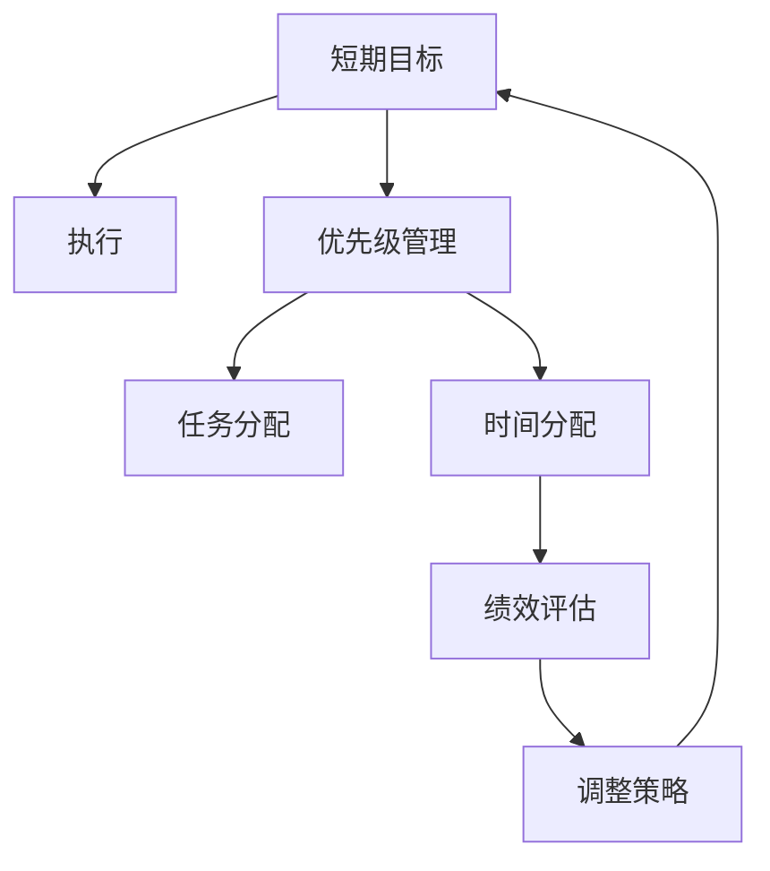

                 

# 双重目标法:管理者保持高效专注

在充满不确定性的商业环境中，管理者面临着多重压力和挑战，如何在各种任务之间保持高效和专注，成为一个重要的话题。本文将介绍一种名为“双重目标法”的方法，通过同时设定短期和长期目标，帮助管理者更好地管理时间和资源，提升团队绩效。

## 1. 背景介绍

### 1.1 问题由来

随着数字化和全球化的推进，企业竞争环境变得越来越复杂。管理者需要同时处理战略决策、日常运营、团队管理等多方面的工作，任务繁多且时间紧迫。如何在有限的时间和资源下，高效完成任务，同时保持对未来发展的战略布局，是一个重要的管理问题。

### 1.2 问题核心关键点

双重目标法是一种目标管理方法，通过设定短期和长期目标，帮助管理者平衡日常运营和长期战略。其核心在于：
1. **短期目标**：指即刻需要完成的任务和项目，如季度报告、新产品上线等。
2. **长期目标**：指对公司未来有重大影响的战略决策，如市场拓展、技术创新等。
3. **时间分配**：将时间和资源合理分配给短期和长期目标，确保两者并行不悖。

### 1.3 问题研究意义

研究双重目标法，对提高企业运营效率、提升战略执行力、促进团队合作具有重要意义：
1. **提高效率**：通过明确任务优先级和时间分配，管理者可以避免陷入短期工作的泥潭，提高整体效率。
2. **战略执行**：确保长期目标得到重视和执行，避免短视行为，促进企业长远发展。
3. **团队协作**：明确团队任务和职责，促进成员间的协作和沟通，提升团队凝聚力。

## 2. 核心概念与联系

### 2.1 核心概念概述

为更好地理解双重目标法，本节将介绍几个密切相关的核心概念：

- **短期目标**：即刻需要完成的任务或项目，如财务报表、客户提案等。
- **长期目标**：对公司未来有重大影响的战略决策，如市场拓展、技术研发等。
- **时间分配**：合理分配时间和资源，确保短期和长期目标的平衡。
- **优先级管理**：根据任务重要性和紧急性，确定任务优先级。
- **绩效评估**：对短期和长期目标的完成情况进行评估，及时调整策略。

这些核心概念之间的逻辑关系可以通过以下Mermaid流程图来展示：



这个流程图展示了两大目标从设定到执行的完整流程：

1. 短期目标设定后进行优先级管理。
2. 根据优先级分配任务和时间。
3. 执行任务并评估绩效。
4. 根据绩效调整策略并回到短期目标设定。

## 3. 核心算法原理 & 具体操作步骤

### 3.1 算法原理概述

双重目标法通过设定短期和长期目标，帮助管理者平衡日常运营和战略决策。其核心思想是：
- **短期目标**：关注即刻需要完成的任务和项目。
- **长期目标**：聚焦对公司未来有重大影响的战略决策。
- **时间分配**：合理分配时间和资源，确保两者并行不悖。

### 3.2 算法步骤详解

双重目标法一般包括以下几个关键步骤：

**Step 1: 设定短期和长期目标**
- **短期目标设定**：明确即刻需要完成的任务和项目，如季度报告、新产品上线等。
- **长期目标设定**：确定对公司未来有重大影响的战略决策，如市场拓展、技术创新等。

**Step 2: 确定优先级**
- **任务优先级**：根据任务的重要性和紧急性，设定优先级。可以使用Eisenhower矩阵等工具帮助分析。
- **时间分配**：根据优先级，分配时间和资源，确保关键任务优先完成。

**Step 3: 执行任务**
- **短期任务执行**：集中精力完成短期目标，确保按时交付。
- **长期任务推进**：定期检查和调整长期目标的执行进度，确保战略落地。

**Step 4: 绩效评估**
- **短期绩效**：对短期目标的完成情况进行评估，及时调整策略。
- **长期绩效**：对长期目标的进展情况进行评估，确保战略方向正确。

**Step 5: 策略调整**
- **短期调整**：根据短期绩效结果，调整任务优先级和时间分配。
- **长期调整**：根据长期绩效结果，重新审视和调整长期战略。

### 3.3 算法优缺点

双重目标法具有以下优点：
1. **平衡运营和战略**：确保日常运营和战略决策都能得到有效管理。
2. **提高效率**：通过明确优先级和时间分配，提升整体效率。
3. **增强战略执行力**：确保长期目标得到重视和执行。
4. **促进团队协作**：明确团队任务和职责，促进成员间的协作和沟通。

同时，该方法也存在一定的局限性：
1. **复杂性**：需要管理者具备较高的战略视野和执行能力。
2. **灵活性不足**：对于一些紧急情况，可能无法及时调整策略。
3. **资源限制**：在资源有限的情况下，可能难以兼顾短期和长期目标。
4. **绩效评估难度**：短期和长期目标的评估标准和指标可能不同，难以统一。

尽管存在这些局限性，但就目前而言，双重目标法仍是一种有效的大规模管理方法，可以帮助管理者在复杂环境中保持高效和专注。

### 3.4 算法应用领域

双重目标法在企业管理中得到了广泛应用，以下是几个典型场景：

1. **企业战略规划**：设定短期和长期目标，平衡日常运营和战略决策。
2. **项目管理和执行**：对项目进行优先级管理，合理分配资源和时间，确保按时交付。
3. **人力资源管理**：根据员工的短期和长期职业目标，制定相应的培训和发展计划。
4. **财务规划和分析**：设定短期财务目标和长期投资目标，进行合理的资金分配和投资决策。
5. **市场营销**：设定短期销售目标和长期品牌战略，平衡即时收益和长期市场份额。

## 4. 数学模型和公式 & 详细讲解 & 举例说明（备注：数学公式请使用latex格式，latex嵌入文中独立段落使用 $$，段落内使用 $)
### 4.1 数学模型构建

设 $S$ 为短期目标集合，$L$ 为长期目标集合。设 $P(S)$ 为短期目标 $S$ 的优先级，$P(L)$ 为长期目标 $L$ 的优先级。设 $T$ 为总可用时间，$R$ 为总可用资源。

假设 $T_1$ 为分配给短期目标的可用时间，$T_2$ 为分配给长期目标的可用时间。假设 $R_1$ 为分配给短期目标的可用资源，$R_2$ 为分配给长期目标的可用资源。

目标优化问题为：

$$
\max_{T_1, T_2, R_1, R_2} \text{效用函数 } U(P(S), P(L))
$$

约束条件为：

$$
T_1 + T_2 = T \\
R_1 + R_2 = R
$$

### 4.2 公式推导过程

效用函数 $U(P(S), P(L))$ 可以表示为：

$$
U = k_1 \sum_{s \in S} \frac{P(s)}{T_1} + k_2 \sum_{l \in L} \frac{P(l)}{T_2}
$$

其中 $k_1$ 和 $k_2$ 为权重因子，表示短期和长期目标的相对重要程度。

目标优化问题转化为：

$$
\max_{T_1, T_2, R_1, R_2} \sum_{s \in S} \frac{P(s)}{T_1} + \sum_{l \in L} \frac{P(l)}{T_2}
$$

约束条件为：

$$
T_1 + T_2 = T \\
R_1 + R_2 = R
$$

这是一个典型的多目标优化问题，可以通过线性规划求解。

### 4.3 案例分析与讲解

**案例1: 企业战略规划**

某公司正在进行年度战略规划，设定了短期和长期目标。短期目标包括完成季度财务报告、发布新产品等，长期目标包括拓展海外市场、技术创新等。

设 $S=\{财务报告,新产品\}$，$L=\{海外市场,技术创新\}$。

优先级分别为 $P(S)=0.8$，$P(L)=0.2$。

总可用时间为 $T=120$ 天，总可用资源为 $R=100$。

假设短期目标需要 $T_1=60$ 天，长期目标需要 $T_2=60$ 天，短期资源需要 $R_1=70$，长期资源需要 $R_2=30$。

目标优化问题为：

$$
\max_{T_1, T_2, R_1, R_2} \frac{P(S)}{T_1} + \frac{P(L)}{T_2}
$$

约束条件为：

$$
T_1 + T_2 = 120 \\
R_1 + R_2 = 100
$$

求解该问题，得到最优解为 $T_1=60$ 天，$T_2=60$ 天，$R_1=70$，$R_2=30$。

这表明，公司应该将短期目标和长期目标平均分配时间，并将更多的资源投入到短期目标中，以确保按时交付。

**案例2: 项目管理和执行**

某项目管理团队设有多个项目，包括软件开发、市场推广等。每个项目有不同优先级和资源需求。

设 $S=\{软件开发,市场推广\}$，$L=\{产品改进,客户培训\}$。

优先级分别为 $P(S)=0.6$，$P(L)=0.4$。

总可用时间为 $T=100$ 天，总可用资源为 $R=50$。

假设短期目标需要 $T_1=50$ 天，长期目标需要 $T_2=50$ 天，短期资源需要 $R_1=40$，长期资源需要 $R_2=10$。

目标优化问题为：

$$
\max_{T_1, T_2, R_1, R_2} \frac{P(S)}{T_1} + \frac{P(L)}{T_2}
$$

约束条件为：

$$
T_1 + T_2 = 100 \\
R_1 + R_2 = 50
$$

求解该问题，得到最优解为 $T_1=50$ 天，$T_2=50$ 天，$R_1=40$，$R_2=10$。

这表明，项目管理团队应该将时间平均分配给短期和长期目标，同时将更多的资源投入到短期目标中，以确保项目按时完成。

## 5. 项目实践：代码实例和详细解释说明
### 5.1 开发环境搭建

在进行双重目标法实践前，我们需要准备好开发环境。以下是使用Python进行Django开发的环境配置流程：

1. 安装Python：从官网下载并安装Python，确保版本为3.6以上。
2. 安装Pip：使用pip命令安装Pip，作为Python包管理工具。
3. 安装Django：使用pip命令安装Django，创建新的Django项目。
4. 创建和管理数据库：使用Django的admin后台，创建和管理数据库模型。
5. 开发环境部署：在本地或服务器上部署Django项目，确保项目能够正常运行。

### 5.2 源代码详细实现

下面我们以Django框架为基础，给出双重目标法的具体实现代码。

首先，定义任务模型：

```python
from django.db import models

class Task(models.Model):
    name = models.CharField(max_length=100)
    priority = models.FloatField()
    duration = models.IntegerField()
    resource = models.IntegerField()
    type = models.CharField(max_length=20)
```

然后，定义任务视图：

```python
from django.shortcuts import render, redirect
from .models import Task

def task_list(request):
    tasks = Task.objects.all()
    return render(request, 'task_list.html', {'tasks': tasks})

def task_add(request):
    if request.method == 'POST':
        name = request.POST['name']
        priority = request.POST['priority']
        duration = request.POST['duration']
        resource = request.POST['resource']
        type = request.POST['type']
        Task.objects.create(name=name, priority=priority, duration=duration, resource=resource, type=type)
        return redirect('task_list')
    else:
        return render(request, 'task_add.html')

def task_edit(request, pk):
    task = Task.objects.get(pk=pk)
    if request.method == 'POST':
        task.name = request.POST['name']
        task.priority = request.POST['priority']
        task.duration = request.POST['duration']
        task.resource = request.POST['resource']
        task.type = request.POST['type']
        task.save()
        return redirect('task_list')
    else:
        return render(request, 'task_edit.html', {'task': task})

def task_delete(request, pk):
    task = Task.objects.get(pk=pk)
    task.delete()
    return redirect('task_list')
```

接下来，定义任务表单：

```python
from django import forms
from .models import Task

class TaskForm(forms.ModelForm):
    class Meta:
        model = Task
        fields = ['name', 'priority', 'duration', 'resource', 'type']
```

最后，定义任务模板：

```html


<h1>任务列表</h1>
<form method="post">
    
    {{ form.as_p }}
    <button type="submit">提交</button>
</form>
<table>
    <thead>
        <tr>
            <th>ID</th>
            <th>名称</th>
            <th>优先级</th>
            <th>持续时间</th>
            <th>资源需求</th>
            <th>类型</th>
            <th>操作</th>
        </tr>
    </thead>
    <tbody>
        
            <tr>
                <td>{{ task.id }}</td>
                <td>{{ task.name }}</td>
                <td>{{ task.priority }}</td>
                <td>{{ task.duration }}</td>
                <td>{{ task.resource }}</td>
                <td>{{ task.type }}</td>
                <td>
                    <a href="">编辑</a>
                    <a href="">删除</a>
                </td>
            </tr>
        
    </tbody>
</table>

```

以上就是使用Django框架进行双重目标法开发的基本代码实现。可以看到，Django提供了强大的ORM和模板系统，可以快速构建管理界面，对任务进行添加、编辑和删除等操作。

### 5.3 代码解读与分析

让我们再详细解读一下关键代码的实现细节：

**任务模型**：
- 定义了任务的基本属性，包括名称、优先级、持续时间、资源需求和类型。

**任务视图**：
- `task_list`视图用于显示任务列表。
- `task_add`视图用于添加新任务。
- `task_edit`视图用于编辑任务。
- `task_delete`视图用于删除任务。

**任务表单**：
- 使用Django的表单类，定义了任务的输入字段，包括名称、优先级、持续时间、资源需求和类型。

**任务模板**：
- 使用Django的模板语言，定义了任务列表的HTML结构。
- 使用``标签动态生成链接，方便在前端操作。

以上代码实现中，Django框架提供了便捷的数据库操作和模板渲染功能，使得双重目标法的实现变得相对简单。开发者可以基于Django的ORM和模板系统，快速构建具有强大管理功能的系统。

## 6. 实际应用场景

### 6.1 企业战略规划

在企业战略规划中，双重目标法可以应用于年度或季度规划。设定短期和长期目标，确保日常运营和战略决策都能得到有效管理。

**实际应用**：某公司设定年度战略规划目标，包括短期目标（完成季度财务报告、发布新产品等）和长期目标（拓展海外市场、技术创新等）。使用双重目标法，将时间和资源合理分配给短期和长期目标，确保战略落地和日常运营的平衡。

### 6.2 项目管理

在项目管理中，双重目标法可以应用于项目优先级和资源分配。设定短期和长期项目，确保项目按时交付和战略推进。

**实际应用**：某项目管理团队设有多个项目，包括软件开发、市场推广等。使用双重目标法，将时间和资源合理分配给短期和长期项目，确保项目按时完成和战略推进。

### 6.3 人力资源管理

在人力资源管理中，双重目标法可以应用于员工培训和发展。设定短期和长期职业目标，确保员工职业发展和公司战略的协同。

**实际应用**：某公司设定员工培训计划，包括短期培训（技能提升、工具使用等）和长期发展（领导力培养、专业深化等）。使用双重目标法，将培训资源合理分配给短期和长期目标，确保员工全面发展。

## 7. 工具和资源推荐

### 7.1 学习资源推荐

为了帮助开发者系统掌握双重目标法，这里推荐一些优质的学习资源：

1. **《管理学》课程**：各大大学开设的管理学课程，包括短期和长期目标设定、优先级管理等基础知识。
2. **《项目管理》书籍**：经典项目管理书籍，如《敏捷项目管理》等，介绍了项目管理的目标设定和优先级管理。
3. **《商业战略》课程**：商学院开设的商业战略课程，包括企业战略规划和执行方法。
4. **《Django文档》**：Django官方文档，提供了Django框架的基本操作和功能实现。
5. **《Django实战》书籍**：Django实战开发书籍，详细介绍了Django框架的开发方法和应用场景。

通过对这些资源的学习实践，相信你一定能够快速掌握双重目标法的精髓，并用于解决实际的运营问题。

### 7.2 开发工具推荐

高效的开发离不开优秀的工具支持。以下是几款用于双重目标法开发的常用工具：

1. **Django**：基于Python的Web框架，提供了便捷的ORM和模板系统，适合快速开发管理界面。
2. **SQLite**：轻量级的关系型数据库，适用于小型项目的数据存储和管理。
3. **JIRA**：项目管理工具，提供了任务分配、优先级管理等功能，方便项目管理。
4. **Google Calendar**：日程管理工具，帮助管理者合理安排时间和任务。
5. **Trello**：任务管理工具，提供了看板式操作，方便团队协作和任务跟踪。

合理利用这些工具，可以显著提升双重目标法的开发效率，加快创新迭代的步伐。

### 7.3 相关论文推荐

双重目标法在管理学中的应用已有多年历史，以下是几篇奠基性的相关论文，推荐阅读：

1. **《目标设定与动机》（Edward Locke）**：介绍了目标设定的理论基础和实践方法，强调目标设定的重要性。
2. **《项目管理与进度控制》（Harold Kerzner）**：介绍了项目管理的理论和方法，包括任务优先级和时间分配。
3. **《战略管理》（Michael Porter）**：介绍了企业战略规划和执行方法，强调短期和长期目标的平衡。
4. **《Django教程》**：Django官方教程，提供了Django框架的详细使用方法和实例代码。
5. **《Django实战开发》**：Django实战开发书籍，提供了Django框架的实际应用案例。

这些论文和书籍代表了双重目标法的理论基础和实践方法，通过学习这些前沿成果，可以帮助研究者把握学科前进方向，激发更多的创新灵感。

## 8. 总结：未来发展趋势与挑战

### 8.1 研究成果总结

本文对双重目标法进行了全面系统的介绍。首先阐述了双重目标法的背景和意义，明确了目标管理在企业管理中的重要价值。其次，从原理到实践，详细讲解了双重目标法的数学模型和操作步骤，给出了代码实例和详细解释。同时，本文还广泛探讨了双重目标法在企业战略规划、项目管理、人力资源管理等多个领域的应用前景，展示了方法论的强大威力。

通过本文的系统梳理，可以看到，双重目标法作为一种科学管理方法，在提升企业运营效率、增强战略执行力、促进团队协作方面具有显著优势。未来，随着管理理论的不断进步和实践的不断积累，双重目标法将得到更加广泛的应用，为企业管理提供更加科学、高效的工具。

### 8.2 未来发展趋势

展望未来，双重目标法将呈现以下几个发展趋势：

1. **智能化管理**：结合人工智能和机器学习技术，自动化目标设定和管理，提高管理效率。
2. **可视化管理**：通过数据可视化技术，实时监控和管理目标进展，提供直观的决策支持。
3. **动态调整**：在动态环境中，实时调整目标和资源分配，确保管理灵活性和适应性。
4. **协同管理**：通过云端协作平台，实现跨部门、跨团队的协同管理，提升整体效率。
5. **量化评估**：建立全面的绩效评估体系，量化目标完成情况，提供科学的评估依据。

这些趋势将使双重目标法更加智能化和灵活化，为企业管理提供更加科学和高效的解决方案。

### 8.3 面临的挑战

尽管双重目标法在企业管理中得到了广泛应用，但在实践中也面临着诸多挑战：

1. **目标设定困难**：短期和长期目标的设定需要高度的经验和智慧，缺乏系统的指导。
2. **资源分配复杂**：在资源有限的情况下，难以兼顾短期和长期目标。
3. **沟通障碍**：不同部门和团队之间缺乏沟通，影响目标的协同实现。
4. **绩效评估困难**：短期和长期目标的评估标准和指标可能不同，难以统一。
5. **执行力度不足**：目标设定容易，执行到位难，需要管理者具备高度的责任心和执行力。

尽管存在这些挑战，但通过科学的管理理论和方法，可以有效应对这些问题，使双重目标法在企业管理中发挥更大的作用。

### 8.4 研究展望

面对双重目标法面临的挑战，未来的研究需要在以下几个方面寻求新的突破：

1. **目标设定方法**：开发更加科学的短期和长期目标设定方法，引入数据驱动和人工智能辅助，提高目标设定的科学性和合理性。
2. **资源分配模型**：建立更加复杂的资源分配模型，考虑资源的多样性和异构性，提高资源分配的科学性和灵活性。
3. **协同管理平台**：开发跨部门、跨团队的协同管理平台，提供实时的协作和沟通功能，提升目标协同实现的效果。
4. **绩效评估体系**：建立科学的绩效评估体系，量化短期和长期目标的完成情况，提供科学的评估依据。
5. **执行力度保障**：制定更加严格的执行机制，确保目标设定和管理落地，提升管理执行力。

这些研究方向的探索，必将引领双重目标法走向更高的台阶，为企业管理提供更加科学、高效的工具。面向未来，双重目标法需要在管理理论和方法上不断创新，才能更好地应对复杂环境下的管理挑战。

## 9. 附录：常见问题与解答

**Q1：双重目标法是否适用于所有企业？**

A: 双重目标法在企业战略规划和项目管理中具有广泛应用价值，但需要根据企业实际情况进行适配。对于小型企业或初创公司，优先考虑短期运营和快速交付；对于大型企业或成熟公司，需要平衡短期和长期目标，制定全面的战略规划。

**Q2：双重目标法如何应对复杂环境？**

A: 在复杂环境中，双重目标法需要结合动态调整和管理，实时监控和评估目标进展，及时调整策略。引入人工智能和机器学习技术，提高目标设定的科学性和资源分配的灵活性，确保目标和资源的合理配置。

**Q3：双重目标法是否需要引入新技术？**

A: 双重目标法的核心在于目标设定和管理，传统的管理方法和工具已足够支撑其实现。但结合新技术和新方法，可以进一步提升管理效率和效果。例如，结合大数据分析和人工智能技术，可以实现更科学的短期和长期目标设定，提高资源分配的科学性和灵活性。

**Q4：双重目标法如何应对资源限制？**

A: 在资源有限的情况下，双重目标法需要优化资源分配策略，确保短期和长期目标的合理配置。可以引入优先级管理和任务调度技术，动态调整资源分配，确保关键任务优先完成。

**Q5：双重目标法如何应对绩效评估困难？**

A: 在绩效评估中，可以制定多维度的评估指标，包括财务指标、战略指标、客户指标等，综合评估短期和长期目标的完成情况。定期进行绩效评估，及时调整策略和资源配置，确保目标管理的效果和持续改进。

通过本文的系统梳理，可以看到，双重目标法作为一种科学管理方法，在提升企业运营效率、增强战略执行力、促进团队协作方面具有显著优势。未来，随着管理理论的不断进步和实践的不断积累，双重目标法将得到更加广泛的应用，为企业管理提供更加科学、高效的工具。相信通过科学的管理理论和方法，可以有效应对复杂环境下的管理挑战，使双重目标法在企业管理中发挥更大的作用。

---

作者：禅与计算机程序设计艺术 / Zen and the Art of Computer Programming

