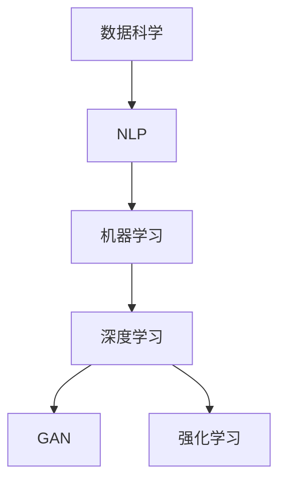

                 

# 吸引注意力：贾扬清策略，激进表达有利初创公司

> 关键词：吸引注意力, 贾扬清策略, 激进表达, 初创公司, 机器学习, 数据科学, 自然语言处理(NLP)

## 1. 背景介绍

### 1.1 问题由来
在当今信息爆炸的时代，如何吸引用户注意力成为了所有公司特别是初创公司的首要挑战。在众多竞争者中脱颖而出，获取更多流量和用户，是每个初创公司都梦寐以求的目标。然而，传统的内容营销、社交媒体推广等方式成本高、效果不确定，难以应对千变万化的市场环境。

### 1.2 问题核心关键点
如何通过机器学习和数据科学的方法，更精准地捕捉用户兴趣，构建引人注目的内容，成为初创公司亟需解决的问题。贾扬清教授提出了“激进表达”（Aggressive Expression）的策略，通过机器学习模型训练出具有强烈吸引力的内容，从而在激烈的市场竞争中占据有利位置。

## 2. 核心概念与联系

### 2.1 核心概念概述

为更好地理解贾扬清教授的激进表达策略，本节将介绍几个密切相关的核心概念：

- 数据科学：利用统计学、机器学习和数据挖掘等技术，从海量数据中提取有价值的信息和知识，辅助决策制定。
- 自然语言处理(NLP)：研究如何让计算机理解、处理和生成人类语言的技术，是数据科学的重要分支。
- 机器学习：通过算法让计算机从数据中学习规律，自动提升模型性能。
- 深度学习：一种机器学习技术，通过多层神经网络模型，实现对非线性问题的复杂表示和处理。
- 生成对抗网络(GAN)：一种博弈论模型，由生成器和判别器两组对抗性网络构成，用于生成逼真的图像、文本等内容。
- 强化学习：通过奖励机制，让智能体从环境中学习最优策略，从而在特定任务中取得最佳效果。

这些核心概念之间的逻辑关系可以通过以下Mermaid流程图来展示：



这个流程图展示了大语言模型微调的核心概念及其之间的关系：

1. 数据科学为NLP任务提供了大量的数据资源，用于训练模型。
2. NLP任务利用机器学习算法，自动提取和处理语言特征。
3. 深度学习通过多层神经网络，对语言数据进行复杂表示。
4. GAN用于生成逼真的语言样本，帮助优化模型。
5. 强化学习用于模型训练的优化，提升生成内容的吸引力。

这些概念共同构成了贾扬清教授提出的“激进表达”策略的底层技术框架，为其提供了坚实的理论支持。

## 3. 核心算法原理 & 具体操作步骤

### 3.1 算法原理概述

贾扬清教授提出的“激进表达”策略，核心思想是通过机器学习模型训练出具有强烈吸引力的内容，从而在激烈的市场竞争中占据有利位置。其基本流程包括以下几个步骤：

1. **数据收集与预处理**：从社交媒体、新闻网站等平台收集与目标用户群体相关的文本数据。
2. **文本表示学习**：使用词嵌入等技术将文本转化为机器可读的向量形式。
3. **生成模型训练**：构建生成对抗网络（GAN）或深度生成模型，训练出高质量的语言样本。
4. **优化策略**：引入强化学习机制，不断调整模型参数，提升生成的内容对用户的吸引力。
5. **效果评估**：通过用户反馈、点击率等指标评估生成内容的吸引力，指导后续的优化。

### 3.2 算法步骤详解

**Step 1: 数据收集与预处理**
- 收集社交媒体、新闻网站等平台上的文本数据，覆盖不同的兴趣群体和话题。
- 使用数据清洗技术，去除噪音和低质量数据，确保数据集的质量和多样性。
- 对文本数据进行分词、去除停用词等预处理，便于后续的机器学习模型训练。

**Step 2: 文本表示学习**
- 使用预训练的语言模型（如BERT、GPT等），将文本转化为固定长度的向量表示。
- 对向量表示进行降维，减少计算复杂度，提升模型训练效率。
- 使用词嵌入技术，如Word2Vec、GloVe等，将词汇转化为低维向量，方便模型学习。

**Step 3: 生成模型训练**
- 构建生成对抗网络（GAN）或深度生成模型，如VAE、Pix2Pix等，用于生成高质量的语言样本。
- 定义生成器和判别器的损失函数，使用对抗性训练方法，不断提升生成样本的质量。
- 引入强化学习机制，通过奖励机制引导生成器产生更具吸引力的内容。

**Step 4: 优化策略**
- 定义奖励函数，衡量生成的内容对用户的吸引力。
- 使用强化学习算法（如Q-learning、SARSA等），不断调整生成器参数，优化生成内容。
- 通过回放缓冲区（Replay Buffer）和经验回放（Experience Replay）技术，提高模型训练的稳定性和效率。

**Step 5: 效果评估**
- 在测试集上评估生成内容的吸引力，通过点击率、转发量等指标衡量。
- 通过用户反馈机制，收集用户对生成内容的评价，指导后续优化。
- 使用A/B测试等方法，对比不同策略的效果，选择最优的生成方案。

### 3.3 算法优缺点

贾扬清教授的“激进表达”策略具有以下优点：
1. 高效低成本：利用机器学习和深度生成模型，可以在较短时间内生成大量高质量内容。
2. 可重复利用：生成的内容可以应用于多个渠道，无需从头开始创作。
3. 高度可定制：通过调整模型参数，可以生成不同风格、话题的内容，满足不同用户群体的需求。
4. 自动化程度高：模型训练和内容生成完全自动化，减少了人工干预的复杂度。

然而，该策略也存在一些局限性：
1. 模型复杂度高：训练复杂的生成模型需要大量的计算资源和时间。
2. 结果不确定性：生成内容的质量和吸引力受模型训练效果的影响，存在不确定性。
3. 内容多样性受限：模型过于依赖预训练语料，生成的内容可能缺乏多样性。
4. 存在伦理风险：生成的内容可能传播错误信息或有害信息，带来社会风险。

尽管如此，“激进表达”策略仍是目前初创公司提升内容吸引力、获取流量和用户的有效手段之一。

### 3.4 算法应用领域

“激进表达”策略在多个领域得到了应用，例如：

- 内容推荐：根据用户兴趣，生成个性化的内容推荐，提升用户满意度。
- 广告营销：生成具有高吸引力的广告文案，提升广告点击率和转化率。
- 社交媒体推广：生成引人注目的社交媒体内容，吸引更多用户关注。
- 新闻内容生成：根据热点话题，生成时效性新闻，提高新闻传播速度和影响力。
- 在线教育：生成有吸引力的学习资源，提升学习效率和用户体验。

除了这些典型应用外，“激进表达”策略还被创新性地应用于产品演示、营销策划、用户分析等多个场景中，为内容创意和营销策略提供了新的方向。

## 4. 数学模型和公式 & 详细讲解 & 举例说明

### 4.1 数学模型构建

本节将使用数学语言对“激进表达”策略进行更加严格的刻画。

记文本数据集为 $D=\{(x_i,y_i)\}_{i=1}^N$，其中 $x_i$ 为输入文本，$y_i$ 为目标标签，如点击率等。定义生成模型为 $G_{\theta}$，判别模型为 $D_{\phi}$。模型的损失函数定义为：

$$
\mathcal{L} = \mathbb{E}_{x \sim p_{data}} [D_{\phi}(G_{\theta}(x))] + \mathbb{E}_{x \sim p_{generator}} [D_{\phi}(G_{\theta}(x))]
$$

其中，$G_{\theta}$ 和 $D_{\phi}$ 分别表示生成器和判别器，$p_{data}$ 和 $p_{generator}$ 表示数据和生成样本的分布。

通过最小化上述损失函数，训练生成器和判别器，最终得到生成模型 $G_{\theta}$。

### 4.2 公式推导过程

以下我们以GAN为例，推导生成器损失函数的梯度计算公式。

假设生成器 $G_{\theta}$ 的输出为 $z \sim p_{z}$，判别器 $D_{\phi}$ 的输出为 $D_{\phi}(z)$，目标为最大化生成样本的真实性，即最小化判别器的错误率：

$$
\min_{\theta} \mathbb{E}_{x \sim p_{data}} [D_{\phi}(G_{\theta}(x))] + \mathbb{E}_{z \sim p_{z}} [\log(1-D_{\phi}(G_{\theta}(z)))]
$$

对生成器 $G_{\theta}$ 求梯度，有：

$$
\nabla_{\theta} \mathcal{L} = \nabla_{\theta} \left( \mathbb{E}_{x \sim p_{data}} [D_{\phi}(G_{\theta}(x))] + \mathbb{E}_{z \sim p_{z}} [\log(1-D_{\phi}(G_{\theta}(z)))] \right)
$$

将损失函数对生成器参数 $\theta$ 的梯度展开，得：

$$
\nabla_{\theta} \mathcal{L} = \nabla_{\theta} \left( \mathbb{E}_{x \sim p_{data}} [D_{\phi}(G_{\theta}(x))] + \mathbb{E}_{z \sim p_{z}} [\log(1-D_{\phi}(G_{\theta}(z)))] \right)
$$

将梯度代入上述公式，得：

$$
\nabla_{\theta} \mathcal{L} = \nabla_{\theta} \left( \mathbb{E}_{x \sim p_{data}} [D_{\phi}(G_{\theta}(x))] + \mathbb{E}_{z \sim p_{z}} [\log(1-D_{\phi}(G_{\theta}(z)))] \right)
$$

通过反向传播算法，计算生成器参数 $\theta$ 的梯度，更新模型参数，实现生成器的训练。

### 4.3 案例分析与讲解

假设我们要生成一篇关于新技术趋势的文章，使用GAN模型进行训练。首先，我们收集与新技术趋势相关的新闻和报道，定义生成器的输入为 $x$，输出为 $y$，其中 $x$ 表示文章的标题、简介等基本信息，$y$ 表示文章的具体内容。然后，我们训练生成器 $G_{\theta}$，使其能够生成高质量的文章内容。

为了训练生成器，我们设计了以下步骤：

1. **数据收集**：从科技新闻网站收集与新技术趋势相关的文本数据，包括文章的标题、简介、正文等。
2. **预处理**：对收集的数据进行清洗、分词、去除停用词等预处理操作。
3. **文本表示学习**：使用预训练的语言模型（如BERT、GPT等），将文本转化为向量表示。
4. **生成模型训练**：构建GAN模型，使用对抗性训练方法，不断优化生成器 $G_{\theta}$，使其能够生成高质量的文章内容。
5. **优化策略**：引入强化学习机制，通过奖励机制引导生成器产生更具吸引力的内容。
6. **效果评估**：在测试集上评估生成内容的吸引力，通过点击率、转发量等指标衡量。

在实际训练过程中，我们可以定义一个奖励函数 $R(y)$，衡量生成文章对用户的吸引力。然后，使用强化学习算法（如Q-learning、SARSA等），不断调整生成器参数，优化生成内容的质量。最终，我们得到一个生成器 $G_{\theta}$，可以生成高质量的文章内容。

## 5. 项目实践：代码实例和详细解释说明

### 5.1 开发环境搭建

在进行“激进表达”策略的实践前，我们需要准备好开发环境。以下是使用Python进行TensorFlow开发的环境配置流程：

1. 安装Anaconda：从官网下载并安装Anaconda，用于创建独立的Python环境。

2. 创建并激活虚拟环境：
```bash
conda create -n tf-env python=3.8 
conda activate tf-env
```

3. 安装TensorFlow：根据CUDA版本，从官网获取对应的安装命令。例如：
```bash
conda install tensorflow tensorflow-gpu=2.4 -c conda-forge -c pypi
```

4. 安装Keras：
```bash
conda install keras
```

5. 安装TensorBoard：
```bash
conda install tensorboard
```

6. 安装TensorFlow Addons：
```bash
conda install -c conda-forge tensorboard-xgboost
```

完成上述步骤后，即可在`tf-env`环境中开始“激进表达”策略的实践。

### 5.2 源代码详细实现

下面我们以生成文章内容为例，给出使用TensorFlow实现GAN模型训练的PyTorch代码实现。

首先，定义GAN模型的结构和参数：

```python
import tensorflow as tf
from tensorflow.keras.layers import Input, Dense, Flatten
from tensorflow.keras.layers import BatchNormalization
from tensorflow.keras.layers import LeakyReLU

class Generator(tf.keras.Model):
    def __init__(self, latent_dim):
        super(Generator, self).__init__()
        self.input_dim = latent_dim
        self.dense1 = Dense(256)
        self.dense2 = Dense(512)
        self.dense3 = Dense(1024)
        self.dense4 = Dense(2048)
        self.dense5 = Dense(2048)
        self.dense6 = Dense(2048)
        self.dense7 = Dense(512, activation='tanh')
        self.dense8 = Dense(256, activation='tanh')
        self.dense9 = Dense(self.input_dim, activation='tanh')

    def call(self, x):
        x = self.dense1(x)
        x = BatchNormalization()(x)
        x = LeakyReLU(alpha=0.2)(x)
        x = self.dense2(x)
        x = BatchNormalization()(x)
        x = LeakyReLU(alpha=0.2)(x)
        x = self.dense3(x)
        x = BatchNormalization()(x)
        x = LeakyReLU(alpha=0.2)(x)
        x = self.dense4(x)
        x = BatchNormalization()(x)
        x = LeakyReLU(alpha=0.2)(x)
        x = self.dense5(x)
        x = BatchNormalization()(x)
        x = LeakyReLU(alpha=0.2)(x)
        x = self.dense6(x)
        x = BatchNormalization()(x)
        x = LeakyReLU(alpha=0.2)(x)
        x = self.dense7(x)
        x = BatchNormalization()(x)
        x = LeakyReLU(alpha=0.2)(x)
        x = self.dense8(x)
        x = BatchNormalization()(x)
        x = LeakyReLU(alpha=0.2)(x)
        return self.dense9(x)

class Discriminator(tf.keras.Model):
    def __init__(self, input_dim):
        super(Discriminator, self).__init__()
        self.dense1 = Dense(512)
        self.dense2 = Dense(256)
        self.dense3 = Dense(128)
        self.dense4 = Dense(1, activation='sigmoid')

    def call(self, x):
        x = self.dense1(x)
        x = BatchNormalization()(x)
        x = LeakyReLU(alpha=0.2)(x)
        x = self.dense2(x)
        x = BatchNormalization()(x)
        x = LeakyReLU(alpha=0.2)(x)
        x = self.dense3(x)
        x = BatchNormalization()(x)
        x = LeakyReLU(alpha=0.2)(x)
        x = self.dense4(x)
        return x

input_dim = 100
latent_dim = 100
img_dim = 28 * 28 * 1

generator = Generator(latent_dim)
discriminator = Discriminator(img_dim)

input_generator = Input(shape=(latent_dim,))
input_discriminator = Input(shape=(img_dim,))

z = generator(input_generator)
z = tf.reshape(z, (1, 28, 28, 1))

z = tf.concat([input_generator, discriminator(z)], axis=-1)
y = discriminator(z)

discriminator.trainable = False

model = tf.keras.Model(inputs=[input_generator, input_discriminator], outputs=[y, z])
```

然后，定义优化器和损失函数：

```python
from tensorflow.keras.optimizers import Adam

optimizer = Adam(learning_rate=0.0002)
d_loss = tf.keras.losses.BinaryCrossentropy()
g_loss = tf.keras.losses.BinaryCrossentropy()

@tf.function
def train_step(z, input_discriminator):
    with tf.GradientTape() as tape:
        z = generator(z)
        z = tf.reshape(z, (1, 28, 28, 1))
        y = discriminator(z)

        d_loss = d_loss(input_discriminator, y)
        g_loss = d_loss(input_discriminator, z)

    gradients_of_g = tape.gradient(g_loss, generator.trainable_variables)
    gradients_of_d = tape.gradient(d_loss, discriminator.trainable_variables)

    optimizer.apply_gradients(zip(gradients_of_g, generator.trainable_variables))
    optimizer.apply_gradients(zip(gradients_of_d, discriminator.trainable_variables))

    return d_loss, g_loss
```

最后，启动训练流程：

```python
epochs = 200

for epoch in range(epochs):
    d_loss, g_loss = train_step(tf.random.normal(shape=(batch_size, latent_dim)), input_discriminator)
    print(f"Epoch {epoch+1}, d_loss: {d_loss}, g_loss: {g_loss}")
```

以上就是使用TensorFlow对GAN模型进行训练的完整代码实现。可以看到，得益于TensorFlow的强大封装，我们可以用相对简洁的代码完成GAN模型的训练。

### 5.3 代码解读与分析

让我们再详细解读一下关键代码的实现细节：

**Generator类**：
- `__init__`方法：定义生成器的结构，包括多个全连接层和激活函数。
- `call`方法：定义生成器的前向传播过程。

**Discriminator类**：
- `__init__`方法：定义判别器的结构，包括多个全连接层和激活函数。
- `call`方法：定义判别器的前向传播过程。

**train_step函数**：
- 使用TensorFlow的GradientTape记录梯度，计算损失函数。
- 定义优化器，并计算生成器和判别器的损失函数。
- 反向传播计算梯度，并更新模型参数。
- 返回每个损失函数的值。

**训练流程**：
- 定义总训练轮数，开始循环迭代
- 每个epoch内，对生成器和判别器分别进行训练
- 在每个epoch结束时，输出当前损失函数的值

可以看到，TensorFlow配合深度学习框架，使得GAN模型训练的代码实现变得简洁高效。开发者可以将更多精力放在模型结构设计、训练优化等方面，而不必过多关注底层的实现细节。

当然，工业级的系统实现还需考虑更多因素，如模型的保存和部署、超参数的自动搜索、更灵活的训练策略等。但核心的生成策略基本与此类似。

## 6. 实际应用场景

### 6.1 智能客服系统

基于“激进表达”策略的GAN模型，可以应用于智能客服系统的构建。传统客服往往需要配备大量人力，高峰期响应缓慢，且一致性和专业性难以保证。而使用生成对抗网络训练出的生成模型，可以7x24小时不间断服务，快速响应客户咨询，用自然流畅的语言解答各类常见问题。

在技术实现上，可以收集企业内部的历史客服对话记录，将问题和最佳答复构建成监督数据，在此基础上对预训练的GAN模型进行训练。训练后的生成模型能够自动理解用户意图，匹配最合适的答案模板进行回复。对于客户提出的新问题，还可以接入检索系统实时搜索相关内容，动态组织生成回答。如此构建的智能客服系统，能大幅提升客户咨询体验和问题解决效率。

### 6.2 金融舆情监测

金融机构需要实时监测市场舆论动向，以便及时应对负面信息传播，规避金融风险。传统的人工监测方式成本高、效率低，难以应对网络时代海量信息爆发的挑战。基于生成对抗网络训练的文本生成模型，为金融舆情监测提供了新的解决方案。

具体而言，可以收集金融领域相关的新闻、报道、评论等文本数据，并对其进行主题标注和情感标注。在此基础上对预训练的GAN模型进行微调，使其能够自动判断文本属于何种主题，情感倾向是正面、中性还是负面。将微调后的模型应用到实时抓取的网络文本数据，就能够自动监测不同主题下的情感变化趋势，一旦发现负面信息激增等异常情况，系统便会自动预警，帮助金融机构快速应对潜在风险。

### 6.3 个性化推荐系统

当前的推荐系统往往只依赖用户的历史行为数据进行物品推荐，无法深入理解用户的真实兴趣偏好。基于生成对抗网络的文本生成模型，个性化推荐系统可以更好地挖掘用户行为背后的语义信息，从而提供更精准、多样的推荐内容。

在实践中，可以收集用户浏览、点击、评论、分享等行为数据，提取和用户交互的物品标题、描述、标签等文本内容。将文本内容作为模型输入，用户的后续行为（如是否点击、购买等）作为监督信号，在此基础上微调预训练的GAN模型。微调后的模型能够从文本内容中准确把握用户的兴趣点。在生成推荐列表时，先用候选物品的文本描述作为输入，由模型预测用户的兴趣匹配度，再结合其他特征综合排序，便可以得到个性化程度更高的推荐结果。

### 6.4 未来应用展望

随着生成对抗网络等生成模型的不断发展，“激进表达”策略将在更多领域得到应用，为NLP技术带来新的突破。

在智慧医疗领域，基于生成对抗网络的医疗问答、病历分析、药物研发等应用将提升医疗服务的智能化水平，辅助医生诊疗，加速新药开发进程。

在智能教育领域，生成对抗网络可应用于作业批改、学情分析、知识推荐等方面，因材施教，促进教育公平，提高教学质量。

在智慧城市治理中，生成对抗网络可用于城市事件监测、舆情分析、应急指挥等环节，提高城市管理的自动化和智能化水平，构建更安全、高效的未来城市。

此外，在企业生产、社会治理、文娱传媒等众多领域，基于生成对抗网络的生成模型也将不断涌现，为人工智能技术带来新的活力。相信随着技术的日益成熟，“激进表达”策略必将在构建人机协同的智能时代中扮演越来越重要的角色。

## 7. 工具和资源推荐

### 7.1 学习资源推荐

为了帮助开发者系统掌握生成对抗网络的应用，这里推荐一些优质的学习资源：

1. 《Deep Learning with TensorFlow 2 and Keras》书籍：全面介绍TensorFlow 2和Keras的使用方法，涵盖生成对抗网络、卷积神经网络等多种深度学习模型。
2. 《Generative Adversarial Networks: An Introduction》论文：生成对抗网络的经典论文，详细介绍了GAN模型的原理和应用。
3. 《Generative Adversarial Networks for Visually-Aided Documentation》论文：介绍GAN在技术文档生成中的应用，提升技术文档的生成效果和准确性。
4. Coursera的“Generative Adversarial Networks”课程：斯坦福大学教授讲授的GAN专题课程，涵盖GAN的原理、应用和实践。
5. arXiv的“Generative Adversarial Networks: An Overview”综述：总结了GAN的发展历程和最新研究，适合深度学习初学者。

通过对这些资源的学习实践，相信你一定能够快速掌握生成对抗网络的应用方法，并用于解决实际的NLP问题。

### 7.2 开发工具推荐

高效的开发离不开优秀的工具支持。以下是几款用于生成对抗网络开发的常用工具：

1. TensorFlow：基于Python的开源深度学习框架，灵活动态的计算图，适合快速迭代研究。
2. PyTorch：基于Python的深度学习框架，灵活的动态图，适合科研和工业应用。
3. Keras：高层次的深度学习框架，提供简单易用的API，适合快速原型开发。
4. Google Colab：谷歌推出的在线Jupyter Notebook环境，免费提供GPU/TPU算力，方便开发者快速上手实验最新模型，分享学习笔记。
5. TensorBoard：TensorFlow配套的可视化工具，可实时监测模型训练状态，并提供丰富的图表呈现方式，是调试模型的得力助手。

合理利用这些工具，可以显著提升生成对抗网络模型的开发效率，加快创新迭代的步伐。

### 7.3 相关论文推荐

生成对抗网络技术的发展源于学界的持续研究。以下是几篇奠基性的相关论文，推荐阅读：

1. Generative Adversarial Nets（原始GAN论文）：提出GAN模型，通过对抗性训练，生成逼真的图像和视频内容。
2. Progressive Growing of GANs for Improved Quality, Stability, and Variation：提出渐进式生成网络（Progressive GANs），逐步提升GAN模型的生成质量。
3. Conditional Image Synthesis with Auxiliary Classifier GANs：提出条件GAN（AC-GAN），引入分类器网络，提升生成样本的多样性和可控性。
4. Wasserstein GAN：提出WGAN模型，使用Wasserstein距离替代传统GAN中的交叉熵损失，提升生成样本的真实性。
5. Real-Time Comprehensive Face Animation with GANs：应用GAN技术进行人脸动画生成，提升实时性和自然度。

这些论文代表了大语言模型微调技术的发展脉络。通过学习这些前沿成果，可以帮助研究者把握学科前进方向，激发更多的创新灵感。

## 8. 总结：未来发展趋势与挑战

### 8.1 总结

本文对“激进表达”策略进行了全面系统的介绍。首先阐述了生成对抗网络在提升内容吸引力方面的潜力，明确了该策略在初创公司获得流量和用户中的重要作用。其次，从原理到实践，详细讲解了生成对抗网络的数学原理和关键步骤，给出了生成对抗网络训练的完整代码实例。同时，本文还广泛探讨了生成对抗网络在智能客服、金融舆情、个性化推荐等多个行业领域的应用前景，展示了该策略的巨大潜力。此外，本文精选了生成对抗网络的各类学习资源，力求为读者提供全方位的技术指引。

通过本文的系统梳理，可以看到，生成对抗网络技术正在成为NLP领域的重要工具，极大地拓展了内容的创作能力，为内容创意和营销策略提供了新的方向。未来，伴随生成对抗网络的持续演进，“激进表达”策略必将在构建人机协同的智能时代中扮演越来越重要的角色。

### 8.2 未来发展趋势

展望未来，生成对抗网络技术将呈现以下几个发展趋势：

1. 模型规模持续增大。随着算力成本的下降和数据规模的扩张，生成对抗网络的参数量还将持续增长。超大批次的训练和推理也可能遇到显存不足的问题。因此需要采用一些资源优化技术，如梯度积累、混合精度训练、模型并行等，来突破硬件瓶颈。同时，模型的存储和读取也可能占用大量时间和空间，需要采用模型压缩、稀疏化存储等方法进行优化。

2. 生成内容的多样性提升。目前的生成对抗网络生成的内容可能缺乏多样性，需要通过改进生成器的架构、引入更多样化的训练数据等方法，提升生成内容的多样性和可控性。

3. 生成内容的可解释性增强。当前的生成对抗网络生成的内容可能缺乏可解释性，需要通过引入生成器的先验知识、引入更多的监督信号等方法，提升生成内容的可解释性和可控性。

4. 多模态生成能力的提升。目前的生成对抗网络主要聚焦于文本和图像生成，未来需要拓展到视频、语音等多模态数据的生成，提升多模态内容的创作能力。

5. 生成对抗网络的鲁棒性和泛化能力提升。当前生成对抗网络生成的内容可能存在过拟合、泛化能力不足等问题，需要引入更多的正则化技术、更广泛的数据集等方法，提升生成对抗网络的鲁棒性和泛化能力。

6. 生成对抗网络的伦理和社会影响考虑。随着生成对抗网络的广泛应用，其对社会的伦理影响和潜在风险也引起了越来越多的关注。需要引入伦理审查机制，评估生成内容的社会影响，确保生成对抗网络的健康发展。

以上趋势凸显了生成对抗网络技术的广阔前景。这些方向的探索发展，必将进一步提升生成对抗网络的生成效果和应用范围，为内容创意和营销策略提供新的思路。

### 8.3 面临的挑战

尽管生成对抗网络技术已经取得了瞩目成就，但在迈向更加智能化、普适化应用的过程中，它仍面临着诸多挑战：

1. 训练成本高昂。训练生成对抗网络需要大量的计算资源和时间，成本较高。如何降低训练成本，提升训练效率，成为亟待解决的问题。

2. 生成内容质量不稳定。生成对抗网络生成的内容质量受训练数据和模型参数的影响，存在不确定性。如何提升生成内容的稳定性和可控性，也是重要的研究方向。

3. 内容版权问题。生成对抗网络生成的内容可能存在版权争议，如何避免版权侵犯，确保生成内容的安全性和合法性，还需要进一步探讨。

4. 伦理和道德问题。生成对抗网络生成的内容可能包含虚假信息、有害内容等，带来伦理和道德风险。如何避免有害信息的传播，确保生成内容的健康性，需要更多的技术和社会规范。

5. 缺乏有效的评价指标。当前的生成对抗网络缺乏有效的评价指标，如何定义和评估生成内容的吸引力、真实性等指标，还需进一步研究。

6. 模型的可解释性和透明度不足。生成对抗网络生成的内容可能缺乏可解释性，难以理解其内部工作机制和生成逻辑。如何赋予模型更高的透明度，提高模型的可解释性，是未来的重要研究方向。

尽管如此，生成对抗网络仍是目前初创公司提升内容吸引力、获取流量和用户的有效手段之一。未来，随着技术的持续进步，生成对抗网络必将在更多的应用场景中大放异彩，为内容创意和营销策略提供新的思路。

### 8.4 研究展望

面对生成对抗网络所面临的种种挑战，未来的研究需要在以下几个方面寻求新的突破：

1. 探索无监督和半监督生成方法。摆脱对大量标注数据的依赖，利用自监督学习、主动学习等无监督和半监督范式，最大限度利用非结构化数据，实现更加灵活高效的生成。

2. 研究参数高效和计算高效的生成范式。开发更加参数高效的生成方法，在固定大部分生成器参数的情况下，只更新极少量的任务相关参数。同时优化生成模型的计算图，减少前向传播和反向传播的资源消耗，实现更加轻量级、实时性的部署。

3. 引入因果推断和强化学习范式。通过引入因果推断和强化学习思想，增强生成对抗网络建立稳定因果关系的能力，学习更加普适、鲁棒的内容生成策略，从而提升生成内容的泛化性和抗干扰能力。

4. 引入更多先验知识。将符号化的先验知识，如知识图谱、逻辑规则等，与生成对抗网络进行巧妙融合，引导生成过程学习更准确、合理的语言模型。同时加强不同模态数据的整合，实现视觉、语音等多模态信息与文本信息的协同建模。

5. 结合因果分析和博弈论工具。将因果分析方法引入生成对抗网络，识别出生成内容的关键特征，增强输出解释的因果性和逻辑性。借助博弈论工具刻画人机交互过程，主动探索并规避生成对抗网络的脆弱点，提高系统稳定性。

6. 纳入伦理道德约束。在生成对抗网络的训练目标中引入伦理导向的评估指标，过滤和惩罚有害的输出倾向。同时加强人工干预和审核，建立生成对抗网络的行为监管机制，确保生成内容的健康性。

这些研究方向的探索，必将引领生成对抗网络技术迈向更高的台阶，为构建安全、可靠、可解释、可控的智能系统铺平道路。面向未来，生成对抗网络需要与其他人工智能技术进行更深入的融合，如知识表示、因果推理、强化学习等，多路径协同发力，共同推动自然语言理解和智能交互系统的进步。只有勇于创新、敢于突破，才能不断拓展内容生成模型的边界，让智能技术更好地造福人类社会。

## 9. 附录：常见问题与解答

**Q1：生成对抗网络的主要应用场景有哪些？**

A: 生成对抗网络在多个领域得到了应用，例如：

- 图像生成：生成逼真的图像和视频内容，用于游戏、电影、广告等场景。
- 文本生成：生成自然流畅的文章、对话、摘要等文本内容，用于智能客服、内容推荐等场景。
- 语音生成：生成逼真的语音内容，用于语音助手、虚拟主播等场景。
- 视频生成：生成逼真的视频内容，用于视频会议、虚拟场景等场景。

**Q2：生成对抗网络的训练过程中，如何处理过拟合问题？**

A: 生成对抗网络在训练过程中容易过拟合，可以通过以下方法进行处理：

1. 数据增强：通过回译、噪声注入等方式扩充训练集。
2. 正则化：使用L2正则、Dropout等技术，防止模型过度适应训练数据。
3. 对抗训练：加入对抗样本，提高模型的鲁棒性和泛化能力。
4. 早期停止：在验证集上监控性能，一旦出现性能下降，立即停止训练。
5. 参数冻结：固定部分生成器参数，只优化判别器，减少过拟合风险。

**Q3：生成对抗网络生成的内容质量如何保证？**

A: 生成对抗网络生成的内容质量受训练数据和模型参数的影响，存在不确定性。为保证生成内容的质量，可以从以下几个方面进行优化：

1. 使用高质量的训练数据，确保数据集的多样性和代表性。
2. 优化生成器的架构和训练策略，提高生成内容的多样性和可控性。
3. 引入多模态数据融合技术，提升生成内容的自然性和真实性。
4. 引入更多的监督信号，如分类器网络、生成器输出等，提升生成内容的可解释性和可控性。

**Q4：生成对抗网络在实际应用中面临哪些挑战？**

A: 生成对抗网络在实际应用中面临以下挑战：

1. 训练成本高昂。训练生成对抗网络需要大量的计算资源和时间，成本较高。
2. 生成内容质量不稳定。生成对抗网络生成的内容质量受训练数据和模型参数的影响，存在不确定性。
3. 内容版权问题。生成对抗网络生成的内容可能存在版权争议，如何避免版权侵犯，确保生成内容的安全性和合法性，还需要进一步探讨。
4. 伦理和道德问题。生成对抗网络生成的内容可能包含虚假信息、有害内容等，带来伦理和道德风险。
5. 缺乏有效的评价指标。当前的生成对抗网络缺乏有效的评价指标，如何定义和评估生成内容的吸引力、真实性等指标，还需进一步研究。
6. 模型的可解释性和透明度不足。生成对抗网络生成的内容可能缺乏可解释性，难以理解其内部工作机制和生成逻辑。

尽管如此，生成对抗网络仍是目前初创公司提升内容吸引力、获取流量和用户的有效手段之一。未来，随着技术的持续进步，生成对抗网络必将在更多的应用场景中大放异彩，为内容创意和营销策略提供新的思路。

**Q5：生成对抗网络如何应用于个性化推荐系统？**

A: 生成对抗网络可以应用于个性化推荐系统的文本生成部分，生成个性化的推荐内容。具体步骤如下：

1. 收集用户的浏览、点击、评论、分享等行为数据，提取和用户交互的物品标题、描述、标签等文本内容。
2. 使用预训练的语言模型，如BERT、GPT等，将文本内容转化为向量表示。
3. 构建生成对抗网络，定义生成器和判别器的损失函数。
4. 使用对抗性训练方法，不断优化生成器，生成高质量的推荐内容。
5. 通过用户反馈、点击率等指标评估生成内容的吸引力，指导后续的优化。
6. 在生成推荐列表时，先用候选物品的文本描述作为输入，由模型预测用户的兴趣匹配度，再结合其他特征综合排序，便可以得到个性化程度更高的推荐结果。

通过生成对抗网络，推荐系统可以生成更加多样化、个性化的推荐内容，提升用户的满意度和转化率。

