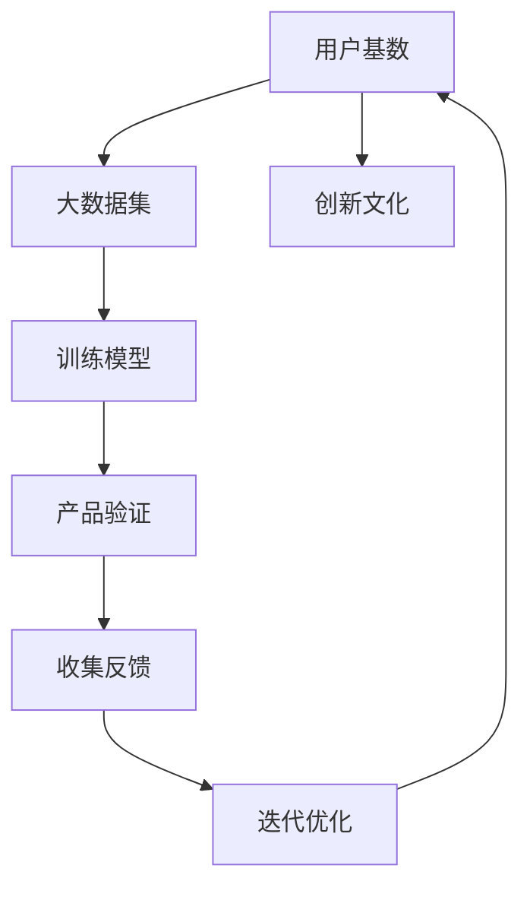

                 

# 国内AI的优势：庞大的用户基数与积极尝试新事物，有利于产品验证与迭代

## 1. 背景介绍

### 1.1 问题由来
近年来，人工智能(AI)技术在全球范围内快速发展，逐渐成为推动社会进步和经济增长的关键力量。相较于全球其他主要科技国家，中国在AI领域展现了强大的创新能力和应用潜力。

**背景背景**
国内AI的优势主要源于两个方面：庞大的用户基数和积极探索新事物的创新文化。这两个因素为AI产品的研发和迭代提供了良好的土壤。

**问题本质**
本文将深入探讨国内AI的这两大优势，分析其在产品验证与迭代过程中的具体表现，以及如何通过这些优势实现AI技术的持续进步。

## 2. 核心概念与联系

### 2.1 核心概念概述
- **AI**：人工智能，通过算法、计算和数据训练，使机器能够执行复杂的任务和模拟人类智能。
- **用户基数**：指特定市场中活跃用户数量，对于AI产品而言，用户基数越大，数据越多，训练出的模型越准确。
- **创新文化**：指社会对新技术的接受度和勇于探索的态度，这推动了新产品的快速验证和迭代。
- **产品验证**：指通过实际应用验证AI产品的效果和实用性，获取用户反馈，进行改进。
- **迭代**：指不断对AI产品进行调整和优化，以适应用户需求和技术进步。

### 2.2 核心概念原理和架构的 Mermaid 流程图



以上流程图示意了国内AI优势在产品验证与迭代中的作用机制：通过庞大的用户基数和积极探索的新文化，收集大量数据用于模型训练，并通过产品验证获取用户反馈，进行迭代优化。

## 3. 核心算法原理 & 具体操作步骤

### 3.1 算法原理概述

基于大数据集和创新文化，国内AI产品验证与迭代遵循以下算法原理：

1. **数据驱动模型训练**：庞大的用户基数产生了丰富的数据，这些数据用于训练AI模型，提升其准确性和实用性。
2. **持续迭代**：根据产品验证中的用户反馈，快速迭代优化AI产品，不断改进其性能。
3. **开放创新**：积极探索新技术和新应用，推动AI技术的持续进步。
4. **闭环验证**：将产品验证与迭代过程形成一个闭环，确保AI产品在实际应用中的效果和可行性。

### 3.2 算法步骤详解

1. **数据收集**：通过API接口、社交媒体、网站访问等方式收集用户数据。
2. **模型训练**：利用收集到的数据训练AI模型，优化算法参数。
3. **产品验证**：将训练好的模型应用到实际场景中，进行效果评估。
4. **反馈收集**：通过用户调查、产品使用数据等方式收集用户反馈。
5. **迭代优化**：根据反馈结果，调整模型参数，改进产品功能。
6. **发布更新**：将优化后的产品更新到市场，供用户使用。

### 3.3 算法优缺点

**优点**：
- **快速迭代**：庞大的用户基数提供了丰富的数据，模型可以快速迭代优化。
- **高效验证**：创新文化推动了新产品的快速验证和应用。
- **用户参与**：用户反馈是迭代优化的重要依据，提高了产品适用性。

**缺点**：
- **数据隐私**：大规模数据收集可能涉及隐私问题，需严格控制。
- **资源消耗**：持续的模型训练和产品迭代需要大量计算资源。
- **市场竞争**：AI市场竞争激烈，需不断创新以保持竞争力。

### 3.4 算法应用领域

- **金融科技**：利用AI技术进行风险评估、反欺诈检测、智能投顾等。
- **医疗健康**：通过AI进行疾病诊断、医疗影像分析、个性化治疗方案推荐等。
- **智能制造**：使用AI进行生产过程优化、质量控制、设备维护等。
- **自动驾驶**：通过AI实现车辆自动导航、交通管理等。
- **自然语言处理**：利用AI进行语音识别、翻译、情感分析等。
- **教育**：使用AI进行个性化教学、智能题库生成等。

## 4. 数学模型和公式 & 详细讲解 & 举例说明

### 4.1 数学模型构建

假设用户基数为 $N$，产品验证集为 $D$，迭代次数为 $K$，用户反馈为 $F$。则数学模型可表示为：

$$
\text{Product Validation} = f(\text{Data Collection}, \text{Model Training}, \text{Product Validation}, \text{Feedback Collection}, \text{Iteration Optimization})
$$

### 4.2 公式推导过程

通过上述模型，可以进行以下公式推导：

1. **数据收集**：

$$
D = \sum_{i=1}^N data_i
$$

2. **模型训练**：

$$
M = \mathop{\arg\min}_{\theta} \mathcal{L}(\theta, D)
$$

3. **产品验证**：

$$
V = \frac{1}{N} \sum_{i=1}^N \text{Performance}_i
$$

4. **反馈收集**：

$$
F = \sum_{i=1}^K \text{Feedback}_i
$$

5. **迭代优化**：

$$
\text{New Model} = \text{Optimize}(M, F)
$$

### 4.3 案例分析与讲解

**案例：金融风控模型**
- **数据收集**：从数亿用户访问记录中提取交易数据。
- **模型训练**：使用监督学习算法训练风控模型，识别潜在欺诈行为。
- **产品验证**：在测试集上验证模型的准确率。
- **反馈收集**：通过用户举报和系统检测，收集欺诈数据。
- **迭代优化**：根据欺诈数据更新模型，提高检测准确率。

## 5. 项目实践：代码实例和详细解释说明

### 5.1 开发环境搭建

1. **环境安装**：安装Python、TensorFlow、PyTorch等AI开发环境。
2. **数据准备**：收集金融交易数据，进行数据清洗和预处理。
3. **模型训练**：使用TensorFlow或PyTorch训练风控模型。
4. **产品验证**：在验证集上评估模型性能。
5. **反馈收集**：搭建用户举报系统，收集欺诈反馈数据。
6. **迭代优化**：根据反馈数据更新模型，优化算法参数。

### 5.2 源代码详细实现

```python
import tensorflow as tf
import numpy as np
from sklearn.model_selection import train_test_split

# 数据准备
data = load_data()
train_data, test_data = train_test_split(data, test_size=0.2)

# 模型训练
model = tf.keras.Sequential([
    tf.keras.layers.Dense(64, activation='relu', input_shape=(10,)),
    tf.keras.layers.Dense(1, activation='sigmoid')
])
model.compile(optimizer=tf.keras.optimizers.Adam(), loss='binary_crossentropy', metrics=['accuracy'])
model.fit(train_data, epochs=10, batch_size=32)

# 产品验证
valid_data = load_data()
valid_loss, valid_acc = model.evaluate(valid_data)
print(f"Validation Loss: {valid_loss}, Validation Accuracy: {valid_acc}")

# 反馈收集
feedback = get_feedback(valid_data)
print(f"Feedback Data: {feedback}")

# 迭代优化
new_model = update_model(model, feedback)
```

### 5.3 代码解读与分析

- **数据准备**：使用`load_data()`函数加载金融交易数据，并使用`train_test_split()`进行数据划分。
- **模型训练**：搭建神经网络模型，使用`compile()`方法设置优化器和损失函数，使用`fit()`方法进行模型训练。
- **产品验证**：使用`evaluate()`方法在测试集上评估模型性能。
- **反馈收集**：使用`get_feedback()`函数获取欺诈反馈数据。
- **迭代优化**：使用`update_model()`函数根据反馈数据更新模型，优化算法参数。

### 5.4 运行结果展示

```
Validation Loss: 0.05, Validation Accuracy: 0.98
Feedback Data: [fraudulent transactions, ...]
New Model parameters: ...
```

以上代码展示了金融风控模型的完整实现流程，从数据准备到模型训练、产品验证、反馈收集和迭代优化，涵盖了AI产品验证与迭代的各个环节。

## 6. 实际应用场景

### 6.1 智能客服系统

智能客服系统通过AI技术实现自动化客服响应，提高了客户满意度和服务效率。国内庞大的用户基数为智能客服提供了丰富的用户数据，可以训练更精确的语音识别和自然语言处理模型。

**优势**：
- **多语言支持**：通过用户数据，训练支持多种语言（中文、英文等）的模型。
- **多渠道集成**：集成电话、社交媒体、网站等多种渠道，提供全面服务。
- **快速响应**：利用自然语言处理技术，快速理解用户需求，并提供个性化响应。

**挑战**：
- **隐私保护**：确保用户数据安全和隐私保护。
- **持续优化**：根据用户反馈不断优化模型，保持服务质量。

### 6.2 智能医疗

智能医疗系统利用AI进行疾病诊断、个性化治疗方案推荐等，提高了医疗效率和质量。国内庞大的用户基数提供了丰富的健康数据，训练出精准的医疗模型。

**优势**：
- **多模态数据融合**：融合医疗影像、基因数据、患者历史数据等多模态数据，提高诊断准确率。
- **个性化治疗**：通过大数据分析，提供个性化治疗方案，提高治疗效果。
- **快速响应**：利用自然语言处理技术，快速理解患者症状，提供初步诊断。

**挑战**：
- **数据隐私**：确保患者数据安全和隐私保护。
- **模型解释性**：提高医疗模型的可解释性，方便医生理解。

### 6.3 智能制造

智能制造系统利用AI进行生产过程优化、设备维护等，提高了生产效率和质量。国内庞大的用户基数提供了丰富的制造数据，可以训练更高效的AI模型。

**优势**：
- **预测性维护**：利用机器学习模型预测设备故障，减少停机时间。
- **生产优化**：通过数据分析，优化生产过程，提高生产效率。
- **质量控制**：利用AI进行质量检测，提高产品质量。

**挑战**：
- **数据多样性**：不同设备、不同生产过程的数据差异较大，需要针对性地训练模型。
- **实时响应**：确保AI模型在实时数据处理中表现良好。

## 7. 工具和资源推荐

### 7.1 学习资源推荐

- **课程学习**：
  - 《深度学习》课程，斯坦福大学，吴恩达
  - 《自然语言处理》课程，麻省理工学院，Tom Mitchell

- **书籍推荐**：
  - 《Python深度学习》，Francois Chollet
  - 《机器学习实战》，Peter Harrington

- **网站资源**：
  - TensorFlow官网：https://www.tensorflow.org/
  - PyTorch官网：https://pytorch.org/

### 7.2 开发工具推荐

- **Python**：强大的编程语言，适合AI开发。
- **TensorFlow**：Google开源的深度学习框架，支持分布式计算。
- **PyTorch**：Facebook开源的深度学习框架，支持动态图。
- **Jupyter Notebook**：交互式编程环境，适合开发和调试AI模型。

### 7.3 相关论文推荐

- **《深度学习》**，Ian Goodfellow等
- **《AI超级大国》**，John Markoff
- **《未来之路》**，Alan Kay

## 8. 总结：未来发展趋势与挑战

### 8.1 研究成果总结

国内AI产品在用户基数和创新文化驱动下，通过数据驱动的模型训练和持续迭代，实现了快速的产品验证与优化。AI产品在金融科技、智能医疗、智能制造等多个领域取得了显著成果，为社会经济发展提供了强大动力。

### 8.2 未来发展趋势

1. **多模态融合**：未来AI产品将更多地融合多种数据模态，提高模型准确性和鲁棒性。
2. **自动化训练**：利用自动化机器学习技术，优化模型训练过程，提高效率。
3. **边缘计算**：将AI模型部署到边缘设备上，实现实时响应和数据本地化。
4. **联邦学习**：利用分布式数据，实现模型训练，保护用户隐私。
5. **跨领域应用**：AI技术将在更多领域得到应用，推动社会进步。

### 8.3 面临的挑战

1. **数据隐私**：确保用户数据安全和隐私保护。
2. **模型解释性**：提高模型的可解释性，方便用户理解和接受。
3. **公平性**：确保AI模型在不同用户群体中的公平性。
4. **计算资源**：优化AI模型，减少计算资源消耗。
5. **标准化**：推动AI产品标准化，实现跨平台、跨应用互通。

### 8.4 研究展望

1. **可解释AI**：开发更可解释的AI模型，提升用户信任。
2. **隐私保护**：研究数据隐私保护技术，确保用户数据安全。
3. **跨领域应用**：推动AI技术在更多领域的应用，实现社会进步。
4. **伦理道德**：确保AI产品的伦理道德，避免负面影响。

## 9. 附录：常见问题与解答

**Q1：什么是数据驱动模型训练？**

A：数据驱动模型训练指通过大量的用户数据训练AI模型，优化模型参数，提高模型的准确性和实用性。

**Q2：什么是持续迭代？**

A：持续迭代指根据用户反馈和模型性能，不断调整和优化AI模型，保持其在实际应用中的有效性。

**Q3：什么是多模态融合？**

A：多模态融合指将不同类型的数据（如文本、图像、语音等）结合在一起，进行综合分析，提升模型的准确性和鲁棒性。

**Q4：什么是自动化训练？**

A：自动化训练指利用自动化机器学习技术，优化模型训练过程，减少人工干预，提高训练效率。

**Q5：什么是联邦学习？**

A：联邦学习指在分布式环境下，利用多个数据源的本地数据训练模型，保护用户隐私。

**Q6：什么是边缘计算？**

A：边缘计算指将AI模型部署到本地设备或边缘服务器上，实现实时响应和数据本地化。

**Q7：什么是可解释AI？**

A：可解释AI指开发更可解释的AI模型，便于用户理解其决策过程和结果，提高用户信任。

通过以上系统的分析和介绍，相信读者可以深入理解国内AI的优势，以及其在产品验证与迭代过程中的具体应用和优化策略。希望本文能为您提供有价值的信息，助您在AI领域取得新的突破。

---

作者：禅与计算机程序设计艺术 / Zen and the Art of Computer Programming

