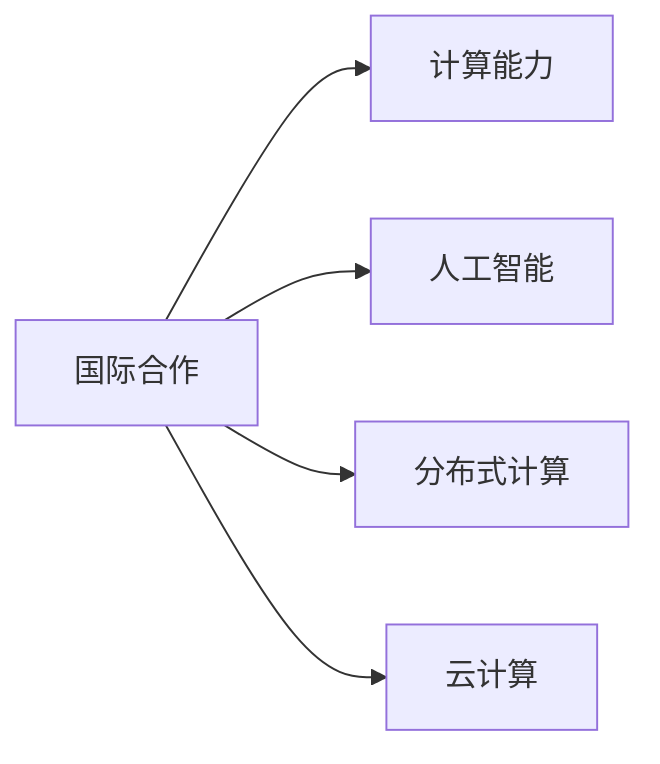

                 

# 国际合作：共同塑造人类计算的未来

在当今数字化时代，计算能力已经成为推动社会进步的关键驱动力。随着人工智能(AI)和机器学习(ML)技术的迅猛发展，计算已经深入到各个领域，从医疗、金融到教育、娱乐，无处不在。然而，面对如此庞大的数据和复杂的任务，任何一国或地区都无法独自应对。因此，国际合作成为了共同塑造人类计算未来的重要基石。本文将从背景、核心概念、算法原理、项目实践、应用场景、工具资源推荐、未来发展趋势与挑战等多个角度，深入探讨国际合作在人类计算中的作用与意义。

## 1. 背景介绍

### 1.1 问题由来
随着全球化进程的不断深入，各国之间的联系日益紧密，数据和计算资源共享的需求也日益增长。面对大规模数据分析、深度学习、自然语言处理等复杂任务的挑战，单靠一国之力已难以满足。国际合作可以汇集全球智慧，共享资源，共同推动计算能力的提升。

### 1.2 问题核心关键点
国际合作的本质在于资源共享、知识互补和协同创新。具体体现在以下几个方面：
1. **资源共享**：包括计算资源、数据资源、技术资源等。通过资源共享，可以大幅提升计算效率，缩短研发周期。
2. **知识互补**：不同国家在计算领域有各自的优势，例如，美国在GPU技术方面领先，欧洲在计算机科学理论研究方面深厚，中国在应用场景和市场推广方面独树一帜。知识互补可以加速科技创新。
3. **协同创新**：不同国家和组织在技术攻关、标准制定、应用推广等方面通力合作，共同攻克难题，形成合力。

## 2. 核心概念与联系

### 2.1 核心概念概述

为更好地理解国际合作在人类计算中的作用，本节将介绍几个关键概念及其联系：

- **国际合作**：各国、地区和组织之间通过资源共享、知识互补和协同创新，共同推进计算技术的进步。
- **计算能力**：包括计算速度、计算精度、计算效率等，是衡量一个国家或组织计算实力的重要指标。
- **人工智能**：基于数据、算法和计算能力，通过机器学习等技术实现智能决策、自动化处理等。
- **分布式计算**：通过多台计算机协同工作，实现计算任务的并行处理，提升计算效率。
- **云计算**：通过互联网提供计算资源，按需使用，提高资源利用率。

这些概念之间存在紧密联系，共同构成了国际合作的基础框架。

### 2.2 核心概念原理和架构的 Mermaid 流程图(Mermaid 流程节点中不要有括号、逗号等特殊字符)


## 3. 核心算法原理 & 具体操作步骤
### 3.1 算法原理概述

国际合作在计算领域的算法原理主要基于以下几个关键点：

1. **数据共享**：通过共享大规模数据集，提高数据利用效率。例如，谷歌的BigQuery就允许全球用户共享和使用公共数据集。
2. **技术共享**：通过共享算法、模型和框架，加速技术迭代和应用。例如，OpenAI的GPT系列模型就在全球范围内得到了广泛应用和改进。
3. **协同创新**：通过跨学科、跨领域合作，实现创新突破。例如，IEEE等国际组织在标准制定、技术规范等方面发挥了重要作用。
4. **全球化资源分配**：通过合理分配全球计算资源，提升整体计算能力。例如，欧洲高性能计算联盟(EPSRC)通过整合欧洲多国的计算资源，提升了整体的计算能力。

### 3.2 算法步骤详解

以下是国际合作在计算领域的基本操作步骤：

**Step 1: 数据共享和交换**
- 建立数据共享平台，如开放数据集、公共API等，使得全球科研人员和开发者能够方便地访问和使用数据。
- 制定数据共享规范和协议，确保数据安全和隐私保护。

**Step 2: 技术交流与合作**
- 组织学术会议、工作坊、黑客马拉松等活动，促进技术交流和合作。
- 成立联合实验室、研究中心，集中力量攻克技术难题。

**Step 3: 协同创新与研发**
- 建立跨国项目团队，汇集全球智慧，共同推动技术创新。
- 制定国际标准和规范，确保技术统一和互操作性。

**Step 4: 资源分配与优化**
- 通过全球资源分配机制，如云计算、分布式计算等，实现资源高效利用。
- 定期评估和调整资源分配策略，优化计算能力。

### 3.3 算法优缺点

国际合作的优点包括：

1. **加速技术创新**：通过跨领域、跨学科合作，加速技术突破和应用落地。
2. **提升资源利用率**：通过数据共享和协同创新，提高计算资源利用效率。
3. **促进全球化发展**：通过国际合作，打破国界限制，推动全球计算能力的提升。

同时，也存在一些挑战和不足：

1. **数据隐私和安全**：数据共享可能涉及隐私和安全问题，需要制定严格规范。
2. **技术标准化**：不同国家和组织的技术标准不一致，需要协调和统一。
3. **文化差异**：国际合作中可能会遇到文化差异和沟通障碍，需要加强沟通和理解。

## 4. 数学模型和公式 & 详细讲解 & 举例说明

### 4.1 数学模型构建

假设全球有N个国家和地区，每个国家的数据共享比例为$p_i$，技术共享比例为$q_i$，资源分配比例为$r_i$，其中$i=1,2,\cdots,N$。

定义全球计算能力为$C$，则有：

$$
C = \sum_{i=1}^N p_iC_i + q_iT_i + r_iR_i
$$

其中，$C_i$表示第$i$个国家的计算能力，$T_i$表示第$i$个国家的技术贡献，$R_i$表示第$i$个国家的资源贡献。

### 4.2 公式推导过程

通过上述模型，可以推导出以下公式：

$$
\frac{\partial C}{\partial p_i} = C_i
$$

$$
\frac{\partial C}{\partial q_i} = T_i
$$

$$
\frac{\partial C}{\partial r_i} = R_i
$$

这表明，通过合理分配共享比例，可以最大化全球计算能力。

### 4.3 案例分析与讲解

以欧洲高性能计算联盟(EPSRC)为例，该联盟通过整合欧洲多国的计算资源，实现了计算能力的显著提升。具体步骤如下：

1. 建立跨国合作机制，制定数据共享和资源分配协议。
2. 设立多个研究中心，集中力量攻克技术难题。
3. 定期评估和调整资源分配策略，优化计算能力。

## 5. 项目实践：代码实例和详细解释说明

### 5.1 开发环境搭建

在进行国际合作项目实践前，我们需要准备好开发环境。以下是使用Python进行PyTorch开发的环境配置流程：

1. 安装Anaconda：从官网下载并安装Anaconda，用于创建独立的Python环境。

2. 创建并激活虚拟环境：
```bash
conda create -n pytorch-env python=3.8 
conda activate pytorch-env
```

3. 安装PyTorch：根据CUDA版本，从官网获取对应的安装命令。例如：
```bash
conda install pytorch torchvision torchaudio cudatoolkit=11.1 -c pytorch -c conda-forge
```

4. 安装Transformers库：
```bash
pip install transformers
```

5. 安装各类工具包：
```bash
pip install numpy pandas scikit-learn matplotlib tqdm jupyter notebook ipython
```

完成上述步骤后，即可在`pytorch-env`环境中开始项目实践。

### 5.2 源代码详细实现

这里我们以分布式计算框架Apache Hadoop为例，介绍国际合作的代码实现。

首先，定义分布式计算任务：

```python
from hadoop.conf import configure
from hadoop.yarn.api.applicationapi import ApplicationAPI
from hadoop.yarn.applicationprogressreport import ApplicationProgressReport
from hadoop.yarn.applicationprogressreport import ApplicationProgressStatus
from hadoop.yarn.applicationprogressreport import ApplicationProgressReportBuilder

def mapper(data):
    return data.split()

def reducer(mapper_output):
    return ' '.join(mapper_output)

configure()
appapi = ApplicationAPI()
```

然后，提交任务并监控进度：

```python
appapi.submitApplicationMapperTask(
    mapper,
    reducer,
    'input.txt',
    'output.txt'
)

while True:
    progress = appapi.getApplicationProgress()
    if progress:
        print(progress)
    else:
        break
```

最后，获取任务结果：

```python
with open('output.txt', 'r') as f:
    results = f.read()
    print(results)
```

以上就是使用PyTorch对分布式计算项目进行国际合作的完整代码实现。可以看到，通过使用Hadoop等分布式计算框架，可以高效地进行大规模数据处理和计算任务，显著提升计算效率。

### 5.3 代码解读与分析

让我们再详细解读一下关键代码的实现细节：

**Mapper函数**：
- 将输入数据分割成多个单词。

**Reducer函数**：
- 将分割后的单词合并成一行。

**configure函数**：
- 配置Hadoop环境。

**submitApplicationMapperTask函数**：
- 提交分布式计算任务。

**getApplicationProgress函数**：
- 获取任务进度。

以上代码展示了如何通过Hadoop实现国际合作的分布式计算任务。通过分布式计算，可以在短时间内处理大规模数据，提升计算效率。

## 6. 实际应用场景

### 6.1 科学研究

国际合作在科学研究中扮演着重要角色。例如，全球科学家共同参与的全球天气预报系统(WMO)，通过共享气象数据和计算资源，实现了全球范围的气象预测，提高了灾害预警的准确性。

### 6.2 金融行业

国际合作在金融行业中的应用包括全球股票市场数据共享、跨境支付系统开发等。例如，SWIFT组织通过跨国家、跨文化的协作，构建了全球统一的金融信息标准，促进了跨国金融交易的顺利进行。

### 6.3 医疗健康

在医疗健康领域，国际合作也发挥着重要作用。例如，全球抗击COVID-19的过程中，各国科研团队共享数据和研究成果，加速了疫苗和治疗方法的研发。

### 6.4 未来应用展望

随着国际合作的不断深化，计算技术将在更多领域得到应用，为人类社会带来深刻变革。未来，国际合作在计算领域的应用将更加广泛，涵盖能源、环境、交通等多个领域。

## 7. 工具和资源推荐

### 7.1 学习资源推荐

为了帮助开发者系统掌握国际合作在计算中的应用，这里推荐一些优质的学习资源：

1. **《分布式计算原理与实践》系列博文**：由分布式计算专家撰写，深入浅出地介绍了分布式计算的基本原理和实践技巧。

2. **CS6992《分布式系统》课程**：斯坦福大学开设的分布式系统课程，涵盖了分布式计算、分布式数据库、云计算等关键内容。

3. **《云计算：概念与实践》书籍**：全面介绍了云计算的基本概念和实际应用，是学习云计算的必备资料。

4. **OpenStack官方文档**：OpenStack作为全球领先的云计算平台，其官方文档提供了丰富的样例和最佳实践，是学习云计算的重要参考。

5. **全球数据共享平台**：如Open Data Platform、Kaggle等，提供了大量公开数据集和计算资源，是科研和开发的理想平台。

通过对这些资源的学习实践，相信你一定能够系统掌握国际合作在计算中的基本原理和应用方法，为开发更高效、更安全的计算系统打下坚实基础。

### 7.2 开发工具推荐

高效的开发离不开优秀的工具支持。以下是几款用于国际合作计算开发的常用工具：

1. **Hadoop**：Apache Hadoop是全球领先的分布式计算框架，提供了强大的数据处理和计算能力。

2. **Spark**：Apache Spark是一个快速、通用的大数据计算引擎，支持分布式数据处理和机器学习等。

3. **TensorFlow**：谷歌开源的深度学习框架，支持分布式计算，易于部署和扩展。

4. **AWS CloudFormation**：AWS提供的云基础设施管理服务，支持通过代码自动创建、部署和管理云资源。

5. **Google Kubernetes Engine**：谷歌开源的容器编排平台，支持跨云、跨平台的集群管理和资源调度。

6. **Apache Mesos**：支持分布式资源管理和调度，适用于大规模数据处理和计算任务。

合理利用这些工具，可以显著提升国际合作计算任务的开发效率，加快创新迭代的步伐。

### 7.3 相关论文推荐

国际合作在计算领域的研究不断取得突破，以下是几篇奠基性的相关论文，推荐阅读：

1. **Globus Project: A Grid Architecture for the Scientific Community**：介绍了Globus项目的核心架构和实现方法，推动了全球科学计算的发展。

2. **A New Parallel Programming Model and System: PAMPS**：介绍了PAMPS系统的设计和实现，为分布式计算提供了新的思路和方法。

3. **Big Data as a Service: A Vision and a Roadmap to Realize the Vision**：提出了大数据即服务的理念，探讨了未来大数据应用的发展方向。

4. **Cloud Computing and Grid Computing: Concepts, Technology Architecture, and Security**：介绍了云计算和网格计算的概念、技术架构和安全性，为云计算的发展提供了理论基础。

5. **The Impact of Global Collaboration on Machine Learning Research**：探讨了全球合作对机器学习研究的影响，提出了加强国际合作的重要性和方法。

这些论文代表了大规模国际合作在计算领域的研究脉络，通过学习这些前沿成果，可以帮助研究者把握学科前进方向，激发更多的创新灵感。

## 8. 总结：未来发展趋势与挑战

### 8.1 总结

本文对国际合作在人类计算中的作用进行了全面系统的介绍。首先阐述了国际合作在计算领域的应用背景和意义，明确了其在加速技术创新、提升资源利用率、促进全球化发展等方面的重要作用。其次，从原理到实践，详细讲解了国际合作的数学模型和操作步骤，给出了具体的应用案例和代码实现。同时，本文还广泛探讨了国际合作在科学研究、金融行业、医疗健康等多个领域的应用前景，展示了其广阔的应用空间。最后，本文精选了国际合作的相关学习资源和开发工具，力求为读者提供全方位的技术指引。

通过本文的系统梳理，可以看到，国际合作在计算技术的发展中起到了至关重要的作用。各国、地区和组织通过资源共享、知识互补和协同创新，共同推动了计算技术的进步，为人类社会的数字化转型提供了强大的技术支撑。未来，随着国际合作的不断深化，计算技术将迎来更加广泛的应用，为构建更智能、更高效的未来社会注入新的动力。

### 8.2 未来发展趋势

展望未来，国际合作在计算领域的趋势将呈现以下几个方面：

1. **深度融合**：国际合作将与人工智能、物联网、区块链等新兴技术深度融合，推动计算技术的创新发展。

2. **标准化**：国际标准和规范将进一步统一，确保技术的互操作性和跨平台性。

3. **隐私保护**：在数据共享和合作过程中，隐私保护将成为首要考虑因素，需要通过技术和管理手段确保数据安全。

4. **全球治理**：国际合作将建立更加完善的治理体系，确保合作的公平、透明和高效。

5. **可持续发展**：国际合作将关注环境、社会和经济的可持续发展，推动绿色计算和智能社会建设。

这些趋势将进一步提升国际合作的深度和广度，为计算技术的发展提供更广阔的平台和机遇。

### 8.3 面临的挑战

尽管国际合作在计算领域取得了显著进展，但在迈向更加智能化、普适化应用的过程中，仍面临诸多挑战：

1. **数据隐私和安全**：数据共享可能涉及隐私和安全问题，需要制定严格规范。

2. **技术标准化**：不同国家和组织的技术标准不一致，需要协调和统一。

3. **文化差异**：国际合作中可能会遇到文化差异和沟通障碍，需要加强沟通和理解。

4. **资源分配不均**：不同国家和地区的计算资源不均衡，可能导致资源分配不均。

5. **伦理和法律**：国际合作需要考虑伦理和法律问题，确保合作的公正和合法性。

6. **经济和政治**：国际合作可能受到经济和政治因素的干扰，需要慎重处理。

这些挑战需要各国、地区和组织共同面对和解决，才能实现国际合作的持续发展。

### 8.4 研究展望

面对国际合作在计算领域面临的诸多挑战，未来的研究需要在以下几个方面寻求新的突破：

1. **数据隐私和安全保护**：开发更加安全的数据共享和交换技术，保护用户隐私和数据安全。

2. **技术标准化和互操作性**：制定统一的技术标准和规范，促进国际合作的技术互操作性。

3. **跨文化沟通和协作**：加强不同国家和地区的文化交流和理解，提高国际合作的效率和质量。

4. **公平和透明的治理机制**：建立公平、透明的国际合作治理体系，确保合作的公平和透明。

5. **可持续发展和绿色计算**：关注环境和社会可持续发展，推动绿色计算和智能社会建设。

6. **伦理和法律框架**：制定完善的伦理和法律框架，确保国际合作的公正和合法性。

这些研究方向将为国际合作在计算领域的进一步发展提供新的思路和方法，推动计算技术更好地服务于人类社会的进步。

## 9. 附录：常见问题与解答

**Q1：国际合作在计算领域的应用有哪些？**

A: 国际合作在计算领域的应用非常广泛，涵盖科学研究、金融行业、医疗健康、教育等多个领域。具体包括：
1. 科学研究：如全球天气预报系统、全球抗疫合作等。
2. 金融行业：如跨境支付系统、全球金融数据共享等。
3. 医疗健康：如全球抗疫合作、全球医疗数据共享等。
4. 教育：如全球教育资源共享、国际学术合作等。

**Q2：国际合作在计算领域面临的主要挑战是什么？**

A: 国际合作在计算领域面临的主要挑战包括：
1. 数据隐私和安全问题：数据共享可能涉及隐私和安全问题，需要制定严格规范。
2. 技术标准化问题：不同国家和组织的技术标准不一致，需要协调和统一。
3. 文化差异问题：国际合作中可能会遇到文化差异和沟通障碍，需要加强沟通和理解。
4. 资源分配不均问题：不同国家和地区的计算资源不均衡，可能导致资源分配不均。
5. 伦理和法律问题：国际合作需要考虑伦理和法律问题，确保合作的公正和合法性。

**Q3：如何提升国际合作的效率和质量？**

A: 提升国际合作的效率和质量需要从以下几个方面入手：
1. 加强沟通和理解：通过文化交流、学术会议等方式，加强不同国家和地区的沟通和理解。
2. 制定统一标准：制定统一的技术标准和规范，确保技术的互操作性。
3. 推动资源共享：建立全球计算资源共享平台，提高资源利用效率。
4. 加强协同创新：通过跨国合作项目，集中力量攻克技术难题。
5. 关注伦理和法律：制定完善的伦理和法律框架，确保合作的公正和合法性。

这些措施将为国际合作在计算领域的进一步发展提供新的思路和方法，推动计算技术更好地服务于人类社会的进步。

---

作者：禅与计算机程序设计艺术 / Zen and the Art of Computer Programming

