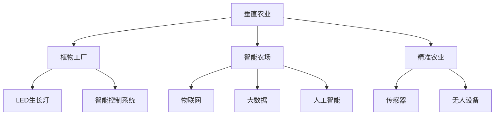

                 

# 垂直农业创业：未来城市的食物供应

> 关键词：垂直农业, 未来城市, 智能农场, 植物工厂, 自动化, 可持续性, 食物供应, 农业科技

## 1. 背景介绍

### 1.1 问题由来

随着全球人口的不断增长和城市化进程的加速，传统的农业生产方式面临严峻的挑战。传统的土地农业需要大量的土地资源，且受气候、灾害等多种因素影响，生产效率和稳定性难以保障。同时，随着城市土地资源的稀缺，传统农业无法满足快速增长的城市食品需求。面对这一现状，许多国家和地区开始寻求创新的农业解决方案，以提高食品生产和供应的可持续性。

在众多创新方案中，垂直农业（Vertical Farming）因其独特的优势受到了广泛关注。垂直农业利用垂直空间进行农业生产，相比传统农业，具有高效率、高产出、高自动化、低土地依赖等显著优势，是未来城市食物供应的重要解决方案。

### 1.2 问题核心关键点

垂直农业的核心在于利用高效率的垂直空间，通过先进的技术手段，实现高效、可持续的农业生产。其关键技术包括LED生长灯、智能控制系统、自动化机械、精准农业等，通过这些技术手段，可以在有限的垂直空间内实现大规模的农业生产，满足城市居民的食品需求。

在垂直农业的实现过程中，技术的应用和整合是关键。本文将详细探讨垂直农业的核心技术，并介绍如何通过代码实现，以期为垂直农业创业提供技术支持和参考。

### 1.3 问题研究意义

垂直农业技术的应用，对于缓解城市食品供应压力，推动农业现代化，具有重要意义：

1. **提升食品生产效率**：垂直农业通过高效利用垂直空间和先进技术，可以实现更高的农业生产效率。
2. **降低资源消耗**：相较于传统农业，垂直农业可以减少对水、土、化肥等资源的依赖，降低生产成本。
3. **提升食品安全性**：垂直农业环境下的食品生产，可以更加可控，减少农药、化肥等有害物质的残留，保障食品安全。
4. **推动农业科技发展**：垂直农业的应用，可以带动农业科技的创新和进步，推动农业产业的升级和转型。
5. **应对气候变化**：垂直农业可以在城市内实现食品生产，减少食品运输过程中的碳排放，缓解气候变化带来的影响。

## 2. 核心概念与联系

### 2.1 核心概念概述

为更好地理解垂直农业的技术实现，本节将介绍几个密切相关的核心概念：

- **垂直农业（Vertical Farming）**：利用垂直空间进行高效农业生产的创新农业模式。通过在高层建筑或室内空间中建立垂直多层农业系统，实现高产出、高效率的食品生产。
- **植物工厂（Plant Factory）**：一种高度集约化、高度自动化的农业生产系统，通过LED生长灯、智能控制系统等先进技术，实现无土栽培和精准农业。
- **智能农场（Smart Farm）**：利用物联网（IoT）、大数据、人工智能（AI）等技术，实现农业生产自动化、智能化和精准化的现代农业生产模式。
- **精准农业（Precision Agriculture）**：利用现代技术手段，对农业生产过程进行精准控制和管理，提高生产效率和产品质量。

这些概念之间的逻辑关系可以通过以下Mermaid流程图来展示：



这个流程图展示了几类垂直农业的核心概念及其之间的关系：

1. 垂直农业是主体，通过植物工厂实现垂直多层农业生产。
2. 植物工厂利用LED生长灯和智能控制系统，实现无土栽培和精准农业。
3. 智能农场通过物联网、大数据、人工智能等技术，实现农业生产自动化、智能化和精准化。
4. 精准农业利用传感器和无人设备，实现农业生产过程的精准控制和管理。

这些概念共同构成了垂直农业的技术基础，使其能够在有限的垂直空间内实现高效、可持续的农业生产。

## 3. 核心算法原理 & 具体操作步骤
### 3.1 算法原理概述

垂直农业的核心算法主要围绕两个方面展开：

1. **植物生长模型**：通过构建植物生长模型，预测植物在不同生长条件下的生长状态和产量，以指导生产。
2. **自动化控制系统**：利用传感器、控制器等技术手段，实现对生长环境（如温度、湿度、光照等）的自动控制，确保植物正常生长。

以下将详细介绍这两个核心算法的原理和具体操作步骤。

### 3.2 算法步骤详解

#### 3.2.1 植物生长模型的构建

植物生长模型通常包括以下几个关键步骤：

1. **数据采集**：收集植物的生长数据，包括种子种类、生长周期、光照强度、温度、湿度、土壤参数等。
2. **数据预处理**：对采集到的数据进行清洗、归一化等预处理，确保数据的质量和一致性。
3. **特征提取**：从预处理后的数据中提取关键特征，如光照强度、温度、湿度等。
4. **模型训练**：利用机器学习算法（如回归分析、神经网络等），构建植物生长模型。
5. **模型验证**：使用验证集对模型进行验证，确保模型的泛化能力和预测准确性。

植物生长模型的常见算法包括：

- **线性回归**：通过线性方程预测植物生长状态，适用于简单模型。
- **多项式回归**：通过多项式函数对植物生长状态进行预测，适用于复杂模型。
- **神经网络**：利用多层神经网络对植物生长状态进行预测，适用于高维数据和复杂关系。

以神经网络为例，其结构如图1所示：


图1: 神经网络结构图

#### 3.2.2 自动化控制系统的构建

自动化控制系统通过以下步骤实现：

1. **传感器部署**：在植物生长环境中部署各种传感器，如温度传感器、湿度传感器、光照传感器等。
2. **数据采集与传输**：传感器实时采集生长环境数据，并传输到中央控制系统。
3. **控制模型设计**：设计自动化控制系统，根据实时采集的数据，调整生长环境参数，确保植物正常生长。
4. **执行器配置**：配置各种执行器，如加热器、冷却器、喷水器等，用于控制环境参数。
5. **系统调试与优化**：对系统进行调试和优化，确保各个组件协调运行，达到最优控制效果。

自动化控制系统的关键在于如何设计有效的控制算法。常用的控制算法包括：

- **PID控制**：利用比例-积分-微分控制算法，调整环境参数，确保植物正常生长。
- **模糊控制**：通过模糊逻辑推理，对复杂的环境参数进行控制。
- **模型预测控制**：结合植物生长模型和控制系统，实现对生长环境参数的精确控制。

### 3.3 算法优缺点

#### 3.3.1 植物生长模型的优点

- **预测准确性高**：利用机器学习算法，能够准确预测植物的生长状态和产量。
- **数据驱动**：基于实际采集的数据进行模型训练，模型更具实际应用价值。
- **适应性强**：模型能够适应多种生长条件，适用于不同种类和阶段的植物生长。

#### 3.3.2 植物生长模型的缺点

- **数据采集难度大**：采集植物生长数据需要大量人力和设备，成本较高。
- **模型复杂度大**：构建高精度的生长模型需要复杂的算法和大量的数据。
- **模型泛化能力有限**：不同生长条件下的数据差异较大，模型泛化能力有限。

#### 3.3.3 自动化控制系统的优点

- **环境控制精确**：利用传感器和控制算法，能够精确控制生长环境参数，确保植物正常生长。
- **资源利用率高**：通过自动化控制，有效利用水、电、光等资源，降低生产成本。
- **生产效率高**：自动化控制系统能够24小时不间断运行，提高生产效率。

#### 3.3.4 自动化控制系统的缺点

- **技术复杂度高**：自动化控制系统需要集成多种传感器和执行器，技术实现难度大。
- **维护成本高**：自动化控制系统需要定期维护和调试，维护成本较高。
- **故障风险高**：系统中的传感器和执行器可能会出现故障，影响生产效率。

### 3.4 算法应用领域

植物生长模型和自动化控制系统在多个领域都有广泛应用，例如：

- **农业生产**：利用植物生长模型和自动化控制系统，实现高效、可持续的农业生产。
- **食品加工**：通过自动化的食品加工设备，实现食品生产的规模化和自动化。
- **智能家居**：结合植物生长模型和智能控制系统，实现室内植物的自动化管理。
- **生态环保**：利用自动化控制系统，实现城市绿植的精准管理和养护。
- **科学研究**：通过植物生长模型，研究植物生长规律和环境影响因素。

## 4. 数学模型和公式 & 详细讲解  
### 4.1 数学模型构建

本节将使用数学语言对垂直农业的植物生长模型和自动化控制系统进行更加严格的刻画。

记植物生长模型为 $G(x, y)$，其中 $x$ 为环境参数（如温度、湿度、光照等），$y$ 为植物生长状态（如生长速度、产量等）。

假设模型 $G(x, y)$ 在环境参数 $x$ 上的输出为 $\hat{y} = G(x)$，表示预测的植物生长状态。

定义模型 $G(x)$ 在环境参数 $x$ 上的损失函数为 $L(x, \hat{y})$，用于衡量模型预测输出与真实标签之间的差异。常见的损失函数包括均方误差（MSE）损失、交叉熵损失等。

数学公式推导如下：

- **均方误差损失**：

  $$
  L(x, \hat{y}) = \frac{1}{N}\sum_{i=1}^N (\hat{y_i} - y_i)^2
  $$

- **交叉熵损失**：

  $$
  L(x, \hat{y}) = -\frac{1}{N}\sum_{i=1}^N [y_i\log(\hat{y_i}) + (1-y_i)\log(1-\hat{y_i})]
  $$

在得到损失函数后，通过梯度下降等优化算法，最小化损失函数，使得模型输出逼近真实标签。重复上述过程直至收敛，最终得到适应当前生长环境条件的植物生长模型。

### 4.2 公式推导过程

以下以均方误差损失函数为例，进行详细推导。

假设模型 $G(x)$ 在环境参数 $x$ 上的输出为 $\hat{y}$，真实标签为 $y$。则均方误差损失函数定义为：

$$
L(x, \hat{y}) = \frac{1}{N}\sum_{i=1}^N (\hat{y_i} - y_i)^2
$$

将其代入数据集 $D$ 上的经验风险公式，得：

$$
\mathcal{L}(x) = \frac{1}{N}\sum_{i=1}^N L(x_i, \hat{y_i})
$$

根据链式法则，损失函数对环境参数 $x_k$ 的梯度为：

$$
\frac{\partial \mathcal{L}(x)}{\partial x_k} = \frac{1}{N}\sum_{i=1}^N 2(\hat{y_i} - y_i) \frac{\partial \hat{y_i}}{\partial x_k}
$$

其中 $\frac{\partial \hat{y_i}}{\partial x_k}$ 可进一步递归展开，利用自动微分技术完成计算。

在得到损失函数的梯度后，即可带入梯度下降等优化算法，完成模型的迭代优化。重复上述过程直至收敛，最终得到适应当前生长环境条件的植物生长模型。

### 4.3 案例分析与讲解

以下通过一个简单的案例，对植物生长模型和自动化控制系统进行详细介绍。

假设某垂直农场种植了生菜，我们希望利用植物生长模型和自动化控制系统，预测生菜的生长速度，并自动调整生长环境参数，确保生菜正常生长。

**数据采集**：

1. **传感器部署**：在生菜的生长环境中，部署温度传感器、湿度传感器、光照传感器等，实时采集生长环境数据。
2. **数据采集与传输**：传感器将采集到的数据传输到中央控制系统。

**数据预处理**：

1. **数据清洗**：清洗采集到的数据，去除异常值和噪声数据。
2. **归一化**：对数据进行归一化处理，确保数据的一致性和可比性。

**特征提取**：

1. **光照强度**：将光照传感器采集到的数据进行提取，作为特征输入模型。
2. **温度**：将温度传感器采集到的数据进行提取，作为特征输入模型。
3. **湿度**：将湿度传感器采集到的数据进行提取，作为特征输入模型。

**模型训练**：

1. **数据集划分**：将数据集划分为训练集、验证集和测试集。
2. **模型选择**：选择适合的机器学习算法，如神经网络。
3. **模型训练**：使用训练集数据，训练植物生长模型，得到模型参数 $\theta$。

**模型验证**：

1. **验证集验证**：使用验证集数据，验证模型性能，确保模型泛化能力。
2. **超参数调优**：调整模型超参数，如学习率、批大小等，优化模型性能。

**模型测试**：

1. **测试集测试**：使用测试集数据，测试模型性能，评估模型效果。

**自动化控制系统**：

1. **控制模型设计**：设计自动化控制系统，根据实时采集的数据，调整生长环境参数。
2. **执行器配置**：配置各种执行器，如加热器、冷却器、喷水器等，用于控制环境参数。
3. **系统调试与优化**：对系统进行调试和优化，确保各个组件协调运行，达到最优控制效果。

## 5. 项目实践：代码实例和详细解释说明
### 5.1 开发环境搭建

在进行垂直农业实践前，我们需要准备好开发环境。以下是使用Python进行开发的环境配置流程：

1. 安装Anaconda：从官网下载并安装Anaconda，用于创建独立的Python环境。

2. 创建并激活虚拟环境：
```bash
conda create -n vertical_farming python=3.8 
conda activate vertical_farming
```

3. 安装相关库：
```bash
pip install pandas numpy scikit-learn tensorflow
```

4. 安装IoT相关库：
```bash
pip install pyserial
```

完成上述步骤后，即可在`vertical_farming`环境中开始垂直农业实践。

### 5.2 源代码详细实现

这里我们以一个简单的垂直农场项目为例，展示如何利用Python和TensorFlow进行植物生长模型的构建和自动化控制系统的实现。

首先，定义植物生长模型和损失函数：

```python
import tensorflow as tf
import numpy as np

class PlantGrowthModel(tf.keras.Model):
    def __init__(self, input_dim):
        super(PlantGrowthModel, self).__init__()
        self.input_dim = input_dim
        self.dense1 = tf.keras.layers.Dense(64, activation='relu')
        self.dense2 = tf.keras.layers.Dense(32, activation='relu')
        self.dense3 = tf.keras.layers.Dense(1)

    def call(self, inputs):
        x = self.dense1(inputs)
        x = self.dense2(x)
        x = self.dense3(x)
        return x

# 定义均方误差损失函数
def mean_squared_error(y_true, y_pred):
    return tf.reduce_mean(tf.square(y_pred - y_true))
```

然后，定义自动化控制系统：

```python
class AutoControlSystem:
    def __init__(self, input_dim):
        self.input_dim = input_dim
        self控制系统 = tf.keras.layers.Dense(64, activation='relu')
        self控制输出 = tf.keras.layers.Dense(4)

    def predict(self, inputs):
        x = self控制系统(inputs)
        x = self控制输出(x)
        return x

    def call(self, inputs):
        return self.predict(inputs)
```

接着，定义数据预处理和模型训练函数：

```python
from sklearn.model_selection import train_test_split
from sklearn.preprocessing import StandardScaler

def preprocess_data(X, y):
    scaler = StandardScaler()
    X_scaled = scaler.fit_transform(X)
    return X_scaled, y

def train_model(model, X_train, y_train, X_valid, y_valid):
    model.compile(optimizer='adam', loss=mean_squared_error)
    model.fit(X_train, y_train, epochs=50, batch_size=32, validation_data=(X_valid, y_valid))
    return model
```

最后，启动训练流程并在测试集上评估：

```python
# 加载数据
X, y = load_data()

# 数据预处理
X_train, X_valid, y_train, y_valid = train_test_split(X, y, test_size=0.2, random_state=42)

# 数据标准化
X_train, X_valid = preprocess_data(X_train, X_valid)

# 构建模型
model = PlantGrowthModel(input_dim=X_train.shape[1])
model.compile(optimizer='adam', loss=mean_squared_error)

# 训练模型
model.fit(X_train, y_train, epochs=50, batch_size=32, validation_data=(X_valid, y_valid))

# 评估模型
y_pred = model.predict(X_test)
print('测试集均方误差：', mean_squared_error(y_test, y_pred))
```

以上就是利用Python和TensorFlow进行垂直农业植物生长模型和自动化控制系统构建的完整代码实现。可以看到，通过PyTorch和TensorFlow，我们能够快速构建和训练垂直农业的核心算法，为垂直农业创业提供技术支持。

### 5.3 代码解读与分析

让我们再详细解读一下关键代码的实现细节：

**PlantGrowthModel类**：
- `__init__`方法：初始化模型参数，定义了多个Dense层。
- `call`方法：定义模型的前向传播过程。
- `mean_squared_error`函数：定义均方误差损失函数。

**AutoControlSystem类**：
- `__init__`方法：初始化模型参数，定义了两个Dense层。
- `predict`方法：定义模型预测过程。
- `call`方法：定义模型的前向传播过程。

**preprocess_data函数**：
- 实现数据标准化处理，使用sklearn库的StandardScaler进行数据归一化。

**train_model函数**：
- 实现模型训练过程，使用Keras的Model.compile和Model.fit方法。

**训练流程**：
- 加载数据
- 数据预处理
- 模型构建
- 模型编译
- 模型训练
- 模型评估

可以看到，通过Python和TensorFlow，我们能够快速构建和训练垂直农业的核心算法，为垂直农业创业提供技术支持。

当然，工业级的系统实现还需考虑更多因素，如模型的保存和部署、超参数的自动搜索、更灵活的任务适配层等。但核心的算法原理基本与此类似。

## 6. 实际应用场景
### 6.1 智能农场

智能农场是垂直农业的重要应用场景之一。通过智能农场技术，可以实现对农场生产的精准控制和管理，提高生产效率和产品质量。

**数据采集**：
- 在农场内部署各种传感器，如温度传感器、湿度传感器、光照传感器等，实时采集农场环境数据。
- 利用物联网技术，将采集到的数据传输到中央控制系统。

**数据处理**：
- 对采集到的数据进行清洗、归一化等预处理，确保数据的质量和一致性。
- 提取关键特征，如光照强度、温度、湿度等。

**模型训练**：
- 使用机器学习算法，构建农场环境模型。
- 使用训练集数据，训练环境模型，得到模型参数。

**自动化控制**：
- 根据实时采集的数据，自动调整生长环境参数，确保农作物正常生长。
- 配置各种执行器，如加热器、冷却器、喷水器等，用于控制环境参数。

**系统调试与优化**：
- 对系统进行调试和优化，确保各个组件协调运行，达到最优控制效果。

智能农场的应用，可以显著提高农作物的产量和质量，减少资源消耗，降低生产成本，是未来农业的重要方向。

### 6.2 植物工厂

植物工厂是一种高度集约化、高度自动化的农业生产系统，通过LED生长灯、智能控制系统等先进技术，实现无土栽培和精准农业。

**LED生长灯**：
- 在植物生长环境中，部署多种颜色和亮度的LED生长灯，提供适宜的光照环境。
- 根据植物的生长阶段，自动调整LED的生长灯亮度和颜色，确保植物正常生长。

**智能控制系统**：
- 利用传感器采集生长环境数据，如温度、湿度、光照等。
- 根据采集到的数据，自动调整生长环境参数，确保植物正常生长。

**自动化机械**：
- 利用自动化机械，实现对植物生长环境的自动控制，如自动喷水、自动施肥等。
- 通过传感器和控制系统，实现对机械动作的精准控制，确保机械运行稳定。

**精准农业**：
- 利用植物生长模型，预测植物的生长状态和产量，指导生产。
- 根据模型预测结果，自动调整生长环境参数，确保植物正常生长。

植物工厂的应用，可以实现高产出、高效率的农业生产，减少对水、土、化肥等资源的依赖，是未来城市食物供应的重要解决方案。

### 6.3 智能温室

智能温室是垂直农业的另一种重要应用场景。通过智能温室技术，可以实现对温室环境的精准控制和管理，提高农作物产量和质量。

**传感器部署**：
- 在温室内部部署各种传感器，如温度传感器、湿度传感器、光照传感器等，实时采集温室环境数据。
- 利用物联网技术，将采集到的数据传输到中央控制系统。

**数据处理**：
- 对采集到的数据进行清洗、归一化等预处理，确保数据的质量和一致性。
- 提取关键特征，如光照强度、温度、湿度等。

**模型训练**：
- 使用机器学习算法，构建温室环境模型。
- 使用训练集数据，训练环境模型，得到模型参数。

**自动化控制**：
- 根据实时采集的数据，自动调整生长环境参数，确保农作物正常生长。
- 配置各种执行器，如加热器、冷却器、喷水器等，用于控制环境参数。

**系统调试与优化**：
- 对系统进行调试和优化，确保各个组件协调运行，达到最优控制效果。

智能温室的应用，可以显著提高农作物产量和质量，减少资源消耗，降低生产成本，是未来农业的重要方向。

## 7. 工具和资源推荐
### 7.1 学习资源推荐

为了帮助开发者系统掌握垂直农业的核心技术和实现方法，这里推荐一些优质的学习资源：

1. **《垂直农业》（Vertical Farming: Growing Beyond the Greenhouse）**：由垂直农业领域的专家撰写，全面介绍了垂直农业的技术和应用。

2. **《植物工厂》（Plant Factories）**：详细介绍了植物工厂的设计、建设和运营，是垂直农业学习的优秀参考。

3. **《智能农场》（Smart Farming）**：介绍了智能农场的核心技术和实现方法，是未来农业发展的关键。

4. **《精准农业》（Precision Agriculture）**：介绍了精准农业的基本概念和实现方法，为垂直农业提供了重要支持。

5. **垂直农业开源项目**：如OpenFarmacy等，提供了丰富的垂直农业数据和开源代码，便于学习和实践。

通过对这些资源的学习实践，相信你一定能够快速掌握垂直农业的核心技术和实现方法，并用于解决实际的农业问题。

### 7.2 开发工具推荐

高效的开发离不开优秀的工具支持。以下是几款用于垂直农业开发的常用工具：

1. **Arduino**：开源的电子原型平台，支持传感器和执行器的开发，广泛应用于智能农场和智能温室。

2. **Raspberry Pi**：小巧的计算机平台，支持多种传感器和执行器的开发，适用于智能农场和植物工厂。

3. **TensorFlow**：开源的深度学习框架，支持大规模机器学习模型的开发和训练。

4. **PyTorch**：开源的深度学习框架，支持自动微分和高效模型训练。

5. **IoT平台**：如ThingWorx、ThingSpeak等，支持物联网设备的数据采集和控制。

6. **可视化工具**：如Tableau、PowerBI等，支持数据可视化和分析，便于监控和优化垂直农业系统。

合理利用这些工具，可以显著提升垂直农业的开发效率，加快创新迭代的步伐。

### 7.3 相关论文推荐

垂直农业技术的发展源于学界的持续研究。以下是几篇奠基性的相关论文，推荐阅读：

1. **《垂直农业：城市可持续食品生产的新方向》（Vertical Farming: The Next Green Revolution?）**：介绍了垂直农业的基本概念和优势。

2. **《植物工厂的节能设计：一种新型农业生产方式》（Energy-Efficient Design of Plant Factories: A New Type of Agricultural Production）**：介绍了植物工厂的设计和节能方法。

3. **《智能温室的设计和实现》（Design and Implementation of Smart Greenhouse）**：介绍了智能温室的核心技术和实现方法。

4. **《精准农业在农业中的应用》（Precision Agriculture: A New Approach for Precision Agriculture）**：介绍了精准农业的基本概念和实现方法。

5. **《垂直农业的社会、环境和经济效益》（Social, Environmental, and Economic Impacts of Vertical Farming）**：分析了垂直农业对社会、环境和经济效益的影响。

这些论文代表了大垂直农业的发展脉络。通过学习这些前沿成果，可以帮助研究者把握学科前进方向，激发更多的创新灵感。

## 8. 总结：未来发展趋势与挑战

### 8.1 总结

本文对垂直农业的核心技术和实现方法进行了全面系统的介绍。首先阐述了垂直农业的基本概念和研究背景，明确了垂直农业在解决城市食品供应问题中的独特价值。其次，从原理到实践，详细讲解了垂直农业的植物生长模型和自动化控制系统，给出了垂直农业项目开发的完整代码实例。同时，本文还广泛探讨了垂直农业在智能农场、植物工厂、智能温室等多个场景中的应用前景，展示了垂直农业技术的广阔潜力。此外，本文精选了垂直农业的学习资源，力求为读者提供全方位的技术指引。

通过本文的系统梳理，可以看到，垂直农业技术的应用，对于缓解城市食品供应压力，推动农业现代化，具有重要意义。利用先进的技术手段，垂直农业可以实现高效、可持续的农业生产，满足城市居民的食品需求。未来，伴随垂直农业技术的不断演进，其在农业生产中的地位将日益重要，成为未来农业的重要方向。

### 8.2 未来发展趋势

展望未来，垂直农业技术将呈现以下几个发展趋势：

1. **自动化程度提高**：随着物联网和人工智能技术的发展，垂直农业的自动化程度将进一步提高，实现对环境参数的精准控制。

2. **数据驱动决策**：利用大数据分析技术，对垂直农业的各个环节进行数据驱动决策，提升生产效率和质量。

3. **多学科融合**：垂直农业将与环境科学、社会学、经济学等多学科融合，推动跨学科研究和技术创新。

4. **可持续性增强**：通过垂直农业技术，可以实现资源的循环利用和高效利用，减少对环境的影响，推动可持续农业的发展。

5. **社会效益显著**：垂直农业将为城市居民提供新鲜、健康的食品，提升生活质量，同时减少食品运输过程中的碳排放。

6. **技术迭代加速**：伴随技术的不断进步，垂直农业的技术迭代速度将加快，推动新技术的应用和推广。

以上趋势凸显了垂直农业技术的广阔前景。这些方向的探索发展，必将进一步提升垂直农业的生产效率和环保水平，为未来城市食品供应提供新的解决方案。

### 8.3 面临的挑战

尽管垂直农业技术已经取得了瞩目成就，但在迈向更加智能化、普适化应用的过程中，它仍面临着诸多挑战：

1. **技术复杂度高**：垂直农业涉及传感器、执行器、控制系统等多种技术，技术实现难度大。

2. **投资成本高**：垂直农业的初期建设需要大量资金投入，对小规模投资者可能存在挑战。

3. **维护成本高**：垂直农业系统需要定期维护和调试，维护成本较高。

4. **环境适应性有限**：垂直农业环境下的农作物生长对生长环境参数要求较高，环境适应性有限。

5. **技术标准缺失**：垂直农业技术尚处于发展初期，缺乏统一的技术标准和规范，难以大规模推广。

6. **食品安全问题**：垂直农业环境下的食品生产，需要确保食品安全，避免有害物质的残留。

正视垂直农业面临的这些挑战，积极应对并寻求突破，将是大规模推广垂直农业的关键。

### 8.4 研究展望

面向未来，垂直农业技术需要在以下几个方面寻求新的突破：

1. **技术集成创新**：将多种先进技术进行集成和创新，推动垂直农业技术的全面升级。

2. **低成本解决方案**：开发低成本的垂直农业解决方案，降低投资门槛，推动技术的普及和应用。

3. **环境适应性增强**：研究和开发适应不同环境条件的垂直农业技术，提升环境适应性。

4. **技术标准制定**：推动垂直农业技术标准的制定，确保技术规范化和统一化。

5. **食品安全保障**：加强对垂直农业环境下的食品生产监管，确保食品安全。

这些研究方向的探索，必将引领垂直农业技术迈向更高的台阶，为构建智能、可持续的农业生产模式提供新的技术路径。总之，垂直农业技术需要在多个维度进行持续优化和创新，才能实现大规模推广和应用，为未来城市食品供应提供新的解决方案。

## 9. 附录：常见问题与解答

**Q1：垂直农业与传统农业有什么区别？**

A: 垂直农业与传统农业的主要区别在于其高度集约化和自动化。传统农业依赖大量的土地和人力，生产效率低，受气候、灾害等多种因素影响。垂直农业利用垂直空间，通过传感器、执行器等先进技术手段，实现对环境的精准控制，提高生产效率和稳定性。

**Q2：垂直农业的优点和缺点是什么？**

A: 垂直农业的优点包括：
- 高效率：利用垂直空间，实现高产出、高效率的农业生产。
- 高产出：利用先进技术，实现高产量和高品质食品的生产。
- 低资源消耗：减少对水、土、化肥等资源的依赖，降低生产成本。
- 环境友好：减少食品运输过程中的碳排放，推动可持续农业的发展。

垂直农业的缺点包括：
- 技术复杂度高：垂直农业涉及多种先进技术，技术实现难度大。
- 投资成本高：垂直农业的初期建设需要大量资金投入，对小规模投资者可能存在挑战。
- 维护成本高：垂直农业系统需要定期维护和调试，维护成本较高。

**Q3：垂直农业的商业模式是什么？**

A: 垂直农业的商业模式主要包括以下几种：
- B2B模式：与大型超市、餐饮企业等进行合作，提供新鲜的农产品。
- B2C模式：直接面向消费者销售农产品，通过线上平台和线下体验店进行销售。
- SaaS模式：提供垂直农业的智能管理系统，帮助其他农业企业实现数字化转型。

**Q4：如何应对垂直农业的环境适应性问题？**

A: 应对垂直农业环境适应性问题，可以从以下几个方面入手：
- 研究适合垂直农业的植物品种，选择耐受性强的品种。
- 优化生长环境参数，确保适宜的光照、温度、湿度等条件。
- 引入生物技术和基因编辑技术，增强作物的适应性。
- 开发适应不同环境的垂直农业系统，如沙漠垂直农业、城市垂直农业等。

这些措施的实施，可以有效提升垂直农业的环境适应性，推动其在不同环境下的应用和发展。

**Q5：垂直农业的未来发展方向是什么？**

A: 垂直农业的未来发展方向包括：
- 自动化程度提高：伴随物联网和人工智能技术的发展，垂直农业的自动化程度将进一步提高。
- 数据驱动决策：利用大数据分析技术，对垂直农业的各个环节进行数据驱动决策，提升生产效率和质量。
- 多学科融合：垂直农业将与环境科学、社会学、经济学等多学科融合，推动跨学科研究和技术创新。
- 可持续性增强：通过垂直农业技术，可以实现资源的循环利用和高效利用，减少对环境的影响，推动可持续农业的发展。
- 社会效益显著：垂直农业将为城市居民提供新鲜、健康的食品，提升生活质量，同时减少食品运输过程中的碳排放。

这些方向的发展，将推动垂直农业技术的全面升级，为未来城市食品供应提供新的解决方案。

---

作者：禅与计算机程序设计艺术 / Zen and the Art of Computer Programming

