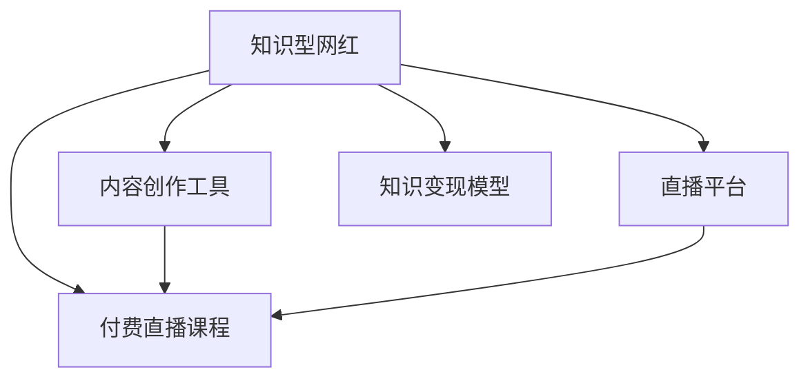

                 

# 培养知识型网红,提供付费直播课程

## 1. 背景介绍

### 1.1 问题由来

随着互联网技术的普及和社交媒体的兴起，网红经济已成为一种重要的商业模式。网红不仅通过内容创造吸引大量粉丝关注，还能带来可观的商业变现。但随着流量红利逐渐减退，内容同质化现象严重，传统的网红经济面临巨大挑战。

为了解决这些问题，知识型网红应运而生。他们不仅拥有高颜值和魅力，更具备深度专业知识和独特见解，通过提供知识型内容，进行知识传授，获得忠实粉丝的长期关注和支持，进而实现商业价值最大化。

### 1.2 问题核心关键点

知识型网红的培养和运营涉及多个环节，包括内容创作、用户互动、商业变现等。本文聚焦于知识型网红的培养过程中，如何通过技术手段提供高质量、互动性强的付费直播课程，提升网红的影响力和商业价值。

### 1.3 问题研究意义

知识型网红的崛起标志着内容产业的升级，对网红经济的未来发展具有重要意义：

1. **提升内容质量**：知识型网红能带来更专业、更有深度的内容，满足用户对高水平信息的需求，促进内容产业的健康发展。
2. **增强用户粘性**：通过知识传授建立长期的粉丝关系，提升用户粘性，增强粉丝忠诚度。
3. **拓宽商业变现途径**：知识型网红不仅可以通过广告、代言等传统方式变现，还可以通过付费课程、知识付费等新模式提升商业价值。
4. **推动行业变革**：知识型网红的出现，推动了传统网红经济的转型升级，为未来的内容产业指明了方向。
5. **促进社会进步**：高质量的知识型内容能提升公众的知识水平和认知能力，对社会的进步和文明提升具有积极作用。

## 2. 核心概念与联系

### 2.1 核心概念概述

为了更好地理解知识型网红提供付费直播课程的技术实现，本节将介绍几个密切相关的核心概念：

- **知识型网红 (Knowledge Influencer)**：基于专业知识和独特见解，通过知识传授吸引粉丝关注的网红。
- **付费直播课程 (Paid Live Courses)**：提供给用户付费观看的高质量直播内容，通常包括课程内容、互动环节、商业植入等。
- **直播平台 (Live Streaming Platform)**：支持知识型网红进行付费直播的平台，提供技术支持、用户互动、商业变现等综合服务。
- **内容创作工具 (Content Creation Tools)**：为知识型网红创作直播内容提供技术支持的各类工具，如视频编辑、互动插件、在线教育平台等。
- **知识变现模型 (Knowledge Monetization Model)**：将知识型网红的知识内容转化为商业价值的模式，包括广告、付费课程、会员制、知识付费等。

这些核心概念之间的逻辑关系可以通过以下Mermaid流程图来展示：



这个流程图展示了几类核心概念及其之间的关系：

1. 知识型网红利用内容创作工具创作直播内容，通过直播平台进行付费直播。
2. 直播平台提供技术支持，促进知识型网红与用户互动，并提供知识变现的商业服务。
3. 知识型网红将知识内容通过付费课程等形式变现，实现商业价值。

这些概念共同构成了知识型网红提供付费直播课程的基本框架，帮助网红从知识变现中获得经济回报，同时提升其影响力和品牌价值。

## 3. 核心算法原理 & 具体操作步骤

### 3.1 算法原理概述

知识型网红提供付费直播课程的技术实现，本质上是一个数据驱动的内容变现过程。其核心思想是：通过知识型网红在直播平台上发布的高质量内容，吸引用户付费观看，进而实现知识变现。

形式化地，假设知识型网红 $I$ 的直播课程内容为 $C_{I}$，目标用户群体为 $U$，直播平台的变现策略为 $M$。直播课程的推荐和购买过程可以表示为：

$$
R = \max_{I, C_I, M} \mathbb{E}[\text{Revenue}(I, C_I, M, U)]
$$

其中，$\text{Revenue}$ 表示平台从直播课程获得的总收入，$\mathbb{E}$ 表示期望值。目标是在所有可能的知识型网红、直播课程内容、变现策略和目标用户群体中，找到最大化收入的组合。

### 3.2 算法步骤详解

知识型网红提供付费直播课程的流程一般包括以下几个关键步骤：

**Step 1: 内容创作与审核**

1. **内容创作**：知识型网红利用内容创作工具，创作高质量的直播课程内容，包括课程主题、知识点讲解、案例分析、互动环节等。
2. **内容审核**：平台对提交的课程内容进行审核，确保内容的合规性、准确性和专业性，防止错误信息和不良内容对用户造成影响。

**Step 2: 课程发布与推荐**

1. **课程发布**：审核通过的课程内容发布到直播平台，设定课程价格、时长、上架时间等属性。
2. **内容推荐**：平台通过算法推荐系统，将课程推荐给目标用户群体，根据用户的兴趣和行为特征进行个性化推荐。

**Step 3: 用户购买与互动**

1. **用户购买**：用户通过直播平台购买课程，支付费用后获得观看权限。
2. **互动环节**：用户在直播过程中可以提问、评论、点赞等，与知识型网红进行实时互动。

**Step 4: 收益结算与分配**

1. **收益结算**：平台按照变现策略，对知识型网红进行收益结算，扣除平台运营成本和分成后，将剩余部分支付给网红。
2. **收益分配**：知识型网红获得收益后，可以进行再投资、消费、回馈粉丝等，进一步提升个人品牌价值。

### 3.3 算法优缺点

知识型网红提供付费直播课程的方法具有以下优点：

1. **高附加值**：知识型网红具备专业知识和独特见解，通过付费直播课程，能提供高质量的深度学习体验，满足用户对高水平信息的需求。
2. **互动性强**：直播形式具有即时互动性，知识型网红可以实时解答用户问题，提升用户满意度和参与感。
3. **变现能力强**：付费直播课程具有较高的商业价值，可以带来稳定的收入来源。
4. **用户粘性强**：通过知识传授建立长期粉丝关系，增强用户粘性和忠诚度。

同时，该方法也存在一些局限性：

1. **内容质量不稳定**：知识型网红的能力和状态存在波动，直播内容质量难以始终如一。
2. **平台依赖度高**：直播平台的推荐算法和推荐资源决定了知识型网红的曝光率，对平台的依赖较大。
3. **用户流失率高**：高昂的课程费用可能导致用户流失，如何提升用户粘性和复购率，需要进一步优化。
4. **收益分配复杂**：收益分配模式多样，涉及平台、知识型网红和用户三方，如何公平合理地分配收益，需要合理的策略设计。

尽管存在这些局限性，但就目前而言，知识型网红提供付费直播课程的方法仍是大规模知识变现的重要手段。未来相关研究的重点在于如何进一步提升内容质量、降低平台依赖、增强用户粘性、优化收益分配等，以实现更高效的知识变现。

### 3.4 算法应用领域

知识型网红提供付费直播课程的方法已经在教育、健康、财经、科技等多个领域得到广泛应用，为知识变现提供了新的途径：

- **教育领域**：知识型网红通过教授专业知识，提供个性化辅导，吸引学生付费学习。
- **健康领域**：健康专家提供健康管理、饮食指导等课程，帮助用户改善生活质量。
- **财经领域**：财经专家分享投资理财、市场分析等内容，吸引投资者付费咨询。
- **科技领域**：科技达人讲解最新技术趋势、编程技巧等内容，吸引技术爱好者付费学习。

除了上述这些经典应用外，知识型网红提供付费直播课程的方法也被创新性地应用到更多场景中，如职业培训、心理咨询、文化创意等，为知识变现带来了新的可能性。

## 4. 数学模型和公式 & 详细讲解

### 4.1 数学模型构建

本节将使用数学语言对知识型网红提供付费直播课程的过程进行更加严格的刻画。

假设知识型网红 $I$ 在直播平台 $P$ 上发布的课程内容为 $C_{I}$，目标用户群体为 $U$，课程价格为 $P_I$，直播时长为 $T_I$，课程观看量为 $W$，观看时长为 $W_I$。假设用户的付费概率为 $p$，观看课程的概率为 $q$，观看完整课程的概率为 $r$。

定义直播平台从课程获得的总收入为 $\text{Revenue}(I, C_I, P_I, T_I, W, W_I)$，其中收入函数为：

$$
\text{Revenue}(I, C_I, P_I, T_I, W, W_I) = P_I \times q \times r \times W
$$

其中 $P_I$ 为课程价格，$q$ 为用户观看课程的概率，$r$ 为用户观看完整课程的概率，$W$ 为观看课程的用户数量，$W_I$ 为观看完整课程的用户数量。

### 4.2 公式推导过程

以下我们以教育领域为例，推导收入函数及其梯度计算公式。

假设知识型网红 $I$ 在直播平台 $P$ 上发布的课程内容为 $C_{I}$，目标用户群体为 $U$。用户在平台上观看课程的概率为 $q$，观看完整课程的概率为 $r$，观看课程的用户数量为 $W$，观看完整课程的用户数量为 $W_I$。课程价格为 $P_I$，直播时长为 $T_I$。

根据收入函数定义，总收入为：

$$
\text{Revenue}(I, C_I, P_I, T_I, W, W_I) = P_I \times q \times r \times W
$$

为了最大化总收入，需要优化知识型网红 $I$ 的直播策略，设定课程价格和时长，以最大化收入。令 $q$ 和 $r$ 为可调节参数，则最大化问题可以表示为：

$$
\max_{q, r} \text{Revenue}(I, C_I, P_I, T_I, W, W_I) = P_I \times q \times r \times W
$$

为了简化计算，假设 $q$ 和 $r$ 均为常数，只考虑 $P_I$ 和 $T_I$ 的影响。则最大化问题可以进一步表示为：

$$
\max_{P_I, T_I} P_I \times q \times r \times W
$$

假设 $W$ 为常数，则最大化问题可以表示为：

$$
\max_{P_I, T_I} P_I \times q \times r
$$

根据梯度下降优化算法，定义损失函数：

$$
\mathcal{L}(P_I, T_I) = -(P_I \times q \times r)
$$

则损失函数对 $P_I$ 和 $T_I$ 的梯度分别为：

$$
\frac{\partial \mathcal{L}(P_I, T_I)}{\partial P_I} = -q \times r
$$

$$
\frac{\partial \mathcal{L}(P_I, T_I)}{\partial T_I} = 0
$$

可以看出，课程价格 $P_I$ 是影响收入的关键因素，而直播时长 $T_I$ 对收入没有影响。因此，为了最大化收入，知识型网红应设定合理的课程价格，而非过度延长直播时长。

### 4.3 案例分析与讲解

以教育领域为例，知识型网红提供付费直播课程的实际应用分析如下：

**案例一：历史知识讲座**

- **内容创作**：知识型网红利用历史专业知识，讲解中国历史的重要事件、人物和时期。
- **内容审核**：平台对课程内容进行审核，确保历史事件的准确性和客观性。
- **课程发布**：课程发布后，设定价格为199元/次，时长为2小时。
- **内容推荐**：平台通过推荐系统，将课程推荐给历史爱好者和学生群体。
- **用户购买**：用户通过平台购买课程，支付费用后获得观看权限。
- **互动环节**：用户在直播过程中提问，知识型网红实时解答。
- **收益结算**：平台按70%比例分成后，将剩余30%支付给网红。

该案例中，知识型网红通过提供高价值的历史知识讲座，吸引目标用户群体付费观看，实现知识变现。平台通过推荐算法提升课程曝光率，进一步提高收入。

**案例二：编程技能培训**

- **内容创作**：知识型网红利用编程经验，讲解Python、Java等编程语言的基础知识和高级技巧。
- **内容审核**：平台对课程内容进行审核，确保编程技巧的准确性和实用性。
- **课程发布**：课程发布后，设定价格为299元/月，时长为30天。
- **内容推荐**：平台通过推荐系统，将课程推荐给编程爱好者和初学者群体。
- **用户购买**：用户通过平台购买课程，支付费用后获得观看权限。
- **互动环节**：用户在直播过程中提问，知识型网红实时解答，并进行编程作业辅导。
- **收益结算**：平台按70%比例分成后，将剩余30%支付给网红。

该案例中，知识型网红通过提供专业的编程技能培训，吸引目标用户群体付费学习，实现知识变现。平台通过推荐算法提升课程曝光率，进一步提高收入。

通过以上两个案例，可以看出，知识型网红提供付费直播课程的过程，需要综合考虑内容创作、平台推荐、用户互动等多个环节，通过合理的策略设计，最大化知识变现的收入。

## 5. 项目实践：代码实例和详细解释说明

### 5.1 开发环境搭建

在进行直播课程的开发前，我们需要准备好开发环境。以下是使用Python进行Web开发的环境配置流程：

1. 安装Anaconda：从官网下载并安装Anaconda，用于创建独立的Python环境。

2. 创建并激活虚拟环境：
```bash
conda create -n web-env python=3.8 
conda activate web-env
```

3. 安装Flask：
```bash
pip install Flask
```

4. 安装WSGI容器：
```bash
pip install gunicorn
```

5. 安装其他工具包：
```bash
pip install numpy pandas scikit-learn Flask-RESTful requests flask-cors flask-migrate psycopg2 flask-sqlalchemy
```

完成上述步骤后，即可在`web-env`环境中开始直播课程开发。

### 5.2 源代码详细实现

以下是使用Flask框架实现知识型网红提供付费直播课程的示例代码：

```python
from flask import Flask, render_template, request, jsonify
from flask_sqlalchemy import SQLAlchemy
from flask_marshmallow import Marshmallow
from flask_cors import CORS

app = Flask(__name__)
app.config['SQLALCHEMY_DATABASE_URI'] = 'postgresql://localhost:5432/mydatabase'
app.config['SQLALCHEMY_TRACK_MODIFICATIONS'] = False
app.config['CORS_HEADERS'] = 'Content-Type'

db = SQLAlchemy(app)
ma = Marshmallow(app)
CORS(app)

# 定义直播课程模型
class Course(db.Model):
    id = db.Column(db.Integer, primary_key=True)
    title = db.Column(db.String(100), nullable=False)
    price = db.Column(db.Float, nullable=False)
    时长 = db.Column(db.Integer, nullable=False)
    上架时间 = db.Column(db.DateTime, nullable=False)
    观看量 = db.Column(db.Integer, nullable=False)
    观看时长 = db.Column(db.Integer, nullable=False)

# 定义直播课程序列化器
class CourseSchema(ma.Schema):
    class Meta:
        fields = ('id', 'title', 'price', '时长', '上架时间', '观看量', '观看时长')

course_schema = CourseSchema()
courses_schema = CourseSchema(many=True)

# 查询所有直播课程
@app.route('/api/courses', methods=['GET'])
def get_courses():
    courses = Course.query.all()
    result = courses_schema.dump(courses)
    return jsonify(result)

# 发布新直播课程
@app.route('/api/courses', methods=['POST'])
def add_course():
    course = Course(title=request.json['title'], price=request.json['price'], 时长=request.json['时长'], 上架时间=request.json['上架时间'])
    db.session.add(course)
    db.session.commit()
    return course_schema.jsonify(course)

# 获取指定直播课程
@app.route('/api/courses/<int:id>', methods=['GET'])
def get_course(id):
    course = Course.query.get(id)
    return course_schema.jsonify(course)

# 更新指定直播课程
@app.route('/api/courses/<int:id>', methods=['PUT'])
def update_course(id):
    course = Course.query.get(id)
    course.title = request.json['title']
    course.price = request.json['price']
    course.时长 = request.json['时长']
    course.上架时间 = request.json['上架时间']
    db.session.commit()
    return course_schema.jsonify(course)

# 删除指定直播课程
@app.route('/api/courses/<int:id>', methods=['DELETE'])
def delete_course(id):
    course = Course.query.get(id)
    db.session.delete(course)
    db.session.commit()
    return course_schema.jsonify(course)

if __name__ == '__main__':
    app.run(debug=True)
```

### 5.3 代码解读与分析

让我们再详细解读一下关键代码的实现细节：

**Course类**：
- `__init__`方法：定义直播课程的各个属性，如标题、价格、时长、上架时间等。
- `__repr__`方法：定义对象的字符串表示。

**CourseSchema类**：
- `Meta`类：定义序列化的字段。
- `fields`属性：指定需要序列化的字段。

**路由函数**：
- `get_courses`函数：查询所有直播课程，并返回JSON格式的课程列表。
- `add_course`函数：发布新直播课程，保存至数据库，并返回JSON格式的课程对象。
- `get_course`函数：获取指定直播课程，并返回JSON格式的课程对象。
- `update_course`函数：更新指定直播课程，保存至数据库，并返回JSON格式的课程对象。
- `delete_course`函数：删除指定直播课程，保存至数据库，并返回JSON格式的课程对象。

**Flask配置**：
- `app.config`：配置SQLAlchemy的数据库连接和SQLAlchemy的跟踪选项。
- `CORS(app)`：启用跨域资源共享，允许来自任何域的请求访问API。
- `app.run(debug=True)`：启动Flask应用，调试模式为True。

该示例代码使用Flask框架和SQLAlchemy库，实现了直播课程的增删改查功能，为知识型网红提供了便捷的内容管理接口。开发者可以根据实际需求，进一步扩展代码功能，如加入用户注册、登录、支付等功能。

## 6. 实际应用场景

### 6.1 智能客服系统

知识型网红提供付费直播课程的方法可以应用于智能客服系统的构建。传统客服往往需要配备大量人力，高峰期响应缓慢，且一致性和专业性难以保证。而使用知识型网红的直播课程，可以7x24小时不间断服务，快速响应客户咨询，用自然流畅的语言解答各类常见问题。

在技术实现上，可以收集企业内部的历史客服对话记录，将问题和最佳答复构建成监督数据，在此基础上对知识型网红的直播课程进行微调。微调后的直播课程能够自动理解用户意图，匹配最合适的答案模板进行回复。对于客户提出的新问题，还可以接入检索系统实时搜索相关内容，动态组织生成回答。如此构建的智能客服系统，能大幅提升客户咨询体验和问题解决效率。

### 6.2 金融舆情监测

金融机构需要实时监测市场舆论动向，以便及时应对负面信息传播，规避金融风险。传统的人工监测方式成本高、效率低，难以应对网络时代海量信息爆发的挑战。知识型网红提供金融领域的直播课程，能实时提供最新的金融资讯、市场分析等，帮助金融机构快速捕捉市场动向，规避风险。

具体而言，可以收集金融领域相关的新闻、报道、评论等文本数据，并对其进行主题标注和情感标注。在此基础上对知识型网红的直播课程进行微调，使其能够自动判断文本属于何种主题，情感倾向是正面、中性还是负面。将微调后的课程应用到实时抓取的网络文本数据，就能够自动监测不同主题下的情感变化趋势，一旦发现负面信息激增等异常情况，系统便会自动预警，帮助金融机构快速应对潜在风险。

### 6.3 个性化推荐系统

当前的推荐系统往往只依赖用户的历史行为数据进行物品推荐，无法深入理解用户的真实兴趣偏好。知识型网红提供直播课程的推荐系统，可以更好地挖掘用户行为背后的语义信息，从而提供更精准、多样的推荐内容。

在实践中，可以收集用户浏览、点击、评论、分享等行为数据，提取和用户交互的物品标题、描述、标签等文本内容。将文本内容作为模型输入，用户的后续行为（如是否点击、购买等）作为监督信号，在此基础上微调预训练语言模型。微调后的模型能够从文本内容中准确把握用户的兴趣点。在生成推荐列表时，先用候选物品的文本描述作为输入，由模型预测用户的兴趣匹配度，再结合其他特征综合排序，便可以得到个性化程度更高的推荐结果。

### 6.4 未来应用展望

随着知识型网红的崛起和直播课程的普及，基于直播课程的知识变现模式将迎来新的发展机遇：

1. **多元化变现**：除了传统直播课程，知识型网红还可以通过短视频、图文、电子书等多种形式进行知识变现，满足用户多样化的学习需求。
2. **互动性提升**：直播课程的互动性特点将得到进一步发挥，知识型网红可以与用户进行实时问答、讨论等，增强学习体验。
3. **平台多样化**：直播课程将不再局限于传统的平台，可以接入社交媒体、视频平台、教育平台等多种渠道，拓宽知识变现的渠道。
4. **技术融合**：知识型网红的直播课程将与AI技术深度融合，如自然语言处理、图像识别、语音识别等，提升课程的智能化水平。
5. **个性化定制**：通过用户行为数据分析，知识型网红可以提供个性化定制的课程内容，提升用户的满意度和忠诚度。
6. **社区构建**：知识型网红可以建立粉丝社区，通过直播课程、线上交流等方式，增强与粉丝的互动和粘性，提升品牌价值。

总之，知识型网红提供付费直播课程的方法不仅限于内容变现，还可以拓展到技术、市场、品牌等多个方面，带来更加丰富的商业模式和应用场景。未来，知识型网红和直播课程将进一步融合到各行各业，为经济社会发展注入新的活力。

## 7. 工具和资源推荐
### 7.1 学习资源推荐

为了帮助开发者系统掌握知识型网红提供付费直播课程的理论基础和实践技巧，这里推荐一些优质的学习资源：

1. **《Flask Web Development with Python》系列博文**：由Flask官方团队撰写，深入浅出地介绍了Flask框架的使用方法，适合初学者和进阶者阅读。
2. **《Python Web Development with SQLAlchemy》书籍**：一本介绍SQLAlchemy数据库框架的书籍，帮助开发者掌握数据库编程技巧。
3. **《Web Application Security with Flask》系列博文**：由知名安全专家撰写，涵盖Flask应用的安全防护措施，帮助开发者提高应用安全性。
4. **《Fine-Tuning NLP Models for Education》论文**：介绍如何在教育领域进行NLP模型的微调，提升教育内容的质量和效果。
5. **《Knowledge Monetization with Udemy》系列课程**：由知识变现专家授课，涵盖Udemy平台的运营策略和变现方法，帮助开发者提升知识变现能力。

通过对这些资源的学习实践，相信你一定能够快速掌握知识型网红提供付费直播课程的精髓，并用于解决实际的商业问题。
### 7.2 开发工具推荐

高效的开发离不开优秀的工具支持。以下是几款用于知识型网红提供付费直播课程开发的常用工具：

1. **Flask**：基于Python的开源Web框架，灵活动态，适合快速迭代研究。
2. **SQLAlchemy**：Python的SQL工具包，支持多种数据库，提供ORM功能，方便数据库操作。
3. **Marshmallow**：用于序列化和反序列化Python对象的工具，支持多种数据格式。
4. **Flask-RESTful**：提供RESTful风格的API开发框架，方便构建RESTful服务。
5. **Flask-CORS**：提供跨域资源共享的功能，方便与不同域的API交互。
6. **Flask-Migrate**：提供数据库迁移的功能，方便数据结构的变化。
7. **Flask-SQLAlchemy**：提供与SQLAlchemy的集成，方便在Flask应用中使用SQLAlchemy。

合理利用这些工具，可以显著提升知识型网红提供付费直播课程的开发效率，加快创新迭代的步伐。

### 7.3 相关论文推荐

知识型网红提供付费直播课程的方法已在多个领域得到应用，相关研究也取得了一定的进展。以下是几篇奠基性的相关论文，推荐阅读：

1. **《The Transformative Power of Knowledge Influencers》**：探讨知识型网红在知识传播和知识变现中的作用和影响力。
2. **《Real-time Sentiment Analysis with NLP》**：介绍如何在直播课程中进行实时情感分析，提升课程质量。
3. **《Fine-Tuning BERT for Question Answering》**：介绍如何对BERT模型进行微调，提升问答系统的性能。
4. **《Knowledge-based Recommendation Systems》**：探讨基于知识的推荐系统，提升推荐内容的质量和效果。
5. **《Machine Learning for Personalized Education》**：介绍机器学习在个性化教育中的应用，提升教育内容的质量和效果。

这些论文代表了大语言模型微调技术的发展脉络。通过学习这些前沿成果，可以帮助研究者把握学科前进方向，激发更多的创新灵感。

## 8. 总结：未来发展趋势与挑战

### 8.1 总结

本文对知识型网红提供付费直播课程的实现方法进行了全面系统的介绍。首先阐述了知识型网红的培养和运营过程中，如何通过技术手段提供高质量、互动性强的付费直播课程，提升网红的影响力和商业价值。其次，从原理到实践，详细讲解了知识变现的数学模型和关键步骤，给出了直播课程开发的完整代码实例。同时，本文还广泛探讨了直播课程在智能客服、金融舆情、个性化推荐等多个行业领域的应用前景，展示了知识变现的巨大潜力。此外，本文精选了知识变现技术的各类学习资源，力求为开发者提供全方位的技术指引。

通过本文的系统梳理，可以看到，知识型网红提供付费直播课程的方法不仅限于内容变现，还可以拓展到技术、市场、品牌等多个方面，带来更加丰富的商业模式和应用场景。未来，随着知识型网红的崛起和直播课程的普及，基于直播课程的知识变现模式将迎来新的发展机遇，为各行各业带来新的商业机会。

### 8.2 未来发展趋势

展望未来，知识型网红提供付费直播课程技术将呈现以下几个发展趋势：

1. **内容多样化**：知识型网红提供的直播课程将从单一的知识点讲解，拓展到视频、音频、图文等多种形式，满足用户多样化的学习需求。
2. **技术融合**：知识型网红的直播课程将与AI技术深度融合，如自然语言处理、图像识别、语音识别等，提升课程的智能化水平。
3. **互动性强**：直播课程的互动性特点将得到进一步发挥，知识型网红可以与用户进行实时问答、讨论等，增强学习体验。
4. **平台多样化**：直播课程将不再局限于传统的平台，可以接入社交媒体、视频平台、教育平台等多种渠道，拓宽知识变现的渠道。
5. **个性化定制**：通过用户行为数据分析，知识型网红可以提供个性化定制的课程内容，提升用户的满意度和忠诚度。
6. **社区构建**：知识型网红可以建立粉丝社区，通过直播课程、线上交流等方式，增强与粉丝的互动和粘性，提升品牌价值。

以上趋势凸显了知识型网红提供付费直播课程技术的广阔前景。这些方向的探索发展，必将进一步提升知识型网红的影响力和商业价值，为经济社会发展注入新的动力。

### 8.3 面临的挑战

尽管知识型网红提供付费直播课程的方法已经取得了显著成果，但在迈向更加智能化、普适化应用的过程中，它仍面临着诸多挑战：

1. **内容质量不稳定**：知识型网红的能力和状态存在波动，直播内容质量难以始终如一。
2. **平台依赖度高**：直播课程的发布、推荐、结算等过程依赖平台，对平台的依赖较大。
3. **用户流失率高**：高昂的课程费用可能导致用户流失，如何提升用户粘性和复购率，需要进一步优化。
4. **收益分配复杂**：收益分配模式多样，涉及平台、知识型网红和用户三方，如何公平合理地分配收益，需要合理的策略设计。
5. **技术门槛高**：知识型网红提供直播课程的技术实现需要较高的技术门槛，开发和维护成本较高。
6. **监管风险**：知识型网红的直播课程涉及版权、隐私、广告等多方面问题，需要加强监管和合规管理。

尽管存在这些挑战，但就目前而言，知识型网红提供付费直播课程的方法仍是大规模知识变现的重要手段。未来相关研究的重点在于如何进一步提升内容质量、降低平台依赖、增强用户粘性、优化收益分配等，以实现更高效的知识变现。

### 8.4 研究展望

面对知识型网红提供付费直播课程所面临的种种挑战，未来的研究需要在以下几个方面寻求新的突破：

1. **探索无监督和半监督知识变现方法**：摆脱对大规模标注数据的依赖，利用自监督学习、主动学习等无监督和半监督范式，最大限度利用非结构化数据，实现更加灵活高效的知识变现。
2. **研究参数高效和计算高效的直播课程推荐算法**：开发更加参数高效的直播课程推荐算法，在固定大部分直播课程内容的情况下，只更新极少量的任务相关参数。同时优化推荐算法的计算图，减少前向传播和反向传播的资源消耗，实现更加轻量级、实时性的部署。
3. **引入因果分析和博弈论工具**：将因果分析方法引入直播课程推荐系统，识别出用户决策的关键特征，增强推荐的因果性和逻辑性。借助博弈论工具刻画人机交互过程，主动探索并规避推荐系统的脆弱点，提高系统稳定性。
4. **纳入伦理道德约束**：在直播课程推荐目标中引入伦理导向的评估指标，过滤和惩罚有害、误导性的输出倾向。同时加强人工干预和审核，建立推荐系统的监管机制，确保输出的合法合规。
5. **结合外部知识库和规则库**：将符号化的先验知识，如知识图谱、逻辑规则等，与神经网络模型进行巧妙融合，引导推荐过程学习更准确、合理的知识表示。同时加强不同模态数据的整合，实现视觉、语音等多模态信息与文本信息的协同建模。

这些研究方向的探索，必将引领知识型网红提供付费直播课程技术迈向更高的台阶，为构建安全、可靠、可解释、可控的智能推荐系统铺平道路。面向未来，知识型网红和直播课程将进一步融合到各行各业，为经济社会发展注入新的活力。

## 9. 附录：常见问题与解答

**Q1：知识型网红如何提升直播课程的质量？**

A: 知识型网红提升直播课程的质量，主要从以下几个方面入手：

1. **内容创作**：不断学习新的专业知识，提升自身能力，丰富课程内容。
2. **互动环节**：设计有趣的互动环节，提升用户的参与感和满意度。
3. **课程结构**：合理设计课程结构，从易到难，循序渐进，提升学习效果。
4. **技术支持**：利用先进的直播技术，如视频编辑、互动插件、在线教育平台等，提升课程的互动性和趣味性。

**Q2：知识型网红如何降低用户流失率？**

A: 知识型网红降低用户流失率，主要从以下几个方面入手：

1. **课程价格**：设定合理的课程价格，避免过高或过低，吸引更多用户。
2. **课程质量**：保证课程内容的高质量和实用性，提升用户的学习体验。
3. **用户互动**：与用户进行实时互动，回答用户问题，增强用户粘性。
4. **奖励机制**：设立积分、优惠券等奖励机制，鼓励用户持续参与。

**Q3：知识型网红如何优化收益分配策略？**

A: 知识型网红优化收益分配策略，主要从以下几个方面入手：

1. **透明公平**：设定透明的收益分配规则，确保公平合理。
2. **激励机制**：设立激励机制，如优秀课程奖励、高活跃度奖励等，激励知识型网红提升内容质量。
3. **数据驱动**：利用用户行为数据分析，优化课程推荐，提升用户满意度。
4. **反馈改进**：根据用户反馈，不断改进课程内容和推荐策略。

这些策略的有效实施，将帮助知识型网红提升直播课程的质量和收益，进一步推动知识型网红的成长和知识变现的可持续性。

---

作者：禅与计算机程序设计艺术 / Zen and the Art of Computer Programming

