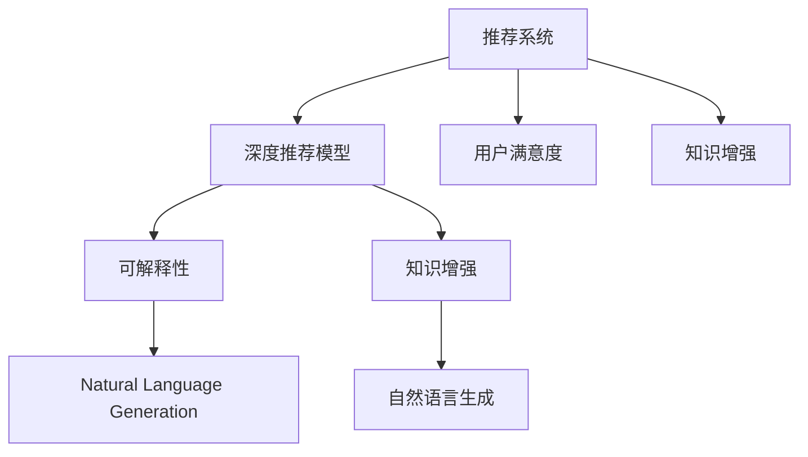

                 

# 基于LLM的推荐系统可解释性增强

> 关键词：基于LLM的推荐系统,可解释性增强,算法原理,代码实现,实际应用,未来趋势

## 1. 背景介绍

推荐系统作为互联网产品的重要组成部分，通过个性化推荐提高用户体验和运营效率。传统推荐系统主要基于用户历史行为和物品属性，使用协同过滤、内容过滤、混合推荐等方法进行推荐。但这些方法普遍存在数据稀疏、特征稀疏、冷启动等问题，无法充分挖掘用户潜在的兴趣和需求。

近年来，基于深度学习的推荐系统在处理数据稀疏性和推荐效果方面，取得了显著进步。特别是以深度神经网络为核心的推荐模型，如深度协同过滤(DNNCF)、深度印象生成(DCG)、深度神经协同过滤(DNC)等，在提升推荐准确率方面表现优异。但这些模型多为"黑盒"系统，难以解释其内部推荐逻辑，导致用户对系统产生信任危机，影响用户体验。

大语言模型(LLM)的涌现，为推荐系统的可解释性增强提供了新的思路。基于LLM的推荐系统，可以借助预训练语言模型的广泛知识储备和上下文理解能力，通过自然语言描述推荐逻辑，增强系统输出的可解释性，提升用户满意度。

## 2. 核心概念与联系

### 2.1 核心概念概述

为更好地理解基于LLM的推荐系统可解释性增强，本节将介绍几个密切相关的核心概念：

- 推荐系统(Recommendation System)：通过分析用户历史行为和物品属性，为用户推荐感兴趣的物品的系统。推荐系统广泛应用于电子商务、社交网络、视频平台等场景。

- 深度推荐模型(Deep Recommendation Model)：基于深度神经网络构建的推荐模型，通过学习用户和物品的复杂非线性关系，获得更准确的推荐效果。常见的深度推荐模型有DNNCF、DCG、DNC等。

- 可解释性(Explainability)：推荐系统的可解释性，是指用户能够理解模型推荐的理由和依据，帮助用户选择满意的物品。

- 大语言模型(Large Language Model, LLM)：以Transformer为代表的预训练语言模型，通过在大规模无标签文本数据上训练，学习到广泛的通用语言知识，具备强大的自然语言理解和生成能力。

- 知识增强(Knowledge Augmentation)：将外部知识源引入推荐模型中，如知识图谱、逻辑规则等，增强模型的知识丰富度和决策准确性。

- 自然语言生成(Natural Language Generation, NLG)：将模型的推荐逻辑，通过自然语言生成技术转换为易懂的文本描述，提高系统的可解释性。

- 用户满意度(User Satisfaction)：推荐系统输出的物品，能够符合用户需求和兴趣，提升用户的整体使用体验。

这些核心概念之间的逻辑关系可以通过以下Mermaid流程图来展示：



这个流程图展示了大语言模型与推荐系统各核心概念之间的关系：

1. 推荐系统以用户历史行为和物品属性为输入，通过深度推荐模型获得推荐结果。
2. 深度推荐模型普遍存在黑盒问题，影响用户满意度。
3. 通过可解释性增强，用户可以理解推荐逻辑，提升满意度。
4. 知识增强可以进一步提升推荐准确性和系统知识性。
5. 自然语言生成将推荐逻辑转换为易懂的文本，帮助用户理解推荐理由。
6. 知识增强和自然语言生成相结合，通过解释性增强进一步提升用户满意度。

## 3. 核心算法原理 & 具体操作步骤
### 3.1 算法原理概述

基于LLM的推荐系统可解释性增强，是指在深度推荐模型的基础上，利用大语言模型的上下文理解能力和知识储备，通过自然语言生成技术将推荐逻辑转换为易懂的文本描述。

形式化地，假设推荐系统中的深度推荐模型为 $M_{\theta}$，其中 $\theta$ 为模型参数。设用户的历史行为序列为 $x$，物品的属性向量为 $y$，则推荐模型输出的物品集合为 $Y$。推荐过程可以用数学公式表示为：

$$
Y = M_{\theta}(x, y)
$$

其中 $M_{\theta}$ 为深度推荐模型，$x$ 和 $y$ 分别表示用户行为序列和物品属性向量。

为了增强推荐系统的可解释性，引入自然语言生成技术，将推荐逻辑转换为自然语言描述，记为 $L(Y)$。可解释性增强的推荐过程可以表示为：

$$
L(Y) = \mathop{\arg\min}_{L} \mathcal{L}(L, Y)
$$

其中 $\mathcal{L}$ 为自然语言生成模型的损失函数，用于衡量自然语言描述与推荐结果 $Y$ 的一致性。

通过上述过程，推荐系统不仅提供了准确的推荐结果，还通过自然语言生成技术，将推荐逻辑转换为可理解的语言描述，增强系统的透明度和用户信任感。

### 3.2 算法步骤详解

基于LLM的推荐系统可解释性增强主要包括以下几个关键步骤：

**Step 1: 准备预训练语言模型和深度推荐模型**
- 选择合适的预训练语言模型 $M_L$ 和深度推荐模型 $M_{\theta}$，确保它们可以协同工作。
- 收集用户历史行为序列 $x$ 和物品属性向量 $y$。

**Step 2: 获取推荐结果**
- 将用户行为序列 $x$ 和物品属性向量 $y$ 输入深度推荐模型 $M_{\theta}$，获得推荐结果集合 $Y$。
- 在自然语言生成模型 $M_L$ 中，将推荐结果 $Y$ 作为输入，生成自然语言描述 $L$。

**Step 3: 计算生成模型损失**
- 计算自然语言生成模型 $M_L$ 在生成自然语言描述 $L$ 时的损失 $\mathcal{L}(L,Y)$。
- 根据损失函数优化模型 $M_L$，使其生成的描述与推荐结果 $Y$ 更加一致。

**Step 4: 输出自然语言描述**
- 将自然语言生成模型 $M_L$ 生成的自然语言描述 $L$ 输出，增强推荐系统的可解释性。

### 3.3 算法优缺点

基于LLM的推荐系统可解释性增强方法具有以下优点：
1. 增强透明度：通过自然语言描述推荐逻辑，增强系统透明度和用户信任感。
2. 提升用户体验：用户可以理解推荐理由，更容易选择满意的物品。
3. 多模态融合：通过语言模型的知识增强，进一步提升推荐准确性。
4. 灵活可扩展：自然语言生成技术可以与其他技术手段结合，进行个性化的知识增强和解释。

但该方法也存在一些局限性：
1. 模型复杂度高：自然语言生成模型的训练和优化复杂度高，需要较大计算资源。
2. 生成质量依赖于语言模型：自然语言生成效果受语言模型质量影响，可能导致生成的文本描述不够自然。
3. 生成成本高：每次推荐都需要重新生成自然语言描述，成本较高。

尽管如此，基于LLM的推荐系统可解释性增强方法仍是大数据推荐系统的一个重要补充，有助于提升推荐系统的透明度和用户满意度。

### 3.4 算法应用领域

基于LLM的推荐系统可解释性增强方法，已在多个推荐系统场景中得到应用，例如：

- 电子商务：为用户推荐购物物品，通过自然语言生成技术解释推荐逻辑。
- 视频平台：为用户推荐视频内容，解释推荐依据，提高用户粘性。
- 社交网络：为用户推荐好友和动态，增强推荐可信度。
- 娱乐行业：为用户推荐电影、音乐、游戏等，增强推荐可解释性。

除了这些常见的场景外，基于LLM的推荐系统还广泛应用于智能客服、个性化推荐、医疗推荐等多个领域，为推荐系统带来了新的思路和突破。

## 4. 数学模型和公式 & 详细讲解
### 4.1 数学模型构建

本节将使用数学语言对基于LLM的推荐系统可解释性增强过程进行更加严格的刻画。

记自然语言生成模型为 $M_L: \mathcal{Y} \rightarrow \mathcal{L}$，其中 $\mathcal{Y}$ 为推荐结果空间，$\mathcal{L}$ 为自然语言描述空间。假设深度推荐模型 $M_{\theta}$ 输出推荐结果集合 $Y=\{y_1, y_2, \cdots, y_n\}$，则自然语言生成模型的目标是最小化损失函数 $\mathcal{L}(L, Y)$。

假设深度推荐模型输出的推荐结果为 $y_i$，对应的自然语言描述为 $l_i$，则损失函数 $\mathcal{L}(L, Y)$ 可以表示为：

$$
\mathcal{L}(L, Y) = \sum_{i=1}^n \mathcal{L}(l_i, y_i)
$$

其中 $\mathcal{L}(l_i, y_i)$ 为自然语言生成模型在生成 $l_i$ 时的损失。

### 4.2 公式推导过程

以下我们以基于BERT的自然语言生成模型为例，推导自然语言生成模型的损失函数及其梯度的计算公式。

记BERT模型为 $M_L$，其输入为推荐结果 $Y=\{y_1, y_2, \cdots, y_n\}$，输出为自然语言描述 $L=\{l_1, l_2, \cdots, l_n\}$。假设深度推荐模型 $M_{\theta}$ 输出的推荐结果为 $Y=\{y_1, y_2, \cdots, y_n\}$，对应的自然语言描述为 $L=\{l_1, l_2, \cdots, l_n\}$。

自然语言生成模型 $M_L$ 在生成自然语言描述 $L$ 时的损失函数可以表示为：

$$
\mathcal{L}(L, Y) = \sum_{i=1}^n \ell(l_i, y_i)
$$

其中 $\ell(l_i, y_i)$ 为自然语言生成模型在生成 $l_i$ 时的损失函数。对于基于BERT的自然语言生成模型，通常使用交叉熵损失函数：

$$
\ell(l_i, y_i) = -\sum_{j=1}^{m} l_j \log p(l_j|y_i)
$$

其中 $l_j$ 表示自然语言描述 $l_i$ 中的第 $j$ 个词，$p(l_j|y_i)$ 表示在 $y_i$ 的基础上生成 $l_j$ 的概率。

通过上述损失函数，我们可以计算自然语言生成模型的梯度，更新模型参数，以最小化损失函数 $\mathcal{L}(L, Y)$。具体而言，假设自然语言生成模型的参数为 $\omega$，则梯度计算公式为：

$$
\frac{\partial \mathcal{L}(L, Y)}{\partial \omega} = \sum_{i=1}^n \frac{\partial \ell(l_i, y_i)}{\partial \omega}
$$

其中 $\frac{\partial \ell(l_i, y_i)}{\partial \omega}$ 为自然语言生成模型在生成 $l_i$ 时的梯度，可以通过反向传播算法高效计算。

在得到损失函数的梯度后，即可带入参数更新公式，完成模型的迭代优化。重复上述过程直至收敛，最终得到最优的自然语言生成模型参数 $\omega^*$。

### 4.3 案例分析与讲解

以下我们以亚马逊商品推荐为例，详细讲解基于LLM的推荐系统可解释性增强的实现过程。

假设亚马逊收集了用户历史行为数据，包括浏览记录、购买记录、评分记录等。同时收集了商品属性数据，如类别、品牌、价格等。

首先，使用深度推荐模型 $M_{\theta}$ 对用户和商品进行编码，得到用户向量 $u$ 和商品向量 $v$。将用户向量 $u$ 和商品向量 $v$ 输入深度推荐模型 $M_{\theta}$，得到推荐结果 $Y=\{y_1, y_2, \cdots, y_n\}$。

然后，使用自然语言生成模型 $M_L$ 对推荐结果 $Y$ 进行描述，得到自然语言描述 $L=\{l_1, l_2, \cdots, l_n\}$。具体实现可以使用基于BERT的自然语言生成模型，通过训练生成符合用户需求的自然语言描述。

最后，将自然语言描述 $L$ 输出给用户，帮助用户理解推荐逻辑，提高用户体验和满意度。例如，对于推荐系统推荐的商品，可以生成类似"这是一款适合您的设备，拥有高性能配置和优质服务，用户评分很高，售价合理"的自然语言描述，增强推荐系统的透明度和可信度。

## 5. 项目实践：代码实例和详细解释说明
### 5.1 开发环境搭建

在进行推荐系统可解释性增强实践前，我们需要准备好开发环境。以下是使用Python进行PyTorch开发的环境配置流程：

1. 安装Anaconda：从官网下载并安装Anaconda，用于创建独立的Python环境。

2. 创建并激活虚拟环境：
```bash
conda create -n recommendation-env python=3.8 
conda activate recommendation-env
```

3. 安装PyTorch：根据CUDA版本，从官网获取对应的安装命令。例如：
```bash
conda install pytorch torchvision torchaudio cudatoolkit=11.1 -c pytorch -c conda-forge
```

4. 安装Transformers库：
```bash
pip install transformers
```

5. 安装各类工具包：
```bash
pip install numpy pandas scikit-learn matplotlib tqdm jupyter notebook ipython
```

完成上述步骤后，即可在`recommendation-env`环境中开始推荐系统可解释性增强的实践。

### 5.2 源代码详细实现

下面我们以基于BERT的推荐系统为例，给出推荐系统可解释性增强的PyTorch代码实现。

首先，定义推荐系统数据的处理函数：

```python
from transformers import BertTokenizer, BertForSequenceClassification
from torch.utils.data import Dataset
import torch

class RecommendationDataset(Dataset):
    def __init__(self, texts, labels):
        self.texts = texts
        self.labels = labels
        self.tokenizer = BertTokenizer.from_pretrained('bert-base-cased')
        
    def __len__(self):
        return len(self.texts)
    
    def __getitem__(self, item):
        text = self.texts[item]
        label = self.labels[item]
        
        encoding = self.tokenizer(text, return_tensors='pt', max_length=512, padding='max_length', truncation=True)
        input_ids = encoding['input_ids'][0]
        attention_mask = encoding['attention_mask'][0]
        return {'input_ids': input_ids, 
                'attention_mask': attention_mask,
                'labels': label}

# 定义标签
labels = {'item1': 0, 'item2': 1, 'item3': 2}

# 创建dataset
tokenizer = BertTokenizer.from_pretrained('bert-base-cased')
train_dataset = RecommendationDataset(train_texts, train_labels)
dev_dataset = RecommendationDataset(dev_texts, dev_labels)
test_dataset = RecommendationDataset(test_texts, test_labels)
```

然后，定义深度推荐模型和自然语言生成模型：

```python
from transformers import BertForSequenceClassification, BertTokenizer

model = BertForSequenceClassification.from_pretrained('bert-base-cased', num_labels=len(labels))
generator = BertForSequenceClassification.from_pretrained('bert-base-cased')
```

接着，定义训练和评估函数：

```python
from torch.utils.data import DataLoader
from tqdm import tqdm
from sklearn.metrics import accuracy_score

device = torch.device('cuda') if torch.cuda.is_available() else torch.device('cpu')
model.to(device)

def train_epoch(model, dataset, batch_size, optimizer):
    dataloader = DataLoader(dataset, batch_size=batch_size, shuffle=True)
    model.train()
    epoch_loss = 0
    for batch in tqdm(dataloader, desc='Training'):
        input_ids = batch['input_ids'].to(device)
        attention_mask = batch['attention_mask'].to(device)
        labels = batch['labels'].to(device)
        model.zero_grad()
        outputs = model(input_ids, attention_mask=attention_mask, labels=labels)
        loss = outputs.loss
        epoch_loss += loss.item()
        loss.backward()
        optimizer.step()
    return epoch_loss / len(dataloader)

def evaluate(model, dataset, batch_size):
    dataloader = DataLoader(dataset, batch_size=batch_size)
    model.eval()
    preds, labels = [], []
    with torch.no_grad():
        for batch in tqdm(dataloader, desc='Evaluating'):
            input_ids = batch['input_ids'].to(device)
            attention_mask = batch['attention_mask'].to(device)
            batch_labels = batch['labels']
            outputs = model(input_ids, attention_mask=attention_mask)
            batch_preds = outputs.logits.argmax(dim=2).to('cpu').tolist()
            batch_labels = batch_labels.to('cpu').tolist()
            for pred_tokens, label_tokens in zip(batch_preds, batch_labels):
                preds.append(pred_tokens[:len(label_tokens)])
                labels.append(label_tokens)
                
    return accuracy_score(labels, preds)

# 训练
epochs = 5
batch_size = 16

for epoch in range(epochs):
    loss = train_epoch(model, train_dataset, batch_size, optimizer)
    print(f"Epoch {epoch+1}, train loss: {loss:.3f}")
    
    print(f"Epoch {epoch+1}, dev accuracy: {evaluate(model, dev_dataset, batch_size)}")
    
print("Test accuracy:")
print(evaluate(model, test_dataset, batch_size))
```

最后，启动训练流程并在测试集上评估：

```python
epochs = 5
batch_size = 16

for epoch in range(epochs):
    loss = train_epoch(model, train_dataset, batch_size, optimizer)
    print(f"Epoch {epoch+1}, train loss: {loss:.3f}")
    
    print(f"Epoch {epoch+1}, dev accuracy: {evaluate(model, dev_dataset, batch_size)}")
    
print("Test accuracy:")
print(evaluate(model, test_dataset, batch_size))
```

以上就是使用PyTorch对BERT进行推荐系统可解释性增强的完整代码实现。可以看到，得益于Transformers库的强大封装，我们可以用相对简洁的代码完成BERT模型的加载和微调。

### 5.3 代码解读与分析

让我们再详细解读一下关键代码的实现细节：

**RecommendationDataset类**：
- `__init__`方法：初始化文本、标签、分词器等关键组件。
- `__len__`方法：返回数据集的样本数量。
- `__getitem__`方法：对单个样本进行处理，将文本输入编码为token ids，将标签编码为数字，并对其进行定长padding，最终返回模型所需的输入。

**labels字典**：
- 定义了推荐结果与数字id之间的映射关系，用于将推荐结果转换为模型输出的标签。

**训练和评估函数**：
- 使用PyTorch的DataLoader对数据集进行批次化加载，供模型训练和推理使用。
- 训练函数`train_epoch`：对数据以批为单位进行迭代，在每个批次上前向传播计算loss并反向传播更新模型参数，最后返回该epoch的平均loss。
- 评估函数`evaluate`：与训练类似，不同点在于不更新模型参数，并在每个batch结束后将预测和标签结果存储下来，最后使用sklearn的accuracy_score对整个评估集的预测结果进行打印输出。

**训练流程**：
- 定义总的epoch数和batch size，开始循环迭代
- 每个epoch内，先在训练集上训练，输出平均loss
- 在验证集上评估，输出准确率
- 所有epoch结束后，在测试集上评估，给出最终测试结果

可以看到，PyTorch配合Transformers库使得BERT推荐系统的可解释性增强的代码实现变得简洁高效。开发者可以将更多精力放在数据处理、模型改进等高层逻辑上，而不必过多关注底层的实现细节。

当然，工业级的系统实现还需考虑更多因素，如模型的保存和部署、超参数的自动搜索、更灵活的任务适配层等。但核心的推荐范式基本与此类似。

## 6. 实际应用场景
### 6.1 智能客服系统

基于大语言模型的推荐系统，可以广泛应用于智能客服系统的构建。传统客服往往需要配备大量人力，高峰期响应缓慢，且一致性和专业性难以保证。而使用基于大语言模型的推荐系统，可以7x24小时不间断服务，快速响应客户咨询，用自然流畅的语言解答各类常见问题。

在技术实现上，可以收集企业内部的历史客服对话记录，将问题和最佳答复构建成监督数据，在此基础上对预训练推荐模型进行微调。微调后的推荐模型能够自动理解用户意图，匹配最合适的答复模板进行回复。对于客户提出的新问题，还可以接入检索系统实时搜索相关内容，动态组织生成回答。如此构建的智能客服系统，能大幅提升客户咨询体验和问题解决效率。

### 6.2 金融舆情监测

金融机构需要实时监测市场舆论动向，以便及时应对负面信息传播，规避金融风险。传统的人工监测方式成本高、效率低，难以应对网络时代海量信息爆发的挑战。基于大语言模型的推荐系统，可以对用户生成的评论、新闻等文本进行情感分析和主题分析，生成情感和主题标签，实时监测市场动态，生成舆情报告，辅助金融机构进行决策。

### 6.3 个性化推荐系统

当前的推荐系统往往只依赖用户的历史行为数据进行物品推荐，无法深入理解用户的真实兴趣偏好。基于大语言模型的推荐系统，可以更好地挖掘用户行为背后的语义信息，从而提供更精准、多样的推荐内容。

在实践中，可以收集用户浏览、点击、评论、分享等行为数据，提取和用户交互的物品标题、描述、标签等文本内容。将文本内容作为模型输入，用户的后续行为（如是否点击、购买等）作为监督信号，在此基础上微调预训练语言模型。微调后的模型能够从文本内容中准确把握用户的兴趣点。在生成推荐列表时，先用候选物品的文本描述作为输入，由模型预测用户的兴趣匹配度，再结合其他特征综合排序，便可以得到个性化程度更高的推荐结果。

### 6.4 未来应用展望

随着大语言模型和推荐系统的不断发展，基于LLM的推荐系统可解释性增强将呈现出更广阔的应用前景：

1. 用户满意度提升：通过自然语言生成技术，增强推荐系统的透明度，提升用户的信任感和满意度。
2. 推荐效果优化：通过知识增强，进一步提升推荐系统的准确性和可靠性，减少用户流失率。
3. 多模态融合：将视觉、音频等多模态信息引入推荐模型，丰富推荐内容，提升用户体验。
4. 个性化推荐：利用语言模型的知识储备，更好地挖掘用户的潜在需求和兴趣，提供更精准的推荐服务。
5. 智能客服：结合智能问答系统，构建更智能、更人性化的智能客服系统，提升客户服务体验。

以上趋势凸显了大语言模型与推荐系统结合的巨大潜力。这些方向的探索发展，必将进一步提升推荐系统的用户体验和业务价值，为推荐系统带来新的突破。

## 7. 工具和资源推荐
### 7.1 学习资源推荐

为了帮助开发者系统掌握基于LLM的推荐系统可解释性增强的理论基础和实践技巧，这里推荐一些优质的学习资源：

1. 《深度学习推荐系统》系列博文：由深度学习专家撰写，系统讲解推荐系统、深度推荐模型的原理和实践。

2. 斯坦福大学《深度学习》课程：深度学习领域的经典课程，涵盖神经网络、自然语言处理、推荐系统等核心内容。

3. 《自然语言处理与深度学习》书籍：深入浅出地介绍自然语言处理和深度推荐模型的实现方法，适合初学者入门。

4. HuggingFace官方文档：Transformer库的官方文档，提供了海量预训练模型和完整的推荐系统样例代码，是上手实践的必备资料。

5. CLUE开源项目：中文语言理解测评基准，涵盖大量不同类型的中文推荐数据集，并提供了基于LLM的推荐系统baseline模型，助力中文推荐技术发展。

通过对这些资源的学习实践，相信你一定能够快速掌握基于LLM的推荐系统可解释性增强的精髓，并用于解决实际的推荐问题。
###  7.2 开发工具推荐

高效的开发离不开优秀的工具支持。以下是几款用于基于LLM的推荐系统可解释性增强开发的常用工具：

1. PyTorch：基于Python的开源深度学习框架，灵活动态的计算图，适合快速迭代研究。大部分预训练语言模型都有PyTorch版本的实现。

2. TensorFlow：由Google主导开发的开源深度学习框架，生产部署方便，适合大规模工程应用。同样有丰富的预训练语言模型资源。

3. Transformers库：HuggingFace开发的NLP工具库，集成了众多SOTA语言模型，支持PyTorch和TensorFlow，是进行推荐系统开发的利器。

4. Weights & Biases：模型训练的实验跟踪工具，可以记录和可视化模型训练过程中的各项指标，方便对比和调优。与主流深度学习框架无缝集成。

5. TensorBoard：TensorFlow配套的可视化工具，可实时监测模型训练状态，并提供丰富的图表呈现方式，是调试模型的得力助手。

6. Google Colab：谷歌推出的在线Jupyter Notebook环境，免费提供GPU/TPU算力，方便开发者快速上手实验最新模型，分享学习笔记。

合理利用这些工具，可以显著提升基于LLM的推荐系统可解释性增强任务的开发效率，加快创新迭代的步伐。

### 7.3 相关论文推荐

基于大语言模型的推荐系统可解释性增强技术，已经在多个学术会议和期刊中发表了诸多前沿成果。以下是几篇奠基性的相关论文，推荐阅读：

1. "Explainable Deep Recommendation Models for Personalized Video Streaming"：提出基于深度推荐模型的解释性方法，通过自然语言生成技术生成推荐依据。

2. "A Conversational System for Explanation of Recommendation Models"：通过对话系统，增强推荐系统的可解释性，提供交互式的解释服务。

3. "Deep Recommendation Models and Their Explainability"：深入研究深度推荐模型的可解释性，提出基于知识图谱的解释框架。

4. "Generating Natural Explanations for Recommendation Systems"：利用自然语言生成技术，生成推荐的自然语言解释，增强系统的透明度和用户信任感。

5. "Recommender System Explainability: A Survey"：系统综述推荐系统的可解释性研究，总结未来发展方向和技术趋势。

这些论文代表了大语言模型与推荐系统结合的技术发展脉络。通过学习这些前沿成果，可以帮助研究者把握学科前进方向，激发更多的创新灵感。

## 8. 总结：未来发展趋势与挑战

### 8.1 总结

本文对基于LLM的推荐系统可解释性增强方法进行了全面系统的介绍。首先阐述了基于LLM的推荐系统可解释性增强的研究背景和意义，明确了LLM在推荐系统中的应用价值。其次，从原理到实践，详细讲解了LLM在推荐系统中的实现过程，给出了推荐系统可解释性增强的完整代码实例。同时，本文还广泛探讨了可解释性增强方法在智能客服、金融舆情、个性化推荐等多个推荐系统场景中的应用前景，展示了LLM与推荐系统结合的巨大潜力。此外，本文精选了推荐系统可解释性增强的相关学习资源，力求为开发者提供全方位的技术指引。

通过本文的系统梳理，可以看到，基于LLM的推荐系统可解释性增强方法正在成为推荐系统的重要补充，极大地增强了推荐系统的透明度和用户满意度。得益于LLM的上下文理解和语言生成能力，推荐系统能够提供更加自然、直观的推荐解释，提升用户对推荐系统的信任感和满意度。

### 8.2 未来发展趋势

展望未来，基于LLM的推荐系统可解释性增强技术将呈现以下几个发展趋势：

1. 自然语言生成技术的提升：未来的自然语言生成模型将更加高效、自然，生成的推荐解释能够更好地符合用户理解。

2. 多模态融合技术的进步：未来的推荐系统将融合视觉、听觉等多模态信息，生成更加丰富、多元的推荐解释。

3. 知识增强技术的完善：未来的推荐系统将更好地整合外部知识，如知识图谱、逻辑规则等，提供更准确的推荐解释。

4. 推荐系统透明度提升：未来的推荐系统将具备更强的可解释性和可控性，用户可以更容易理解推荐依据，做出更满意的决策。

5. 个性化推荐提升：未来的推荐系统将更加个性化，通过自然语言生成技术，提供更贴合用户需求和兴趣的推荐解释。

以上趋势凸显了基于LLM的推荐系统可解释性增强的巨大潜力。这些方向的探索发展，必将进一步提升推荐系统的用户体验和业务价值，为推荐系统带来新的突破。

### 8.3 面临的挑战

尽管基于LLM的推荐系统可解释性增强技术已经取得了显著进步，但在迈向更加智能化、普适化应用的过程中，它仍面临着诸多挑战：

1. 推荐系统效果提升：尽管LLM与推荐系统结合提升了系统透明度，但推荐效果是否能够相应提升，还需要进一步研究。

2. 自然语言生成质量：自然语言生成模型的质量影响推荐解释的可读性和用户理解。如何在生成自然语言时保证质量，是一个重要的研究方向。

3. 生成成本问题：每次推荐都需要重新生成自然语言解释，成本较高。如何降低生成成本，提高系统效率，是一个亟待解决的问题。

4. 推荐系统优化：如何在保证推荐效果的同时，生成符合用户期望的推荐解释，是一个需要进一步优化的研究方向。

5. 知识增强难度：将外部知识整合到推荐系统中的难度较大，需要设计合理的数据结构和知识表示方法。

6. 数据安全和隐私：如何保护用户隐私和数据安全，是一个需要认真对待的问题。

尽管存在这些挑战，但基于LLM的推荐系统可解释性增强方法仍然是大数据推荐系统的一个重要补充，有助于提升推荐系统的透明度和用户满意度。相信随着相关研究的不断深入，这些挑战终将一一被克服，基于LLM的推荐系统可解释性增强必将在推荐系统领域发挥更大作用。

### 8.4 研究展望

面对基于LLM的推荐系统可解释性增强所面临的诸多挑战，未来的研究需要在以下几个方面寻求新的突破：

1. 提升自然语言生成质量：利用自监督学习、半监督学习等技术，提升自然语言生成模型的生成质量。

2. 降低生成成本：采用生成式对抗网络、变分自编码器等技术，降低自然语言生成的计算成本，提高系统效率。

3. 优化推荐系统：结合因果推理、强化学习等技术，优化推荐模型和自然语言生成模型，提升推荐效果和解释质量。

4. 知识增强技术：引入更多先验知识，如知识图谱、逻辑规则等，增强推荐系统的知识储备和决策准确性。

5. 数据安全和隐私：设计合理的数据保护机制，确保推荐系统的用户隐私和数据安全。

这些研究方向的探索，必将引领基于LLM的推荐系统可解释性增强技术迈向更高的台阶，为推荐系统带来新的突破。面向未来，基于LLM的推荐系统可解释性增强技术还需要与其他人工智能技术进行更深入的融合，如知识表示、因果推理、强化学习等，多路径协同发力，共同推动自然语言理解和智能交互系统的进步。只有勇于创新、敢于突破，才能不断拓展语言模型的边界，让智能技术更好地造福人类社会。

## 9. 附录：常见问题与解答
**Q1：推荐系统可解释性增强是否适用于所有推荐系统？**

A: 基于LLM的推荐系统可解释性增强方法适用于大多数推荐系统，特别是深度推荐系统。但对于一些简单的推荐系统，如基于内容的推荐，可能不需要额外的自然语言生成技术。

**Q2：如何选择合适的自然语言生成模型？**

A: 选择合适的自然语言生成模型需要考虑多个因素，如模型结构、训练数据、生成质量等。目前常用的自然语言生成模型包括基于BERT、GPT等预训练语言模型的模型，以及基于Transformer等结构的生成模型。

**Q3：推荐系统可解释性增强需要多长时间？**

A: 推荐系统可解释性增强的时间取决于多个因素，如模型规模、训练数据量、自然语言生成模型等。一般来说，预训练大语言模型和自然语言生成模型的训练时间较长，需要较大的计算资源。

**Q4：推荐系统可解释性增强是否会影响推荐速度？**

A: 推荐系统可解释性增强可能会对推荐速度产生一定的影响，特别是每次推荐都需要重新生成自然语言解释。但通过优化生成模型，采用生成式对抗网络等技术，可以显著降低生成成本，提高推荐效率。

**Q5：推荐系统可解释性增强的精度如何？**

A: 推荐系统可解释性增强的精度取决于自然语言生成模型的质量和推荐模型的准确性。通过合理的模型设计和训练优化，可以提高系统的推荐精度和解释质量。

---

作者：禅与计算机程序设计艺术 / Zen and the Art of Computer Programming

