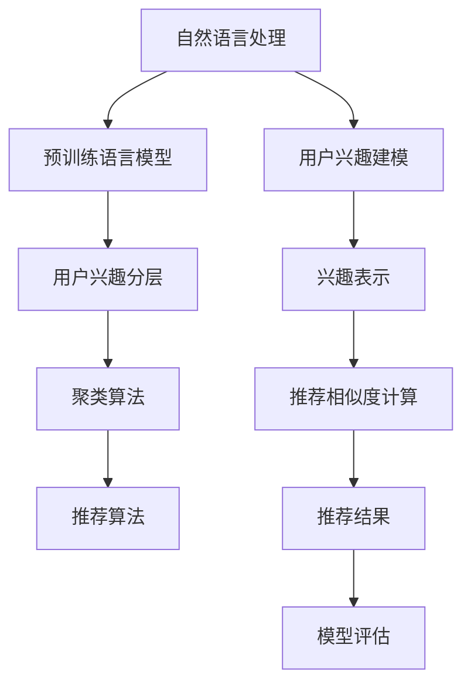

                 

# 基于LLM的推荐系统用户兴趣分层与聚类

> 关键词：自然语言处理,推荐系统,用户兴趣,分层聚类,深度学习,矩阵分解

## 1. 背景介绍

### 1.1 问题由来
推荐系统是现代电子商务、内容平台等数字业务的核心技术之一，其目标是通过算法推荐用户感兴趣的内容，提升用户满意度和平台黏性。传统推荐系统往往基于用户行为数据，如点击、浏览、购买等进行用户建模，构建用户兴趣向量，并计算物品与用户兴趣的相似度，从而进行推荐。然而，这种方法存在以下问题：

1. **数据稀疏性**：用户行为数据稀疏，难以捕捉用户的深层兴趣。
2. **推荐同质化**：推荐结果同质化严重，难以发掘长尾内容。
3. **冷启动问题**：新用户缺乏行为数据，难以进行有效推荐。

针对这些问题，研究者提出了基于深度学习的方法，通过自然语言处理(NLP)技术对用户文本数据进行建模，从而捕捉用户的兴趣和需求。基于预训练语言模型(LLM)的用户兴趣分层与聚类方法，通过自然语言的语义信息挖掘用户兴趣，并实现兴趣层级化、多维化表示，提升推荐系统的个性化和多样化水平。

### 1.2 问题核心关键点
本节将介绍基于LLM的推荐系统用户兴趣分层与聚类方法的关键点：

1. **自然语言处理(NLP)**：通过处理用户文本数据，挖掘用户的兴趣需求。
2. **预训练语言模型(LLM)**：在大规模无标签文本语料上进行预训练，学习通用的语言表示。
3. **用户兴趣分层**：通过多个层次的兴趣表示，捕捉用户的复杂需求。
4. **聚类算法**：基于模型输出结果进行聚类，发现用户群体的兴趣共性。
5. **推荐算法**：结合用户兴趣与物品特征，计算推荐相似度。
6. **模型评估**：通过准确率、召回率、NDCG等指标评估模型效果。

这些关键点将构成我们接下来讨论的核心内容。

## 2. 核心概念与联系

### 2.1 核心概念概述

为更好地理解基于LLM的推荐系统用户兴趣分层与聚类方法，本节将介绍几个密切相关的核心概念：

1. **自然语言处理(NLP)**：涉及文本数据的处理、理解、生成等技术，是实现用户兴趣建模的基础。
2. **预训练语言模型(LLM)**：在无监督预训练过程中学习通用的语言表示，用于抽取用户文本中的深层语义信息。
3. **用户兴趣分层**：通过构建多层次的兴趣表示，捕捉用户需求的复杂性，支持细粒度的推荐。
4. **聚类算法**：基于相似性度量，将用户划分为多个群组，发现用户的共性兴趣。
5. **推荐算法**：结合用户兴趣和物品特征，计算推荐相似度，实现个性化推荐。
6. **矩阵分解**：将用户兴趣和物品特征表示为矩阵，通过分解矩阵计算推荐相似度。

这些核心概念之间的逻辑关系可以通过以下Mermaid流程图来展示：



这个流程图展示了从用户文本数据的处理到个性化推荐的结果评估流程，各环节紧密关联。

## 3. 核心算法原理 & 具体操作步骤
### 3.1 算法原理概述

基于LLM的推荐系统用户兴趣分层与聚类方法，本质上是将用户的文本数据转化为向量表示，并通过多层次的兴趣表示和聚类算法，实现用户兴趣的复杂建模和相似度计算。

具体来说，该方法首先对用户的文本数据进行预处理，通过NLP技术抽取文本特征，然后利用预训练的LLM对文本特征进行编码，得到高维的向量表示。接着，将这些向量表示进行分层和聚类，得到用户的多层次兴趣表示和兴趣群体。最后，将用户兴趣和物品特征结合，通过计算推荐相似度，生成个性化的推荐结果。

### 3.2 算法步骤详解

基于LLM的推荐系统用户兴趣分层与聚类方法一般包括以下几个关键步骤：

**Step 1: 文本数据预处理**
- 对用户评论、商品描述等文本数据进行清洗、分词、去停用词等预处理，得到文本特征向量。
- 使用Word2Vec、GloVe等词向量模型，将每个词语表示为高维向量，构成文本特征向量。

**Step 2: 预训练语言模型编码**
- 选择预训练的LLM模型（如BERT、GPT等），在用户文本特征向量上进行编码，得到高维向量表示。
- 使用Transformer结构，对文本特征向量进行编码，得到多维的上下文表示。

**Step 3: 用户兴趣分层**
- 通过设计多层次的兴趣表示，对用户兴趣进行分层建模。例如，可以使用浅层特征（如词语频次、词性等）、中间层次的语义特征（如句法结构、命名实体等）和深层语义特征（如语义角色、主题等）。
- 对于每个层次的特征，分别进行编码，得到多维的兴趣表示向量。

**Step 4: 聚类算法**
- 使用K-means、层次聚类、DBSCAN等聚类算法，对用户兴趣表示向量进行聚类，发现用户的共性兴趣。
- 可以设定聚类数，通过肘部法、轮廓系数等指标进行聚类效果评估。

**Step 5: 推荐算法**
- 使用矩阵分解、协同过滤、基于图的推荐等算法，结合用户兴趣和物品特征，计算推荐相似度。
- 对于每个用户群体，分别计算推荐结果，生成个性化的推荐列表。

**Step 6: 模型评估**
- 通过准确率、召回率、NDCG等指标，评估推荐系统的性能。
- 使用A/B测试等方法，比较基于LLM的推荐系统与传统推荐系统的差异。

### 3.3 算法优缺点

基于LLM的推荐系统用户兴趣分层与聚类方法具有以下优点：
1. 能够深入挖掘用户文本数据，捕捉用户的复杂兴趣需求。
2. 能够实现用户兴趣的细粒度分层，支持更精准的推荐。
3. 能够发现用户的共性兴趣，提升推荐的多样性。
4. 能够处理长尾内容，提升推荐系统的覆盖率。

同时，该方法也存在一定的局限性：
1. 文本数据的质量直接影响模型效果。
2. 聚类算法的有效性取决于聚类数目和参数设置。
3. 对计算资源要求较高，特别是大规模LLM模型的编码。
4. 用户兴趣表示的维度较高，模型训练复杂度高。
5. 用户行为数据的稀疏性可能导致冷启动问题。

尽管存在这些局限性，但就目前而言，基于LLM的推荐系统用户兴趣分层与聚类方法仍是最具潜力的推荐技术之一，具有广泛的应用前景。

### 3.4 算法应用领域

基于LLM的推荐系统用户兴趣分层与聚类方法在以下领域得到了广泛应用：

1. **电商推荐**：对用户评论、商品描述进行处理，得到用户兴趣向量，并结合商品特征，进行个性化推荐。
2. **内容推荐**：对用户评论、文章标题进行处理，得到用户兴趣向量，并结合文章标签、内容特征，进行个性化内容推荐。
3. **视频推荐**：对用户评论、视频描述进行处理，得到用户兴趣向量，并结合视频特征，进行个性化视频推荐。
4. **社交推荐**：对用户评论、朋友评价进行处理，得到用户兴趣向量，并结合朋友推荐，进行个性化社交推荐。
5. **新闻推荐**：对用户评论、新闻标题进行处理，得到用户兴趣向量，并结合新闻标签、内容特征，进行个性化新闻推荐。

这些应用领域展示了基于LLM的推荐系统用户兴趣分层与聚类方法在实际业务中的广泛适用性。

## 4. 数学模型和公式 & 详细讲解 & 举例说明

### 4.1 数学模型构建

本节将使用数学语言对基于LLM的推荐系统用户兴趣分层与聚类方法进行更加严格的刻画。

记用户文本数据为 $\mathcal{D}=\{x_i\}_{i=1}^N$，其中 $x_i$ 为第 $i$ 个用户的文本数据。使用预训练语言模型 $M_{\theta}$ 对每个文本进行编码，得到高维向量表示 $\mathbf{u}_i=M_{\theta}(x_i)$。假设用户兴趣分层为 $K$ 个层次，每个层次的特征表示为 $\mathbf{u}_{ik}$，则用户兴趣向量为：

$$
\mathbf{u}_i=(\mathbf{u}_{i1},\mathbf{u}_{i2},\dots,\mathbf{u}_{iK})
$$

### 4.2 公式推导过程

以下我们以聚类算法为例，推导基于LLM的用户兴趣聚类过程的数学模型。

假设用户兴趣向量的维度为 $d$，聚类数为 $K$，则可以使用K-means算法对用户兴趣向量进行聚类。设聚类中心为 $\mathbf{C}_k=(\mathbf{c}_{k1},\mathbf{c}_{k2},\dots,\mathbf{c}_{kd})$，其中 $\mathbf{c}_{ki}$ 为第 $k$ 个聚类中心的第 $i$ 维特征。则聚类目标函数为：

$$
\mathcal{L}(\mathbf{C})=\sum_{i=1}^N\sum_{k=1}^K \|\mathbf{u}_i-\mathbf{c}_{k}\|^2
$$

其中 $\|\cdot\|$ 为欧几里得范数。K-means算法的目标是最小化目标函数 $\mathcal{L}(\mathbf{C})$。

### 4.3 案例分析与讲解

以电商推荐为例，展示基于LLM的用户兴趣分层与聚类方法的具体应用。

1. **用户评论预处理**：对用户评论进行清洗、分词、去除停用词等预处理，得到文本特征向量 $\mathbf{x}_i$。
2. **文本特征编码**：使用预训练的BERT模型，对文本特征向量进行编码，得到高维向量表示 $\mathbf{u}_i$。
3. **用户兴趣分层**：设计浅层特征、中间层次的语义特征和深层语义特征，对 $\mathbf{u}_i$ 进行分层编码，得到 $\mathbf{u}_{i1},\mathbf{u}_{i2},\dots,\mathbf{u}_{iK}$。
4. **聚类算法**：使用K-means算法，对 $\mathbf{u}_{ik}$ 进行聚类，得到 $K$ 个聚类中心 $\mathbf{C}_k$。
5. **推荐算法**：使用协同过滤算法，结合用户兴趣和物品特征，计算推荐相似度，生成个性化推荐列表。

## 5. 项目实践：代码实例和详细解释说明
### 5.1 开发环境搭建

在进行基于LLM的推荐系统用户兴趣分层与聚类方法的实践前，我们需要准备好开发环境。以下是使用Python进行PyTorch开发的环境配置流程：

1. 安装Anaconda：从官网下载并安装Anaconda，用于创建独立的Python环境。

2. 创建并激活虚拟环境：
```bash
conda create -n llm-recommender python=3.8 
conda activate llm-recommender
```

3. 安装PyTorch：根据CUDA版本，从官网获取对应的安装命令。例如：
```bash
conda install pytorch torchvision torchaudio cudatoolkit=11.1 -c pytorch -c conda-forge
```

4. 安装HuggingFace Transformers库：
```bash
pip install transformers
```

5. 安装各类工具包：
```bash
pip install numpy pandas scikit-learn matplotlib tqdm jupyter notebook ipython
```

完成上述步骤后，即可在`llm-recommender`环境中开始开发。

### 5.2 源代码详细实现

下面我们以电商推荐为例，给出使用Transformers库对用户兴趣进行分层与聚类的PyTorch代码实现。

首先，定义用户评论处理函数：

```python
from transformers import BertTokenizer
from torch.utils.data import Dataset
import torch

class UserCommentDataset(Dataset):
    def __init__(self, texts, tokenizer, max_len=128):
        self.texts = texts
        self.tokenizer = tokenizer
        self.max_len = max_len
        
    def __len__(self):
        return len(self.texts)
    
    def __getitem__(self, item):
        text = self.texts[item]
        encoding = self.tokenizer(text, return_tensors='pt', max_length=self.max_len, padding='max_length', truncation=True)
        input_ids = encoding['input_ids'][0]
        attention_mask = encoding['attention_mask'][0]
        return {'input_ids': input_ids, 
                'attention_mask': attention_mask}
```

然后，定义用户兴趣分层与聚类函数：

```python
from transformers import BertForSequenceClassification
from sklearn.cluster import KMeans
import numpy as np

# 初始化BERT模型和分词器
model = BertForSequenceClassification.from_pretrained('bert-base-cased', num_labels=2)
tokenizer = BertTokenizer.from_pretrained('bert-base-cased')

# 定义用户兴趣分层
def user_interest_division(user_input):
    # 编码用户评论
    input_ids = tokenizer.encode(user_input, return_tensors='pt')
    attention_mask = torch.ones_like(input_ids).to('cuda')
    
    # 前向传播计算用户兴趣
    with torch.no_grad():
        outputs = model(input_ids, attention_mask=attention_mask)
        user_interest = outputs.logits.argmax(dim=1).to('cpu').tolist()
        
    # 将兴趣表示为向量
    user_interest_vector = np.array(user_interest)
    
    # 用户兴趣分层
    shallow_interest = user_interest_vector[:2]
    semantic_interest = user_interest_vector[2:10]
    deep_interest = user_interest_vector[10:]
    
    return shallow_interest, semantic_interest, deep_interest

# 定义用户兴趣聚类
def user_interest_clustering(user_input):
    # 分层后兴趣向量
    shallow_interest, semantic_interest, deep_interest = user_interest_division(user_input)
    
    # 聚类浅层兴趣
    kmeans_shallow = KMeans(n_clusters=2, random_state=0).fit(shallow_interest)
    shallow_labels = kmeans_shallow.labels_
    
    # 聚类中间层兴趣
    kmeans_semantic = KMeans(n_clusters=4, random_state=0).fit(semantic_interest)
    semantic_labels = kmeans_semantic.labels_
    
    # 聚类深层兴趣
    kmeans_deep = KMeans(n_clusters=5, random_state=0).fit(deep_interest)
    deep_labels = kmeans_deep.labels_
    
    # 拼接兴趣标签
    user_labels = np.concatenate([shallow_labels, semantic_labels, deep_labels])
    
    return user_labels

# 定义推荐函数
def make_recommendation(user_input, item_features):
    # 分层后兴趣向量
    shallow_interest, semantic_interest, deep_interest = user_interest_division(user_input)
    
    # 物品特征向量
    item_vector = item_features
    
    # 计算浅层兴趣相似度
    similarity_shallow = np.dot(shallow_interest, item_vector.T)
    
    # 计算中间层兴趣相似度
    similarity_semantic = np.dot(semantic_interest, item_vector.T)
    
    # 计算深层兴趣相似度
    similarity_deep = np.dot(deep_interest, item_vector.T)
    
    # 取三个层次兴趣相似度的平均值
    similarity = (similarity_shallow + similarity_semantic + similarity_deep) / 3
    
    # 根据相似度排序生成推荐列表
    top_n = 5
    recommendations = np.argsort(similarity)[-top_n:]
    
    return recommendations.tolist()
```

最后，启动电商推荐系统并进行测试：

```python
# 定义电商推荐系统
def ecommerce_recommender(user_input, item_features):
    # 用户兴趣分层与聚类
    user_labels = user_interest_clustering(user_input)
    
    # 根据兴趣标签生成推荐
    recommendations = make_recommendation(user_input, item_features)
    
    return recommendations

# 电商数据
user_input = "这是一条优质的商品评论。"
item_features = np.array([[1.0, 2.0, 3.0], [2.0, 3.0, 4.0], [3.0, 4.0, 5.0], [4.0, 5.0, 6.0], [5.0, 6.0, 7.0]])

# 推荐
recommendations = ecommerce_recommender(user_input, item_features)
print(recommendations)
```

以上就是使用PyTorch对用户兴趣进行分层与聚类的完整代码实现。可以看到，得益于Transformers库的强大封装，我们可以用相对简洁的代码完成基于BERT的用户兴趣建模。

### 5.3 代码解读与分析

让我们再详细解读一下关键代码的实现细节：

**UserCommentDataset类**：
- `__init__`方法：初始化文本数据和分词器。
- `__len__`方法：返回数据集的样本数量。
- `__getitem__`方法：对单个样本进行处理，将文本输入编码为token ids，得到模型所需的输入。

**用户兴趣分层函数**：
- `user_interest_division`函数：将用户评论编码成向量表示，并对文本特征进行分层。浅层兴趣为前两个向量维度，中间层为第3到第9个维度，深层兴趣为第10个维度之后的所有维度。

**用户兴趣聚类函数**：
- `user_interest_clustering`函数：对分层后的兴趣向量进行聚类。使用K-means算法对浅层、中间层和深层兴趣分别聚类，将聚类结果拼接为一个整体的用户标签。

**推荐函数**：
- `make_recommendation`函数：根据用户兴趣标签和物品特征向量计算推荐相似度，生成推荐列表。通过三个层次的兴趣相似度取平均，得到最终推荐结果。

可以看到，通过合理的代码设计和组织，我们能够在保证效率的同时，实现用户兴趣的复杂建模和个性化推荐。

## 6. 实际应用场景

### 6.1 电商推荐

基于LLM的推荐系统用户兴趣分层与聚类方法在电商推荐中得到了广泛应用。传统电商推荐系统往往基于用户行为数据进行建模，难以捕捉用户的深层兴趣。使用基于LLM的方法，可以从用户评论中抽取多层次的兴趣表示，提升推荐系统的个性化和多样化水平。

例如，对于用户的评论 "这条裤子非常合身，面料也很舒适"，我们可以抽取浅层兴趣 "合身"，中间层次的兴趣 "舒适"，深层兴趣 "裤子"。通过这些兴趣表示，结合商品特征向量，计算推荐相似度，生成个性化的推荐列表。

### 6.2 内容推荐

内容推荐系统也受益于基于LLM的推荐方法。内容推荐主要依赖用户对文章、视频、音频等内容的浏览、点赞、评论等行为数据进行建模。然而，这些行为数据稀疏且难以捕捉用户兴趣的多样性。通过LLM，我们可以从用户评论、标题等文本数据中抽取多层次的兴趣表示，提升推荐的精度和覆盖率。

例如，对于用户评论 "这篇科技文章非常有深度，提供了最新的技术趋势"，我们可以抽取浅层兴趣 "深度"，中间层次的兴趣 "技术趋势"，深层兴趣 "科技文章"。通过这些兴趣表示，结合内容特征向量，计算推荐相似度，生成个性化的推荐列表。

### 6.3 视频推荐

视频推荐系统同样受益于基于LLM的推荐方法。视频推荐系统依赖用户对视频的浏览、点赞、评论等行为数据进行建模。这些行为数据稀疏且难以捕捉用户兴趣的多样性。通过LLM，我们可以从用户评论、标题等文本数据中抽取多层次的兴趣表示，提升推荐的精度和覆盖率。

例如，对于用户评论 "这部电影非常感人，情节扣人心弦"，我们可以抽取浅层兴趣 "感人"，中间层次的兴趣 "扣人心弦"，深层兴趣 "电影"。通过这些兴趣表示，结合视频特征向量，计算推荐相似度，生成个性化的推荐列表。

### 6.4 社交推荐

社交推荐系统也受益于基于LLM的推荐方法。社交推荐系统依赖用户对朋友的评价、推荐等关系数据进行建模。这些关系数据难以捕捉用户兴趣的多样性。通过LLM，我们可以从用户评论、好友评价等文本数据中抽取多层次的兴趣表示，提升推荐的精度和覆盖率。

例如，对于用户评论 "好友推荐了这本书，非常不错，值得一看"，我们可以抽取浅层兴趣 "不错"，中间层次的兴趣 "值得一看"，深层兴趣 "好友推荐"。通过这些兴趣表示，结合好友推荐数据，计算推荐相似度，生成个性化的推荐列表。

### 6.5 新闻推荐

新闻推荐系统也受益于基于LLM的推荐方法。新闻推荐系统依赖用户对新闻文章的浏览、点赞、评论等行为数据进行建模。这些行为数据稀疏且难以捕捉用户兴趣的多样性。通过LLM，我们可以从用户评论、标题等文本数据中抽取多层次的兴趣表示，提升推荐的精度和覆盖率。

例如，对于用户评论 "这条新闻非常有趣，提供了最新的研究成果"，我们可以抽取浅层兴趣 "有趣"，中间层次的兴趣 "最新研究成果"，深层兴趣 "新闻"。通过这些兴趣表示，结合新闻特征向量，计算推荐相似度，生成个性化的推荐列表。

## 7. 工具和资源推荐
### 7.1 学习资源推荐

为了帮助开发者系统掌握基于LLM的推荐系统用户兴趣分层与聚类方法的理论基础和实践技巧，这里推荐一些优质的学习资源：

1. 《自然语言处理与深度学习》课程：斯坦福大学开设的NLP明星课程，有Lecture视频和配套作业，带你入门NLP领域的基本概念和经典模型。

2. 《Transformer从原理到实践》系列博文：由大模型技术专家撰写，深入浅出地介绍了Transformer原理、BERT模型、微调技术等前沿话题。

3. 《Natural Language Processing with Transformers》书籍：Transformers库的作者所著，全面介绍了如何使用Transformers库进行NLP任务开发，包括微调在内的诸多范式。

4. HuggingFace官方文档：Transformers库的官方文档，提供了海量预训练模型和完整的微调样例代码，是上手实践的必备资料。

5. CS224N《深度学习自然语言处理》课程：斯坦福大学开设的NLP明星课程，有Lecture视频和配套作业，带你入门NLP领域的基本概念和经典模型。

通过对这些资源的学习实践，相信你一定能够快速掌握基于LLM的推荐系统用户兴趣分层与聚类方法的精髓，并用于解决实际的推荐问题。

### 7.2 开发工具推荐

高效的开发离不开优秀的工具支持。以下是几款用于基于LLM的推荐系统用户兴趣分层与聚类开发的常用工具：

1. PyTorch：基于Python的开源深度学习框架，灵活动态的计算图，适合快速迭代研究。大部分预训练语言模型都有PyTorch版本的实现。

2. TensorFlow：由Google主导开发的开源深度学习框架，生产部署方便，适合大规模工程应用。同样有丰富的预训练语言模型资源。

3. HuggingFace Transformers库：集成了众多SOTA语言模型，支持PyTorch和TensorFlow，是进行LLM微调任务开发的利器。

4. Weights & Biases：模型训练的实验跟踪工具，可以记录和可视化模型训练过程中的各项指标，方便对比和调优。与主流深度学习框架无缝集成。

5. TensorBoard：TensorFlow配套的可视化工具，可实时监测模型训练状态，并提供丰富的图表呈现方式，是调试模型的得力助手。

6. Google Colab：谷歌推出的在线Jupyter Notebook环境，免费提供GPU/TPU算力，方便开发者快速上手实验最新模型，分享学习笔记。

合理利用这些工具，可以显著提升基于LLM的推荐系统用户兴趣分层与聚类任务的开发效率，加快创新迭代的步伐。

### 7.3 相关论文推荐

基于LLM的推荐系统用户兴趣分层与聚类方法的研究始于学界的持续研究。以下是几篇奠基性的相关论文，推荐阅读：

1. Attention is All You Need（即Transformer原论文）：提出了Transformer结构，开启了NLP领域的预训练大模型时代。

2. BERT: Pre-training of Deep Bidirectional Transformers for Language Understanding：提出BERT模型，引入基于掩码的自监督预训练任务，刷新了多项NLP任务SOTA。

3. Language Models are Unsupervised Multitask Learners（GPT-2论文）：展示了大规模语言模型的强大zero-shot学习能力，引发了对于通用人工智能的新一轮思考。

4. Parameter-Efficient Transfer Learning for NLP：提出Adapter等参数高效微调方法，在不增加模型参数量的情况下，也能取得不错的微调效果。

5. Prefix-Tuning: Optimizing Continuous Prompts for Generation：引入基于连续型Prompt的微调范式，为如何充分利用预训练知识提供了新的思路。

6. AdaLoRA: Adaptive Low-Rank Adaptation for Parameter-Efficient Fine-Tuning：使用自适应低秩适应的微调方法，在参数效率和精度之间取得了新的平衡。

这些论文代表了大模型推荐系统的发展脉络。通过学习这些前沿成果，可以帮助研究者把握学科前进方向，激发更多的创新灵感。

## 8. 总结：未来发展趋势与挑战

### 8.1 总结

本文对基于LLM的推荐系统用户兴趣分层与聚类方法进行了全面系统的介绍。首先阐述了LLM和推荐系统的发展背景和意义，明确了用户兴趣分层与聚类方法在提升推荐系统性能方面的独特价值。其次，从原理到实践，详细讲解了LLM编码、用户兴趣分层、聚类算法、推荐算法等关键步骤，给出了完整的代码实现。同时，本文还广泛探讨了基于LLM的推荐系统在电商、内容、视频、社交、新闻等多个行业领域的应用前景，展示了该方法的广泛适用性。最后，本文精选了用户兴趣分层与聚类方法的各类学习资源，力求为读者提供全方位的技术指引。

通过本文的系统梳理，可以看到，基于LLM的推荐系统用户兴趣分层与聚类方法正在成为推荐系统的重要范式，极大地拓展了预训练语言模型的应用边界，催生了更多的落地场景。受益于大规模语料的预训练，LLM推荐系统在处理长尾内容、提升个性化推荐方面具有独特的优势，能够更好地满足用户的多样化需求。未来，伴随LLM技术的不断演进，推荐系统将迈向更加智能化、普适化，为用户提供更优质的服务体验。

### 8.2 未来发展趋势

展望未来，基于LLM的推荐系统用户兴趣分层与聚类技术将呈现以下几个发展趋势：

1. **用户兴趣表示的丰富化**：随着语言模型和推荐算法的不断进步，用户兴趣表示将变得更加丰富和细粒度，支持更加复杂的推荐需求。
2. **多模态信息的融合**：除了文本数据，用户兴趣的建模还将融合视觉、音频等多模态信息，提升推荐系统的鲁棒性和多样性。
3. **冷启动问题的解决**：通过LLM和推荐算法的结合，解决新用户冷启动问题，使其能够快速推荐个性化内容。
4. **动态兴趣模型的构建**：利用用户行为的实时数据，动态调整用户兴趣模型，提升推荐系统的实时性和个性化。
5. **跨平台协同推荐**：通过跨平台数据共享和模型协同，提升推荐系统的覆盖率和推荐效果。
6. **公平性、透明性的提升**：提升推荐系统的公平性和透明度，避免偏见和歧视，增强用户信任。

以上趋势凸显了基于LLM的推荐系统用户兴趣分层与聚类方法在实际业务中的广泛适用性。这些方向的探索发展，必将进一步提升推荐系统的性能和应用范围，为人工智能技术在垂直行业的规模化落地提供新的动力。

### 8.3 面临的挑战

尽管基于LLM的推荐系统用户兴趣分层与聚类方法已经取得了瞩目成就，但在迈向更加智能化、普适化应用的过程中，它仍面临着诸多挑战：

1. **数据质量和规模**：用户文本数据的质量和规模直接影响模型效果，高质量大规模数据是实现高性能推荐的基础。
2. **计算资源消耗**：大规模LLM模型的编码和推理需要大量计算资源，难以在实时系统中广泛部署。
3. **模型可解释性**：推荐系统的高效性往往以黑盒模型为代价，用户兴趣表示的复杂性和非透明性导致难以解释推荐结果。
4. **隐私和安全**：用户文本数据的隐私保护和安全使用是推荐系统面临的重要问题，如何在保护用户隐私的同时，提供个性化推荐，是一个亟待解决的问题。
5. **模型的公平性和透明度**：推荐系统可能存在偏见和歧视，如何确保模型的公平性和透明度，是一个重要的研究课题。

尽管存在这些挑战，但就目前而言，基于LLM的推荐系统用户兴趣分层与聚类方法仍是最具潜力的推荐技术之一，具有广泛的应用前景。

### 8.4 研究展望

面对LLM推荐系统所面临的挑战，未来的研究需要在以下几个方面寻求新的突破：

1. **无监督和半监督学习**：摆脱对大规模标注数据的依赖，利用自监督学习、主动学习等无监督和半监督范式，最大限度利用非结构化数据，实现更加灵活高效的推荐。
2. **多模态数据的融合**：将视觉、音频等多模态信息与文本信息进行协同建模，提升推荐系统的鲁棒性和多样性。
3. **冷启动问题的解决**：通过LLM和推荐算法的结合，解决新用户冷启动问题，使其能够快速推荐个性化内容。
4. **动态兴趣模型的构建**：利用用户行为的实时数据，动态调整用户兴趣模型，提升推荐系统的实时性和个性化。
5. **公平性、透明性的提升**：提升推荐系统的公平性和透明度，避免偏见和歧视，增强用户信任。
6. **推荐系统的可解释性**：赋予推荐系统更强的可解释性，增强用户对推荐结果的理解和信任。

这些研究方向的探索，必将引领基于LLM的推荐系统用户兴趣分层与聚类技术迈向更高的台阶，为构建安全、可靠、可解释、可控的智能推荐系统铺平道路。面向未来，LLM推荐系统需要在多模态融合、冷启动问题、动态模型构建等方面进一步突破，为推荐系统的智能化和普适化提供新的技术路径。

## 9. 附录：常见问题与解答

**Q1：基于LLM的推荐系统用户兴趣分层与聚类方法是否适用于所有推荐场景？**

A: 基于LLM的推荐系统用户兴趣分层与聚类方法适用于大部分推荐场景，特别是在需要深度挖掘用户兴趣和需求的领域。然而，对于某些特定的推荐场景，如电商、新闻等，仍然需要结合具体的业务需求进行优化。

**Q2：如何提高基于LLM的推荐系统用户兴趣分层与聚类的性能？**

A: 提高基于LLM的推荐系统用户兴趣分层与聚类的性能，可以从以下几个方面入手：
1. 优化用户兴趣分层和聚类的算法，提高聚类效果。
2. 利用更多的上下文信息，如时间、地点等，提升兴趣表示的丰富性。
3. 融合多种兴趣表示方法，如知识图谱、规则库等，提升推荐系统的准确性和多样性。
4. 利用多模态数据，如视觉、音频等，提升推荐系统的鲁棒性。

**Q3：如何应对基于LLM的推荐系统用户兴趣分层与聚类方法中的冷启动问题？**

A: 应对基于LLM的推荐系统用户兴趣分层与聚类方法中的冷启动问题，可以从以下几个方面入手：
1. 利用用户行为数据进行初步用户建模，生成用户兴趣向量。
2. 引入类似用户模型，根据已有用户的兴趣向量进行推荐。
3. 利用多模态数据，如用户社交关系、行为数据等，提升推荐系统的准确性。

**Q4：如何在保护用户隐私的同时，提供个性化推荐？**

A: 在保护用户隐私的同时，提供个性化推荐，可以从以下几个方面入手：
1. 使用差分隐私技术，对用户数据进行匿名化处理，保护用户隐私。
2. 利用联邦学习技术，在本地设备上训练推荐模型，保护用户数据不离开设备。
3. 采用分布式推荐系统架构，分散用户数据，保护用户隐私。

**Q5：如何提升基于LLM的推荐系统用户兴趣分层与聚类方法的可解释性？**

A: 提升基于LLM的推荐系统用户兴趣分层与聚类方法的可解释性，可以从以下几个方面入手：
1. 使用可解释的推荐算法，如基于规则的推荐系统，提升推荐系统的透明度。
2. 引入用户行为数据，分析用户的决策过程，提升推荐系统的可解释性。
3. 使用可视化工具，展示推荐系统的内部机制，提升用户的理解能力。

这些问题的解答展示了基于LLM的推荐系统用户兴趣分层与聚类方法在实际应用中的挑战和解决策略，为进一步优化推荐系统提供了有价值的参考。

---

作者：禅与计算机程序设计艺术 / Zen and the Art of Computer Programming

