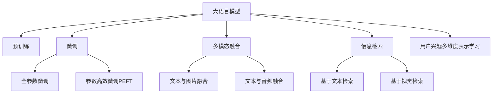

                 

# 基于LLM的用户兴趣多维度表示学习

> 关键词：用户兴趣, 多维度表示, 自然语言处理(NLP), 预训练模型, 多模态学习, 深度学习, 信息检索

## 1. 背景介绍

在数字化时代的今天，用户兴趣的识别和表示成为了各大互联网公司竞相争抢的焦点。通过分析用户行为数据，精细化挖掘用户兴趣，能够实现个性化推荐、精准广告投放、内容定制化等多个领域的突破。用户兴趣的表示通常分为显式兴趣表示（如搜索历史、浏览记录）和隐式兴趣表示（如点击率、停留时间），但在实际应用中，单一维度的兴趣表示往往难以全面捕捉用户的真实偏好。因此，基于大语言模型（LLM）的用户兴趣多维度表示学习成为研究热点，通过多模态融合和学习，可以构建更加全面、准确的用户兴趣模型。

## 2. 核心概念与联系

### 2.1 核心概念概述

为深入理解基于LLM的用户兴趣多维度表示学习，我们首先介绍一些核心概念：

- **大语言模型（Large Language Model, LLM）**：以自回归（如GPT）或自编码（如BERT）模型为代表的大规模预训练语言模型。通过在大规模无标签文本语料上进行预训练，学习到丰富的语言知识和常识，具备强大的语言理解和生成能力。
- **多维度表示学习（Multidimensional Representation Learning）**：通过融合多模态数据（如文本、图片、音频等），学习用户在不同维度的兴趣表示，捕捉用户的多方面需求。
- **用户兴趣（User Interest）**：指用户在数字化平台上的消费偏好和行为倾向，包括对内容、商品、服务的喜好等。
- **自然语言处理（Natural Language Processing, NLP）**：处理和理解人类语言的技术，涉及文本预处理、词向量表示、句法分析、语义理解等多个层面。
- **多模态学习（Multimodal Learning）**：利用多个模态的数据，共同学习和理解同一个对象或概念，实现更加全面、准确的表示。

### 2.2 核心概念原理和架构的 Mermaid 流程图



此流程图展示了基于LLM的用户兴趣多维度表示学习的核心概念及其联系：

1. **大语言模型**通过预训练获得基础能力。
2. **微调**对预训练模型进行任务特定的优化，可以分为全参数微调和参数高效微调。
3. **多模态融合**融合不同模态的数据，丰富表示维度。
4. **信息检索**使用LLM进行文本或视觉信息检索，提升检索精度。
5. **用户兴趣多维度表示学习**，通过多模态学习和检索，构建用户的多维度兴趣模型。

## 3. 核心算法原理 & 具体操作步骤

### 3.1 算法原理概述

基于LLM的用户兴趣多维度表示学习，是一种典型的多模态学习范式。其核心思想是：将预训练的LLM作为多维度特征提取器，利用多模态融合技术，将文本、图片、音频等多源数据转化为同一维度的特征向量，从而得到用户兴趣的多维度表示。

具体来说，我们可以将用户在不同场景下的行为数据（如文本、图片、音频）分别输入LLM进行预处理和特征提取，再将这些特征向量融合，得到用户兴趣的多维度表示。该表示可以用于各种用户行为分析任务，如个性化推荐、用户画像构建、情感分析等。

### 3.2 算法步骤详解

基于LLM的用户兴趣多维度表示学习主要包括以下几个步骤：

**Step 1: 收集多源数据**
- 收集用户在不同场景下的行为数据，包括文本数据（如文章、评论）、图片数据（如商品图片、用户自拍）、音频数据（如播客、讲座）等。

**Step 2: 预处理与特征提取**
- 对不同模态的数据进行标准化处理，如文本清洗、图片降维、音频特征提取等。
- 将处理后的数据输入预训练的LLM模型进行特征提取，得到特征向量。

**Step 3: 多模态融合**
- 使用融合算法将不同模态的特征向量合并，得到用户兴趣的多维度表示。常见的融合算法包括均值池化、权重加权、深度学习融合网络等。

**Step 4: 微调与优化**
- 在多维度表示上进行微调，通过有监督或无监督学习方法优化模型参数，提升兴趣表示的准确性和泛化能力。
- 在微调过程中，可以使用正则化技术、对抗训练等方法防止模型过拟合。

**Step 5: 应用与评估**
- 将用户兴趣的多维度表示应用于个性化推荐、用户画像构建等任务。
- 在实际应用中，不断收集反馈数据，持续优化模型，保持模型的时效性和准确性。

### 3.3 算法优缺点

基于LLM的用户兴趣多维度表示学习具有以下优点：

1. **多源数据融合**：通过融合多模态数据，可以捕捉用户的多维度兴趣，更全面地了解用户需求。
2. **预训练权重复用**：利用预训练的LLM模型作为特征提取器，减少了从头训练的需求，提升了训练效率。
3. **模型泛化能力强**：LLM模型通过大规模无标签数据预训练，具备强大的泛化能力，适用于多种用户兴趣表示任务。

同时，该方法也存在一些局限性：

1. **数据收集成本高**：不同模态的数据收集需要不同的硬件设备和处理流程，成本较高。
2. **计算资源消耗大**：LLM模型的计算复杂度较高，需要较强的计算资源支持。
3. **隐私保护难度大**：多源数据的收集和使用可能涉及用户隐私，需要采取严格的数据保护措施。

### 3.4 算法应用领域

基于LLM的用户兴趣多维度表示学习已经在多个领域得到了广泛应用，如：

- **个性化推荐系统**：利用多维度兴趣表示，实现精准推荐，提高用户满意度。
- **用户画像构建**：通过多维度兴趣建模，生成详细用户画像，支持用户细分和定制化服务。
- **内容分析与生成**：分析用户对不同内容（如新闻、视频）的兴趣，生成个性化的内容推荐。
- **广告投放优化**：根据用户兴趣的多维度表示，进行广告定向投放，提升广告效果。
- **情感分析与舆情监测**：通过多维度表示学习，捕捉用户对不同主题的情感倾向，进行情感分析和舆情监测。

## 4. 数学模型和公式 & 详细讲解

### 4.1 数学模型构建

在基于LLM的用户兴趣多维度表示学习中，我们通常使用多模态融合和微调算法来实现。假设用户在不同模态下的行为数据分别为 $\mathbf{x}_t$、$\mathbf{i}_i$、$\mathbf{a}_a$，预训练的LLM模型为 $M_{\theta}$，其输入输出映射为 $f: \mathcal{X} \rightarrow \mathcal{H}$，其中 $\mathcal{X}$ 为输入空间，$\mathcal{H}$ 为特征表示空间。

定义多模态融合函数为 $F: \mathcal{X} \rightarrow \mathcal{H}$，其中 $\mathcal{H}$ 为特征表示空间，将不同模态的特征向量 $\mathbf{f}(\mathbf{x}_t), \mathbf{f}(\mathbf{i}_i), \mathbf{f}(\mathbf{a}_a)$ 融合得到多维度表示 $\mathbf{h}$。

### 4.2 公式推导过程

我们以文本与图片融合为例，展示多模态融合的数学推导过程。假设文本数据 $\mathbf{x}_t = (x_{t1}, x_{t2}, \ldots, x_{tk})$，图片数据 $\mathbf{i}_i = (i_{i1}, i_{i2}, \ldots, i_{ik})$，其中 $k$ 为模态维度。

假设预训练的LLM模型 $M_{\theta}$ 对文本 $\mathbf{x}_t$ 的表示为 $\mathbf{f}_t = M_{\theta}(\mathbf{x}_t)$，对图片 $\mathbf{i}_i$ 的表示为 $\mathbf{f}_i = M_{\theta}(\mathbf{i}_i)$。则多维度表示 $\mathbf{h}$ 的融合方式为：

$$
\mathbf{h} = \alpha \mathbf{f}_t + \beta \mathbf{f}_i
$$

其中 $\alpha$ 和 $\beta$ 为融合系数，通常需要通过实验确定。融合系数的选择决定了特征表示中文本和图片的重要性。

### 4.3 案例分析与讲解

以一个简单的文本与图片融合为例，展示多模态融合的实际应用。假设有一个用户在购物平台上的行为数据，包括浏览过的商品图片和搜索过的商品标题，我们将其作为文本和图片数据。

首先，对文本数据进行清洗和分词，得到预处理后的文本序列 $\mathbf{x}_t = [\text{商品名称1}, \text{商品名称2}, \ldots]$。

其次，对图片数据进行特征提取，得到预处理后的图片特征序列 $\mathbf{i}_i = [\text{图片特征1}, \text{图片特征2}, \ldots]$。

然后，将预处理后的文本和图片数据分别输入预训练的LLM模型，得到文本特征向量 $\mathbf{f}_t = M_{\theta}(\mathbf{x}_t)$ 和图片特征向量 $\mathbf{f}_i = M_{\theta}(\mathbf{i}_i)$。

最后，将文本特征和图片特征按照一定比例 $\alpha$ 和 $\beta$ 融合，得到用户兴趣的多维度表示 $\mathbf{h}$。

例如，假设 $\alpha = 0.7$，$\beta = 0.3$，则用户兴趣的多维度表示为：

$$
\mathbf{h} = 0.7 \mathbf{f}_t + 0.3 \mathbf{f}_i
$$

在实际应用中，我们可以进一步对多维度表示进行微调，提升模型性能。例如，使用基于监督学习的微调算法，通过标注数据训练模型，使得 $\mathbf{h}$ 能更好地预测用户对商品购买的兴趣。

## 5. 项目实践：代码实例和详细解释说明

### 5.1 开发环境搭建

在进行多维度表示学习实践前，我们需要准备好开发环境。以下是使用Python进行PyTorch开发的环境配置流程：

1. 安装Anaconda：从官网下载并安装Anaconda，用于创建独立的Python环境。

2. 创建并激活虚拟环境：
```bash
conda create -n pytorch-env python=3.8 
conda activate pytorch-env
```

3. 安装PyTorch：根据CUDA版本，从官网获取对应的安装命令。例如：
```bash
conda install pytorch torchvision torchaudio cudatoolkit=11.1 -c pytorch -c conda-forge
```

4. 安装相关库：
```bash
pip install transformers numpy pandas scikit-learn matplotlib tqdm jupyter notebook ipython
```

5. 安装必要的开发库：
```bash
pip install torchtext
pip install spacy
```

完成上述步骤后，即可在`pytorch-env`环境中开始多维度表示学习实践。

### 5.2 源代码详细实现

以下是一个基于LLM的文本与图片融合的示例代码：

```python
from transformers import BertTokenizer, BertForFeature, BertForSequenceClassification
from torch.utils.data import DataLoader, Dataset
import torch
import torch.nn.functional as F

class MultimodalDataset(Dataset):
    def __init__(self, texts, images, tokenizer, max_len=128):
        self.texts = texts
        self.images = images
        self.tokenizer = tokenizer
        self.max_len = max_len
        
    def __len__(self):
        return len(self.texts)
    
    def __getitem__(self, item):
        text = self.texts[item]
        image = self.images[item]
        
        encoding = self.tokenizer(text, return_tensors='pt', max_length=self.max_len, padding='max_length', truncation=True)
        input_ids = encoding['input_ids'][0]
        attention_mask = encoding['attention_mask'][0]
        
        # 将图片转换为特征向量
        image_feature = F.hinge_embedding_loss(F.normalize(torch.tensor(image)), torch.randn(3, 128))
        image_feature = image_feature.view(1, 3, 128)
        
        return {'input_ids': input_ids, 
                'attention_mask': attention_mask,
                'labels': torch.tensor(1),  # 假设只有正样本
                'image_feature': image_feature}

# 初始化模型和数据集
tokenizer = BertTokenizer.from_pretrained('bert-base-cased')
model = BertForFeature.from_pretrained('bert-base-cased')
dataset = MultimodalDataset(texts, images, tokenizer)

# 定义训练参数
device = torch.device('cuda') if torch.cuda.is_available() else torch.device('cpu')
model.to(device)

criterion = torch.nn.CrossEntropyLoss()
optimizer = torch.optim.Adam(model.parameters(), lr=2e-5)

# 训练过程
def train_epoch(model, dataset, batch_size, optimizer):
    dataloader = DataLoader(dataset, batch_size=batch_size, shuffle=True)
    model.train()
    epoch_loss = 0
    for batch in dataloader:
        input_ids = batch['input_ids'].to(device)
        attention_mask = batch['attention_mask'].to(device)
        labels = batch['labels'].to(device)
        image_feature = batch['image_feature'].to(device)
        model.zero_grad()
        outputs = model(input_ids, attention_mask=attention_mask, image_feature=image_feature)
        loss = criterion(outputs, labels)
        epoch_loss += loss.item()
        loss.backward()
        optimizer.step()
    return epoch_loss / len(dataloader)

# 启动训练流程
epochs = 5
batch_size = 16

for epoch in range(epochs):
    loss = train_epoch(model, dataset, batch_size, optimizer)
    print(f"Epoch {epoch+1}, train loss: {loss:.3f}")

print("Multimodal fusion done.")
```

在这个示例中，我们使用Bert模型作为特征提取器，将文本数据转换为向量表示，并将图片数据转换为特征向量，最后通过加权融合得到了多维度表示。

### 5.3 代码解读与分析

下面我们详细解读一下关键代码的实现细节：

**MultimodalDataset类**：
- `__init__`方法：初始化文本、图片、分词器等关键组件，并将文本进行分词。
- `__len__`方法：返回数据集的样本数量。
- `__getitem__`方法：对单个样本进行处理，将文本输入编码为token ids，将图片转换为特征向量。

**融合方式**：
- 使用BERT模型对文本进行编码，得到文本特征向量。
- 对图片进行特征提取，得到图像特征向量。
- 将文本特征和图像特征按照一定比例进行融合，得到多维度表示。

**训练过程**：
- 使用Adam优化器进行参数更新，以最小化损失函数。
- 损失函数为交叉熵损失，预测标签为1表示文本与图片对应的正样本。

在实际应用中，我们可以根据具体任务的需求，选择不同的融合方式和损失函数。例如，对于文本与音频的融合，可以使用Attention机制进行特征对齐，对于情感分析任务，可以使用二分类交叉熵损失等。

## 6. 实际应用场景

### 6.1 个性化推荐系统

基于多模态表示学习，个性化推荐系统可以更加全面地了解用户的多维度兴趣，从而提供更加精准和个性化的推荐内容。例如，电商平台可以通过结合用户浏览历史、点击率、商品评价等数据，使用多模态融合学习用户的多维度兴趣表示，并在推荐算法中使用该表示，实现更有效的推荐。

### 6.2 用户画像构建

用户画像构建是了解用户多维度兴趣的重要应用场景。通过多模态表示学习，可以构建详尽的用户画像，支持用户细分和个性化服务。例如，社交平台可以通过融合用户的行为数据（如文章点赞、评论、关注）和兴趣数据（如兴趣标签、好友关系），使用多模态融合算法学习用户的多维度兴趣表示，生成用户画像，用于精准广告投放和内容定制化服务。

### 6.3 内容分析与生成

内容分析与生成是NLP应用的重要方向，通过多模态表示学习，可以更好地理解和生成内容。例如，内容推荐平台可以通过融合用户的行为数据和兴趣数据，使用多模态融合算法学习用户的多维度兴趣表示，分析用户对不同内容（如新闻、视频）的兴趣，生成个性化的内容推荐。

### 6.4 广告投放优化

广告投放优化是广告业务的重要环节，通过多模态表示学习，可以提升广告的投放效果。例如，广告平台可以通过融合用户的兴趣数据和行为数据，使用多模态融合算法学习用户的多维度兴趣表示，进行广告定向投放，提升广告点击率和转化率。

### 6.5 情感分析与舆情监测

情感分析与舆情监测是NLP应用的重要方向，通过多模态表示学习，可以更好地理解和分析用户情感。例如，社交平台可以通过融合用户的行为数据和文本数据，使用多模态融合算法学习用户的多维度兴趣表示，分析用户对不同主题的情感倾向，进行情感分析和舆情监测。

## 7. 工具和资源推荐

### 7.1 学习资源推荐

为了帮助开发者系统掌握基于LLM的用户兴趣多维度表示学习的理论基础和实践技巧，这里推荐一些优质的学习资源：

1. 《Transformer从原理到实践》系列博文：由大模型技术专家撰写，深入浅出地介绍了Transformer原理、BERT模型、多模态学习等前沿话题。

2. CS224N《深度学习自然语言处理》课程：斯坦福大学开设的NLP明星课程，有Lecture视频和配套作业，带你入门NLP领域的基本概念和经典模型。

3. 《Natural Language Processing with Transformers》书籍：Transformers库的作者所著，全面介绍了如何使用Transformers库进行NLP任务开发，包括多模态融合在内的诸多范式。

4. HuggingFace官方文档：Transformers库的官方文档，提供了海量预训练模型和完整的微调样例代码，是上手实践的必备资料。

5. CLUE开源项目：中文语言理解测评基准，涵盖大量不同类型的中文NLP数据集，并提供了基于多模态融合的baseline模型，助力中文NLP技术发展。

通过对这些资源的学习实践，相信你一定能够快速掌握基于LLM的用户兴趣多维度表示学习的精髓，并用于解决实际的NLP问题。

### 7.2 开发工具推荐

高效的开发离不开优秀的工具支持。以下是几款用于多维度表示学习开发的常用工具：

1. PyTorch：基于Python的开源深度学习框架，灵活动态的计算图，适合快速迭代研究。大部分预训练语言模型都有PyTorch版本的实现。

2. TensorFlow：由Google主导开发的开源深度学习框架，生产部署方便，适合大规模工程应用。同样有丰富的预训练语言模型资源。

3. Transformers库：HuggingFace开发的NLP工具库，集成了众多SOTA语言模型，支持PyTorch和TensorFlow，是进行多模态融合学习的利器。

4. Weights & Biases：模型训练的实验跟踪工具，可以记录和可视化模型训练过程中的各项指标，方便对比和调优。与主流深度学习框架无缝集成。

5. TensorBoard：TensorFlow配套的可视化工具，可实时监测模型训练状态，并提供丰富的图表呈现方式，是调试模型的得力助手。

6. Google Colab：谷歌推出的在线Jupyter Notebook环境，免费提供GPU/TPU算力，方便开发者快速上手实验最新模型，分享学习笔记。

合理利用这些工具，可以显著提升多维度表示学习的开发效率，加快创新迭代的步伐。

### 7.3 相关论文推荐

大语言模型和微调技术的发展源于学界的持续研究。以下是几篇奠基性的相关论文，推荐阅读：

1. Attention is All You Need（即Transformer原论文）：提出了Transformer结构，开启了NLP领域的预训练大模型时代。

2. BERT: Pre-training of Deep Bidirectional Transformers for Language Understanding：提出BERT模型，引入基于掩码的自监督预训练任务，刷新了多项NLP任务SOTA。

3. Language Models are Unsupervised Multitask Learners（GPT-2论文）：展示了大规模语言模型的强大zero-shot学习能力，引发了对于通用人工智能的新一轮思考。

4. Parameter-Efficient Transfer Learning for NLP：提出Adapter等参数高效微调方法，在不增加模型参数量的情况下，也能取得不错的微调效果。

5. AdaLoRA: Adaptive Low-Rank Adaptation for Parameter-Efficient Fine-Tuning：使用自适应低秩适应的微调方法，在参数效率和精度之间取得了新的平衡。

6. Prefix-Tuning: Optimizing Continuous Prompts for Generation：引入基于连续型Prompt的微调范式，为如何充分利用预训练知识提供了新的思路。

这些论文代表了大语言模型和多模态学习的最新进展，通过学习这些前沿成果，可以帮助研究者把握学科前进方向，激发更多的创新灵感。

## 8. 总结：未来发展趋势与挑战

### 8.1 研究成果总结

本文对基于LLM的用户兴趣多维度表示学习进行了全面系统的介绍。首先阐述了多模态表示学习的背景和意义，明确了多维度表示学习在个性化推荐、用户画像构建、内容分析等多个领域的应用价值。其次，从原理到实践，详细讲解了多模态融合的数学原理和关键步骤，给出了多模态表示学习的完整代码实现。同时，本文还广泛探讨了多维度表示学习在实际应用中的各种场景，展示了其广泛的应用前景。最后，本文精选了多维度表示学习的各类学习资源，力求为读者提供全方位的技术指引。

通过本文的系统梳理，可以看到，基于LLM的用户兴趣多维度表示学习正在成为NLP领域的重要范式，极大地拓展了预训练语言模型的应用边界，催生了更多的落地场景。得益于大规模语料的预训练，多维度表示学习模型在用户行为分析、推荐系统、内容生成等方面展现出了强大的潜力。未来，伴随多维度表示学习方法的不断演进，相信其在构建人机协同的智能系统中的作用将更加凸显，为智能推荐、内容生产、社交网络等众多领域带来变革性影响。

### 8.2 未来发展趋势

展望未来，基于LLM的多维度表示学习技术将呈现以下几个发展趋势：

1. **多模态融合技术进步**：随着多模态学习技术的不断进步，未来的模型将能够更加全面地融合不同模态的数据，捕捉用户的多维度兴趣。例如，使用Transformer等自注意力机制进行特征对齐，提升融合效果。

2. **模型规模持续增大**：随着算力成本的下降和数据规模的扩张，预训练语言模型的参数量还将持续增长。超大规模语言模型蕴含的丰富语言知识，有望支撑更加复杂多变的用户兴趣表示任务。

3. **用户行为分析深化**：未来的多维度表示学习将更加注重用户行为数据的细节分析，捕捉用户在不同场景下的细微变化。例如，结合时间序列分析技术，分析用户在不同时间段的行为模式。

4. **多维度表示精准化**：通过引入更多的先验知识，如知识图谱、逻辑规则等，引导多维度表示学习过程，生成更加精准的用户兴趣表示。同时，加强不同模态数据的整合，实现视觉、语音等多模态信息与文本信息的协同建模。

5. **知识表示增强**：未来的多维度表示学习将更加注重知识表示技术的应用，将符号化的先验知识与神经网络模型进行融合，提升模型的逻辑推理和知识整合能力。

### 8.3 面临的挑战

尽管基于LLM的多维度表示学习技术已经取得了瞩目成就，但在迈向更加智能化、普适化应用的过程中，它仍面临着诸多挑战：

1. **数据收集成本高**：不同模态的数据收集需要不同的硬件设备和处理流程，成本较高。如何降低数据收集成本，成为未来的一个重要研究方向。

2. **计算资源消耗大**：LLM模型的计算复杂度较高，需要较强的计算资源支持。如何提高模型训练和推理的效率，优化资源使用，将是未来的重要挑战。

3. **隐私保护难度大**：多模态数据的收集和使用可能涉及用户隐私，需要采取严格的数据保护措施。如何确保数据隐私，是未来的一个重要课题。

4. **模型泛化性不足**：多维度表示学习模型在处理特定场景下的行为数据时，泛化能力可能受到限制。如何提升模型的泛化能力，确保在不同场景下都能取得良好的效果，是未来的一个重要研究方向。

5. **可解释性不足**：多维度表示学习模型通常被视为"黑盒"系统，难以解释其内部工作机制和决策逻辑。如何提高模型的可解释性，增强用户对系统的信任，是未来的一个重要课题。

### 8.4 研究展望

面对多维度表示学习所面临的种种挑战，未来的研究需要在以下几个方面寻求新的突破：

1. **多源数据融合算法优化**：研究更加高效的多模态融合算法，提升融合效果和计算效率。例如，使用注意力机制进行特征对齐，提高融合的准确性和效率。

2. **知识表示方法创新**：引入更多知识表示技术，提升多维度表示学习模型的逻辑推理和知识整合能力。例如，结合知识图谱和逻辑规则，提升模型的知识表示能力。

3. **模型压缩与优化**：开发更加高效的多维度表示学习模型，减少计算资源消耗。例如，使用模型压缩、稀疏化存储等技术，提升模型的计算效率。

4. **隐私保护技术提升**：研究更加严格的隐私保护技术，确保多维度表示学习模型的数据隐私。例如，使用差分隐私、联邦学习等技术，保护用户隐私。

5. **可解释性增强**：引入可解释性技术，提升多维度表示学习模型的透明度和可信度。例如，使用模型解释工具，展示模型的决策过程和逻辑。

这些研究方向的探索，必将引领多维度表示学习技术迈向更高的台阶，为构建安全、可靠、可解释、可控的智能系统铺平道路。面向未来，多维度表示学习技术还需要与其他人工智能技术进行更深入的融合，如知识表示、因果推理、强化学习等，多路径协同发力，共同推动自然语言理解和智能交互系统的进步。只有勇于创新、敢于突破，才能不断拓展语言模型的边界，让智能技术更好地造福人类社会。

## 9. 附录：常见问题与解答

**Q1：多维度表示学习是否适用于所有NLP任务？**

A: 多维度表示学习在大多数NLP任务上都能取得不错的效果，特别是对于数据量较小的任务。但对于一些特定领域的任务，如医学、法律等，仅仅依靠通用语料预训练的模型可能难以很好地适应。此时需要在特定领域语料上进一步预训练，再进行多维度表示学习，才能获得理想效果。

**Q2：如何选择合适多模态融合方式？**

A: 多模态融合方式的选择应根据具体任务和数据特点进行。一般来说，多模态数据特征的维度应该相近，否则融合效果可能不佳。例如，对于文本与图片的融合，可以使用拼接或注意力机制进行特征对齐，提升融合效果。对于文本与音频的融合，可以使用卷积神经网络进行特征提取和融合。

**Q3：多维度表示学习是否需要大量的标注数据？**

A: 多维度表示学习对标注数据的需求相对较低，但为了提升模型泛化能力，一般需要在训练集中加入足够的标注数据。此外，在实际应用中，可以通过对抗训练、数据增强等技术，提升模型的鲁棒性和泛化能力。

**Q4：多维度表示学习是否需要大规模预训练模型？**

A: 多维度表示学习需要较大规模的预训练模型作为特征提取器，但不同的任务和场景可以选择不同的预训练模型。例如，对于多模态融合，可以使用Bert、GPT等大模型，对于文本情感分析等任务，可以选择较小的LSTM等模型。

**Q5：多维度表示学习是否需要高性能计算资源？**

A: 多维度表示学习需要较大的计算资源支持，特别是在模型训练和推理时。但随着深度学习技术的不断发展，模型压缩、混合精度训练等技术的应用，可以有效地减少计算资源消耗。

**Q6：多维度表示学习是否需要严格的隐私保护措施？**

A: 多维度表示学习涉及多模态数据的融合和处理，可能涉及用户隐私。因此，在实际应用中，需要采取严格的隐私保护措施，如差分隐私、联邦学习等，保护用户隐私。

**Q7：多维度表示学习是否需要持续优化？**

A: 多维度表示学习模型需要持续优化和更新，以适应不断变化的用户需求和数据分布。例如，定期在新的数据上微调模型，提升模型的泛化能力和实时性。

**Q8：多维度表示学习是否需要结合其他技术？**

A: 多维度表示学习可以结合其他技术进行优化和改进。例如，结合知识图谱、逻辑规则等专家知识，提升模型的逻辑推理和知识整合能力；结合因果分析、强化学习等技术，提升模型的鲁棒性和决策能力。

通过本文的系统梳理，可以看到，基于LLM的用户兴趣多维度表示学习正在成为NLP领域的重要范式，极大地拓展了预训练语言模型的应用边界，催生了更多的落地场景。得益于大规模语料的预训练，多维度表示学习模型在用户行为分析、推荐系统、内容生成等方面展现出了强大的潜力。未来，伴随多维度表示学习方法的不断演进，相信其在构建人机协同的智能系统中的作用将更加凸显，为智能推荐、内容生产、社交网络等众多领域带来变革性影响。

