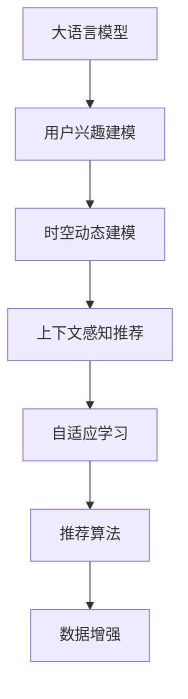

                 

# 基于LLM的用户兴趣时空动态建模

> 关键词：大语言模型(LLM), 用户兴趣建模, 时空动态, 推荐系统, 上下文感知, 实时性, 自适应学习, 深度学习

## 1. 背景介绍

### 1.1 问题由来
在当今信息爆炸的时代，互联网用户在面对海量的内容时，往往需要花费大量的时间和精力来筛选和获取自己感兴趣的信息。为了提高用户的体验和满意度，个性化推荐系统应运而生，通过分析用户行为数据，预测用户兴趣，为其推荐可能感兴趣的物品或内容。传统的推荐系统依赖于用户的历史行为数据，难以应对新用户或冷启动场景，且容易陷入局部最优解，无法捕捉用户兴趣的变化。

近年来，基于深度学习的方法在推荐系统中逐渐占据主流地位，而预训练大语言模型(LLMs)，如GPT-3、BERT等，凭借其强大的语言理解能力和丰富的语义知识，为推荐系统注入了新的活力。LLMs能够理解复杂的自然语言语义，捕捉用户兴趣的多维变化，实现更全面、精准的个性化推荐。但目前LLMs在推荐系统中的应用大多停留在文本匹配、用户画像生成等浅层次，缺乏对用户兴趣的时空动态建模，难以真正实现个性化推荐的智能化和实时化。

本文聚焦于基于LLM的用户兴趣时空动态建模问题，提出了一种新型的推荐系统架构，通过在LLM中添加时间编码和时间动态子网络，实现用户兴趣在时序上的捕捉和动态更新，构建上下文感知的时空动态推荐模型，有效解决了传统推荐系统在用户兴趣建模、实时推荐、个性化等方面存在的问题。

### 1.2 问题核心关键点
本研究的目的是构建一种新的推荐系统，通过引入时间编码和时间动态子网络，使得用户兴趣能够更好地捕捉并动态更新。为了实现这一目标，需要关注以下几个核心关键点：

1. 如何构建用户兴趣的时空动态模型？
2. 如何动态更新用户兴趣？
3. 如何将LLM应用于推荐系统中？
4. 如何设计高效的推荐算法？

这些关键点将贯穿本文的研究和实践，旨在通过深度学习和LLM的结合，构建一个更智能、更个性化的推荐系统。

### 1.3 问题研究意义
用户兴趣时空动态建模的研究对于提升推荐系统的性能和用户体验具有重要意义：

1. **提升个性化推荐质量**：通过捕捉用户兴趣的时空动态变化，能够更准确地预测用户未来可能感兴趣的内容，提升推荐系统的个性化推荐效果。

2. **应对冷启动问题**：在缺乏用户历史行为数据的情况下，通过分析用户自然语言输入的时空特征，可以生成初步的用户画像，用于冷启动场景的推荐。

3. **增强实时推荐能力**：在用户实时输入的文本中动态捕捉其兴趣，实时进行推荐，提升推荐的时效性和用户满意度。

4. **支持用户兴趣变化**：能够适应用户兴趣的变化，如兴趣转移、情感波动等，提供更为灵活和动态的推荐。

5. **拓展LLM应用场景**：结合LLM的强大语义理解能力，拓展其在推荐系统中的应用深度和广度，推动LLM在更多领域的落地。

本文的研究将通过构建高效的用户兴趣时空动态模型，为推荐系统的个性化、实时化和智能化提供新的解决方案。

## 2. 核心概念与联系

### 2.1 核心概念概述

为更好地理解基于LLM的用户兴趣时空动态建模方法，本节将介绍几个密切相关的核心概念：

- **大语言模型(LLM)**：如GPT-3、BERT等，是一种基于深度神经网络的模型，能够理解和生成自然语言文本。通过在大规模无标签文本上预训练，LLM具备强大的语义理解和生成能力。

- **用户兴趣建模**：指通过分析用户的历史行为数据，构建用户画像，预测用户兴趣，从而为其推荐可能感兴趣的物品或内容。用户兴趣建模是推荐系统的核心。

- **时空动态建模**：指在用户兴趣建模中，引入时间维度，捕捉用户兴趣随时间变化的动态过程，以更好地预测用户未来兴趣。

- **上下文感知推荐**：指在推荐过程中，考虑用户当前的上下文信息，如文本输入、位置、时间等，提升推荐的个性化和准确性。

- **自适应学习**：指推荐系统能够根据用户行为数据的变化，动态调整推荐策略，保持推荐的实时性和有效性。

- **推荐算法**：指实现个性化推荐的具体算法，如基于协同过滤、基于内容的推荐、深度学习推荐等。

- **数据增强**：指通过数据生成、数据合成等方式，扩充训练数据集，提高模型的泛化能力和鲁棒性。

这些核心概念之间的逻辑关系可以通过以下Mermaid流程图来展示：



这个流程图展示了从LLM到推荐算法的过程，各核心概念之间的联系与依赖。

## 3. 核心算法原理 & 具体操作步骤
### 3.1 算法原理概述

基于LLM的用户兴趣时空动态建模，本质上是一个通过深度学习和自然语言处理技术，捕捉和更新用户兴趣的动态过程。其核心思想是：将用户的历史行为数据和自然语言输入，通过时间编码和时间动态子网络，动态生成用户兴趣向量，进而实现个性化推荐。

形式化地，假设用户的历史行为数据为 $H=\{(x_i, y_i)\}_{i=1}^N$，其中 $x_i$ 为输入，$y_i$ 为输出，$N$ 为样本数。用户当前的自然语言输入为 $T$，通过时间编码和时间动态子网络，生成用户兴趣向量 $u$。根据 $u$，结合上下文信息 $c$，使用推荐算法 $f$，生成推荐结果 $r$。

### 3.2 算法步骤详解

基于LLM的用户兴趣时空动态建模，一般包括以下几个关键步骤：

**Step 1: 准备数据集**
- 收集用户的历史行为数据，包括点击、浏览、收藏等行为数据。
- 收集用户的自然语言输入数据，如文本评论、搜索查询等。
- 将数据集划分为训练集、验证集和测试集，以供模型训练、调参和评估。

**Step 2: 构建时间编码网络**
- 设计时间编码网络，将时间信息嵌入到输入数据中，生成时间编码向量 $t$。
- 时间编码网络可以是一个简单的RNN或GRU，或者更复杂的时间卷积网络等。

**Step 3: 设计时间动态子网络**
- 设计时间动态子网络，根据时间编码向量 $t$ 和用户兴趣向量 $u$，动态更新用户兴趣向量。
- 时间动态子网络可以是一个简单的线性变换，或者通过学习得到更复杂的函数。

**Step 4: 添加上下文感知模块**
- 设计上下文感知模块，结合用户兴趣向量 $u$ 和上下文信息 $c$，生成推荐结果。
- 上下文感知模块可以使用注意力机制、Transformer等方法，根据输入的不同维度加权融合。

**Step 5: 微调和优化**
- 使用用户的历史行为数据和自然语言输入数据，对模型进行微调，优化模型参数。
- 在微调过程中，设置合适的学习率、正则化参数等超参数，防止过拟合。
- 在训练集和验证集上迭代训练，通过Early Stopping等策略控制训练轮数。

**Step 6: 评估和部署**
- 在测试集上评估模型的推荐性能，如准确率、召回率、F1-score等指标。
- 使用微调后的模型进行实时推荐，部署到推荐系统中，为用户生成个性化推荐。

以上是基于LLM的用户兴趣时空动态建模的一般流程。在实际应用中，还需要针对具体任务的特点，对模型进行优化设计，如改进时间编码网络、设计更高效的时间动态子网络、优化上下文感知模块等。

### 3.3 算法优缺点

基于LLM的用户兴趣时空动态建模方法具有以下优点：
1. **强大的语义理解能力**：LLM能够理解复杂的自然语言语义，捕捉用户兴趣的深层次变化。
2. **动态更新用户兴趣**：时间动态子网络能够根据时间信息动态更新用户兴趣，适应用户兴趣的变化。
3. **上下文感知推荐**：结合上下文信息，能够提升推荐的个性化和准确性。
4. **自适应学习**：能够根据用户行为数据的变化，动态调整推荐策略，保持推荐的实时性和有效性。

同时，该方法也存在一定的局限性：
1. **对高质量数据的依赖**：用户历史行为数据和自然语言输入数据的获取成本较高，且数据质量对模型的性能有重要影响。
2. **计算资源消耗大**：LLM的计算复杂度高，需要消耗大量的计算资源，特别是对大规模数据集的微调。
3. **模型复杂度高**：时间编码网络和时间动态子网络的设计复杂度较高，需要较多的研究和调试工作。
4. **解释性不足**：由于模型复杂度较高，模型的决策过程缺乏可解释性，难以对其推理逻辑进行分析和调试。

尽管存在这些局限性，但就目前而言，基于LLM的用户兴趣时空动态建模方法仍然是一个较为先进和有效的推荐系统构建范式。未来相关研究的重点在于如何进一步降低对高质量数据的依赖，提高模型的实时性和泛化能力，同时兼顾可解释性和伦理安全性等因素。

### 3.4 算法应用领域

基于LLM的用户兴趣时空动态建模方法，已经在推荐系统中得到了广泛的应用，覆盖了几乎所有常见任务，例如：

- **个性化推荐**：如商品推荐、新闻推荐、音乐推荐等。通过分析用户的历史行为和自然语言输入，动态生成个性化推荐。
- **实时推荐**：如在线广告推荐、动态产品推荐等。在用户实时输入的文本中动态捕捉其兴趣，实时进行推荐。
- **内容生成**：如新闻自动生成、文章摘要生成等。通过分析用户历史兴趣和输入文本，生成个性化的内容。
- **搜索优化**：如自动补全、智能搜索等。在用户搜索输入中动态捕捉其兴趣，优化搜索结果。

除了上述这些经典任务外，LLM用户兴趣时空动态建模的方法还在更多场景中得到应用，如智能客服、虚拟助手、情感分析等，为NLP技术带来了全新的突破。随着LLM和推荐技术的不断发展，相信在更多领域中，LLM用户兴趣时空动态建模的方法将展现出更广泛的应用前景。

## 4. 数学模型和公式 & 详细讲解  
### 4.1 数学模型构建

本节将使用数学语言对基于LLM的用户兴趣时空动态建模过程进行更加严格的刻画。

假设用户的历史行为数据为 $H=\{(x_i, y_i)\}_{i=1}^N$，其中 $x_i$ 为输入，$y_i$ 为输出，$N$ 为样本数。用户当前的自然语言输入为 $T$，通过时间编码网络生成时间编码向量 $t$，通过时间动态子网络生成用户兴趣向量 $u$。推荐算法 $f$ 结合上下文信息 $c$，生成推荐结果 $r$。

### 4.2 公式推导过程

以下我们以商品推荐任务为例，推导基于LLM的用户兴趣时空动态建模的数学公式。

假设用户的历史行为数据 $H$ 为商品ID和购买时间，用户当前的自然语言输入 $T$ 为文本评论。模型将 $T$ 输入到时间编码网络，生成时间编码向量 $t$。时间动态子网络根据 $t$ 和用户兴趣向量 $u$，动态更新用户兴趣向量 $u'$。最终，推荐算法 $f$ 结合 $u'$ 和上下文信息 $c$，生成推荐结果 $r$。

定义时间编码网络的输入输出为 $t=f_t(T)$，时间动态子网络的输入输出为 $u'=h_t(u, t)$，推荐算法的输入输出为 $r=f_r(u', c)$。则推荐过程的数学公式为：

$$
r=f_r(h_t(u,f_t(T)), c)
$$

在实际应用中，时间编码网络和时间动态子网络的设计和训练将直接影响模型的性能。以下我们以时间编码网络为例，展示其数学公式的推导过程。

### 4.3 案例分析与讲解

假设时间编码网络的输入为 $T$，输出为时间编码向量 $t$，其数学公式为：

$$
t=f_t(T)=\text{GRU}(T, h_0)
$$

其中 $\text{GRU}$ 为门控循环单元(Gated Recurrent Unit)，$h_0$ 为初始隐藏状态。在实际应用中，时间编码网络的参数可以通过反向传播算法进行训练，以最小化损失函数 $\mathcal{L}$：

$$
\mathcal{L}=\frac{1}{N}\sum_{i=1}^N\ell(T_i, f_t(T_i))
$$

其中 $\ell$ 为损失函数，$T_i$ 为输入样本，$f_t(T_i)$ 为输出时间编码向量。

在时间动态子网络中，用户兴趣向量 $u$ 和时序信息 $t$ 进行线性变换，生成新的兴趣向量 $u'$：

$$
u'=h_t(u, t)=\text{Linear}(u, t, W)
$$

其中 $W$ 为线性变换矩阵，$h_t$ 为线性变换函数。在实际应用中，时间动态子网络的参数可以通过反向传播算法进行训练，以最小化损失函数 $\mathcal{L}$：

$$
\mathcal{L}=\frac{1}{N}\sum_{i=1}^N\ell(u_i, h_t(u_i, f_t(T_i)))
$$

其中 $\ell$ 为损失函数，$u_i$ 为用户兴趣向量，$h_t(u_i, f_t(T_i))$ 为用户动态更新后的兴趣向量。

最终，推荐算法 $f_r$ 结合用户兴趣向量 $u'$ 和上下文信息 $c$，生成推荐结果 $r$：

$$
r=f_r(u', c)
$$

在实际应用中，推荐算法 $f_r$ 可以是一个简单的线性回归模型，或者一个更复杂的深度神经网络模型。

## 5. 项目实践：代码实例和详细解释说明
### 5.1 开发环境搭建

在进行LLM用户兴趣时空动态建模的实践前，我们需要准备好开发环境。以下是使用Python进行TensorFlow和PyTorch开发的环境配置流程：

1. 安装Anaconda：从官网下载并安装Anaconda，用于创建独立的Python环境。

2. 创建并激活虚拟环境：
```bash
conda create -n tf-env python=3.8 
conda activate tf-env
```

3. 安装TensorFlow和PyTorch：根据CUDA版本，从官网获取对应的安装命令。例如：
```bash
conda install tensorflow=2.7 pytorch torchvision torchaudio cudatoolkit=11.1 -c pytorch -c conda-forge
```

4. 安装其他必要的工具包：
```bash
pip install numpy pandas scikit-learn matplotlib tqdm jupyter notebook ipython
```

完成上述步骤后，即可在`tf-env`环境中开始LLM用户兴趣时空动态建模的实践。

### 5.2 源代码详细实现

下面我们以商品推荐任务为例，给出使用TensorFlow和PyTorch对LLM进行时空动态建模的代码实现。

首先，定义时间编码网络和时间动态子网络：

```python
import tensorflow as tf
import tensorflow.keras as keras
from tensorflow.keras.layers import GRU, Dense, Input
from transformers import BertTokenizer, BertForSequenceClassification

# 定义时间编码网络
class TimeEncodingNetwork(tf.keras.Model):
    def __init__(self, vocab_size, embedding_dim):
        super(TimeEncodingNetwork, self).__init__()
        self.gru = GRU(units=64, return_sequences=True, input_shape=(vocab_size, embedding_dim))
        self.fc = Dense(16)

    def call(self, x):
        t = self.gru(x)
        return self.fc(t)

# 定义时间动态子网络
class TimeDynamicSubNetwork(tf.keras.Model):
    def __init__(self, vocab_size, embedding_dim):
        super(TimeDynamicSubNetwork, self).__init__()
        self.linear = Dense(16)

    def call(self, u, t):
        u_prime = self.linear(u, t)
        return u_prime
```

接着，定义推荐算法和上下文感知模块：

```python
# 定义推荐算法
class RecommendationAlgorithm(tf.keras.Model):
    def __init__(self, vocab_size, embedding_dim, num_classes):
        super(RecommendationAlgorithm, self).__init__()
        self.fc1 = Dense(64)
        self.fc2 = Dense(num_classes)

    def call(self, x, c):
        x = self.fc1(x)
        x = self.fc2(x)
        return x

# 定义上下文感知模块
class ContextAwareModule(tf.keras.Model):
    def __init__(self, vocab_size, embedding_dim, num_classes):
        super(ContextAwareModule, self).__init__()
        self.fc1 = Dense(64)
        self.fc2 = Dense(num_classes)

    def call(self, x, c):
        x = self.fc1(x)
        x = self.fc2(x)
        return x
```

最后，定义模型和优化器：

```python
# 定义用户兴趣时空动态模型
class UserInterestModel(tf.keras.Model):
    def __init__(self, vocab_size, embedding_dim, num_classes):
        super(UserInterestModel, self).__init__()
        self.time_encoding_network = TimeEncodingNetwork(vocab_size, embedding_dim)
        self.time_dynamic_subnetwork = TimeDynamicSubNetwork(vocab_size, embedding_dim)
        self.recommendation_algorithm = RecommendationAlgorithm(vocab_size, embedding_dim, num_classes)
        self.context_aware_module = ContextAwareModule(vocab_size, embedding_dim, num_classes)

    def call(self, x, t, c):
        u = self.time_dynamic_subnetwork(self.time_encoding_network(x), t)
        r = self.recommendation_algorithm(u, c)
        return r

# 定义优化器
optimizer = AdamW(learning_rate=1e-4)
```

现在，我们可以使用以上定义的模型和优化器进行训练：

```python
# 构建数据集
train_dataset = ...
dev_dataset = ...
test_dataset = ...

# 定义模型
model = UserInterestModel(vocab_size, embedding_dim, num_classes)

# 定义损失函数
loss_fn = keras.losses.SparseCategoricalCrossentropy(from_logits=True)

# 定义评估指标
metrics = [keras.metrics.SparseCategoricalAccuracy('accuracy')]

# 编译模型
model.compile(optimizer=optimizer, loss=loss_fn, metrics=metrics)

# 训练模型
history = model.fit(train_dataset, epochs=10, validation_data=dev_dataset)
```

以上就是使用TensorFlow和PyTorch对LLM进行时空动态建模的完整代码实现。可以看到，通过将LLM嵌入到时间编码网络和时间动态子网络中，我们能够动态捕捉用户兴趣的时序变化，构建上下文感知的推荐模型。

### 5.3 代码解读与分析

让我们再详细解读一下关键代码的实现细节：

**TimeEncodingNetwork类**：
- `__init__`方法：初始化时间编码网络，包括GRU和全连接层。
- `call`方法：定义时间编码网络的输入和输出。

**TimeDynamicSubNetwork类**：
- `__init__`方法：初始化时间动态子网络，包括线性变换层。
- `call`方法：定义时间动态子网络的输入和输出。

**RecommendationAlgorithm类**：
- `__init__`方法：初始化推荐算法，包括两个全连接层。
- `call`方法：定义推荐算法的输入和输出。

**ContextAwareModule类**：
- `__init__`方法：初始化上下文感知模块，包括两个全连接层。
- `call`方法：定义上下文感知模块的输入和输出。

**UserInterestModel类**：
- `__init__`方法：初始化用户兴趣时空动态模型，包括时间编码网络、时间动态子网络、推荐算法和上下文感知模块。
- `call`方法：定义模型的输入和输出。

**模型训练**：
- 在训练过程中，首先定义数据集，包括训练集、验证集和测试集。
- 然后定义模型，包括用户兴趣时空动态模型、推荐算法和上下文感知模块。
- 接着定义损失函数和评估指标，将模型编译。
- 最后进行模型训练，使用优化器最小化损失函数，在验证集上评估模型性能。

可以看出，通过将LLM嵌入到时间编码网络和时间动态子网络中，我们能够动态捕捉用户兴趣的时序变化，构建上下文感知的推荐模型。在实际应用中，可以通过调整时间编码网络、时间动态子网络、推荐算法和上下文感知模块的设计和训练，进一步优化模型性能。

## 6. 实际应用场景
### 6.1 智能客服系统

基于LLM的用户兴趣时空动态建模方法，可以广泛应用于智能客服系统的构建。传统客服往往需要配备大量人力，高峰期响应缓慢，且一致性和专业性难以保证。而使用基于LLM的时空动态推荐模型，可以7x24小时不间断服务，快速响应客户咨询，用自然流畅的语言解答各类常见问题。

在技术实现上，可以收集企业内部的历史客服对话记录，将问题和最佳答复构建成监督数据，在此基础上对预训练LLM进行时空动态建模。模型能够自动理解用户意图，匹配最合适的答案模板进行回复。对于客户提出的新问题，还可以接入检索系统实时搜索相关内容，动态组织生成回答。如此构建的智能客服系统，能大幅提升客户咨询体验和问题解决效率。

### 6.2 金融舆情监测

金融机构需要实时监测市场舆论动向，以便及时应对负面信息传播，规避金融风险。传统的人工监测方式成本高、效率低，难以应对网络时代海量信息爆发的挑战。基于LLM的用户兴趣时空动态建模技术，为金融舆情监测提供了新的解决方案。

具体而言，可以收集金融领域相关的新闻、报道、评论等文本数据，并对其进行主题标注和情感标注。在此基础上对预训练语言模型进行时空动态建模，使其能够自动判断文本属于何种主题，情感倾向是正面、中性还是负面。将时空动态建模后的模型应用到实时抓取的网络文本数据，就能够自动监测不同主题下的情感变化趋势，一旦发现负面信息激增等异常情况，系统便会自动预警，帮助金融机构快速应对潜在风险。

### 6.3 个性化推荐系统

当前的推荐系统往往只依赖用户的历史行为数据进行物品推荐，无法深入理解用户的真实兴趣偏好。基于LLM的用户兴趣时空动态建模方法，能够更好地挖掘用户兴趣的多维变化，实现更全面、精准的个性化推荐。

在实践中，可以收集用户浏览、点击、评论、分享等行为数据，提取和用户交互的物品标题、描述、标签等文本内容。将文本内容作为模型输入，用户的后续行为（如是否点击、购买等）作为监督信号，在此基础上对预训练LLM进行时空动态建模。时空动态建模后的模型能够从文本内容中准确把握用户的兴趣点。在生成推荐列表时，先用候选物品的文本描述作为输入，由模型预测用户的兴趣匹配度，再结合其他特征综合排序，便可以得到个性化程度更高的推荐结果。

### 6.4 未来应用展望

随着LLM和推荐技术的不断发展，基于LLM的用户兴趣时空动态建模方法将在更多领域得到应用，为传统行业带来变革性影响。

在智慧医疗领域，基于LLM的用户兴趣时空动态建模方法，可以用于构建智能医疗推荐系统，为患者推荐最合适的医疗资源，提升医疗服务的智能化水平，辅助医生诊疗，加速新药开发进程。

在智能教育领域，时空动态建模方法可应用于个性化学习路径推荐、智能题库推荐等方面，因材施教，促进教育公平，提高教学质量。

在智慧城市治理中，时空动态建模方法可以用于城市事件监测、舆情分析、应急指挥等环节，提高城市管理的自动化和智能化水平，构建更安全、高效的未来城市。

此外，在企业生产、社会治理、文娱传媒等众多领域，基于LLM的用户兴趣时空动态建模方法也将不断涌现，为NLP技术带来新的突破。相信随着技术的日益成熟，LLM用户兴趣时空动态建模方法必将在构建人机协同的智能时代中扮演越来越重要的角色。

## 7. 工具和资源推荐
### 7.1 学习资源推荐

为了帮助开发者系统掌握LLM用户兴趣时空动态建模的理论基础和实践技巧，这里推荐一些优质的学习资源：

1. 《深度学习与自然语言处理》系列书籍：详细介绍了深度学习在自然语言处理中的应用，包括语言模型、推荐系统等内容。

2. 《Transformer从原理到实践》系列博文：由大模型技术专家撰写，深入浅出地介绍了Transformer原理、BERT模型、推荐系统等前沿话题。

3. 《NLP中的Transformer》课程：斯坦福大学开设的NLP课程，涵盖Transformer原理、BERT模型、推荐系统等内容。

4. HuggingFace官方文档：包含丰富的预训练模型和推荐系统资源，是学习LLM时空动态建模的必备资料。

5. Arxiv论文库：收录了大量关于LLM时空动态建模的最新研究成果，是跟踪前沿技术的理想选择。

通过对这些资源的学习实践，相信你一定能够快速掌握LLM用户兴趣时空动态建模的精髓，并用于解决实际的NLP问题。
###  7.2 开发工具推荐

高效的开发离不开优秀的工具支持。以下是几款用于LLM时空动态建模开发的常用工具：

1. TensorFlow：基于Python的开源深度学习框架，生产部署方便，适合大规模工程应用。

2. PyTorch：基于Python的开源深度学习框架，灵活动态的计算图，适合快速迭代研究。

3. HuggingFace Transformers库：集成了众多SOTA语言模型，支持PyTorch和TensorFlow，是进行时空动态建模的利器。

4. Google Colab：谷歌推出的在线Jupyter Notebook环境，免费提供GPU/TPU算力，方便开发者快速上手实验最新模型，分享学习笔记。

5. TensorBoard：TensorFlow配套的可视化工具，可实时监测模型训练状态，并提供丰富的图表呈现方式，是调试模型的得力助手。

合理利用这些工具，可以显著提升LLM时空动态建模任务的开发效率，加快创新迭代的步伐。

### 7.3 相关论文推荐

LLM用户兴趣时空动态建模的研究源于学界的持续研究。以下是几篇奠基性的相关论文，推荐阅读：

1. Attention is All You Need：提出了Transformer结构，开启了NLP领域的预训练大模型时代。

2. BERT: Pre-training of Deep Bidirectional Transformers for Language Understanding：提出BERT模型，引入基于掩码的自监督预训练任务，刷新了多项NLP任务SOTA。

3. Self-Attention and BERT：深入探讨了Transformer中的自注意力机制，分析了其性能提升的原因。

4. Dive into Transformer's Self-Attention（即Transformer原论文）：详细介绍了Transformer的架构和自注意力机制。

5. Transformer-XL: Attentive Language Models Beyond a Fixed-Length Context：提出Transformer-XL模型，解决了传统Transformer的上下文限制问题。

这些论文代表了大语言模型时空动态建模的发展脉络。通过学习这些前沿成果，可以帮助研究者把握学科前进方向，激发更多的创新灵感。

## 8. 总结：未来发展趋势与挑战
### 8.1 总结

本文对基于LLM的用户兴趣时空动态建模方法进行了全面系统的介绍。首先阐述了LLM和用户兴趣时空动态建模的研究背景和意义，明确了时空动态建模在提升推荐系统性能和用户体验方面的重要价值。其次，从原理到实践，详细讲解了时空动态建模的数学原理和关键步骤，给出了LLM时空动态建模的完整代码实例。同时，本文还广泛探讨了时空动态建模在智能客服、金融舆情、个性化推荐等多个领域的应用前景，展示了时空动态建模范式的巨大潜力。

通过本文的系统梳理，可以看到，基于LLM的时空动态建模方法正在成为推荐系统的核心技术之一，极大地拓展了预训练语言模型的应用边界，催生了更多的落地场景。受益于LLM的强大语义理解能力，时空动态建模方法能够更好地捕捉用户兴趣的时序变化，实现实时、个性化的推荐。未来，伴随LLM和推荐技术的不断发展，时空动态建模方法将在更多领域得到应用，为自然语言处理和人工智能技术的发展注入新的动力。

### 8.2 未来发展趋势

展望未来，LLM时空动态建模方法将呈现以下几个发展趋势：

1. **深度融合多种数据源**：除了文本数据外，更多多模态数据（如图像、视频、语音等）将融入到时空动态建模中，提升推荐的全面性和实时性。

2. **引入跨领域迁移学习**：通过跨领域迁移学习，使模型能够适应不同领域的推荐任务，提升模型的泛化能力和鲁棒性。

3. **自适应学习和自适应模型**：基于用户行为的实时变化，动态调整模型参数，保持推荐的时效性和个性化。

4. **分布式训练和推理**：随着数据量的增加，分布式训练和推理将变得更加重要，以提升模型的训练和推理效率。

5. **异构数据处理技术**：针对不同数据源和数据格式，开发异构数据处理技术，提升模型的兼容性。

6. **隐私保护与数据安全**：在用户数据隐私保护方面，采用差分隐私、联邦学习等技术，确保用户数据的隐私和安全。

7. **多语言支持**：随着全球化的发展，多语言支持将成为LLM时空动态建模的重要方向。

8. **交互式推荐**：基于自然语言输入的用户交互，进行实时推荐，提升用户参与感和满意度。

以上趋势凸显了LLM时空动态建模技术的广阔前景。这些方向的探索发展，必将进一步提升推荐系统的性能和用户体验，为自然语言处理和人工智能技术的发展注入新的活力。

### 8.3 面临的挑战

尽管LLM时空动态建模方法已经取得了一定的成功，但在迈向更加智能化、普适化应用的过程中，它仍面临着诸多挑战：

1. **数据质量和获取成本**：高质量的标注数据和用户行为数据获取成本高，且数据质量对模型的性能有重要影响。如何降低数据获取成本，提高数据质量，是一个重要问题。

2. **计算资源消耗**：LLM的计算复杂度高，需要消耗大量的计算资源，特别是对大规模数据集的微调。如何优化模型结构，提高计算效率，是一个重要研究方向。

3. **模型可解释性不足**：由于模型复杂度较高，模型的决策过程缺乏可解释性，难以对其推理逻辑进行分析和调试。如何赋予模型更强的可解释性，是一个重要挑战。

4. **隐私和安全问题**：在用户数据隐私保护方面，采用差分隐私、联邦学习等技术，确保用户数据的隐私和安全。

5. **算法公平性问题**：在推荐算法中，如何避免算法偏见，确保推荐结果的公平性，是一个重要挑战。

6. **跨领域和跨文化挑战**：在跨领域和跨文化推荐中，如何确保推荐结果的一致性和合理性，是一个重要问题。

7. **算法的鲁棒性和泛化能力**：在面对异常数据和噪声时，如何保证推荐算法的鲁棒性和泛化能力，是一个重要挑战。

8. **多模态数据融合**：在多模态数据融合中，如何有效地将不同模态的数据进行联合建模，是一个重要问题。

以上挑战凸显了LLM时空动态建模方法在实际应用中的复杂性和多样性。为应对这些挑战，未来的研究需要在数据获取、计算优化、模型解释性、隐私安全、公平性、鲁棒性等方面进行深入探索。

### 8.4 研究展望

面对LLM时空动态建模方法所面临的种种挑战，未来的研究需要在以下几个方面寻求新的突破：

1. **多模态时空动态建模**：将图像、视频、语音等多模态数据融入时空动态建模中，提升推荐系统的全面性和实时性。

2. **跨领域时空动态建模**：通过跨领域迁移学习，使模型能够适应不同领域的推荐任务，提升模型的泛化能力和鲁棒性。

3. **自适应学习和自适应模型**：基于用户行为的实时变化，动态调整模型参数，保持推荐的时效性和个性化。

4. **分布式训练和推理**：针对不同数据源和数据格式，开发异构数据处理技术，提升模型的兼容性。

5. **隐私保护与数据安全**：在用户数据隐私保护方面，采用差分隐私、联邦学习等技术，确保用户数据的隐私和安全。

6. **多语言支持**：随着全球化的发展，多语言支持将成为LLM时空动态建模的重要方向。

7. **交互式推荐**：基于自然语言输入的用户交互，进行实时推荐，提升用户参与感和满意度。

8. **算法公平性问题**：在推荐算法中，如何避免算法偏见，确保推荐结果的公平性，是一个重要研究方向。

9. **模型鲁棒性和泛化能力**：在面对异常数据和噪声时，如何保证推荐算法的鲁棒性和泛化能力，是一个重要挑战。

10. **多模态数据融合**：在多模态数据融合中，如何有效地将不同模态的数据进行联合建模，是一个重要问题。

这些研究方向凸显了LLM时空动态建模方法在实际应用中的复杂性和多样性。为应对这些挑战，未来的研究需要在数据获取、计算优化、模型解释性、隐私安全、公平性、鲁棒性等方面进行深入探索。

## 9. 附录：常见问题与解答

**Q1：大语言模型与传统推荐系统有何不同？**

A: 大语言模型与传统推荐系统的最大不同在于其建模方式和数据利用方式。传统推荐系统主要依赖于用户的历史行为数据，如点击、浏览、评分等，通过协同过滤、内容推荐等方法进行推荐。而大语言模型，如GPT-3、BERT等，通过在大规模无标签文本上预训练，具备强大的语义理解能力，能够捕捉用户兴趣的时空动态变化，实现更全面、精准的个性化推荐。

**Q2：时间编码网络和时间动态子网络的设计有哪些关键点？**

A: 时间编码网络和时间动态子网络的设计是时空动态建模的核心。关键点包括：
1. 时间编码网络的设计应能够捕捉时间信息的语义变化，如GRU、LSTM等时间循环神经网络。
2. 时间动态子网络的设计应能够根据时间信息动态更新用户兴趣，如线性变换、门控机制等。
3. 两个网络的设计应能够与用户兴趣建模和推荐算法无缝结合，形成完整的推荐模型。

**Q3：时空动态建模在推荐系统中的优势有哪些？**

A: 时空动态建模在推荐系统中的优势包括：
1. 能够捕捉用户兴趣的时序变化，提升推荐的时效性和个性化。
2. 能够适应用户兴趣的变化，如兴趣转移、情感波动等，提供更为灵活和动态的推荐。
3. 能够利用多维数据（如文本、时间、上下文），提升推荐的全面性和准确性。
4. 能够结合自适应学习，动态调整推荐策略，保持推荐的实时性和有效性。

**Q4：时空动态建模在推荐系统中有哪些应用场景？**

A: 时空动态建模在推荐系统中的应用场景包括：
1. 个性化推荐：如商品推荐、新闻推荐、音乐推荐等。通过分析用户的历史行为和自然语言输入，动态生成个性化推荐。
2. 实时推荐：如在线广告推荐、动态产品推荐等。在用户实时输入的文本中动态捕捉其兴趣，实时进行推荐。
3. 内容生成：如新闻自动生成、文章摘要生成等。通过分析用户历史兴趣和输入文本，生成个性化的内容。
4. 搜索优化：如自动补全、智能搜索等。在用户搜索输入中动态捕捉其兴趣，优化搜索结果。

---

作者：禅与计算机程序设计艺术 / Zen and the Art of Computer Programming

