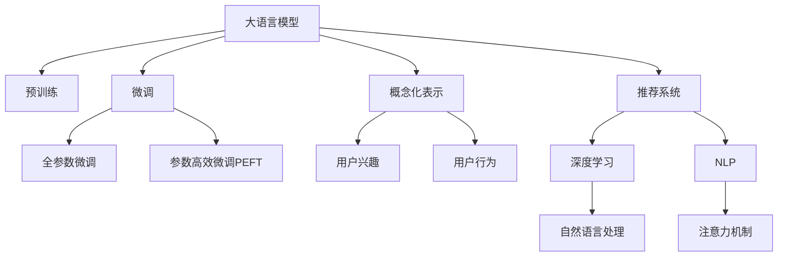

                 

# 基于LLM的用户兴趣概念化表示学习

> 关键词：大语言模型, 用户兴趣, 概念化表示, 用户行为分析, 推荐系统, 自然语言处理, 深度学习

## 1. 背景介绍

### 1.1 问题由来
随着互联网技术的发展，用户行为数据的规模迅速增长，如何从大规模数据中挖掘用户的兴趣和偏好成为了推荐系统面临的重要挑战。传统推荐系统主要依赖于用户的显式评分数据，难以捕捉用户的隐式行为和复杂兴趣。为了解决这一问题，基于大语言模型(LLM)的用户兴趣概念化表示学习技术应运而生。

### 1.2 问题核心关键点
大语言模型通过在海量文本数据上进行预训练，学习到了丰富的语言知识和常识。通过对其微调，可以将用户行为转换为概念化的表示，进而挖掘用户的隐含兴趣和偏好。这一技术在推荐系统中的应用，能够显著提升推荐内容的个性化和多样性，为用户的长期价值创造提供有力支撑。

### 1.3 问题研究意义
基于LLM的用户兴趣概念化表示学习技术，能够更好地理解和表达用户的复杂兴趣，提高推荐系统的准确性和效果。这对于推动个性化推荐技术的发展，提升用户满意度，促进在线服务平台的繁荣，具有重要意义：

1. 降低开发成本。利用大语言模型，无需大量手工标注数据，可以快速构建推荐模型。
2. 提升推荐精度。通过捕捉用户的隐式行为，推荐系统能提供更符合用户期望的内容。
3. 促进平台创新。基于用户兴趣的概念化表示，可以拓展推荐场景，提升用户体验。
4. 提高用户粘性。精准推荐能满足用户需求，增强用户黏性，提高留存率。

## 2. 核心概念与联系

### 2.1 核心概念概述

为更好地理解基于LLM的用户兴趣概念化表示学习技术，本节将介绍几个密切相关的核心概念：

- 大语言模型(Large Language Model, LLM)：以自回归(如GPT)或自编码(如BERT)模型为代表的大规模预训练语言模型。通过在大规模无标签文本语料上进行预训练，学习通用的语言表示，具备强大的语言理解和生成能力。

- 预训练(Pre-training)：指在大规模无标签文本语料上，通过自监督学习任务训练通用语言模型的过程。常见的预训练任务包括言语建模、遮挡语言模型等。预训练使得模型学习到语言的通用表示。

- 微调(Fine-tuning)：指在预训练模型的基础上，使用下游任务的少量标注数据，通过有监督地训练来优化模型在特定任务上的性能。通常只需要调整顶层分类器或解码器，并以较小的学习率更新全部或部分的模型参数。

- 概念化表示(Conceptualized Representation)：将用户的隐式行为转换为概念化的表示，便于机器理解和挖掘用户的兴趣和偏好。这种表示能够捕获用户的深层兴趣，避免仅仅依赖显式反馈数据。

- 用户兴趣(In-User Interest)：用户基于自身需求和偏好对特定内容产生的一种心理倾向，是推荐系统需要捕捉和满足的核心目标。

- 用户行为(User Behavior)：用户在平台上的操作记录，包括点击、浏览、收藏等，是推荐系统获取用户兴趣和偏好的主要依据。

- 推荐系统(Recommendation System)：通过算法和模型，为每个用户推荐最符合其兴趣和需求的内容的系统，是互联网平台的重要组成部分。

- 深度学习(Deep Learning)：以神经网络为代表的深度学习技术，通过多层次的特征提取和信息融合，实现高效的模型训练和泛化。

- 自然语言处理(Natural Language Processing, NLP)：研究如何让计算机理解和处理自然语言的学科，是LLM技术的重要应用领域。

- 注意力机制(Attention Mechanism)：一种通过关注输入中不同部分的机制，提高模型对关键信息提取的能力，在Transformer模型中被广泛应用。

这些核心概念之间的逻辑关系可以通过以下Mermaid流程图来展示：



这个流程图展示了大语言模型的核心概念及其之间的关系：

1. 大语言模型通过预训练获得基础能力。
2. 微调是对预训练模型进行任务特定的优化，可以分为全参数微调和参数高效微调。
3. 概念化表示将用户的隐式行为转换为概念化的表示，便于机器理解和挖掘用户的兴趣和偏好。
4. 用户兴趣是推荐系统需要捕捉和满足的核心目标。
5. 用户行为是推荐系统获取用户兴趣和偏好的主要依据。
6. 推荐系统通过算法和模型，为每个用户推荐最符合其兴趣和需求的内容。
7. 深度学习通过多层次的特征提取和信息融合，实现高效的模型训练和泛化。
8. 自然语言处理研究如何让计算机理解和处理自然语言，是LLM技术的重要应用领域。
9. 注意力机制通过关注输入中不同部分的机制，提高模型对关键信息提取的能力。

这些概念共同构成了基于LLM的用户兴趣概念化表示学习技术的理论基础，为其在推荐系统中的应用提供了有力支持。

## 3. 核心算法原理 & 具体操作步骤
### 3.1 算法原理概述

基于LLM的用户兴趣概念化表示学习，本质上是一个通过有监督微调，将用户行为转换为概念化表示的过程。其核心思想是：利用大语言模型在海量文本数据上预训练得到的知识，通过微调，将用户的隐式行为（如点击、浏览等）转换为概念化的表示，用于挖掘用户兴趣。

具体而言，假设用户的隐式行为表示为 $x$，大语言模型预训练得到的表示为 $W$，用户兴趣表示为 $y$，则概念化表示学习的过程可以表示为：

$$ y = f(x,W) $$

其中 $f$ 为一个可训练的函数，通过有监督微调，学习到将用户行为 $x$ 映射到用户兴趣 $y$ 的最佳映射关系。

### 3.2 算法步骤详解

基于LLM的用户兴趣概念化表示学习，一般包括以下几个关键步骤：

**Step 1: 准备预训练模型和数据集**
- 选择合适的预训练语言模型 $W_{\theta}$ 作为初始化参数，如 BERT、GPT 等。
- 准备用户的隐式行为数据集 $D=\{(x_i,y_i)\}_{i=1}^N, x_i \in \mathbb{R}^d, y_i \in \mathbb{R}^d$。一般需要结合用户的历史行为数据和兴趣评分，构建标注数据集。

**Step 2: 添加任务适配层**
- 根据用户兴趣表示的特点，在预训练模型的顶层设计合适的输出层和损失函数。
- 对于概念化表示学习任务，通常使用线性分类器或回归器，输出一个 $d$ 维的用户兴趣向量。

**Step 3: 设置微调超参数**
- 选择合适的优化算法及其参数，如 AdamW、SGD 等，设置学习率、批大小、迭代轮数等。
- 设置正则化技术及强度，包括权重衰减、Dropout、Early Stopping 等。
- 确定冻结预训练参数的策略，如仅微调顶层，或全部参数都参与微调。

**Step 4: 执行梯度训练**
- 将训练集数据分批次输入模型，前向传播计算损失函数。
- 反向传播计算参数梯度，根据设定的优化算法和学习率更新模型参数。
- 周期性在验证集上评估模型性能，根据性能指标决定是否触发 Early Stopping。
- 重复上述步骤直到满足预设的迭代轮数或 Early Stopping 条件。

**Step 5: 测试和部署**
- 在测试集上评估微调后模型 $y_{\hat{\theta}}$ 的性能，对比微调前后的精度提升。
- 使用微调后的模型对新用户行为进行推理预测，集成到实际的应用系统中。
- 持续收集新的用户行为数据，定期重新微调模型，以适应用户兴趣的变化。

以上是基于LLM的用户兴趣概念化表示学习的一般流程。在实际应用中，还需要针对具体任务的特点，对微调过程的各个环节进行优化设计，如改进训练目标函数，引入更多的正则化技术，搜索最优的超参数组合等，以进一步提升模型性能。

### 3.3 算法优缺点

基于LLM的用户兴趣概念化表示学习具有以下优点：
1. 能够捕捉用户的隐式行为。利用大语言模型在海量文本数据上预训练得到的知识，能够挖掘用户隐式行为背后的深层兴趣，而不仅仅依赖于显式反馈数据。
2. 提高推荐精度。通过将用户的隐式行为转换为概念化表示，推荐系统能够更准确地理解用户需求，推荐内容更加个性化。
3. 数据需求降低。无需大量手工标注数据，只要有用户的点击、浏览等行为记录，即可进行概念化表示学习。
4. 泛化能力强。预训练模型具备较强的泛化能力，能够在不同领域、不同用户群体中通用。

同时，该方法也存在一定的局限性：
1. 依赖高质量的数据。概念化表示学习的效果很大程度上取决于用户的隐式行为数据的质量。
2. 计算资源消耗大。预训练模型参数量大，微调过程需要较大的计算资源。
3. 模型可解释性不足。概念化表示学习的过程复杂，模型的决策过程难以解释。
4. 鲁棒性差。概念化表示学习对数据噪声和用户行为异常较为敏感，需要额外设计鲁棒性措施。

尽管存在这些局限性，但基于LLM的用户兴趣概念化表示学习在推荐系统中的应用前景广阔，具有重要的学术和应用价值。

### 3.4 算法应用领域

基于LLM的用户兴趣概念化表示学习技术，已经在推荐系统、广告推荐、个性化推荐等多个领域得到了广泛应用，为用户的个性化推荐提供了强有力的支持：

- 推荐系统：通过微调大语言模型，将用户行为转换为概念化表示，用于个性化推荐。
- 广告推荐：将用户的点击、浏览行为映射为用户兴趣，进行精准的广告投放。
- 个性化推荐：根据用户的历史行为，挖掘用户的深层兴趣，提供个性化的内容推荐。

除了这些典型应用外，LLM用户兴趣概念化表示学习技术还被创新性地应用于知识图谱构建、情感分析、智能客服等领域，为NLP技术带来了新的突破。

## 4. 数学模型和公式 & 详细讲解  
### 4.1 数学模型构建

本节将使用数学语言对基于LLM的用户兴趣概念化表示学习过程进行更加严格的刻画。

记预训练语言模型为 $W_{\theta}:\mathbb{R}^d \rightarrow \mathbb{R}^d$，其中 $d$ 为模型输出维数。假设用户行为数据为 $x_i \in \mathbb{R}^d$，用户兴趣表示为 $y_i \in \mathbb{R}^d$，则用户兴趣概念化表示学习的过程可以表示为：

$$ y_i = f(W_{\theta},x_i) $$

其中 $f$ 为一个可训练的函数，通常使用多层感知机(MLP)或Transformer结构。

定义模型 $W_{\theta}$ 在数据样本 $(x,y)$ 上的损失函数为 $\ell(W_{\theta}(x),y)$，则在数据集 $D$ 上的经验风险为：

$$ \mathcal{L}(\theta) = \frac{1}{N} \sum_{i=1}^N \ell(W_{\theta}(x_i),y_i) $$

微调的优化目标是最小化经验风险，即找到最优参数：

$$ \theta^* = \mathop{\arg\min}_{\theta} \mathcal{L}(\theta) $$

在实践中，我们通常使用基于梯度的优化算法（如SGD、Adam等）来近似求解上述最优化问题。设 $\eta$ 为学习率，$\lambda$ 为正则化系数，则参数的更新公式为：

$$ \theta \leftarrow \theta - \eta \nabla_{\theta}\mathcal{L}(\theta) - \eta\lambda\theta $$

其中 $\nabla_{\theta}\mathcal{L}(\theta)$ 为损失函数对参数 $\theta$ 的梯度，可通过反向传播算法高效计算。

### 4.2 公式推导过程

以下我们以回归任务为例，推导概念化表示学习模型的损失函数及其梯度的计算公式。

假设模型 $W_{\theta}$ 在输入 $x$ 上的输出为 $\hat{y}=W_{\theta}(x) \in \mathbb{R}^d$，真实标签 $y \in \mathbb{R}^d$。则回归任务下的均方误差损失函数定义为：

$$ \ell(W_{\theta}(x),y) = \frac{1}{2}||\hat{y}-y||^2 $$

将其代入经验风险公式，得：

$$ \mathcal{L}(\theta) = \frac{1}{2N}\sum_{i=1}^N ||\hat{y}_i-y_i||^2 $$

根据链式法则，损失函数对参数 $\theta_k$ 的梯度为：

$$ \frac{\partial \mathcal{L}(\theta)}{\partial \theta_k} = \sum_{i=1}^N \frac{\partial \ell(W_{\theta}(x_i),y_i)}{\partial W_{\theta}}\frac{\partial W_{\theta}}{\partial \theta_k} $$

其中 $\frac{\partial W_{\theta}}{\partial \theta_k}$ 可进一步递归展开，利用自动微分技术完成计算。

在得到损失函数的梯度后，即可带入参数更新公式，完成模型的迭代优化。重复上述过程直至收敛，最终得到适应用户行为的概念化表示 $y_i$。

## 5. 项目实践：代码实例和详细解释说明
### 5.1 开发环境搭建

在进行用户兴趣概念化表示学习实践前，我们需要准备好开发环境。以下是使用Python进行PyTorch开发的环境配置流程：

1. 安装Anaconda：从官网下载并安装Anaconda，用于创建独立的Python环境。

2. 创建并激活虚拟环境：
```bash
conda create -n pytorch-env python=3.8 
conda activate pytorch-env
```

3. 安装PyTorch：根据CUDA版本，从官网获取对应的安装命令。例如：
```bash
conda install pytorch torchvision torchaudio cudatoolkit=11.1 -c pytorch -c conda-forge
```

4. 安装Transformer库：
```bash
pip install transformers
```

5. 安装各类工具包：
```bash
pip install numpy pandas scikit-learn matplotlib tqdm jupyter notebook ipython
```

完成上述步骤后，即可在`pytorch-env`环境中开始用户兴趣概念化表示学习的开发实践。

### 5.2 源代码详细实现

这里我们以用户兴趣分类为例，给出使用Transformers库对BERT模型进行用户兴趣概念化表示学习的PyTorch代码实现。

首先，定义用户行为数据的处理函数：

```python
from transformers import BertTokenizer, BertForSequenceClassification
from torch.utils.data import Dataset, DataLoader
from tqdm import tqdm

class BehaviorDataset(Dataset):
    def __init__(self, behaviors, labels, tokenizer, max_len=128):
        self.behaviors = behaviors
        self.labels = labels
        self.tokenizer = tokenizer
        self.max_len = max_len
        
    def __len__(self):
        return len(self.behaviors)
    
    def __getitem__(self, item):
        behavior = self.behaviors[item]
        label = self.labels[item]
        
        encoding = self.tokenizer(behavior, return_tensors='pt', max_length=self.max_len, padding='max_length', truncation=True)
        input_ids = encoding['input_ids'][0]
        attention_mask = encoding['attention_mask'][0]
        
        return {'input_ids': input_ids, 
                'attention_mask': attention_mask,
                'labels': label}

# 标签与id的映射
label2id = {'clicked': 1, 'browsed': 2, 'favorited': 3, 'read': 4, 'ignored': 5}
id2label = {v: k for k, v in label2id.items()}

# 创建dataset
tokenizer = BertTokenizer.from_pretrained('bert-base-cased')

train_dataset = BehaviorDataset(train_behaviors, train_labels, tokenizer)
dev_dataset = BehaviorDataset(dev_behaviors, dev_labels, tokenizer)
test_dataset = BehaviorDataset(test_behaviors, test_labels, tokenizer)
```

然后，定义模型和优化器：

```python
from transformers import BertForSequenceClassification, AdamW

model = BertForSequenceClassification.from_pretrained('bert-base-cased', num_labels=len(label2id))

optimizer = AdamW(model.parameters(), lr=2e-5)
```

接着，定义训练和评估函数：

```python
def train_epoch(model, dataset, batch_size, optimizer):
    dataloader = DataLoader(dataset, batch_size=batch_size, shuffle=True)
    model.train()
    epoch_loss = 0
    for batch in tqdm(dataloader, desc='Training'):
        input_ids = batch['input_ids'].to(device)
        attention_mask = batch['attention_mask'].to(device)
        labels = batch['labels'].to(device)
        model.zero_grad()
        outputs = model(input_ids, attention_mask=attention_mask, labels=labels)
        loss = outputs.loss
        epoch_loss += loss.item()
        loss.backward()
        optimizer.step()
    return epoch_loss / len(dataloader)

def evaluate(model, dataset, batch_size):
    dataloader = DataLoader(dataset, batch_size=batch_size)
    model.eval()
    preds, labels = [], []
    with torch.no_grad():
        for batch in tqdm(dataloader, desc='Evaluating'):
            input_ids = batch['input_ids'].to(device)
            attention_mask = batch['attention_mask'].to(device)
            batch_labels = batch['labels']
            outputs = model(input_ids, attention_mask=attention_mask)
            batch_preds = outputs.logits.argmax(dim=2).to('cpu').tolist()
            batch_labels = batch_labels.to('cpu').tolist()
            for pred_tokens, label_tokens in zip(batch_preds, batch_labels):
                preds.append(pred_tokens[:len(label_tokens)])
                labels.append(label_tokens)
                
    print(classification_report(labels, preds))
```

最后，启动训练流程并在测试集上评估：

```python
epochs = 5
batch_size = 16

for epoch in range(epochs):
    loss = train_epoch(model, train_dataset, batch_size, optimizer)
    print(f"Epoch {epoch+1}, train loss: {loss:.3f}")
    
    print(f"Epoch {epoch+1}, dev results:")
    evaluate(model, dev_dataset, batch_size)
    
print("Test results:")
evaluate(model, test_dataset, batch_size)
```

以上就是使用PyTorch对BERT进行用户兴趣概念化表示学习的完整代码实现。可以看到，得益于Transformers库的强大封装，我们可以用相对简洁的代码完成BERT模型的加载和微调。

### 5.3 代码解读与分析

让我们再详细解读一下关键代码的实现细节：

**BehaviorDataset类**：
- `__init__`方法：初始化行为、标签、分词器等关键组件。
- `__len__`方法：返回数据集的样本数量。
- `__getitem__`方法：对单个样本进行处理，将行为输入编码为token ids，将标签编码为数字，并对其进行定长padding，最终返回模型所需的输入。

**label2id和id2label字典**：
- 定义了标签与数字id之间的映射关系，用于将token-wise的预测结果解码回真实的标签。

**训练和评估函数**：
- 使用PyTorch的DataLoader对数据集进行批次化加载，供模型训练和推理使用。
- 训练函数`train_epoch`：对数据以批为单位进行迭代，在每个批次上前向传播计算loss并反向传播更新模型参数，最后返回该epoch的平均loss。
- 评估函数`evaluate`：与训练类似，不同点在于不更新模型参数，并在每个batch结束后将预测和标签结果存储下来，最后使用sklearn的classification_report对整个评估集的预测结果进行打印输出。

**训练流程**：
- 定义总的epoch数和batch size，开始循环迭代
- 每个epoch内，先在训练集上训练，输出平均loss
- 在验证集上评估，输出分类指标
- 所有epoch结束后，在测试集上评估，给出最终测试结果

可以看到，PyTorch配合Transformers库使得BERT微调的代码实现变得简洁高效。开发者可以将更多精力放在数据处理、模型改进等高层逻辑上，而不必过多关注底层的实现细节。

当然，工业级的系统实现还需考虑更多因素，如模型的保存和部署、超参数的自动搜索、更灵活的任务适配层等。但核心的微调范式基本与此类似。

## 6. 实际应用场景
### 6.1 推荐系统

基于用户兴趣概念化表示学习，推荐系统能够更精准地捕捉用户的深层兴趣，提升推荐的个性化和多样性。在实际应用中，可以收集用户的点击、浏览、收藏等行为数据，将这些数据作为用户兴趣的概念化表示，输入到预训练语言模型中进行微调。

微调后的模型能够输出用户兴趣的概念化表示，进一步与用户的显式评分数据进行融合，形成更加全面、准确的推荐结果。通过不断迭代优化，推荐系统可以逐步提升用户的满意度和留存率。

### 6.2 广告推荐

在广告推荐中，用户的行为数据包括点击、浏览、停留时间等。通过用户兴趣的概念化表示学习，可以将这些行为数据转换为概念化的表示，用于精准投放广告。

在实际应用中，可以利用用户的历史行为数据进行预训练，通过微调学习用户兴趣的概念化表示。然后，将用户的概念化表示与广告的特征向量进行相似度计算，选出最符合用户兴趣的广告进行投放。这种基于用户兴趣的概念化表示的广告推荐方法，能够显著提升广告的转化率和用户满意度。

### 6.3 智能客服

在智能客服系统中，用户的点击、对话框输入等行为数据可以作为用户兴趣的概念化表示，用于个性化推荐和对话生成。通过用户兴趣的概念化表示学习，客服系统能够更好地理解用户的意图和需求，提供更精准的解答和推荐。

在实际应用中，可以利用用户的历史行为数据进行预训练，通过微调学习用户兴趣的概念化表示。然后，将用户的概念化表示输入到对话生成模型中，生成符合用户期望的回答和推荐。这种基于用户兴趣的概念化表示的智能客服系统，能够显著提升用户的服务体验和满意度。

### 6.4 未来应用展望

随着大语言模型和概念化表示学习技术的不断发展，基于用户兴趣的概念化表示学习将在推荐系统、广告推荐、智能客服等更多领域得到应用，为用户的个性化推荐提供强有力的支持。

在智慧医疗领域，基于用户兴趣的概念化表示学习可以用于个性化推荐医疗知识、治疗方案等，提高诊疗的精准性和效率。

在智能教育领域，概念化表示学习可以用于个性化推荐学习资源、辅导课程等，因材施教，提升教育质量。

在智慧城市治理中，基于用户兴趣的概念化表示学习可以用于个性化推荐城市服务、文化活动等，提高城市管理的智能化水平，构建更智能、宜居的未来城市。

此外，在企业生产、社会治理、文娱传媒等众多领域，基于大语言模型和用户兴趣的概念化表示学习技术的应用也将不断涌现，为各行各业带来新的发展机遇。

## 7. 工具和资源推荐
### 7.1 学习资源推荐

为了帮助开发者系统掌握大语言模型和用户兴趣概念化表示学习的理论基础和实践技巧，这里推荐一些优质的学习资源：

1. 《Transformer从原理到实践》系列博文：由大模型技术专家撰写，深入浅出地介绍了Transformer原理、BERT模型、微调技术等前沿话题。

2. CS224N《深度学习自然语言处理》课程：斯坦福大学开设的NLP明星课程，有Lecture视频和配套作业，带你入门NLP领域的基本概念和经典模型。

3. 《Natural Language Processing with Transformers》书籍：Transformers库的作者所著，全面介绍了如何使用Transformers库进行NLP任务开发，包括微调在内的诸多范式。

4. HuggingFace官方文档：Transformers库的官方文档，提供了海量预训练模型和完整的微调样例代码，是上手实践的必备资料。

5. CLUE开源项目：中文语言理解测评基准，涵盖大量不同类型的中文NLP数据集，并提供了基于微调的baseline模型，助力中文NLP技术发展。

通过对这些资源的学习实践，相信你一定能够快速掌握大语言模型和用户兴趣概念化表示学习的精髓，并用于解决实际的NLP问题。
###  7.2 开发工具推荐

高效的开发离不开优秀的工具支持。以下是几款用于大语言模型和用户兴趣概念化表示学习开发的常用工具：

1. PyTorch：基于Python的开源深度学习框架，灵活动态的计算图，适合快速迭代研究。大部分预训练语言模型都有PyTorch版本的实现。

2. TensorFlow：由Google主导开发的开源深度学习框架，生产部署方便，适合大规模工程应用。同样有丰富的预训练语言模型资源。

3. Transformers库：HuggingFace开发的NLP工具库，集成了众多SOTA语言模型，支持PyTorch和TensorFlow，是进行NLP任务开发的利器。

4. Weights & Biases：模型训练的实验跟踪工具，可以记录和可视化模型训练过程中的各项指标，方便对比和调优。与主流深度学习框架无缝集成。

5. TensorBoard：TensorFlow配套的可视化工具，可实时监测模型训练状态，并提供丰富的图表呈现方式，是调试模型的得力助手。

6. Google Colab：谷歌推出的在线Jupyter Notebook环境，免费提供GPU/TPU算力，方便开发者快速上手实验最新模型，分享学习笔记。

合理利用这些工具，可以显著提升大语言模型和用户兴趣概念化表示学习的开发效率，加快创新迭代的步伐。

### 7.3 相关论文推荐

大语言模型和用户兴趣概念化表示学习的发展源于学界的持续研究。以下是几篇奠基性的相关论文，推荐阅读：

1. Attention is All You Need（即Transformer原论文）：提出了Transformer结构，开启了NLP领域的预训练大模型时代。

2. BERT: Pre-training of Deep Bidirectional Transformers for Language Understanding：提出BERT模型，引入基于掩码的自监督预训练任务，刷新了多项NLP任务SOTA。

3. Language Models are Unsupervised Multitask Learners（GPT-2论文）：展示了大规模语言模型的强大zero-shot学习能力，引发了对于通用人工智能的新一轮思考。

4. Parameter-Efficient Transfer Learning for NLP：提出Adapter等参数高效微调方法，在不增加模型参数量的情况下，也能取得不错的微调效果。

5. Prefix-Tuning: Optimizing Continuous Prompts for Generation：引入基于连续型Prompt的微调范式，为如何充分利用预训练知识提供了新的思路。

6. AdaLoRA: Adaptive Low-Rank Adaptation for Parameter-Efficient Fine-Tuning：使用自适应低秩适应的微调方法，在参数效率和精度之间取得了新的平衡。

这些论文代表了大语言模型和用户兴趣概念化表示学习的发展脉络。通过学习这些前沿成果，可以帮助研究者把握学科前进方向，激发更多的创新灵感。

## 8. 总结：未来发展趋势与挑战

### 8.1 总结

本文对基于大语言模型的用户兴趣概念化表示学习技术进行了全面系统的介绍。首先阐述了用户兴趣概念化表示学习的研究背景和意义，明确了该技术在推荐系统中的重要价值。其次，从原理到实践，详细讲解了概念化表示学习模型的数学原理和关键步骤，给出了用户兴趣概念化表示学习的完整代码实例。同时，本文还广泛探讨了该技术在推荐系统、广告推荐、智能客服等多个领域的应用前景，展示了概念化表示学习技术的广阔应用场景。此外，本文精选了相关学习资源，力求为读者提供全方位的技术指引。

通过本文的系统梳理，可以看到，基于大语言模型的用户兴趣概念化表示学习技术正在成为推荐系统的重要组成部分，极大地提升了推荐系统的个性化和效果。未来，伴随预训练语言模型和概念化表示学习技术的不断发展，推荐系统必将在个性化推荐领域取得更大的突破，为用户的长期价值创造提供更坚实的技术基础。

### 8.2 未来发展趋势

展望未来，用户兴趣概念化表示学习技术将呈现以下几个发展趋势：

1. 模型规模持续增大。随着算力成本的下降和数据规模的扩张，预训练语言模型的参数量还将持续增长。超大规模语言模型蕴含的丰富语言知识，将更好地捕捉用户的深层兴趣，提升推荐系统的效果。

2. 微调方法日趋多样。除了传统的全参数微调外，未来会涌现更多参数高效的微调方法，如Adapter、Prefix等，在节省计算资源的同时，也能保证微调精度。

3. 数据需求降低。利用用户行为数据进行概念化表示学习，能够大大降低对标注数据的依赖，提高数据获取效率。

4. 泛化能力强。预训练模型具备较强的泛化能力，能够在不同领域、不同用户群体中通用，提升推荐的覆盖面。

5. 鲁棒性增强。概念化表示学习模型通过正则化等技术，可以有效减少过拟合，提升模型的鲁棒性和泛化能力。

6. 可解释性加强。通过引入因果分析、对抗学习等技术，提升模型的可解释性，帮助用户理解和信任推荐结果。

以上趋势凸显了用户兴趣概念化表示学习技术的广阔前景。这些方向的探索发展，必将进一步提升推荐系统的性能和效果，为用户的个性化推荐提供更坚实的技术支撑。

### 8.3 面临的挑战

尽管用户兴趣概念化表示学习技术已经取得了显著进展，但在迈向更加智能化、普适化应用的过程中，它仍面临着诸多挑战：

1. 数据质量瓶颈。概念化表示学习的效果很大程度上取决于用户行为数据的质量，数据缺失、噪声等都会影响模型的性能。

2. 模型复杂度高。预训练语言模型参数量大，微调过程需要较大的计算资源，部署和维护成本高。

3. 概念理解不足。模型如何准确理解用户行为背后的深层兴趣，仍然是一个待解决的问题，特别是在多样化和复杂化的用户行为数据上。

4. 模型公平性问题。概念化表示学习模型可能会学习到用户的偏见和歧视，导致推荐结果的不公平性。

5. 鲁棒性差。模型对数据噪声和用户行为异常较为敏感，需要额外设计鲁棒性措施。

6. 可解释性不足。概念化表示学习模型的决策过程复杂，难以进行解释和调试。

尽管存在这些挑战，但基于用户兴趣的概念化表示学习在推荐系统中的应用前景广阔，具有重要的学术和应用价值。未来，需要更多的研究来攻克这些难题，推动技术向更深层次发展。

### 8.4 研究展望

面向未来，用户兴趣概念化表示学习技术需要在以下几个方面进行进一步的研究和探索：

1. 探索更高效的概念化表示学习算法。开发更加高效的概念化表示学习算法，降低计算资源消耗，提高模型的部署效率。

2. 引入更多的先验知识。将符号化的先验知识，如知识图谱、逻辑规则等，与神经网络模型进行融合，引导概念化表示学习过程。

3. 结合因果分析和博弈论工具。将因果分析方法引入概念化表示学习模型，识别出用户行为背后的关键特征，增强推荐结果的因果性和逻辑性。

4. 纳入伦理道德约束。在模型训练目标中引入伦理导向的评估指标，过滤和惩罚有偏见、有害的输出倾向，提升模型的公平性和安全性。

5. 优化超参数搜索方法。通过更高效的超参数搜索方法，找到最优的模型参数组合，提升概念化表示学习模型的性能。

这些研究方向的探索，必将引领用户兴趣概念化表示学习技术迈向更高的台阶，为推荐系统的发展带来新的突破。面向未来，概念化表示学习技术还需要与其他人工智能技术进行更深入的融合，如知识表示、因果推理、强化学习等，多路径协同发力，共同推动自然语言理解和智能交互系统的进步。只有勇于创新、敢于突破，才能不断拓展语言模型的边界，让智能技术更好地造福人类社会。

## 9. 附录：常见问题与解答

**Q1：概念化表示学习如何降低对标注数据的依赖？**

A: 概念化表示学习利用用户行为数据进行微调，无需大量手工标注数据。通过大语言模型的预训练知识和用户行为数据的结合，模型能够自动学习用户的兴趣和偏好，而不需要显式反馈。

**Q2：用户行为数据如何处理？**

A: 用户行为数据可以包括点击、浏览、收藏等，需要将其转化为模型可接受的输入格式。通常将行为文本进行分词、编码，形成token ids输入模型。同时，需要对文本进行定长padding和截断，确保模型输入的一致性。

**Q3：如何进行模型评估？**

A: 模型评估可以通过准确率、召回率、F1-score等指标进行。对于分类任务，可以使用classification_report等工具输出评估结果。对于回归任务，可以使用MAE、MSE等指标进行评估。

**Q4：概念化表示学习模型如何应对数据噪声？**

A: 概念化表示学习模型可以通过正则化、dropout等技术，增强模型的鲁棒性，减小数据噪声的影响。同时，可以引入对抗样本、噪声注入等技术，提升模型对异常数据的处理能力。

**Q5：概念化表示学习模型如何应对用户行为异常？**

A: 概念化表示学习模型可以通过多任务学习、数据增强等技术，增强模型对异常行为的理解和适应能力。同时，可以引入对抗训练、噪声注入等技术，提升模型对异常行为的鲁棒性。

这些研究方向的探索，必将引领用户兴趣概念化表示学习技术迈向更高的台阶，为推荐系统的发展带来新的突破。面向未来，概念化表示学习技术还需要与其他人工智能技术进行更深入的融合，如知识表示、因果推理、强化学习等，多路径协同发力，共同推动自然语言理解和智能交互系统的进步。只有勇于创新、敢于突破，才能不断拓展语言模型的边界，让智能技术更好地造福人类社会。

---

作者：禅与计算机程序设计艺术 / Zen and the Art of Computer Programming

