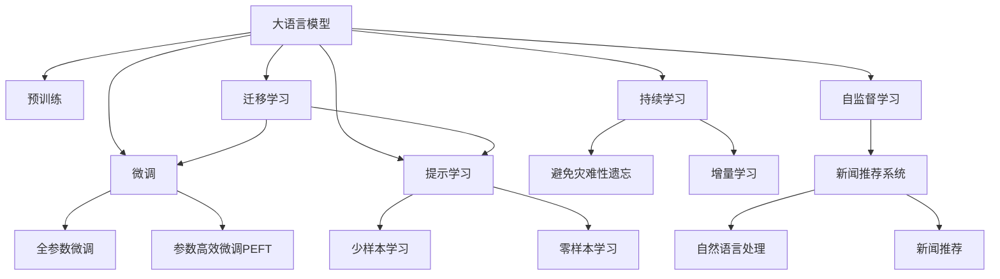

                 

## 1. 背景介绍

### 1.1 问题由来
新闻推荐系统是互联网媒体和内容聚合平台的重要组成部分，旨在通过智能算法为用户提供个性化的新闻推荐服务。随着信息爆炸，用户希望在海量新闻中快速找到感兴趣的内容，但传统基于规则或内容标签的推荐方式难以满足个性化需求。

因此，需要一种能够深度理解用户兴趣，自动生成个性化新闻推荐的方法。深度学习特别是基于大语言模型的推荐技术逐渐成为新的研究热点。其中，Prompt Learning技术通过精心设计输入模板，引导大模型生成更精准的推荐结果，显著提升了新闻推荐系统的表现。

### 1.2 问题核心关键点
Prompt Learning的核心在于设计合适的输入格式，使大语言模型能准确地理解用户意图和文本语义，从而生成高质量的推荐结果。其基本流程如下：
1. 定义输入模板，通常包含用户ID、用户兴趣描述、历史浏览记录等。
2. 将输入模板与用户兴趣、文章标题等信息进行拼接，生成新的输入数据。
3. 输入新的数据到预训练大模型，通过生成式推理得到推荐结果。
4. 根据生成的推荐结果和用户点击数据，进行模型优化和参数更新。

通过这种方式，大模型能够利用其强大的语言理解能力，生成符合用户个性化需求的新闻推荐。

### 1.3 问题研究意义
Prompt Learning技术不仅提升了新闻推荐系统的精准度和个性化水平，还降低了系统的开发和维护成本，使得新闻推荐系统能够更快速、高效地上线和迭代优化。同时，通过不断优化Prompt模板，大模型可以逐渐学习到更多的领域知识，增强系统的泛化能力。

## 2. 核心概念与联系

### 2.1 核心概念概述

为更好地理解基于Prompt Learning的新闻推荐方法，本节将介绍几个密切相关的核心概念：

- **大语言模型(Large Language Model, LLM)**：以自回归(如GPT)或自编码(如BERT)模型为代表的大规模预训练语言模型。通过在大规模无标签文本语料上进行预训练，学习通用的语言表示，具备强大的语言理解和生成能力。

- **Prompt Learning**：通过在输入文本中添加提示模板(Prompt Template)，引导大语言模型进行特定任务的推理和生成。可以在不更新模型参数的情况下，实现零样本或少样本学习。

- **新闻推荐系统(News Recommendation System)**：通过分析用户的历史行为数据，利用机器学习模型推荐用户可能感兴趣的新闻。目标是提升用户点击率和满意度，增加平台的用户粘性。

- **自然语言处理(Natural Language Processing, NLP)**：涉及语言模型的构建、文本分析、语言生成等领域的综合技术，是新闻推荐系统中常用的核心技术之一。

- **自监督学习(Self-Supervised Learning)**：利用无标签数据进行训练，通过构建预训练任务来学习语言模型。广泛应用于大语言模型的预训练中。

- **迁移学习(Transfer Learning)**：将一个领域学习到的知识，迁移应用到另一个不同但相关的领域的学习范式。大模型的预训练-微调过程即是一种典型的迁移学习方式。

- **可解释性(Explainability)**：指模型的决策过程可以被人类理解和解释，是机器学习模型的重要评价指标。

- **对抗样本(Adversarial Examples)**：为误导模型而故意构造的输入数据，通常用于测试模型的鲁棒性。

这些核心概念之间的逻辑关系可以通过以下Mermaid流程图来展示：



这个流程图展示了大语言模型的核心概念及其之间的关系：

1. 大语言模型通过预训练获得基础能力。
2. 微调是对预训练模型进行任务特定的优化，可以分为全参数微调和参数高效微调（PEFT）。
3. 提示学习是一种不更新模型参数的方法，可以实现少样本学习和零样本学习。
4. 迁移学习是连接预训练模型与下游任务的桥梁，可以通过微调或提示学习来实现。
5. 可解释性是模型性能的一个重要指标，促进了模型应用的可信度和可接受性。
6. 自监督学习是大模型预训练的重要手段，使得模型能够在缺少标注数据的情况下学习到丰富的语言知识。
7. 新闻推荐系统是Prompt Learning应用的一个具体场景，是本文的焦点。
8. 自然语言处理是新闻推荐系统的重要基础，涉及文本处理和语言模型。

这些概念共同构成了Prompt Learning的新闻推荐方法的理论基础，使得我们能够更好地把握大语言模型的应用范式。

## 3. 核心算法原理 & 具体操作步骤
### 3.1 算法原理概述

基于Prompt Learning的新闻推荐系统，主要依赖大语言模型进行用户兴趣分析和新闻标题匹配。其核心思想是：通过精心设计的输入模板，引导大模型生成推荐结果，并根据用户点击数据不断优化模型的参数。

形式化地，假设预训练模型为 $M_{\theta}$，其中 $\theta$ 为预训练得到的模型参数。给定新闻推荐任务 $T$ 的用户 $u$ 和新闻 $n$，推荐任务 $T$ 的推荐目标为最大化用户 $u$ 对新闻 $n$ 的点击概率。

推荐目标可以表示为：

$$
\max_{\theta} \mathbb{E}_{(x,y) \sim D}\left[\log \frac{M_{\theta}(x)}{1-M_{\theta}(x)}\right]
$$

其中，$D$ 为标注数据集，$x$ 表示用户 $u$ 的输入模板和新闻 $n$ 的标题，$y$ 为1表示用户点击新闻，0表示用户未点击。目标函数可以视为对用户点击新闻的预测概率的极大化。

通过梯度下降等优化算法，推荐系统不断更新模型参数 $\theta$，最大化目标函数，使得模型输出逼近用户点击概率。由于 $\theta$ 已经通过预训练获得了较好的初始化，因此即便在标注数据量较少的情况下，也能较快收敛到理想的模型参数。

### 3.2 算法步骤详解

基于Prompt Learning的新闻推荐系统一般包括以下几个关键步骤：

**Step 1: 准备数据集**
- 收集用户行为数据，如浏览记录、点击历史、搜索查询等，进行清洗和预处理。
- 对新闻进行标签标注，如体育、财经、科技等分类，建立训练集。

**Step 2: 设计输入模板**
- 根据用户和新闻的特点，设计合适的输入模板。模板应包含用户ID、新闻标题、兴趣标签等。
- 使用自然语言处理技术对模板进行处理，生成新的输入数据。

**Step 3: 定义任务目标函数**
- 根据任务目标，设计任务目标函数。通常使用交叉熵损失函数。
- 定义模型输出，如点击概率、兴趣匹配度等。

**Step 4: 选择预训练模型**
- 选择合适的预训练模型，如BERT、GPT等。
- 使用预训练模型进行微调，或利用已经微调过的模型进行迁移学习。

**Step 5: 训练模型**
- 将用户输入模板和新闻标题输入模型，计算输出。
- 根据用户点击数据，计算损失函数并反向传播，更新模型参数。
- 使用验证集评估模型性能，防止过拟合。

**Step 6: 测试和部署**
- 在测试集上评估微调后模型 $M_{\hat{\theta}}$ 的性能，对比微调前后的效果。
- 使用微调后的模型对新用户和新新闻进行推荐，集成到实际的新闻推荐系统中。
- 持续收集用户反馈，定期重新微调模型，以适应数据分布的变化。

以上是基于Prompt Learning的新闻推荐系统的基本流程。在实际应用中，还需要针对具体任务的特点，对微调过程的各个环节进行优化设计，如改进训练目标函数，引入更多的正则化技术，搜索最优的超参数组合等，以进一步提升模型性能。

### 3.3 算法优缺点

基于Prompt Learning的新闻推荐系统具有以下优点：
1. 能够利用大语言模型的强大语言理解能力，实现高度个性化的推荐。
2. 无需标注数据，通过精心设计的输入模板即可实现推荐，降低了系统的开发成本。
3. 可以通过持续学习不断优化模型，适应新的数据分布和用户兴趣变化。
4. 通过迁移学习，可以在已有微调模型的基础上快速适应新任务，提高模型泛化能力。

同时，该系统也存在一些局限性：
1. 对输入模板的设计要求较高，需要充分理解用户和新闻的特点。
2. 对计算资源的要求较高，大语言模型的训练和推理需要大量的GPU资源。
3. 模型的可解释性较低，难以理解模型的内部工作机制。
4. 对抗样本可能误导模型，对模型鲁棒性提出挑战。
5. 对标注数据的需求较高，尤其是在新领域、新任务上，需要额外采集和标注数据。

尽管存在这些局限性，但就目前而言，基于Prompt Learning的方法仍是目前新闻推荐领域最为有效的方式之一。未来相关研究的重点在于如何进一步优化输入模板设计，提高模型泛化能力和鲁棒性，同时兼顾可解释性和伦理安全性等因素。

### 3.4 算法应用领域

基于Prompt Learning的新闻推荐系统已经在新闻推荐、广告推荐、电商推荐等多个领域得到了广泛应用，为信息推送和用户体验带来了显著提升：

- 新闻推荐：通过分析用户的阅读历史和兴趣描述，推荐用户可能感兴趣的新闻文章。
- 广告推荐：根据用户的浏览行为和搜索记录，推荐匹配的广告内容。
- 电商推荐：通过用户购物历史和产品描述，推荐用户可能感兴趣的电商商品。
- 旅游推荐：分析用户的旅游偏好和历史行为，推荐个性化的旅游线路和景点。
- 娱乐推荐：利用用户对影视作品的评价和历史观影记录，推荐合适的影视作品。

除了上述这些经典应用外，Prompt Learning还在更多场景中得到创新性应用，如音乐推荐、美食推荐、体育赛事预测等，为各类信息聚合和推荐系统提供了新的解决方案。

## 4. 数学模型和公式 & 详细讲解
### 4.1 数学模型构建

本节将使用数学语言对基于Prompt Learning的新闻推荐方法进行更加严格的刻画。

记预训练语言模型为 $M_{\theta}$，其中 $\theta$ 为预训练得到的模型参数。假设推荐任务 $T$ 的用户 $u$ 和新闻 $n$，推荐目标为最大化用户 $u$ 对新闻 $n$ 的点击概率。

定义输入模板为 $x$，新闻标题为 $n$，用户点击概率为 $y$。则推荐目标可以表示为：

$$
\max_{\theta} \mathbb{E}_{(x,y) \sim D}\left[\log \frac{M_{\theta}(x)}{1-M_{\theta}(x)}\right]
$$

其中，$D$ 为标注数据集，$x$ 表示用户 $u$ 的输入模板和新闻 $n$ 的标题，$y$ 为1表示用户点击新闻，0表示用户未点击。目标函数可以视为对用户点击新闻的预测概率的极大化。

### 4.2 公式推导过程

以下我们以二分类任务为例，推导交叉熵损失函数及其梯度的计算公式。

假设模型 $M_{\theta}$ 在输入 $x$ 上的输出为 $\hat{y}=M_{\theta}(x) \in [0,1]$，表示用户点击新闻的概率。真实标签 $y \in \{0,1\}$。则二分类交叉熵损失函数定义为：

$$
\ell(M_{\theta}(x),y) = -[y\log \hat{y} + (1-y)\log (1-\hat{y})]
$$

将其代入目标函数，得：

$$
\mathcal{L}(\theta) = -\frac{1}{N}\sum_{i=1}^N [y_i\log M_{\theta}(x_i)+(1-y_i)\log(1-M_{\theta}(x_i))]
$$

根据链式法则，损失函数对参数 $\theta_k$ 的梯度为：

$$
\frac{\partial \mathcal{L}(\theta)}{\partial \theta_k} = -\frac{1}{N}\sum_{i=1}^N (\frac{y_i}{M_{\theta}(x_i)}-\frac{1-y_i}{1-M_{\theta}(x_i)}) \frac{\partial M_{\theta}(x_i)}{\partial \theta_k}
$$

其中 $\frac{\partial M_{\theta}(x_i)}{\partial \theta_k}$ 可进一步递归展开，利用自动微分技术完成计算。

在得到损失函数的梯度后，即可带入参数更新公式，完成模型的迭代优化。重复上述过程直至收敛，最终得到适应新闻推荐任务的最优模型参数 $\theta^*$。

## 5. 项目实践：代码实例和详细解释说明
### 5.1 开发环境搭建

在进行Prompt Learning的新闻推荐实践前，我们需要准备好开发环境。以下是使用Python进行PyTorch开发的环境配置流程：

1. 安装Anaconda：从官网下载并安装Anaconda，用于创建独立的Python环境。

2. 创建并激活虚拟环境：
```bash
conda create -n pytorch-env python=3.8 
conda activate pytorch-env
```

3. 安装PyTorch：根据CUDA版本，从官网获取对应的安装命令。例如：
```bash
conda install pytorch torchvision torchaudio cudatoolkit=11.1 -c pytorch -c conda-forge
```

4. 安装Transformers库：
```bash
pip install transformers
```

5. 安装各类工具包：
```bash
pip install numpy pandas scikit-learn matplotlib tqdm jupyter notebook ipython
```

完成上述步骤后，即可在`pytorch-env`环境中开始Prompt Learning的新闻推荐实践。

### 5.2 源代码详细实现

下面我们以新闻推荐任务为例，给出使用Transformers库对BERT模型进行Prompt Learning的PyTorch代码实现。

首先，定义新闻推荐任务的数据处理函数：

```python
from transformers import BertTokenizer
from torch.utils.data import Dataset
import torch

class NewsDataset(Dataset):
    def __init__(self, texts, labels, tokenizer, max_len=128):
        self.texts = texts
        self.labels = labels
        self.tokenizer = tokenizer
        self.max_len = max_len
        
    def __len__(self):
        return len(self.texts)
    
    def __getitem__(self, item):
        text = self.texts[item]
        label = self.labels[item]
        
        encoding = self.tokenizer(text, return_tensors='pt', max_length=self.max_len, padding='max_length', truncation=True)
        input_ids = encoding['input_ids'][0]
        attention_mask = encoding['attention_mask'][0]
        
        # 将label转换为数值型表示
        label = torch.tensor(label, dtype=torch.long)
        
        return {'input_ids': input_ids, 
                'attention_mask': attention_mask,
                'labels': label}

# 定义标签和id的映射
label2id = {'体育': 0, '财经': 1, '科技': 2, '娱乐': 3, '体育': 4}
id2label = {v: k for k, v in label2id.items()}

# 创建dataset
tokenizer = BertTokenizer.from_pretrained('bert-base-cased')

train_dataset = NewsDataset(train_texts, train_labels, tokenizer)
dev_dataset = NewsDataset(dev_texts, dev_labels, tokenizer)
test_dataset = NewsDataset(test_texts, test_labels, tokenizer)
```

然后，定义模型和优化器：

```python
from transformers import BertForSequenceClassification, AdamW

model = BertForSequenceClassification.from_pretrained('bert-base-cased', num_labels=len(label2id))

optimizer = AdamW(model.parameters(), lr=2e-5)
```

接着，定义训练和评估函数：

```python
from torch.utils.data import DataLoader
from tqdm import tqdm
from sklearn.metrics import accuracy_score

device = torch.device('cuda') if torch.cuda.is_available() else torch.device('cpu')
model.to(device)

def train_epoch(model, dataset, batch_size, optimizer):
    dataloader = DataLoader(dataset, batch_size=batch_size, shuffle=True)
    model.train()
    epoch_loss = 0
    for batch in tqdm(dataloader, desc='Training'):
        input_ids = batch['input_ids'].to(device)
        attention_mask = batch['attention_mask'].to(device)
        labels = batch['labels'].to(device)
        model.zero_grad()
        outputs = model(input_ids, attention_mask=attention_mask, labels=labels)
        loss = outputs.loss
        epoch_loss += loss.item()
        loss.backward()
        optimizer.step()
    return epoch_loss / len(dataloader)

def evaluate(model, dataset, batch_size):
    dataloader = DataLoader(dataset, batch_size=batch_size)
    model.eval()
    preds, labels = [], []
    with torch.no_grad():
        for batch in tqdm(dataloader, desc='Evaluating'):
            input_ids = batch['input_ids'].to(device)
            attention_mask = batch['attention_mask'].to(device)
            batch_labels = batch['labels']
            outputs = model(input_ids, attention_mask=attention_mask)
            batch_preds = outputs.logits.argmax(dim=2).to('cpu').tolist()
            batch_labels = batch_labels.to('cpu').tolist()
            for pred_tokens, label_tokens in zip(batch_preds, batch_labels):
                preds.append(pred_tokens)
                labels.append(label_tokens)
                
    print('Accuracy: {:.2f}%'.format(accuracy_score(labels, preds)))
```

最后，启动训练流程并在测试集上评估：

```python
epochs = 5
batch_size = 16

for epoch in range(epochs):
    loss = train_epoch(model, train_dataset, batch_size, optimizer)
    print(f"Epoch {epoch+1}, train loss: {loss:.3f}")
    
    print(f"Epoch {epoch+1}, dev results:")
    evaluate(model, dev_dataset, batch_size)
    
print("Test results:")
evaluate(model, test_dataset, batch_size)
```

以上就是使用PyTorch对BERT进行新闻推荐任务Prompt Learning的完整代码实现。可以看到，得益于Transformers库的强大封装，我们可以用相对简洁的代码完成BERT模型的加载和微调。

### 5.3 代码解读与分析

让我们再详细解读一下关键代码的实现细节：

**NewsDataset类**：
- `__init__`方法：初始化文本、标签、分词器等关键组件。
- `__len__`方法：返回数据集的样本数量。
- `__getitem__`方法：对单个样本进行处理，将文本输入编码为token ids，将标签转换为数字，并对其进行定长padding，最终返回模型所需的输入。

**label2id和id2label字典**：
- 定义了标签与数字id之间的映射关系，用于将标签转换为模型所需的数值型表示。

**训练和评估函数**：
- 使用PyTorch的DataLoader对数据集进行批次化加载，供模型训练和推理使用。
- 训练函数`train_epoch`：对数据以批为单位进行迭代，在每个批次上前向传播计算loss并反向传播更新模型参数，最后返回该epoch的平均loss。
- 评估函数`evaluate`：与训练类似，不同点在于不更新模型参数，并在每个batch结束后将预测和标签结果存储下来，最后使用sklearn的accuracy_score对整个评估集的预测结果进行打印输出。

**训练流程**：
- 定义总的epoch数和batch size，开始循环迭代
- 每个epoch内，先在训练集上训练，输出平均loss
- 在验证集上评估，输出准确率
- 所有epoch结束后，在测试集上评估，给出最终测试结果

可以看到，PyTorch配合Transformers库使得BERT微调的代码实现变得简洁高效。开发者可以将更多精力放在数据处理、模型改进等高层逻辑上，而不必过多关注底层的实现细节。

当然，工业级的系统实现还需考虑更多因素，如模型的保存和部署、超参数的自动搜索、更灵活的任务适配层等。但核心的Prompt Learning范式基本与此类似。

## 6. 实际应用场景
### 6.1 智能推荐系统

Prompt Learning技术在智能推荐系统中得到了广泛应用，为推荐系统注入了强大的个性化推荐能力。

在新闻推荐系统中，Prompt Learning可以实时分析用户的历史浏览记录和兴趣描述，生成个性化推荐结果。例如，通过用户ID、新闻标题、兴趣标签等信息，可以设计合适的Prompt模板，引导BERT模型生成推荐结果。在推荐结果生成后，系统会根据用户点击数据进行反馈学习，持续优化模型参数，使得推荐结果更加精准。

在电商推荐系统中，Prompt Learning可以基于用户的购物历史和产品描述，生成个性化商品推荐。例如，通过用户ID、商品ID、商品描述等信息，可以设计合适的Prompt模板，引导BERT模型生成推荐结果。在推荐结果生成后，系统会根据用户点击数据进行反馈学习，持续优化模型参数，使得推荐结果更加精准。

在旅游推荐系统中，Prompt Learning可以基于用户的旅游历史和兴趣描述，生成个性化旅游线路和景点推荐。例如，通过用户ID、旅游历史、兴趣描述等信息，可以设计合适的Prompt模板，引导BERT模型生成推荐结果。在推荐结果生成后，系统会根据用户点击数据进行反馈学习，持续优化模型参数，使得推荐结果更加精准。

### 6.2 金融舆情监测

Prompt Learning技术在金融舆情监测中也有广泛应用，能够实时监测金融市场舆情变化，为金融机构提供决策支持。

例如，可以通过股票、基金等金融数据作为输入，设计合适的Prompt模板，引导BERT模型生成金融舆情分析结果。在分析结果生成后，系统会根据用户的点击数据进行反馈学习，持续优化模型参数，使得分析结果更加精准。

在金融舆情监测系统中，Prompt Learning能够实时分析市场舆情变化，捕捉股票、基金等金融数据的动态变化，为用户提供及时的决策支持。例如，系统可以根据用户的浏览历史和兴趣描述，生成个性化的金融舆情分析结果。在分析结果生成后，系统会根据用户点击数据进行反馈学习，持续优化模型参数，使得分析结果更加精准。

### 6.3 个性化视频推荐

Prompt Learning技术在个性化视频推荐中也有重要应用，能够实时分析用户的观看历史和兴趣描述，生成个性化视频推荐结果。

例如，通过用户ID、观看历史、视频描述等信息，可以设计合适的Prompt模板，引导BERT模型生成推荐结果。在推荐结果生成后，系统会根据用户点击数据进行反馈学习，持续优化模型参数，使得推荐结果更加精准。

在个性化视频推荐系统中，Prompt Learning能够实时分析用户的观看历史和兴趣描述，生成个性化视频推荐结果。例如，系统可以根据用户的浏览历史和兴趣描述，生成个性化的视频推荐结果。在推荐结果生成后，系统会根据用户点击数据进行反馈学习，持续优化模型参数，使得推荐结果更加精准。

### 6.4 未来应用展望

随着Prompt Learning技术的不断发展，其在智能推荐系统中的应用将更加广泛和深入。

在智慧医疗领域，Prompt Learning可以用于医疗问答、病历分析、药物推荐等应用，为医疗服务提供更加精准的个性化推荐。

在智能教育领域，Prompt Learning可以用于作业批改、学情分析、知识推荐等方面，因材施教，促进教育公平，提高教学质量。

在智慧城市治理中，Prompt Learning可以用于城市事件监测、舆情分析、应急指挥等环节，提高城市管理的自动化和智能化水平，构建更安全、高效的未来城市。

此外，在企业生产、社会治理、文娱传媒等众多领域，Prompt Learning技术也将不断涌现，为各行各业带来变革性影响。相信随着技术的日益成熟，Prompt Learning技术必将引领智能推荐系统迈向更高的台阶，为各行各业带来更精准、更个性化的推荐服务。

## 7. 工具和资源推荐
### 7.1 学习资源推荐

为了帮助开发者系统掌握Prompt Learning的理论基础和实践技巧，这里推荐一些优质的学习资源：

1. 《Transformer从原理到实践》系列博文：由大模型技术专家撰写，深入浅出地介绍了Transformer原理、BERT模型、Prompt Learning等前沿话题。

2. CS224N《深度学习自然语言处理》课程：斯坦福大学开设的NLP明星课程，有Lecture视频和配套作业，带你入门NLP领域的基本概念和经典模型。

3. 《Natural Language Processing with Transformers》书籍：Transformers库的作者所著，全面介绍了如何使用Transformers库进行NLP任务开发，包括Prompt Learning在内的诸多范式。

4. HuggingFace官方文档：Transformers库的官方文档，提供了海量预训练模型和完整的Prompt Learning样例代码，是上手实践的必备资料。

5. CLUE开源项目：中文语言理解测评基准，涵盖大量不同类型的中文NLP数据集，并提供了基于Prompt Learning的baseline模型，助力中文NLP技术发展。

通过对这些资源的学习实践，相信你一定能够快速掌握Prompt Learning的精髓，并用于解决实际的NLP问题。
###  7.2 开发工具推荐

高效的开发离不开优秀的工具支持。以下是几款用于Prompt Learning开发常用的工具：

1. PyTorch：基于Python的开源深度学习框架，灵活动态的计算图，适合快速迭代研究。大部分预训练语言模型都有PyTorch版本的实现。

2. TensorFlow：由Google主导开发的开源深度学习框架，生产部署方便，适合大规模工程应用。同样有丰富的预训练语言模型资源。

3. Transformers库：HuggingFace开发的NLP工具库，集成了众多SOTA语言模型，支持PyTorch和TensorFlow，是进行Prompt Learning任务开发的利器。

4. Weights & Biases：模型训练的实验跟踪工具，可以记录和可视化模型训练过程中的各项指标，方便对比和调优。与主流深度学习框架无缝集成。

5. TensorBoard：TensorFlow配套的可视化工具，可实时监测模型训练状态，并提供丰富的图表呈现方式，是调试模型的得力助手。

6. Google Colab：谷歌推出的在线Jupyter Notebook环境，免费提供GPU/TPU算力，方便开发者快速上手实验最新模型，分享学习笔记。

合理利用这些工具，可以显著提升Prompt Learning的开发效率，加快创新迭代的步伐。

### 7.3 相关论文推荐

Prompt Learning技术的发展源于学界的持续研究。以下是几篇奠基性的相关论文，推荐阅读：

1. Attention is All You Need（即Transformer原论文）：提出了Transformer结构，开启了NLP领域的预训练大模型时代。

2. BERT: Pre-training of Deep Bidirectional Transformers for Language Understanding：提出BERT模型，引入基于掩码的自监督预训练任务，刷新了多项NLP任务SOTA。

3. Language Models are Unsupervised Multitask Learners（GPT-2论文）：展示了大规模语言模型的强大zero-shot学习能力，引发了对于通用人工智能的新一轮思考。

4. Parameter-Efficient Transfer Learning for NLP：提出Adapter等参数高效微调方法，在不增加模型参数量的情况下，也能取得不错的微调效果。

5. Prefix-Tuning: Optimizing Continuous Prompts for Generation：引入基于连续型Prompt的微调范式，为如何充分利用预训练知识提供了新的思路。

6. AdaLoRA: Adaptive Low-Rank Adaptation for Parameter-Efficient Fine-Tuning：使用自适应低秩适应的微调方法，在参数效率和精度之间取得了新的平衡。

这些论文代表了大语言模型Prompt Learning的发展脉络。通过学习这些前沿成果，可以帮助研究者把握学科前进方向，激发更多的创新灵感。

## 8. 总结：未来发展趋势与挑战
### 8.1 总结

本文对基于Prompt Learning的新闻推荐方法进行了全面系统的介绍。首先阐述了Prompt Learning的研究背景和意义，明确了Prompt Learning在新闻推荐系统中的应用价值。其次，从原理到实践，详细讲解了Prompt Learning的数学原理和关键步骤，给出了Prompt Learning任务开发的完整代码实例。同时，本文还广泛探讨了Prompt Learning方法在智能推荐、金融舆情、个性化视频推荐等多个领域的应用前景，展示了Prompt Learning范式的巨大潜力。此外，本文精选了Prompt Learning技术的各类学习资源，力求为读者提供全方位的技术指引。

通过本文的系统梳理，可以看到，基于Prompt Learning的推荐技术正在成为NLP领域的重要范式，极大地提升了推荐系统的精准度和个性化水平，为信息推送和用户体验带来了显著提升。未来，伴随Prompt Learning技术的持续演进，其在更多领域的实际应用将不断深化，进一步推动人工智能技术在垂直行业的规模化落地。

### 8.2 未来发展趋势

展望未来，Prompt Learning技术将呈现以下几个发展趋势：

1. 模型规模持续增大。随着算力成本的下降和数据规模的扩张，预训练语言模型的参数量还将持续增长。超大规模语言模型蕴含的丰富语言知识，有望支撑更加复杂多变的推荐任务。

2. Prompt学习方法的日益多样化。除了传统的基于文本的Prompt学习外，未来会涌现更多基于视觉、音频等多模态数据的Prompt学习范式，为推荐系统提供更全面的输入信息。

3. 模型的持续学习成为常态。随着数据分布的不断变化，Prompt Learning模型也需要持续学习新知识以保持性能。如何在不遗忘原有知识的同时，高效吸收新样本信息，将成为重要的研究课题。

4. 对抗样本的应对策略。当前Prompt Learning模型面对对抗样本时，泛化性能往往大打折扣。如何提高Prompt Learning模型的鲁棒性，避免对抗样本的误导，是未来研究的重要方向。

5. 跨领域、跨模态推荐。当前推荐系统往往聚焦于单一领域、单一模态，未来将更多地探索跨领域、跨模态推荐，如基于多模态数据的推荐、跨媒体推荐等。

6. 推荐算法的公平性、透明性研究。未来推荐系统将更加关注算法的公平性、透明性和可解释性，确保用户数据的隐私安全。

以上趋势凸显了Prompt Learning技术的广阔前景。这些方向的探索发展，必将进一步提升推荐系统的性能和应用范围，为人类认知智能的进化带来深远影响。

### 8.3 面临的挑战

尽管Prompt Learning技术已经取得了瞩目成就，但在迈向更加智能化、普适化应用的过程中，它仍面临着诸多挑战：

1. 对抗样本的误导。当前Prompt Learning模型面临对抗样本的威胁，对抗样本可能误导模型，导致推荐结果偏差。如何增强模型的鲁棒性，确保推荐的公平性，是重要的研究方向。

2. 输入模板的设计复杂度。好的Prompt设计对模型性能有着至关重要的影响，但设计复杂的Prompt模板也会增加模型的训练复杂度。如何设计简单、有效的Prompt模板，是亟待解决的难题。

3. 资源消耗大。大语言模型和Prompt Learning推荐系统对计算资源的要求较高，GPU/TPU等高性能设备是必不可少的。如何提高模型的资源利用率，降低训练和推理成本，是未来的研究方向。

4. 数据的隐私保护。在推荐系统中，用户数据的安全性和隐私保护至关重要。如何保证用户数据的安全性，避免数据泄露和滥用，是推荐系统面临的重大挑战。

5. 模型的解释性不足。当前Prompt Learning推荐系统往往像"黑盒"系统，难以解释其内部工作机制和决策逻辑。如何赋予模型更强的可解释性，是亟待解决的问题。

尽管存在这些挑战，但就目前而言，基于Prompt Learning的方法仍是目前推荐系统最为有效的方式之一。未来相关研究的重点在于如何进一步优化Prompt设计，提高模型泛化能力和鲁棒性，同时兼顾可解释性和伦理安全性等因素。

### 8.4 研究展望

面对Prompt Learning面临的种种挑战，未来的研究需要在以下几个方面寻求新的突破：

1. 探索无监督和半监督Prompt学习方法。摆脱对大规模标注数据的依赖，利用自监督学习、主动学习等无监督和半监督范式，最大限度利用非结构化数据，实现更加灵活高效的Prompt学习。

2. 研究更高效的Prompt学习算法。开发更加高效的Prompt学习算法，如基于梯度下降的Prompt学习算法，提高模型训练速度和效果。

3. 引入更多先验知识。将符号化的先验知识，如知识图谱、逻辑规则等，与神经网络模型进行巧妙融合，引导Prompt学习过程学习更准确、合理的语言模型。

4. 结合因果分析和博弈论工具。将因果分析方法引入Prompt学习模型，识别出模型决策的关键特征，增强输出解释的因果性和逻辑性。借助博弈论工具刻画人机交互过程，主动探索并规避模型的脆弱点，提高系统稳定性。

5. 纳入伦理道德约束。在模型训练目标中引入伦理导向的评估指标，过滤和惩罚有偏见、有害的输出倾向。同时加强人工干预和审核，建立模型行为的监管机制，确保输出符合人类价值观和伦理道德。

这些研究方向的探索，必将引领Prompt Learning技术迈向更高的台阶，为构建安全、可靠、可解释、可控的智能系统铺平道路。面向未来，Prompt Learning技术还需要与其他人工智能技术进行更深入的融合，如知识表示、因果推理、强化学习等，多路径协同发力，共同推动自然语言理解和智能交互系统的进步。只有勇于创新、敢于突破，才能不断拓展Prompt Learning技术的边界，让智能技术更好地造福人类社会。

## 9. 附录：常见问题与解答

**Q1：Prompt Learning是否适用于所有推荐系统？**

A: Prompt Learning在推荐系统中有着广泛的应用前景，但并不是适用于所有推荐系统。对于数据量较小、用户行为多样性较低的推荐系统，可能需要更简单的推荐算法。对于数据量较大、用户行为多样性较高的推荐系统，Prompt Learning可以提供更好的个性化推荐效果。

**Q2：如何设计合适的Prompt模板？**

A: 设计合适的Prompt模板是Prompt Learning的关键步骤。通常需要考虑以下几个方面：
1. 用户ID：引入用户ID，帮助模型区分不同用户。
2. 兴趣描述：引入用户兴趣描述，帮助模型理解用户的兴趣偏好。
3. 历史数据：引入用户历史数据，帮助模型捕捉用户的历史行为模式。
4. 任务目标：根据推荐任务的不同，引入不同的Prompt信息。
5. 模型架构：根据模型的架构，设计合适的Prompt格式。

**Q3：Prompt Learning在推荐系统中的应用场景有哪些？**

A: Prompt Learning在推荐系统中有着广泛的应用场景，主要包括以下几个方面：
1. 新闻推荐：基于用户的历史浏览记录和兴趣描述，生成个性化新闻推荐。
2. 电商推荐：基于用户的购物历史和产品描述，生成个性化商品推荐。
3. 旅游推荐：基于用户的旅游历史和兴趣描述，生成个性化旅游线路和景点推荐。
4. 视频推荐：基于用户的观看历史和兴趣描述，生成个性化视频推荐。
5. 金融舆情监测：基于金融数据，生成个性化金融舆情分析结果。

**Q4：Prompt Learning推荐系统的缺点有哪些？**

A: Prompt Learning推荐系统虽然具有诸多优点，但也存在一些缺点：
1. 对抗样本误导：对抗样本可能误导模型，导致推荐结果偏差。
2. 输入模板设计复杂：好的Prompt设计对模型性能有着至关重要的影响，但设计复杂的Prompt模板也会增加模型的训练复杂度。
3. 资源消耗大：大语言模型和Prompt Learning推荐系统对计算资源的要求较高，GPU/TPU等高性能设备是必不可少的。
4. 数据隐私保护：在推荐系统中，用户数据的安全性和隐私保护至关重要。
5. 模型解释性不足：当前Prompt Learning推荐系统往往像"黑盒"系统，难以解释其内部工作机制和决策逻辑。

**Q5：如何提升Prompt Learning模型的性能？**

A: 提升Prompt Learning模型的性能可以从以下几个方面入手：
1. 优化Prompt设计：设计简单、有效的Prompt模板，避免复杂的模板设计。
2. 引入先验知识：将符号化的先验知识，如知识图谱、逻辑规则等，与神经网络模型进行巧妙融合。
3. 引入因果分析：将因果分析方法引入模型，识别出模型决策的关键特征，增强输出解释的因果性和逻辑性。
4. 纳入伦理道德约束：在模型训练目标中引入伦理导向的评估指标，过滤和惩罚有偏见、有害的输出倾向。

这些方法能够从不同角度提升Prompt Learning模型的性能，使其在实际应用中表现更佳。

---

作者：禅与计算机程序设计艺术 / Zen and the Art of Computer Programming

