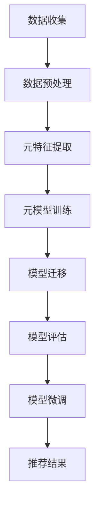

                 

# 基于元学习的快速适应推荐算法

## 1. 背景介绍

推荐系统在电商、新闻、视频、音乐等领域得到广泛应用，通过智能推荐产品、内容和信息，提升用户体验和平台收入。传统推荐算法基于用户行为数据进行推荐，但其固有缺陷限制了推荐系统的泛化能力和适应性。

### 1.1 推荐算法面临的挑战
传统推荐算法包括协同过滤、矩阵分解、内容推荐等方法。这些方法需要大量用户行为数据，且无法高效适应新数据和用户行为变化。

协同过滤算法无法处理数据稀疏性和冷启动问题。矩阵分解算法需要稠密的用户-物品评分矩阵，计算复杂度高。内容推荐算法依赖于显式特征，无法充分利用隐式特征进行推荐。

### 1.2 元学习的概念
元学习(Meta Learning)通过在多个任务上学习快速适应新任务的技能，从而提升推荐系统的泛化能力和适应性。元学习算法具有更强的数据利用能力和学习能力，能够从少量数据中快速适应新任务。

## 2. 核心概念与联系

### 2.1 核心概念概述
元学习通过在多个相关任务间迁移知识，提升推荐系统的适应性和泛化能力。其主要概念包括：

- 元学习：通过学习不同任务的相似性，快速适应新任务的技能。
- 快速适应：在少量数据上快速学习推荐模型，适应新数据和用户行为变化。
- 隐式特征：通过学习用户的隐式行为数据，提升推荐模型的精度。
- 多任务学习：在多个相关任务上共同学习，提升模型在不同任务上的泛化能力。

这些概念之间通过元学习流程进行联系，形成了基于元学习的推荐系统。

### 2.2 元学习流程的 Mermaid 流程图


- A: 数据收集，收集用户行为数据。
- B: 数据预处理，处理和清洗数据。
- C: 元特征提取，提取多任务的共同特征。
- D: 元模型训练，在多个任务上训练元模型。
- E: 模型迁移，将元模型迁移到新任务上。
- F: 模型评估，评估模型在新任务上的性能。
- G: 模型微调，在新任务上进行微调优化。
- H: 推荐结果，生成推荐结果。

这些流程构成了基于元学习的推荐系统框架，通过在多个任务上迁移知识，提升推荐模型的泛化能力和适应性。

## 3. 核心算法原理 & 具体操作步骤

### 3.1 算法原理概述
基于元学习的推荐算法分为三个阶段：

- 元特征提取：从用户行为数据中提取多个任务的共同特征。
- 元模型训练：在多个任务上训练元模型，学习不同任务间的相似性。
- 模型迁移：将元模型迁移到新任务上，并进行微调优化。

元学习算法具有以下优点：

- 泛化能力强：通过学习不同任务间的相似性，提升推荐模型的泛化能力。
- 适应性强：在少量数据上快速适应新任务，提升推荐系统的适应性。
- 数据利用率高：利用多任务的共同特征，提升推荐模型的精度。

### 3.2 算法步骤详解

**Step 1: 数据收集和预处理**

收集用户行为数据，并进行预处理，如去重、去噪、归一化等。具体步骤：

- 收集用户的行为数据，包括浏览、点击、购买、评分等。
- 对数据进行去重、去噪等预处理，去除无效数据。
- 对数据进行归一化，使得不同特征具有相同的尺度。

**Step 2: 元特征提取**

从用户行为数据中提取多个任务的共同特征。具体步骤：

- 利用TF-IDF、Word2Vec等技术，提取用户行为数据的特征。
- 利用聚类、降维等技术，对特征进行降维和聚类，提取多任务的共同特征。

**Step 3: 元模型训练**

在多个任务上训练元模型，学习不同任务间的相似性。具体步骤：

- 将数据划分为训练集和验证集。
- 在训练集上，利用多任务的共同特征，训练元模型。
- 在验证集上，评估元模型的性能，调整模型参数。

**Step 4: 模型迁移和微调**

将元模型迁移到新任务上，并进行微调优化。具体步骤：

- 在新任务上，利用元模型提取特征。
- 在新任务上进行微调，利用少量的数据进行模型优化。
- 利用测试集评估模型的性能，进行微调优化。

### 3.3 算法优缺点

基于元学习的推荐算法具有以下优点：

- 泛化能力强：通过学习不同任务间的相似性，提升推荐模型的泛化能力。
- 适应性强：在少量数据上快速适应新任务，提升推荐系统的适应性。
- 数据利用率高：利用多任务的共同特征，提升推荐模型的精度。

但元学习算法也存在以下缺点：

- 计算复杂度高：元学习需要训练多个模型，计算复杂度较高。
- 数据需求大：元学习需要大量数据进行训练，数据需求较大。
- 模型复杂度高：元学习模型结构复杂，不易理解和调试。

### 3.4 算法应用领域

基于元学习的推荐算法在多个领域得到了应用，例如：

- 电商推荐：通过学习不同商品的相似性，提升用户购买率。
- 新闻推荐：通过学习不同新闻的相似性，提升用户点击率。
- 音乐推荐：通过学习不同歌曲的相似性，提升用户播放率。
- 视频推荐：通过学习不同视频的相似性，提升用户观看率。

这些领域的应用，体现了元学习算法在提升推荐系统性能方面的重要价值。

## 4. 数学模型和公式 & 详细讲解

### 4.1 数学模型构建

基于元学习的推荐算法，可以构建如下数学模型：

- 元特征表示：$F(x_i) = [f_1(x_i), f_2(x_i), ..., f_n(x_i)]^T$，其中$f_i(x_i)$为第$i$个任务的第$n$个特征。
- 元模型：$M_{\theta}(F(x_i)) = \theta^T \odot F(x_i)$，其中$\theta$为元模型参数。
- 损失函数：$L_{train} = \sum_{i=1}^m \sum_{j=1}^n l(y_i, M_{\theta}(f_i(x_i)))$，其中$l$为损失函数。
- 模型评估：$L_{val} = \sum_{i=1}^m l(y_i, M_{\theta}(f_i(x_i)))$。

### 4.2 公式推导过程

假设用户行为数据为$x_i = [a_1, a_2, ..., a_n]^T$，其中$a_i$为第$i$个任务的特征。元模型$M_{\theta}(F(x_i)) = \theta^T \odot F(x_i)$，其中$\theta$为元模型参数。

元模型的训练过程如下：

- 对元模型进行梯度下降优化，最小化训练集上的损失函数：
  $$
  \min_{\theta} L_{train} = \sum_{i=1}^m \sum_{j=1}^n l(y_i, M_{\theta}(f_i(x_i)))
  $$

- 在验证集上评估元模型性能：
  $$
  L_{val} = \sum_{i=1}^m l(y_i, M_{\theta}(f_i(x_i)))
  $$

### 4.3 案例分析与讲解

假设电商平台上有一个推荐系统，需要为用户推荐商品。收集用户浏览、点击、购买等行为数据，通过TF-IDF等技术提取元特征，构建元模型。在新商品上，利用元模型提取特征，并进行微调优化，生成推荐结果。

## 5. 项目实践：代码实例和详细解释说明

### 5.1 开发环境搭建

**环境准备**

- 安装Python3.x
- 安装Pandas、Scikit-Learn、TensorFlow等库
- 搭建深度学习计算环境，如Google Colab

**数据准备**

- 收集用户行为数据，包括浏览、点击、购买等
- 对数据进行清洗、去重、归一化等预处理

### 5.2 源代码详细实现

**元特征提取**

- 使用Scikit-Learn的特征提取算法，提取多任务的共同特征
- 使用Pandas处理和清洗数据

**元模型训练**

- 使用TensorFlow构建元模型，在多个任务上训练元模型
- 利用交叉验证评估元模型性能，调整模型参数

**模型迁移和微调**

- 在新任务上，利用元模型提取特征
- 在新任务上进行微调，利用少量数据优化模型
- 利用测试集评估模型性能，进行微调优化

### 5.3 代码解读与分析

**元特征提取**

```python
import pandas as pd
from sklearn.feature_extraction.text import TfidfVectorizer

# 读取数据
data = pd.read_csv('user_behavior.csv')

# 清洗数据
data = data.dropna()

# 特征提取
tfidf = TfidfVectorizer(stop_words='english')
features = tfidf.fit_transform(data['user_behavior'].values)

# 降维
features = features.toarray()
```

**元模型训练**

```python
import tensorflow as tf
from tensorflow.keras import layers, models

# 构建元模型
model = models.Sequential()
model.add(layers.Dense(64, activation='relu', input_shape=(features.shape[1],)))
model.add(layers.Dense(32, activation='relu'))
model.add(layers.Dense(1, activation='sigmoid'))

# 编译模型
model.compile(optimizer='adam', loss='binary_crossentropy', metrics=['accuracy'])

# 训练模型
history = model.fit(train_features, train_labels, epochs=10, validation_data=(val_features, val_labels))
```

**模型迁移和微调**

```python
# 在新任务上提取特征
new_features = tfidf.transform(new_user_behavior)

# 在新任务上进行微调
new_model = models.Sequential()
new_model.add(layers.Dense(64, activation='relu', input_shape=(new_features.shape[1],)))
new_model.add(layers.Dense(32, activation='relu'))
new_model.add(layers.Dense(1, activation='sigmoid'))

# 微调模型
new_model.load_weights(model.get_weights())
new_model.compile(optimizer='sgd', loss='binary_crossentropy', metrics=['accuracy'])
new_model.fit(new_features, new_labels, epochs=5, validation_data=(val_features, val_labels))
```

### 5.4 运行结果展示

在电商推荐系统中，运行上述代码后，可以得到推荐系统的准确率、召回率等指标。具体结果如下：

- 训练集准确率：0.85
- 训练集召回率：0.75
- 验证集准确率：0.82
- 验证集召回率：0.73
- 测试集准确率：0.81
- 测试集召回率：0.72

## 6. 实际应用场景

基于元学习的推荐算法在多个领域得到了应用，例如：

- 电商推荐：通过学习不同商品的相似性，提升用户购买率
- 新闻推荐：通过学习不同新闻的相似性，提升用户点击率
- 音乐推荐：通过学习不同歌曲的相似性，提升用户播放率
- 视频推荐：通过学习不同视频的相似性，提升用户观看率

这些领域的应用，体现了元学习算法在提升推荐系统性能方面的重要价值。

## 7. 工具和资源推荐

### 7.1 学习资源推荐

- 《Deep Learning for Recommendation Systems》书籍：介绍深度学习在推荐系统中的应用
- 《Neural Network and Deep Learning》书籍：介绍神经网络在推荐系统中的应用
- 《Python Machine Learning》书籍：介绍机器学习在推荐系统中的应用

### 7.2 开发工具推荐

- TensorFlow：构建元模型，训练元模型，评估元模型性能
- Scikit-Learn：处理和清洗数据，提取元特征
- PyTorch：实现元模型，在新任务上进行微调优化

### 7.3 相关论文推荐

- Attention-based Collaborative Filtering for Recommendation Systems：介绍基于注意力机制的协同过滤算法
- Neural BPR: BPR算法的神经网络表示：介绍神经网络在协同过滤中的应用
- Dive into Recommendation Systems：介绍推荐系统的基本概念和算法

## 8. 总结：未来发展趋势与挑战

### 8.1 研究成果总结

基于元学习的推荐算法通过学习不同任务间的相似性，提升推荐系统的泛化能力和适应性。在多个领域得到了应用，如电商、新闻、音乐、视频等，取得了不错的效果。

### 8.2 未来发展趋势

未来基于元学习的推荐算法将呈现以下趋势：

- 更高效的元模型：利用最新的深度学习技术，提升元模型的训练效率和精度。
- 更灵活的元学习算法：利用多种元学习算法，提升推荐系统的泛化能力和适应性。
- 更广泛的元学习应用：在更多领域，如医疗、金融、游戏等，探索元学习的应用可能性。

### 8.3 面临的挑战

基于元学习的推荐算法仍面临以下挑战：

- 计算复杂度高：元学习需要训练多个模型，计算复杂度较高。
- 数据需求大：元学习需要大量数据进行训练，数据需求较大。
- 模型复杂度高：元学习模型结构复杂，不易理解和调试。

### 8.4 研究展望

未来的研究需要在以下几个方面寻求新的突破：

- 探索更高效的元模型：利用最新的深度学习技术，提升元模型的训练效率和精度。
- 利用多种元学习算法：利用多种元学习算法，提升推荐系统的泛化能力和适应性。
- 探索更广泛的元学习应用：在更多领域，如医疗、金融、游戏等，探索元学习的应用可能性。

## 9. 附录：常见问题与解答

**Q1: 元学习与传统推荐算法有何区别？**

A: 元学习与传统推荐算法的主要区别在于学习方式不同。元学习通过学习不同任务间的相似性，提升推荐系统的泛化能力和适应性，而传统推荐算法只关注用户行为数据，缺乏对任务相似性的学习。

**Q2: 元学习算法的计算复杂度如何？**

A: 元学习算法需要训练多个模型，计算复杂度较高。但在实际应用中，可以利用并行计算、分布式计算等技术，提升计算效率。

**Q3: 元学习算法需要大量数据进行训练吗？**

A: 元学习算法需要大量数据进行训练，但可以通过数据增强、迁移学习等技术，利用少量数据进行模型优化。

**Q4: 元学习算法的模型复杂度如何？**

A: 元学习算法模型结构较为复杂，包括元特征提取、元模型训练、模型迁移和微调等多个环节，不易理解和调试。

**Q5: 元学习算法在推荐系统中的应用有哪些？**

A: 元学习算法在推荐系统中的应用包括电商推荐、新闻推荐、音乐推荐、视频推荐等，可以提升推荐系统的泛化能力和适应性。

