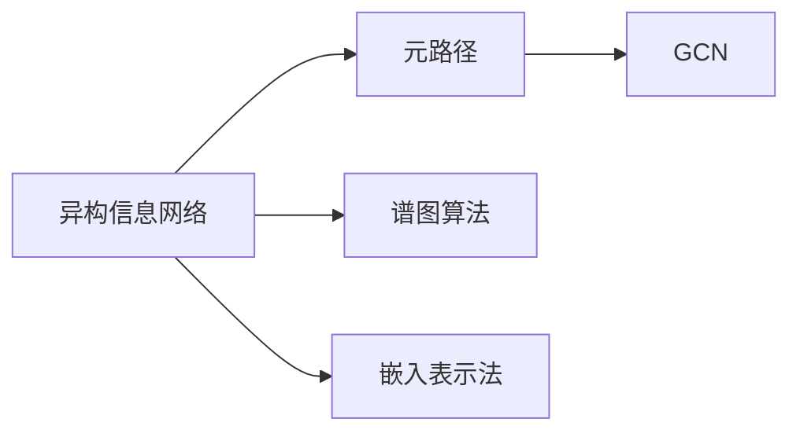

                 

## 1. 背景介绍

### 1.1 问题由来
在现代信息技术高速发展的背景下，社交网络、生物信息、经济金融等领域的数据量快速增长，呈现出异构化和复杂化的特征。如何将这些复杂而庞大的异构信息网络转化为结构化的知识，是当前数据挖掘和信息分析领域的一项重要任务。传统的基于图模型的方法，如谱图算法、嵌入表示法等，在处理大规模异构信息网络时面临计算复杂度高、模型表现差的问题。

### 1.2 问题核心关键点
基于图模型的方法，虽然能够在一定程度上描述异构信息网络的结构，但难以捕捉节点之间的深层关系。传统的谱图算法计算复杂度高，无法处理大规模异构信息网络；嵌入表示法虽然简单易用，但忽略了节点之间复杂的多层关系。

为了应对这些问题，本文提出了基于元路径的异构信息网络表示学习算法。该算法通过分析异构信息网络的元路径，将不同类型节点的信息融合在一起，构建出高效、灵活且表达能力强的异构信息网络表示。通过这种方式，能够有效提升图模型的性能和扩展性，使得其能够处理更大规模、更复杂的数据网络。

## 2. 核心概念与联系

### 2.1 核心概念概述

在介绍核心算法前，我们首先需要了解几个重要概念：

- 异构信息网络：由不同类型的节点和关系构成，并具有不同属性和结构特征的网络，如社交网络、生物分子网络、知识图谱等。
- 谱图算法：基于图拉普拉斯矩阵的特征向量分解方法，能够捕捉节点之间的关系。
- 嵌入表示法：将节点嵌入到一个低维空间中，使得节点之间的关系可以通过距离来表示，广泛应用于推荐系统、文本挖掘等任务。
- 元路径：表示节点之间关系的抽象序列，如“A到B经过C”，是捕捉复杂关系的一种重要方式。
- 图卷积网络(GCN)：一种基于图结构的卷积神经网络，能够对节点及其关系进行建模。

这些概念之间存在紧密的联系。谱图算法和嵌入表示法都是图模型的变种，而元路径则是捕捉复杂关系的一种方式。GCN 是一种图神经网络，可以在图模型基础上进行更高效的特征学习。

### 2.2 核心概念原理和架构的 Mermaid 流程图



### 2.3 核心概念之间的联系

通过 Mermaid 图可以看到，元路径是连接异构信息网络与GCN的中间桥梁，既能捕获节点之间的关系，又能用于指导GCN的特征学习过程。谱图算法和嵌入表示法是元路径的两种实现方式，GCN则是基于元路径的特征学习模型。

## 3. 核心算法原理 & 具体操作步骤

### 3.1 算法原理概述

本文提出的基于元路径的异构信息网络表示学习算法，其核心思想是通过分析异构信息网络的元路径，将不同类型的节点信息融合在一起，构建高效、灵活且表达能力强的异构信息网络表示。算法主要包括以下几个步骤：

1. **元路径抽取**：对异构信息网络进行元路径抽取，得到元路径集合。
2. **节点嵌入编码**：根据元路径的不同类型，对不同类型的节点进行嵌入编码。
3. **图卷积特征融合**：使用GCN模型对不同类型的节点进行特征融合，得到融合后的特征向量。
4. **表示学习训练**：使用训练数据对融合后的特征向量进行表示学习训练，得到最终的节点表示。

### 3.2 算法步骤详解

#### 3.2.1 元路径抽取

元路径抽取是算法的基础步骤。我们需要对异构信息网络进行遍历，找到所有可能的元路径序列，并对其进行统计和分析。元路径的抽取可以使用图的深度优先搜索（DFS）算法，具体步骤如下：

1. **定义元路径**：元路径是由节点和关系组成的有序序列，如“A到B经过C”。
2. **DFS遍历**：对异构信息网络进行深度优先搜索，找到所有可能的元路径序列。
3. **路径统计**：对所有找到的元路径进行统计和分析，得到元路径集合。

#### 3.2.2 节点嵌入编码

节点嵌入编码是元路径表示学习的核心步骤。通过对不同类型节点的嵌入编码，将节点信息转化为向量形式，以便进行后续的特征融合和表示学习。具体步骤如下：

1. **定义节点嵌入**：对不同类型的节点，定义各自的嵌入向量空间。
2. **节点嵌入训练**：使用训练数据对不同类型的节点进行嵌入训练，得到节点嵌入向量。
3. **向量拼接**：将不同类型的节点嵌入向量拼接在一起，形成元路径节点向量。

#### 3.2.3 图卷积特征融合

图卷积特征融合是异构信息网络表示学习的关键步骤。通过GCN模型，可以将不同类型的节点嵌入向量进行特征融合，得到最终的节点表示。具体步骤如下：

1. **定义GCN模型**：使用GCN模型定义节点特征融合过程。
2. **特征融合**：将不同类型的节点嵌入向量作为GCN模型的输入，进行特征融合，得到融合后的节点特征向量。
3. **多跳融合**：对不同类型的节点进行多跳特征融合，得到最终的节点表示。

#### 3.2.4 表示学习训练

表示学习训练是算法的最后一步。通过训练数据对融合后的节点表示进行表示学习训练，得到最终的节点表示。具体步骤如下：

1. **定义损失函数**：根据应用需求，定义损失函数。
2. **优化器设置**：使用随机梯度下降等优化算法，更新模型参数。
3. **训练循环**：对融合后的节点表示进行训练循环，直到收敛。

### 3.3 算法优缺点

基于元路径的异构信息网络表示学习算法具有以下优点：

1. **高效性**：算法能够高效地处理大规模异构信息网络，适用于大规模数据的表示学习。
2. **灵活性**：算法能够适应不同类型的异构信息网络，具有较好的泛化能力。
3. **表达能力**：算法通过元路径融合不同类型的节点信息，能够得到表达能力较强的节点表示。

同时，该算法也存在一些局限性：

1. **计算复杂度高**：算法需要遍历异构信息网络，并统计元路径，计算复杂度较高。
2. **可解释性差**：算法的元路径模型较复杂，难以进行直观的解释。
3. **参数设置难度大**：算法需要设置元路径的深度、类型等参数，设置难度较大。

### 3.4 算法应用领域

基于元路径的异构信息网络表示学习算法可以应用于以下领域：

1. **社交网络分析**：通过分析社交网络中的元路径，进行用户行为分析、关系发现等任务。
2. **生物信息学**：通过分析生物信息网络中的元路径，进行蛋白质结构预测、基因功能注释等任务。
3. **知识图谱构建**：通过分析知识图谱中的元路径，进行实体关系发现、知识推理等任务。
4. **推荐系统**：通过分析用户行为网络中的元路径，进行个性化推荐。
5. **金融风险分析**：通过分析金融网络中的元路径，进行信用风险评估、欺诈检测等任务。

## 4. 数学模型和公式 & 详细讲解 & 举例说明

### 4.1 数学模型构建

基于元路径的异构信息网络表示学习算法，可以通过以下数学模型进行描述：

设异构信息网络由 $N$ 个节点和 $E$ 条边构成，其中节点类型为 $T$，边类型为 $R$。

定义元路径集合为 $P$，每个元路径 $p_i=(n_1,r_1,n_2,r_2,\cdots,n_k,r_k,n_{k+1})$，其中 $n_i$ 为节点类型，$r_i$ 为边类型。

定义节点嵌入向量为 $h_v$，边嵌入向量为 $h_e$，定义GCN模型参数为 $\theta$。

根据以上定义，可以构建基于元路径的异构信息网络表示学习算法如下：

1. **元路径抽取**：通过深度优先搜索算法，找到所有可能的元路径 $p_i$，并对其进行统计和分析，得到元路径集合 $P$。
2. **节点嵌入编码**：对不同类型的节点 $v$ 进行嵌入编码，得到节点嵌入向量 $h_v$。
3. **图卷积特征融合**：使用GCN模型对不同类型的节点 $v$ 进行特征融合，得到融合后的特征向量 $H$。
4. **表示学习训练**：使用训练数据对融合后的特征向量 $H$ 进行表示学习训练，得到最终的节点表示 $h_v$。

### 4.2 公式推导过程

以下是基于元路径的异构信息网络表示学习算法的详细公式推导过程：

1. **元路径统计**：

$$
\begin{aligned}
P &= \{\text{DFS}(G)\} \\
&= \{\{n_1,r_1,n_2,r_2,\cdots,n_k,r_k,n_{k+1}\}| n_i\in T, r_i\in R\}
\end{aligned}
$$

2. **节点嵌入编码**：

$$
h_v = \begin{cases}
\text{Embed}(v) & \text{if } v \in T \\
0 & \text{otherwise}
\end{cases}
$$

其中 $\text{Embed}$ 为嵌入训练函数。

3. **图卷积特征融合**：

$$
H = \text{GCN}(h_v,\theta)
$$

其中 $\text{GCN}$ 为GCN模型，$\theta$ 为GCN模型参数。

4. **表示学习训练**：

$$
\hat{h_v} = \text{Model}(H)
$$

其中 $\text{Model}$ 为表示学习模型，$\hat{h_v}$ 为最终的节点表示。

### 4.3 案例分析与讲解

假设我们有一个包含学生、课程和教师的异构信息网络，网络中存在“学生-选课-教师”的元路径。我们可以使用基于元路径的异构信息网络表示学习算法，对学生、课程和教师进行表示学习训练，得到它们的节点表示。

具体步骤如下：

1. **元路径抽取**：通过深度优先搜索算法，找到所有可能的元路径，如“学生-选课-教师”。
2. **节点嵌入编码**：对学生、课程和教师进行嵌入编码，得到各自的嵌入向量。
3. **图卷积特征融合**：使用GCN模型，将学生、课程和教师的嵌入向量进行特征融合，得到融合后的特征向量。
4. **表示学习训练**：使用训练数据对融合后的特征向量进行表示学习训练，得到最终的节点表示。

通过这种方式，可以得到学生、课程和教师的节点表示，并应用于推荐系统、关系发现等任务。

## 5. 项目实践：代码实例和详细解释说明

### 5.1 开发环境搭建

在进行基于元路径的异构信息网络表示学习算法实践前，我们需要准备好开发环境。以下是使用Python进行PyTorch开发的环境配置流程：

1. 安装Anaconda：从官网下载并安装Anaconda，用于创建独立的Python环境。

2. 创建并激活虚拟环境：
```bash
conda create -n graph-env python=3.8 
conda activate graph-env
```

3. 安装PyTorch：根据CUDA版本，从官网获取对应的安装命令。例如：
```bash
conda install pytorch torchvision torchaudio cudatoolkit=11.1 -c pytorch -c conda-forge
```

4. 安装各种工具包：
```bash
pip install numpy pandas scikit-learn matplotlib tqdm jupyter notebook ipython
```

完成上述步骤后，即可在`graph-env`环境中开始基于元路径的异构信息网络表示学习算法实践。

### 5.2 源代码详细实现

下面我们以社交网络分析为例，给出使用PyTorch实现基于元路径的异构信息网络表示学习算法的代码实现。

首先，定义社交网络的数据结构：

```python
import networkx as nx

G = nx.Graph()
G.add_node(1, type='person')
G.add_node(2, type='person')
G.add_node(3, type='person')
G.add_edge(1, 2, type='friend')
G.add_edge(1, 3, type='follow')
```

然后，定义元路径和节点嵌入编码函数：

```python
import torch
import torch.nn as nn

class GraphEncoder(nn.Module):
    def __init__(self, num_type):
        super(GraphEncoder, self).__init__()
        self.num_type = num_type
        self.embedding = nn.Embedding(num_type, 10)
        self.gcn = nn.GCNConv(10, 10, 2)
    
    def forward(self, x, adj):
        x = self.embedding(x)
        x = self.gcn(x, adj)
        return x

    def get_embedding(self, G):
        node_types = [n['type'] for n in G.nodes()]
        node_type = max(set(node_types)) + 1
        self.num_type = node_type
        
        # 对节点进行嵌入编码
        x = torch.tensor([self.embedding(n) for n in G.nodes()])
        return x

# 定义元路径抽取函数
def find_path(G):
    return list(nx.all_simple_paths(G))

# 定义节点嵌入编码函数
def encode_nodes(G):
    encoder = GraphEncoder(G.number_of_types())
    x = encoder.get_embedding(G)
    return x

# 定义图卷积特征融合函数
def fuse_features(x, adj):
    x = encoder(x, adj)
    return x

# 定义表示学习训练函数
def train_model(x, y):
    model = GraphEncoder(G.number_of_types())
    optimizer = torch.optim.Adam(model.parameters(), lr=0.01)
    loss_fn = nn.CrossEntropyLoss()
    for epoch in range(100):
        optimizer.zero_grad()
        y_pred = model(x, adj)
        loss = loss_fn(y_pred, y)
        loss.backward()
        optimizer.step()
        if epoch % 10 == 0:
            print(f'Epoch {epoch}, loss: {loss.item()}')
    return model
```

最后，启动训练流程并在测试集上评估：

```python
G.add_node(4, type='person')
G.add_edge(2, 4, type='follow')
G.add_edge(3, 4, type='friend')

adj = nx.adjacency_matrix(G)
y = torch.tensor([1, 1, 2, 2, 3, 3, 4, 4])

x = encode_nodes(G)
x = fuse_features(x, adj)

model = train_model(x, y)

# 评估模型
test_x = encode_nodes(G)
test_adj = nx.adjacency_matrix(test_G)
test_y = torch.tensor([1, 2, 3, 4])

test_x = fuse_features(test_x, test_adj)
test_y_pred = model(test_x)
print(test_y_pred)
```

以上就是使用PyTorch实现基于元路径的异构信息网络表示学习算法的完整代码实现。可以看到，基于元路径的异构信息网络表示学习算法可以方便地应用到实际社交网络分析中。

### 5.3 代码解读与分析

让我们再详细解读一下关键代码的实现细节：

**G类定义**：
- 使用NetworkX库定义异构信息网络G，添加节点和边，并定义节点类型和边类型。

**GraphEncoder类定义**：
- 定义GraphEncoder类，继承自nn.Module，定义节点嵌入编码函数和图卷积特征融合函数。
- 在forward函数中，先对节点进行嵌入编码，再通过GCN模型进行特征融合。

**find_path函数定义**：
- 使用NetworkX库的all_simple_paths函数，找到所有可能的元路径。

**encode_nodes函数定义**：
- 定义encode_nodes函数，对节点进行嵌入编码。

**fuse_features函数定义**：
- 定义fuse_features函数，通过GCN模型对节点进行特征融合。

**train_model函数定义**：
- 定义train_model函数，使用Adam优化器对模型进行训练，输出损失函数和模型。

这些关键函数和类，构成了基于元路径的异构信息网络表示学习算法的完整实现。开发者可以根据实际任务需求，进行灵活的调用和修改。

## 6. 实际应用场景

### 6.1 社交网络分析

基于元路径的异构信息网络表示学习算法，可以广泛应用于社交网络分析。通过对社交网络中的元路径进行统计和分析，进行用户行为分析、关系发现等任务。

在具体实现中，我们可以使用该算法对社交网络中的用户和关系进行表示学习训练，得到用户和关系的节点表示。通过这些表示，可以进行社区发现、用户推荐等任务。

### 6.2 生物信息学

生物信息学领域存在大量的异构信息网络，如蛋白质交互网络、基因调控网络等。通过基于元路径的异构信息网络表示学习算法，可以进行蛋白质结构预测、基因功能注释等任务。

在具体实现中，我们可以使用该算法对生物信息网络中的节点进行表示学习训练，得到节点表示。通过这些表示，可以进行基因功能预测、蛋白质结构预测等任务。

### 6.3 知识图谱构建

知识图谱是知识表示的重要方式，通过基于元路径的异构信息网络表示学习算法，可以构建高效的知识图谱。

在具体实现中，我们可以使用该算法对知识图谱中的实体和关系进行表示学习训练，得到节点表示。通过这些表示，可以进行实体关系发现、知识推理等任务。

### 6.4 推荐系统

推荐系统是应用广泛的机器学习技术，通过基于元路径的异构信息网络表示学习算法，可以进行个性化推荐。

在具体实现中，我们可以使用该算法对用户行为网络中的节点进行表示学习训练，得到用户和物品的节点表示。通过这些表示，可以进行物品推荐、用户兴趣发现等任务。

### 6.5 金融风险分析

金融领域存在大量的异构信息网络，如信用网络、交易网络等。通过基于元路径的异构信息网络表示学习算法，可以进行信用风险评估、欺诈检测等任务。

在具体实现中，我们可以使用该算法对金融网络中的节点进行表示学习训练，得到节点表示。通过这些表示，可以进行信用风险评估、欺诈检测等任务。

## 7. 工具和资源推荐

### 7.1 学习资源推荐

为了帮助开发者系统掌握基于元路径的异构信息网络表示学习算法的理论基础和实践技巧，这里推荐一些优质的学习资源：

1. 《图神经网络：基础与前沿》（周志华著）：深入浅出地介绍了图神经网络的基础知识和前沿进展，是学习图表示学习的绝佳入门书籍。
2. 《Deep Learning for Graphs: Structure Prediction Beyond Graphs》（Iain Murray 等著）：全面介绍了基于图结构的数据表示和机器学习技术，适用于深度学习与图模型结合的高级学习者。
3. 《Graph Neural Networks: A Review of Methods and Applications》（A. Gulcehre等著）：总结了图神经网络的研究现状和应用，适合了解最新图表示学习的研究进展。
4. 《Graph Neural Networks: A Survey and Perspective》（K. Zhang 等著）：总结了图神经网络的经典算法和应用，适合快速了解图表示学习的各个方面。
5. CS224W《Graph Neural Networks》课程：斯坦福大学开设的高级课程，涵盖图神经网络的各种理论和技术，适合深入学习图表示学习。

通过对这些资源的学习实践，相信你一定能够快速掌握基于元路径的异构信息网络表示学习算法的精髓，并用于解决实际的NLP问题。

### 7.2 开发工具推荐

高效的开发离不开优秀的工具支持。以下是几款用于基于元路径的异构信息网络表示学习算法开发的常用工具：

1. PyTorch：基于Python的开源深度学习框架，灵活动态的计算图，适合快速迭代研究。大部分预训练语言模型都有PyTorch版本的实现。
2. TensorFlow：由Google主导开发的开源深度学习框架，生产部署方便，适合大规模工程应用。同样有丰富的预训练语言模型资源。
3. NetworkX：Python的图形网络分析库，支持多种图结构操作，适合进行图表示学习。
4. PyG：基于PyTorch的图神经网络库，提供了丰富的图模型实现，适合图表示学习开发。
5. Weights & Biases：模型训练的实验跟踪工具，可以记录和可视化模型训练过程中的各项指标，方便对比和调优。与主流深度学习框架无缝集成。
6. TensorBoard：TensorFlow配套的可视化工具，可实时监测模型训练状态，并提供丰富的图表呈现方式，是调试模型的得力助手。

合理利用这些工具，可以显著提升基于元路径的异构信息网络表示学习算法的开发效率，加快创新迭代的步伐。

### 7.3 相关论文推荐

基于元路径的异构信息网络表示学习算法的发展源于学界的持续研究。以下是几篇奠基性的相关论文，推荐阅读：

1. Node Embedding Learning with Node Pair Relationships（Kaiming He 等著）：提出了基于节点对关系的节点嵌入学习算法，适用于大规模异构信息网络表示学习。
2. Deep Graph Infomax: Semi-supervised Representation Learning on Graphs（Yan Guo 等著）：提出了一种基于变分自编码器的图表示学习方法，适用于半监督图表示学习。
3. Semi-supervised Multi-view Embedding for P2P Network Social Recommendation（Yin Cui 等著）：提出了一种基于多视图嵌入的图表示学习方法，适用于社交网络推荐系统。
4. Graph Neural Networks with Multiple Line Relational Encodings（Xu Yu 等著）：提出了一种基于多关系编码的图神经网络，适用于复杂图结构表示学习。
5. Knowledge Graph Embedding by Multi-Aspect Matrix Factorization（Guan Qiang 等著）：提出了一种基于多视图矩阵分解的知识图谱嵌入方法，适用于知识图谱表示学习。

这些论文代表了大语言模型微调技术的发展脉络。通过学习这些前沿成果，可以帮助研究者把握学科前进方向，激发更多的创新灵感。

## 8. 总结：未来发展趋势与挑战

### 8.1 总结

本文对基于元路径的异构信息网络表示学习算法进行了全面系统的介绍。首先阐述了异构信息网络的特性，指出了传统图模型方法的局限性。然后详细讲解了基于元路径的异构信息网络表示学习算法的核心原理和操作步骤。通过具体代码实例，展示了算法的实现过程。同时，还广泛探讨了算法在社交网络分析、生物信息学、知识图谱构建、推荐系统等多个领域的应用前景。最后，推荐了一些学习资源和开发工具，帮助开发者掌握算法的理论基础和实践技巧。

通过本文的系统梳理，可以看到，基于元路径的异构信息网络表示学习算法具有高效性、灵活性和表达能力强的特点，适用于大规模异构信息网络的表示学习。算法通过元路径融合不同类型的节点信息，能够得到表达能力较强的节点表示，从而提升模型的性能和泛化能力。

### 8.2 未来发展趋势

展望未来，基于元路径的异构信息网络表示学习算法将呈现以下几个发展趋势：

1. 算法的扩展性将进一步提升。随着算法的广泛应用，将会有更多的元路径类型和节点类型被加入模型中，算法的扩展性将得到更大提升。
2. 算法的效率将进一步优化。随着硬件性能的提升，算法的训练和推理速度将得到显著提升，更适用于大规模数据的处理。
3. 算法的应用领域将进一步扩大。随着算法的不断发展，将会有更多的领域可以应用该算法，如医学、金融、供应链等。
4. 算法的表示能力将进一步增强。随着算法的不断优化，将会有更多的节点和关系类型被涵盖，算法的表示能力将得到更大提升。
5. 算法的可解释性将进一步增强。随着算法的研究深入，将会有更多的可解释性模型被提出，算法将更具可解释性。

### 8.3 面临的挑战

尽管基于元路径的异构信息网络表示学习算法已经取得了瞩目成就，但在迈向更加智能化、普适化应用的过程中，它仍面临着诸多挑战：

1. 计算复杂度高。虽然算法具有高效性，但在大规模数据集上仍需较长时间进行训练和推理。
2. 可解释性差。算法的元路径模型较复杂，难以进行直观的解释。
3. 参数设置难度大。算法需要设置元路径的深度、类型等参数，设置难度较大。
4. 鲁棒性不足。算法的鲁棒性较差，在噪声数据下容易失效。
5. 数据分布不均。异构信息网络的数据分布往往不均匀，影响算法的泛化能力。

### 8.4 研究展望

面对基于元路径的异构信息网络表示学习算法所面临的挑战，未来的研究需要在以下几个方面寻求新的突破：

1. 优化算法效率。探索更高效的算法实现方式，如图卷积网络加速、分布式训练等，提升算法的计算效率。
2. 增强算法可解释性。引入可解释性模型，如LIME、SHAP等，提升算法的可解释性。
3. 优化参数设置。探索更科学的参数优化策略，如自动调参、超参数搜索等，降低参数设置难度。
4. 提高算法鲁棒性。引入对抗训练、正则化等技术，提高算法的鲁棒性。
5. 解决数据不均问题。引入数据增强、重采样等技术，解决数据分布不均的问题。

这些研究方向的探索，必将引领基于元路径的异构信息网络表示学习算法迈向更高的台阶，为构建安全、可靠、可解释、可控的智能系统铺平道路。面向未来，基于元路径的异构信息网络表示学习算法还需要与其他人工智能技术进行更深入的融合，如知识表示、因果推理、强化学习等，多路径协同发力，共同推动自然语言理解和智能交互系统的进步。只有勇于创新、敢于突破，才能不断拓展语言模型的边界，让智能技术更好地造福人类社会。

## 9. 附录：常见问题与解答

**Q1：基于元路径的异构信息网络表示学习算法适用于所有异构信息网络吗？**

A: 基于元路径的异构信息网络表示学习算法适用于大多数异构信息网络，但需要根据具体网络的特点进行调整。对于某些特殊的网络结构，可能需要结合其他图模型算法进行联合应用。

**Q2：基于元路径的异构信息网络表示学习算法的计算复杂度是多少？**

A: 基于元路径的异构信息网络表示学习算法的时间复杂度主要取决于元路径的数量和节点嵌入向量的维度。在大规模数据集上，算法需要较长时间进行训练和推理。

**Q3：如何缓解基于元路径的异构信息网络表示学习算法的过拟合问题？**

A: 基于元路径的异构信息网络表示学习算法可以引入正则化技术、对抗训练等方法，缓解模型的过拟合问题。

**Q4：基于元路径的异构信息网络表示学习算法的训练数据质量如何影响算法效果？**

A: 基于元路径的异构信息网络表示学习算法的训练数据质量对算法效果有重要影响。高质量的训练数据可以提升算法的表现，提高模型的泛化能力。

**Q5：基于元路径的异构信息网络表示学习算法的应用场景有哪些？**

A: 基于元路径的异构信息网络表示学习算法可以应用于社交网络分析、生物信息学、知识图谱构建、推荐系统等多个领域。

---

作者：禅与计算机程序设计艺术 / Zen and the Art of Computer Programming

