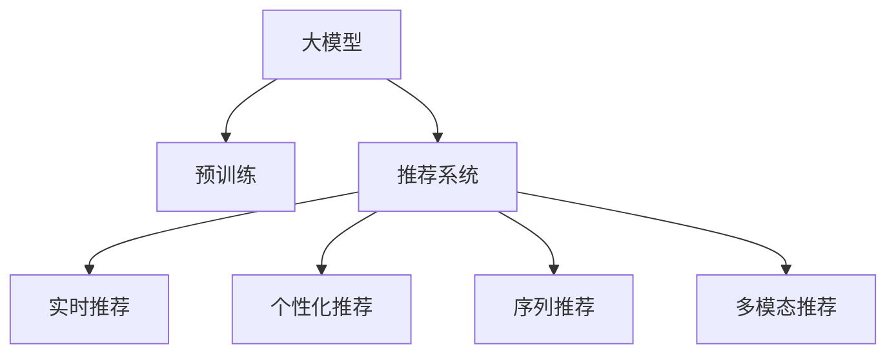

                 

# 基于大模型的推荐系统实时个性化方法

## 1. 背景介绍

### 1.1 问题由来

推荐系统作为互联网时代的核心技术，已经成为电商、社交、视频等多个领域的重要基础设施。传统的推荐系统主要基于用户历史行为数据，采用协同过滤、矩阵分解等方法，生成个性化的物品推荐。然而，传统推荐算法存在诸多局限，难以处理非结构化数据，推荐精度和用户满意度有待提升。

近年来，随着深度学习技术的发展，基于大模型的推荐系统逐渐成为研究热点。大模型通过在大规模数据上进行预训练，具备了强大的特征提取能力和泛化能力，可以在少量标注样本下实现高效的个性化推荐。本文将重点探讨如何利用大模型技术，构建实时个性化的推荐系统，提升推荐系统的效果和用户体验。

## 2. 核心概念与联系

### 2.1 核心概念概述

为更好地理解基于大模型的推荐系统，本节将介绍几个密切相关的核心概念：

- 大模型：指在大规模数据上预训练得到的高参数量、高泛化能力的模型，如BERT、GPT等。大模型能够从丰富的数据中学习到广泛的通用特征。

- 推荐系统：指根据用户历史行为和兴趣，为用户推荐潜在感兴趣物品的系统。推荐系统的目标是为用户提供个性化、相关性的物品推荐。

- 实时推荐：指在用户操作过程中实时生成推荐结果的系统，能够快速响应用户需求，提升用户体验。

- 个性化推荐：指根据用户个性化特征，为用户提供量身定制的推荐结果。个性化推荐可以提升用户满意度，提高物品转化率。

- 序列推荐：指在用户操作序列上预测用户兴趣和行为的系统。序列推荐能够捕捉用户长时序行为模式，提高推荐精度。

- 多模态推荐：指将不同类型的数据（如文本、图像、视频等）融入推荐过程，提升推荐系统的效果和适用性。

这些核心概念之间的逻辑关系可以通过以下Mermaid流程图来展示：



这个流程图展示了大模型的核心概念及其之间的关系：

1. 大模型通过预训练获得基础能力。
2. 推荐系统利用大模型进行物品推荐。
3. 实时推荐系统在用户操作过程中生成推荐结果。
4. 个性化推荐系统根据用户个性化特征生成推荐结果。
5. 序列推荐系统捕捉用户长时序行为模式。
6. 多模态推荐系统融合多种类型的数据进行推荐。

这些核心概念共同构成了推荐系统的核心技术框架，使其能够在各种场景下发挥强大的推荐能力。通过理解这些核心概念，我们可以更好地把握大模型在推荐系统中的应用。

## 3. 核心算法原理 & 具体操作步骤
### 3.1 算法原理概述

基于大模型的推荐系统，本质上是一种基于序列预测的推荐方法。其核心思想是：利用大模型对用户的历史行为进行编码，学习用户的长期兴趣和行为模式，从而预测用户对物品的兴趣和点击概率，生成实时推荐结果。

形式化地，假设用户历史行为序列为 $X=(x_1, x_2, ..., x_n)$，其中 $x_i$ 为用户在时间步 $t_i$ 的行为数据。推荐系统需要学习一个条件概率分布 $P(Y|X)$，其中 $Y$ 为用户的兴趣行为，$X$ 为用户历史行为。通过最大化 $P(Y|X)$，推荐系统能够生成最符合用户兴趣的推荐结果。

在大模型微调的方法下，推荐系统利用预训练语言模型（如BERT、GPT等）作为基础模型，在大规模数据上预训练得到高质量的特征表示。然后，在少量标注数据上微调模型，使其能够对用户的兴趣行为进行预测。最终，利用训练好的模型对实时输入的查询进行推理，生成推荐结果。

### 3.2 算法步骤详解

基于大模型的推荐系统，通常包括以下几个关键步骤：

**Step 1: 准备预训练模型和数据集**
- 选择合适的预训练语言模型 $M_{\theta}$ 作为初始化参数，如 BERT、GPT等。
- 准备推荐系统的训练集和验证集，其中训练集包含用户历史行为和兴趣行为标注数据，验证集用于评估模型性能。

**Step 2: 设计任务适配层**
- 根据推荐任务类型，在预训练模型顶层设计合适的输出层和损失函数。
- 对于推荐任务，通常使用softmax函数作为输出，交叉熵损失函数作为损失。

**Step 3: 设置微调超参数**
- 选择合适的优化算法及其参数，如 Adam、SGD 等，设置学习率、批大小、迭代轮数等。
- 设置正则化技术及强度，包括权重衰减、Dropout、Early Stopping 等。
- 确定冻结预训练参数的策略，如仅微调顶层，或全部参数都参与微调。

**Step 4: 执行梯度训练**
- 将训练集数据分批次输入模型，前向传播计算损失函数。
- 反向传播计算参数梯度，根据设定的优化算法和学习率更新模型参数。
- 周期性在验证集上评估模型性能，根据性能指标决定是否触发 Early Stopping。
- 重复上述步骤直到满足预设的迭代轮数或 Early Stopping 条件。

**Step 5: 测试和部署**
- 在测试集上评估微调后模型 $M_{\hat{\theta}}$ 的性能，对比微调前后的精度提升。
- 使用微调后的模型对实时输入进行推理预测，生成推荐结果。
- 将推荐结果集成到实际的应用系统中，进行A/B测试，优化推荐策略。

以上是基于大模型的推荐系统的一般流程。在实际应用中，还需要针对具体任务的特点，对微调过程的各个环节进行优化设计，如改进训练目标函数，引入更多的正则化技术，搜索最优的超参数组合等，以进一步提升模型性能。

### 3.3 算法优缺点

基于大模型的推荐系统具有以下优点：

1. 大模型的特征提取能力强大，能够捕捉复杂的用户行为模式。
2. 微调过程快速高效，可以在少量标注数据下取得不错的推荐精度。
3. 推荐结果具有很强的个性化特征，能够提升用户满意度。
4. 实时推荐系统能够快速响应用户需求，提高用户体验。
5. 序列推荐和多模态推荐能够提升推荐系统的适用性和精度。

同时，该方法也存在一定的局限性：

1. 数据依赖性强。微调效果很大程度上取决于训练数据的数量和质量，标注数据的获取成本较高。
2. 模型泛化能力有限。当目标任务与预训练数据的分布差异较大时，微调的推荐精度可能不高。
3. 模型复杂度大。大规模预训练模型的参数量通常较大，对计算资源的需求较高。
4. 模型可解释性不足。推荐模型的决策过程通常缺乏可解释性，难以对其推荐逻辑进行分析和调试。
5. 需要实时处理和推理。实时推荐系统对系统处理能力和存储需求较高，需要优化算法和资源配置。

尽管存在这些局限性，但就目前而言，基于大模型的推荐系统仍然是大规模个性化推荐的重要范式。未来相关研究的重点在于如何进一步降低推荐系统对标注数据的依赖，提高模型的跨领域迁移能力和可解释性，同时兼顾推荐系统的实时处理和推理能力。

### 3.4 算法应用领域

基于大模型的推荐系统已经在电商、社交、视频等多个领域得到了广泛应用，具体包括：

- 电商平台推荐：如淘宝、京东等，根据用户浏览记录和购买历史，为用户推荐商品。
- 社交网络推荐：如微博、抖音等，根据用户兴趣和互动记录，为用户推荐相关内容。
- 视频平台推荐：如爱奇艺、腾讯视频等，根据用户观看记录和评分数据，为用户推荐视频内容。
- 广告推荐：如谷歌、百度等，根据用户点击记录和浏览行为，为用户推荐相关广告。
- 金融推荐：如支付宝、微信等，根据用户消费记录和交易行为，为用户推荐金融产品。

除了上述这些经典应用外，大模型推荐系统还被创新性地应用到更多场景中，如医疗推荐、教育推荐、智能家居等，为各行各业带来了新的数字化升级。随着预训练模型和微调方法的不断进步，基于大模型的推荐系统必将在更多领域得到应用，为经济社会发展注入新的动力。

## 4. 数学模型和公式 & 详细讲解 & 举例说明

### 4.1 数学模型构建

本节将使用数学语言对基于大模型的推荐系统进行更加严格的刻画。

记推荐系统用户历史行为序列为 $X=(x_1, x_2, ..., x_n)$，其中 $x_i$ 为用户在时间步 $t_i$ 的行为数据。设推荐系统的目标为预测用户对物品 $y$ 的兴趣概率 $P(y|X)$，其中 $y \in \{0,1\}$。假设推荐模型 $M_{\theta}$ 由预训练语言模型 $M_{\theta_0}$ 和任务适配层 $F_{\phi}$ 构成：

$$
M_{\theta}(X) = F_{\phi}(M_{\theta_0}(X))
$$

其中 $\theta_0$ 为预训练语言模型的参数，$\phi$ 为适配层的参数。适配层 $F_{\phi}$ 通常是一个简单的全连接层或卷积层，其输入为预训练模型的输出，输出为兴趣概率。

推荐系统的目标是最小化交叉熵损失函数：

$$
\mathcal{L}(\theta) = -\frac{1}{N}\sum_{i=1}^N \sum_{y=0}^1 y_i\log P(y|X_i)
$$

其中 $N$ 为训练样本数，$X_i$ 为用户 $i$ 的历史行为序列，$y_i$ 为用户 $i$ 对物品 $y$ 的兴趣标注。

### 4.2 公式推导过程

以下我们以电商平台推荐为例，推导交叉熵损失函数及其梯度的计算公式。

假设推荐系统用户的历史行为序列为 $X=(x_1, x_2, ..., x_n)$，其中 $x_i$ 为用户在时间步 $t_i$ 的浏览记录。设 $y_i=1$ 表示用户对第 $i$ 个商品感兴趣，$y_i=0$ 表示不感兴趣。假设推荐模型为 $M_{\theta}$，其中 $\theta$ 为模型参数。

推荐系统的目标是最小化交叉熵损失函数：

$$
\mathcal{L}(\theta) = -\frac{1}{N}\sum_{i=1}^N \sum_{y=0}^1 y_i\log P(y|X_i)
$$

其中 $P(y|X_i)$ 为推荐模型对用户兴趣的预测概率。在训练过程中，交叉熵损失函数对模型参数 $\theta$ 的梯度为：

$$
\frac{\partial \mathcal{L}(\theta)}{\partial \theta} = -\frac{1}{N}\sum_{i=1}^N \sum_{y=0}^1 y_i \nabla_{\theta} \log P(y|X_i)
$$

其中 $\nabla_{\theta} \log P(y|X_i)$ 为交叉熵损失函数对模型参数 $\theta$ 的梯度，可通过反向传播算法高效计算。

在得到损失函数的梯度后，即可带入参数更新公式，完成模型的迭代优化。重复上述过程直至收敛，最终得到适应推荐任务的最优模型参数 $\theta^*$。

## 5. 项目实践：代码实例和详细解释说明
### 5.1 开发环境搭建

在进行推荐系统开发前，我们需要准备好开发环境。以下是使用Python进行PyTorch开发的环境配置流程：

1. 安装Anaconda：从官网下载并安装Anaconda，用于创建独立的Python环境。

2. 创建并激活虚拟环境：
```bash
conda create -n pytorch-env python=3.8 
conda activate pytorch-env
```

3. 安装PyTorch：根据CUDA版本，从官网获取对应的安装命令。例如：
```bash
conda install pytorch torchvision torchaudio cudatoolkit=11.1 -c pytorch -c conda-forge
```

4. 安装Transformer库：
```bash
pip install transformers
```

5. 安装各类工具包：
```bash
pip install numpy pandas scikit-learn matplotlib tqdm jupyter notebook ipython
```

完成上述步骤后，即可在`pytorch-env`环境中开始推荐系统开发。

### 5.2 源代码详细实现

这里我们以电商平台推荐为例，给出使用Transformers库对BERT模型进行微调的PyTorch代码实现。

首先，定义推荐任务的数据处理函数：

```python
from transformers import BertTokenizer
from torch.utils.data import Dataset
import torch

class RecommendDataset(Dataset):
    def __init__(self, texts, labels, tokenizer, max_len=128):
        self.texts = texts
        self.labels = labels
        self.tokenizer = tokenizer
        self.max_len = max_len
        
    def __len__(self):
        return len(self.texts)
    
    def __getitem__(self, item):
        text = self.texts[item]
        label = self.labels[item]
        
        encoding = self.tokenizer(text, return_tensors='pt', max_length=self.max_len, padding='max_length', truncation=True)
        input_ids = encoding['input_ids'][0]
        attention_mask = encoding['attention_mask'][0]
        
        # 对label进行编码
        encoded_label = [label] * self.max_len
        labels = torch.tensor(encoded_label, dtype=torch.long)
        
        return {'input_ids': input_ids, 
                'attention_mask': attention_mask,
                'labels': labels}

# 标签与id的映射
label2id = {'0': 0, '1': 1}
id2label = {v: k for k, v in label2id.items()}

# 创建dataset
tokenizer = BertTokenizer.from_pretrained('bert-base-cased')

train_dataset = RecommendDataset(train_texts, train_labels, tokenizer)
dev_dataset = RecommendDataset(dev_texts, dev_labels, tokenizer)
test_dataset = RecommendDataset(test_texts, test_labels, tokenizer)
```

然后，定义模型和优化器：

```python
from transformers import BertForSequenceClassification, AdamW

model = BertForSequenceClassification.from_pretrained('bert-base-cased', num_labels=2)

optimizer = AdamW(model.parameters(), lr=2e-5)
```

接着，定义训练和评估函数：

```python
from torch.utils.data import DataLoader
from tqdm import tqdm
from sklearn.metrics import accuracy_score

device = torch.device('cuda') if torch.cuda.is_available() else torch.device('cpu')
model.to(device)

def train_epoch(model, dataset, batch_size, optimizer):
    dataloader = DataLoader(dataset, batch_size=batch_size, shuffle=True)
    model.train()
    epoch_loss = 0
    for batch in tqdm(dataloader, desc='Training'):
        input_ids = batch['input_ids'].to(device)
        attention_mask = batch['attention_mask'].to(device)
        labels = batch['labels'].to(device)
        model.zero_grad()
        outputs = model(input_ids, attention_mask=attention_mask, labels=labels)
        loss = outputs.loss
        epoch_loss += loss.item()
        loss.backward()
        optimizer.step()
    return epoch_loss / len(dataloader)

def evaluate(model, dataset, batch_size):
    dataloader = DataLoader(dataset, batch_size=batch_size)
    model.eval()
    preds, labels = [], []
    with torch.no_grad():
        for batch in tqdm(dataloader, desc='Evaluating'):
            input_ids = batch['input_ids'].to(device)
            attention_mask = batch['attention_mask'].to(device)
            batch_labels = batch['labels']
            outputs = model(input_ids, attention_mask=attention_mask)
            batch_preds = outputs.logits.argmax(dim=2).to('cpu').tolist()
            batch_labels = batch_labels.to('cpu').tolist()
            for pred, label in zip(batch_preds, batch_labels):
                preds.append(pred[0])
                labels.append(label)
                
    print('Accuracy:', accuracy_score(labels, preds))
```

最后，启动训练流程并在测试集上评估：

```python
epochs = 5
batch_size = 16

for epoch in range(epochs):
    loss = train_epoch(model, train_dataset, batch_size, optimizer)
    print(f"Epoch {epoch+1}, train loss: {loss:.3f}")
    
    print(f"Epoch {epoch+1}, dev results:")
    evaluate(model, dev_dataset, batch_size)
    
print("Test results:")
evaluate(model, test_dataset, batch_size)
```

以上就是使用PyTorch对BERT进行电商平台推荐任务微调的完整代码实现。可以看到，得益于Transformers库的强大封装，我们可以用相对简洁的代码完成BERT模型的加载和微调。

### 5.3 代码解读与分析

让我们再详细解读一下关键代码的实现细节：

**RecommendDataset类**：
- `__init__`方法：初始化文本、标签、分词器等关键组件。
- `__len__`方法：返回数据集的样本数量。
- `__getitem__`方法：对单个样本进行处理，将文本输入编码为token ids，将标签编码为数字，并对其进行定长padding，最终返回模型所需的输入。

**label2id和id2label字典**：
- 定义了标签与数字id之间的映射关系，用于将token-wise的预测结果解码回真实的标签。

**训练和评估函数**：
- 使用PyTorch的DataLoader对数据集进行批次化加载，供模型训练和推理使用。
- 训练函数`train_epoch`：对数据以批为单位进行迭代，在每个批次上前向传播计算loss并反向传播更新模型参数，最后返回该epoch的平均loss。
- 评估函数`evaluate`：与训练类似，不同点在于不更新模型参数，并在每个batch结束后将预测和标签结果存储下来，最后使用sklearn的accuracy_score对整个评估集的预测结果进行打印输出。

**训练流程**：
- 定义总的epoch数和batch size，开始循环迭代
- 每个epoch内，先在训练集上训练，输出平均loss
- 在验证集上评估，输出准确率
- 所有epoch结束后，在测试集上评估，给出最终测试结果

可以看到，PyTorch配合Transformers库使得BERT微调的代码实现变得简洁高效。开发者可以将更多精力放在数据处理、模型改进等高层逻辑上，而不必过多关注底层的实现细节。

当然，工业级的系统实现还需考虑更多因素，如模型的保存和部署、超参数的自动搜索、更灵活的任务适配层等。但核心的微调范式基本与此类似。

## 6. 实际应用场景
### 6.1 电商推荐系统

基于大模型的推荐系统已经在电商平台推荐中得到了广泛应用。电商平台需要实时对用户浏览和购买行为进行建模，生成个性化推荐结果。通过大模型的预训练和微调，推荐系统能够捕捉用户长时序行为模式，提高推荐精度和个性化特征。

具体而言，电商平台可以收集用户历史浏览记录和购买记录，使用大模型进行序列推荐，预测用户对商品的兴趣。在推荐模型中，可以引入用户画像、商品标签等额外特征，提升推荐结果的丰富性和多样性。此外，电商平台还可以定期更新模型参数，适应用户的动态变化，提升推荐效果。

### 6.2 社交媒体推荐

社交媒体平台需要实时对用户的行为和兴趣进行建模，为用户推荐相关的内容。通过大模型的预训练和微调，社交媒体推荐系统能够捕捉用户的兴趣和行为模式，生成个性化推荐结果。

具体而言，社交媒体平台可以收集用户的点赞、评论、分享等行为数据，使用大模型进行序列推荐，预测用户对内容的兴趣。在推荐模型中，可以引入用户的地理位置、时间、社交关系等额外特征，提升推荐结果的准确性和多样性。此外，社交媒体平台还可以实时更新模型参数，适应用户的动态变化，提升推荐效果。

### 6.3 视频平台推荐

视频平台需要实时对用户的观看行为进行建模，为用户推荐相关视频内容。通过大模型的预训练和微调，视频平台推荐系统能够捕捉用户的观看习惯和兴趣，生成个性化推荐结果。

具体而言，视频平台可以收集用户的观看记录和评分数据，使用大模型进行序列推荐，预测用户对视频的兴趣。在推荐模型中，可以引入用户的年龄、性别、兴趣标签等额外特征，提升推荐结果的个性化和多样化。此外，视频平台还可以实时更新模型参数，适应用户的动态变化，提升推荐效果。

### 6.4 金融推荐

金融推荐系统需要根据用户的消费记录和交易行为，为用户推荐相关金融产品。通过大模型的预训练和微调，金融推荐系统能够捕捉用户的消费习惯和交易行为，生成个性化推荐结果。

具体而言，金融推荐平台可以收集用户的消费记录和交易记录，使用大模型进行序列推荐，预测用户对金融产品的兴趣。在推荐模型中，可以引入用户的年龄、职业、收入等额外特征，提升推荐结果的准确性和多样性。此外，金融推荐平台还可以实时更新模型参数，适应用户的动态变化，提升推荐效果。

### 6.5 医疗推荐

医疗推荐系统需要根据用户的健康记录和行为数据，为用户推荐相关医疗产品和服务。通过大模型的预训练和微调，医疗推荐系统能够捕捉用户的健康习惯和行为模式，生成个性化推荐结果。

具体而言，医疗推荐平台可以收集用户的健康记录和行为数据，使用大模型进行序列推荐，预测用户对医疗产品和服务的需求。在推荐模型中，可以引入用户的年龄、性别、健康状况等额外特征，提升推荐结果的个性化和多样化。此外，医疗推荐平台还可以实时更新模型参数，适应用户的动态变化，提升推荐效果。

### 6.6 教育推荐

教育推荐系统需要根据学生的学习记录和行为数据，为学生推荐相关学习资源和课程。通过大模型的预训练和微调，教育推荐系统能够捕捉学生的学习习惯和行为模式，生成个性化推荐结果。

具体而言，教育推荐平台可以收集学生的学习记录和行为数据，使用大模型进行序列推荐，预测学生对学习资源和课程的需求。在推荐模型中，可以引入学生的年龄、年级、兴趣等额外特征，提升推荐结果的个性化和多样化。此外，教育推荐平台还可以实时更新模型参数，适应学生的动态变化，提升推荐效果。

## 7. 工具和资源推荐
### 7.1 学习资源推荐

为了帮助开发者系统掌握大模型推荐系统的理论基础和实践技巧，这里推荐一些优质的学习资源：

1. 《深度学习推荐系统》系列博文：由大模型技术专家撰写，深入浅出地介绍了推荐系统的发展历程、常用方法和最新进展。

2. 《推荐系统实践指南》书籍：该书系统地介绍了推荐系统的原理、算法和实践，并结合大量实例进行讲解。

3. CS231n《深度学习计算机视觉》课程：斯坦福大学开设的计算机视觉明星课程，有Lecture视频和配套作业，涉及图像推荐等内容。

4. 《自然语言处理与推荐系统》书籍：该书详细介绍了自然语言处理和推荐系统的结合应用，涉及多模态推荐等内容。

5. Weights & Biases：模型训练的实验跟踪工具，可以记录和可视化模型训练过程中的各项指标，方便对比和调优。

6. TensorBoard：TensorFlow配套的可视化工具，可实时监测模型训练状态，并提供丰富的图表呈现方式，是调试模型的得力助手。

通过对这些资源的学习实践，相信你一定能够快速掌握大模型推荐系统的精髓，并用于解决实际的推荐问题。

### 7.2 开发工具推荐

高效的开发离不开优秀的工具支持。以下是几款用于大模型推荐系统开发的常用工具：

1. PyTorch：基于Python的开源深度学习框架，灵活动态的计算图，适合快速迭代研究。大部分预训练语言模型都有PyTorch版本的实现。

2. TensorFlow：由Google主导开发的开源深度学习框架，生产部署方便，适合大规模工程应用。同样有丰富的预训练语言模型资源。

3. Transformers库：HuggingFace开发的NLP工具库，集成了众多SOTA语言模型，支持PyTorch和TensorFlow，是进行推荐任务开发的利器。

4. Weights & Biases：模型训练的实验跟踪工具，可以记录和可视化模型训练过程中的各项指标，方便对比和调优。与主流深度学习框架无缝集成。

5. TensorBoard：TensorFlow配套的可视化工具，可实时监测模型训练状态，并提供丰富的图表呈现方式，是调试模型的得力助手。

6. Jupyter Notebook：交互式编程环境，方便开发者进行代码调试和实验记录。

合理利用这些工具，可以显著提升大模型推荐系统的开发效率，加快创新迭代的步伐。

### 7.3 相关论文推荐

大模型推荐系统的发展源于学界的持续研究。以下是几篇奠基性的相关论文，推荐阅读：

1. Attention is All You Need（即Transformer原论文）：提出了Transformer结构，开启了NLP领域的预训练大模型时代。

2. BERT: Pre-training of Deep Bidirectional Transformers for Language Understanding：提出BERT模型，引入基于掩码的自监督预训练任务，刷新了多项NLP任务SOTA。

3. Attention with Linear Projection for Deep Sequence Prediction：提出线性投影的Attention机制，提升了深度序列预测的性能。

4. Masked Language Model with Missing Tokens：提出掩码语言模型，用于预训练深度序列模型。

5. Gated Attention Neural Network：提出门控注意力网络，用于提升深度序列预测的性能。

6. Generating Readable Recommendation Texts with Transformer-based models：提出基于Transformer的推荐文本生成模型，提升了推荐结果的表达能力。

这些论文代表了大模型推荐系统的发展脉络。通过学习这些前沿成果，可以帮助研究者把握学科前进方向，激发更多的创新灵感。

## 8. 总结：未来发展趋势与挑战

### 8.1 总结

本文对基于大模型的推荐系统进行了全面系统的介绍。首先阐述了推荐系统的研究背景和意义，明确了推荐系统在各行各业的重要应用。其次，从原理到实践，详细讲解了大模型推荐系统的数学原理和关键步骤，给出了推荐系统开发的完整代码实例。同时，本文还广泛探讨了大模型推荐系统在电商、社交、视频等多个领域的应用前景，展示了推荐系统的巨大潜力。

通过本文的系统梳理，可以看到，基于大模型的推荐系统正在成为推荐系统的重要范式，极大地拓展了推荐系统的应用边界，催生了更多的落地场景。得益于大规模语料的预训练，推荐系统能够处理更加复杂多变的推荐任务，提升推荐精度和个性化特征。未来，伴随大模型和微调方法的不断进步，基于大模型的推荐系统必将在更多领域得到应用，为经济社会发展注入新的动力。

### 8.2 未来发展趋势

展望未来，大模型推荐系统将呈现以下几个发展趋势：

1. 推荐系统将越来越注重用户个性化和长时序行为建模。大模型的特征提取能力强大，能够捕捉复杂的用户行为模式，未来推荐系统将更加注重个性化特征的挖掘和长时序行为模式的建模，提升推荐精度和效果。

2. 推荐系统将更加注重推荐结果的多样性和丰富性。基于大模型的推荐系统能够处理更加复杂多变的推荐任务，未来推荐系统将更加注重推荐结果的多样性和丰富性，提供更加个性化和多样化的推荐服务。

3. 推荐系统将更加注重推荐结果的可解释性。推荐模型的决策过程通常缺乏可解释性，未来推荐系统将更加注重推荐结果的可解释性，通过增加用户反馈、引入规则约束等方法，提升推荐模型的透明性和可解释性。

4. 推荐系统将更加注重推荐结果的实时性和效率。实时推荐系统对系统处理能力和存储需求较高，未来推荐系统将更加注重推荐结果的实时性和效率，通过优化算法和资源配置，提升推荐系统的实时处理能力。

5. 推荐系统将更加注重推荐结果的跨领域迁移能力。当目标任务与预训练数据的分布差异较大时，微调的推荐精度可能不高。未来推荐系统将更加注重推荐结果的跨领域迁移能力，通过迁移学习和多模态融合，提升推荐系统的泛化性能。

以上趋势凸显了大模型推荐系统的广阔前景。这些方向的探索发展，必将进一步提升推荐系统的性能和应用范围，为人类生产生活方式带来深刻变革。

### 8.3 面临的挑战

尽管大模型推荐系统已经取得了瞩目成就，但在迈向更加智能化、普适化应用的过程中，它仍面临着诸多挑战：

1. 数据依赖性强。微调效果很大程度上取决于训练数据的数量和质量，标注数据的获取成本较高。如何进一步降低推荐系统对标注数据的依赖，将是一大难题。

2. 模型泛化能力有限。当目标任务与预训练数据的分布差异较大时，微调的推荐精度可能不高。如何提高推荐系统的泛化能力，还需要更多理论和实践的积累。

3. 模型复杂度大。大规模预训练模型的参数量通常较大，对计算资源的需求较高。如何优化模型结构，减小参数规模，提升推理效率，将是重要的优化方向。

4. 模型可解释性不足。推荐模型的决策过程通常缺乏可解释性，难以对其推荐逻辑进行分析和调试。如何赋予推荐模型更强的可解释性，将是亟待攻克的难题。

5. 实时处理和推理效率有待提高。实时推荐系统对系统处理能力和存储需求较高，如何优化算法和资源配置，提升推荐系统的实时处理能力，还需要更多研究和实践。

6. 推荐系统的鲁棒性和安全性有待保障。推荐系统的鲁棒性和安全性直接关系到用户隐私和系统稳定性。如何从数据和算法层面消除推荐模型的偏见和有害信息，确保推荐系统的鲁棒性和安全性，也将是重要的研究课题。

尽管存在这些挑战，但通过不断优化算法和模型，提升数据处理和存储能力，加强用户隐私保护，大模型推荐系统必将在未来得到广泛应用，成为推荐系统的主流范式。

### 8.4 研究展望

面对大模型推荐系统所面临的种种挑战，未来的研究需要在以下几个方面寻求新的突破：

1. 探索无监督和半监督推荐方法。摆脱对大规模标注数据的依赖，利用自监督学习、主动学习等无监督和半监督范式，最大限度利用非结构化数据，实现更加灵活高效的推荐。

2. 研究参数高效和计算高效的推荐范式。开发更加参数高效的推荐方法，在固定大部分预训练参数的同时，只更新极少量的任务相关参数。同时优化推荐模型的计算图，减少前向传播和反向传播的资源消耗，实现更加轻量级、实时性的部署。

3. 融合因果和对比学习范式。通过引入因果推断和对比学习思想，增强推荐模型建立稳定因果关系的能力，学习更加普适、鲁棒的语言表征，从而提升推荐系统的泛化性和抗干扰能力。

4. 引入更多先验知识。将符号化的先验知识，如知识图谱、逻辑规则等，与神经网络模型进行巧妙融合，引导推荐过程学习更准确、合理的语言模型。同时加强不同模态数据的整合，实现视觉、语音等多模态信息与文本信息的协同建模。

5. 结合因果分析和博弈论工具。将因果分析方法引入推荐模型，识别出模型决策的关键特征，增强推荐结果的因果性和逻辑性。借助博弈论工具刻画人机交互过程，主动探索并规避推荐模型的脆弱点，提高系统稳定性。

6. 纳入伦理道德约束。在推荐模型训练目标中引入伦理导向的评估指标，过滤和惩罚有偏见、有害的输出倾向。同时加强人工干预和审核，建立推荐模型的监管机制，确保推荐结果符合人类价值观和伦理道德。

这些研究方向的探索，必将引领大模型推荐系统迈向更高的台阶，为构建安全、可靠、可解释、可控的智能推荐系统铺平道路。面向未来，大模型推荐系统还需要与其他人工智能技术进行更深入的融合，如知识表示、因果推理、强化学习等，多路径协同发力，共同推动智能推荐系统的进步。只有勇于创新、敢于突破，才能不断拓展推荐系统的边界，让智能技术更好地造福人类社会。

## 9. 附录：常见问题与解答

**Q1：大模型推荐系统是否适用于所有推荐任务？**

A: 大模型推荐系统在大多数推荐任务上都能取得不错的效果，特别是对于数据量较小的任务。但对于一些特定领域的任务，如医学、法律等，仅仅依靠通用语料预训练的模型可能难以很好地适应。此时需要在特定领域语料上进一步预训练，再进行微调，才能获得理想效果。此外，对于一些需要时效性、个性化很强的任务，如对话、推荐等，推荐方法也需要针对性的改进优化。

**Q2：推荐系统如何处理用户冷启动问题？**

A: 用户冷启动问题是指新用户或新物品缺乏历史行为数据，难以进行有效推荐。推荐系统通常采用以下方法来解决冷启动问题：

1. 基于内容的推荐：收集物品的特征信息，根据物品的特征与用户的兴趣进行推荐。

2. 协同过滤推荐：利用其他用户或物品的相似性进行推荐。

3. 基于多模态数据的推荐：利用用户的多模态数据（如文本、图像、视频等）进行推荐。

4. 引入先验知识：在推荐模型中引入专家知识、规则约束等先验信息，提高推荐模型的泛化性能。

5. 使用深度学习模型：利用深度学习模型对用户和物品进行建模，提升推荐精度和个性化特征。

通过以上方法，推荐系统能够在冷启动条件下仍然提供可靠的推荐结果。

**Q3：推荐系统如何处理用户兴趣变化问题？**

A: 用户兴趣是动态变化的，推荐系统需要及时更新模型参数，适应用户的兴趣变化。通常采用以下方法来处理用户兴趣变化问题：

1. 动态更新模型参数：在推荐模型中引入动态更新机制，定期或实时更新模型参数，反映用户的最新兴趣。

2. 引入用户画像：利用用户的背景信息、历史行为等信息，建立用户画像，提升推荐模型的稳定性和鲁棒性。

3. 利用时间序列分析：利用用户行为的时间序列信息，捕捉用户兴趣的变化趋势，生成更加个性化的推荐结果。

4. 引入用户反馈：收集用户的反馈信息，利用反馈信息动态调整推荐策略，提升推荐模型的准确性和个性化。

通过以上方法，推荐系统能够及时处理用户兴趣变化问题，提供更加个性化和多样化的推荐结果。

**Q4：推荐系统如何处理推荐结果的可解释性问题？**

A: 推荐模型的决策过程通常缺乏可解释性，难以对其推荐逻辑进行分析和调试。为了提高推荐结果的可解释性，可以采用以下方法：

1. 引入规则约束：在推荐模型中引入规则约束，引导模型生成符合规则的推荐结果。

2. 增加用户反馈：利用用户反馈信息，动态调整推荐策略，增强推荐模型的透明性和可解释性。

3. 引入多模态信息：利用用户的多模态数据，提升推荐模型的复杂性和多样性，增强推荐结果的可解释性。

4. 引入因果分析方法：利用因果分析方法，识别出推荐结果的关键特征，增强推荐模型的可解释性。

5. 引入博弈论工具：利用博弈论工具，刻画人机交互过程，主动探索并规避推荐模型的脆弱点，提高系统稳定性。

通过以上方法，推荐系统能够提高推荐结果的可解释性，增强用户的信任感和满意度。

**Q5：推荐系统如何处理推荐结果的多样性问题？**

A: 推荐结果的多样性是推荐系统的重要指标，为了提升推荐结果的多样性，可以采用以下方法：

1. 引入多臂乐队算法：在推荐模型中引入多臂乐队算法，动态调整推荐策略，提高推荐结果的多样性。

2. 引入不确定性信息：在推荐模型中引入不确定性信息，增强推荐结果的多样性和鲁棒性。

3. 引入多模态信息：利用用户的多模态数据，提升推荐模型的复杂性和多样性，增强推荐结果的多样性。

4. 引入先验知识：在推荐模型中引入专家知识、规则约束等先验信息，提升推荐结果的多样性和泛化性能。

5. 引入多样性约束：在推荐模型中引入多样性约束，限制推荐结果的重复性和偏差。

通过以上方法，推荐系统能够提升推荐结果的多样性，增强用户的满意度和体验感。

**Q6：推荐系统如何处理推荐结果的实时性问题？**

A: 实时推荐系统对系统处理能力和存储需求较高，为了提升推荐结果的实时性，可以采用以下方法：

1. 优化算法和数据结构：优化推荐模型的计算图和数据结构，减少计算和存储开销，提升实时处理能力。

2. 引入缓存机制：利用缓存机制，存储常用物品的推荐结果，提高推荐系统的实时性。

3. 引入分布式系统：利用分布式系统，实现推荐结果的并行计算和存储，提高推荐系统的实时性。

4. 引入流式计算框架：利用流式计算框架，实时处理用户行为数据，生成推荐结果，提升推荐系统的实时性。

通过以上方法，推荐系统能够提升推荐结果的实时性，满足用户的实时需求。

**Q7：推荐系统如何处理推荐结果的泛化性能问题？**

A: 推荐系统的泛化性能指模型在不同数据集上的表现一致性。为了提升推荐系统的泛化性能，可以采用以下方法：

1. 引入多模态数据：利用用户的多模态数据，提升推荐模型的泛化性能和鲁棒性。

2. 引入先验知识：在推荐模型中引入专家知识、规则约束等先验信息，提升推荐模型的泛化性能和泛化能力。

3. 引入多任务学习：在推荐模型中引入多任务学习，提高模型的泛化能力和泛化性能。

4. 引入对抗训练：在推荐模型中引入对抗训练，提高模型的鲁棒性和泛化能力。

5. 引入多臂乐队算法：在推荐模型中引入多臂乐队算法，提高模型的泛化能力和泛化性能。

通过以上方法，推荐系统能够提升推荐系统的泛化性能，增强模型的鲁棒性和泛化能力。

---

作者：禅与计算机程序设计艺术 / Zen and the Art of Computer Programming

