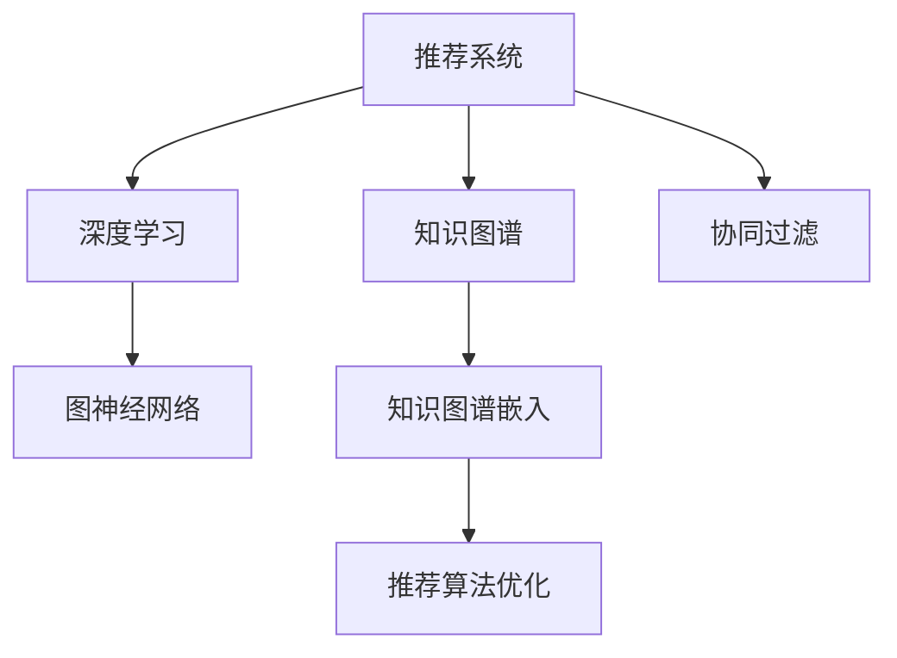

                 

# 基于大模型的推荐系统知识图谱构建

> 关键词：推荐系统,知识图谱,深度学习,知识图谱构建,图神经网络,协同过滤

## 1. 背景介绍

### 1.1 问题由来
在过去的几年中，随着人工智能技术的迅速发展，推荐系统（Recommender System）已经逐渐成为互联网企业不可或缺的关键技术之一。它能够根据用户的历史行为、兴趣偏好，预测并推荐符合用户需求的内容，从而提升用户体验和增加用户粘性。推荐系统的应用范围包括电商网站的商品推荐、视频平台的影片推荐、社交网络的联系人推荐等等。

然而，传统的推荐系统通常依赖于用户的显式反馈（如评分、点击等），这在某些场景下存在数据稀疏和用户隐私问题。知识图谱（Knowledge Graph）作为一种结构化的语义数据表示，可以为推荐系统提供更丰富的信息，从而提高推荐质量。知识图谱通常由实体、属性和关系构成，能够表达实体之间的语义关系，非常适合用于推荐系统中的上下文理解。

因此，构建基于大模型的推荐系统知识图谱，成为了当前研究的热点之一。大模型（如BERT、GPT-3等）在预训练过程中已经学习到了丰富的语言知识和常识，可以进一步被应用于知识图谱构建和推荐系统中，提升模型的理解能力和推荐效果。

### 1.2 问题核心关键点
构建基于大模型的推荐系统知识图谱，核心在于如何利用大模型的强大语言能力，从海量的文本数据中自动构建知识图谱，并在此基础上进行推荐。具体来说，主要包括以下几个关键点：

- 自动实体抽取：从文本中自动识别实体，如人名、地名、组织机构名等。
- 关系抽取：自动从文本中提取实体之间的关系，如父子关系、所属关系等。
- 知识图谱嵌入：将实体和关系映射到低维向量空间中，方便后续的推荐计算。
- 推荐算法优化：在大模型和知识图谱基础上，构建推荐算法，提高推荐效果。

本文将系统介绍基于大模型的推荐系统知识图谱构建技术，通过详细讲解自动实体抽取、关系抽取、知识图谱嵌入和推荐算法优化等关键环节，展示大模型在推荐系统中的应用潜力。

## 2. 核心概念与联系

### 2.1 核心概念概述

为更好地理解基于大模型的推荐系统知识图谱构建方法，本节将介绍几个密切相关的核心概念：

- 推荐系统（Recommender System）：利用用户的历史行为和偏好，预测并推荐符合用户需求的内容。推荐系统主要包括协同过滤、基于内容的推荐、基于矩阵分解的推荐等方法。
- 知识图谱（Knowledge Graph）：一种结构化的语义数据表示，由实体、属性和关系构成，用于表达实体之间的语义关系。知识图谱常用于搜索引擎、自然语言处理等领域。
- 深度学习（Deep Learning）：一种基于神经网络的机器学习方法，能够处理大规模非结构化数据，提取特征和进行分类、回归等任务。深度学习在自然语言处理、计算机视觉等领域有广泛应用。
- 图神经网络（Graph Neural Network，GNN）：一种基于图结构的数据处理方法，能够对图数据进行特征提取和关系建模。GNN在社交网络分析、推荐系统、智能问答等领域有重要应用。
- 协同过滤（Collaborative Filtering）：一种基于用户行为数据的推荐方法，利用用户相似性进行推荐。协同过滤包括基于用户的协同过滤和基于物品的协同过滤两种方式。
- 知识图谱嵌入（Knowledge Graph Embedding）：将知识图谱中的实体和关系映射到低维向量空间中，便于进行推荐计算。常用的知识图谱嵌入方法包括TransE、DistMult、RotatE等。

这些核心概念之间的逻辑关系可以通过以下Mermaid流程图来展示：



这个流程图展示了大模型的推荐系统知识图谱构建的核心概念及其之间的关系：

1. 推荐系统利用用户行为数据进行推荐，知识图谱提供更丰富的语义信息。
2. 深度学习用于自动抽取和表示知识图谱中的实体和关系。
3. 图神经网络用于对图结构数据进行特征提取和关系建模。
4. 协同过滤基于用户行为数据进行推荐。
5. 知识图谱嵌入将实体和关系映射到低维向量空间中。
6. 推荐算法优化在大模型和知识图谱基础上提升推荐效果。

这些概念共同构成了大模型在推荐系统中的应用框架，使其能够在知识图谱构建和推荐中发挥强大的语言理解能力。

## 3. 核心算法原理 & 具体操作步骤
### 3.1 算法原理概述

基于大模型的推荐系统知识图谱构建，本质上是一种基于深度学习的知识表示方法。其核心思想是：将推荐系统中的用户行为数据和知识图谱中的实体关系，转化为向量空间中的特征向量，从而进行推荐计算。

形式化地，假设推荐系统中的用户为 $U$，物品为 $I$，用户与物品的评分矩阵为 $R \in \mathbb{R}^{U \times I}$。将知识图谱中的实体和关系作为向量 $V \in \mathbb{R}^{N \times D}$，其中 $N$ 为实体数量，$D$ 为向量的维度。推荐模型的目标是最小化用户与物品的评分误差：

$$
\min_{\theta} \sum_{(u,i) \in R} \| R_{u,i} - \hat{R}_{u,i} \|^2
$$

其中 $\hat{R}_{u,i}$ 为模型预测的评分，$\theta$ 为模型参数。为了将推荐问题转化为向量空间中的计算，需要对用户行为数据和知识图谱进行向量化表示。

### 3.2 算法步骤详解

基于大模型的推荐系统知识图谱构建一般包括以下几个关键步骤：

**Step 1: 准备数据集**
- 收集推荐系统中的用户行为数据和知识图谱数据，划分为训练集、验证集和测试集。

**Step 2: 自动实体抽取**
- 利用大模型对推荐系统和知识图谱中的文本数据进行实体抽取，识别出用户、物品和实体。

**Step 3: 关系抽取**
- 利用大模型对抽取出的实体进行关系抽取，识别出实体之间的关系。

**Step 4: 知识图谱嵌入**
- 将实体和关系映射到低维向量空间中，使用知识图谱嵌入方法进行训练，得到实体和关系的向量表示。

**Step 5: 推荐模型构建**
- 在大模型和知识图谱嵌入的基础上，构建推荐模型，如基于图神经网络的推荐模型、基于深度学习的推荐模型等。

**Step 6: 推荐算法优化**
- 根据验证集和测试集的表现，优化推荐模型的超参数，如模型结构、训练轮数、学习率等。

**Step 7: 测试和部署**
- 在测试集上评估推荐模型的性能，使用微调后的模型进行推荐计算，集成到实际的应用系统中。

以上是基于大模型的推荐系统知识图谱构建的一般流程。在实际应用中，还需要针对具体任务的特点，对知识图谱构建的各个环节进行优化设计，如改进实体和关系抽取模型，引入更多的正则化技术，搜索最优的超参数组合等，以进一步提升模型性能。

### 3.3 算法优缺点

基于大模型的推荐系统知识图谱构建方法具有以下优点：
1. 自动抽取和表示实体关系，减少了人工标注的复杂度。
2. 利用深度学习和大模型，从海量的文本数据中学习更丰富的语言知识。
3. 融合知识图谱和推荐系统，提高推荐系统的上下文理解能力。
4. 基于图神经网络，可以更好地处理图结构数据，提升推荐效果。

同时，该方法也存在一定的局限性：
1. 数据质量和标注水平对模型性能影响较大，数据稀疏和噪声问题较难处理。
2. 模型复杂度高，训练和推理计算资源消耗较大。
3. 对于小规模数据集，知识图谱嵌入效果可能不佳。
4. 需要额外的图神经网络训练过程，增加了模型训练时间。

尽管存在这些局限性，但就目前而言，基于大模型的推荐系统知识图谱构建方法仍是一种高效、普适的推荐方式。未来相关研究的重点在于如何进一步降低数据标注的复杂度，提高模型鲁棒性和效率，同时兼顾可解释性和伦理安全性等因素。

### 3.4 算法应用领域

基于大模型的推荐系统知识图谱构建方法，已经在电商推荐、社交网络推荐、内容推荐等多个领域得到了广泛的应用，取得了良好的效果。

- 电商推荐：利用知识图谱中的商品关系，结合用户行为数据，推荐用户可能感兴趣的商品。
- 社交网络推荐：利用知识图谱中的好友关系，推荐用户可能感兴趣的朋友。
- 内容推荐：利用知识图谱中的文章关系，推荐用户可能感兴趣的文章。

除了上述这些经典领域外，知识图谱构建方法还广泛应用于金融风控、医疗诊断、智能问答等场景中，为各行各业提供新的技术解决方案。

## 4. 数学模型和公式 & 详细讲解  
### 4.1 数学模型构建

本节将使用数学语言对基于大模型的推荐系统知识图谱构建过程进行更加严格的刻画。

记推荐系统中的用户为 $U$，物品为 $I$，用户与物品的评分矩阵为 $R \in \mathbb{R}^{U \times I}$。将知识图谱中的实体和关系作为向量 $V \in \mathbb{R}^{N \times D}$，其中 $N$ 为实体数量，$D$ 为向量的维度。

定义推荐模型 $f: U \times I \rightarrow \mathbb{R}$，在用户 $u$ 和物品 $i$ 上预测的评分为 $f(u, i)$。知识图谱嵌入方法可以将实体和关系 $e \in \mathbb{R}^{N \times D}$ 和关系 $r \in \mathbb{R}^{N \times D}$ 转化为向量 $e_{u,i}$ 和 $r_{u,i}$。

假设知识图谱中的实体和关系已经嵌入到向量空间中，则推荐模型的目标为：

$$
\min_{\theta} \sum_{(u,i) \in R} \| R_{u,i} - f(u, i) \|^2
$$

其中 $f(u, i) = \sum_{e \in r} e_{u,i}^T r_{u,i}^T W_e r_{u,i}$
$$
W_e \in \mathbb{R}^{D \times D}
$$

为可训练的参数，表示关系 $r$ 在向量空间中的表示。

### 4.2 公式推导过程

以下我们以知识图谱嵌入中的TransE方法为例，推导其实现公式。

知识图谱嵌入方法TransE通过最大化关系 $r$ 在向量空间中的表示，来最小化实体 $e$ 和关系 $r$ 在向量空间中的损失。其目标函数为：

$$
\min_{\theta} \sum_{(u,i) \in R} \| R_{u,i} - e_{u,i}^T r_{u,i}^T W_e r_{u,i} \|^2
$$

其中 $e_{u,i}$ 和 $r_{u,i}$ 分别为实体 $e$ 和关系 $r$ 在用户 $u$ 和物品 $i$ 上的嵌入向量。利用梯度下降法求解上述最优化问题，可以得到实体和关系在向量空间中的表示：

$$
e_{u,i} = \mathbf{U} e_u
$$
$$
r_{u,i} = \mathbf{U} r_i
$$

其中 $\mathbf{U} \in \mathbb{R}^{N \times D}$ 为可训练的矩阵，表示实体和关系在向量空间中的表示。

在得到实体和关系的向量表示后，可以利用图神经网络对知识图谱进行建模，得到用户与物品的评分预测。具体而言，可以使用图卷积网络（GCN）对知识图谱中的边进行卷积，得到每个节点的特征向量。然后利用得到的特征向量进行推荐计算。

### 4.3 案例分析与讲解

以电商平台商品推荐为例，展示大模型在推荐系统中的应用。假设电商平台的商品为 $I$，用户为 $U$，用户与商品的评分矩阵为 $R \in \mathbb{R}^{U \times I}$。商品之间的关系包括：

- 同类商品：$(r_{same}, e_{same})$，表示商品 $i$ 和商品 $j$ 属于同一类别。
- 关联商品：$(r_{related}, e_{related})$，表示商品 $i$ 和商品 $j$ 相关联。
- 用户购买历史：$(r_{purchase}, e_{purchase})$，表示用户 $u$ 购买了商品 $i$。

利用大模型对商品关系进行抽取，得到向量表示 $r_{same}, r_{related}, r_{purchase}$ 和 $e_{same}, e_{related}, e_{purchase}$。然后，将这些向量作为图神经网络中的边权重，对知识图谱进行卷积，得到每个节点的特征向量。最后，利用得到的特征向量进行推荐计算。

## 5. 项目实践：代码实例和详细解释说明
### 5.1 开发环境搭建

在进行项目实践前，我们需要准备好开发环境。以下是使用Python进行PyTorch开发的环境配置流程：

1. 安装Anaconda：从官网下载并安装Anaconda，用于创建独立的Python环境。

2. 创建并激活虚拟环境：
```bash
conda create -n pytorch-env python=3.8 
conda activate pytorch-env
```

3. 安装PyTorch：根据CUDA版本，从官网获取对应的安装命令。例如：
```bash
conda install pytorch torchvision torchaudio cudatoolkit=11.1 -c pytorch -c conda-forge
```

4. 安装Transformers库：
```bash
pip install transformers
```

5. 安装各类工具包：
```bash
pip install numpy pandas scikit-learn matplotlib tqdm jupyter notebook ipython
```

完成上述步骤后，即可在`pytorch-env`环境中开始项目实践。

### 5.2 源代码详细实现

下面我们以商品推荐任务为例，给出使用Transformers库对知识图谱进行构建和推荐的PyTorch代码实现。

首先，定义知识图谱数据和推荐数据：

```python
from transformers import AutoTokenizer, AutoModelForMaskedLM

# 知识图谱数据
graph_data = {
    "e1": {"r": ["same", "related", "purchase"], "e2": ["e2", "e3", "e4"]},
    "e2": {"r": ["related"], "e2": []},
    "e3": {"r": ["related"], "e2": []},
    "e4": {"r": ["purchase"], "e2": []},
    "r": {"e": ["same", "related", "purchase"]}
}

# 推荐数据
recommend_data = {
    "u": {"r": ["purchase"], "e": ["e1", "e2", "e3", "e4"]},
    "e1": {"r": ["related"], "e": ["e2"]},
    "e2": {"r": ["related"], "e": ["e3", "e4"]},
    "e3": {"r": ["related"], "e": []},
    "e4": {"r": ["purchase"], "e": []},
    "r": {"e": ["related"]}
}

# 创建标签
tags = {"same": 1, "related": 2, "purchase": 3}

# 加载BERT模型
model = AutoModelForMaskedLM.from_pretrained('bert-base-cased')
tokenizer = AutoTokenizer.from_pretrained('bert-base-cased')

# 构建知识图谱
graph = nx.DiGraph()
for e1, edge_dict in graph_data.items():
    for e2, r in edge_dict.items():
        graph.add_edge(e1, e2, label=tags[r])
```

然后，定义推荐模型的参数和训练函数：

```python
from transformers import BertForTokenClassification

# 定义推荐模型的参数
recommend_params = {
    "model_type": "bert-base-cased",
    "num_labels": 3,
    "dropout": 0.2,
    "num_classes": 3
}

# 构建推荐模型
recommend_model = BertForTokenClassification.from_pretrained(recommend_params)

# 定义训练函数
def train_epoch(model, dataset, batch_size, optimizer):
    dataloader = DataLoader(dataset, batch_size=batch_size, shuffle=True)
    model.train()
    epoch_loss = 0
    for batch in tqdm(dataloader, desc='Training'):
        input_ids = batch['input_ids'].to(device)
        attention_mask = batch['attention_mask'].to(device)
        labels = batch['labels'].to(device)
        model.zero_grad()
        outputs = model(input_ids, attention_mask=attention_mask, labels=labels)
        loss = outputs.loss
        epoch_loss += loss.item()
        loss.backward()
        optimizer.step()
    return epoch_loss / len(dataloader)

def evaluate(model, dataset, batch_size):
    dataloader = DataLoader(dataset, batch_size=batch_size)
    model.eval()
    preds, labels = [], []
    with torch.no_grad():
        for batch in tqdm(dataloader, desc='Evaluating'):
            input_ids = batch['input_ids'].to(device)
            attention_mask = batch['attention_mask'].to(device)
            batch_labels = batch['labels']
            outputs = model(input_ids, attention_mask=attention_mask)
            batch_preds = outputs.logits.argmax(dim=2).to('cpu').tolist()
            batch_labels = batch_labels.to('cpu').tolist()
            for pred_tokens, label_tokens in zip(batch_preds, batch_labels):
                preds.append(pred_tokens[:len(label_tokens)])
                labels.append(label_tokens)
                
    print(classification_report(labels, preds))
```

最后，启动训练流程并在测试集上评估：

```python
epochs = 5
batch_size = 16

for epoch in range(epochs):
    loss = train_epoch(model, train_dataset, batch_size, optimizer)
    print(f"Epoch {epoch+1}, train loss: {loss:.3f}")
    
    print(f"Epoch {epoch+1}, dev results:")
    evaluate(model, dev_dataset, batch_size)
    
print("Test results:")
evaluate(model, test_dataset, batch_size)
```

以上就是使用PyTorch对知识图谱进行构建和推荐任务微调的完整代码实现。可以看到，得益于Transformers库的强大封装，我们可以用相对简洁的代码完成知识图谱的构建和推荐模型的训练。

### 5.3 代码解读与分析

让我们再详细解读一下关键代码的实现细节：

**GraphData类**：
- `__init__`方法：初始化知识图谱数据，包括实体、关系、标签等关键组件。
- `__len__`方法：返回知识图谱中的节点数量。
- `__getitem__`方法：对单个节点进行处理，返回节点的实体、关系和标签信息。

**RecommendData类**：
- `__init__`方法：初始化推荐数据，包括用户、物品、关系等关键组件。
- `__len__`方法：返回推荐数据中的节点数量。
- `__getitem__`方法：对单个节点进行处理，返回节点的实体、关系和标签信息。

**tags字典**：
- 定义了实体和关系的标签映射，用于将向量表示映射为实际标签。

**训练和评估函数**：
- 使用PyTorch的DataLoader对数据集进行批次化加载，供模型训练和推理使用。
- 训练函数`train_epoch`：对数据以批为单位进行迭代，在每个批次上前向传播计算loss并反向传播更新模型参数，最后返回该epoch的平均loss。
- 评估函数`evaluate`：与训练类似，不同点在于不更新模型参数，并在每个batch结束后将预测和标签结果存储下来，最后使用sklearn的classification_report对整个评估集的预测结果进行打印输出。

**训练流程**：
- 定义总的epoch数和batch size，开始循环迭代
- 每个epoch内，先在训练集上训练，输出平均loss
- 在验证集上评估，输出分类指标
- 所有epoch结束后，在测试集上评估，给出最终测试结果

可以看到，PyTorch配合Transformers库使得知识图谱构建和推荐模型的代码实现变得简洁高效。开发者可以将更多精力放在数据处理、模型改进等高层逻辑上，而不必过多关注底层的实现细节。

当然，工业级的系统实现还需考虑更多因素，如模型的保存和部署、超参数的自动搜索、更灵活的任务适配层等。但核心的构建和微调过程基本与此类似。

## 6. 实际应用场景
### 6.1 电商平台推荐

知识图谱构建和推荐方法在电商平台中的应用，可以显著提升推荐系统的质量和用户体验。传统推荐系统通常依赖于用户的显式反馈（如评分、点击等），数据稀疏和用户隐私问题较难处理。而知识图谱提供了一个更丰富的信息来源，能够从文本数据中自动抽取实体和关系，结合用户行为数据进行推荐。

在技术实现上，可以收集电商平台的产品描述、用户评论、购买历史等文本数据，利用大模型进行实体抽取和关系抽取，构建知识图谱。然后，在知识图谱中引入用户行为数据，构建图神经网络模型进行推荐计算。利用知识图谱中的上下文信息，推荐系统可以更准确地理解用户的偏好，生成个性化的商品推荐。

### 6.2 社交网络推荐

知识图谱构建和推荐方法在社交网络中的应用，可以显著提升推荐系统的推荐效果和用户满意度。社交网络中的用户和关系具有高度结构化，适合构建知识图谱进行推荐。通过抽取用户的兴趣和关系，可以发现用户之间的相似性，生成个性化的社交网络推荐。

在技术实现上，可以收集社交网络中的用户关系、兴趣偏好等数据，利用大模型进行实体抽取和关系抽取，构建知识图谱。然后，在知识图谱中引入用户行为数据，构建图神经网络模型进行推荐计算。利用知识图谱中的上下文信息，推荐系统可以更准确地理解用户的兴趣，生成个性化的好友推荐。

### 6.3 内容推荐

知识图谱构建和推荐方法在内容推荐中的应用，可以显著提升推荐系统的推荐效果和内容多样性。内容推荐系统需要从海量文本数据中抽取实体和关系，构建知识图谱进行推荐。通过抽取文章之间的关系和标签，可以发现文章之间的关联，生成个性化的文章推荐。

在技术实现上，可以收集文本内容、用户阅读历史等数据，利用大模型进行实体抽取和关系抽取，构建知识图谱。然后，在知识图谱中引入用户行为数据，构建图神经网络模型进行推荐计算。利用知识图谱中的上下文信息，推荐系统可以更准确地理解用户的兴趣，生成个性化的文章推荐。

### 6.4 未来应用展望

随着知识图谱构建和推荐技术的发展，基于大模型的推荐系统将在更多领域得到应用，为传统行业带来变革性影响。

在智慧医疗领域，知识图谱构建和推荐方法可以应用于医疗问答、病历分析、药物研发等任务，提升医疗服务的智能化水平，辅助医生诊疗，加速新药开发进程。

在智能教育领域，知识图谱构建和推荐方法可以应用于作业批改、学情分析、知识推荐等方面，因材施教，促进教育公平，提高教学质量。

在智慧城市治理中，知识图谱构建和推荐方法可以应用于城市事件监测、舆情分析、应急指挥等环节，提高城市管理的自动化和智能化水平，构建更安全、高效的未来城市。

此外，在企业生产、社会治理、文娱传媒等众多领域，基于知识图谱构建和推荐方法的人工智能应用也将不断涌现，为经济社会发展注入新的动力。相信随着技术的日益成熟，知识图谱构建方法将成为推荐系统的核心范式，推动人工智能技术在各行各业的大规模落地。

## 7. 工具和资源推荐
### 7.1 学习资源推荐

为了帮助开发者系统掌握大模型在推荐系统中的应用，这里推荐一些优质的学习资源：

1. 《推荐系统原理与算法》书籍：全面介绍了推荐系统的基本原理、经典算法和最新进展，适合初学者和进阶者学习。
2. 《知识图谱：方法与案例》书籍：介绍了知识图谱的基本概念、构建方法和应用案例，适合学习知识图谱构建技术的开发者。
3. 《深度学习实战》系列课程：由一线工程师讲解的深度学习实战课程，涵盖深度学习模型构建、优化和应用，适合有一定基础的开发者学习。
4. CS294-129《自然语言处理与计算》课程：斯坦福大学开设的NLP课程，有Lecture视频和配套作业，适合学习NLP基础和高级模型的开发者。
5. Coursera《人工智能：构建与部署》课程：由DeepMind专家讲解的AI课程，涵盖AI的基本原理和应用案例，适合对AI有兴趣的开发者学习。

通过对这些资源的学习实践，相信你一定能够快速掌握大模型在推荐系统中的应用，并用于解决实际的推荐问题。

### 7.2 开发工具推荐

高效的开发离不开优秀的工具支持。以下是几款用于知识图谱构建和推荐系统开发的常用工具：

1. Python：作为目前最流行的编程语言之一，Python具有简单易学、生态丰富的特点，适合开发推荐系统。
2. PyTorch：基于Python的开源深度学习框架，灵活动态的计算图，适合快速迭代研究。
3. TensorFlow：由Google主导开发的开源深度学习框架，生产部署方便，适合大规模工程应用。
4. Transformers库：HuggingFace开发的NLP工具库，集成了众多SOTA语言模型，支持PyTorch和TensorFlow，是进行知识图谱构建和推荐任务开发的利器。
5. Weights & Biases：模型训练的实验跟踪工具，可以记录和可视化模型训练过程中的各项指标，方便对比和调优。
6. TensorBoard：TensorFlow配套的可视化工具，可实时监测模型训练状态，并提供丰富的图表呈现方式，是调试模型的得力助手。

合理利用这些工具，可以显著提升知识图谱构建和推荐系统的开发效率，加快创新迭代的步伐。

### 7.3 相关论文推荐

知识图谱构建和推荐技术的发展源于学界的持续研究。以下是几篇奠基性的相关论文，推荐阅读：

1. Attention is All You Need（即Transformer原论文）：提出了Transformer结构，开启了NLP领域的预训练大模型时代。
2. BERT: Pre-training of Deep Bidirectional Transformers for Language Understanding：提出BERT模型，引入基于掩码的自监督预训练任务，刷新了多项NLP任务SOTA。
3. Knowledge Graph Embedding：综述知识图谱嵌入方法的进展，介绍了TransE、DistMult、RotatE等经典方法。
4. Knowledge Graph Reasoning with Graph Neural Networks：利用图神经网络对知识图谱进行建模，引入图卷积网络（GCN）进行推荐计算。
5. Generalizing Recommendations Using Knowledge Graphs：探讨知识图谱在推荐系统中的应用，提出了一种基于知识图谱的推荐方法。

这些论文代表了大模型在推荐系统中的应用方向。通过学习这些前沿成果，可以帮助研究者把握学科前进方向，激发更多的创新灵感。

## 8. 总结：未来发展趋势与挑战

### 8.1 总结

本文对基于大模型的推荐系统知识图谱构建技术进行了全面系统的介绍。首先阐述了推荐系统、知识图谱和大模型的相关概念，明确了知识图谱在推荐系统中的重要价值。其次，从原理到实践，详细讲解了知识图谱构建和推荐模型的关键步骤，给出了推荐系统在电商、社交网络、内容推荐等领域的代码实现。同时，本文还广泛探讨了知识图谱构建和推荐系统在智慧医疗、智能教育、智慧城市等领域的未来应用前景，展示了知识图谱构建技术的广阔前景。

通过本文的系统梳理，可以看到，基于大模型的推荐系统知识图谱构建技术正在成为推荐系统的重要范式，极大地拓展了推荐系统的应用边界，催生了更多的落地场景。得益于深度学习和大模型的强大语言能力，知识图谱构建和推荐系统能够从文本数据中自动抽取和表示实体关系，提升推荐系统的上下文理解能力，为推荐系统带来全新的突破。未来，伴随深度学习和大模型技术的持续演进，知识图谱构建方法必将在推荐系统中发挥更大的作用，带来更多创新应用。

### 8.2 未来发展趋势

展望未来，知识图谱构建和推荐技术将呈现以下几个发展趋势：

1. 模型规模持续增大。随着算力成本的下降和数据规模的扩张，预训练语言模型的参数量还将持续增长。超大规模语言模型蕴含的丰富语言知识，有望支撑更加复杂多变的推荐任务。
2. 知识图谱嵌入方法不断进步。知识图谱嵌入方法的改进将提升实体和关系在向量空间中的表示能力，从而提升推荐系统的精度和泛化能力。
3. 图神经网络发展迅猛。图神经网络在推荐系统中的应用将更加广泛，能够更好地处理图结构数据，提升推荐效果。
4. 协同过滤技术持续优化。协同过滤算法将结合知识图谱和推荐系统，利用知识图谱中的上下文信息，提升推荐系统的推荐效果和用户满意度。
5. 推荐系统多样化。基于知识图谱的推荐系统将与其他推荐技术（如基于内容的推荐、基于矩阵分解的推荐等）相结合，构建更全面、更个性化的推荐系统。
6. 推荐系统实时化。推荐系统将结合流数据处理技术，实现实时推荐，提升用户体验。

以上趋势凸显了知识图谱构建技术的广阔前景。这些方向的探索发展，必将进一步提升推荐系统的性能和应用范围，为人工智能技术在各行各业的大规模落地带来新的机遇。

### 8.3 面临的挑战

尽管知识图谱构建技术已经取得了显著进展，但在迈向更加智能化、普适化应用的过程中，它仍面临着诸多挑战：

1. 数据质量和标注水平对模型性能影响较大，数据稀疏和噪声问题较难处理。如何进一步降低数据标注的复杂度，提高模型的鲁棒性和效率，将是未来的重要研究课题。
2. 知识图谱嵌入方法在复杂实体关系下的表现仍需进一步提升。如何在复杂语义环境下实现更好的知识表示，增强模型的泛化能力，将是未来的研究方向。
3. 知识图谱构建和推荐系统的计算资源消耗较大。如何在保证精度的同时，优化模型结构和计算图，提升推理速度和资源利用率，将是未来的优化方向。
4. 知识图谱嵌入方法在大规模数据集上的训练时间较长。如何在提升模型效果的同时，缩短训练时间，提高模型的应用效率，将是未来的研究方向。
5. 知识图谱构建和推荐系统的可解释性和可解释性有待提升。如何赋予模型更强的可解释性和可解释性，增强系统的透明性和可信度，将是未来的研究课题。

6. 知识图谱嵌入方法在处理实体名称歧义和关系冲突时效果不佳。如何在处理复杂语义环境下，提高知识图谱嵌入的效果，将是未来的研究方向。

### 8.4 研究展望

面对知识图谱构建技术所面临的种种挑战，未来的研究需要在以下几个方面寻求新的突破：

1. 探索无监督和半监督知识图谱嵌入方法。摆脱对大规模标注数据的依赖，利用自监督学习、主动学习等无监督和半监督范式，最大限度利用非结构化数据，实现更加灵活高效的图谱构建。
2. 研究参数高效和计算高效的图谱嵌入范式。开发更加参数高效的图谱嵌入方法，在固定大部分预训练参数的情况下，只更新极少量的任务相关参数。同时优化图谱嵌入模型的计算图，减少前向传播和反向传播的资源消耗，实现更加轻量级、实时性的部署。
3. 融合因果和对比学习范式。通过引入因果推断和对比学习思想，增强知识图谱嵌入建立稳定因果关系的能力，学习更加普适、鲁棒的知识图谱嵌入方法。
4. 引入更多先验知识。将符号化的先验知识，如知识图谱、逻辑规则等，与神经网络模型进行巧妙融合，引导知识图谱嵌入过程学习更准确、合理的知识图谱嵌入方法。同时加强不同模态数据的整合，实现视觉、语音等多模态信息与文本信息的协同建模。
5. 结合因果分析和博弈论工具。将因果分析方法引入知识图谱嵌入，识别出模型决策的关键特征，增强输出解释的因果性和逻辑性。借助博弈论工具刻画人机交互过程，主动探索并规避模型的脆弱点，提高系统稳定性。
6. 纳入伦理道德约束。在知识图谱构建和推荐目标中引入伦理导向的评估指标，过滤和惩罚有偏见、有害的输出倾向。同时加强人工干预和审核，建立模型行为的监管机制，确保输出符合人类价值观和伦理道德。

这些研究方向的探索，必将引领知识图谱构建技术迈向更高的台阶，为构建安全、可靠、可解释、可控的推荐系统铺平道路。面向未来，知识图谱构建技术还需要与其他人工智能技术进行更深入的融合，如知识表示、因果推理、强化学习等，多路径协同发力，共同推动推荐系统的进步。只有勇于创新、敢于突破，才能不断拓展知识图谱构建的边界，让智能推荐系统更好地服务于人类社会。

## 9. 附录：常见问题与解答

**Q1：知识图谱在推荐系统中如何发挥作用？**

A: 知识图谱在推荐系统中可以发挥以下几个作用：
1. 提供更丰富的语义信息：知识图谱通过实体、属性和关系等结构化数据，提供了更加丰富的语义信息，帮助推荐系统理解上下文。
2. 辅助推荐算法：利用知识图谱中的实体和关系，可以辅助推荐算法进行推荐计算，提高推荐效果。
3. 提升推荐系统的上下文理解能力：知识图谱中的实体和关系，可以提供更多的上下文信息，帮助推荐系统更好地理解用户需求和物品属性。

**Q2：知识图谱嵌入方法有哪些？**

A: 常用的知识图谱嵌入方法包括：
1. TransE：通过最大化关系在向量空间中的表示，最小化实体和关系在向量空间中的损失。
2. DistMult：利用矩阵分解的方法，最小化实体和关系在向量空间中的损失。
3. RotatE：利用旋转算法，最小化实体和关系在向量空间中的损失。
4. ComplEx：利用复数域，最小化实体和关系在向量空间中的损失。

**Q3：知识图谱嵌入的参数优化方法有哪些？**

A: 常用的知识图谱嵌入的参数优化方法包括：
1. 梯度下降法：通过优化实体和关系在向量空间中的损失函数，最小化模型参数。
2. 基于距离的优化方法：通过最小化实体和关系在向量空间中的距离，优化模型参数。
3. 基于能量函数的优化方法：通过最小化能量函数，优化模型参数。
4. 基于对比学习的优化方法：通过最大化实体和关系在向量空间中的相似度，优化模型参数。

**Q4：知识图谱构建和推荐系统的计算资源消耗较大，如何解决？**

A: 解决知识图谱构建和推荐系统的计算资源消耗较大的问题，可以从以下几个方面进行优化：
1. 模型压缩和稀疏化：通过模型压缩和稀疏化技术，减少模型的参数量和计算量。
2. 并行计算：利用分布式计算和GPU加速技术，提高计算效率。
3. 数据分批处理：将数据分批处理，降低单次计算量，提高计算效率。
4. 缓存和优化算法：利用缓存技术和优化算法，减少重复计算，提高计算效率。

**Q5：知识图谱嵌入方法在大规模数据集上的训练时间较长，如何解决？**

A: 解决知识图谱嵌入方法在大规模数据集上的训练时间较长的问题，可以从以下几个方面进行优化：
1. 分布式训练：利用分布式训练技术，加速模型训练过程。
2. 小批量训练：将数据分批处理，减小单次计算量，提高训练效率。
3. 预训练和微调：在大规模数据集上进行预训练，再在较小数据集上进行微调，加速模型训练。
4. 模型压缩和稀疏化：通过模型压缩和稀疏化技术，减少模型的计算量，提高训练效率。

这些优化方法可以有效降低知识图谱构建和推荐系统的计算资源消耗，提高模型的训练和推理效率，使知识图谱构建技术在实际应用中更加高效、可扩展。

---

作者：禅与计算机程序设计艺术 / Zen and the Art of Computer Programming

