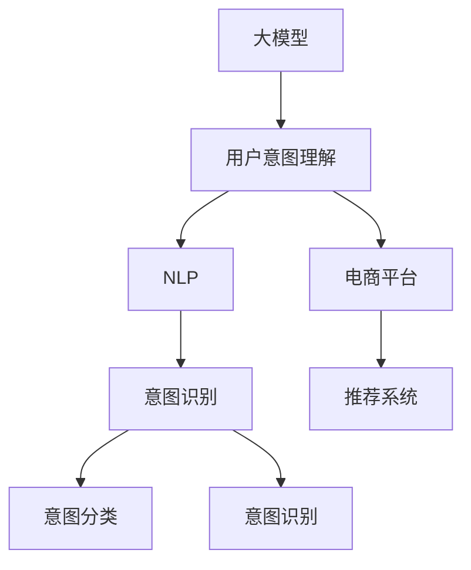

                 

# 基于大模型的电商平台用户意图理解

> 关键词：大模型,用户意图理解,自然语言处理(NLP),电商平台,深度学习,意图识别,推荐系统

## 1. 背景介绍

### 1.1 问题由来
电商平台作为现代社会的重要组成部分，已经从传统的商品展示平台发展为集购物、社交、娱乐为一体的综合型服务体系。随着互联网技术的不断进步和用户需求的多样化，如何理解用户意图，提供精准的商品推荐和个性化服务，成为电商平台的核心竞争力之一。

传统的用户意图理解依赖于基于规则的文本分类和特征工程，但随着用户行为模式的多样化和语义表达的复杂化，这些方法逐渐难以满足需求。而大模型，特别是基于Transformer结构的语言模型，如BERT、GPT-3等，通过在大规模无标签文本数据上进行自监督预训练，能够学习到丰富的语言知识，显著提升了意图识别的性能和泛化能力。

### 1.2 问题核心关键点
大模型在用户意图理解上的优势主要体现在以下几个方面：

1. **语义理解力**：大模型能够理解语言的深层次语义，识别出用户意图中的隐含信息。
2. **泛化能力**：基于预训练的模型能够较好地适应新的用户表述方式和不同领域的数据。
3. **可解释性**：大模型的内部机制可以通过某种方式进行解释，帮助理解模型的决策逻辑。
4. **快速训练**：相比于从头训练，微调大模型能够大大缩短模型训练时间，提高开发效率。

## 2. 核心概念与联系

### 2.1 核心概念概述

为更好地理解大模型在电商平台用户意图理解中的应用，本节将介绍几个关键概念：

- **大模型(Large Model)**：以Transformer等结构为代表的深度学习模型，通过在大规模无标签文本数据上进行预训练，学习到丰富的语言知识，具备强大的语义理解能力。
- **用户意图理解**：通过分析用户输入的文本信息，识别出用户希望完成的任务或获取的信息。
- **自然语言处理(NLP)**：涵盖语言模型、文本分类、序列标注、机器翻译等多种任务，旨在理解和生成自然语言。
- **电商平台**：提供在线购物、交易、社交等综合服务的平台，通过大模型进行用户意图理解，提供更个性化的服务。
- **深度学习**：利用多层神经网络对数据进行抽象和建模，广泛应用于计算机视觉、自然语言处理等领域。
- **意图识别**：识别出用户输入文本背后的真实意图，通常分为意图分类和意图识别两种类型。
- **推荐系统**：通过分析用户历史行为和当前意图，为用户推荐相关商品或服务。

这些概念之间的逻辑关系可以通过以下Mermaid流程图来展示：



这个流程图展示了大模型在电商平台用户意图理解中的核心概念及其之间的关系：

1. 大模型通过预训练获得语言知识。
2. 大模型通过用户意图理解任务，识别用户输入的意图。
3. 用户意图理解任务涉及NLP和电商平台两个概念。
4. 意图识别是用户意图理解任务中的关键步骤。
5. 推荐系统依赖于用户意图理解的结果，为用户提供个性化推荐。

## 3. 核心算法原理 & 具体操作步骤

### 3.1 算法原理概述

基于大模型的用户意图理解，本质上是一个将自然语言转化为机器可执行意图的过程。大模型的语义理解能力使其能够精确地解析和理解用户输入文本，进而识别出其背后的真实意图。

在具体实现中，大模型通常先进行意图分类，即识别出文本所属的意图类别，然后进一步进行意图识别，提取具体的意图表达。意图识别的过程通常需要设计合适的输出层和损失函数，通过对模型的微调，使其能够学习到任务特定的知识。

### 3.2 算法步骤详解

基于大模型的用户意图理解，主要包括以下几个关键步骤：

**Step 1: 准备数据集**
- 收集电商平台用户输入文本数据，如搜索关键词、商品评价、聊天记录等。
- 将数据集划分为训练集、验证集和测试集，标注用户意图。
- 数据标注可以采用人工标注，也可以使用半监督学习技术进行标注。

**Step 2: 选择预训练模型**
- 选择合适的预训练语言模型，如BERT、GPT等。
- 对预训练模型进行微调，调整其输出层以适应意图识别任务。

**Step 3: 定义意图分类**
- 设计意图分类器，输出文本所属的意图类别。
- 设计合适的损失函数，如交叉熵损失，优化意图分类器的参数。

**Step 4: 进行意图识别**
- 设计意图识别器，提取具体的意图表达。
- 对模型进行微调，学习任务特定的知识。
- 设计合适的损失函数，如基于序列标注的损失函数，优化意图识别器的参数。

**Step 5: 测试和部署**
- 在测试集上评估意图分类和识别的性能。
- 使用微调后的模型进行意图分类和识别。
- 将意图分类和识别的结果用于电商平台推荐系统，提供个性化推荐。

### 3.3 算法优缺点

基于大模型的用户意图理解方法具有以下优点：

1. **高性能**：大模型的预训练和微调过程能够显著提升意图识别的性能。
2. **泛化能力强**：大模型能够适应不同领域和任务，提供通用的意图识别能力。
3. **可解释性**：通过解释模型输出的意图表达，能够帮助理解模型的决策过程。
4. **快速部署**：大模型的微调过程可以快速完成，缩短项目开发周期。

同时，该方法也存在一些局限性：

1. **标注成本高**：意图分类和识别任务需要大量的标注数据，标注成本较高。
2. **模型复杂度**：大模型复杂度高，需要较大的计算资源和存储空间。
3. **可解释性不足**：尽管大模型的可解释性较传统方法有所提升，但仍难以完全解释其内部机制。
4. **依赖数据**：模型性能高度依赖于标注数据的质量和数量，标注数据不足可能影响模型效果。

尽管存在这些局限性，但基于大模型的用户意图理解方法在电商平台领域得到了广泛应用，成为提升用户满意度和提升推荐系统性能的重要手段。

### 3.4 算法应用领域

基于大模型的用户意图理解方法在电商平台领域具有广泛的应用前景，包括：

1. **商品推荐**：通过分析用户输入的搜索词和评价文本，识别用户意图，推荐相关商品。
2. **客服机器人**：通过意图分类和识别，提供自动化客户服务，快速响应用户需求。
3. **个性化搜索**：通过用户输入的查询文本，理解用户意图，提供个性化的搜索结果。
4. **商品评价分析**：通过分析用户评价文本，识别出用户的情感倾向，改进商品质量。
5. **广告投放**：通过用户意图理解，优化广告投放策略，提升广告效果。

除了电商平台，大模型的用户意图理解方法还在社交媒体、在线教育、金融科技等领域得到了广泛应用，为这些领域提供了强大的用户意图分析能力。

## 4. 数学模型和公式 & 详细讲解

### 4.1 数学模型构建

假设用户输入文本为 $x$，电商平台的目标是识别出用户意图，并将其转化为一个意图向量 $y$。大模型 $M_{\theta}$ 的输出可以表示为 $y$。

大模型的预训练过程是通过自监督任务学习语言表示。常见的预训练任务包括语言建模、掩码语言模型等。这些任务的目标是最大化预测文本中缺失的单词或句子的概率，从而学习到丰富的语言知识。

大模型的意图识别过程可以表示为：

$$
y = M_{\theta}(x)
$$

其中 $M_{\theta}$ 为预训练大模型，$\theta$ 为其参数。意图分类器的输出可以表示为：

$$
C = \mathop{\arg\max}_{c} P(c|x) = \mathop{\arg\max}_{c} \frac{P(c|y)}{P(y|x)}
$$

其中 $P(c|x)$ 为条件概率，$P(c|y)$ 为给定意图 $y$ 的分类概率，$P(y|x)$ 为给定文本 $x$ 的分类概率。

### 4.2 公式推导过程

对于意图分类，假设意图分类器有 $k$ 个类别，每个类别的概率分布为 $P(c_i|x)$，则意图分类器的损失函数可以表示为：

$$
\mathcal{L}(C) = -\frac{1}{N}\sum_{i=1}^N \log P(c_i|x)
$$

对于意图识别，假设意图识别的输出为 $\overrightarrow{y} = [y_1, y_2, ..., y_n]$，则意图识别器的损失函数可以表示为：

$$
\mathcal{L}(\overrightarrow{y}) = -\frac{1}{N}\sum_{i=1}^N \log P(\overrightarrow{y}|x)
$$

其中 $P(\overrightarrow{y}|x)$ 为给定文本 $x$ 的意图识别概率分布。

### 4.3 案例分析与讲解

假设电商平台用户输入文本为 "我想找一些适合儿童的玩具"，通过大模型进行意图分类，可以识别出用户的意图类别为 "购买商品"。接着，通过意图识别，可以进一步分析出用户的具体需求为 "儿童玩具"。

具体计算过程如下：

1. 用户输入文本 $x = "我想找一些适合儿童的玩具"$
2. 大模型输出意图向量 $y = M_{\theta}(x)$
3. 意图分类器输出意图类别 $C = \mathop{\arg\max}_{c} P(c|y)$
4. 意图识别器输出具体意图 $y = \overrightarrow{y} = [y_1, y_2, ..., y_n]$

在计算过程中，大模型、意图分类器和意图识别器各司其职，共同完成用户意图的理解。

## 5. 项目实践：代码实例和详细解释说明

### 5.1 开发环境搭建

在进行项目实践前，我们需要准备好开发环境。以下是使用Python进行PyTorch开发的环境配置流程：

1. 安装Anaconda：从官网下载并安装Anaconda，用于创建独立的Python环境。

2. 创建并激活虚拟环境：
```bash
conda create -n pytorch-env python=3.8 
conda activate pytorch-env
```

3. 安装PyTorch：根据CUDA版本，从官网获取对应的安装命令。例如：
```bash
conda install pytorch torchvision torchaudio cudatoolkit=11.1 -c pytorch -c conda-forge
```

4. 安装Transformers库：
```bash
pip install transformers
```

5. 安装各类工具包：
```bash
pip install numpy pandas scikit-learn matplotlib tqdm jupyter notebook ipython
```

完成上述步骤后，即可在`pytorch-env`环境中开始项目实践。

### 5.2 源代码详细实现

下面我们以电商平台商品推荐为例，给出使用Transformers库对BERT模型进行意图分类和识别的PyTorch代码实现。

首先，定义意图分类和识别的数据处理函数：

```python
from transformers import BertTokenizer, BertForSequenceClassification, BertForTokenClassification
from torch.utils.data import Dataset
import torch

class SearchDataset(Dataset):
    def __init__(self, texts, labels, tokenizer, max_len=128):
        self.texts = texts
        self.labels = labels
        self.tokenizer = tokenizer
        self.max_len = max_len
        
    def __len__(self):
        return len(self.texts)
    
    def __getitem__(self, item):
        text = self.texts[item]
        label = self.labels[item]
        
        encoding = self.tokenizer(text, return_tensors='pt', max_length=self.max_len, padding='max_length', truncation=True)
        input_ids = encoding['input_ids'][0]
        attention_mask = encoding['attention_mask'][0]
        
        return {'input_ids': input_ids, 
                'attention_mask': attention_mask,
                'labels': label}
        
class ReviewDataset(Dataset):
    def __init__(self, reviews, labels, tokenizer, max_len=128):
        self.reviews = reviews
        self.labels = labels
        self.tokenizer = tokenizer
        self.max_len = max_len
        
    def __len__(self):
        return len(self.reviews)
    
    def __getitem__(self, item):
        review = self.reviews[item]
        label = self.labels[item]
        
        encoding = self.tokenizer(review, return_tensors='pt', max_length=self.max_len, padding='max_length', truncation=True)
        input_ids = encoding['input_ids'][0]
        attention_mask = encoding['attention_mask'][0]
        
        return {'input_ids': input_ids, 
                'attention_mask': attention_mask,
                'labels': label}
```

然后，定义模型和优化器：

```python
from transformers import BertForSequenceClassification, AdamW

model = BertForSequenceClassification.from_pretrained('bert-base-cased', num_labels=5)
optimizer = AdamW(model.parameters(), lr=2e-5)
```

接着，定义训练和评估函数：

```python
from torch.utils.data import DataLoader
from tqdm import tqdm
from sklearn.metrics import classification_report

device = torch.device('cuda') if torch.cuda.is_available() else torch.device('cpu')
model.to(device)

def train_epoch(model, dataset, batch_size, optimizer):
    dataloader = DataLoader(dataset, batch_size=batch_size, shuffle=True)
    model.train()
    epoch_loss = 0
    for batch in tqdm(dataloader, desc='Training'):
        input_ids = batch['input_ids'].to(device)
        attention_mask = batch['attention_mask'].to(device)
        labels = batch['labels'].to(device)
        model.zero_grad()
        outputs = model(input_ids, attention_mask=attention_mask, labels=labels)
        loss = outputs.loss
        epoch_loss += loss.item()
        loss.backward()
        optimizer.step()
    return epoch_loss / len(dataloader)

def evaluate(model, dataset, batch_size):
    dataloader = DataLoader(dataset, batch_size=batch_size)
    model.eval()
    preds, labels = [], []
    with torch.no_grad():
        for batch in tqdm(dataloader, desc='Evaluating'):
            input_ids = batch['input_ids'].to(device)
            attention_mask = batch['attention_mask'].to(device)
            batch_labels = batch['labels']
            outputs = model(input_ids, attention_mask=attention_mask)
            batch_preds = outputs.logits.argmax(dim=2).to('cpu').tolist()
            batch_labels = batch_labels.to('cpu').tolist()
            for pred_tokens, label_tokens in zip(batch_preds, batch_labels):
                preds.append(pred_tokens)
                labels.append(label_tokens)
                
    print(classification_report(labels, preds))
```

最后，启动训练流程并在测试集上评估：

```python
epochs = 5
batch_size = 16

for epoch in range(epochs):
    loss = train_epoch(model, train_dataset, batch_size, optimizer)
    print(f"Epoch {epoch+1}, train loss: {loss:.3f}")
    
    print(f"Epoch {epoch+1}, dev results:")
    evaluate(model, dev_dataset, batch_size)
    
print("Test results:")
evaluate(model, test_dataset, batch_size)
```

以上就是使用PyTorch对BERT进行意图分类和识别的完整代码实现。可以看到，得益于Transformers库的强大封装，我们可以用相对简洁的代码完成BERT模型的加载和微调。

### 5.3 代码解读与分析

让我们再详细解读一下关键代码的实现细节：

**SearchDataset类**：
- `__init__`方法：初始化搜索文本、标签、分词器等关键组件。
- `__len__`方法：返回数据集的样本数量。
- `__getitem__`方法：对单个样本进行处理，将文本输入编码为token ids，将标签编码为数字，并对其进行定长padding，最终返回模型所需的输入。

**ReviewDataset类**：
- `__init__`方法：初始化评价文本、标签、分词器等关键组件。
- `__len__`方法：返回数据集的样本数量。
- `__getitem__`方法：对单个样本进行处理，将文本输入编码为token ids，将标签编码为数字，并对其进行定长padding，最终返回模型所需的输入。

**tag2id和id2tag字典**：
- 定义了标签与数字id之间的映射关系，用于将token-wise的预测结果解码回真实的标签。

**训练和评估函数**：
- 使用PyTorch的DataLoader对数据集进行批次化加载，供模型训练和推理使用。
- 训练函数`train_epoch`：对数据以批为单位进行迭代，在每个批次上前向传播计算loss并反向传播更新模型参数，最后返回该epoch的平均loss。
- 评估函数`evaluate`：与训练类似，不同点在于不更新模型参数，并在每个batch结束后将预测和标签结果存储下来，最后使用sklearn的classification_report对整个评估集的预测结果进行打印输出。

**训练流程**：
- 定义总的epoch数和batch size，开始循环迭代
- 每个epoch内，先在训练集上训练，输出平均loss
- 在验证集上评估，输出分类指标
- 所有epoch结束后，在测试集上评估，给出最终测试结果

可以看到，PyTorch配合Transformers库使得BERT微调的代码实现变得简洁高效。开发者可以将更多精力放在数据处理、模型改进等高层逻辑上，而不必过多关注底层的实现细节。

当然，工业级的系统实现还需考虑更多因素，如模型的保存和部署、超参数的自动搜索、更灵活的任务适配层等。但核心的微调范式基本与此类似。

## 6. 实际应用场景

### 6.1 智能客服系统

基于大模型的用户意图理解技术，可以广泛应用于智能客服系统的构建。传统客服往往需要配备大量人力，高峰期响应缓慢，且一致性和专业性难以保证。而使用意图理解技术，系统能够自动理解用户意图，快速响应用户咨询，用自然流畅的语言解答各类常见问题。

在技术实现上，可以收集企业内部的历史客服对话记录，将问题和最佳答复构建成监督数据，在此基础上对预训练意图理解模型进行微调。微调后的意图理解模型能够自动理解用户意图，匹配最合适的答复模板进行回复。对于客户提出的新问题，还可以接入检索系统实时搜索相关内容，动态组织生成回答。如此构建的智能客服系统，能大幅提升客户咨询体验和问题解决效率。

### 6.2 金融舆情监测

金融机构需要实时监测市场舆论动向，以便及时应对负面信息传播，规避金融风险。传统的人工监测方式成本高、效率低，难以应对网络时代海量信息爆发的挑战。基于大模型的用户意图理解技术，为金融舆情监测提供了新的解决方案。

具体而言，可以收集金融领域相关的新闻、报道、评论等文本数据，并对其进行主题标注和情感标注。在此基础上对预训练语言模型进行微调，使其能够自动判断文本属于何种主题，情感倾向是正面、中性还是负面。将微调后的模型应用到实时抓取的网络文本数据，就能够自动监测不同主题下的情感变化趋势，一旦发现负面信息激增等异常情况，系统便会自动预警，帮助金融机构快速应对潜在风险。

### 6.3 个性化推荐系统

当前的推荐系统往往只依赖用户的历史行为数据进行物品推荐，无法深入理解用户的真实兴趣偏好。基于大模型的用户意图理解技术，个性化推荐系统可以更好地挖掘用户行为背后的语义信息，从而提供更精准、多样的推荐内容。

在实践中，可以收集用户浏览、点击、评论、分享等行为数据，提取和用户交互的物品标题、描述、标签等文本内容。将文本内容作为模型输入，用户的后续行为（如是否点击、购买等）作为监督信号，在此基础上微调预训练语言模型。微调后的模型能够从文本内容中准确把握用户的兴趣点。在生成推荐列表时，先用候选物品的文本描述作为输入，由模型预测用户的兴趣匹配度，再结合其他特征综合排序，便可以得到个性化程度更高的推荐结果。

### 6.4 未来应用展望

随着大模型和用户意图理解技术的不断发展，基于大模型的用户意图理解将在更多领域得到应用，为传统行业带来变革性影响。

在智慧医疗领域，基于用户意图理解的用户咨询、病历分析、药物研发等应用将提升医疗服务的智能化水平，辅助医生诊疗，加速新药开发进程。

在智能教育领域，用户意图理解技术可应用于作业批改、学情分析、知识推荐等方面，因材施教，促进教育公平，提高教学质量。

在智慧城市治理中，用户意图理解技术可应用于城市事件监测、舆情分析、应急指挥等环节，提高城市管理的自动化和智能化水平，构建更安全、高效的未来城市。

此外，在企业生产、社会治理、文娱传媒等众多领域，基于大模型的用户意图理解技术也将不断涌现，为这些领域提供了强大的用户意图分析能力。相信随着技术的日益成熟，用户意图理解技术将成为人工智能技术落地应用的重要手段，推动人工智能技术在更广泛的领域得到应用。

## 7. 工具和资源推荐

### 7.1 学习资源推荐

为了帮助开发者系统掌握大模型在用户意图理解中的应用，这里推荐一些优质的学习资源：

1. 《Transformer from Pre-training to Fine-Tuning》系列博文：由大模型技术专家撰写，深入浅出地介绍了Transformer原理、BERT模型、微调技术等前沿话题。

2. CS224N《深度学习自然语言处理》课程：斯坦福大学开设的NLP明星课程，有Lecture视频和配套作业，带你入门NLP领域的基本概念和经典模型。

3. 《Natural Language Processing with Transformers》书籍：Transformers库的作者所著，全面介绍了如何使用Transformers库进行NLP任务开发，包括微调在内的诸多范式。

4. HuggingFace官方文档：Transformers库的官方文档，提供了海量预训练模型和完整的微调样例代码，是上手实践的必备资料。

5. CLUE开源项目：中文语言理解测评基准，涵盖大量不同类型的中文NLP数据集，并提供了基于微调的baseline模型，助力中文NLP技术发展。

通过对这些资源的学习实践，相信你一定能够快速掌握大模型在用户意图理解中的应用，并用于解决实际的NLP问题。

### 7.2 开发工具推荐

高效的开发离不开优秀的工具支持。以下是几款用于大模型用户意图理解开发的常用工具：

1. PyTorch：基于Python的开源深度学习框架，灵活动态的计算图，适合快速迭代研究。大部分预训练语言模型都有PyTorch版本的实现。

2. TensorFlow：由Google主导开发的开源深度学习框架，生产部署方便，适合大规模工程应用。同样有丰富的预训练语言模型资源。

3. Transformers库：HuggingFace开发的NLP工具库，集成了众多SOTA语言模型，支持PyTorch和TensorFlow，是进行用户意图理解开发的利器。

4. Weights & Biases：模型训练的实验跟踪工具，可以记录和可视化模型训练过程中的各项指标，方便对比和调优。与主流深度学习框架无缝集成。

5. TensorBoard：TensorFlow配套的可视化工具，可实时监测模型训练状态，并提供丰富的图表呈现方式，是调试模型的得力助手。

6. Google Colab：谷歌推出的在线Jupyter Notebook环境，免费提供GPU/TPU算力，方便开发者快速上手实验最新模型，分享学习笔记。

合理利用这些工具，可以显著提升大模型用户意图理解的开发效率，加快创新迭代的步伐。

### 7.3 相关论文推荐

大模型在用户意图理解上的发展源于学界的持续研究。以下是几篇奠基性的相关论文，推荐阅读：

1. Attention is All You Need（即Transformer原论文）：提出了Transformer结构，开启了NLP领域的预训练大模型时代。

2. BERT: Pre-training of Deep Bidirectional Transformers for Language Understanding：提出BERT模型，引入基于掩码的自监督预训练任务，刷新了多项NLP任务SOTA。

3. Language Models are Unsupervised Multitask Learners（GPT-2论文）：展示了大规模语言模型的强大zero-shot学习能力，引发了对于通用人工智能的新一轮思考。

4. Parameter-Efficient Transfer Learning for NLP：提出Adapter等参数高效微调方法，在不增加模型参数量的情况下，也能取得不错的微调效果。

5. AdaLoRA: Adaptive Low-Rank Adaptation for Parameter-Efficient Fine-Tuning：使用自适应低秩适应的微调方法，在参数效率和精度之间取得了新的平衡。

这些论文代表了大模型用户意图理解技术的发展脉络。通过学习这些前沿成果，可以帮助研究者把握学科前进方向，激发更多的创新灵感。

## 8. 总结：未来发展趋势与挑战

### 8.1 总结

本文对基于大模型的电商平台用户意图理解方法进行了全面系统的介绍。首先阐述了大模型和用户意图理解的研究背景和意义，明确了意图识别在电商平台中的核心价值。其次，从原理到实践，详细讲解了大模型在用户意图理解任务中的实现过程，给出了完整的代码实例。同时，本文还探讨了该技术在智能客服、金融舆情、个性化推荐等多个领域的应用前景，展示了大模型在电商平台中的应用潜力。

通过本文的系统梳理，可以看到，基于大模型的用户意图理解方法正在成为电商平台用户意图分析的重要手段，显著提升了平台的智能化水平和用户体验。未来，伴随大模型和用户意图理解技术的不断进步，基于大模型的用户意图理解技术必将在更多领域得到应用，为传统行业带来变革性影响。

### 8.2 未来发展趋势

展望未来，大模型用户意图理解技术将呈现以下几个发展趋势：

1. **模型规模持续增大**：随着算力成本的下降和数据规模的扩张，预训练语言模型的参数量还将持续增长。超大规模语言模型蕴含的丰富语言知识，有望支撑更加复杂多变的用户意图理解任务。

2. **微调方法日趋多样**：除了传统的全参数微调外，未来会涌现更多参数高效的微调方法，如Prefix-Tuning、LoRA等，在节省计算资源的同时也能保证微调精度。

3. **持续学习成为常态**：随着数据分布的不断变化，用户意图理解模型也需要持续学习新知识以保持性能。如何在不遗忘原有知识的同时，高效吸收新样本信息，将成为重要的研究课题。

4. **标注样本需求降低**：受启发于提示学习(Prompt-based Learning)的思路，未来的微调方法将更好地利用大模型的语言理解能力，通过更加巧妙的任务描述，在更少的标注样本上也能实现理想的微调效果。

5. **多模态微调崛起**：当前的微调主要聚焦于纯文本数据，未来会进一步拓展到图像、视频、语音等多模态数据微调。多模态信息的融合，将显著提升语言模型对现实世界的理解和建模能力。

6. **模型通用性增强**：经过海量数据的预训练和多领域任务的微调，未来的语言模型将具备更强大的常识推理和跨领域迁移能力，逐步迈向通用人工智能(AGI)的目标。

以上趋势凸显了大模型用户意图理解技术的广阔前景。这些方向的探索发展，必将进一步提升用户意图理解系统的性能和应用范围，为电商平台的智能服务提供更强大的技术支持。

### 8.3 面临的挑战

尽管大模型用户意图理解技术已经取得了显著进展，但在迈向更加智能化、普适化应用的过程中，它仍面临着诸多挑战：

1. **标注成本瓶颈**：意图分类和识别任务需要大量的标注数据，标注成本较高。如何进一步降低微调对标注样本的依赖，将是一大难题。

2. **模型鲁棒性不足**：当前用户意图理解模型面对域外数据时，泛化性能往往大打折扣。对于测试样本的微小扰动，模型预测也容易发生波动。如何提高用户意图理解模型的鲁棒性，避免灾难性遗忘，还需要更多理论和实践的积累。

3. **推理效率有待提高**：大规模语言模型虽然精度高，但在实际部署时往往面临推理速度慢、内存占用大等效率问题。如何在保证性能的同时，简化模型结构，提升推理速度，优化资源占用，将是重要的优化方向。

4. **可解释性亟需加强**：尽管大模型的可解释性较传统方法有所提升，但仍难以完全解释其内部机制。对于医疗、金融等高风险应用，算法的可解释性和可审计性尤为重要。如何赋予用户意图理解模型更强的可解释性，将是亟待攻克的难题。

5. **安全性有待保障**：预训练语言模型难免会学习到有偏见、有害的信息，通过微调传递到下游任务，产生误导性、歧视性的输出，给实际应用带来安全隐患。如何从数据和算法层面消除模型偏见，避免恶意用途，确保输出的安全性，也将是重要的研究课题。

6. **知识整合能力不足**：现有的用户意图理解模型往往局限于任务内数据，难以灵活吸收和运用更广泛的先验知识。如何让用户意图理解过程更好地与外部知识库、规则库等专家知识结合，形成更加全面、准确的信息整合能力，还有很大的想象空间。

正视用户意图理解面临的这些挑战，积极应对并寻求突破，将是大模型用户意图理解技术走向成熟的必由之路。相信随着学界和产业界的共同努力，这些挑战终将一一被克服，大模型用户意图理解技术必将在构建智能电商平台中扮演越来越重要的角色。

### 8.4 研究展望

面对大模型用户意图理解所面临的种种挑战，未来的研究需要在以下几个方面寻求新的突破：

1. **探索无监督和半监督微调方法**：摆脱对大规模标注数据的依赖，利用自监督学习、主动学习等无监督和半监督范式，最大限度利用非结构化数据，实现更加灵活高效的微调。

2. **研究参数高效和计算高效的微调范式**：开发更加参数高效的微调方法，在固定大部分预训练参数的同时，只更新极少量的任务相关参数。同时优化微调模型的计算图，减少前向传播和反向传播的资源消耗，实现更加轻量级、实时性的部署。

3. **融合因果和对比学习范式**：通过引入因果推断和对比学习思想，增强用户意图理解模型建立稳定因果关系的能力，学习更加普适、鲁棒的语言表征，从而提升模型泛化性和抗干扰能力。

4. **引入更多先验知识**：将符号化的先验知识，如知识图谱、逻辑规则等，与神经网络模型进行巧妙融合，引导用户意图理解过程学习更准确、合理的语言模型。同时加强不同模态数据的整合，实现视觉、语音等多模态信息与文本信息的协同建模。

5. **结合因果分析和博弈论工具**：将因果分析方法引入用户意图理解模型，识别出模型决策的关键特征，增强输出解释的因果性和逻辑性。借助博弈论工具刻画人机交互过程，主动探索并规避模型的脆弱点，提高系统稳定性。

6. **纳入伦理道德约束**：在模型训练目标中引入伦理导向的评估指标，过滤和惩罚有偏见、有害的输出倾向。同时加强人工干预和审核，建立模型行为的监管机制，确保输出符合人类价值观和伦理道德。

这些研究方向的探索，必将引领大模型用户意图理解技术迈向更高的台阶，为构建安全、可靠、可解释、可控的智能系统铺平道路。面向未来，大模型用户意图理解技术还需要与其他人工智能技术进行更深入的融合，如知识表示、因果推理、强化学习等，多路径协同发力，共同推动自然语言理解和智能交互系统的进步。只有勇于创新、敢于突破，才能不断拓展语言模型的边界，让智能技术更好地造福人类社会。

## 9. 附录：常见问题与解答

**Q1：大模型用户意图理解是否适用于所有电商平台？**

A: 大模型用户意图理解在大多数电商平台上都能取得不错的效果，特别是对于数据量较大的平台。但对于一些小型电商平台，由于数据量不足，模型的性能可能受限。此时需要在特定领域语料上进一步预训练，再进行微调，才能获得理想效果。此外，对于一些需要时效性、个性化很强的任务，如对话、推荐等，微调方法也需要针对性的改进优化。

**Q2：用户意图分类和识别的准确率如何提高？**

A: 用户意图分类和识别的准确率受多个因素影响，包括模型选择、超参数调优、数据标注等。以下是一些提高准确率的方法：

1. **选择适合的预训练模型**：不同预训练模型的性能差异较大，选择合适的模型可以提高准确率。
2. **调整超参数**：学习率、批大小、迭代轮数等超参数对模型性能有重要影响，需要通过实验调整。
3. **增加数据量**：更多的标注数据有助于模型更好地理解用户意图，提高分类和识别准确率。
4. **数据增强**：通过回译、近义替换等方式扩充训练集，提高模型泛化能力。
5. **对抗训练**：加入对抗样本，提高模型鲁棒性，降低过拟合风险。
6. **多任务学习**：将多个任务的知识进行联合训练，提高模型的整体性能。

这些方法可以单独或组合使用，根据具体任务和数据特点进行优化。

**Q3：用户意图理解模型如何应对多变的数据分布？**

A: 用户意图理解模型应对多变的数据分布，主要依赖于模型的泛化能力和持续学习机制。以下是一些方法：

1. **模型微调**：通过对模型进行微调，使其适应新的数据分布，提高模型的泛化能力。
2. **数据增强**：通过数据增强技术，扩充训练集的多样性，提高模型的泛化能力。
3. **对抗训练**：加入对抗样本，提高模型对数据分布变化的鲁棒性。
4. **持续学习**：通过在线学习或增量学习，不断更新模型参数，适应数据分布的变化。
5. **知识融合**：将外部知识库、规则库等先验知识与模型进行融合，提高模型的泛化能力。

这些方法可以单独或组合使用，根据具体任务和数据特点进行优化。

**Q4：大模型用户意图理解在多模态数据处理中的应用前景？**

A: 大模型用户意图理解在多模态数据处理中具有广泛的应用前景。多模态数据的融合能够显著提升模型的语义理解能力，从而提高用户意图识别的准确率。以下是一些应用场景：

1. **图像识别**：通过融合图像信息和文本信息，提升对用户意图理解的准确率。
2. **语音识别**：通过融合语音信息和文本信息，提升对用户意图理解的准确率。
3. **视频分析**：通过融合视频信息和文本信息，提升对用户意图理解的准确率。
4. **多模态推荐系统**：通过融合不同模态的信息，提供更全面、个性化的推荐。

大模型的多模态微调技术，将为用户意图理解提供更丰富、更全面的信息来源，提升模型的性能和鲁棒性。

**Q5：如何优化大模型用户意图理解模型的推理效率？**

A: 优化大模型用户意图理解模型的推理效率，主要依赖于模型的压缩、量化和加速技术。以下是一些方法：

1. **模型压缩**：通过剪枝、量化、知识蒸馏等技术，减少模型参数量，降低计算复杂度。
2. **模型加速**：通过并行计算、异构计算、分布式计算等技术，提高模型推理速度。
3. **推理优化**：通过编译优化、模型重构等技术，优化模型的推理流程。
4. **硬件优化**：通过GPU、TPU等硬件设备，提高模型的推理效率。
5. **预计算**：通过预计算中间结果，减少推理过程中不必要的计算，提高推理速度。

这些方法可以单独或组合使用，根据具体任务和硬件条件进行优化。

**Q6：大模型用户意图理解是否容易受到负面信息的影响？**

A: 大模型用户意图理解在面对负面信息时，可能存在一定的偏差。为避免负面信息的影响，可以采取以下方法：

1. **数据清洗**：通过清洗和过滤，去除有害、偏见的信息，确保数据的质量。
2. **模型优化**：通过优化模型的参数和结构，降低对负面信息的敏感度。
3. **算法监督**：通过引入监督机制，及时发现和纠正模型输出中的偏见和有害信息。
4. **知识注入**：通过引入先验知识，引导模型理解正确的信息。
5. **用户反馈**：通过用户反馈，及时调整和优化模型输出，避免负面信息的传播。

这些方法可以单独或组合使用，根据具体任务和应用场景进行优化。

通过这些方法的综合应用，可以显著提升大模型用户意图理解模型的性能和鲁棒性，确保模型输出的正确性和可靠性。

---

作者：禅与计算机程序设计艺术 / Zen and the Art of Computer Programming

