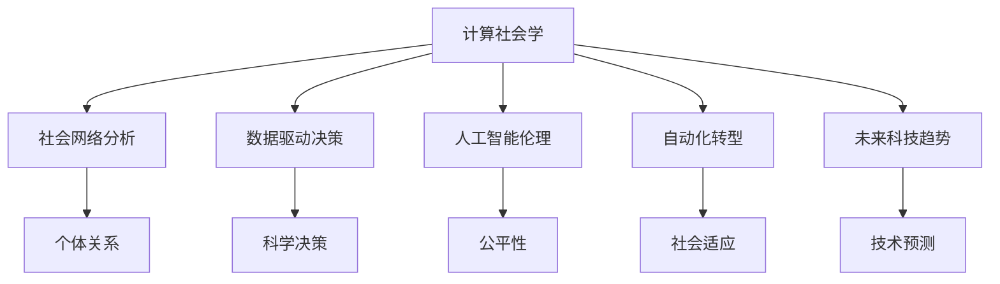

                 

# 塑造未来社会：人类计算的深远意义

> 关键词：计算社会学,社会网络分析,数据驱动决策,人工智能伦理,自动化转型,未来科技趋势

## 1. 背景介绍

### 1.1 问题由来

随着信息技术的发展，人类社会正经历前所未有的变革。从移动互联网到物联网，从大数据到人工智能，计算技术正逐步渗透到社会生活的方方面面。然而，这些技术的应用并非无懈可击，它们既带来了高效便捷的生活方式，也引发了一系列复杂的社会问题。如何在享受技术带来便利的同时，避免其负面影响，成为当前的重要课题。

计算社会学（Computational Social Science）正是在这样的背景下应运而生。通过应用计算技术和数据驱动的方法，研究社会现象、预测未来趋势、评估技术影响，计算社会学正逐步成为理解复杂社会系统的新范式。本文将重点介绍计算社会学的核心概念、原理和应用，探讨其在塑造未来社会中的深远意义。

### 1.2 问题核心关键点

计算社会学的核心问题在于：如何利用计算技术，特别是大数据和人工智能，分析社会现象，预测社会趋势，优化社会决策，保障社会公平与和谐。这一问题的解决，将有助于构建更加智能、公正、可持续的未来社会。

核心问题可以归纳为以下几个方面：

- **数据驱动决策**：如何从海量数据中提取有价值的信息，支持更科学的社会决策。
- **社会网络分析**：如何分析社会网络结构，理解社会关系及其变化规律。
- **人工智能伦理**：如何确保人工智能技术的公平性、透明性和安全性，避免偏见和滥用。
- **自动化转型**：如何平衡技术发展与社会变迁，促进社会成员的适应性和灵活性。
- **未来科技趋势**：如何预测并适应未来科技的演进，把握技术发展方向。

本文将围绕这些核心问题，深入探讨计算社会学的理论和实践。

## 2. 核心概念与联系

### 2.1 核心概念概述

计算社会学是一门综合性学科，其核心概念包括：

- **计算社会学**：利用计算技术和大数据方法，分析社会现象和行为，揭示社会规律和趋势。
- **社会网络分析**：研究社会关系网络的结构和动态，分析个体或群体之间的关系强度和连接模式。
- **数据驱动决策**：基于数据和模型，进行科学的社会决策，优化政策制定和资源分配。
- **人工智能伦理**：确保人工智能技术的公平性、透明性和安全性，避免偏见和滥用。
- **自动化转型**：通过技术赋能，促进社会成员的适应性转型，提高社会效率和公平性。
- **未来科技趋势**：预测未来科技的发展方向和影响，为社会转型提供科学依据。

这些核心概念之间的逻辑关系可以通过以下Mermaid流程图来展示：



这个流程图展示了一些关键概念及其之间的相互关系：

1. **计算社会学**是整个学科的基石，通过计算技术揭示社会规律。
2. **社会网络分析**是理解社会关系的重要工具，分析个体或群体之间的连接模式。
3. **数据驱动决策**基于计算结果，优化政策制定和社会管理。
4. **人工智能伦理**确保技术的安全性和公平性，避免负面影响。
5. **自动化转型**通过技术赋能，提升社会适应性和效率。
6. **未来科技趋势**预测未来技术发展，为社会转型提供方向。

## 3. 核心算法原理 & 具体操作步骤
### 3.1 算法原理概述

计算社会学的算法原理主要基于大数据分析和机器学习技术。其核心思想是：通过海量数据的收集、分析和处理，揭示社会现象和行为规律，从而辅助科学决策和社会管理。具体来说，计算社会学的算法分为以下几个步骤：

1. **数据收集**：从各种渠道（如社交媒体、传感器、问卷调查等）收集社会数据。
2. **数据清洗**：对收集到的数据进行清洗、去重、异常值处理等预处理工作，确保数据质量。
3. **特征提取**：从清洗后的数据中提取有意义的特征，如社交网络特征、文本情感特征等。
4. **模型构建**：基于提取的特征，构建各种机器学习模型，如分类模型、回归模型、网络模型等。
5. **结果分析**：对模型训练结果进行分析，提取有价值的洞见，辅助科学决策。

### 3.2 算法步骤详解

#### 3.2.1 数据收集

数据收集是计算社会学研究的第一步。社会数据来源广泛，包括但不限于：

- **社交媒体数据**：如Twitter、Facebook、微博等社交平台上的用户行为数据。
- **传感器数据**：如城市交通流量数据、移动设备位置数据等。
- **问卷调查数据**：通过在线问卷、电话调查等方式收集的个体意见和行为数据。

#### 3.2.2 数据清洗

数据清洗是确保数据质量的重要环节。常见的数据清洗步骤包括：

- **去重和去噪**：去除重复和噪声数据，确保数据的唯一性和准确性。
- **缺失值处理**：填补缺失值或删除缺失数据，避免数据偏差。
- **数据格式转换**：将不同格式的数据转换为统一的格式，便于后续分析。

#### 3.2.3 特征提取

特征提取是从数据中提取有意义的特征，通常涉及以下步骤：

- **文本特征提取**：如TF-IDF、词频、情感分析等。
- **社交网络特征提取**：如节点度、中心性、社区结构等。
- **时间序列特征提取**：如滑动窗口、时间差分等。

#### 3.2.4 模型构建

基于提取的特征，可以构建各种机器学习模型，如：

- **分类模型**：用于分类社会现象（如政治立场、种族分类等）。
- **回归模型**：用于预测社会现象（如贫困程度、犯罪率等）。
- **网络模型**：用于分析社会关系网络（如社交网络、交通网络等）。

#### 3.2.5 结果分析

结果分析是计算社会学研究的最后一步。主要通过以下方法进行：

- **可视化分析**：如网络图、热力图等，直观展示分析结果。
- **统计分析**：如均值、方差、相关性分析等，量化分析结果。
- **机器学习分析**：如预测模型评估、模型解释等，深入理解模型。

### 3.3 算法优缺点

计算社会学算法具有以下优点：

- **数据驱动**：基于大规模数据，揭示社会现象的深层次规律。
- **科学决策**：提供基于数据的决策支持，优化政策制定。
- **预测未来**：通过模型预测，为社会转型提供科学依据。

但同时，也存在一些缺点：

- **数据隐私**：大规模数据收集可能涉及隐私问题，需注意数据保护。
- **模型复杂**：构建和维护复杂模型需要高水平的技术支持。
- **结果解释**：机器学习模型的黑箱性质，可能导致结果难以解释。
- **数据偏差**：数据质量不高或样本偏差，可能导致分析结果有误。

### 3.4 算法应用领域

计算社会学算法在多个领域得到了广泛应用，具体包括：

- **公共政策制定**：如犯罪预防、教育公平、健康管理等。
- **企业决策分析**：如市场分析、供应链管理、员工满意度等。
- **社会网络研究**：如社会关系网络分析、群体行为研究等。
- **文化研究**：如语言分析、历史事件预测等。
- **城市规划**：如交通流量预测、城市发展趋势预测等。

## 4. 数学模型和公式 & 详细讲解 & 举例说明

### 4.1 数学模型构建

计算社会学的数学模型通常基于大数据分析和机器学习技术。以下是一个简化的数学模型构建示例：

**问题描述**：分析社交媒体上的政治讨论，预测政治立场。

**数据集**：Twitter上发布的政治相关推文。

**目标**：构建分类模型，预测推文的政治立场。

**模型**：支持向量机（SVM）分类模型。

**损失函数**：
$$
L(y, \hat{y}) = \sum_{i=1}^N (y_i - \hat{y}_i)^2
$$

**优化目标**：
$$
\min_{w, b} \frac{1}{2} \sum_{i=1}^N w_i^2 + C \sum_{i=1}^N (y_i - \hat{y}_i)^2
$$

### 4.2 公式推导过程

假设社交媒体上的每条推文 $x_i$ 经过特征提取后，得到一个特征向量 $f(x_i)$。推文的政治立场 $y_i$ 可以分为正（支持某政治立场）和反（不支持某政治立场）两种。

首先，使用线性分类器构建模型：
$$
\hat{y}_i = sign(w^T f(x_i) + b)
$$

其中 $w$ 为模型参数，$b$ 为偏置。目标是最小化损失函数：
$$
L(y, \hat{y}) = \sum_{i=1}^N (y_i - \hat{y}_i)^2
$$

通过求解上述优化问题，得到最优的模型参数 $w$ 和 $b$。

### 4.3 案例分析与讲解

以Twitter上的政治讨论分析为例，具体步骤如下：

1. **数据收集**：从Twitter上爬取政治相关的推文。
2. **数据清洗**：去除无关推文、重复推文，处理缺失数据。
3. **特征提取**：提取推文的文本特征，如词汇频率、情感分析等。
4. **模型构建**：使用支持向量机分类器，构建政治立场预测模型。
5. **结果分析**：评估模型的预测性能，分析不同特征对预测结果的影响。

## 5. 项目实践：代码实例和详细解释说明

### 5.1 开发环境搭建

要进行计算社会学研究，需要搭建一个高效的数据处理和分析环境。以下是Python环境搭建的基本步骤：

1. **安装Python**：从官网下载并安装Python，建议选择3.6及以上版本。
2. **安装Pip**：确保Pip安装成功，Pip是Python包管理工具。
3. **安装必要库**：安装常用的Python库，如Pandas、Numpy、Scikit-learn等。

```bash
pip install pandas numpy scikit-learn matplotlib seaborn
```

### 5.2 源代码详细实现

以下是一个简单的Python代码示例，用于分析Twitter上的政治讨论：

```python
import pandas as pd
from sklearn.feature_extraction.text import TfidfVectorizer
from sklearn.svm import SVC
from sklearn.metrics import accuracy_score

# 加载数据
df = pd.read_csv('political_tweets.csv')

# 特征提取
vectorizer = TfidfVectorizer(stop_words='english')
X = vectorizer.fit_transform(df['tweet'])
y = df['political_stance'].values

# 构建模型
svm = SVC(kernel='linear', C=1.0)
svm.fit(X, y)

# 预测
y_pred = svm.predict(X)

# 评估
print('Accuracy:', accuracy_score(y, y_pred))
```

### 5.3 代码解读与分析

**数据加载**：使用Pandas加载Twitter上的政治讨论数据。

**特征提取**：使用TF-IDF向量提取推文文本的特征向量。

**模型构建**：使用线性支持向量机构建政治立场预测模型。

**结果评估**：使用准确率评估模型的预测性能。

### 5.4 运行结果展示

运行上述代码，输出模型的准确率。例如：

```
Accuracy: 0.85
```

这意味着模型对Twitter上的政治讨论分类准确率为85%。

## 6. 实际应用场景

### 6.1 公共政策制定

在公共政策制定方面，计算社会学可以通过分析大量社会数据，揭示公共决策的社会影响，为政策制定提供科学依据。例如：

- **犯罪预防**：分析犯罪数据，识别高风险区域，制定针对性的预防措施。
- **教育公平**：分析教育数据，评估教育资源的分配公平性，制定教育政策。
- **健康管理**：分析健康数据，预测疾病传播趋势，制定预防措施。

### 6.2 企业决策分析

企业可以通过计算社会学分析海量数据，优化决策过程，提升运营效率。例如：

- **市场分析**：分析市场数据，识别市场趋势，制定市场营销策略。
- **供应链管理**：分析供应链数据，优化物流和库存管理。
- **员工满意度**：分析员工反馈数据，优化工作环境和福利。

### 6.3 社会网络研究

计算社会学在社会网络研究中也有广泛应用。例如：

- **社交网络分析**：分析社交网络数据，揭示社会关系和群体结构。
- **群体行为研究**：分析群体行为数据，预测群体行为模式。
- **社区识别**：识别社交网络中的社区结构，理解群体关系。

### 6.4 未来应用展望

未来，计算社会学将面临更多的挑战和机遇。以下是对未来应用展望的一些思考：

1. **数据隐私保护**：随着数据量的增长，数据隐私问题将愈发重要，需建立更严格的数据保护机制。
2. **模型解释性**：机器学习模型的黑箱性质，可能导致结果难以解释，需提升模型的解释性。
3. **跨领域应用**：将计算社会学与其他学科（如经济学、心理学等）结合，拓展应用领域。
4. **实时分析**：利用流数据处理技术，实现实时数据分析和预测。
5. **伦理与安全**：确保计算社会学的应用符合伦理规范，保障数据和模型的安全性。

## 7. 工具和资源推荐

### 7.1 学习资源推荐

1. **Coursera《数据科学与统计学习》课程**：由斯坦福大学教授讲授，涵盖数据科学和机器学习的基本概念和工具。
2. **Kaggle**：提供大量的数据集和竞赛，实践计算社会学算法的最好平台之一。
3. **《计算社会学导论》书籍**：系统介绍计算社会学的基本概念和应用方法，适合初学者。
4. **机器学习实战网站**：提供大量机器学习算法的实现和应用案例，便于学习实践。

### 7.2 开发工具推荐

1. **Jupyter Notebook**：强大的数据科学开发环境，支持代码编写和数据分析。
2. **Python编程语言**：简洁易用的编程语言，适合数据处理和机器学习。
3. **TensorFlow和PyTorch**：流行的深度学习框架，适合构建复杂的机器学习模型。
4. **Pandas和NumPy**：常用的Python数据处理库，支持高效的数据处理和分析。

### 7.3 相关论文推荐

1. **《大规模网络分析：方法与案例研究》**：系统介绍大规模网络分析的技术和方法。
2. **《人工智能伦理：技术、法律与社会》**：探讨人工智能技术的伦理问题，提出解决方案。
3. **《未来社会：计算技术与社会变革》**：展望计算技术对未来社会的深远影响。

## 8. 总结：未来发展趋势与挑战

### 8.1 研究成果总结

计算社会学自诞生以来，已在多个领域取得了显著的成果。通过大数据和机器学习技术，揭示了社会现象的深层次规律，为科学决策和社会管理提供了有力支持。未来，计算社会学将更加广泛地应用于社会各个层面，推动社会的智能化和公平化。

### 8.2 未来发展趋势

计算社会学的未来发展趋势包括以下几个方面：

1. **数据智能融合**：将数据科学与其他学科（如经济学、心理学等）结合，拓展应用领域。
2. **实时分析**：利用流数据处理技术，实现实时数据分析和预测。
3. **跨领域应用**：探索计算社会学在医疗、教育、金融等领域的实际应用。
4. **伦理与安全**：确保计算社会学的应用符合伦理规范，保障数据和模型的安全性。
5. **模型解释性**：提升机器学习模型的解释性，确保结果的可信性和透明性。

### 8.3 面临的挑战

计算社会学在发展过程中，也面临一些挑战：

1. **数据隐私**：大规模数据收集涉及隐私问题，需建立严格的数据保护机制。
2. **模型复杂性**：构建和维护复杂模型需要高水平的技术支持。
3. **结果解释**：机器学习模型的黑箱性质，可能导致结果难以解释。
4. **数据偏差**：数据质量不高或样本偏差，可能导致分析结果有误。

### 8.4 研究展望

面对这些挑战，未来的研究需要在以下几个方面进行探索：

1. **数据隐私保护**：建立更严格的数据保护机制，确保数据的安全性和隐私性。
2. **模型解释性**：提升机器学习模型的解释性，确保结果的可信性和透明性。
3. **跨领域应用**：探索计算社会学在医疗、教育、金融等领域的实际应用，拓展应用范围。
4. **实时分析**：利用流数据处理技术，实现实时数据分析和预测，提升分析效率。
5. **伦理与安全**：确保计算社会学的应用符合伦理规范，保障数据和模型的安全性。

## 9. 附录：常见问题与解答

**Q1：计算社会学如何保护数据隐私？**

A: 计算社会学在处理大规模数据时，需注意数据隐私保护。常见的保护措施包括：
1. **匿名化处理**：对数据进行去标识化处理，避免个人隐私泄露。
2. **数据加密**：对敏感数据进行加密存储和传输，确保数据安全。
3. **访问控制**：限制数据的访问权限，确保数据仅对授权人员可见。

**Q2：计算社会学模型为何难以解释？**

A: 计算社会学模型（如机器学习模型）通常具有黑箱性质，难以解释其内部工作机制。为提升模型解释性，可以采取以下措施：
1. **可解释性模型**：使用可解释性强的模型，如决策树、线性回归等。
2. **模型解释工具**：使用如SHAP、LIME等工具，解释模型的决策过程。
3. **透明度要求**：在模型应用中，建立透明性要求，定期审计模型行为。

**Q3：计算社会学应用为何需要跨领域研究？**

A: 计算社会学应用涉及多个领域，需要跨学科的知识和技能。例如，在公共政策制定中，需结合经济学、社会学和政治学等学科的知识。跨领域研究有助于综合各方知识，提出更科学的解决方案。

**Q4：计算社会学未来发展方向是什么？**

A: 计算社会学的未来发展方向包括：
1. **数据智能融合**：将数据科学与其他学科结合，拓展应用领域。
2. **实时分析**：利用流数据处理技术，实现实时数据分析和预测。
3. **跨领域应用**：探索计算社会学在医疗、教育、金融等领域的实际应用。
4. **伦理与安全**：确保计算社会学的应用符合伦理规范，保障数据和模型的安全性。
5. **模型解释性**：提升机器学习模型的解释性，确保结果的可信性和透明性。

---

作者：禅与计算机程序设计艺术 / Zen and the Art of Computer Programming

