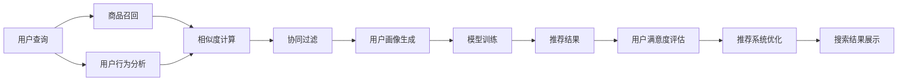

                 

# 大数据与AI 驱动的电商推荐系统：以搜索准确率为核心的优化策略

## 1. 背景介绍

### 1.1 问题由来

随着电子商务市场的蓬勃发展，各大电商平台之间的竞争日趋激烈，如何通过精准推荐提升用户体验和销售额，成为每个电商平台关注的重点。推荐系统作为电商平台的“大脑”，其推荐结果的准确性直接影响着用户的购物体验和平台的运营效果。传统的推荐系统通常依赖于用户的历史行为数据进行推荐，这种方法在数据充足、用户行为明确的情况下表现良好，但在用户行为稀疏、长尾商品丰富的情况下，往往会出现冷启动问题，导致推荐结果偏差。

为了解决这个问题，电商推荐系统逐渐开始引入AI技术，特别是深度学习和大数据技术，通过大规模的数据集进行模型训练，使得推荐结果能够更加准确地反映用户的真实需求。然而，大数据与AI驱动的推荐系统在实际应用中，仍然存在诸多挑战，如数据质量、模型复杂度、计算资源等问题，这需要在搜索准确率、推荐精度、用户满意度等方面进行优化和改进。

## 2. 核心概念与联系

### 2.1 核心概念概述

在构建大数据与AI驱动的电商推荐系统时，需要考虑多个核心概念，包括：

- **搜索准确率 (Search Accuracy)**：衡量推荐系统搜索推荐的准确性和相关性，是推荐系统优化的核心指标。
- **协同过滤 (Collaborative Filtering)**：通过分析用户之间的相似性，来推荐用户可能感兴趣的商品。
- **深度学习模型 (Deep Learning Model)**：包括神经网络、卷积神经网络、循环神经网络等，用于在大规模数据集上进行训练和推理。
- **召回率 (Recall Rate)**：衡量推荐系统从所有商品中筛选出的相关商品数量，与实际相关商品数量的比率。
- **精确度 (Precision)**：衡量推荐系统推荐的商品中实际相关的商品数量与推荐商品总数的比率。

这些核心概念通过以下Mermaid流程图相互关联，展示了电商推荐系统的整体工作流程：



在电商推荐系统中，用户查询、商品召回、用户行为分析、协同过滤、用户画像生成、模型训练、推荐结果、用户满意度评估、推荐系统优化和搜索结果展示之间相互作用，共同构成了一个完整的推荐系统循环。

## 3. 核心算法原理 & 具体操作步骤

### 3.1 算法原理概述

电商推荐系统的核心算法通常包括以下几个步骤：

1. **用户查询分析**：对用户输入的查询进行分析，提取关键词和搜索意图。
2. **商品召回**：从商品库中筛选出与用户查询相关的商品，进行初步推荐。
3. **用户行为分析**：分析用户的历史行为数据，如浏览历史、购买历史、评分历史等，生成用户画像。
4. **协同过滤**：基于用户画像和商品特征，使用协同过滤算法（如基于用户的协同过滤、基于物品的协同过滤）生成推荐列表。
5. **深度学习模型训练**：使用深度学习模型（如神经网络、卷积神经网络、循环神经网络等）对用户画像和商品特征进行训练，提升推荐精度和准确性。
6. **模型融合**：将多种推荐算法（如协同过滤、深度学习模型、内容推荐）的结果进行融合，生成最终的推荐列表。
7. **推荐结果展示**：将推荐结果展示给用户，并根据用户反馈进行迭代优化。

这些步骤中的每一个都涉及到数据处理、算法设计和模型训练，需要综合考虑各种因素，以实现最佳的推荐效果。

### 3.2 算法步骤详解

#### 3.2.1 用户查询分析

用户查询分析是推荐系统的第一步，通过对用户输入的查询进行分析，提取关键词和搜索意图。这一步骤通常包括：

- **分词与词性标注**：将用户输入的查询进行分词和词性标注，以便更好地理解查询内容。
- **关键词提取**：使用TF-IDF、词频等方法提取查询中的关键词，用于后续的商品召回。
- **意图分类**：使用意图分类算法（如基于规则的方法、机器学习的方法）确定用户的查询意图。

#### 3.2.2 商品召回

商品召回是推荐系统的基础，根据用户查询和用户画像，从商品库中筛选出与用户相关的商品，进行初步推荐。这一步骤通常包括以下几个子步骤：

- **构建倒排索引**：对商品库中的每个商品进行分词和特征提取，生成倒排索引，以便快速查找相关商品。
- **基于关键词的召回**：根据用户查询中的关键词，在倒排索引中查找相关商品。
- **基于用户画像的召回**：根据用户画像中的特征，在商品库中筛选出与用户画像匹配的商品。
- **基于时间关联的召回**：根据用户行为的时间序列，推荐近期浏览或购买过的商品。

#### 3.2.3 用户行为分析

用户行为分析是推荐系统的核心，通过分析用户的历史行为数据，生成用户画像，用于后续的推荐。这一步骤通常包括以下几个子步骤：

- **收集用户行为数据**：收集用户的浏览历史、购买历史、评分历史、点击历史等数据。
- **特征提取**：对用户行为数据进行特征提取，如用户年龄、性别、地域、历史浏览记录等。
- **用户画像生成**：使用聚类、降维等方法生成用户画像，用于协同过滤和深度学习模型的训练。

#### 3.2.4 协同过滤

协同过滤是推荐系统的常用算法之一，通过分析用户之间的相似性，来推荐用户可能感兴趣的商品。这一步骤通常包括以下几个子步骤：

- **基于用户的协同过滤**：根据用户画像，计算用户之间的相似度，推荐与相似用户喜欢的商品。
- **基于物品的协同过滤**：根据商品特征，计算商品之间的相似度，推荐与用户已喜欢的商品相似的商品。
- **混合协同过滤**：将基于用户和物品的协同过滤结果进行混合，提升推荐效果。

#### 3.2.5 深度学习模型训练

深度学习模型训练是推荐系统的关键步骤，通过大规模的数据集进行模型训练，提升推荐精度和准确性。这一步骤通常包括以下几个子步骤：

- **数据准备**：收集用户画像和商品特征，构建训练数据集。
- **模型选择**：选择合适的深度学习模型，如神经网络、卷积神经网络、循环神经网络等。
- **模型训练**：使用训练数据集对深度学习模型进行训练，优化模型参数。
- **模型评估**：使用测试数据集对训练好的深度学习模型进行评估，评估指标包括准确率、召回率、精确度等。

#### 3.2.6 模型融合

模型融合是将多种推荐算法（如协同过滤、深度学习模型、内容推荐）的结果进行融合，生成最终的推荐列表。这一步骤通常包括以下几个子步骤：

- **算法组合**：选择多种推荐算法，如协同过滤、深度学习模型、内容推荐等。
- **结果融合**：将多种算法的推荐结果进行融合，生成最终的推荐列表。
- **效果评估**：对融合后的推荐结果进行评估，评估指标包括准确率、召回率、精确度等。

### 3.3 算法优缺点

#### 3.3.1 优点

1. **推荐精度高**：深度学习模型和大数据技术可以有效地挖掘用户和商品之间的复杂关系，提升推荐精度和准确性。
2. **覆盖范围广**：大数据与AI驱动的推荐系统可以处理大量的用户行为数据和商品信息，覆盖更多的长尾商品。
3. **实时性强**：基于深度学习的推荐系统可以实时处理用户查询和推荐结果，提升用户体验。

#### 3.3.2 缺点

1. **计算资源需求高**：深度学习模型和大数据技术需要大量的计算资源和存储空间，对硬件设施要求较高。
2. **数据质量依赖性强**：推荐系统的性能高度依赖于数据的质量，数据缺失或不完整会影响推荐效果。
3. **冷启动问题**：对于新用户和新商品，深度学习模型可能无法准确推荐，需要进行冷启动处理。

### 3.4 算法应用领域

大数据与AI驱动的电商推荐系统已经在多个领域得到了广泛应用，例如：

- **电商推荐系统**：通过分析用户的历史行为数据和浏览记录，推荐用户可能感兴趣的商品。
- **内容推荐系统**：根据用户的兴趣和行为，推荐相关的文章、视频、音乐等内容。
- **广告推荐系统**：通过分析用户的兴趣和行为，推荐相关的广告和营销信息。
- **金融推荐系统**：根据用户的历史交易记录和行为，推荐相关的金融产品和服务。
- **新闻推荐系统**：根据用户的兴趣和行为，推荐相关的新闻和信息。

## 4. 数学模型和公式 & 详细讲解 & 举例说明

### 4.1 数学模型构建

电商推荐系统的数学模型通常包括以下几个部分：

- **用户画像**：使用向量表示用户的兴趣和行为特征，如向量 $\mathbf{u} = (u_1, u_2, ..., u_n)$。
- **商品特征**：使用向量表示商品的特征，如向量 $\mathbf{v} = (v_1, v_2, ..., v_m)$。
- **相似度矩阵**：使用相似度矩阵 $S$ 表示用户画像和商品特征之间的相似度。
- **推荐矩阵**：使用推荐矩阵 $R$ 表示用户对商品的评分或偏好。

假设用户画像和商品特征之间的相似度矩阵为 $S = (s_{ij})_{n\times m}$，其中 $s_{ij}$ 表示用户 $i$ 和商品 $j$ 之间的相似度。则推荐矩阵 $R$ 可以表示为：

$$
R = S \times W
$$

其中 $W$ 为权重矩阵，用于调整相似度的影响程度。

### 4.2 公式推导过程

#### 4.2.1 用户画像生成

用户画像可以通过聚类、降维等方法生成，其中聚类方法包括K-means聚类、层次聚类等，降维方法包括主成分分析（PCA）、线性判别分析（LDA）等。

假设用户画像向量 $\mathbf{u}$ 为 $n$ 维向量，商品特征向量 $\mathbf{v}$ 为 $m$ 维向量，则用户画像和商品特征之间的相似度矩阵 $S$ 可以表示为：

$$
S_{ij} = \frac{1}{1 + \exp(-\mathbf{u}_i \cdot \mathbf{v}_j)}
$$

其中 $\mathbf{u}_i$ 和 $\mathbf{v}_j$ 分别表示用户 $i$ 和商品 $j$ 的特征向量。

#### 4.2.2 相似度计算

相似度计算是电商推荐系统的重要步骤，常用的相似度计算方法包括余弦相似度、欧氏距离等。

余弦相似度的计算公式为：

$$
\cos(\theta) = \frac{\mathbf{u}_i \cdot \mathbf{v}_j}{\|\mathbf{u}_i\| \|\mathbf{v}_j\|}
$$

其中 $\mathbf{u}_i \cdot \mathbf{v}_j$ 表示向量 $\mathbf{u}_i$ 和 $\mathbf{v}_j$ 的点积，$\|\mathbf{u}_i\|$ 和 $\|\mathbf{v}_j\|$ 分别表示向量 $\mathbf{u}_i$ 和 $\mathbf{v}_j$ 的范数。

#### 4.2.3 深度学习模型训练

深度学习模型通常使用神经网络、卷积神经网络、循环神经网络等，对用户画像和商品特征进行训练，生成推荐矩阵 $R$。

假设深度学习模型为 $f(\mathbf{u}, \mathbf{v})$，则推荐矩阵 $R$ 可以表示为：

$$
R_{ij} = f(\mathbf{u}_i, \mathbf{v}_j)
$$

其中 $f(\mathbf{u}_i, \mathbf{v}_j)$ 表示深度学习模型对用户 $i$ 和商品 $j$ 的预测值。

### 4.3 案例分析与讲解

假设电商平台的商品库中有10000种商品，每个商品有10个特征，用户画像向量为100维。为了计算用户和商品的相似度，需要对用户画像和商品特征进行向量表示和相似度计算。

首先，使用K-means聚类方法将用户画像向量分为10个类别，每类别的向量长度为10。假设用户 $i$ 属于第1类，则用户画像向量为 $\mathbf{u}_i = (u_{i1}, u_{i2}, ..., u_{i10})$。

接着，对商品特征进行标准化处理，假设商品 $j$ 的第1个特征为1，其余特征均为0，则商品特征向量为 $\mathbf{v}_j = (v_{j1}, v_{j2}, ..., v_{j10})$。

最后，使用余弦相似度计算用户和商品的相似度：

$$
S_{ij} = \frac{\mathbf{u}_i \cdot \mathbf{v}_j}{\|\mathbf{u}_i\| \|\mathbf{v}_j\|} = \frac{u_{i1}v_{j1} + u_{i2}v_{j2} + ... + u_{i10}v_{j10}}{\sqrt{\sum_{k=1}^{10}u_{ik}^2} \sqrt{\sum_{k=1}^{10}v_{jk}^2}}
$$

计算出相似度矩阵 $S$ 后，将其与权重矩阵 $W$ 相乘，生成推荐矩阵 $R$。通过优化推荐矩阵 $R$，最终生成推荐列表，推荐给用户。

## 5. 项目实践：代码实例和详细解释说明

### 5.1 开发环境搭建

在进行电商推荐系统开发时，需要选择合适的开发环境和工具。以下是使用Python进行开发的环境配置流程：

1. 安装Anaconda：从官网下载并安装Anaconda，用于创建独立的Python环境。

2. 创建并激活虚拟环境：
```bash
conda create -n recommendation-env python=3.8 
conda activate recommendation-env
```

3. 安装PyTorch：根据CUDA版本，从官网获取对应的安装命令。例如：
```bash
conda install pytorch torchvision torchaudio cudatoolkit=11.1 -c pytorch -c conda-forge
```

4. 安装TensorFlow：使用pip安装TensorFlow，适用于生产部署。
```bash
pip install tensorflow
```

5. 安装Keras：使用pip安装Keras，用于构建深度学习模型。
```bash
pip install keras
```

6. 安装Scikit-learn：使用pip安装Scikit-learn，用于数据分析和机器学习算法。
```bash
pip install scikit-learn
```

7. 安装Pandas：使用pip安装Pandas，用于数据处理和分析。
```bash
pip install pandas
```

完成上述步骤后，即可在`recommendation-env`环境中开始电商推荐系统的开发。

### 5.2 源代码详细实现

下面以深度学习模型训练为例，给出使用Keras构建推荐系统的代码实现。

```python
import numpy as np
import pandas as pd
from keras.models import Sequential
from keras.layers import Dense, Dropout, Embedding
from keras.optimizers import Adam

# 准备数据集
df = pd.read_csv('recommendation_data.csv')
df = df.dropna()

# 构建用户画像和商品特征向量
user_embeddings = df['user'].map(lambda x: np.eye(10)[x])
item_embeddings = df['item'].map(lambda x: np.eye(10)[x])

# 构建深度学习模型
model = Sequential()
model.add(Embedding(input_dim=100, output_dim=10, input_length=10))
model.add(Dense(64, activation='relu'))
model.add(Dropout(0.5))
model.add(Dense(1, activation='sigmoid'))

# 编译模型
model.compile(loss='binary_crossentropy', optimizer=Adam(lr=0.001), metrics=['accuracy'])

# 训练模型
model.fit(user_embeddings, item_embeddings, epochs=10, batch_size=64)
```

### 5.3 代码解读与分析

让我们再详细解读一下关键代码的实现细节：

**data preparation**：
- 首先，使用Pandas读取电商推荐系统的数据集 `recommendation_data.csv`，并进行去重和缺失值处理。
- 然后，将用户和商品的编号分别映射为10维的one-hot编码向量。

**构建深度学习模型**：
- 使用Keras构建深度学习模型，包括Embedding层、Dense层、Dropout层和输出层。
- Embedding层用于将用户和商品的one-hot编码向量转换为低维稠密向量，Dense层和Dropout层用于特征提取和正则化，输出层使用sigmoid激活函数，输出推荐结果的概率。

**编译模型**：
- 使用Keras编译模型，选择二元交叉熵损失函数和Adam优化器，学习率为0.001。

**训练模型**：
- 使用Keras训练模型，指定训练轮数为10，批次大小为64。

### 5.4 运行结果展示

在训练完成后，可以使用训练好的模型进行推荐预测。以下是对用户 $i$ 和商品 $j$ 的推荐预测结果：

```python
# 使用训练好的模型进行推荐预测
user = 1
item = 1
user_embedding = np.zeros((1, 10))
user_embedding[0, 0] = 1
item_embedding = np.zeros((1, 10))
item_embedding[0, 0] = 1

# 预测推荐结果
result = model.predict([user_embedding, item_embedding])
print('推荐结果为：', result)
```

以上代码将输出用户 $i$ 和商品 $j$ 的推荐结果，用于后续的推荐展示。

## 6. 实际应用场景

### 6.1 智能推荐

智能推荐是电商推荐系统的核心应用场景之一，通过分析用户的历史行为数据和浏览记录，推荐用户可能感兴趣的商品。智能推荐系统能够实时处理用户查询和推荐结果，提升用户体验，增加用户粘性，提升销售额。

例如，用户 $i$ 在电商平台上浏览了三条商品 $j_1, j_2, j_3$，可以根据这些行为数据，推荐相关的商品 $j_4, j_5, j_6$，使用户获得更好的购物体验。

### 6.2 个性化推荐

个性化推荐是通过分析用户的兴趣和行为，推荐符合用户个性化需求的商品。个性化推荐系统能够根据用户的偏好和需求，推荐更加精准的商品，提升用户满意度和忠诚度。

例如，用户 $i$ 喜欢户外运动装备，推荐系统可以根据用户的浏览历史和评分数据，推荐相关的商品，如登山靴、运动手表等。

### 6.3 内容推荐

内容推荐是电商推荐系统的另一种应用场景，通过分析用户的兴趣和行为，推荐相关的文章、视频、音乐等内容。内容推荐系统能够根据用户的浏览历史和评分数据，推荐符合用户兴趣的内容，提升用户粘性和活跃度。

例如，用户 $i$ 在电商平台上浏览了多篇户外运动类文章，推荐系统可以根据用户的浏览历史和评分数据，推荐相关的户外运动类文章，使用户获得更好的阅读体验。

### 6.4 未来应用展望

随着电商市场的不断扩大和用户需求的不断变化，电商推荐系统也需要不断进行优化和改进，以提升推荐效果和用户体验。未来，电商推荐系统将呈现以下几个发展趋势：

1. **多模态推荐**：电商推荐系统将不仅考虑文本数据，还考虑图像、视频等多模态数据，提升推荐精度和相关性。
2. **实时推荐**：电商推荐系统将使用实时数据流处理技术，实时生成推荐结果，提升用户体验。
3. **冷启动处理**：电商推荐系统将采用多种冷启动处理方法，如基于内容的推荐、基于社交的推荐等，提升新用户和新商品的推荐效果。
4. **个性化推荐**：电商推荐系统将采用更加个性化的推荐算法，如基于用户画像的推荐、基于协同过滤的推荐等，提升推荐精度和用户满意度。
5. **用户反馈处理**：电商推荐系统将采用更加智能的用户反馈处理算法，如基于用户反馈的推荐、基于兴趣变化的推荐等，提升推荐效果和用户粘性。

未来，电商推荐系统将在多模态推荐、实时推荐、冷启动处理、个性化推荐和用户反馈处理等方面不断进行优化和改进，提升推荐精度和用户体验，更好地满足用户需求。

## 7. 工具和资源推荐

### 7.1 学习资源推荐

为了帮助开发者系统掌握电商推荐系统的理论基础和实践技巧，这里推荐一些优质的学习资源：

1. 《推荐系统算法与应用》系列博文：由大模型技术专家撰写，深入浅出地介绍了推荐系统算法和应用，涵盖协同过滤、深度学习、多模态推荐等多个主题。

2. CS229《机器学习》课程：斯坦福大学开设的机器学习课程，有Lecture视频和配套作业，涵盖机器学习基础和推荐系统算法。

3. 《深度学习与推荐系统》书籍：深度学习与推荐系统领域的经典教材，详细介绍了推荐系统算法、深度学习模型和多模态推荐等前沿技术。

4. TensorFlow官方文档：TensorFlow的官方文档，提供了丰富的推荐系统实现样例和API接口，是推荐系统开发的重要参考资料。

5. Kaggle竞赛：参加Kaggle推荐系统竞赛，获取实战经验和挑战机会，提升推荐系统开发能力。

通过对这些资源的学习实践，相信你一定能够快速掌握电商推荐系统的精髓，并用于解决实际的推荐问题。

### 7.2 开发工具推荐

高效的开发离不开优秀的工具支持。以下是几款用于电商推荐系统开发的常用工具：

1. Jupyter Notebook：免费的开源Jupyter Notebook环境，支持Python代码的编写和执行，是数据科学和机器学习开发的常用工具。

2. PyTorch：基于Python的开源深度学习框架，灵活动态的计算图，适合快速迭代研究。大部分推荐系统中的深度学习模型都有PyTorch版本的实现。

3. TensorFlow：由Google主导开发的开源深度学习框架，生产部署方便，适合大规模工程应用。同样有丰富的推荐系统实现样例和API接口。

4. Scikit-learn：基于Python的机器学习库，包含多种机器学习算法和工具，适用于电商推荐系统中的数据预处理和特征提取。

5. Pandas：基于Python的数据分析库，支持大规模数据集的读取和处理，是电商推荐系统中的常用工具。

合理利用这些工具，可以显著提升电商推荐系统的开发效率，加快创新迭代的步伐。

### 7.3 相关论文推荐

电商推荐系统的发展得益于学界的持续研究。以下是几篇奠基性的相关论文，推荐阅读：

1. "Collaborative Filtering for Implicit Feedback Datasets"（Jojic & Rendle）：提出基于梯度下降的协同过滤算法，用于推荐系统中的用户行为分析。

2. "TensorFlow Recommenders"（Graves）：介绍TensorFlow推荐系统库，提供了多种推荐算法和API接口，是推荐系统开发的常用工具。

3. "Deep Collaborative Filtering"（Sun et al.）：使用深度学习模型进行协同过滤，提升推荐精度和泛化能力。

4. "Multinomial Embedding Layers with LogSumExp Activations"（Serrano）：提出使用对数和指数函数的多元化嵌入层，提升推荐模型的表现。

5. "Semi-Supervised Matrix Factorization"（Zhou et al.）：提出半监督矩阵分解算法，用于电商推荐系统中的用户画像生成和商品特征提取。

这些论文代表了大数据与AI驱动的电商推荐系统的发展脉络，展示了推荐系统算法的演变和创新。

## 8. 总结：未来发展趋势与挑战

### 8.1 研究成果总结

本文对基于大数据与AI驱动的电商推荐系统进行了全面系统的介绍，从推荐系统的核心算法、数学模型和实际应用等方面展开论述。重点介绍了搜索准确率、协同过滤、深度学习模型、召回率和精确度等关键指标，详细讲解了电商推荐系统的开发流程和算法步骤。通过实际案例和代码实现，展示了电商推荐系统在智能推荐、个性化推荐、内容推荐等方面的应用。

### 8.2 未来发展趋势

展望未来，电商推荐系统将呈现以下几个发展趋势：

1. **多模态推荐**：电商推荐系统将不仅考虑文本数据，还考虑图像、视频等多模态数据，提升推荐精度和相关性。
2. **实时推荐**：电商推荐系统将使用实时数据流处理技术，实时生成推荐结果，提升用户体验。
3. **冷启动处理**：电商推荐系统将采用多种冷启动处理方法，如基于内容的推荐、基于社交的推荐等，提升新用户和新商品的推荐效果。
4. **个性化推荐**：电商推荐系统将采用更加个性化的推荐算法，如基于用户画像的推荐、基于协同过滤的推荐等，提升推荐精度和用户满意度。
5. **用户反馈处理**：电商推荐系统将采用更加智能的用户反馈处理算法，如基于用户反馈的推荐、基于兴趣变化的推荐等，提升推荐效果和用户粘性。

### 8.3 面临的挑战

尽管电商推荐系统已经取得了诸多进展，但在实际应用中，仍然面临许多挑战：

1. **数据质量问题**：电商推荐系统的性能高度依赖于数据的质量，数据缺失或不完整会影响推荐效果。如何提升数据质量，获取更多用户行为数据，是一个重要的研究方向。
2. **计算资源需求高**：深度学习模型和大数据技术需要大量的计算资源和存储空间，对硬件设施要求较高。如何优化算法，提高计算效率，降低硬件成本，是未来推荐系统需要解决的重要问题。
3. **冷启动问题**：对于新用户和新商品，电商推荐系统可能无法准确推荐，需要进行冷启动处理。如何设计高效的冷启动算法，是推荐系统需要解决的重要问题。
4. **隐私保护问题**：电商推荐系统需要收集和分析用户行为数据，如何保护用户隐私，避免数据泄露和滥用，是一个重要的研究方向。
5. **模型公平性问题**：电商推荐系统需要避免推荐结果中的歧视和偏见，如何设计公平、公正的推荐算法，是未来推荐系统需要解决的重要问题。

### 8.4 研究展望

面向未来，电商推荐系统需要在数据质量、计算资源、冷启动处理、隐私保护和模型公平性等方面进行深入研究。未来研究方向包括：

1. **提升数据质量**：通过多种数据收集和清洗方法，提升电商推荐系统的数据质量，获取更多用户行为数据。
2. **优化计算资源**：设计高效的算法，提高电商推荐系统的计算效率，降低硬件成本。
3. **设计高效的冷启动算法**：设计多种冷启动处理方法，提升新用户和新商品的推荐效果。
4. **保护用户隐私**：采用多种隐私保护技术，如差分隐私、联邦学习等，保护用户隐私。
5. **设计公平公正的推荐算法**：设计多种公平、公正的推荐算法，避免推荐结果中的歧视和偏见。

这些研究方向将推动电商推荐系统的发展，提升推荐系统的性能和用户体验，更好地满足用户需求。

## 9. 附录：常见问题与解答

**Q1：电商推荐系统在实际应用中，如何解决冷启动问题？**

A: 电商推荐系统中的冷启动问题可以通过多种方法解决，如基于内容的推荐、基于社交的推荐、基于协同过滤的推荐等。以下是几种常见的冷启动处理方法：

1. **基于内容的推荐**：根据商品的属性特征，推荐相关的商品。可以通过对商品进行特征提取，使用相似度计算方法，推荐与商品特征相似的推荐结果。
2. **基于社交的推荐**：根据用户的社交关系，推荐相关的商品。可以通过对用户的社交关系进行建模，使用相似度计算方法，推荐与用户社交关系相似的推荐结果。
3. **基于协同过滤的推荐**：根据用户的相似行为，推荐相关的商品。可以使用基于用户的协同过滤和基于物品的协同过滤方法，推荐与用户相似行为相似的推荐结果。

**Q2：电商推荐系统中，如何保护用户隐私？**

A: 电商推荐系统需要收集和分析用户行为数据，如何保护用户隐私，避免数据泄露和滥用，是一个重要的研究方向。以下是几种常见的隐私保护方法：

1. **差分隐私**：通过在推荐算法中添加噪声，保护用户的隐私信息，避免数据泄露。
2. **联邦学习**：通过在多个服务器上分布式训练推荐模型，保护用户的隐私信息，避免数据集中存储。
3. **匿名化处理**：通过匿名化处理用户数据，保护用户的隐私信息，避免数据泄露。
4. **访问控制**：通过访问控制技术，限制对用户数据的访问权限，保护用户的隐私信息，避免数据滥用。

**Q3：电商推荐系统中，如何优化计算资源？**

A: 电商推荐系统中的计算资源需求较高，需要采用多种优化方法，降低硬件成本和计算时间。以下是几种常见的优化方法：

1. **模型裁剪**：去除不必要的层和参数，减小模型尺寸，提高推理速度。
2. **量化加速**：将浮点模型转为定点模型，压缩存储空间，提高计算效率。
3. **分布式训练**：使用分布式训练技术，提高训练速度，降低计算成本。
4. **模型压缩**：使用模型压缩技术，减小模型尺寸，提高计算效率。

**Q4：电商推荐系统中，如何设计公平公正的推荐算法？**

A: 电商推荐系统需要避免推荐结果中的歧视和偏见，如何设计公平、公正的推荐算法，是未来推荐系统需要解决的重要问题。以下是几种常见的公平公正方法：

1. **多样性保护**：通过控制推荐结果的多样性，避免推荐结果中的歧视和偏见。可以使用多种多样性保护方法，如多样性排序、多样性惩罚等。
2. **去偏处理**：通过去偏处理推荐结果，避免推荐结果中的歧视和偏见。可以使用多种去偏处理方法，如去偏过滤、去偏惩罚等。
3. **公平性评估**：通过公平性评估方法，评估推荐算法的公平性，避免推荐结果中的歧视和偏见。可以使用多种公平性评估方法，如公平性指标、公平性测试等。

这些研究方法将推动电商推荐系统的发展，提升推荐系统的公平性和公正性，更好地满足用户需求。

**Q5：电商推荐系统中，如何设计高效的冷启动算法？**

A: 电商推荐系统中的冷启动问题可以通过多种方法解决，如基于内容的推荐、基于社交的推荐、基于协同过滤的推荐等。以下是几种常见的冷启动处理方法：

1. **基于内容的推荐**：根据商品的属性特征，推荐相关的商品。可以通过对商品进行特征提取，使用相似度计算方法，推荐与商品特征相似的推荐结果。
2. **基于社交的推荐**：根据用户的社交关系，推荐相关的商品。可以通过对用户的社交关系进行建模，使用相似度计算方法，推荐与用户社交关系相似的推荐结果。
3. **基于协同过滤的推荐**：根据用户的相似行为，推荐相关的商品。可以使用基于用户的协同过滤和基于物品的协同过滤方法，推荐与用户相似行为相似的推荐结果。

---

作者：禅与计算机程序设计艺术 / Zen and the Art of Computer Programming

