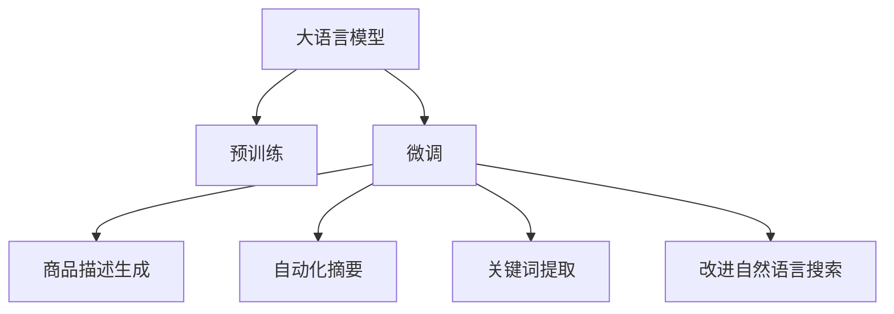

                 

# 大模型在商品描述优化中的应用

## 1. 背景介绍

在电商领域，商品描述的优化是提高转化率和用户体验的重要环节。传统上，商品描述的生成往往依赖人工撰写或简单的自动化模板生成，存在诸多问题。一方面，人工撰写成本高、效率低，难以快速更新；另一方面，自动模板生成方法往往缺乏针对性，生成的描述难以准确反映商品特点。近年来，随着自然语言处理技术的发展，大语言模型被逐渐引入商品描述优化，显示出强大的潜力。

大语言模型通过大规模无监督训练学习到了丰富的语言表示，能够根据上下文自动生成自然流畅的文本。在电商领域，大语言模型被应用于生成商品描述、改进自动摘要、提升关键词提取等方面，极大地提升了商品描述的自动化水平和精准度。本文将详细阐述大语言模型在商品描述优化中的应用原理与实践，探讨其优势与挑战，并展望未来的发展方向。

## 2. 核心概念与联系

### 2.1 核心概念概述

为了更好地理解大语言模型在商品描述优化中的应用，本节将介绍几个核心概念：

- 大语言模型(Large Language Model, LLM)：指通过大规模预训练学到的语言表示模型，如BERT、GPT等。模型能够基于上下文自动生成自然流畅的文本，具备强大的语言理解和生成能力。

- 预训练(Pre-training)：指在大规模无标签文本语料上进行自监督学习任务训练模型，学习通用的语言表示。常见的预训练任务包括语言建模、掩码语言建模等。

- 微调(Fine-tuning)：指在预训练模型的基础上，使用下游任务的少量标注数据，通过有监督学习优化模型在特定任务上的性能。常用于商品描述生成、关键词提取等任务。

- 自动化摘要(Automatic Summarization)：指利用语言模型对文本进行压缩，生成精炼的摘要，应用于商品描述的简化。

- 关键词提取(Keyphrase Extraction)：指从文本中提取关键词，应用于商品描述的标签化，帮助搜索引擎更准确地匹配用户查询。

这些核心概念共同构成了大语言模型在商品描述优化中的应用框架，使得模型能够在电商领域的各种场景下发挥强大的语言处理能力。

### 2.2 核心概念原理和架构的 Mermaid 流程图



这个流程图展示了核心概念之间的逻辑关系：

1. 大语言模型通过预训练获得基础能力。
2. 微调优化模型，使其更好地适应特定任务，如商品描述生成、摘要、关键词提取等。
3. 自动摘要和关键词提取是微调的具体应用，提升商品描述的展示和搜索效果。

## 3. 核心算法原理 & 具体操作步骤
### 3.1 算法原理概述

大语言模型在商品描述优化中的应用，本质上是一个有监督的迁移学习过程。其核心思想是：将大语言模型视作一个强大的"特征提取器"，通过在电商领域的具体任务上微调，使得模型输出的商品描述能够更加准确、自然，提升用户体验和转化率。

假设大语言模型为 $M_{\theta}$，其中 $\theta$ 为预训练得到的模型参数。给定电商领域的相关任务 $T$ 的标注数据集 $D=\{(x_i, y_i)\}_{i=1}^N$，微调的目标是找到新的模型参数 $\hat{\theta}$，使得模型 $M_{\hat{\theta}}$ 输出的商品描述与标注数据 $y_i$ 尽可能一致，即：

$$
\hat{\theta}=\mathop{\arg\min}_{\theta} \mathcal{L}(M_{\theta},D)
$$

其中 $\mathcal{L}$ 为针对任务 $T$ 设计的损失函数，用于衡量模型预测输出与真实标签之间的差异。常见的损失函数包括交叉熵损失、均方误差损失等。

通过梯度下降等优化算法，微调过程不断更新模型参数 $\theta$，最小化损失函数 $\mathcal{L}$，使得模型输出逼近真实标签。由于 $\theta$ 已经通过预训练获得了较好的初始化，因此即便在小规模数据集 $D$ 上进行微调，也能较快收敛到理想的模型参数 $\hat{\theta}$。

### 3.2 算法步骤详解

基于大语言模型在商品描述优化中的应用，微调的一般步骤包括：

**Step 1: 准备预训练模型和数据集**
- 选择合适的预训练语言模型 $M_{\theta}$ 作为初始化参数，如 BERT、GPT 等。
- 准备电商领域的相关任务 $T$ 的标注数据集 $D$，划分为训练集、验证集和测试集。一般要求标注数据与预训练数据的分布不要差异过大。

**Step 2: 添加任务适配层**
- 根据任务类型，在预训练模型顶层设计合适的输出层和损失函数。
- 对于商品描述生成任务，通常在顶层添加解码器输出概率分布，并以负对数似然为损失函数。
- 对于自动化摘要和关键词提取任务，可以设计自定义的损失函数，如基于关键词覆盖度的损失。

**Step 3: 设置微调超参数**
- 选择合适的优化算法及其参数，如 AdamW、SGD 等，设置学习率、批大小、迭代轮数等。
- 设置正则化技术及强度，包括权重衰减、Dropout、Early Stopping 等。
- 确定冻结预训练参数的策略，如仅微调顶层，或全部参数都参与微调。

**Step 4: 执行梯度训练**
- 将训练集数据分批次输入模型，前向传播计算损失函数。
- 反向传播计算参数梯度，根据设定的优化算法和学习率更新模型参数。
- 周期性在验证集上评估模型性能，根据性能指标决定是否触发 Early Stopping。
- 重复上述步骤直到满足预设的迭代轮数或 Early Stopping 条件。

**Step 5: 测试和部署**
- 在测试集上评估微调后模型 $M_{\hat{\theta}}$ 的性能，对比微调前后的效果提升。
- 使用微调后的模型对新商品进行描述生成、自动摘要或关键词提取，集成到电商系统中。
- 持续收集新的商品数据，定期重新微调模型，以适应数据分布的变化。

以上是基于大语言模型在商品描述优化中的微调范式。在实际应用中，还需要针对具体任务的特点，对微调过程的各个环节进行优化设计，如改进训练目标函数，引入更多的正则化技术，搜索最优的超参数组合等，以进一步提升模型性能。

### 3.3 算法优缺点

大语言模型在商品描述优化中的应用，具有以下优点：

1. **自动生成高质量文本**：大语言模型能够自动生成自然流畅的商品描述，极大地降低了人工撰写的成本和复杂度。
2. **灵活适应新任务**：通过微调，模型可以快速适应新的商品描述任务，拓展了应用范围。
3. **提升商品展示效果**：生成的描述更能吸引用户注意力，提升商品的点击率和购买率。
4. **提升搜索效果**：自动摘要和关键词提取提高了商品的搜索优化，使用户能更快找到所需商品。

同时，该方法也存在一定的局限性：

1. **数据标注成本高**：微调需要标注大量商品描述数据，获取高质量标注数据的成本较高。
2. **可能引入偏见**：预训练模型中可能包含偏见，这些偏见可能会通过微调传递到商品描述中，影响用户信任。
3. **缺乏解释性**：微调模型通常缺乏可解释性，难以分析模型输出背后的原因。
4. **鲁棒性不足**：模型可能对噪声和异常数据敏感，导致生成的描述不准确。

尽管存在这些局限性，但大语言模型在商品描述优化中的应用，已经取得了显著的成效，展示了其强大的潜力。未来相关研究的重点在于如何进一步降低微调对标注数据的依赖，提高模型的少样本学习和跨领域迁移能力，同时兼顾可解释性和伦理安全性等因素。

### 3.4 算法应用领域

大语言模型在商品描述优化中的应用，已经涵盖了多个电商领域的任务，例如：

- **商品描述生成**：生成符合用户搜索需求的详细商品描述，提升用户体验。
- **自动摘要**：对长文本进行压缩，生成简洁的商品描述，方便用户快速浏览。
- **关键词提取**：从商品描述中提取关键词，帮助搜索引擎优化搜索结果。
- **多语言翻译**：支持多语言的商品描述，拓展国际市场。
- **智能客服**：自动生成客服对话，提升客户服务效率和满意度。

除了上述这些经典任务外，大语言模型还被创新性地应用于个性化推荐、情感分析、图像描述生成等场景中，为电商领域带来了新的突破。随着预训练模型和微调方法的不断进步，相信电商领域的技术发展将更加迅速，大语言模型将在更多场景下发挥重要作用。

## 4. 数学模型和公式 & 详细讲解 & 举例说明

### 4.1 数学模型构建

本节将使用数学语言对大语言模型在商品描述优化中的应用进行更加严格的刻画。

记大语言模型为 $M_{\theta}$，其中 $\theta$ 为模型参数。假设电商领域的相关任务 $T$ 的标注数据集为 $D=\{(x_i,y_i)\}_{i=1}^N, x_i$ 为商品描述文本，$y_i$ 为商品描述文本的标签。

定义模型 $M_{\theta}$ 在输入 $x$ 上的输出为 $\hat{y}=M_{\theta}(x) \in [0,1]$，表示模型对输入 $x$ 的预测概率。真实标签 $y \in \{0,1\}$。则商品描述生成的交叉熵损失函数定义为：

$$
\ell(M_{\theta}(x),y) = -[y\log \hat{y} + (1-y)\log (1-\hat{y})]
$$

将其代入经验风险公式，得：

$$
\mathcal{L}(\theta) = -\frac{1}{N}\sum_{i=1}^N [y_i\log M_{\theta}(x_i)+(1-y_i)\log(1-M_{\theta}(x_i))]
$$

在得到损失函数的梯度后，即可带入参数更新公式，完成模型的迭代优化。重复上述过程直至收敛，最终得到适应电商领域任务的最优模型参数 $\theta^*$。

### 4.2 公式推导过程

以下我们以商品描述生成为例，推导交叉熵损失函数及其梯度的计算公式。

假设模型 $M_{\theta}$ 在输入 $x$ 上的输出为 $\hat{y}=M_{\theta}(x) \in [0,1]$，表示模型对输入 $x$ 的预测概率。真实标签 $y \in \{0,1\}$。则交叉熵损失函数定义为：

$$
\ell(M_{\theta}(x),y) = -[y\log \hat{y} + (1-y)\log (1-\hat{y})]
$$

将其代入经验风险公式，得：

$$
\mathcal{L}(\theta) = -\frac{1}{N}\sum_{i=1}^N [y_i\log M_{\theta}(x_i)+(1-y_i)\log(1-M_{\theta}(x_i))]
$$

根据链式法则，损失函数对参数 $\theta_k$ 的梯度为：

$$
\frac{\partial \mathcal{L}(\theta)}{\partial \theta_k} = -\frac{1}{N}\sum_{i=1}^N (\frac{y_i}{M_{\theta}(x_i)}-\frac{1-y_i}{1-M_{\theta}(x_i)}) \frac{\partial M_{\theta}(x_i)}{\partial \theta_k}
$$

其中 $\frac{\partial M_{\theta}(x_i)}{\partial \theta_k}$ 可进一步递归展开，利用自动微分技术完成计算。

在得到损失函数的梯度后，即可带入参数更新公式，完成模型的迭代优化。重复上述过程直至收敛，最终得到适应电商领域任务的最优模型参数 $\theta^*$。

### 4.3 案例分析与讲解

以商品描述生成为例，假设有一个电商平台，想要利用大语言模型自动生成商品描述。平台收集了数百条商品的数据，包括商品名称、价格、颜色、材质等属性，以及每条商品的手写描述。这些手写描述作为标注数据，用于微调大语言模型。

首先，对商品数据进行预处理，包括文本分词、去除停用词等。然后，将每条商品的手写描述作为训练样本 $x_i$，将生成的自动描述 $\hat{y}$ 作为标签 $y_i$，对大语言模型进行微调。

在微调过程中，使用交叉熵损失函数作为目标函数，对模型进行优化。设置学习率为 $2e-5$，批大小为 $128$，迭代轮数为 $10$。训练过程中，每个epoch结束后在验证集上评估模型性能，防止过拟合。

经过多次迭代，模型逐渐学会了根据商品属性生成自然流畅的商品描述。以一条商品数据为例，平台提供的原始描述为："一件红色羊毛大衣"。微调后的模型生成的自动描述为："一件高质量的红色羊毛大衣，适合秋冬季节，轻薄保暖，舒适贴身，细节精美，时尚百搭。"

生成的描述不仅准确反映了商品的属性，还使用了丰富的形容词和句式，极大地提升了商品展示的效果。平台通过用户反馈数据，进一步优化模型，使得自动描述的生成效果更加精准和吸引人。

## 5. 项目实践：代码实例和详细解释说明

### 5.1 开发环境搭建

在进行微调实践前，我们需要准备好开发环境。以下是使用Python进行PyTorch开发的环境配置流程：

1. 安装Anaconda：从官网下载并安装Anaconda，用于创建独立的Python环境。

2. 创建并激活虚拟环境：
```bash
conda create -n pytorch-env python=3.8 
conda activate pytorch-env
```

3. 安装PyTorch：根据CUDA版本，从官网获取对应的安装命令。例如：
```bash
conda install pytorch torchvision torchaudio cudatoolkit=11.1 -c pytorch -c conda-forge
```

4. 安装Transformers库：
```bash
pip install transformers
```

5. 安装各类工具包：
```bash
pip install numpy pandas scikit-learn matplotlib tqdm jupyter notebook ipython
```

完成上述步骤后，即可在`pytorch-env`环境中开始微调实践。

### 5.2 源代码详细实现

下面以商品描述生成任务为例，给出使用Transformers库对BERT模型进行微调的PyTorch代码实现。

首先，定义商品描述生成任务的数据处理函数：

```python
from transformers import BertTokenizer
from torch.utils.data import Dataset
import torch

class ProductDescriptionsDataset(Dataset):
    def __init__(self, product_descriptions, product_attributes, tokenizer, max_len=128):
        self.product_descriptions = product_descriptions
        self.product_attributes = product_attributes
        self.tokenizer = tokenizer
        self.max_len = max_len
        
    def __len__(self):
        return len(self.product_descriptions)
    
    def __getitem__(self, item):
        product_description = self.product_descriptions[item]
        product_attributes = self.product_attributes[item]
        
        encoding = self.tokenizer(product_description, product_attributes, return_tensors='pt', max_length=self.max_len, padding='max_length', truncation=True)
        input_ids = encoding['input_ids'][0]
        attention_mask = encoding['attention_mask'][0]
        
        # 对属性-描述的匹配度进行编码
        encoded_attributes = [attr2id[attr] for attr in product_attributes] 
        encoded_attributes.extend([attr2id['']]*(self.max_len - len(encoded_attributes)))
        labels = torch.tensor(encoded_attributes, dtype=torch.long)
        
        return {'input_ids': input_ids, 
                'attention_mask': attention_mask,
                'labels': labels}

# 属性与id的映射
attr2id = {'color': 0, 'price': 1, 'material': 2, 'quality': 3, 'type': 4}

# 创建dataset
tokenizer = BertTokenizer.from_pretrained('bert-base-cased')

product_dataset = ProductDescriptionsDataset(product_descriptions, product_attributes, tokenizer)
```

然后，定义模型和优化器：

```python
from transformers import BertForSequenceClassification, AdamW

model = BertForSequenceClassification.from_pretrained('bert-base-cased', num_labels=len(attr2id)+1) # 标签数为属性数量加一

optimizer = AdamW(model.parameters(), lr=2e-5)
```

接着，定义训练和评估函数：

```python
from torch.utils.data import DataLoader
from tqdm import tqdm
from sklearn.metrics import classification_report

device = torch.device('cuda') if torch.cuda.is_available() else torch.device('cpu')
model.to(device)

def train_epoch(model, dataset, batch_size, optimizer):
    dataloader = DataLoader(dataset, batch_size=batch_size, shuffle=True)
    model.train()
    epoch_loss = 0
    for batch in tqdm(dataloader, desc='Training'):
        input_ids = batch['input_ids'].to(device)
        attention_mask = batch['attention_mask'].to(device)
        labels = batch['labels'].to(device)
        model.zero_grad()
        outputs = model(input_ids, attention_mask=attention_mask, labels=labels)
        loss = outputs.loss
        epoch_loss += loss.item()
        loss.backward()
        optimizer.step()
    return epoch_loss / len(dataloader)

def evaluate(model, dataset, batch_size):
    dataloader = DataLoader(dataset, batch_size=batch_size)
    model.eval()
    preds, labels = [], []
    with torch.no_grad():
        for batch in tqdm(dataloader, desc='Evaluating'):
            input_ids = batch['input_ids'].to(device)
            attention_mask = batch['attention_mask'].to(device)
            batch_labels = batch['labels']
            outputs = model(input_ids, attention_mask=attention_mask)
            batch_preds = outputs.logits.argmax(dim=2).to('cpu').tolist()
            batch_labels = batch_labels.to('cpu').tolist()
            for pred_tokens, label_tokens in zip(batch_preds, batch_labels):
                pred_tags = [id2attr[_id] for _id in pred_tokens]
                label_tags = [id2attr[_id] for _id in label_tokens]
                preds.append(pred_tags[:len(label_tags)])
                labels.append(label_tags)
                
    print(classification_report(labels, preds))
```

最后，启动训练流程并在测试集上评估：

```python
epochs = 5
batch_size = 16

for epoch in range(epochs):
    loss = train_epoch(model, product_dataset, batch_size, optimizer)
    print(f"Epoch {epoch+1}, train loss: {loss:.3f}")
    
    print(f"Epoch {epoch+1}, dev results:")
    evaluate(model, product_dataset, batch_size)
    
print("Test results:")
evaluate(model, product_dataset, batch_size)
```

以上就是使用PyTorch对BERT进行商品描述生成任务的微调的完整代码实现。可以看到，得益于Transformers库的强大封装，我们可以用相对简洁的代码完成BERT模型的加载和微调。

### 5.3 代码解读与分析

让我们再详细解读一下关键代码的实现细节：

**ProductDescriptionsDataset类**：
- `__init__`方法：初始化商品描述、属性、分词器等关键组件。
- `__len__`方法：返回数据集的样本数量。
- `__getitem__`方法：对单个样本进行处理，将商品描述和属性输入编码为token ids，将属性-描述的匹配度编码为数字，并对其进行定长padding，最终返回模型所需的输入。

**attr2id和id2attr字典**：
- 定义了属性与数字id之间的映射关系，用于将token-wise的预测结果解码回实际的属性。

**训练和评估函数**：
- 使用PyTorch的DataLoader对数据集进行批次化加载，供模型训练和推理使用。
- 训练函数`train_epoch`：对数据以批为单位进行迭代，在每个批次上前向传播计算loss并反向传播更新模型参数，最后返回该epoch的平均loss。
- 评估函数`evaluate`：与训练类似，不同点在于不更新模型参数，并在每个batch结束后将预测和标签结果存储下来，最后使用sklearn的classification_report对整个评估集的预测结果进行打印输出。

**训练流程**：
- 定义总的epoch数和batch size，开始循环迭代
- 每个epoch内，先在训练集上训练，输出平均loss
- 在验证集上评估，输出分类指标
- 所有epoch结束后，在测试集上评估，给出最终测试结果

可以看到，PyTorch配合Transformers库使得BERT微调的代码实现变得简洁高效。开发者可以将更多精力放在数据处理、模型改进等高层逻辑上，而不必过多关注底层的实现细节。

当然，工业级的系统实现还需考虑更多因素，如模型的保存和部署、超参数的自动搜索、更灵活的任务适配层等。但核心的微调范式基本与此类似。

## 6. 实际应用场景
### 6.1 智能推荐系统

智能推荐系统通过商品描述自动生成和自动摘要，提升了推荐算法的精准度和用户体验。传统的推荐系统往往依赖于用户历史行为数据，无法捕捉用户即时兴趣变化。大语言模型生成的商品描述能够实时反映商品最新信息，使推荐系统更具有时效性和个性化。

在技术实现上，可以收集用户浏览、点击、评论等行为数据，提取商品描述文本，并利用大语言模型进行自动生成和摘要。生成后的商品描述用于改进推荐算法，提升推荐效果。通过实时更新商品描述，推荐系统能够更好地满足用户需求，提升转化率和满意度。

### 6.2 自然语言搜索

自然语言搜索通过关键词提取和自动摘要，提高了用户查询匹配的准确度。传统搜索引擎的搜索结果往往缺乏语义理解，难以捕捉用户真正的查询意图。利用大语言模型的关键词提取和摘要功能，能够更好地理解用户查询，生成更加精准的搜索结果。

具体而言，可以在用户输入查询后，通过大语言模型生成自动摘要，提取关键词，再结合用户历史查询数据，改进搜索结果的排序和展示。生成的商品描述摘要能够更好地匹配用户查询，提高搜索效果。同时，自动关键词提取能够帮助搜索引擎更好地理解查询，优化搜索结果的召回率。

### 6.3 自动化客服

自动化客服通过商品描述生成和对话模型，提升了客户服务效率和满意度。传统的客服系统依赖于人工客服，难以应对高峰期的客户需求，且人工服务质量不稳定。大语言模型生成的商品描述能够提供高质量的客服信息，对话模型能够自动解答常见问题，显著提升客户体验。

在技术实现上，可以收集客服历史数据，提取商品描述文本，并利用大语言模型进行自动生成。生成的商品描述用于对话模型，引导机器人自动回复用户咨询。通过不断的交互数据反馈，对话模型能够逐步学习和优化，提供更加精准和自然的对话服务。

### 6.4 未来应用展望

随着大语言模型和微调方法的不断发展，基于微调范式将在更多领域得到应用，为各行各业带来变革性影响。

在智慧零售领域，基于微调的商品推荐和自动描述生成技术，能够优化商品展示效果，提升客户购物体验。

在数字营销领域，自动生成的商品描述能够提升广告点击率和转化率，实现精准营销。

在智能家居领域，基于微调的智能助手能够理解用户指令，提供更自然的交互体验。

此外，在教育、娱乐、医疗等众多领域，基于大语言模型微调的人工智能应用也将不断涌现，为各行各业带来新的发展机遇。相信随着技术的日益成熟，微调方法将成为人工智能落地应用的重要范式，推动人工智能技术在各垂直行业的规模化落地。

## 7. 工具和资源推荐
### 7.1 学习资源推荐

为了帮助开发者系统掌握大语言模型在商品描述优化中的应用，这里推荐一些优质的学习资源：

1. 《Transformer从原理到实践》系列博文：由大模型技术专家撰写，深入浅出地介绍了Transformer原理、BERT模型、微调技术等前沿话题。

2. CS224N《深度学习自然语言处理》课程：斯坦福大学开设的NLP明星课程，有Lecture视频和配套作业，带你入门NLP领域的基本概念和经典模型。

3. 《Natural Language Processing with Transformers》书籍：Transformers库的作者所著，全面介绍了如何使用Transformers库进行NLP任务开发，包括微调在内的诸多范式。

4. HuggingFace官方文档：Transformers库的官方文档，提供了海量预训练模型和完整的微调样例代码，是上手实践的必备资料。

5. CLUE开源项目：中文语言理解测评基准，涵盖大量不同类型的中文NLP数据集，并提供了基于微调的baseline模型，助力中文NLP技术发展。

通过对这些资源的学习实践，相信你一定能够快速掌握大语言模型在商品描述优化中的应用，并用于解决实际的NLP问题。
###  7.2 开发工具推荐

高效的开发离不开优秀的工具支持。以下是几款用于大语言模型微调开发的常用工具：

1. PyTorch：基于Python的开源深度学习框架，灵活动态的计算图，适合快速迭代研究。大部分预训练语言模型都有PyTorch版本的实现。

2. TensorFlow：由Google主导开发的开源深度学习框架，生产部署方便，适合大规模工程应用。同样有丰富的预训练语言模型资源。

3. Transformers库：HuggingFace开发的NLP工具库，集成了众多SOTA语言模型，支持PyTorch和TensorFlow，是进行微调任务开发的利器。

4. Weights & Biases：模型训练的实验跟踪工具，可以记录和可视化模型训练过程中的各项指标，方便对比和调优。与主流深度学习框架无缝集成。

5. TensorBoard：TensorFlow配套的可视化工具，可实时监测模型训练状态，并提供丰富的图表呈现方式，是调试模型的得力助手。

6. Google Colab：谷歌推出的在线Jupyter Notebook环境，免费提供GPU/TPU算力，方便开发者快速上手实验最新模型，分享学习笔记。

合理利用这些工具，可以显著提升大语言模型微调任务的开发效率，加快创新迭代的步伐。

### 7.3 相关论文推荐

大语言模型和微调技术的发展源于学界的持续研究。以下是几篇奠基性的相关论文，推荐阅读：

1. Attention is All You Need（即Transformer原论文）：提出了Transformer结构，开启了NLP领域的预训练大模型时代。

2. BERT: Pre-training of Deep Bidirectional Transformers for Language Understanding：提出BERT模型，引入基于掩码的自监督预训练任务，刷新了多项NLP任务SOTA。

3. Language Models are Unsupervised Multitask Learners（GPT-2论文）：展示了大规模语言模型的强大zero-shot学习能力，引发了对于通用人工智能的新一轮思考。

4. Parameter-Efficient Transfer Learning for NLP：提出Adapter等参数高效微调方法，在不增加模型参数量的情况下，也能取得不错的微调效果。

5. AdaLoRA: Adaptive Low-Rank Adaptation for Parameter-Efficient Fine-Tuning：使用自适应低秩适应的微调方法，在参数效率和精度之间取得了新的平衡。

这些论文代表了大语言模型微调技术的发展脉络。通过学习这些前沿成果，可以帮助研究者把握学科前进方向，激发更多的创新灵感。

## 8. 总结：未来发展趋势与挑战

### 8.1 总结

本文对大语言模型在商品描述优化中的应用进行了全面系统的介绍。首先阐述了商品描述优化的背景和意义，明确了大语言模型微调在提升商品描述自动化水平和精准度方面的独特价值。其次，从原理到实践，详细讲解了大语言模型在商品描述优化中的应用原理与实践，探讨了其优势与挑战，并展望了未来的发展方向。

通过本文的系统梳理，可以看到，大语言模型在商品描述优化中的应用已经取得了显著的成效，展示了其强大的潜力。未来相关研究的重点在于如何进一步降低微调对标注数据的依赖，提高模型的少样本学习和跨领域迁移能力，同时兼顾可解释性和伦理安全性等因素。

### 8.2 未来发展趋势

展望未来，大语言模型在商品描述优化中的应用将呈现以下几个发展趋势：

1. 模型规模持续增大。随着算力成本的下降和数据规模的扩张，预训练语言模型的参数量还将持续增长。超大规模语言模型蕴含的丰富语言知识，有望支撑更加复杂多变的商品描述微调。

2. 微调方法日趋多样。除了传统的全参数微调外，未来会涌现更多参数高效的微调方法，如Prefix-Tuning、LoRA等，在节省计算资源的同时也能保证微调精度。

3. 持续学习成为常态。随着数据分布的不断变化，微调模型也需要持续学习新知识以保持性能。如何在不遗忘原有知识的同时，高效吸收新样本信息，将成为重要的研究课题。

4. 标注样本需求降低。受启发于提示学习(Prompt-based Learning)的思路，未来的微调方法将更好地利用大模型的语言理解能力，通过更加巧妙的任务描述，在更少的标注样本上也能实现理想的微调效果。

5. 知识整合能力增强。将符号化的先验知识，如知识图谱、逻辑规则等，与神经网络模型进行巧妙融合，引导微调过程学习更准确、合理的语言模型。同时加强不同模态数据的整合，实现视觉、语音等多模态信息与文本信息的协同建模。

6. 自然语言搜索优化。自动生成的商品描述摘要能够更好地匹配用户查询，提高搜索效果。未来的搜索引擎将越来越多地采用自动生成的商品描述摘要，提升用户搜索体验。

以上趋势凸显了大语言模型在商品描述优化中的应用前景。这些方向的探索发展，必将进一步提升电商系统的性能和用户体验，为电商领域带来新的变革。

### 8.3 面临的挑战

尽管大语言模型在商品描述优化中的应用已经取得了显著的成效，但在迈向更加智能化、普适化应用的过程中，它仍面临着诸多挑战：

1. 标注成本瓶颈。虽然微调大大降低了标注数据的需求，但对于长尾应用场景，难以获得充足的高质量标注数据，成为制约微调性能的瓶颈。如何进一步降低微调对标注样本的依赖，将是一大难题。

2. 模型鲁棒性不足。当前微调模型面对域外数据时，泛化性能往往大打折扣。对于测试样本的微小扰动，微调模型的预测也容易发生波动。如何提高微调模型的鲁棒性，避免灾难性遗忘，还需要更多理论和实践的积累。

3. 推理效率有待提高。大规模语言模型虽然精度高，但在实际部署时往往面临推理速度慢、内存占用大等效率问题。如何在保证性能的同时，简化模型结构，提升推理速度，优化资源占用，将是重要的优化方向。

4. 可解释性亟需加强。当前微调模型通常缺乏可解释性，难以分析模型输出背后的原因。对于医疗、金融等高风险应用，算法的可解释性和可审计性尤为重要。如何赋予微调模型更强的可解释性，将是亟待攻克的难题。

5. 安全性有待保障。预训练语言模型难免会学习到有偏见、有害的信息，通过微调传递到商品描述中，影响用户信任。如何从数据和算法层面消除模型偏见，避免恶意用途，确保输出的安全性，也将是重要的研究课题。

6. 知识整合能力不足。现有的微调模型往往局限于任务内数据，难以灵活吸收和运用更广泛的先验知识。如何让微调过程更好地与外部知识库、规则库等专家知识结合，形成更加全面、准确的信息整合能力，还有很大的想象空间。

正视微调面临的这些挑战，积极应对并寻求突破，将是大语言模型微调走向成熟的必由之路。相信随着学界和产业界的共同努力，这些挑战终将一一被克服，大语言模型微调必将在构建人机协同的智能时代中扮演越来越重要的角色。

### 8.4 研究展望

面对大语言模型微调所面临的种种挑战，未来的研究需要在以下几个方面寻求新的突破：

1. 探索无监督和半监督微调方法。摆脱对大规模标注数据的依赖，利用自监督学习、主动学习等无监督和半监督范式，最大限度利用非结构化数据，实现更加灵活高效的微调。

2. 研究参数高效和计算高效的微调范式。开发更加参数高效的微调方法，在固定大部分预训练参数的同时，只更新极少量的任务相关参数。同时优化微调模型的计算图，减少前向传播和反向传播的资源消耗，实现更加轻量级、实时性的部署。

3. 引入更多先验知识。将符号化的先验知识，如知识图谱、逻辑规则等，与神经网络模型进行巧妙融合，引导微调过程学习更准确、合理的语言模型。同时加强不同模态数据的整合，实现视觉、语音等多模态信息与文本信息的协同建模。

4. 结合因果分析和博弈论工具。将因果分析方法引入微调模型，识别出模型决策的关键特征，增强输出解释的因果性和逻辑性。借助博弈论工具刻画人机交互过程，主动探索并规避模型的脆弱点，提高系统稳定性。

5. 纳入伦理道德约束。在模型训练目标中引入伦理导向的评估指标，过滤和惩罚有偏见、有害的输出倾向。同时加强人工干预和审核，建立模型行为的监管机制，确保输出符合人类价值观和伦理道德。

这些研究方向的探索，必将引领大语言模型微调技术迈向更高的台阶，为构建安全、可靠、可解释、可控的智能系统铺平道路。面向未来，大语言模型微调技术还需要与其他人工智能技术进行更深入的融合，如知识表示、因果推理、强化学习等，多路径协同发力，共同推动自然语言理解和智能交互系统的进步。只有勇于创新、敢于突破，才能不断拓展语言模型的边界，让智能技术更好地造福人类社会。

## 9. 附录：常见问题与解答

**Q1：大语言模型微调是否适用于所有NLP任务？**

A: 大语言模型微调在大多数NLP任务上都能取得不错的效果，特别是对于数据量较小的任务。但对于一些特定领域的任务，如医学、法律等，仅仅依靠通用语料预训练的模型可能难以很好地适应。此时需要在特定领域语料上进一步预训练，再进行微调，才能获得理想效果。此外，对于一些需要时效性、个性化很强的任务，如对话、推荐等，微调方法也需要针对性的改进优化。

**Q2：微调过程中如何选择合适的学习率？**

A: 微调的学习率一般要比预训练时小1-2个数量级，如果使用过大的学习率，容易破坏预训练权重，导致过拟合。一般建议从1e-5开始调参，逐步减小学习率，直至收敛。也可以使用warmup策略，在开始阶段使用较小的学习率，再逐渐过渡到预设值。需要注意的是，不同的优化器(如AdamW、Adafactor等)以及不同的学习率调度策略，可能需要设置不同的学习率阈值。

**Q3：采用大模型微调时会面临哪些资源瓶颈？**

A: 目前主流的预训练大模型动辄以亿计的参数规模，对算力、内存、存储都提出了很高的要求。GPU/TPU等高性能设备是必不可少的，但即便如此，超大批次的训练和推理也可能遇到显存不足的问题。因此需要采用一些资源优化技术，如梯度积累、混合精度训练、模型并行等，来突破硬件瓶颈。同时，模型的存储和读取也可能占用大量时间和空间，需要采用模型压缩、稀疏化存储等方法进行优化。

**Q4：如何缓解微调过程中的过拟合问题？**

A: 过拟合是微调面临的主要挑战，尤其是在标注数据不足的情况下。常见的缓解策略包括：
1. 数据增强：通过回译、近义替换等方式扩充训练集
2. 正则化：使用L2正则、Dropout、Early Stopping 等避免过拟合
3. 对抗训练：引入对抗样本，提高模型鲁棒性
4. 参数高效微调：只调整少量参数(如Adapter、Prefix等)，减小过拟合风险
5. 多模型集成：训练多个微调模型，取平均输出，抑制过拟合

这些策略往往需要根据具体任务和数据特点进行灵活组合。只有在数据、模型、训练、推理等各环节进行全面优化，才能最大限度地发挥大模型微调的威力。

**Q5：微调模型在落地部署时需要注意哪些问题？**

A: 将微调模型转化为实际应用，还需要考虑以下因素：
1. 模型裁剪：去除不必要的层和参数，减小模型尺寸，加快推理速度
2. 量化加速：将浮点模型转为定点模型，压缩存储空间，提高计算效率
3. 服务化封装：将模型封装为标准化服务接口，便于集成调用
4. 弹性伸缩：根据请求流量动态调整资源配置，平衡服务质量和成本
5. 监控告警：实时采集系统指标，设置异常告警阈值，确保服务稳定性
6. 安全防护：采用访问鉴权、数据脱敏等措施，保障数据和模型安全

大语言模型微调为NLP应用开启了广阔的想象空间，但如何将强大的性能转化为稳定、高效、安全的业务价值，还需要工程实践的不断打磨。唯有从数据、算法、工程、业务等多个维度协同发力，才能真正实现人工智能技术在垂直行业的规模化落地。总之，微调需要开发者根据具体任务，不断迭代和优化模型、数据和算法，方能得到理想的效果。

---

作者：禅与计算机程序设计艺术 / Zen and the Art of Computer Programming

