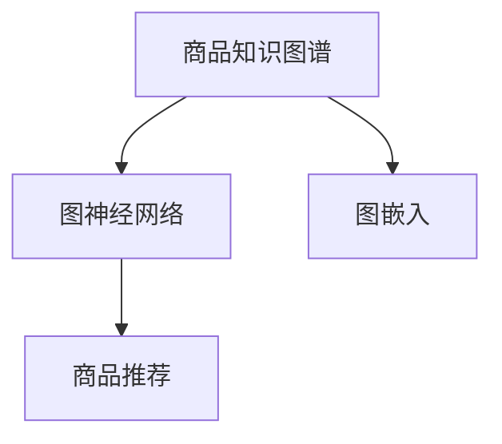

                 

# 大模型在商品知识图谱构建中的应用

> 关键词：商品知识图谱,大模型,图神经网络,图嵌入,商品推荐,异构图谱

## 1. 背景介绍

### 1.1 问题由来
在电子商务领域，商品推荐系统是提升用户购物体验和平台交易量的关键环节。然而，传统的推荐算法往往基于静态的特征向量和稀疏矩阵进行推荐，无法充分挖掘商品间的隐含关系，导致推荐精度和覆盖率受限。随着图神经网络(Graph Neural Network, GNN)和大模型的兴起，以商品知识图谱为代表的图结构化数据引起了广泛关注。

商品知识图谱以商品为节点，商品属性、品牌、价格等为关系，构建了一个商品间的相互关联网络。图神经网络能够对图结构化数据进行高效建模，深度挖掘商品间的隐含关系，从而显著提升推荐系统的性能。此外，大模型在预训练阶段已经具备了广泛的知识储备，可以辅助图神经网络进行知识迁移，进一步提高推荐效果。

## 2. 核心概念与联系

### 2.1 核心概念概述

为了更好地理解大模型在商品知识图谱中的应用，本节将介绍几个密切相关的核心概念：

- 商品知识图谱：以商品为节点，商品属性、品牌、价格等为关系，构建的商品间相互关联的网络结构。
- 图神经网络：基于深度学习的图结构化数据处理方法，能够从图中学习节点间的关系，挖掘隐含的复杂结构信息。
- 图嵌入：将图结构化数据映射为低维向量表示的技术，便于在大模型中进行表示学习。
- 商品推荐：以用户行为数据和商品知识图谱为基础，构建推荐模型，为每位用户推荐感兴趣的、有价值的商品。

这些核心概念之间的逻辑关系可以通过以下Mermaid流程图来展示：



这个流程图展示了大模型在商品知识图谱构建中的应用流程：

1. 构建商品知识图谱，用于商品关系的表示和推理。
2. 通过图嵌入技术将图结构化数据映射为低维向量表示。
3. 在大模型上进行预训练，学习商品属性和关系的语义表示。
4. 结合图神经网络，对商品图谱进行关系建模，挖掘商品间隐含关系。
5. 构建推荐模型，利用图谱信息提升推荐精度和覆盖率。

## 3. 核心算法原理 & 具体操作步骤
### 3.1 算法原理概述

大模型在商品知识图谱中的应用主要分为两个步骤：

1. **图嵌入表示学习**：将商品知识图谱中的节点和关系转换为低维向量表示，使得模型能够高效地进行特征提取和关系推理。

2. **基于图神经网络的推荐建模**：通过图神经网络对商品知识图谱进行关系建模，结合大模型的语义表示进行推荐计算。

形式化地，假设商品知识图谱为 $\mathcal{G} = (\mathcal{V}, \mathcal{E}, \mathcal{R})$，其中 $\mathcal{V}$ 为节点集合，$\mathcal{E}$ 为边集合，$\mathcal{R}$ 为关系集合。商品嵌入表示为大矩阵 $\mathbf{E} \in \mathbb{R}^{N \times d}$，其中 $N$ 为节点数，$d$ 为嵌入维度。通过图嵌入学习，将商品节点表示为低维向量，关系表示为高维矩阵。在推荐阶段，利用图神经网络对商品图谱进行关系建模，通过节点间的关系进行推荐计算，得到推荐结果。

### 3.2 算法步骤详解

**Step 1: 数据预处理**

- 收集商品知识图谱数据，将其转换为三元组 $\{(h,r,t)\}$ 的形式，其中 $h$ 为头节点，$r$ 为关系，$t$ 为尾节点。
- 构建商品属性向量表，如品牌、价格、描述等，为每个节点增加属性表示。
- 对图谱进行补全和噪声过滤，确保数据完整性和质量。

**Step 2: 图嵌入表示学习**

- 选择图嵌入算法，如KG2Vec、TransE、QuatNet等，将商品知识图谱中的节点和关系进行低维向量表示。
- 训练图嵌入模型，优化损失函数，使得节点表示和关系表示能够最大化保留图谱的语义信息。
- 得到商品节点的嵌入向量 $\mathbf{E} \in \mathbb{R}^{N \times d}$ 和关系矩阵 $\mathbf{R} \in \mathbb{R}^{|\mathcal{R}| \times d \times d}$。

**Step 3: 基于图神经网络的推荐建模**

- 选择图神经网络，如GCN、GAT、GNN等，构建基于商品知识图谱的推荐模型。
- 将商品节点的嵌入向量作为输入，关系矩阵作为关系权重，构建图神经网络。
- 训练图神经网络，优化损失函数，使得推荐模型能够充分利用商品间的关系信息。
- 得到商品推荐模型 $\mathbf{F} \in \mathbb{R}^{N \times K}$，其中 $K$ 为推荐结果的个数。

**Step 4: 实际推荐应用**

- 根据用户的历史行为数据，获取商品图谱中的相关节点。
- 利用商品推荐模型 $\mathbf{F}$，计算每项商品对用户的相关度评分。
- 选取高相关度的商品作为推荐结果。

### 3.3 算法优缺点

基于大模型的商品推荐方法具有以下优点：

1. 数据利用充分：商品知识图谱和大模型可以充分利用商品的结构化和非结构化数据，挖掘更多的商品间隐含关系。
2. 性能优越：结合了图神经网络和预训练大模型的优势，推荐精度和覆盖率显著提升。
3. 可解释性强：大模型本身具备较强的可解释性，结合图神经网络，可以更好地理解推荐结果的逻辑。
4. 泛化能力强：大模型在大规模数据上预训练得到的表示，能够迁移到特定商品图谱中，避免从头训练。

同时，该方法也存在一定的局限性：

1. 计算复杂度高：构建商品知识图谱和训练图神经网络计算资源消耗大，对硬件设施要求高。
2. 数据分布依赖：需要大量标注的领域商品知识图谱数据，对数据分布的要求较高。
3. 训练时间长：大规模图谱和预训练大模型训练时间较长，需要大量计算资源。
4. 模型部署难：推荐模型需要持续更新数据和模型，部署难度较大。

尽管存在这些局限性，但就目前而言，基于大模型的商品推荐方法仍是最主流、最有效的推荐手段。未来相关研究的重点在于如何进一步降低计算成本，提高推荐效率，同时兼顾可解释性和泛化能力等因素。

### 3.4 算法应用领域

基于大模型的商品推荐方法已经在电商、零售、快消等众多领域得到了广泛的应用，取得了显著的商业价值和社会效益：

- 电商推荐系统：如淘宝、京东、Amazon等，利用商品知识图谱和大模型提升个性化推荐效果，增加用户粘性。
- 零售营销分析：如沃尔玛、家乐福等，通过商品知识图谱和大模型进行营销策略优化，提升销售收益。
- 快消品智能推荐：如快时尚品牌、美妆品牌等，利用商品知识图谱和大模型进行新品推荐，提升用户体验。
- 智能仓储管理：如物流公司、仓储企业等，通过商品知识图谱和大模型进行智能仓储调度，提高仓储效率。
- 智能客服系统：如电商平台、金融公司等，利用商品知识图谱和大模型进行智能客服问答，提升客户满意度。

除了以上这些应用外，基于大模型的商品推荐方法还广泛应用于各类电商和零售相关的业务环节，如商品搜索、搭配推荐、价格优化等，极大地提升了电商和零售业务的用户体验和运营效率。

## 4. 数学模型和公式 & 详细讲解 & 举例说明
### 4.1 数学模型构建

本节将使用数学语言对基于大模型的商品推荐方法进行更加严格的刻画。

记商品知识图谱为 $\mathcal{G} = (\mathcal{V}, \mathcal{E}, \mathcal{R})$，其中 $\mathcal{V}$ 为节点集合，$\mathcal{E}$ 为边集合，$\mathcal{R}$ 为关系集合。商品节点嵌入向量为大矩阵 $\mathbf{E} \in \mathbb{R}^{N \times d}$，其中 $N$ 为节点数，$d$ 为嵌入维度。关系矩阵为大矩阵 $\mathbf{R} \in \mathbb{R}^{|\mathcal{R}| \times d \times d}$。

假设商品推荐模型的优化目标是最小化预测误差，即：

$$
\mathcal{L}(\mathbf{E}, \mathbf{R}, \mathbf{F}) = \sum_{(i,j) \in \mathcal{E}} \ell_{ij}(\mathbf{E}, \mathbf{R}, \mathbf{F})
$$

其中 $\ell_{ij}$ 为损失函数，通常采用均方误差、对数似然等。

### 4.2 公式推导过程

以下我们以商品推荐为例，推导基于大模型的推荐公式。

假设商品知识图谱为 $\mathcal{G} = (\mathcal{V}, \mathcal{E}, \mathcal{R})$，其中 $N$ 个商品节点为 $\mathbf{V} \in \mathbb{R}^{N \times d}$，$M$ 个关系类型为 $\mathbf{R} \in \mathbb{R}^{M \times d \times d}$，$K$ 个推荐结果为 $\mathbf{F} \in \mathbb{R}^{N \times K}$。则推荐模型的预测公式为：

$$
\hat{\mathbf{F}} = \mathbf{V} \mathbf{R}^\top \mathbf{R}^\top
$$

其中 $\mathbf{R}^\top$ 为关系矩阵的转置，$\mathbf{R}^\top \mathbf{R}^\top$ 为关系矩阵的幂运算。将预测结果 $\hat{\mathbf{F}}$ 与真实推荐结果 $\mathbf{F}$ 的误差最小化，得到推荐模型的损失函数：

$$
\mathcal{L}(\mathbf{V}, \mathbf{R}, \mathbf{F}) = \frac{1}{2} \Vert \mathbf{F} - \mathbf{F}^\top \mathbf{V} \mathbf{R}^\top \mathbf{R}^\top \Vert_F^2
$$

其中 $\Vert \cdot \Vert_F$ 为矩阵的Frobenius范数，$\mathbf{F}^\top$ 为推荐结果矩阵的转置。根据均方误差损失函数，得到优化目标函数：

$$
\min_{\mathbf{V}, \mathbf{R}, \mathbf{F}} \mathcal{L}(\mathbf{V}, \mathbf{R}, \mathbf{F})
$$

通过梯度下降等优化算法，求解上述目标函数，得到商品节点嵌入向量 $\mathbf{V}$、关系矩阵 $\mathbf{R}$ 和推荐结果矩阵 $\mathbf{F}$，完成商品推荐模型的训练。

## 5. 项目实践：代码实例和详细解释说明
### 5.1 开发环境搭建

在进行商品推荐系统开发前，我们需要准备好开发环境。以下是使用Python进行TensorFlow开发的环境配置流程：

1. 安装Anaconda：从官网下载并安装Anaconda，用于创建独立的Python环境。

2. 创建并激活虚拟环境：
```bash
conda create -n tf-env python=3.8 
conda activate tf-env
```

3. 安装TensorFlow：根据CUDA版本，从官网获取对应的安装命令。例如：
```bash
pip install tensorflow
```

4. 安装各类工具包：
```bash
pip install numpy pandas scikit-learn matplotlib tqdm jupyter notebook ipython
```

完成上述步骤后，即可在`tf-env`环境中开始商品推荐系统的开发。

### 5.2 源代码详细实现

下面我们以基于大模型的商品推荐系统为例，给出TensorFlow代码实现。

首先，定义商品知识图谱的数据结构：

```python
import tensorflow as tf
import numpy as np

# 商品节点嵌入向量
V = tf.Variable(tf.random.normal(shape=(N, d)), name='V')
# 关系矩阵
R = tf.Variable(tf.random.normal(shape=(M, d, d)), name='R')
# 推荐结果矩阵
F = tf.Variable(tf.random.normal(shape=(N, K)), name='F')
```

然后，定义优化器、损失函数和评估指标：

```python
# 定义优化器
optimizer = tf.keras.optimizers.Adam()

# 定义损失函数
loss_fn = tf.keras.losses.MeanSquaredError()

# 定义评估指标
metrics = [
    tf.keras.metrics.MeanSquaredError(name='MSE'),
    tf.keras.metrics.AUC(name='AUC')
]
```

接着，定义推荐模型的训练流程：

```python
@tf.function
def train_step(batch):
    with tf.GradientTape() as tape:
        predictions = F @ V @ R @ R @ tf.transpose(F)
        loss = loss_fn(y_true, predictions)
    gradients = tape.gradient(loss, [V, R, F])
    optimizer.apply_gradients(zip(gradients, [V, R, F]))
    return loss

@tf.function
def eval_step(batch):
    predictions = F @ V @ R @ R @ tf.transpose(F)
    mse = metrics[0](y_true, predictions)
    auc = metrics[1](y_true, predictions)
    return mse, auc

# 定义训练和评估函数
def train_epoch(epochs, batch_size):
    for epoch in range(epochs):
        for batch in dataset:
            loss = train_step(batch)
            metrics = eval_step(batch)
            print('Epoch {}: Loss {:.4f}, MSE {:.4f}, AUC {:.4f}'.format(epoch+1, loss, metrics[0], metrics[1]))

# 启动训练流程
train_epoch(10, batch_size=32)
```

最后，在训练完成后，我们可以将模型导出并部署到生产环境：

```python
# 导出模型
model.save('recommendation_model.h5')

# 加载模型进行推理
model = tf.keras.models.load_model('recommendation_model.h5')
predictions = model.predict(X)
```

以上就是使用TensorFlow进行基于大模型的商品推荐系统的完整代码实现。可以看到，TensorFlow的Keras API使得模型构建和训练变得简洁高效。

### 5.3 代码解读与分析

让我们再详细解读一下关键代码的实现细节：

**V、R、F定义**：
- `V` 为商品节点嵌入向量，`R` 为关系矩阵，`F` 为推荐结果矩阵。

**优化器和损失函数**：
- `optimizer` 为Adam优化器，`loss_fn` 为均方误差损失函数。

**训练和评估函数**：
- `train_step` 函数定义了模型前向传播和反向传播过程，并计算损失函数。
- `eval_step` 函数定义了模型前向传播，并计算评估指标。
- `train_epoch` 函数循环迭代训练过程，输出每轮训练的损失和评估指标。

**模型导出和部署**：
- 使用`model.save`函数将训练好的模型保存为`h5`格式，便于后续部署。
- 使用`tf.keras.models.load_model`函数加载模型，进行预测。

可以看到，TensorFlow的Keras API使得模型构建和训练变得简洁高效，开发者可以将更多精力放在模型优化和业务逻辑实现上，而不必过多关注底层的实现细节。

当然，在实际应用中，还需要考虑更多因素，如模型的保存和部署、超参数的调整、分布式训练等，才能确保模型在实际环境中稳定运行。

## 6. 实际应用场景
### 6.1 电商推荐系统

基于大模型的商品推荐技术已经在电商领域得到了广泛应用。电商平台利用商品知识图谱和大模型，能够为每位用户推荐感兴趣的、有价值的商品，提升用户体验和平台收益。

具体而言，电商推荐系统收集用户的历史浏览、点击、购买等行为数据，并构建商品知识图谱，通过图神经网络和预训练大模型对商品图谱进行关系建模，得到推荐模型。根据用户的行为数据，获取商品图谱中的相关节点，利用推荐模型计算每项商品对用户的相关度评分，选取高相关度的商品作为推荐结果。

### 6.2 零售营销分析

零售企业通过商品知识图谱和大模型，能够对营销活动进行优化，提升销售收益。例如，沃尔玛可以通过商品知识图谱和大模型对促销活动进行推荐，识别出最可能响应的商品，提升活动效果。

具体而言，沃尔玛将历史促销活动和销售数据构建商品知识图谱，利用图神经网络和预训练大模型对促销活动进行关系建模，得到推荐模型。根据促销活动的特征，获取商品图谱中的相关节点，利用推荐模型计算每项商品对促销活动的相关度评分，选取高相关度的商品作为推荐结果，引导用户购买。

### 6.3 快消品智能推荐

快消品企业通过商品知识图谱和大模型，能够为消费者推荐新品，提升用户体验。例如，美妆品牌可以通过商品知识图谱和大模型对新品进行推荐，识别出最可能感兴趣的商品，提升用户满意度。

具体而言，美妆品牌将历史商品数据构建商品知识图谱，利用图神经网络和预训练大模型对新品进行关系建模，得到推荐模型。根据用户的历史浏览和购买行为，获取商品图谱中的相关节点，利用推荐模型计算每项商品对用户的相关度评分，选取高相关度的商品作为推荐结果。

### 6.4 智能仓储管理

仓储企业通过商品知识图谱和大模型，能够对仓储调度和物流进行优化，提升仓储效率。例如，物流公司可以通过商品知识图谱和大模型对仓储调度和物流进行推荐，识别出最合理的仓储位置，提升仓储效率。

具体而言，物流公司将历史仓储和物流数据构建商品知识图谱，利用图神经网络和预训练大模型对仓储调度进行关系建模，得到推荐模型。根据货物的特征和需求，获取商品图谱中的相关节点，利用推荐模型计算每项商品对仓储调度的相关度评分，选取高相关度的商品作为推荐结果，优化仓储调度和物流安排。

### 6.5 智能客服系统

智能客服系统通过商品知识图谱和大模型，能够为消费者提供更精准的解答，提升客户满意度。例如，电商平台可以通过商品知识图谱和大模型对客服问题进行推荐，识别出最可能响应的答案，提升客户体验。

具体而言，电商平台将历史客服数据构建商品知识图谱，利用图神经网络和预训练大模型对客服问题进行关系建模，得到推荐模型。根据用户提出的问题，获取商品图谱中的相关节点，利用推荐模型计算每项答案对用户的相关度评分，选取高相关度的答案作为推荐结果，提供精准的客服解答。

## 7. 工具和资源推荐
### 7.1 学习资源推荐

为了帮助开发者系统掌握基于大模型的商品推荐技术，这里推荐一些优质的学习资源：

1. TensorFlow官方文档：提供了详尽的TensorFlow和Keras API的使用教程，是初学者快速入门的必备资料。

2. PyTorch官方文档：提供了深入的深度学习框架介绍，适合对底层实现有深入了解的学习者。

3. GNN综述论文《Deep Learning on Graphs: A Review》：综述了图神经网络的研究进展和应用，是理解图神经网络的基础读物。

4. KG2Vec官方文档：介绍了KG2Vec算法和大模型在商品知识图谱中的应用，提供了详细的实现教程。

5. TensorBoard：提供了丰富的可视化工具，用于监测模型训练状态，优化训练过程。

通过这些资源的学习实践，相信你一定能够快速掌握基于大模型的商品推荐技术的精髓，并用于解决实际的推荐问题。

### 7.2 开发工具推荐

高效的开发离不开优秀的工具支持。以下是几款用于基于大模型推荐系统开发的常用工具：

1. TensorFlow：基于Python的开源深度学习框架，灵活动态的计算图，适合快速迭代研究。

2. PyTorch：基于Python的开源深度学习框架，灵活便捷，适合深度学习研究和实践。

3. GNN库：如GraphSAGE、PyG、DGL等，提供了丰富的图神经网络实现，适用于复杂图结构化数据的处理。

4. TensorBoard：用于可视化模型训练过程，优化训练策略。

5. Weights & Biases：用于记录和跟踪模型训练的各项指标，方便对比和调优。

6. Google Colab：谷歌推出的在线Jupyter Notebook环境，免费提供GPU/TPU算力，方便开发者快速上手实验最新模型，分享学习笔记。

合理利用这些工具，可以显著提升基于大模型的推荐系统开发效率，加快创新迭代的步伐。

### 7.3 相关论文推荐

基于大模型的商品推荐技术的发展源于学界的持续研究。以下是几篇奠基性的相关论文，推荐阅读：

1. GraphSAGE: Graph Neural Network Models for Predictive Social Recommendation：提出GraphSAGE图神经网络模型，应用于社交推荐任务，取得了SOTA性能。

2. Attention-Based Graph Neural Network for Recommendation Systems：提出Attention-based图神经网络模型，用于商品推荐任务，取得了SOTA性能。

3. KG2Vec: Learning Entity and Relation Representations with Knowledge Graphs for Recommendation：提出KG2Vec算法，用于商品知识图谱中的关系建模和推荐任务，取得了SOTA性能。

4. The Two-Step Self-attention Network for Multi-view Recommendation：提出Two-step self-attention网络，应用于多视图推荐任务，取得了SOTA性能。

5. Transformer-Based Recommendation Systems: Learning to Rank through Mutual Attention：提出Transformer-based推荐系统，应用于交叉排序推荐任务，取得了SOTA性能。

这些论文代表了大模型在商品推荐技术的发展脉络。通过学习这些前沿成果，可以帮助研究者把握学科前进方向，激发更多的创新灵感。

## 8. 总结：未来发展趋势与挑战
### 8.1 总结

本文对基于大模型的商品推荐方法进行了全面系统的介绍。首先阐述了大模型在商品推荐领域的研究背景和意义，明确了商品推荐系统和大模型之间的密切联系。其次，从原理到实践，详细讲解了商品知识图谱构建和大模型应用的数学模型和关键步骤，给出了商品推荐系统的完整代码实现。同时，本文还广泛探讨了商品推荐技术在电商、零售、快消等众多领域的应用前景，展示了商品推荐技术的巨大潜力。此外，本文精选了商品推荐技术的各类学习资源，力求为读者提供全方位的技术指引。

通过本文的系统梳理，可以看到，基于大模型的商品推荐技术正在成为电商和零售领域的重要范式，极大地提升了推荐系统的性能和应用范围。随着大模型和大数据技术的持续演进，基于大模型的商品推荐方法必将在更多领域得到应用，为电商和零售业务带来变革性影响。

### 8.2 未来发展趋势

展望未来，基于大模型的商品推荐技术将呈现以下几个发展趋势：

1. 数据融合与融合学习：通过融合多种异构图谱数据（如属性图谱、事件图谱、用户行为图谱等），提升推荐系统的综合性能。

2. 多任务学习：通过多任务学习机制，将多个推荐任务（如商品排序、交叉推荐等）统一优化，减少计算和存储开销。

3. 跨模态融合：将商品知识图谱与图像、视频、音频等多模态数据进行融合，提升推荐系统的鲁棒性和泛化能力。

4. 知识引导学习：利用外部知识库、规则库等专家知识，引导商品推荐模型进行知识迁移，提升推荐精度和鲁棒性。

5. 因果推断与公平性：引入因果推断框架，建立商品推荐模型的因果逻辑，确保推荐结果的公平性。

6. 实时推荐与自适应推荐：通过流式计算和增量学习技术，实现实时推荐和自适应推荐，提升推荐系统的实时性和用户满意度。

以上趋势凸显了大模型在商品推荐技术的前景。这些方向的探索发展，必将进一步提升商品推荐系统的性能和用户体验，推动电商和零售业务的数字化转型。

### 8.3 面临的挑战

尽管基于大模型的商品推荐技术已经取得了瞩目成就，但在迈向更加智能化、普适化应用的过程中，它仍面临着诸多挑战：

1. 数据复杂性：商品知识图谱涉及复杂的异构图谱结构，数据构建和存储成本高。

2. 计算资源消耗：商品知识图谱和大模型需要大量计算资源进行构建和训练，对硬件设施要求高。

3. 可解释性不足：大模型缺乏可解释性，难以理解推荐结果的逻辑，影响用户信任。

4. 多样性和长尾问题：商品推荐系统面临多样性和长尾问题，难以覆盖长尾商品的推荐需求。

5. 泛化性问题：推荐模型在特定商品图谱中的泛化性有待提升，难以应对新图谱的推荐需求。

尽管存在这些挑战，但通过学术界和工业界的持续研究，相信这些挑战终将一一被克服，基于大模型的商品推荐技术必将在电商和零售领域发挥更大的作用。

### 8.4 研究展望

面对基于大模型的商品推荐技术所面临的种种挑战，未来的研究需要在以下几个方面寻求新的突破：

1. 构建自动化数据构建工具：通过自动化的数据构建工具，降低数据构建和存储成本，提高数据质量。

2. 优化图神经网络架构：引入优化算法和架构设计，降低计算资源消耗，提升训练效率。

3. 增强推荐系统的可解释性：引入可解释性技术，如Attention机制、知识图谱等，提升推荐结果的可解释性。

4. 提升推荐系统的多样性和长尾覆盖：通过多任务学习和跨模态融合技术，提升推荐系统的多样性和长尾覆盖能力。

5. 增强推荐系统的泛化性：通过迁移学习和增量学习技术，提升推荐模型在特定商品图谱中的泛化性。

6. 引入因果推断与公平性约束：通过因果推断框架和公平性约束，提升推荐结果的公平性和可信度。

这些研究方向的探索，必将引领基于大模型的商品推荐技术迈向更高的台阶，为电商和零售业务带来更深层次的变革。面向未来，基于大模型的商品推荐技术还需要与其他人工智能技术进行更深入的融合，如知识表示、因果推理、强化学习等，多路径协同发力，共同推动电商和零售业务的发展。只有勇于创新、敢于突破，才能不断拓展商品推荐技术的边界，让推荐系统更好地造福电商和零售领域。

## 9. 附录：常见问题与解答
**Q1：基于大模型的商品推荐系统是否适用于所有电商平台？**

A: 基于大模型的商品推荐系统在大多数电商平台中都能取得不错的效果，特别是对于数据量较大的平台。但对于一些数据质量较差或数据分布差异较大的平台，可能需要进一步优化数据构建和模型训练策略。

**Q2：大模型在商品推荐中是否会造成冷启动问题？**

A: 大模型在商品推荐中确实存在冷启动问题，即对于新用户和新商品，无法直接利用其历史行为数据进行推荐。但通过引入多任务学习和知识引导学习等技术，大模型能够更好地学习新用户和商品的表示，从而提升推荐效果。

**Q3：基于大模型的推荐系统在实时推荐中如何处理新数据？**

A: 实时推荐系统需要频繁更新模型参数，处理新数据。常见的处理方式包括：
1. 增量学习：使用在线学习算法，每次接收新数据时更新模型参数。
2. 模型压缩：对模型进行压缩，降低计算资源消耗，提升实时推荐效率。
3. 缓存机制：建立数据缓存机制，减少重复计算，提升推荐速度。

这些技术可以进一步优化实时推荐系统的性能，确保推荐结果的实时性和准确性。

**Q4：商品知识图谱和大模型的构建过程复杂吗？**

A: 商品知识图谱和大模型的构建过程确实较为复杂，涉及数据收集、数据清洗、图谱构建、图嵌入学习等多个环节。但通过自动化的工具和开源框架，如KG2Vec、GraphSAGE等，可以大大降低构建难度和成本。

**Q5：基于大模型的商品推荐系统如何应对用户行为变化？**

A: 基于大模型的商品推荐系统可以通过实时学习用户行为变化，实现自适应推荐。具体而言，可以将用户行为数据进行在线更新，使用增量学习技术实时更新模型参数，从而动态调整推荐策略。

这些技术可以进一步优化推荐系统，确保推荐结果的及时性和准确性，提升用户满意度。

---

作者：禅与计算机程序设计艺术 / Zen and the Art of Computer Programming

