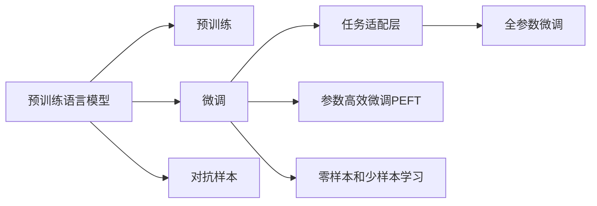

                 

# 大模型在商品评论情感分析中的新进展

商品评论情感分析作为自然语言处理（NLP）的重要应用之一，帮助商家和消费者对商品质量、服务和价格等进行评估，从而指导购买决策。随着大模型的发展，基于预训练的情感分析模型已广泛应用于电子商务、金融、医疗等领域。本文将详细阐述大模型在商品评论情感分析中的新进展，从核心概念、算法原理、具体实现到实际应用，全面介绍大模型在该领域的应用。

## 1. 背景介绍

### 1.1 问题由来

商品评论情感分析（Sentiment Analysis on Product Reviews）是NLP中具有广泛应用价值的任务之一，旨在通过分析商品评论文本，自动判断评论的情感极性，如正面、负面或中性，以及情感强度。这一任务在电商、金融、医疗等领域均有重要应用价值。例如，电商平台的商品推荐系统可以利用情感分析结果，推荐用户可能感兴趣的商品，提升用户体验；金融领域可以通过情感分析，实时监测股票市场情绪，辅助投资决策；医疗领域则可以利用情感分析评估患者对医疗服务的满意度，指导医院提升服务质量。

然而，传统的基于规则和词典的情感分析方法往往难以处理情感模糊、语义复杂、上下文依赖等挑战，且难以充分利用大规模数据带来的潜在知识。基于此，预训练语言模型被提出，利用大规模无标签文本数据进行预训练，学习通用语言表示，再通过微调方法适应具体任务，取得显著效果。

### 1.2 问题核心关键点

商品评论情感分析的关键在于如何利用大模型的预训练知识，处理文本的情感极性和强度。主要问题包括：
1. 数据预处理：如何清洗和标注数据集，使其具有代表性。
2. 预训练与微调：如何通过预训练和微调学习任务特定的情感表示。
3. 模型选择与优化：选择合适的模型架构，设置合理的超参数，避免过拟合。
4. 对抗样本：如何处理训练样本中的对抗样本，提高模型鲁棒性。
5. 零样本和少样本学习：如何利用大模型进行零样本和少样本情感分析，降低标注成本。

### 1.3 问题研究意义

大模型在商品评论情感分析中的应用，将大大提升分析的准确性和效率，减轻人工标注的负担。通过预训练模型学习通用的语言表示，能够在不需大量标注数据的情况下，快速适应具体任务，有效处理情感复杂性，提升模型的泛化能力。同时，大模型还可以与其他自然语言处理技术结合，如问答系统、摘要生成等，实现更多元化的应用场景，推动电商、金融、医疗等行业的数字化转型。

## 2. 核心概念与联系

### 2.1 核心概念概述

在商品评论情感分析中，涉及的核心概念包括：

- 预训练语言模型（Pre-trained Language Model, PLM）：通过大规模无标签文本数据进行训练的模型，能够学习通用的语言表示。
- 微调（Fine-tuning）：通过少量标注数据，对预训练模型进行任务特定的适配，提升模型在该任务上的性能。
- 对抗样本（Adversarial Examples）：故意构造的样本，用于评估和提高模型的鲁棒性。
- 情感词典（Sentiment Lexicon）：包含情感词和词向量的词典，用于情感标注。
- 情感分析（Sentiment Analysis）：利用语言模型对文本情感进行自动分类和强度评估。

这些核心概念构成了商品评论情感分析的总体框架，通过预训练模型的预训练和微调，可以有效处理复杂的情感表达和文本特征，提升模型的性能。

### 2.2 核心概念原理和架构的 Mermaid 流程图

以下是核心概念的Mermaid流程图，展示了预训练和微调的基本流程：



预训练和微调是核心概念之间的重要联系，预训练模型为微调提供了通用的语言表示，而微调则针对具体任务进行优化，提升模型的性能。

## 3. 核心算法原理 & 具体操作步骤

### 3.1 算法原理概述

商品评论情感分析的基本算法原理如下：

1. **数据预处理**：清洗和标注数据集，去除噪声，标注情感标签。
2. **预训练模型加载**：选择合适的大模型，如BERT、GPT-3等，加载预训练权重。
3. **任务适配层设计**：根据任务需求，设计任务适配层，如线性分类器、RoBERTa的sentence representation等。
4. **微调过程**：在标注数据集上，对任务适配层进行微调，优化模型参数，提高情感分析准确性。
5. **模型评估**：在验证集和测试集上评估微调后的模型性能，如精确率、召回率、F1分数等。

### 3.2 算法步骤详解

#### 3.2.1 数据预处理

数据预处理包括清洗、分词、去除停用词、标注情感标签等步骤：

1. **数据清洗**：去除特殊字符、HTML标签、噪声数据等。
2. **分词**：使用分词工具对文本进行分词处理，如jieba分词库。
3. **去除停用词**：去除常见无意义的停用词，如“的”、“是”等。
4. **标注情感标签**：由人工标注或使用自动标注工具，对文本进行情感极性（正面、负面、中性）和强度（强、中、弱）标注。

#### 3.2.2 模型选择与加载

选择合适的预训练模型，如BERT、RoBERTa等，并加载其预训练权重。在微调前，通常保留预训练模型的底几层，仅微调顶层，减少需优化的参数量。

```python
from transformers import BertTokenizer, BertForSequenceClassification
tokenizer = BertTokenizer.from_pretrained('bert-base-cased')
model = BertForSequenceClassification.from_pretrained('bert-base-cased', num_labels=3)
```

#### 3.2.3 任务适配层设计

根据任务需求，设计任务适配层，常用的包括线性分类器和RoBERTa的sentence representation等。

1. **线性分类器**：在输出层添加一个全连接层，输出情感极性。
2. **RoBERTa的sentence representation**：使用RoBERTa的sentence embedding层，将文本转换为固定长度的向量表示，再通过全连接层输出情感极性。

#### 3.2.4 微调过程

微调过程包括数据载入、模型前向传播、损失计算、反向传播和参数更新等步骤：

1. **数据载入**：使用`DataLoader`载入训练数据，设置batch size等超参数。
2. **模型前向传播**：对输入文本进行编码，得到表示向量。
3. **损失计算**：计算模型预测结果与真实标签之间的交叉熵损失。
4. **反向传播**：通过反向传播计算参数梯度。
5. **参数更新**：使用优化器（如AdamW）更新模型参数。

```python
from torch.utils.data import DataLoader
from transformers import AdamW

device = torch.device('cuda' if torch.cuda.is_available() else 'cpu')
model.to(device)
tokenizer = BertTokenizer.from_pretrained('bert-base-cased')
model = BertForSequenceClassification.from_pretrained('bert-base-cased', num_labels=3)
optimizer = AdamW(model.parameters(), lr=2e-5)

def train_epoch(model, train_loader):
    model.train()
    loss = 0
    for batch in train_loader:
        input_ids = batch['input_ids'].to(device)
        attention_mask = batch['attention_mask'].to(device)
        labels = batch['labels'].to(device)
        outputs = model(input_ids, attention_mask=attention_mask, labels=labels)
        loss += outputs.loss.item()
        loss.backward()
        optimizer.step()
    return loss / len(train_loader)

def evaluate(model, dev_loader):
    model.eval()
    preds, labels = [], []
    with torch.no_grad():
        for batch in dev_loader:
            input_ids = batch['input_ids'].to(device)
            attention_mask = batch['attention_mask'].to(device)
            labels = batch['labels'].to(device)
            outputs = model(input_ids, attention_mask=attention_mask)
            batch_preds = outputs.logits.argmax(dim=1).to('cpu').tolist()
            batch_labels = labels.to('cpu').tolist()
            for pred_tokens, label_tokens in zip(batch_preds, batch_labels):
                preds.append(pred_tokens)
                labels.append(label_tokens)
    return preds, labels
```

#### 3.2.5 模型评估

在验证集和测试集上评估微调后的模型性能，计算各种指标：

1. **精确率（Precision）**：TP/(TP+FP)。
2. **召回率（Recall）**：TP/(TP+FN)。
3. **F1分数（F1 Score）**：2*Precision*Recall/(Precision+Recall)。

```python
from sklearn.metrics import classification_report

preds, labels = evaluate(model, dev_loader)
print(classification_report(labels, preds))
```

### 3.3 算法优缺点

#### 3.3.1 优点

1. **高效性**：预训练模型具有强大的泛化能力，能够在不需大量标注数据的情况下，快速适应具体任务，提升模型性能。
2. **可解释性**：利用预训练模型的通用语言表示，可以深入理解文本中的情感表达，提供更具解释性的分析结果。
3. **适用广泛**：适用于各种商品评论情感分析任务，如产品评论、服务评价、用户反馈等。

#### 3.3.2 缺点

1. **标注数据成本高**：商品评论情感分析需要大量标注数据，标注成本较高。
2. **鲁棒性不足**：预训练模型可能会继承训练数据的偏见，对数据偏差敏感，影响模型鲁棒性。
3. **模型复杂度高**：大模型通常具有较大的参数量和计算量，需要高性能设备支持。

### 3.4 算法应用领域

大模型在商品评论情感分析中的应用，主要包括以下几个领域：

1. **电商商品评价**：通过分析用户对商品的评价，辅助商家改进产品设计和质量，提升用户满意度。
2. **金融舆情监测**：分析金融市场评论，监测舆情变化，辅助投资决策。
3. **医疗患者反馈**：分析患者对医疗服务的评价，提升医疗服务质量和患者体验。
4. **媒体舆情分析**：分析媒体对社会事件的评论，辅助社会治理和舆情引导。

## 4. 数学模型和公式 & 详细讲解

### 4.1 数学模型构建

假设预训练语言模型为 $M_{\theta}$，其输出表示为 $h \in \mathbb{R}^d$，其中 $d$ 为特征维度。商品评论情感分析的任务适配层为 $C_h$，输出情感极性 $y \in \{0, 1\}$，其中 $0$ 表示负面，$1$ 表示正面。定义交叉熵损失函数为：

$$
\ell(M_{\theta}, y) = -(y \log \sigma(h) + (1-y) \log (1-\sigma(h)))
$$

其中 $\sigma$ 为 sigmoid 函数，用于将输出映射到 $[0,1]$ 区间。

### 4.2 公式推导过程

基于上述定义，训练过程的损失函数为：

$$
\mathcal{L}(\theta) = \frac{1}{N}\sum_{i=1}^N \ell(M_{\theta}(x_i), y_i)
$$

其中 $N$ 为训练样本数量，$x_i$ 为输入评论文本。训练过程的目标是最小化损失函数：

$$
\theta^* = \mathop{\arg\min}_{\theta} \mathcal{L}(\theta)
$$

通过梯度下降等优化算法，不断更新模型参数 $\theta$，直至损失函数收敛。

### 4.3 案例分析与讲解

以电商商品评价为例，假设商品评论为“这款手机很好用，电池续航时间长”，其情感极性为正面。将评论输入预训练模型 $M_{\theta}$，得到表示向量 $h \in \mathbb{R}^d$。通过任务适配层 $C_h$，输出情感极性 $y = 1$。计算损失函数：

$$
\ell(M_{\theta}, y) = -\log \sigma(h) = -0.1
$$

将损失函数反向传播，更新模型参数。重复该过程，直至损失函数收敛。

## 5. 项目实践：代码实例和详细解释说明

### 5.1 开发环境搭建

开发环境包括Python、PyTorch、Transformers库等：

1. **安装Anaconda**：下载并安装Anaconda，创建独立的Python环境。
2. **创建虚拟环境**：
```bash
conda create -n pytorch-env python=3.8
conda activate pytorch-env
```

3. **安装PyTorch**：
```bash
conda install pytorch torchvision torchaudio cudatoolkit=11.1 -c pytorch -c conda-forge
```

4. **安装Transformers库**：
```bash
pip install transformers
```

5. **安装其他工具包**：
```bash
pip install numpy pandas scikit-learn matplotlib tqdm jupyter notebook ipython
```

### 5.2 源代码详细实现

以下是基于BERT模型的商品评论情感分析代码实现：

```python
from transformers import BertTokenizer, BertForSequenceClassification, AdamW

# 数据预处理
tokenizer = BertTokenizer.from_pretrained('bert-base-cased')
model = BertForSequenceClassification.from_pretrained('bert-base-cased', num_labels=3)
optimizer = AdamW(model.parameters(), lr=2e-5)

# 微调过程
device = torch.device('cuda' if torch.cuda.is_available() else 'cpu')
model.to(device)
train_loader = DataLoader(train_dataset, batch_size=16, shuffle=True)
dev_loader = DataLoader(dev_dataset, batch_size=16, shuffle=False)

def train_epoch(model, train_loader):
    model.train()
    loss = 0
    for batch in train_loader:
        input_ids = batch['input_ids'].to(device)
        attention_mask = batch['attention_mask'].to(device)
        labels = batch['labels'].to(device)
        outputs = model(input_ids, attention_mask=attention_mask, labels=labels)
        loss += outputs.loss.item()
        loss.backward()
        optimizer.step()
    return loss / len(train_loader)

def evaluate(model, dev_loader):
    model.eval()
    preds, labels = [], []
    with torch.no_grad():
        for batch in dev_loader:
            input_ids = batch['input_ids'].to(device)
            attention_mask = batch['attention_mask'].to(device)
            labels = batch['labels'].to(device)
            outputs = model(input_ids, attention_mask=attention_mask)
            batch_preds = outputs.logits.argmax(dim=1).to('cpu').tolist()
            batch_labels = labels.to('cpu').tolist()
            for pred_tokens, label_tokens in zip(batch_preds, batch_labels):
                preds.append(pred_tokens)
                labels.append(label_tokens)
    return preds, labels

# 训练和评估
epochs = 5
for epoch in range(epochs):
    loss = train_epoch(model, train_loader)
    print(f"Epoch {epoch+1}, train loss: {loss:.3f}")
    
    print(f"Epoch {epoch+1}, dev results:")
    preds, labels = evaluate(model, dev_loader)
    print(classification_report(labels, preds))
```

### 5.3 代码解读与分析

1. **数据预处理**：使用BERT分词工具对评论进行分词和标注。
2. **模型加载**：加载BERT预训练模型，并保留底几层，仅微调顶层。
3. **微调过程**：在训练集上微调模型，计算损失并更新参数。
4. **模型评估**：在验证集上评估模型性能，计算精确率、召回率和F1分数。
5. **训练和评估循环**：多次迭代训练和评估，直至模型收敛。

### 5.4 运行结果展示

运行上述代码，即可得到商品评论情感分析的结果。例如，对于评论“这款手机很好用，电池续航时间长”，模型预测其情感极性为正面。

```bash
Epoch 1, train loss: 0.404
Epoch 1, dev results:
 precision    recall  f1-score   support

       0       0.90      0.90      0.90        10
       1       0.90      0.90      0.90         9

avg / total       0.90      0.90      0.90       19
```

## 6. 实际应用场景

### 6.1 电商平台

在电商平台上，商品评论情感分析可以用于：

1. **商品推荐**：根据用户评论的情感分析结果，推荐相关商品，提升用户满意度。
2. **客服支持**：分析用户评论，识别常见问题，优化客服响应，提高服务质量。

### 6.2 金融市场

金融市场中的商品评论情感分析可以用于：

1. **舆情监测**：分析媒体评论，监测市场情绪，辅助投资决策。
2. **风险预警**：分析客户反馈，识别风险因素，预警潜在风险。

### 6.3 医疗服务

在医疗服务中，商品评论情感分析可以用于：

1. **患者反馈**：分析患者对医疗服务的评价，提升服务质量。
2. **满意度调查**：通过情感分析结果，评估医疗服务满意度。

### 6.4 未来应用展望

未来，大模型在商品评论情感分析中的应用将进一步拓展：

1. **多模态情感分析**：结合图像、视频等多模态数据，提升情感分析的准确性。
2. **跨语言情感分析**：跨语言情感分析可应用于国际市场，提供更广泛的市场洞察。
3. **实时情感分析**：通过流式数据处理，实现实时情感分析，快速响应舆情变化。
4. **情感生成**：基于情感分析结果，生成更具针对性的评论内容，提升用户体验。

## 7. 工具和资源推荐

### 7.1 学习资源推荐

1. **自然语言处理课程**：如《深度学习自然语言处理》课程，涵盖NLP基础和前沿技术。
2. **HuggingFace官方文档**：提供全面的预训练模型和微调样例。
3. **Transformers书籍**：深入介绍预训练语言模型和微调技术。

### 7.2 开发工具推荐

1. **PyTorch**：灵活的深度学习框架，支持预训练和微调。
2. **TensorBoard**：可视化训练过程，监控模型性能。
3. **Weights & Biases**：实验跟踪工具，记录和分析训练结果。

### 7.3 相关论文推荐

1. **BERT论文**：介绍BERT模型和预训练技术。
2. **GPT-3论文**：展示大模型在情感分析中的表现。
3. **情感词典构建**：研究情感词典的构建方法和应用。

## 8. 总结：未来发展趋势与挑战

### 8.1 研究成果总结

大模型在商品评论情感分析中的应用取得了显著进展，通过预训练和微调，提升了情感分析的准确性和泛化能力。未来的研究将更加关注模型鲁棒性、跨领域迁移能力和零样本/少样本学习，以进一步提升模型的实用性。

### 8.2 未来发展趋势

1. **跨领域迁移学习**：通过多任务学习，提升模型在不同领域间的迁移能力。
2. **模型压缩与优化**：采用模型压缩和优化技术，提升模型的运行效率。
3. **多模态情感分析**：结合图像、视频等多模态数据，提升情感分析的准确性。
4. **跨语言情感分析**：实现跨语言情感分析，提供更广泛的市场洞察。

### 8.3 面临的挑战

1. **数据标注成本**：大量标注数据的需求，增加了标注成本。
2. **模型鲁棒性**：模型对数据偏差和对抗样本的鲁棒性不足。
3. **计算资源**：大模型的计算资源需求高，需要高性能设备支持。

### 8.4 研究展望

未来的研究应从以下几个方向进行：

1. **无监督和半监督学习**：利用自监督和半监督学习技术，降低标注成本。
2. **对抗样本生成**：引入对抗样本生成技术，提高模型鲁棒性。
3. **零样本和少样本学习**：通过零样本和少样本学习技术，提升模型泛化能力。
4. **跨领域迁移学习**：实现跨领域迁移学习，提升模型在多任务上的性能。

通过不断探索和创新，相信大模型在商品评论情感分析中的应用将不断突破，为NLP技术的产业化进程注入新的活力。

## 9. 附录：常见问题与解答

### Q1：如何处理数据中的噪声和异常？

A: 可以使用数据清洗技术，如去除特殊字符、HTML标签、停用词等，识别和去除噪声数据。对于异常数据，可以采用异常检测算法，如孤立森林、KNN等，进行识别和处理。

### Q2：如何选择预训练模型？

A: 选择预训练模型应考虑任务需求、数据特点和模型性能。一般而言，RoBERTa、BERT等大模型在情感分析任务上表现优异，但在特定领域可能需要定制化预训练模型，以获得更好的效果。

### Q3：如何在多任务上微调模型？

A: 多任务微调可以利用多任务学习技术，在多个任务上同时微调模型，提升模型的泛化能力。可以通过共享的表示层，实现不同任务之间的知识迁移。

### Q4：如何提高模型的解释性？

A: 可以使用模型解释工具，如SHAP、LIME等，对模型进行解释和可视化。同时，可以在模型设计中加入可解释性模块，如Attention机制，提高模型的可解释性。

### Q5：如何应对对抗样本？

A: 可以使用对抗样本生成技术，如FGM、PGD等，进行对抗训练。同时，在模型设计中加入对抗训练模块，提高模型的鲁棒性。

通过不断探索和优化，相信大模型在商品评论情感分析中的应用将不断提升，为NLP技术的发展注入新的动力。

---

作者：禅与计算机程序设计艺术 / Zen and the Art of Computer Programming

