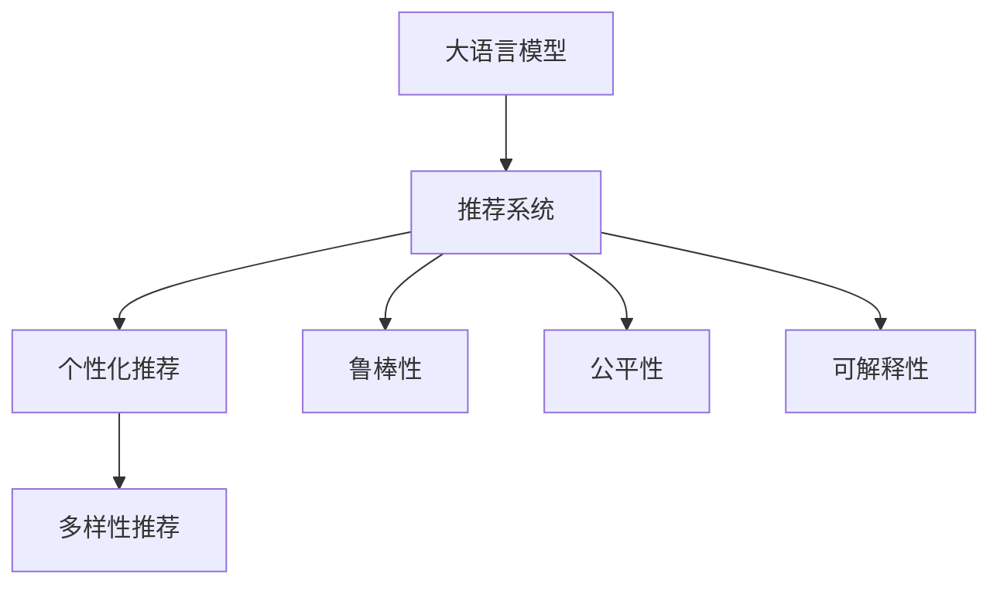

                 

# 大模型在多样化推荐场景中的适用性分析

> 关键词：大模型，推荐系统，多样化场景，个性化推荐，深度学习

## 1. 背景介绍

### 1.1 问题由来

随着数字技术和互联网的迅猛发展，推荐系统作为智能信息服务的重要工具，在电商、媒体、社交、金融等众多领域得到了广泛应用。推荐系统通过分析用户行为和偏好，向用户推荐感兴趣的内容，极大地提高了用户体验和平台收益。近年来，大模型技术在NLP和计算机视觉等领域的突破性进展，为推荐系统带来了新的活力。

以大语言模型（Large Language Model, LLM）为例，通过在海量数据上进行预训练，大语言模型能够学习到丰富的语言表示，具备强大的理解和生成能力。在推荐系统领域，大语言模型能够基于文本数据，对用户进行兴趣建模，实现个性化推荐。目前，大语言模型已被应用于电商推荐、内容推荐、广告推荐等多个场景，并在一些任务上取得了不俗的效果。

尽管如此，大模型在推荐系统中的应用仍面临诸多挑战，包括如何提高推荐模型的多样性和鲁棒性、如何兼顾高效性和精度、如何设计合适的训练目标函数等。本文将系统分析大模型在多样化推荐场景中的应用，探讨其适用性及其面临的挑战。

### 1.2 问题核心关键点

大模型在推荐系统中的应用，主要包括以下几个核心关键点：

- **多样性**：推荐系统需要推荐多种类型的内容，如商品、新闻、视频等，大模型如何处理不同类型的数据？
- **鲁棒性**：推荐模型需要具备鲁棒性，以应对不同的用户和环境变化，大模型如何在多样化的环境中保持稳定？
- **效率**：推荐系统需要高效处理用户请求，大模型如何优化推理速度和资源消耗？
- **公平性**：推荐系统应公平地服务于所有用户，大模型如何避免偏见和歧视？
- **可解释性**：推荐系统需要可解释，让用户明白推荐依据，大模型如何提高可解释性？

这些问题反映了大模型在推荐系统应用中的潜在优势和挑战。本文将从大模型的多样性适用性、鲁棒性保证、效率优化、公平性和可解释性几个方面进行详细分析。

## 2. 核心概念与联系

### 2.1 核心概念概述

本节将介绍几个与大模型推荐系统密切相关的核心概念：

- **大语言模型（LLM）**：如BERT、GPT等，通过预训练学习通用语言表示，具备强大的语言理解和生成能力。
- **推荐系统**：根据用户行为和偏好，向用户推荐感兴趣的内容，包括电商推荐、内容推荐、广告推荐等。
- **个性化推荐**：根据用户个人特征和历史行为，提供量身定制的推荐，提高用户满意度。
- **多样性推荐**：在个性化推荐基础上，兼顾推荐内容的多样性，避免推荐单一、同质化内容。
- **鲁棒性**：推荐系统应对用户和环境变化的能力，如模型在不同的数据分布下的稳定性和泛化能力。
- **公平性**：推荐系统需要公平地服务于所有用户，避免数据偏见和算法歧视。
- **可解释性**：推荐系统需要提供推荐依据，使用户理解和信任推荐结果。

这些核心概念之间的逻辑关系可以通过以下Mermaid流程图来展示：



这个流程图展示了大语言模型与推荐系统的核心概念及其之间的关联。

## 3. 核心算法原理 & 具体操作步骤

### 3.1 算法原理概述

基于大语言模型的推荐系统，其核心思想是利用大模型的预训练表示，结合用户行为数据，进行个性化和多样化推荐。具体来说，大语言模型通过自监督预训练学习到语言表示，然后在推荐任务上通过微调进行适应，最终输出个性化和多样化的推荐结果。

形式化地，假设大语言模型为 $M_{\theta}$，用户行为数据为 $D_u = \{(x_{ui}, y_{ui})\}_{i=1}^N$，其中 $x_{ui}$ 为用户的第 $i$ 次行为（如浏览、点击、购买等），$y_{ui}$ 为对应的兴趣标签。推荐系统的目标是通过微调，找到新的模型参数 $\hat{\theta}$，使得模型在给定用户行为数据 $D_u$ 上能够输出最符合用户兴趣的推荐内容。

### 3.2 算法步骤详解

基于大语言模型的推荐系统一般包括以下几个关键步骤：

**Step 1: 数据准备与预处理**

- 收集用户行为数据，如浏览记录、购买记录等。
- 清洗和处理数据，去除异常值和噪声。
- 对用户行为进行编码，如将浏览记录编码为向量表示。

**Step 2: 构建推荐模型**

- 选择合适的大语言模型架构，如BERT、GPT等。
- 对模型进行微调，将用户行为数据 $D_u$ 作为监督信号，优化模型参数 $\theta$。
- 定义推荐函数，将用户行为输入模型，输出推荐内容。

**Step 3: 训练与评估**

- 将数据集分为训练集、验证集和测试集。
- 使用交叉熵、均方误差等损失函数，在训练集上训练模型。
- 在验证集上评估模型性能，调整超参数，防止过拟合。
- 在测试集上测试模型，评估推荐效果。

**Step 4: 推理与部署**

- 对新用户行为进行推理，生成推荐内容。
- 将推荐结果返回给用户，更新用户行为数据。
- 定期更新模型，重新训练，保持推荐效果。

### 3.3 算法优缺点

基于大语言模型的推荐系统具有以下优点：

- **高效性**：大模型具有较强的泛化能力，可以在较少标注数据下进行微调，提高推荐效率。
- **多样性**：大模型能够处理多种类型的推荐数据，如文本、图片、音频等，实现多样性推荐。
- **个性化**：大模型通过分析用户行为，输出个性化推荐内容。

同时，该方法也存在一定的局限性：

- **资源消耗大**：大模型的推理和训练需要大量计算资源，可能会影响系统性能。
- **模型复杂**：大模型结构复杂，调试和维护难度较大。
- **可解释性不足**：大模型难以解释推荐依据，用户难以理解推荐逻辑。

尽管存在这些局限性，但就目前而言，基于大模型的推荐方法仍是最先进的技术范式之一。未来相关研究的重点在于如何进一步降低计算成本，提高推荐效果，增强可解释性，避免偏见和歧视。

### 3.4 算法应用领域

基于大语言模型的推荐系统已经在电商推荐、内容推荐、广告推荐等众多领域得到了广泛应用。例如：

- **电商推荐**：利用大语言模型分析用户浏览和购买历史，推荐相关商品。
- **内容推荐**：对新闻、视频等文本数据进行情感分析和主题分类，推荐相关内容。
- **广告推荐**：分析用户搜索和点击行为，推荐合适的广告内容。
- **个性化广告推荐**：在广告投放前，根据用户行为预测广告效果，实现精准投放。

除了上述这些经典应用外，大语言模型还被创新性地应用到更多场景中，如金融产品推荐、医疗健康推荐等，为各行各业带来新的商业价值。

## 4. 数学模型和公式 & 详细讲解 & 举例说明

### 4.1 数学模型构建

本节将使用数学语言对基于大语言模型的推荐系统进行更加严格的刻画。

记大语言模型为 $M_{\theta}$，用户行为数据为 $D_u = \{(x_{ui}, y_{ui})\}_{i=1}^N$，其中 $x_{ui}$ 为用户的第 $i$ 次行为，$y_{ui}$ 为对应的兴趣标签。假设推荐模型的损失函数为 $\mathcal{L}(\theta)$，其中 $\theta$ 为模型参数。推荐系统的目标是最小化损失函数：

$$
\hat{\theta} = \mathop{\arg\min}_{\theta} \mathcal{L}(M_{\theta}, D_u)
$$

在实践中，通常使用交叉熵损失函数来衡量推荐结果与真实标签之间的差异。假设推荐结果为 $y' = M_{\theta}(x_{ui})$，则交叉熵损失函数为：

$$
\mathcal{L}(y', y) = -\sum_{i=1}^N y_{ui}\log y'_{ui}
$$

其中 $y'_{ui}$ 表示模型对用户行为 $x_{ui}$ 的推荐结果。

### 4.2 公式推导过程

以下我们以内容推荐为例，推导交叉熵损失函数及其梯度的计算公式。

假设内容推荐系统的目标是预测用户对新闻的兴趣，将新闻描述作为输入 $x$，用户行为 $y$ 作为标签。将新闻描述输入到BERT模型，输出表示为 $h = M_{\theta}(x)$，模型预测的兴趣标签为 $y' = \sigma(h)$，其中 $\sigma$ 为激活函数，如sigmoid。

则交叉熵损失函数为：

$$
\mathcal{L}(y', y) = -\sum_{i=1}^N y_{ui}\log \sigma(h_{ui})
$$

将其代入经验风险公式，得：

$$
\mathcal{L}(\theta) = -\frac{1}{N}\sum_{i=1}^N y_{ui}\log \sigma(M_{\theta}(x_{ui}))
$$

根据链式法则，损失函数对参数 $\theta_k$ 的梯度为：

$$
\frac{\partial \mathcal{L}(\theta)}{\partial \theta_k} = -\frac{1}{N}\sum_{i=1}^N \frac{\partial \log \sigma(M_{\theta}(x_{ui}))}{\partial \theta_k} y_{ui}
$$

其中 $\frac{\partial \log \sigma(M_{\theta}(x_{ui}))}{\partial \theta_k}$ 可进一步递归展开，利用自动微分技术完成计算。

在得到损失函数的梯度后，即可带入参数更新公式，完成模型的迭代优化。重复上述过程直至收敛，最终得到适应推荐任务的最优模型参数 $\hat{\theta}$。

### 4.3 案例分析与讲解

我们以电商推荐为例，分析基于大语言模型的推荐系统如何处理多样性推荐和个性化推荐。

假设电商推荐系统的目标是推荐商品给用户，商品描述作为输入 $x$，用户历史行为作为标签 $y$。将商品描述输入到BERT模型，输出表示为 $h = M_{\theta}(x)$，模型预测的用户兴趣标签为 $y' = \sigma(h)$。

对于个性化推荐，需要分析用户历史行为数据，得到用户对各类商品的兴趣分布。将用户行为数据 $D_u = \{(x_{ui}, y_{ui})\}_{i=1}^N$ 作为监督信号，对模型进行微调，使得模型能够准确预测用户对各个商品的兴趣。具体来说，可以将用户历史行为数据分成 $K$ 个类别 $D_k = \{(x_{ui}, y_{ui}^k)\}_{i=1}^N$，其中 $y_{ui}^k$ 表示用户对第 $k$ 个类别的兴趣。

对于多样性推荐，需要在个性化推荐的基础上，增加对推荐内容多样性的约束。假设推荐系统需要推荐 $M$ 个商品，则可以将多样性约束表示为 $y' = \{y_{ui}^m\}_{m=1}^M$，其中 $y_{ui}^m$ 表示用户对第 $m$ 个商品的兴趣。

这样，可以将多样性约束与个性化推荐结合起来，构建一个多目标优化问题：

$$
\hat{\theta} = \mathop{\arg\min}_{\theta} \mathcal{L}_{\text{personalized}}(M_{\theta}, D_u) + \lambda \mathcal{L}_{\text{diverse}}(M_{\theta}, D_u)
$$

其中 $\mathcal{L}_{\text{personalized}}$ 为个性化推荐损失，$\mathcal{L}_{\text{diverse}}$ 为多样性推荐损失，$\lambda$ 为正则化系数。通过调整 $\lambda$ 的值，可以平衡个性化推荐和多样性推荐的权重。

例如，如果 $\lambda$ 较小，则推荐系统更加注重个性化推荐，可能忽略多样性。如果 $\lambda$ 较大，则推荐系统更加注重多样性，可能忽视个性化。通过实验调整，可以找到最优的 $\lambda$ 值。

## 5. 项目实践：代码实例和详细解释说明

### 5.1 开发环境搭建

在进行推荐系统开发前，我们需要准备好开发环境。以下是使用Python进行PyTorch开发的环境配置流程：

1. 安装Anaconda：从官网下载并安装Anaconda，用于创建独立的Python环境。

2. 创建并激活虚拟环境：
```bash
conda create -n recsys-env python=3.8 
conda activate recsys-env
```

3. 安装PyTorch：根据CUDA版本，从官网获取对应的安装命令。例如：
```bash
conda install pytorch torchvision torchaudio cudatoolkit=11.1 -c pytorch -c conda-forge
```

4. 安装各类工具包：
```bash
pip install numpy pandas scikit-learn matplotlib tqdm jupyter notebook ipython
```

完成上述步骤后，即可在`recsys-env`环境中开始推荐系统开发。

### 5.2 源代码详细实现

这里我们以内容推荐为例，给出使用PyTorch进行BERT模型微调的代码实现。

首先，定义推荐系统的数据处理函数：

```python
from transformers import BertTokenizer
from torch.utils.data import Dataset, DataLoader
import torch

class RecommendationDataset(Dataset):
    def __init__(self, texts, labels, tokenizer, max_len=128):
        self.texts = texts
        self.labels = labels
        self.tokenizer = tokenizer
        self.max_len = max_len
        
    def __len__(self):
        return len(self.texts)
    
    def __getitem__(self, item):
        text = self.texts[item]
        label = self.labels[item]
        
        encoding = self.tokenizer(text, return_tensors='pt', max_length=self.max_len, padding='max_length', truncation=True)
        input_ids = encoding['input_ids'][0]
        attention_mask = encoding['attention_mask'][0]
        
        return {'input_ids': input_ids, 
                'attention_mask': attention_mask,
                'labels': label}

# 数据准备
tokenizer = BertTokenizer.from_pretrained('bert-base-cased')

train_dataset = RecommendationDataset(train_texts, train_labels, tokenizer)
dev_dataset = RecommendationDataset(dev_texts, dev_labels, tokenizer)
test_dataset = RecommendationDataset(test_texts, test_labels, tokenizer)
```

然后，定义模型和优化器：

```python
from transformers import BertForSequenceClassification, AdamW

model = BertForSequenceClassification.from_pretrained('bert-base-cased', num_labels=2)

optimizer = AdamW(model.parameters(), lr=2e-5)
```

接着，定义训练和评估函数：

```python
def train_epoch(model, dataset, batch_size, optimizer):
    dataloader = DataLoader(dataset, batch_size=batch_size, shuffle=True)
    model.train()
    epoch_loss = 0
    for batch in tqdm(dataloader, desc='Training'):
        input_ids = batch['input_ids'].to(device)
        attention_mask = batch['attention_mask'].to(device)
        labels = batch['labels'].to(device)
        model.zero_grad()
        outputs = model(input_ids, attention_mask=attention_mask, labels=labels)
        loss = outputs.loss
        epoch_loss += loss.item()
        loss.backward()
        optimizer.step()
    return epoch_loss / len(dataloader)

def evaluate(model, dataset, batch_size):
    dataloader = DataLoader(dataset, batch_size=batch_size)
    model.eval()
    preds, labels = [], []
    with torch.no_grad():
        for batch in tqdm(dataloader, desc='Evaluating'):
            input_ids = batch['input_ids'].to(device)
            attention_mask = batch['attention_mask'].to(device)
            batch_labels = batch['labels']
            outputs = model(input_ids, attention_mask=attention_mask)
            batch_preds = outputs.logits.argmax(dim=2).to('cpu').tolist()
            batch_labels = batch_labels.to('cpu').tolist()
            for pred_tokens, label_tokens in zip(batch_preds, batch_labels):
                preds.append(pred_tokens)
                labels.append(label_tokens)
                
    print(classification_report(labels, preds))
```

最后，启动训练流程并在测试集上评估：

```python
epochs = 5
batch_size = 16

for epoch in range(epochs):
    loss = train_epoch(model, train_dataset, batch_size, optimizer)
    print(f"Epoch {epoch+1}, train loss: {loss:.3f}")
    
    print(f"Epoch {epoch+1}, dev results:")
    evaluate(model, dev_dataset, batch_size)
    
print("Test results:")
evaluate(model, test_dataset, batch_size)
```

以上就是使用PyTorch对BERT进行内容推荐任务微调的完整代码实现。可以看到，得益于Transformers库的强大封装，我们可以用相对简洁的代码完成BERT模型的加载和微调。

### 5.3 代码解读与分析

让我们再详细解读一下关键代码的实现细节：

**RecommendationDataset类**：
- `__init__`方法：初始化文本、标签、分词器等关键组件。
- `__len__`方法：返回数据集的样本数量。
- `__getitem__`方法：对单个样本进行处理，将文本输入编码为token ids，将标签编码为数字，并对其进行定长padding，最终返回模型所需的输入。

**训练和评估函数**：
- 使用PyTorch的DataLoader对数据集进行批次化加载，供模型训练和推理使用。
- 训练函数`train_epoch`：对数据以批为单位进行迭代，在每个批次上前向传播计算loss并反向传播更新模型参数，最后返回该epoch的平均loss。
- 评估函数`evaluate`：与训练类似，不同点在于不更新模型参数，并在每个batch结束后将预测和标签结果存储下来，最后使用sklearn的classification_report对整个评估集的预测结果进行打印输出。

**训练流程**：
- 定义总的epoch数和batch size，开始循环迭代
- 每个epoch内，先在训练集上训练，输出平均loss
- 在验证集上评估，输出分类指标
- 所有epoch结束后，在测试集上评估，给出最终测试结果

可以看到，PyTorch配合Transformers库使得BERT微调的代码实现变得简洁高效。开发者可以将更多精力放在数据处理、模型改进等高层逻辑上，而不必过多关注底层的实现细节。

当然，工业级的系统实现还需考虑更多因素，如模型的保存和部署、超参数的自动搜索、更灵活的任务适配层等。但核心的微调范式基本与此类似。

## 6. 实际应用场景

### 6.1 电商推荐

基于大语言模型的电商推荐系统，能够利用用户历史行为数据，推荐用户感兴趣的商品。传统电商推荐系统依赖于用户行为数据的深度学习模型，而大语言模型则能够处理更复杂的数据类型，如文本、图片等，实现更加多样化的推荐。

在技术实现上，可以收集用户的历史浏览、点击、购买记录等行为数据，构建推荐模型。利用BERT等大语言模型，对商品描述进行文本编码，将用户行为数据作为监督信号，进行微调。微调后的模型能够根据用户行为，预测用户对各个商品的兴趣，从而推荐最符合用户偏好的商品。

### 6.2 内容推荐

内容推荐系统广泛用于视频、音乐、新闻等领域，能够根据用户偏好推荐相关内容。大语言模型能够对内容进行语义理解，提取关键特征，实现内容推荐。

在实践过程中，可以利用大语言模型对视频、新闻等文本内容进行情感分析、主题分类等处理，构建推荐模型。将用户行为数据作为监督信号，对模型进行微调。微调后的模型能够预测用户对各个内容的兴趣，从而推荐最符合用户口味的内容。

### 6.3 广告推荐

广告推荐系统能够根据用户行为，推荐用户感兴趣的广告内容。大语言模型能够处理文本、图片等多模态数据，实现更加多样化的推荐。

在广告推荐中，可以利用大语言模型对广告内容进行语义分析，提取关键特征。将用户行为数据作为监督信号，对模型进行微调。微调后的模型能够根据用户行为，推荐最符合用户偏好的广告内容，实现精准投放。

### 6.4 金融产品推荐

金融产品推荐系统能够根据用户行为，推荐合适的金融产品。大语言模型能够处理复杂的数据类型，如财务报表、市场新闻等，实现更加多样化的推荐。

在金融产品推荐中，可以利用大语言模型对金融产品描述进行语义分析，提取关键特征。将用户行为数据作为监督信号，对模型进行微调。微调后的模型能够根据用户行为，推荐最符合用户需求的金融产品，提高用户体验和平台收益。

### 6.5 医疗健康推荐

医疗健康推荐系统能够根据用户行为，推荐合适的医疗服务、药品等。大语言模型能够处理文本、图片等多模态数据，实现更加多样化的推荐。

在医疗健康推荐中，可以利用大语言模型对医疗服务、药品描述进行语义分析，提取关键特征。将用户行为数据作为监督信号，对模型进行微调。微调后的模型能够根据用户行为，推荐最符合用户需求的医疗服务、药品等，提高医疗服务质量和用户满意度。

## 7. 工具和资源推荐

### 7.1 学习资源推荐

为了帮助开发者系统掌握大语言模型推荐系统的理论基础和实践技巧，这里推荐一些优质的学习资源：

1. 《Recommender Systems: Practical Methods for Search and Recommendation》书籍：由知名学者编写，全面介绍了推荐系统的基本原理和算法，适合入门学习。

2. CS224N《Deep Learning for Natural Language Processing》课程：斯坦福大学开设的NLP明星课程，有Lecture视频和配套作业，带你深入学习NLP和推荐系统。

3. 《Deep Learning for Recommender Systems》书籍：系统介绍了深度学习在推荐系统中的应用，涵盖从数据预处理到模型微调的全过程。

4. Coursera《Recommender Systems Specialization》课程：涵盖推荐系统从基础到高级的多个方面，适合系统学习推荐系统的理论和实践。

5. arXiv.org：最新的推荐系统研究论文发布平台，跟踪最新的研究成果和技术进展。

通过对这些资源的学习实践，相信你一定能够快速掌握大语言模型推荐系统的精髓，并用于解决实际的推荐问题。

### 7.2 开发工具推荐

高效的开发离不开优秀的工具支持。以下是几款用于大语言模型推荐系统开发的常用工具：

1. PyTorch：基于Python的开源深度学习框架，灵活动态的计算图，适合快速迭代研究。大部分预训练语言模型都有PyTorch版本的实现。

2. TensorFlow：由Google主导开发的开源深度学习框架，生产部署方便，适合大规模工程应用。同样有丰富的预训练语言模型资源。

3. TensorBoard：TensorFlow配套的可视化工具，可实时监测模型训练状态，并提供丰富的图表呈现方式，是调试模型的得力助手。

4. Weights & Biases：模型训练的实验跟踪工具，可以记录和可视化模型训练过程中的各项指标，方便对比和调优。与主流深度学习框架无缝集成。

5. HuggingFace Transformers库：HuggingFace开发的NLP工具库，集成了众多SOTA语言模型，支持PyTorch和TensorFlow，是进行推荐任务开发的利器。

6. Scikit-learn：基于Python的机器学习库，提供丰富的数据预处理和模型评估工具，适合快速原型开发。

合理利用这些工具，可以显著提升大语言模型推荐系统的开发效率，加快创新迭代的步伐。

### 7.3 相关论文推荐

大语言模型和推荐系统的发展源于学界的持续研究。以下是几篇奠基性的相关论文，推荐阅读：

1. "Recurrent Deep Network Architecture for Image Product Recommendation"：提出基于RNN的推荐系统，能够处理时间序列数据，适用于电商推荐。

2. "Neural Collaborative Filtering"：提出基于神经网络的推荐算法，能够处理高维稀疏数据，适用于协同过滤推荐。

3. "Diverse Neural Recommendation with Multi-scale Attention"：提出多尺度注意力机制的推荐模型，能够提高推荐结果的多样性和质量。

4. "Integrating Deep Neural Networks with Matrix Factorization Models"：提出将深度学习和矩阵分解结合的推荐系统，能够处理多模态数据。

5. "The Role of Interactivity in Recommendation Systems"：分析用户与推荐系统的交互行为，提出更加个性化的推荐模型。

6. "Attention-Based Recommender Systems"：提出基于注意力机制的推荐系统，能够处理长序列数据，适用于新闻推荐。

这些论文代表了大语言模型推荐系统的发展脉络。通过学习这些前沿成果，可以帮助研究者把握学科前进方向，激发更多的创新灵感。

## 8. 总结：未来发展趋势与挑战

### 8.1 总结

本文对大语言模型在多样化推荐场景中的应用进行了全面系统的分析。首先阐述了大语言模型和推荐系统的研究背景和意义，明确了微调在拓展预训练模型应用、提升推荐系统性能方面的独特价值。其次，从原理到实践，详细讲解了大语言模型推荐系统的数学原理和关键步骤，给出了推荐任务开发的完整代码实例。同时，本文还广泛探讨了大模型在电商、内容、广告、金融、医疗等众多领域的应用前景，展示了其强大的性能和潜力。

通过本文的系统梳理，可以看到，大语言模型在推荐系统领域的应用前景广阔，能够处理多种数据类型，实现个性化和多样化推荐。未来，伴随技术的不断演进和优化，大语言模型推荐系统必将在更多场景下大放异彩，为各行各业带来新的商业价值。

### 8.2 未来发展趋势

展望未来，大语言模型推荐系统将呈现以下几个发展趋势：

1. **模型规模持续增大**：随着算力成本的下降和数据规模的扩张，大模型的参数量还将持续增长。超大规模语言模型蕴含的丰富语言知识，有望支撑更加复杂多变的推荐任务。

2. **推荐模型多样性增强**：未来推荐系统将更多地融合多模态数据，如文本、图片、音频等，实现更丰富多样的推荐。

3. **推荐模型鲁棒性提升**：推荐模型需要应对多样化的数据和环境变化，提高模型的鲁棒性和泛化能力。

4. **推荐系统公平性提升**：推荐系统需要公平地服务于所有用户，避免数据偏见和算法歧视。未来将采用更多公平性评估指标和公平性优化方法。

5. **推荐系统可解释性增强**：推荐系统需要可解释，让用户理解推荐依据，提高用户信任度。未来将采用更多可解释性技术，如因果推理、可解释生成等。

6. **推荐系统个性化和多样化并重**：未来推荐系统将更多地平衡个性化推荐和多样化推荐，避免单一推荐和同质化内容。

以上趋势凸显了大语言模型推荐系统的广阔前景。这些方向的探索发展，必将进一步提升推荐系统的性能和应用范围，为各行各业带来新的商业价值。

### 8.3 面临的挑战

尽管大语言模型推荐系统已经取得了瞩目成就，但在迈向更加智能化、普适化应用的过程中，它仍面临着诸多挑战：

1. **数据稀疏性和噪声**：电商、医疗等垂直领域的数据稀疏性和噪声较大，需要更多的数据预处理和噪声处理。

2. **计算资源消耗大**：大模型的推理和训练需要大量计算资源，可能会影响系统性能。如何优化模型结构和推理速度，是未来的重要方向。

3. **公平性和偏见**：推荐系统需要公平地服务于所有用户，避免数据偏见和算法歧视。如何设计公平性优化方法，构建公平性推荐系统，还需要更多的探索和研究。

4. **可解释性不足**：推荐系统难以解释推荐依据，用户难以理解推荐逻辑。如何提高推荐模型的可解释性，提供更加透明和可信的推荐结果，将是未来的研究方向。

5. **跨领域数据整合**：推荐系统需要融合多模态数据，如文本、图片、音频等。如何实现跨领域数据整合和协同建模，提升推荐效果，将是未来的重要课题。

6. **用户隐私保护**：推荐系统需要保护用户隐私，避免用户数据泄露和滥用。如何设计隐私保护机制，确保数据安全和用户隐私，还需要更多的探索和研究。

正视推荐系统面临的这些挑战，积极应对并寻求突破，将是大语言模型推荐系统走向成熟的必由之路。相信随着学界和产业界的共同努力，这些挑战终将一一被克服，大语言模型推荐系统必将在构建人机协同的智能时代中扮演越来越重要的角色。

### 8.4 研究展望

面对大语言模型推荐系统所面临的种种挑战，未来的研究需要在以下几个方面寻求新的突破：

1. **多模态融合推荐**：将文本、图片、音频等多模态数据融合，实现更丰富多样的推荐。

2. **参数高效微调**：开发更加参数高效的微调方法，在固定大部分预训练参数的同时，只更新极少量的任务相关参数。

3. **因果推理和可解释生成**：引入因果推理和可解释生成技术，增强推荐模型的可解释性，提高推荐系统的透明度和可信度。

4. **跨领域知识整合**：将符号化的先验知识，如知识图谱、逻辑规则等，与神经网络模型进行巧妙融合，引导微调过程学习更准确、合理的推荐模型。

5. **模型公平性和偏见消除**：设计公平性评估指标和公平性优化方法，构建公平性推荐系统，避免数据偏见和算法歧视。

6. **用户隐私保护机制**：设计隐私保护机制，确保用户数据安全和隐私保护。

这些研究方向的探索，必将引领大语言模型推荐系统迈向更高的台阶，为构建安全、可靠、可解释、可控的智能推荐系统铺平道路。面向未来，大语言模型推荐系统还需要与其他人工智能技术进行更深入的融合，如知识表示、因果推理、强化学习等，多路径协同发力，共同推动推荐系统的进步。只有勇于创新、敢于突破，才能不断拓展推荐系统的边界，让智能技术更好地造福人类社会。

## 9. 附录：常见问题与解答

**Q1：大语言模型推荐系统是否适用于所有推荐场景？**

A: 大语言模型推荐系统在大多数推荐场景上都能取得不错的效果，特别是对于数据量较小的垂直领域。但对于一些特定领域的推荐任务，如医疗、金融等，仅仅依靠通用语料预训练的模型可能难以很好地适应。此时需要在特定领域语料上进一步预训练，再进行微调，才能获得理想效果。

**Q2：推荐系统如何处理多模态数据？**

A: 推荐系统可以采用多种方式处理多模态数据，如特征融合、多模态嵌入等。具体来说，可以将不同模态的数据进行编码，提取特征，然后融合到推荐模型中。例如，将文本、图片等数据分别编码为向量表示，然后拼接或加权求和，输入到推荐模型中进行训练。此外，还可以采用多模态嵌入技术，将不同模态的数据嵌入到一个高维空间中，提高多模态数据的相似度，实现更准确的多模态推荐。

**Q3：推荐系统如何优化模型效率？**

A: 推荐系统可以采用多种方法优化模型效率，如参数共享、稀疏化表示等。具体来说，可以在不同模态的数据之间共享部分参数，减少模型参数量。还可以采用稀疏化表示技术，如TensorCore加速，减少模型计算量。此外，可以优化模型结构，如减少隐层数和神经元数量，提高模型推理速度。

**Q4：推荐系统如何避免推荐同质化内容？**

A: 推荐系统可以采用多种方法避免推荐同质化内容，如多样性约束、协同过滤等。具体来说，可以在个性化推荐的基础上，增加对推荐内容多样性的约束。可以采用协同过滤技术，挖掘用户之间的相似性，推荐多样化的内容。此外，可以引入多样化约束，如增加噪声、随机打乱等，避免推荐单一、同质化内容。

**Q5：推荐系统如何保证推荐公平性？**

A: 推荐系统可以采用多种方法保证推荐公平性，如公平性评估指标、公平性优化等。具体来说，可以设计公平性评估指标，如平均准确率、召回率等，评估推荐系统的公平性。可以采用公平性优化方法，如修改损失函数、修改模型结构等，提升推荐系统的公平性。此外，可以引入公平性约束，如正则化、公平性惩罚等，避免推荐系统出现偏见和歧视。

这些问题的回答，反映了大语言模型推荐系统在多样性适用性、鲁棒性、效率、公平性和可解释性方面的挑战和应对策略。希望这些回答能够为读者提供有益的参考，促进大语言模型推荐系统的发展和优化。

