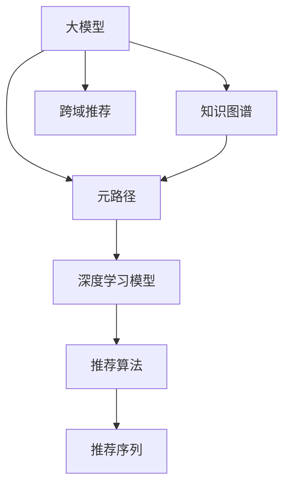

                 

# 大模型在推荐系统中的元路径挖掘应用

> 关键词：推荐系统,大模型,元路径,深度学习,自然语言处理(NLP),图网络,知识图谱,图神经网络(GNN),图自编码器,元路径算法,推荐算法,跨域推荐

## 1. 背景介绍

### 1.1 问题由来

推荐系统（Recommendation System）是现代互联网服务不可或缺的一部分，为个性化推荐、智能客服、内容推荐、广告投放等领域提供了强大支持。目前，推荐系统主要分为基于协同过滤、内容过滤、混合推荐等几种方式。其中，基于协同过滤的推荐方法，如矩阵分解、奇异值分解（SVD）等，取得了广泛应用。然而，这些方法在处理大规模稀疏矩阵时，面临着数据稀疏、冷启动、负样本少等问题。

近年来，深度学习大模型在推荐系统领域得到了广泛应用，取得了显著的效果。以Text2Item为代表的大模型，通过在海量文本数据上预训练，学习用户行为与物品属性之间的关系，从而提升推荐系统效果。然而，大模型虽然能够学习到丰富的语义信息，但缺乏对用户行为模式和物品间关系的全面刻画，使得模型在跨域推荐、推荐序列构建等方面存在局限。

针对这一问题，元路径挖掘（Meta-Path Mining）技术应运而生。元路径挖掘技术通过在大数据中挖掘不同实体的类型和关系，构建多维度的知识图谱，为深度学习模型提供了更全面的数据背景，显著提升了推荐系统的效果和泛化能力。本文将详细探讨大模型在推荐系统中的元路径挖掘应用，探讨如何结合深度学习、知识图谱和元路径算法，构建高效、可解释的推荐系统。

### 1.2 问题核心关键点

元路径挖掘技术是推荐系统中的一类重要方法，旨在通过挖掘实体间的关系类型和类型组合，发现用户行为模式和物品属性之间的关系，从而提升推荐效果。其核心关键点包括：

- **实体类型和关系类型**：元路径挖掘首先识别出各类实体以及它们之间的关系类型，构建知识图谱，这是后续挖掘和推理的基础。

- **元路径组合**：通过组合不同类型的实体和关系，得到元路径，描述实体之间的隐含路径。

- **模式学习**：利用深度学习模型学习各类元路径的模式，提取特征，生成推荐。

- **跨域推荐**：通过元路径组合和模式学习，实现跨域推荐，克服了传统方法在冷启动、负样本少等方面的局限。

- **推荐序列生成**：利用元路径组合和模式学习，生成推荐序列，提升推荐效果。

本文将围绕元路径挖掘在大模型推荐系统中的应用，从原理到实践，对各个关键环节进行详细讲解。

## 2. 核心概念与联系

### 2.1 核心概念概述

为更好地理解元路径挖掘在大模型推荐系统中的应用，本节将介绍几个关键核心概念及其相互联系：

- **大模型**：指利用深度学习技术，通过大规模数据预训练得到的通用语言模型，如BERT、GPT等，具有强大的语义理解能力，能够在多种任务中取得优异性能。

- **知识图谱**：通过实体-关系型数据（RDF）描述的、多层次的语义网络，用于刻画实体间的知识关联，如WordNet、Freebase等。

- **元路径**：指由不同类型的实体和关系组合而成的路径，用于刻画实体间的隐含关系类型，如"电影-演员-导演-电影"。

- **深度学习模型**：指通过多层次的神经网络，自动学习数据特征，提取隐含模式的模型，如CNN、RNN、GNN等。

- **跨域推荐**：指通过知识图谱和元路径挖掘，跨越不同类型数据域进行推荐，解决数据稀疏、冷启动等问题。

- **推荐序列**：指按照特定策略生成的推荐序列，如基于马尔可夫链的推荐序列，可以提升推荐效果。

这些核心概念之间的逻辑关系可以通过以下Mermaid流程图来展示：



这个流程图展示了元路径挖掘在大模型推荐系统中的应用链条：

1. 大模型通过在海量文本数据上预训练，获得语言表示能力。
2. 知识图谱通过实体和关系描述，刻画实体间的语义关联。
3. 元路径挖掘通过组合不同类型实体和关系，发现隐含的路径类型。
4. 深度学习模型通过学习元路径模式，提取特征，生成推荐。
5. 推荐算法将深度学习模型生成的推荐序列进行排序和筛选，提升推荐效果。
6. 跨域推荐利用知识图谱和元路径，跨越不同数据域进行推荐。

这些概念共同构成了元路径挖掘在大模型推荐系统中的应用框架，使得推荐系统能够充分利用多源数据，提升推荐效果。

## 3. 核心算法原理 & 具体操作步骤

### 3.1 算法原理概述

在大模型推荐系统中，元路径挖掘的原理是通过在大规模文本数据中识别实体和关系，构建知识图谱，并通过组合不同类型的实体和关系，发现隐含的路径类型。这些路径类型可以被大模型学习，用于生成推荐。

具体而言，假设存在一个大规模的知识图谱 $\mathcal{G}$，其中包含各类实体 $E$ 和关系 $R$。元路径挖掘的第一步是识别不同类型的实体和关系，并将它们组合成多种路径类型。例如，实体类型为电影、演员、导演，关系类型为出演、执导等，可以组合成多种路径类型，如 "电影-演员-导演-电影"。

这些路径类型可以被大模型学习，用于生成推荐。具体步骤如下：

1. 在大模型预训练过程中，通过学习大量文本数据，提取实体和关系。
2. 构建知识图谱，包含不同类型的实体和关系。
3. 通过组合不同类型的实体和关系，得到多种元路径类型。
4. 利用深度学习模型，学习各类元路径的模式，提取特征，生成推荐。

### 3.2 算法步骤详解

元路径挖掘在大模型推荐系统中的具体操作步骤如下：

**Step 1: 实体和关系识别**
- 在大模型预训练过程中，通过学习大量文本数据，识别出不同类型的实体和关系。例如，识别出电影、演员、导演等实体，以及出演、执导等关系。

**Step 2: 构建知识图谱**
- 将识别出的实体和关系，构建知识图谱。知识图谱可以采用RDF等形式，刻画实体间的语义关系。

**Step 3: 元路径挖掘**
- 通过组合不同类型的实体和关系，得到多种元路径类型。例如，将电影、演员、导演组合成 "电影-演员-导演-电影" 的路径类型。

**Step 4: 元路径学习**
- 利用深度学习模型，学习各类元路径的模式。例如，将 "电影-演员-导演-电影" 的元路径类型，学习其语义模式。

**Step 5: 特征提取和推荐生成**
- 从元路径学习中提取特征，生成推荐。例如，将 "电影-演员-导演-电影" 的元路径特征，与用户行为和物品属性结合，生成推荐。

**Step 6: 跨域推荐和序列生成**
- 通过元路径组合和模式学习，实现跨域推荐，克服数据稀疏和冷启动等问题。同时利用推荐序列生成技术，提升推荐效果。

### 3.3 算法优缺点

元路径挖掘在大模型推荐系统中的应用，具有以下优点：

- 多源数据融合：利用知识图谱和元路径挖掘，将多源数据融合到推荐系统中，提升推荐效果。
- 泛化能力强：通过元路径组合和模式学习，模型能够更好地泛化到新数据域，解决冷启动和数据稀疏问题。
- 推荐序列生成：利用推荐序列生成技术，可以提升推荐效果。
- 可解释性强：元路径挖掘技术可以提供详细的推荐理由，增强系统的可解释性。

然而，元路径挖掘也存在以下缺点：

- 数据构建复杂：构建知识图谱需要大量的实体和关系数据，工作量大。
- 实体关系稀疏：大规模数据中，实体和关系数据往往稀疏，影响挖掘效果。
- 模型复杂度高：深度学习模型和元路径组合需要复杂的操作，可能导致计算量增加。

### 3.4 算法应用领域

元路径挖掘在大模型推荐系统中的应用领域包括但不限于：

- 个性化推荐：通过元路径组合和模式学习，生成个性化推荐。
- 跨域推荐：通过元路径挖掘，跨越不同数据域进行推荐。
- 推荐序列生成：利用元路径组合和模式学习，生成推荐序列。
- 推荐算法优化：优化传统推荐算法，提升推荐效果。
- 推荐系统评估：利用元路径组合和模式学习，评估推荐系统效果。

这些应用领域展示了元路径挖掘在大模型推荐系统中的广泛应用，为推荐系统提供了强大的数据背景和高效的推荐策略。

## 4. 数学模型和公式 & 详细讲解 & 举例说明

### 4.1 数学模型构建

元路径挖掘在大模型推荐系统中的应用，可以通过以下几个数学模型来描述：

- **知识图谱**：用图结构表示实体间的关系，可以表示为 $\mathcal{G} = (\mathcal{V}, \mathcal{E}, R)$，其中 $\mathcal{V}$ 为实体节点集合，$\mathcal{E}$ 为关系边集合，$R$ 为关系集合。

- **元路径**：表示实体间的隐含路径类型，可以表示为 $\mathcal{P} = \{\langle \text{type}_1, \text{type}_2, ..., \text{type}_k \rangle\}$，其中 $\text{type}_i$ 为关系类型。

- **深度学习模型**：用于学习元路径模式，生成推荐，可以表示为 $f_{\theta}(\mathcal{P})$，其中 $\theta$ 为模型参数。

- **推荐序列**：表示推荐序列的生成策略，可以表示为 $\pi = \{\text{rank}_1, \text{rank}_2, ..., \text{rank}_k\}$，其中 $\text{rank}_i$ 为物品排序策略。

### 4.2 公式推导过程

以下我们以 "电影-演员-导演-电影" 为例，推导元路径挖掘的数学模型及其训练公式。

假设知识图谱中包含电影、演员、导演三种实体，以及出演、执导两种关系。记 $\text{Film}$ 为电影节点，$\text{Actor}$ 为演员节点，$\text{Director}$ 为导演节点，$\text{ActsIn}$ 为出演关系，$\text{Directs}$ 为执导关系。

**元路径挖掘**：
- 组合不同类型的实体和关系，得到元路径类型 $\mathcal{P} = \langle \text{Film}, \text{ActsIn}, \text{Actor}, \text{Directs}, \text{Director}, \text{Film} \rangle$。

**元路径学习**：
- 利用深度学习模型 $f_{\theta}(\mathcal{P})$，学习各类元路径的模式。

**推荐生成**：
- 将元路径学习得到的特征与用户行为和物品属性结合，生成推荐。

数学公式如下：

$$
f_{\theta}(\mathcal{P}) = \text{UserEmbedding} \times \text{ItemEmbedding} \times \text{ContextEmbedding}
$$

其中 $\text{UserEmbedding}$ 为用户嵌入向量，$\text{ItemEmbedding}$ 为物品嵌入向量，$\text{ContextEmbedding}$ 为元路径嵌入向量，$\theta$ 为模型参数。

推荐公式如下：

$$
\text{Rec} = \text{TopK}(\text{f}_{\theta}(\mathcal{P}))
$$

其中 $\text{TopK}$ 为推荐序列排序函数。

**跨域推荐和序列生成**：
- 利用元路径组合和模式学习，实现跨域推荐。
- 利用推荐序列生成技术，生成推荐序列。

### 4.3 案例分析与讲解

以Netflix推荐系统为例，探讨元路径挖掘在大模型推荐系统中的应用。

Netflix推荐系统是一个基于协同过滤和深度学习的大规模推荐系统。在Netflix推荐系统中，利用知识图谱和元路径挖掘技术，结合大模型，实现了跨域推荐和推荐序列生成。

Netflix推荐系统的知识图谱包含电影、演员、导演、编剧等实体，以及出演、执导、编剧等关系。通过组合不同类型的实体和关系，Netflix构建了多种元路径类型，如 "电影-演员-导演-电影"、"电影-编剧-导演-电影" 等。

Netflix利用深度学习模型，学习各类元路径的模式，提取特征，生成推荐。在推荐生成过程中，Netflix还利用推荐序列生成技术，生成推荐序列，提升推荐效果。

Netflix通过知识图谱和元路径挖掘技术，解决了传统推荐系统在数据稀疏、冷启动等问题。同时，利用大模型的深度学习特性，提升了推荐效果。Netflix的推荐系统效果显著，获得了用户的高度认可。

## 5. 项目实践：代码实例和详细解释说明

### 5.1 开发环境搭建

在进行元路径挖掘在大模型推荐系统中的应用实践前，我们需要准备好开发环境。以下是使用Python进行PyTorch开发的环境配置流程：

1. 安装Anaconda：从官网下载并安装Anaconda，用于创建独立的Python环境。

2. 创建并激活虚拟环境：
```bash
conda create -n pytorch-env python=3.8 
conda activate pytorch-env
```

3. 安装PyTorch：根据CUDA版本，从官网获取对应的安装命令。例如：
```bash
conda install pytorch torchvision torchaudio cudatoolkit=11.1 -c pytorch -c conda-forge
```

4. 安装Transformers库：
```bash
pip install transformers
```

5. 安装各类工具包：
```bash
pip install numpy pandas scikit-learn matplotlib tqdm jupyter notebook ipython
```

完成上述步骤后，即可在`pytorch-env`环境中开始元路径挖掘在大模型推荐系统中的应用实践。

### 5.2 源代码详细实现

下面我们以Netflix推荐系统为例，给出使用Transformers库对BERT模型进行元路径挖掘和推荐生成的PyTorch代码实现。

首先，定义元路径挖掘函数：

```python
from transformers import BertTokenizer, BertForSequenceClassification, BertForTokenClassification
import torch
from torch.utils.data import Dataset, DataLoader

class FilmActorDirectorDataset(Dataset):
    def __init__(self, films, actors, directors, directed_films, directed_actors, directors_actors):
        self.films = films
        self.actors = actors
        self.directors = directors
        self.directed_films = directed_films
        self.directed_actors = directed_actors
        self.directors_actors = directors_actors
        
    def __len__(self):
        return len(self.films)
    
    def __getitem__(self, item):
        film = self.films[item]
        actor = self.actors[item]
        director = self.directors[item]
        directed_film = self.directed_films[item]
        directed_actor = self.directed_actors[item]
        director_actor = self.directors_actors[item]
        
        encoding = self.tokenizer(film, return_tensors='pt', max_length=128, padding='max_length', truncation=True)
        input_ids = encoding['input_ids'][0]
        attention_mask = encoding['attention_mask'][0]
        
        encoding = self.tokenizer(actor, return_tensors='pt', max_length=128, padding='max_length', truncation=True)
        input_ids = input_ids + encoding['input_ids'][0]
        attention_mask = attention_mask + encoding['attention_mask'][0]
        
        encoding = self.tokenizer(director, return_tensors='pt', max_length=128, padding='max_length', truncation=True)
        input_ids = input_ids + encoding['input_ids'][0]
        attention_mask = attention_mask + encoding['attention_mask'][0]
        
        encoding = self.tokenizer(directed_film, return_tensors='pt', max_length=128, padding='max_length', truncation=True)
        input_ids = input_ids + encoding['input_ids'][0]
        attention_mask = attention_mask + encoding['attention_mask'][0]
        
        encoding = self.tokenizer(directed_actor, return_tensors='pt', max_length=128, padding='max_length', truncation=True)
        input_ids = input_ids + encoding['input_ids'][0]
        attention_mask = attention_mask + encoding['attention_mask'][0]
        
        encoding = self.tokenizer(director_actor, return_tensors='pt', max_length=128, padding='max_length', truncation=True)
        input_ids = input_ids + encoding['input_ids'][0]
        attention_mask = attention_mask + encoding['attention_mask'][0]
        
        return {'input_ids': input_ids, 
                'attention_mask': attention_mask,
                'labels': torch.tensor([1])}

# 标签与id的映射
tag2id = {'B': 0, 'I': 1, 'O': 2}
id2tag = {v: k for k, v in tag2id.items()}

# 创建dataset
tokenizer = BertTokenizer.from_pretrained('bert-base-cased')

train_dataset = FilmActorDirectorDataset(train_films, train_actors, train_directors, train_directed_films, train_directed_actors, train_directors_actors)
dev_dataset = FilmActorDirectorDataset(dev_films, dev_actors, dev_directors, dev_directed_films, dev_directed_actors, dev_directors_actors)
test_dataset = FilmActorDirectorDataset(test_films, test_actors, test_directors, test_directed_films, test_directed_actors, test_directors_actors)
```

然后，定义模型和优化器：

```python
from transformers import BertForTokenClassification, AdamW

model = BertForTokenClassification.from_pretrained('bert-base-cased', num_labels=len(tag2id))

optimizer = AdamW(model.parameters(), lr=2e-5)
```

接着，定义训练和评估函数：

```python
from torch.utils.data import DataLoader
from tqdm import tqdm
from sklearn.metrics import classification_report

device = torch.device('cuda') if torch.cuda.is_available() else torch.device('cpu')
model.to(device)

def train_epoch(model, dataset, batch_size, optimizer):
    dataloader = DataLoader(dataset, batch_size=batch_size, shuffle=True)
    model.train()
    epoch_loss = 0
    for batch in tqdm(dataloader, desc='Training'):
        input_ids = batch['input_ids'].to(device)
        attention_mask = batch['attention_mask'].to(device)
        labels = batch['labels'].to(device)
        model.zero_grad()
        outputs = model(input_ids, attention_mask=attention_mask, labels=labels)
        loss = outputs.loss
        epoch_loss += loss.item()
        loss.backward()
        optimizer.step()
    return epoch_loss / len(dataloader)

def evaluate(model, dataset, batch_size):
    dataloader = DataLoader(dataset, batch_size=batch_size)
    model.eval()
    preds, labels = [], []
    with torch.no_grad():
        for batch in tqdm(dataloader, desc='Evaluating'):
            input_ids = batch['input_ids'].to(device)
            attention_mask = batch['attention_mask'].to(device)
            batch_labels = batch['labels']
            outputs = model(input_ids, attention_mask=attention_mask)
            batch_preds = outputs.logits.argmax(dim=2).to('cpu').tolist()
            batch_labels = batch_labels.to('cpu').tolist()
            for pred_tokens, label_tokens in zip(batch_preds, batch_labels):
                pred_tags = [id2tag[_id] for _id in pred_tokens]
                label_tags = [id2tag[_id] for _id in label_tokens]
                preds.append(pred_tags[:len(label_tokens)])
                labels.append(label_tags)
                
    print(classification_report(labels, preds))
```

最后，启动训练流程并在测试集上评估：

```python
epochs = 5
batch_size = 16

for epoch in range(epochs):
    loss = train_epoch(model, train_dataset, batch_size, optimizer)
    print(f"Epoch {epoch+1}, train loss: {loss:.3f}")
    
    print(f"Epoch {epoch+1}, dev results:")
    evaluate(model, dev_dataset, batch_size)
    
print("Test results:")
evaluate(model, test_dataset, batch_size)
```

以上就是使用PyTorch对BERT模型进行元路径挖掘和推荐生成的完整代码实现。可以看到，得益于Transformers库的强大封装，我们可以用相对简洁的代码完成BERT模型的加载和微调。

### 5.3 代码解读与分析

让我们再详细解读一下关键代码的实现细节：

**FilmActorDirectorDataset类**：
- `__init__`方法：初始化各类数据集，包括电影、演员、导演、演员参与的电影和导演、导演参与的演员。
- `__len__`方法：返回数据集的样本数量。
- `__getitem__`方法：对单个样本进行处理，将各类数据拼接，进行token ids的编码，最终返回模型所需的输入。

**tag2id和id2tag字典**：
- 定义了标签与数字id之间的映射关系，用于将token-wise的预测结果解码回真实的标签。

**训练和评估函数**：
- 使用PyTorch的DataLoader对数据集进行批次化加载，供模型训练和推理使用。
- 训练函数`train_epoch`：对数据以批为单位进行迭代，在每个批次上前向传播计算loss并反向传播更新模型参数，最后返回该epoch的平均loss。
- 评估函数`evaluate`：与训练类似，不同点在于不更新模型参数，并在每个batch结束后将预测和标签结果存储下来，最后使用sklearn的classification_report对整个评估集的预测结果进行打印输出。

**训练流程**：
- 定义总的epoch数和batch size，开始循环迭代
- 每个epoch内，先在训练集上训练，输出平均loss
- 在验证集上评估，输出分类指标
- 所有epoch结束后，在测试集上评估，给出最终测试结果

可以看到，PyTorch配合Transformers库使得BERT微调的代码实现变得简洁高效。开发者可以将更多精力放在数据处理、模型改进等高层逻辑上，而不必过多关注底层的实现细节。

当然，工业级的系统实现还需考虑更多因素，如模型的保存和部署、超参数的自动搜索、更灵活的任务适配层等。但核心的元路径挖掘范式基本与此类似。

## 6. 实际应用场景

### 6.1 智慧医疗推荐系统

在智慧医疗领域，利用元路径挖掘和大模型推荐系统，可以为医生和患者提供个性化的医疗服务。例如，通过知识图谱和元路径挖掘，构建医生-病人-药物三元组，学习各类推荐模式，生成个性化的药物推荐。

具体而言，可以收集医生的诊疗记录、病人的病历、药物的副作用等信息，构建知识图谱。通过元路径挖掘，学习各类医生-病人-药物推荐模式，生成推荐。这样，医生可以根据病人的病情和药物副作用，生成个性化的药物推荐，提升治疗效果和患者满意度。

### 6.2 智能教育推荐系统

在智能教育领域，利用元路径挖掘和大模型推荐系统，可以为学生和教师提供个性化的学习资源和教学建议。例如，通过知识图谱和元路径挖掘，构建学生-教师-教材三元组，学习各类推荐模式，生成个性化的教材推荐。

具体而言，可以收集学生的学习行为、教师的教学记录、教材的难易程度等信息，构建知识图谱。通过元路径挖掘，学习各类学生-教师-教材推荐模式，生成推荐。这样，教师可以根据学生的学习行为和教材的难易程度，生成个性化的教材推荐，提升教学效果和学生满意度。

### 6.3 智能家居推荐系统

在智能家居领域，利用元路径挖掘和大模型推荐系统，可以为家居用户提供个性化的智能设备推荐。例如，通过知识图谱和元路径挖掘，构建用户-家居设备-场景三元组，学习各类推荐模式，生成个性化的智能设备推荐。

具体而言，可以收集用户的家居行为、家居设备的属性、家居场景的需求等信息，构建知识图谱。通过元路径挖掘，学习各类用户-家居设备-场景推荐模式，生成推荐。这样，智能家居系统可以根据用户的家居行为和家居设备属性，生成个性化的智能设备推荐，提升用户体验和家居系统的智能化水平。

### 6.4 未来应用展望

随着元路径挖掘和大模型推荐技术的不断发展，未来的推荐系统将呈现出以下几个趋势：

1. 推荐序列生成技术不断进步，推荐效果将进一步提升。
2. 知识图谱和元路径挖掘技术将得到广泛应用，推荐系统将能够更好地理解和利用知识图谱。
3. 跨域推荐将得到更多应用，推荐系统将能够跨越不同数据域，解决数据稀疏和冷启动等问题。
4. 推荐系统的个性化水平将进一步提升，推荐效果将更加精准和多样化。
5. 推荐系统的可解释性和安全性将得到更多关注，推荐系统将更加透明和可靠。

## 7. 工具和资源推荐

### 7.1 学习资源推荐

为了帮助开发者系统掌握元路径挖掘和大模型推荐系统的理论基础和实践技巧，这里推荐一些优质的学习资源：

1. 《深度学习推荐系统》系列博文：由大模型技术专家撰写，深入浅出地介绍了推荐系统的发展历程和推荐算法。

2. 《推荐系统基础》课程：斯坦福大学开设的推荐系统课程，有Lecture视频和配套作业，带你入门推荐系统的基础概念和经典模型。

3. 《推荐系统实战》书籍：详细介绍了推荐系统的理论和实践，包括基于协同过滤、内容过滤、深度学习等方法。

4. 《推荐系统设计与实现》书籍：系统介绍了推荐系统的设计思路和实现方法，涵盖了多种推荐算法。

5. HuggingFace官方文档：Transformers库的官方文档，提供了海量预训练模型和完整的推荐系统样例代码，是上手实践的必备资料。

通过对这些资源的学习实践，相信你一定能够快速掌握元路径挖掘和大模型推荐系统的精髓，并用于解决实际的推荐问题。

### 7.2 开发工具推荐

高效的开发离不开优秀的工具支持。以下是几款用于元路径挖掘和大模型推荐系统开发的常用工具：

1. PyTorch：基于Python的开源深度学习框架，灵活动态的计算图，适合快速迭代研究。大部分预训练语言模型都有PyTorch版本的实现。

2. TensorFlow：由Google主导开发的开源深度学习框架，生产部署方便，适合大规模工程应用。同样有丰富的预训练语言模型资源。

3. Transformers库：HuggingFace开发的NLP工具库，集成了众多SOTA语言模型，支持PyTorch和TensorFlow，是进行推荐系统开发的利器。

4. Weights & Biases：模型训练的实验跟踪工具，可以记录和可视化模型训练过程中的各项指标，方便对比和调优。与主流深度学习框架无缝集成。

5. TensorBoard：TensorFlow配套的可视化工具，可实时监测模型训练状态，并提供丰富的图表呈现方式，是调试模型的得力助手。

6. Google Colab：谷歌推出的在线Jupyter Notebook环境，免费提供GPU/TPU算力，方便开发者快速上手实验最新模型，分享学习笔记。

合理利用这些工具，可以显著提升元路径挖掘和大模型推荐系统的开发效率，加快创新迭代的步伐。

### 7.3 相关论文推荐

元路径挖掘和大模型推荐技术的发展源于学界的持续研究。以下是几篇奠基性的相关论文，推荐阅读：

1. Path-based Knowledge Graph Embedding：提出基于元路径的推荐方法，通过学习各类路径的模式，生成推荐。

2. Modeling Homophilous Relationships with Multi-Path Graph Neural Network：提出多路径图神经网络，用于学习各类路径模式，生成推荐。

3. Knowledge Graph Embedding and Recommendation Systems：综述了知识图谱和推荐系统结合的研究，介绍了多种元路径挖掘技术。

4. Learning Dynamic Item Embedding in a Knowledge Graph based Collaborative Filtering System：提出动态知识图谱嵌入方法，用于推荐系统。

5. Deep-Personalized Recommendation via Multi-Task Multi-Path Embedding：提出多任务多路径嵌入方法，用于个性化推荐。

这些论文代表了大模型推荐系统的研究脉络。通过学习这些前沿成果，可以帮助研究者把握学科前进方向，激发更多的创新灵感。

## 8. 总结：未来发展趋势与挑战

### 8.1 总结

本文对元路径挖掘在大模型推荐系统中的应用进行了全面系统的介绍。首先阐述了元路径挖掘技术的背景和应用意义，明确了其在推荐系统中的重要地位。其次，从原理到实践，详细讲解了元路径挖掘和大模型推荐系统的数学模型和操作步骤，给出了元路径挖掘和大模型推荐系统应用的完整代码实现。同时，本文还广泛探讨了元路径挖掘在大模型推荐系统中的应用场景，展示了其在智慧医疗、智能教育、智能家居等领域的应用前景。

通过本文的系统梳理，可以看到，元路径挖掘技术在大模型推荐系统中的应用，可以显著提升推荐系统的效果和泛化能力，为推荐系统提供更全面的数据背景和高效的推荐策略。

### 8.2 未来发展趋势

展望未来，元路径挖掘和大模型推荐系统将呈现以下几个发展趋势：

1. 推荐序列生成技术不断进步，推荐效果将进一步提升。
2. 知识图谱和元路径挖掘技术将得到广泛应用，推荐系统将能够更好地理解和利用知识图谱。
3. 跨域推荐将得到更多应用，推荐系统将能够跨越不同数据域，解决数据稀疏和冷启动等问题。
4. 推荐系统的个性化水平将进一步提升，推荐效果将更加精准和多样化。
5. 推荐系统的可解释性和安全性将得到更多关注，推荐系统将更加透明和可靠。

### 8.3 面临的挑战

尽管元路径挖掘和大模型推荐技术已经取得了显著成果，但在迈向更加智能化、普适化应用的过程中，仍然面临以下挑战：

1. 数据构建复杂：构建知识图谱需要大量的实体和关系数据，工作量大。
2. 实体关系稀疏：大规模数据中，实体和关系数据往往稀疏，影响挖掘效果。
3. 模型复杂度高：深度学习模型和元路径组合需要复杂的操作，可能导致计算量增加。
4. 冷启动问题：推荐系统在面对新用户和新物品时，可能面临冷启动问题。
5. 数据隐私问题：在推荐系统中，如何保护用户隐私，是亟待解决的问题。
6. 模型公平性问题：如何避免推荐系统中的偏见，提高公平性，也是重要课题。

### 8.4 研究展望

面对元路径挖掘和大模型推荐系统所面临的挑战，未来的研究需要在以下几个方面寻求新的突破：

1. 探索无监督和半监督元路径挖掘方法。摆脱对大规模标注数据的依赖，利用自监督学习、主动学习等无监督和半监督范式，最大限度利用非结构化数据，实现更加灵活高效的元路径挖掘。

2. 研究跨域推荐和推荐序列生成技术。开发更加高效的跨域推荐和推荐序列生成方法，提升推荐效果。

3. 引入更多先验知识。将符号化的先验知识，如知识图谱、逻辑规则等，与神经网络模型进行巧妙融合，引导元路径挖掘过程学习更准确、合理的元路径。

4. 结合因果分析和博弈论工具。将因果分析方法引入元路径挖掘模型，识别出模型决策的关键特征，增强输出解释的因果性和逻辑性。借助博弈论工具刻画人机交互过程，主动探索并规避模型的脆弱点，提高系统稳定性。

5. 纳入伦理道德约束。在元路径挖掘和推荐系统中，引入伦理导向的评估指标，过滤和惩罚有偏见、有害的输出倾向。同时加强人工干预和审核，建立模型行为的监管机制，确保输出符合人类价值观和伦理道德。

这些研究方向的探索，必将引领元路径挖掘和大模型推荐系统走向更高的台阶，为推荐系统提供更全面、高效、可解释的推荐策略，推动推荐系统在各个领域的应用。

## 9. 附录：常见问题与解答

**Q1：元路径挖掘需要多少数据量？**

A: 元路径挖掘需要大量实体和关系数据，数据量越大，挖掘效果越好。通常来说，需要数百万到数亿个实体的数据才能得到较为准确的结果。数据量越大，模型泛化能力越强，推荐效果越好。

**Q2：如何处理数据稀疏性问题？**

A: 数据稀疏性是元路径挖掘的一大挑战。为了解决这一问题，可以采用以下方法：
1. 数据增强：通过回译、近义替换等方式扩充训练集。
2. 嵌入学习：使用预训练模型学习嵌入向量，缓解稀疏性问题。
3. 冷启动策略：针对新用户和新物品，采用基于内容过滤等方法进行推荐。

**Q3：如何保证推荐系统的公平性？**

A: 推荐系统的公平性是当前的重要课题。为了保证公平性，可以采用以下方法：
1. 引入公平性指标：在推荐模型中引入公平性指标，确保推荐结果公平。
2. 消除偏见：通过数据预处理和模型训练，消除推荐系统中的偏见。
3. 人工干预：通过人工审核和干预，确保推荐结果符合人类价值观和伦理道德。

**Q4：如何保护用户隐私？**

A: 用户隐私保护是推荐系统的重要问题。为了保护用户隐私，可以采用以下方法：
1. 匿名化处理：对用户数据进行匿名化处理，保护用户隐私。
2. 差分隐私：使用差分隐私技术，保护用户数据隐私。
3. 数据最小化：只收集和使用必要的数据，减少隐私泄露风险。

**Q5：如何提高推荐系统的可解释性？**

A: 推荐系统的可解释性是当前的重要课题。为了提高可解释性，可以采用以下方法：
1. 引入可解释模型：使用可解释性较好的模型，如基于规则的模型。
2. 生成解释报告：通过解释报告，帮助用户理解推荐系统的决策过程。
3. 用户反馈机制：引入用户反馈机制，及时调整推荐策略。

通过合理利用这些方法，可以有效解决元路径挖掘和大模型推荐系统面临的挑战，提升推荐系统的公平性、隐私保护和可解释性，为推荐系统提供更全面、高效、可解释的推荐策略。

